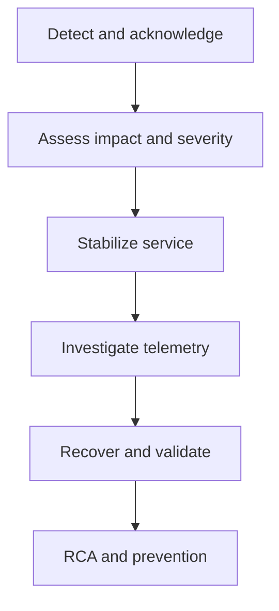
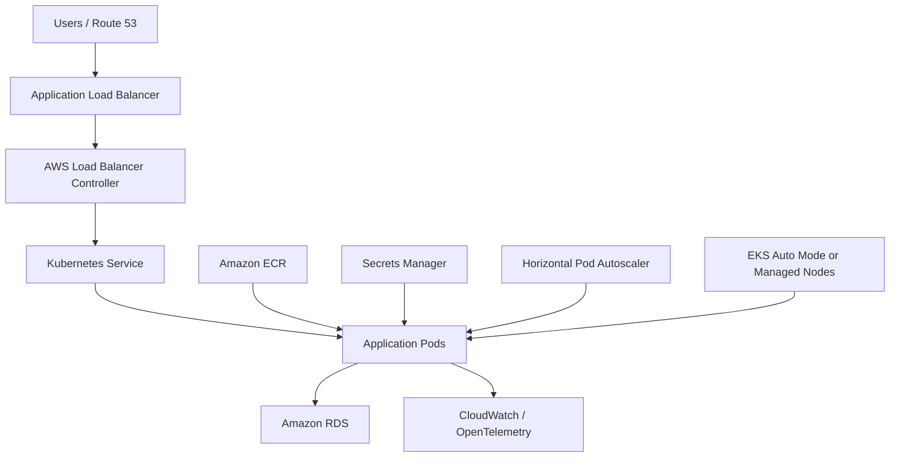

<a id="top"></a>

# 7-Eleven — Senior DevOps Engineer Interview Prep

Pulled from a shared ChatGPT conversation
(`chatgpt.com/share/6aa15989-0258-83e9-9486-0b362532ee03`, titled
"Migration to EKS"), produced by ChatGPT with live web search grounding
against AWS documentation. Covers the role/JD summary, an interview-prep
pass mapping the role to Gabriel O's background, and a separate
technical deep-dive on the ECS/Fargate → EKS migration itself. Saved
verbatim (light formatting only) for reference.

## Table of Contents

1. [Role Overview](#role-overview)
   - [Team Overview](#team-overview)
   - [Primary Responsibilities](#primary-responsibilities)
   - [Key Project / Application](#key-project--application)
   - [Cloud & Kubernetes Environment](#cloud--kubernetes-environment)
   - [Required Technical Skills](#required-technical-skills)
   - [Database Knowledge](#database-knowledge)
   - [RunOps / Production Support](#runops--production-support)
   - [Biggest DevOps Challenges / Initiatives](#biggest-devops-challenges--initiatives)
   - [Work Environment](#work-environment)
   - [Interview Process](#interview-process)
   - [Ideal Candidate Profile](#ideal-candidate-profile)
2. [Interview Prep](#interview-prep)
   - [Your strongest alignment](#your-strongest-alignment)
   - [60-second introduction](#60-second-introduction)
   - [How to discuss ECS/Fargate-to-EKS migration](#how-to-discuss-ecsfargate-to-eks-migration)
     - [Resource translation](#resource-translation)
   - [How Istio fits into the transformation](#how-istio-fits-into-the-transformation)
   - [Seven Rewards scaling scenario](#seven-rewards-scaling-scenario)
   - [Production incident response](#production-incident-response)
   - [New Relic preparation](#new-relic-preparation)
   - [Speedway migration answer](#speedway-migration-answer)
   - [Likely interview questions](#likely-interview-questions)
   - [Database knowledge answer](#database-knowledge-answer)
   - [Questions to ask the hiring manager](#questions-to-ask-the-hiring-manager)
3. [ECS/Fargate → EKS Migration — Technical Deep Dive](#ecsfargate--eks-migration--technical-deep-dive)
   - [Target architecture](#target-architecture)
   - [ECS-to-EKS resource mapping](#ecs-to-eks-resource-mapping)
   - [Recommended migration strategy](#recommended-migration-strategy)
     - [1. Assess the current ECS environment](#1-assess-the-current-ecs-environment)
     - [2. Build the EKS platform](#2-build-the-eks-platform)
     - [3. Convert each ECS workload](#3-convert-each-ecs-workload)
     - [4. Convert IAM permissions](#4-convert-iam-permissions)
     - [5. Update CI/CD](#5-update-cicd)
   - [Traffic cutover](#traffic-cutover)
   - [Rollback plan](#rollback-plan)
   - [Important risks](#important-risks)
   - [Success criteria](#success-criteria)

---

# Role Overview

**Role:** Senior DevOps Engineer
**Team:** Digital DevOps Team
**Status:** Proactive requirement; currently going through the approval process and not officially open yet.
**Work Arrangement:** **100% onsite, 5 days per week**
**Location:** Onsite
**Role Type:** 100% hands-on DevOps with approximately **75% DevOps / 25% RunOps**

## Team Overview

Well-established DevOps team.
Approximately **10–12 team members in the GCC** and around **10 team members in the U.S.**
The team is responsible for:
CI/CD pipelines
Cloud infrastructure
Production support and incident management
Monitoring and observability
Infrastructure scaling and troubleshooting

## Primary Responsibilities

Manage and develop **CI/CD pipelines**.
Build and maintain cloud infrastructure, primarily in **AWS**.
Support **Azure and GCP** environments as needed.
Develop Infrastructure as Code using **Terraform** or an equivalent tool.
Work extensively with **Kubernetes**.
Support the organization's migration from **ECS/Fargate to EKS**.
Work with **Istio** as part of the EKS transformation.
Create and maintain **New Relic dashboards**.
Monitor and troubleshoot infrastructure using **AWS CloudWatch**.
Troubleshoot production issues and support **P1/P2/P3 incidents**.
Work closely with application developers to troubleshoot infrastructure issues and resolve production problems quickly.
Support application releases from the infrastructure/DevOps side.
Help scale infrastructure for new features, promotions, and high-volume events.
Support cloud migration initiatives.

## Key Project / Application

**Seven Rewards**

Candidate will initially work primarily on **Seven Rewards**, a critical enterprise application.
Seven Rewards supports rewards functionality across multiple platforms.
The application has several upcoming new features and expansion initiatives.
Candidate will help with:
Infrastructure scaling
Setting up new infrastructure
Supporting new promotion events
Supporting the expansion associated with Speedway

**Speedway Cloud Migration**

Major initiative involves **migrating Speedway workloads from the data center to the cloud**.
Candidate will contribute to the migration and associated infrastructure setup.

## Cloud & Kubernetes Environment

**Primary Cloud:** AWS
**Secondary Clouds:** Azure and GCP
Current container environment:
**ECS**
**Fargate**
Target environment:
**Amazon EKS**
**Istio**
The organization is currently undergoing an **ECS/Fargate → EKS transformation**.

## Required Technical Skills

**Must Have**

Strong **AWS** experience
Strong **DevOps** experience
Hands-on **Kubernetes** experience
**EKS** experience is highly preferred/important
**Terraform** or equivalent Infrastructure as Code experience
Strong **CI/CD** experience
Production troubleshooting experience
**P1/P2/P3 incident management**
Monitoring/observability experience
**New Relic**
**AWS CloudWatch**
Ability to work in a hands-on environment

**Good to Have**

**Azure**
**GCP**
**Istio**
ECS/Fargate experience
Experience migrating **ECS to EKS**
DocumentDB
MongoDB
SQL Server
Postman
Experience supporting cloud/data-center migration projects

## Database Knowledge

Candidate does not need to be a database specialist.
Should have at least a **high-level understanding** of:
DocumentDB
MongoDB
SQL Server
The knowledge is primarily needed to support releases and infrastructure-related activities.

## RunOps / Production Support

RunOps is an important component of the role.
Approximate role split:
**75% DevOps**
**25% RunOps**
Candidate will participate in:
P1/P2/P3 incident management
Production troubleshooting
Infrastructure monitoring
Identifying infrastructure-related issues
Working with developers to resolve issues quickly
There may be an **on-call expectation** when needed.
Offshore team provides 24/7 coverage, so on-call responsibilities are expected to be limited/shared.
A company phone may be provided if required.

## Biggest DevOps Challenges / Initiatives

**ECS/Fargate to EKS migration**
Current environment is ECS/Fargate.
Organization is moving toward EKS with Istio.
**Speedway data-center-to-cloud migration**
Support migration of Speedway infrastructure/workloads to the cloud.
**Seven Rewards infrastructure scaling**
Support new features, promotions, and increased demand.
Provision and configure new infrastructure as required.
**Production reliability**
Troubleshoot P1/P2/P3 issues.
Improve monitoring and observability.
Help development teams resolve infrastructure-related problems quickly.
**Cloud infrastructure automation**
Build infrastructure using Terraform/IaC.
Improve automation and CI/CD processes.

## Work Environment

**5 days onsite**
All interview rounds are expected to be **in person**.
Highly hands-on role.
Candidate should be comfortable working directly with infrastructure, cloud platforms, Kubernetes, pipelines, monitoring, and production issues.

## Interview Process

The original plan was three rounds, but the hiring manager agreed to reduce it to **two rounds** to speed up the hiring process.

**Round 1**

Technical interview with hiring manager.

**Round 2**

Technical interview with multiple architects together on the same call.

**Goal:** Complete the technical evaluation efficiently rather than spreading interviews across multiple rounds/days.

## Ideal Candidate Profile

The ideal candidate is a **Senior DevOps Engineer who is heavily hands-on with AWS, Kubernetes/EKS, Terraform, and CI/CD**, and who also has strong production troubleshooting/RunOps experience.

A particularly strong candidate would have:

AWS + EKS
Kubernetes
Terraform
CI/CD
New Relic/CloudWatch
Production incident management
ECS/Fargate
ECS-to-EKS migration experience
Cloud migration experience
Strong troubleshooting skills
Experience supporting critical, high-volume applications

[⬆ Back to top](#top)

---

# Interview Prep

This Senior DevOps Engineer role is a strong match for your background, especially your AWS, Kubernetes/EKS, Terraform, CI/CD, observability, incident response, and FSx for Lustre production-support experience.

## Your strongest alignment

| Requirement | Your relevant experience |
|---|---|
| AWS infrastructure | EC2, EKS, ECS, ALB, Route 53, IAM, VPC, RDS, S3, CloudWatch, Organizations and Control Tower |
| Kubernetes/EKS | EKS operations, deployments, services, ingress, ALB integration, upgrades, troubleshooting and Argo CD |
| ECS/Fargate → EKS | Container-platform design, ECS/Fargate, EKS, ECR, Kubernetes manifests and migration planning |
| Terraform | Reusable modules, multi-environment deployments, remote state, landing zones and GitHub OIDC |
| CI/CD | GitHub Actions, Jenkins, GitLab CI, Azure DevOps, security scans and approval gates |
| Observability | CloudWatch, Prometheus, Grafana, ELK/OpenSearch, Loki and Fluent Bit |
| Production support | Alarm response, incident troubleshooting, root-cause analysis, Linux diagnostics and infrastructure recovery |
| Scaling | ASG, load balancing, Kubernetes autoscaling, multi-AZ design and high-performance workloads |
| Multi-cloud | AWS primarily, with Azure and GCP experience |
| Cloud migration | Hybrid-cloud architecture, workload assessment, migration roadmaps and DR planning |

The main area to strengthen before the interview is **New Relic**, followed by hands-on **Istio** terminology and design patterns.

[⬆ Back to top](#top)

## 60-second introduction

> I'm a hands-on Senior Cloud and DevOps Engineer with more than five years of experience supporting Linux, cloud infrastructure, automation, CI/CD, observability, and production environments. My primary strength is AWS, where I've used Terraform to build secure, scalable infrastructure and implemented delivery pipelines with GitHub Actions, Jenkins, GitLab, and Azure DevOps. I also have strong experience with Kubernetes and EKS, including container deployment, ingress and ALB integration, IAM, monitoring, troubleshooting, and GitOps with Argo CD.
>
> A major part of my experience involves production reliability—responding to infrastructure incidents, analyzing CloudWatch and operating-system telemetry, automating recovery, and working with application teams to identify root causes. This opportunity is especially relevant because it combines AWS, EKS transformation, Terraform, CI/CD, observability, and operational support for critical, high-volume applications.

[⬆ Back to top](#top)

## How to discuss ECS/Fargate-to-EKS migration

A strong interview answer:

> I would approach the ECS/Fargate-to-EKS migration incrementally rather than as a big-bang replacement. I would first inventory the ECS services, task definitions, IAM roles, networking, secrets, health checks, scaling policies, load balancers, service dependencies, and operational baselines. The existing images could remain in ECR, but I would translate the ECS task definitions and services into Kubernetes Deployments, Services, ConfigMaps, secrets integrations, autoscaling policies, disruption budgets, and Istio routing policies.
>
> I would provision EKS through Terraform, establish namespaces and RBAC, configure pod-level IAM, load balancing, secrets, logging, monitoring, and cluster autoscaling, and then deploy each service through the CI/CD or GitOps pipeline. ECS and EKS would run in parallel while traffic is shifted gradually using weighted routing or controlled load-balancer rules. Throughout the migration, I would compare latency, errors, resource utilization, application health, and business transactions against the ECS baseline, with ECS retained as the rollback target until EKS completes its stability period.

### Resource translation

| ECS/Fargate | EKS |
|---|---|
| Task definition | Deployment or StatefulSet |
| ECS service | Deployment and Service |
| Desired task count | Pod replicas |
| Task CPU/memory | Resource requests and limits |
| Task IAM role | EKS Pod Identity or IRSA |
| Execution role | Node/infrastructure permissions |
| ALB listener rules | Kubernetes Ingress or Istio Gateway |
| Service discovery | Kubernetes Service and CoreDNS |
| Auto Scaling policy | HPA, Karpenter or EKS Auto Mode |
| CloudWatch log driver | Fluent Bit, ADOT or New Relic agent |
| Secrets Manager entry | CSI Secrets Store or External Secrets |
| ECS deployment rollback | Kubernetes rollout or GitOps rollback |

[⬆ Back to top](#top)

## How Istio fits into the transformation

Istio adds a service-mesh layer to EKS.

You should be ready to discuss:

- Istio Gateway for inbound traffic
- VirtualService for application routing
- DestinationRule for subsets and traffic policies
- Mutual TLS between services
- Canary and blue-green deployments
- Retries, timeouts and circuit breaking
- Service-to-service authorization
- Distributed tracing and telemetry
- Sidecar-resource overhead
- Avoiding retry storms during incidents

A concise answer:

> I would use Istio to standardize service-to-service security, observability, and traffic management inside EKS. It can support mutual TLS, canary releases, weighted routing, retries, timeouts, authorization policies, and distributed tracing without requiring every application team to implement those capabilities independently. I would introduce it carefully because incorrect retry, timeout, or sidecar-resource configurations can create production problems.

[⬆ Back to top](#top)

## Seven Rewards scaling scenario

Expect questions about preparing the application for a major promotion.

Your approach should include:

1. Review historical traffic, request rate, latency, database connections and failure patterns.
2. Conduct load and performance testing using realistic promotion traffic.
3. Configure HPA based on CPU, memory or application metrics.
4. Ensure sufficient node, subnet-IP and load-balancer capacity.
5. Validate database capacity, connection pooling and caching.
6. Pre-scale critical services where reactive scaling would be too slow.
7. Build New Relic and CloudWatch dashboards for technical and business metrics.
8. Define alert thresholds, ownership and incident escalation.
9. Conduct a readiness review and rollback exercise.
10. Monitor the event through a production command center.

Strong answer:

> For a major Seven Rewards promotion, I would not rely only on reactive autoscaling. I would review historical and forecast traffic, conduct load testing, validate downstream dependencies, and pre-scale critical components before the event. I would monitor infrastructure metrics such as pod utilization, node capacity, ALB errors and database connections, as well as business metrics such as reward requests, successful transactions and failed redemptions.

[⬆ Back to top](#top)

## Production incident response

Use this structure for P1/P2/P3 questions:



### P1 example answer

> During a P1 incident, my first objective is to reduce customer impact, not immediately prove the root cause. I acknowledge the incident, determine the affected services and business functions, engage the appropriate application and infrastructure owners, and establish a clear communication channel. I use CloudWatch, New Relic, Kubernetes events, pod logs, deployment history, load-balancer health, database metrics, and recent-change information to narrow the failure domain.
>
> Depending on the evidence, stabilization could involve rolling back a release, scaling a service, replacing unhealthy pods or nodes, failing over, or temporarily disabling a problematic feature. After recovery, I validate both technical health and actual business transactions, document the timeline and root cause, and create follow-up actions such as better alarms, automated remediation, capacity changes or pipeline controls.

[⬆ Back to top](#top)

## New Relic preparation

Be prepared to explain how you would create dashboards for:

- Throughput and request rate
- Response-time percentiles: p50, p95 and p99
- Error percentage
- Apdex
- Kubernetes pod and node health
- Container CPU and memory
- Pod restarts and unavailable replicas
- ALB response codes and target health
- Database response time and connection utilization
- External-service calls
- Distributed traces
- Deployment markers
- Business metrics such as reward-processing success

Example NRQL:

```sql
SELECT rate(count(*), 1 minute)
FROM Transaction
WHERE appName = 'seven-rewards'
TIMESERIES
```

```sql
SELECT percentile(duration, 50, 95, 99)
FROM Transaction
WHERE appName = 'seven-rewards'
TIMESERIES
```

```sql
SELECT percentage(count(*), WHERE error IS true)
FROM Transaction
WHERE appName = 'seven-rewards'
TIMESERIES
```

[⬆ Back to top](#top)

## Speedway migration answer

> For the Speedway data-center-to-cloud migration, I would begin with application discovery and dependency mapping, including network flows, identity, DNS, certificates, databases, storage, middleware, batch processes, performance requirements, and recovery objectives. I would classify workloads using migration strategies such as rehost, replatform or refactor and establish the AWS landing-zone, connectivity, security and observability foundations before moving production workloads.
>
> I would use Terraform to create repeatable environments and migrate in waves, starting with lower-risk dependencies. Each wave would include functional, performance, security, failover and rollback testing. For containerized applications, I would deploy them to EKS through the standard CI/CD platform and use controlled traffic migration before decommissioning the data-center workload.

[⬆ Back to top](#top)

## Likely interview questions

### 1. Why move from ECS/Fargate to EKS?

> EKS provides greater portability, broader Kubernetes ecosystem integration, more advanced scheduling, extensibility through operators, stronger GitOps alignment, and service-mesh capabilities such as Istio. The tradeoff is additional operational complexity, so the migration must include cluster lifecycle management, security, observability, governance and Kubernetes expertise.

### 2. How would you secure EKS?

> I would use private endpoints where appropriate, least-privilege EKS access entries and RBAC, Pod Identity for workload permissions, KMS encryption, Secrets Manager integration, network policies, Pod Security Admission, image scanning, admission controls, restricted security groups, audit logging and automated compliance checks in CI/CD.

### 3. How do you troubleshoot a pod that is not receiving traffic?

Check:

- Pod status and events
- Readiness probe
- Service selectors
- EndpointSlice membership
- Container port versus target port
- Network policy
- Istio sidecar and authorization policies
- Ingress or Gateway routing
- ALB target health
- Security groups and subnet routing
- Application logs

### 4. How do you manage Terraform across environments?

> I use reusable modules with separate environment configurations and isolated remote state. Changes move through pull requests, formatting, validation, security scanning and Terraform plans before approval and apply. Production uses tighter branch protection, approval gates, least-privilege OIDC roles and controlled state access.

### 5. How do you prevent failed releases?

> I use automated tests, static analysis, image and IaC scanning, immutable artifacts, environment promotion, approval gates, readiness probes, canary or blue-green deployment, database compatibility checks, automated smoke tests and clearly tested rollback procedures.

### 6. How do CloudWatch and New Relic work together?

> CloudWatch provides AWS-native infrastructure metrics, logs, events and alarms, while New Relic provides a consolidated application-performance and distributed-observability view. I would correlate application traces and transactions in New Relic with AWS infrastructure signals from CloudWatch to determine whether an incident originates in the application, Kubernetes platform, AWS service or downstream dependency.

[⬆ Back to top](#top)

## Database knowledge answer

> I am not positioning myself as a database administrator, but I understand the infrastructure and release considerations for DocumentDB, MongoDB and SQL Server. I can support secure connectivity, secrets, backups, monitoring, parameter configuration, connection pooling, high availability, scaling, release validation and troubleshooting. For schema or engine-level changes, I would work closely with the application and database teams.

[⬆ Back to top](#top)

## Questions to ask the hiring manager

- What is the current stage of the ECS/Fargate-to-EKS migration?
- Is the EKS platform using managed node groups, Karpenter, Auto Mode or EKS Fargate?
- Is Istio already deployed, or will this engineer help design its implementation?
- What are the largest Seven Rewards traffic events and scaling bottlenecks?
- How are New Relic and CloudWatch divided across infrastructure and application monitoring?
- What is the current CI/CD and GitOps toolchain?
- How frequently does the U.S. team participate in on-call support?
- What is the exact onsite location and expected start timeline once approval is complete?

One important practical point: because this role requires **five days onsite and in-person interviews**, confirm the exact location before investing heavily in the process. Everything else aligns closely with your profile.

[⬆ Back to top](#top)

---

# ECS/Fargate → EKS Migration — Technical Deep Dive

Migration is primarily an **orchestrator conversion**, not an application rewrite. Your existing container images can usually remain in Amazon ECR, while ECS task definitions, services, IAM task roles, scaling policies, and load-balancer configurations are translated into Kubernetes resources.

## Target architecture



For a new migration, consider **EKS Auto Mode** or EKS managed node groups. Auto Mode reduces management of nodes, networking, load balancing, and storage, while managed node groups provide more direct control. EKS on Fargate is also possible, but it has Kubernetes feature and workload limitations; AWS currently positions Auto Mode as the preferred direction for managed EKS compute.

[⬆ Back to top](#top)

## ECS-to-EKS resource mapping

| ECS/Fargate component | Amazon EKS equivalent |
|---|---|
| ECS cluster | EKS cluster |
| Task definition | Deployment, StatefulSet, Job, or CronJob |
| Container definition | Pod container specification |
| ECS service | Kubernetes Deployment plus Service |
| Desired task count | Deployment `replicas` |
| Fargate task CPU/memory | Pod resource requests and limits |
| Task execution role | Node role or infrastructure-specific role |
| Task IAM role | EKS Pod Identity or IRSA role |
| ECS service discovery | Kubernetes Service and CoreDNS |
| ALB listener rule | Ingress |
| Network Load Balancer | `Service` type `LoadBalancer` |
| ECS Service Auto Scaling | Horizontal Pod Autoscaler |
| Capacity provider | Auto Mode NodePool, managed node group, Karpenter, or Fargate profile |
| CloudWatch log configuration | Fluent Bit, CloudWatch Observability, or ADOT |
| Secrets Manager reference | Secrets Store CSI Driver or External Secrets |
| ECS deployment circuit breaker | Kubernetes rollout health plus GitOps rollback |
| ECS Exec | `kubectl exec`, preferably controlled and audited |

[⬆ Back to top](#top)

## Recommended migration strategy

Use a **parallel, service-by-service migration** instead of replacing the entire ECS environment at once.

### 1. Assess the current ECS environment

Inventory:

- ECS clusters, services, task definitions and scheduled tasks
- ECR images and image architectures
- CPU, memory, ephemeral storage and scaling patterns
- Application ports, health checks and dependencies
- ALB/NLB listeners, host rules, path rules and target groups
- Task roles and execution roles
- Secrets Manager and Parameter Store dependencies
- EFS volumes or other persistent storage
- CloudWatch logs, metrics and alarms
- Service Connect, Cloud Map and internal DNS dependencies

Also identify applications that maintain local state. Containers using ephemeral Fargate storage must not assume that files will survive pod rescheduling.

### 2. Build the EKS platform

Provision the platform using Terraform:

- EKS control plane across multiple Availability Zones
- Private worker subnets
- EKS Auto Mode or managed node groups
- EKS access entries and Kubernetes RBAC
- VPC CNI, CoreDNS and kube-proxy where applicable
- AWS Load Balancer Controller
- EBS and EFS CSI drivers where required
- EKS Pod Identity Agent
- Metrics Server
- CloudWatch Observability or ADOT
- External DNS if Route 53 records should be automated
- Secrets Store CSI Driver or External Secrets
- Argo CD for GitOps deployments
- Pod Security Admission and network policies

The AWS Load Balancer Controller provisions AWS load balancers from Kubernetes resources and should replace manually managed ECS target-group attachment.

### 3. Convert each ECS workload

A typical ECS web service becomes:

- `Namespace`
- `ServiceAccount`
- `ConfigMap`
- `SecretProviderClass` or `ExternalSecret`
- `Deployment`
- `Service`
- `Ingress`
- `HorizontalPodAutoscaler`
- `PodDisruptionBudget`

Example deployment:

```yaml
apiVersion: apps/v1
kind: Deployment
metadata:
  name: todo-backend
  namespace: production
spec:
  replicas: 3
  selector:
    matchLabels:
      app: todo-backend
  template:
    metadata:
      labels:
        app: todo-backend
    spec:
      serviceAccountName: todo-backend
      containers:
        - name: backend
          image: ACCOUNT_ID.dkr.ecr.us-east-1.amazonaws.com/todo-backend:1.0.0
          ports:
            - containerPort: 8000
          resources:
            requests:
              cpu: 250m
              memory: 512Mi
            limits:
              cpu: "1"
              memory: 1Gi
          readinessProbe:
            httpGet:
              path: /health
              port: 8000
            initialDelaySeconds: 10
            periodSeconds: 10
          livenessProbe:
            httpGet:
              path: /health
              port: 8000
            initialDelaySeconds: 30
            periodSeconds: 20
          env:
            - name: ENVIRONMENT
              value: production
```

Internal service:

```yaml
apiVersion: v1
kind: Service
metadata:
  name: todo-backend
  namespace: production
spec:
  selector:
    app: todo-backend
  ports:
    - port: 80
      targetPort: 8000
  type: ClusterIP
```

ALB ingress:

```yaml
apiVersion: networking.k8s.io/v1
kind: Ingress
metadata:
  name: todo-backend
  namespace: production
  annotations:
    alb.ingress.kubernetes.io/scheme: internet-facing
    alb.ingress.kubernetes.io/target-type: ip
    alb.ingress.kubernetes.io/healthcheck-path: /health
spec:
  ingressClassName: alb
  rules:
    - host: api.example.com
      http:
        paths:
          - path: /
            pathType: Prefix
            backend:
              service:
                name: todo-backend
                port:
                  number: 80
```

### 4. Convert IAM permissions

Do not attach all application permissions to the EKS node role.

Create a Kubernetes service account for every application and associate it with a least-privilege IAM role using **EKS Pod Identity**:

```bash
aws eks create-pod-identity-association \
  --cluster-name production-eks \
  --namespace production \
  --service-account todo-backend \
  --role-arn arn:aws:iam::123456789012:role/todo-backend-pod-role
```

EKS Pod Identity associates an IAM role with a Kubernetes service account, allowing the pod to obtain AWS credentials without storing static access keys. AWS recommends separate roles for individual applications.

### 5. Update CI/CD

A practical pipeline becomes:

```text
Code commit
   ↓
Unit and integration tests
   ↓
SonarQube / SAST
   ↓
Build container
   ↓
Trivy image scan
   ↓
Push versioned image to ECR
   ↓
Checkov/Kubeconform manifest validation
   ↓
Update Helm values or Kustomize overlay
   ↓
Argo CD synchronizes EKS
   ↓
Smoke test and rollout validation
```

Use immutable image tags such as the Git commit SHA. Avoid deploying `latest`, because it makes audit, promotion, and rollback unreliable.

[⬆ Back to top](#top)

## Traffic cutover

Use weighted Route 53 records or controlled ALB routing:

| Stage | ECS traffic | EKS traffic |
|---|---:|---:|
| Initial validation | 100% | 0% |
| Canary | 95% | 5% |
| Early migration | 75% | 25% |
| Expanded migration | 50% | 50% |
| Final validation | 0% | 100% |

Monitor during every step:

- HTTP 4xx and 5xx errors
- Response latency
- Pod restarts and pending pods
- CPU and memory saturation
- ALB healthy-host count
- Database connections
- Application-specific transaction failures

For internal services, migrate consumers in controlled groups or use a common Route 53/Cloud Map name that can be redirected.

[⬆ Back to top](#top)

## Rollback plan

Keep ECS operational until EKS has passed the agreed stability period.

Rollback should consist of:

1. Restore Route 53 or ALB traffic to ECS.
2. Pause the EKS rollout.
3. Run `kubectl rollout undo deployment/<name>`.
4. Review pod events, controller logs and application telemetry.
5. Correct the manifest or image before retrying.

Do not introduce an incompatible database schema during the first cutover. Use backward-compatible, expand-and-contract database migrations so ECS and EKS versions can run simultaneously.

[⬆ Back to top](#top)

## Important risks

- **Resource sizing:** ECS task CPU and memory do not translate perfectly to Kubernetes requests and limits.
- **IAM exposure:** Over-permissioned node roles can grant unintended AWS access to pods.
- **Probe configuration:** Incorrect readiness probes can send traffic too early or remove healthy pods.
- **Availability:** Configure multiple replicas, topology spread constraints and PodDisruptionBudgets.
- **IP exhaustion:** EKS pods consume VPC networking capacity; check subnet sizes before migration.
- **Stateful workloads:** Validate EBS/EFS access modes, Availability Zone placement, backups and restore procedures.
- **Operational overhead:** EKS introduces Kubernetes upgrades, add-on compatibility, RBAC, scheduling and policy management.
- **Cost:** Include the EKS control plane, EC2/Auto Mode compute, load balancers, NAT gateways, logs and observability—not just pod CPU and memory.

AWS recommends phased or blue-green Kubernetes migrations and installing all required controllers and CRDs before workloads that depend on them.

[⬆ Back to top](#top)

## Success criteria

The migration is complete when:

- All services run with the required replica count across Availability Zones.
- Load balancer and Kubernetes health checks pass.
- EKS meets or exceeds the ECS latency and error-rate baseline.
- Pod Identity permissions have been validated.
- Scaling, node replacement and pod disruption tests pass.
- Logging, metrics, alarms and tracing are operational.
- Backup and rollback procedures have been tested.
- ECS receives no production traffic for the stability period.
- ECS services, task definitions and obsolete infrastructure are then decommissioned through Terraform.

[⬆ Back to top](#top)
