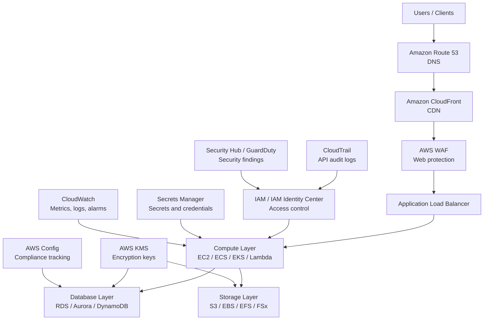
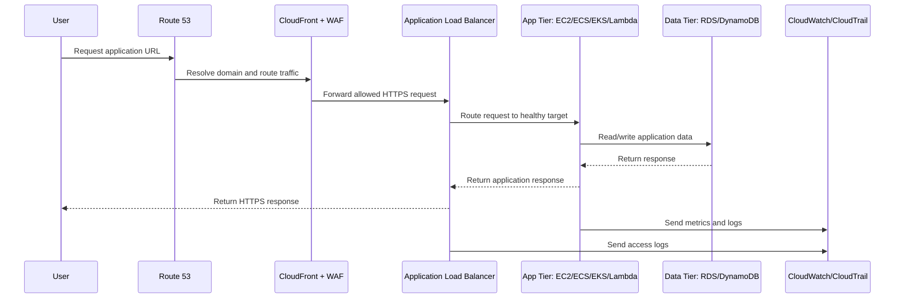
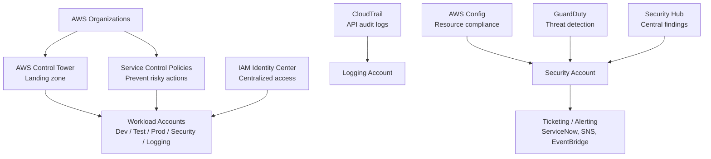

# AWS Services — Exam & Interview Ready Guide

## Overview

AWS provides cloud services used to design, deploy, secure, monitor, and scale modern applications. These services are grouped into categories such as compute, storage, database, networking, security, monitoring, DevOps, analytics, AI/ML, migration, and cost management.

A strong AWS engineer should understand what each service does, when to use it, and how it fits into a secure, scalable, highly available cloud architecture.

---

## AWS Services Architecture Diagram

---

## Secure 3-Tier AWS Application Flow

---

## AWS DevOps Deployment Flow

```mermaid
flowchart LR
    Dev[Developer] --> Git[GitHub / CodeCommit]
    Git --> CI["CI Pipeline<br/>GitHub Actions / CodeBuild"]
    CI --> Scan["Security Checks<br/>SAST, IaC scan, dependency scan"]
    Scan --> Build["Build Artifact<br/>Container image or package"]
    Build --> ECR[Amazon ECR / S3 Artifact Bucket]
    ECR --> Deploy["Deploy<br/>ECS / EKS / Lambda / EC2"]
    Deploy --> Monitor["CloudWatch + X-Ray<br/>Monitoring and tracing"]
    Monitor --> Feedback[Feedback to team]
```

---

## AWS Security and Governance Flow

---

## 1. Compute Services

| Service | What It Does | Common Use Case |
|---|---|---|
| Amazon EC2 | Provides virtual servers in the cloud | Hosting applications, web servers, databases, and custom workloads |
| AWS Lambda | Runs code without managing servers | Event-driven automation, APIs, file processing, scheduled jobs |
| Amazon ECS | Container orchestration service | Running Docker containers on AWS |
| Amazon EKS | Managed Kubernetes service | Kubernetes-based container workloads |
| AWS Fargate | Serverless compute for containers | Running ECS/EKS containers without managing EC2 instances |
| Amazon Lightsail | Simplified virtual private server platform | Small websites, blogs, simple applications |
| AWS Batch | Runs batch computing workloads | Large-scale processing, rendering, scientific workloads |

### Interview Keyword
Use **EC2** when you need control over servers, **Lambda** for event-driven serverless workloads, **Fargate** for serverless containers, and **EKS** when Kubernetes is required.

---

## 2. Storage Services

| Service | What It Does | Common Use Case |
|---|---|---|
| Amazon S3 | Object storage service | Backups, logs, data lakes, static websites |
| Amazon EBS | Block storage for EC2 | Boot volumes, databases, application disks |
| Amazon EFS | Managed NFS file system | Shared Linux storage across EC2/EKS |
| Amazon FSx | Managed high-performance file systems | Windows File Server, Lustre, NetApp ONTAP, OpenZFS |
| AWS Backup | Centralized backup service | Backup EC2, EBS, RDS, DynamoDB, and EFS |
| Amazon S3 Glacier | Low-cost archive storage | Long-term backup and compliance archive |
| AWS Storage Gateway | Hybrid cloud storage service | Connect on-premises storage to AWS |

### Interview Keyword
Use **S3** for object storage, **EBS** for EC2 block storage, **EFS** for shared Linux file storage, and **FSx** for managed high-performance file systems.

---

## 3. Database Services

| Service | What It Does | Common Use Case |
|---|---|---|
| Amazon RDS | Managed relational database service | MySQL, PostgreSQL, SQL Server, Oracle, MariaDB |
| Amazon Aurora | High-performance managed relational database | Enterprise MySQL/PostgreSQL workloads |
| Amazon DynamoDB | Serverless NoSQL database | High-scale key-value and document workloads |
| Amazon Redshift | Data warehouse service | Analytics and reporting |
| Amazon ElastiCache | In-memory caching service | Redis/Memcached caching |
| Amazon DocumentDB | MongoDB-compatible database | Document-based applications |
| Amazon Neptune | Graph database service | Fraud detection, social graphs, recommendations |
| Amazon Timestream | Time-series database | IoT, monitoring, and metrics data |

### Interview Keyword
Use **RDS/Aurora** for relational workloads, **DynamoDB** for NoSQL scale, **Redshift** for analytics, and **ElastiCache** for low-latency caching.

---

## 4. Networking and Content Delivery

| Service | What It Does | Common Use Case |
|---|---|---|
| Amazon VPC | Creates an isolated private network in AWS | Network segmentation and workload isolation |
| Subnets | Divide a VPC IP range | Public and private workload placement |
| Route Tables | Control network traffic routing | Route traffic to internet gateways, NAT gateways, or transit gateways |
| Internet Gateway | Allows internet access for public subnets | Public-facing resources |
| NAT Gateway | Provides outbound internet access for private subnets | Private EC2 patching and updates |
| Elastic Load Balancing | Distributes traffic across targets | High availability applications |
| Amazon Route 53 | DNS and domain routing service | Domain registration, DNS routing, health checks |
| Amazon CloudFront | Content delivery network | Faster global content delivery |
| AWS Transit Gateway | Centralized network hub | Connect multiple VPCs and on-premises networks |
| AWS Direct Connect | Dedicated private connection to AWS | Hybrid cloud connectivity |
| AWS VPN | Encrypted network connection | Site-to-site VPN and client VPN access |

### Interview Keyword
A secure AWS network usually includes **VPC, public/private subnets, route tables, security groups, NACLs, NAT Gateway, ALB, and Route 53**.

---

## 5. Security, Identity, and Compliance

| Service | What It Does | Common Use Case |
|---|---|---|
| AWS IAM | Manages users, roles, groups, and policies | Access control and least privilege |
| IAM Identity Center | Centralized workforce access | Single sign-on across AWS accounts |
| AWS Organizations | Multi-account management service | Account governance and consolidated billing |
| AWS Control Tower | Landing zone automation | Secure multi-account setup |
| AWS KMS | Encryption key management | Encrypt S3, EBS, RDS, Lambda, and Secrets Manager |
| AWS Secrets Manager | Securely stores secrets | Database passwords, API keys, credentials |
| AWS Certificate Manager | Manages TLS/SSL certificates | HTTPS for ALB, CloudFront, and API Gateway |
| Amazon GuardDuty | Threat detection service | Detect suspicious AWS activity |
| AWS Security Hub | Centralized security findings | Security posture management |
| Amazon Inspector | Vulnerability scanning | EC2, ECR, and Lambda scanning |
| AWS WAF | Web application firewall | Protect applications from web attacks |
| AWS Shield | DDoS protection | Protect internet-facing applications |
| AWS Config | Tracks resource configuration | Compliance and audit checks |
| AWS CloudTrail | Records AWS API activity | Governance, auditing, and investigations |

### Interview Keyword
Security in AWS starts with **IAM least privilege, MFA, encryption with KMS, CloudTrail logging, Config compliance, GuardDuty, and Security Hub**.

---

## 6. Monitoring, Management, and Governance

| Service | What It Does | Common Use Case |
|---|---|---|
| Amazon CloudWatch | Collects metrics, logs, and alarms | Monitoring EC2, Lambda, RDS, and applications |
| AWS CloudTrail | Tracks API activity | Audit and incident investigation |
| AWS Config | Tracks configuration history | Compliance and drift detection |
| AWS Systems Manager | Operational management service | Patch Manager, Session Manager, Run Command |
| AWS Trusted Advisor | Best-practice checks | Cost, security, performance, fault tolerance |
| AWS Health Dashboard | AWS service health visibility | Account-specific service events |
| AWS Service Catalog | Approved self-service templates | Enterprise provisioning governance |
| AWS License Manager | Tracks software licenses | License compliance management |
| AWS Compute Optimizer | Provides right-sizing recommendations | Cost and performance optimization |

### Interview Keyword
For cloud operations, combine **CloudWatch for monitoring, CloudTrail for auditing, Config for compliance, and Systems Manager for patching and automation**.

---

## 7. DevOps and Developer Tools

| Service | What It Does | Common Use Case |
|---|---|---|
| AWS CodeCommit | Managed Git repository service | Source code hosting |
| AWS CodeBuild | Managed build service | Compile, test, and package code |
| AWS CodeDeploy | Deployment automation service | Deploy applications to EC2, ECS, Lambda, or on-premises |
| AWS CodePipeline | CI/CD orchestration service | Automate release pipelines |
| AWS CloudFormation | Infrastructure as Code service | Provision AWS resources using templates |
| AWS CDK | IaC using programming languages | Define infrastructure with Python, TypeScript, Java, etc. |
| Amazon ECR | Container image registry | Store Docker images |
| AWS X-Ray | Distributed tracing service | Troubleshoot microservices and APIs |

### Interview Keyword
A common CI/CD pipeline uses **GitHub or CodeCommit → CodeBuild → ECR → ECS/EKS/Lambda deployment**, with security scanning and approval gates.

---

## 8. Migration and Hybrid Cloud

| Service | What It Does | Common Use Case |
|---|---|---|
| AWS Migration Hub | Tracks migrations | Central migration dashboard |
| AWS Application Migration Service | Server migration service | Lift-and-shift migration to AWS |
| AWS Database Migration Service | Database migration service | Migrate Oracle, SQL Server, MySQL, PostgreSQL |
| AWS DataSync | Data transfer service | Move data between on-premises and AWS |
| AWS Transfer Family | Managed SFTP/FTPS/FTP service | Secure file transfers |
| AWS Snow Family | Offline data transfer devices | Large-scale data migration |
| AWS Outposts | AWS infrastructure on-premises | Hybrid cloud workloads |
| AWS Direct Connect | Dedicated private network connection | Hybrid cloud connectivity |

### Interview Keyword
Use **DMS** for databases, **DataSync** for file/object data, **Application Migration Service** for servers, and **Direct Connect/VPN** for hybrid connectivity.

---

## 9. Analytics and Data Services

| Service | What It Does | Common Use Case |
|---|---|---|
| Amazon Athena | Query S3 data using SQL | Serverless log and data analysis |
| AWS Glue | ETL and data catalog service | Prepare data for analytics |
| Amazon EMR | Big data processing platform | Spark and Hadoop workloads |
| Amazon Kinesis | Real-time streaming service | Logs, clickstreams, IoT data |
| Amazon OpenSearch Service | Search and log analytics | Centralized logging and search |
| Amazon QuickSight | Business intelligence service | Dashboards and reporting |
| AWS Lake Formation | Data lake governance service | Secure data lake setup |
| Amazon MSK | Managed Apache Kafka service | Event streaming platform |

### Interview Keyword
A common AWS data lake design uses **S3, Glue Data Catalog, Lake Formation, Athena, Redshift, and QuickSight**.

---

## 10. AI, ML, and Generative AI

| Service | What It Does | Common Use Case |
|---|---|---|
| Amazon SageMaker | Build, train, and deploy ML models | Machine learning lifecycle management |
| Amazon Bedrock | Generative AI foundation model service | AI assistants, chatbots, content generation |
| Amazon Q | AI assistant for business and development | Developer and enterprise productivity |
| Amazon Rekognition | Image and video analysis | Object and face detection |
| Amazon Comprehend | Natural language processing | Sentiment and text analysis |
| Amazon Textract | Extracts text from documents | OCR and forms processing |
| Amazon Lex | Conversational chatbot service | Chatbots and voice bots |
| Amazon Polly | Text-to-speech service | Voice applications |
| Amazon Transcribe | Speech-to-text service | Audio transcription |
| Amazon Translate | Language translation service | Multilingual applications |

### Interview Keyword
Use **Bedrock** for generative AI applications, **SageMaker** for custom ML model lifecycle, and **Lex/Polly/Transcribe** for conversational AI.

---

## 11. Application Integration

| Service | What It Does | Common Use Case |
|---|---|---|
| Amazon SQS | Message queue service | Decouple application components |
| Amazon SNS | Pub/sub notification service | Fan-out messaging and alerts |
| Amazon EventBridge | Event bus service | Event-driven architecture |
| AWS Step Functions | Workflow orchestration service | Multi-step business processes |
| Amazon API Gateway | Managed API front door | REST, HTTP, and WebSocket APIs |
| AWS AppSync | Managed GraphQL API service | Real-time web and mobile applications |
| Amazon MQ | Managed message broker | ActiveMQ and RabbitMQ migration |

### Interview Keyword
Use **SQS** for queueing, **SNS** for notifications, **EventBridge** for event routing, and **Step Functions** for workflow orchestration.

---

## 12. Cost Management

| Service | What It Does | Common Use Case |
|---|---|---|
| AWS Cost Explorer | Cost analysis service | View and forecast AWS spend |
| AWS Budgets | Budget alert service | Notify when spend exceeds limits |
| AWS Cost and Usage Report | Detailed billing report | FinOps reporting and analysis |
| Savings Plans | Discounted compute pricing | Reduce EC2, Lambda, and Fargate cost |
| Reserved Instances | Commitment-based discounts | Lower EC2 and RDS cost |
| AWS Pricing Calculator | Cost estimation tool | Estimate architecture cost before deployment |

### Interview Keyword
FinOps in AWS includes **tagging, budgets, cost allocation tags, Cost Explorer, CUR, Savings Plans, and right-sizing**.

---

## Most Important AWS Services to Know First

1. IAM
2. VPC
3. EC2
4. S3
5. EBS
6. EFS
7. RDS
8. DynamoDB
9. Lambda
10. CloudWatch
11. CloudTrail
12. Route 53
13. Elastic Load Balancing
14. Auto Scaling
15. KMS
16. Secrets Manager
17. ECS
18. EKS
19. CloudFormation
20. Systems Manager
21. AWS Organizations
22. AWS Control Tower

---

## Simple Interview Answer

AWS services are cloud-based building blocks used to design, deploy, secure, monitor, and scale applications. The major service categories include compute, storage, databases, networking, security, monitoring, DevOps, analytics, AI/ML, and cost management.

For example, **EC2** provides virtual servers, **S3** provides object storage, **RDS** provides managed relational databases, **VPC** provides network isolation, **IAM** manages access control, and **CloudWatch** provides monitoring and alarms.

A well-designed AWS solution combines these services to achieve scalability, high availability, security, automation, and cost optimization.

---

## Daily Learning Notes

### What to Practice

- Create an EC2 instance in a public subnet.
- Create an S3 bucket with encryption enabled.
- Create IAM users, groups, roles, and policies.
- Build a VPC with public and private subnets.
- Create a CloudWatch alarm for EC2 CPU utilization.
- Deploy a simple application using ECS or EKS.
- Create an RDS database in a private subnet.
- Use Systems Manager Session Manager instead of SSH.
- Enable CloudTrail and AWS Config for governance.
- Review costs using AWS Cost Explorer and Budgets.

### Key Architecture Principle

A strong AWS architecture should be:

- Secure
- Highly available
- Fault tolerant
- Scalable
- Automated
- Observable
- Cost optimized

