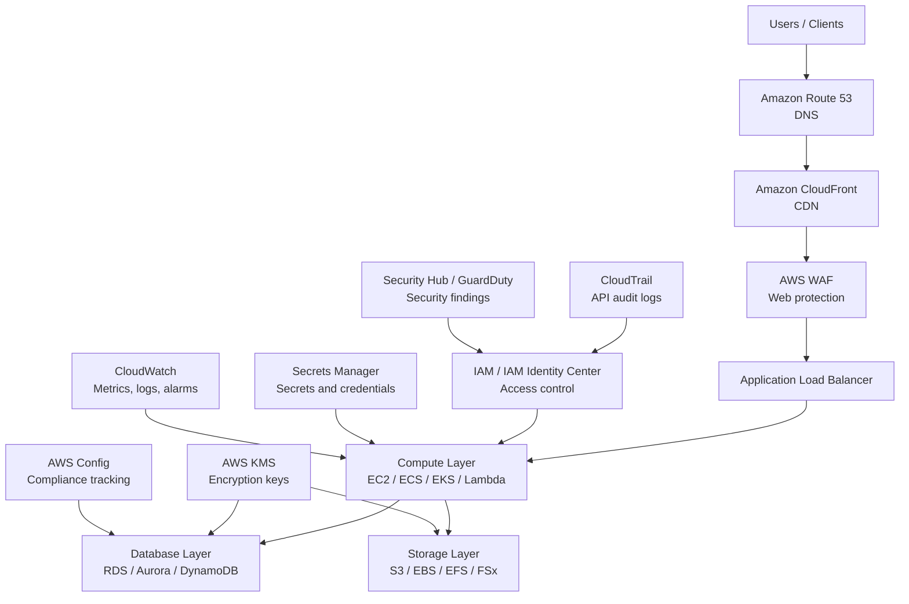
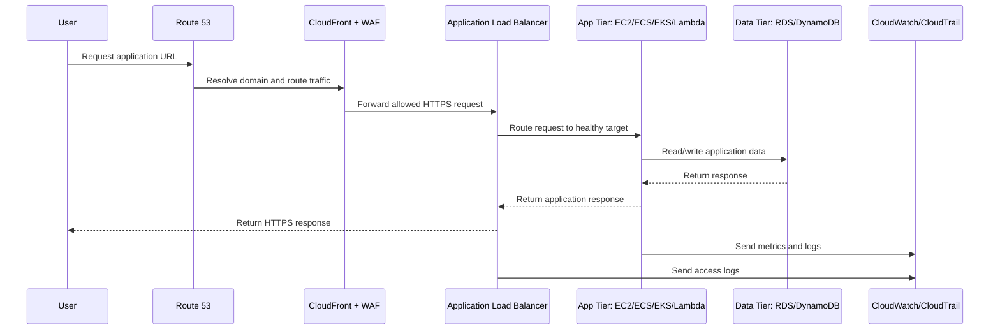
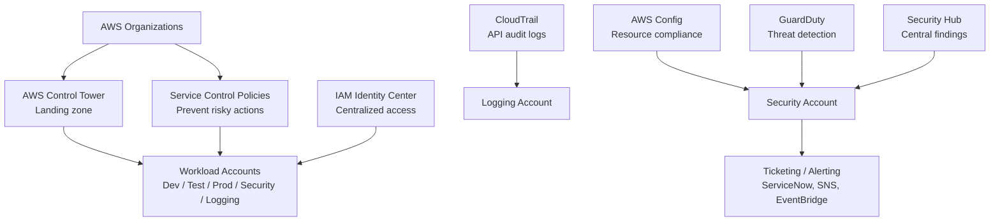

# AWS Services — Exam & Interview Ready Guide

## Table of Contents

1. [Overview](#overview)
2. [AWS Services Architecture Diagram](#aws-services-architecture-diagram)
3. [Secure 3-Tier AWS Application Flow](#secure-3-tier-aws-application-flow)
4. [AWS DevOps Deployment Flow](#aws-devops-deployment-flow)
5. [AWS Security and Governance Flow](#aws-security-and-governance-flow)
6. [Compute Services](#1-compute-services)
7. [Storage Services](#2-storage-services)
8. [Database Services](#3-database-services)
9. [Networking and Content Delivery](#4-networking-and-content-delivery)
10. [Security, Identity, and Compliance](#5-security-identity-and-compliance)
11. [Monitoring, Management, and Governance](#6-monitoring-management-and-governance)
12. [DevOps and Developer Tools](#7-devops-and-developer-tools)
13. [Migration and Hybrid Cloud](#8-migration-and-hybrid-cloud)
14. [Analytics and Data Services](#9-analytics-and-data-services)
15. [AI, ML, and Generative AI](#10-ai-ml-and-generative-ai)
16. [Application Integration](#11-application-integration)
17. [Cost Management](#12-cost-management)
18. [Most Important AWS Services to Know First](#most-important-aws-services-to-know-first)
19. [Simple Interview Answer](#simple-interview-answer)
20. [Daily Learning Notes](#daily-learning-notes)

---

## Overview

AWS provides cloud services used to design, deploy, secure, monitor, and scale modern applications. These services are grouped into categories such as compute, storage, database, networking, security, monitoring, DevOps, analytics, AI/ML, migration, and cost management.

A strong AWS engineer should understand what each service does, its defining characteristics, when to use it, and — critically for interviews — *why* it would be chosen over a similar service with respect to cost, scalability, efficiency, and security.

[⬆ Back to top](#top)

---

## AWS Services Architecture Diagram

```mermaid
flowchart TB
    Users[Users / Clients] --> R53["Amazon Route 53<br/>DNS"]
    R53 --> CF["Amazon CloudFront<br/>CDN"]
    CF --> WAF["AWS WAF<br/>Web protection"]
    WAF --> ALB[Application Load Balancer]

    ALB --> APP["Compute Layer<br/>EC2 / ECS / EKS / Lambda"]
    APP --> DB["Database Layer<br/>RDS / Aurora / DynamoDB"]
    APP --> S3["Storage Layer<br/>S3 / EBS / EFS / FSx"]

    IAM["IAM / IAM Identity Center<br/>Access control"] --> APP
    KMS["AWS KMS<br/>Encryption keys"] --> DB
    KMS --> S3
    SM["Secrets Manager<br/>Secrets and credentials"] --> APP

    CW["CloudWatch<br/>Metrics, logs, alarms"] --> APP
    CT["CloudTrail<br/>API audit logs"] --> IAM
    CFG["AWS Config<br/>Compliance tracking"] --> DB
    SH["Security Hub / GuardDuty<br/>Security findings"] --> IAM
```

---

## Secure 3-Tier AWS Application Flow

```mermaid
sequenceDiagram
    participant User
    participant DNS as Route 53
    participant CDN as CloudFront + WAF
    participant ALB as Application Load Balancer
    participant App as App Tier: EC2/ECS/EKS/Lambda
    participant DB as Data Tier: RDS/DynamoDB
    participant Logs as CloudWatch/CloudTrail

    User->>DNS: Request application URL
    DNS->>CDN: Resolve domain and route traffic
    CDN->>ALB: Forward allowed HTTPS request
    ALB->>App: Route request to healthy target
    App->>DB: Read/write application data
    DB-->>App: Return response
    App-->>ALB: Return application response
    ALB-->>User: Return HTTPS response
    App->>Logs: Send metrics and logs
    ALB->>Logs: Send access logs
```

---

## AWS DevOps Deployment Flow

```mermaid
flowchart LR
    Dev[Developer] --> Git[GitHub / CodeCommit]
    Git --> CI["CI Pipeline<br/>GitHub Actions / CodeBuild"]
    CI --> Scan["Security Checks<br/>SAST, IaC scan, dependency scan"]
    Scan --> Build["Build Artifact<br/>Container image or package"]
    Build --> ECR[Amazon ECR / S3 Artifact Bucket]
    ECR --> Deploy["Deploy<br/>ECS / EKS / Lambda / EC2"]
    Deploy --> Monitor["CloudWatch + X-Ray<br/>Monitoring and tracing"]
    Monitor --> Feedback[Feedback to team]
```

---

## AWS Security and Governance Flow

```mermaid
flowchart TB
    ORG[AWS Organizations] --> SCP["Service Control Policies<br/>Prevent risky actions"]
    ORG --> CTOWER["AWS Control Tower<br/>Landing zone"]
    CTOWER --> ACCOUNTS["Workload Accounts<br/>Dev / Test / Prod / Security / Logging"]
    SCP --> ACCOUNTS

    IAM["IAM Identity Center<br/>Centralized access"] --> ACCOUNTS
    CLOUDTRAIL["CloudTrail<br/>API audit logs"] --> LOGGING[Logging Account]
    CONFIG["AWS Config<br/>Resource compliance"] --> SECURITY[Security Account]
    GUARDDUTY["GuardDuty<br/>Threat detection"] --> SECURITY
    SECURITYHUB["Security Hub<br/>Central findings"] --> SECURITY

    SECURITY --> SNOW["Ticketing / Alerting<br/>ServiceNow, SNS, EventBridge"]
```

[⬆ Back to top](#top)

---

## 1. Compute Services

| Service | Key Features & Characteristics | Use Cases | Preferred Over the Alternative When |
|---|---|---|---|
| **Amazon EC2** | Resizable virtual servers ("instances") in the cloud, giving full OS-level control; wide instance family choice (T/M/C/R/I/G/P, plus Graviton ARM for better price/performance); On-Demand/Reserved/Spot/Savings Plans pricing; billed per second. | Hosting apps, web servers, databases, custom/legacy workloads. | You need OS-level access, specialized licensing, or GPU hardware — vs Lambda/Fargate, steady-state usage priced with a Reserved Instance/Savings Plan is cheaper than per-invocation billing at sustained scale. |
| **AWS Lambda** | Serverless compute that runs your code in response to events without provisioning or managing servers; auto-scales per invocation with zero idle cost; max 15-minute runtime; billed per ms + request; built-in multi-AZ HA. | Event-driven automation, APIs, file processing, scheduled jobs. | Traffic is spiky/unpredictable and you want zero idle-capacity cost and no servers to manage — less cost-efficient than EC2 for constant high-throughput workloads where per-invocation pricing exceeds a flat reserved rate. |
| **Amazon ECS** | AWS's native container orchestration service for running Docker containers via clusters, task definitions, and services; simpler API than Kubernetes; EC2 or Fargate launch type; deep native AWS integration. | Running Docker containers on AWS without Kubernetes complexity. | The team wants lower operational overhead and faster onboarding and doesn't need Kubernetes portability or its ecosystem. |
| **Amazon EKS** | AWS's managed Kubernetes service, running the standard upstream Kubernetes control plane; portable across clouds; large ecosystem (Helm, operators, GitOps). | Kubernetes-based container workloads, multi-cloud strategies. | Portability/multi-cloud requirements or existing Kubernetes expertise/tooling outweigh the added operational complexity and per-cluster control-plane fee. |
| **AWS Fargate** | A serverless compute engine for containers that removes the need to provision, size, or patch EC2 instances for ECS/EKS workloads; billed per vCPU/memory per task. | Running ECS/EKS containers without managing EC2 instances. | Minimizing operational burden matters more than raw cost — Fargate typically costs more per vCPU-hour than a well-utilized EC2 fleet, so it's most efficient at variable/bursty container load, less so at large constant scale. |
| **Amazon Lightsail** | A simplified virtual private server (VPS) product bundling compute + storage + networking at flat monthly pricing; simplified console; less flexible than full EC2. | Small websites, blogs, simple dev/test applications. | Simplicity and predictable flat pricing matter more than fine-grained control or scalability — not built for high-scale production workloads. |
| **AWS Batch** | A fully managed service for running batch computing jobs at any scale, handling scheduling/queuing across EC2, Spot, or Fargate; automatic dynamic provisioning; built-in retries. | Large-scale processing, rendering, scientific/parallel workloads. | The job runs longer than Lambda's 15-minute cap or needs large/specialized compute across many parallel jobs — pairing with Spot makes it the most cost-efficient option for large batch workloads vs manually managing an EC2 fleet. |

### Interview Keyword
Use **EC2** when you need control over servers, **Lambda** for event-driven serverless workloads, **Fargate** for serverless containers, and **EKS** when Kubernetes is required.

[⬆ Back to top](#top)

---

## 2. Storage Services

| Service | Key Features & Characteristics | Use Cases | Preferred Over the Alternative When |
|---|---|---|---|
| **Amazon S3** | Object storage for virtually unlimited amounts of data, accessed over HTTP(S) rather than mounted as a filesystem; 11 nines durability, 99.99% availability; storage-class tiering (Standard/IA/Glacier); pay per GB + requests. | Backups, logs, data lakes, static websites. | You need internet-accessible, massively scalable object storage rather than a mountable filesystem — cheapest option for large, infrequently accessed datasets when paired with lifecycle policies. |
| **Amazon EBS** | Block storage volumes attached to a single EC2 instance within one Availability Zone; gp3/io2/st1/sc1 volume types; provisioned IOPS available. | Boot volumes, databases, application disks. | You need low-latency block-level access from exactly one instance — most cost-efficient/performant choice for that pattern, but it doesn't share across instances and isn't durable beyond its AZ without snapshots. |
| **Amazon EFS** | A managed, elastic NFS file system that multiple instances can mount concurrently; no capacity to pre-provision; shared across many instances/AZs/Lambda; pay per GB used. | Shared Linux storage across EC2/EKS fleets. | Multiple instances need concurrent read/write access to the same files — EBS can't do this; costs more per GB than EBS/S3, but shared access isn't available any other way. |
| **Amazon FSx** (Windows / Lustre / NetApp ONTAP / OpenZFS) | Managed third-party file systems, each running actual vendor file-system software rather than an AWS-built equivalent — SMB + AD integration (Windows), sub-millisecond HPC throughput (Lustre), enterprise NAS features like snapshots/dedup/cloning (ONTAP/OpenZFS). | Windows File Server migration, ML/HPC training data, enterprise NAS workloads. | You need native Windows SMB/AD integration, extreme HPC throughput, or NetApp-specific enterprise NAS features EFS doesn't offer. |
| **AWS Backup** | A centralized, policy-based backup service spanning multiple AWS resource types from one console instead of a separate backup mechanism per service; cross-region/cross-account copy; retention/lifecycle rules. | Backup EC2, EBS, RDS, DynamoDB, and EFS from one place. | You need one policy/schedule/audit trail across many resource types instead of managing backup schedules separately per service — reduces both operational overhead and the compliance risk of a missed service. |
| **Amazon S3 Glacier** (Instant / Flexible / Deep Archive) | S3's lowest-cost storage tiers, purpose-built for archival data rather than active access; retrieval time ranges from milliseconds (Instant) to ~12 hours (Deep Archive). | Long-term compliance retention (7–10 years), rarely accessed backups. | Data is rarely accessed and a retrieval delay of minutes-to-hours is acceptable — dramatically lower storage cost is the driver, at the expense of retrieval speed. |
| **AWS Storage Gateway** | A hybrid storage bridge connecting on-premises applications to AWS storage — File/Volume/Tape gateway types backing on-prem NFS/SMB/iSCSI/virtual-tape interfaces with S3/EBS underneath. | Connect on-premises storage/backup systems to AWS. | On-prem systems must keep their existing file/block/tape interfaces while data is actually stored durably and cost-effectively in AWS. |

### Interview Keyword
Use **S3** for object storage, **EBS** for EC2 block storage, **EFS** for shared Linux file storage, and **FSx** for managed high-performance file systems.

[⬆ Back to top](#top)

---

## 3. Database Services

| Service | Key Features & Characteristics | Use Cases | Preferred Over the Alternative When |
|---|---|---|---|
| **Amazon RDS** | A managed relational database service (MySQL, PostgreSQL, SQL Server, Oracle, MariaDB) where AWS handles the underlying OS and engine patching; automated patching/backup; Multi-AZ for HA; read replicas for read scaling. | Traditional relational workloads needing a specific engine. | You need an engine Aurora doesn't support (Oracle/SQL Server), or want the lower baseline cost of a standard engine for a smaller workload. |
| **Amazon Aurora** | AWS's own MySQL/PostgreSQL-compatible relational engine, re-architected for the cloud; storage auto-scales to 128TB, decoupled from compute; ~30s failover; up to 15 read replicas; Aurora Serverless v2 auto-scales capacity. | Enterprise relational workloads needing higher throughput/availability than RDS. | Performance, availability, or read-scale requirements justify the higher baseline cost — better price/performance at scale despite the higher entry cost. |
| **Amazon DynamoDB** | A fully managed, serverless NoSQL key-value/document database; single-digit-ms latency at virtually unlimited scale; On-Demand or Provisioned capacity; DAX for microsecond caching; Global Tables for multi-region. | High-scale key-value/document workloads (session stores, gaming, IoT). | The access pattern is key-based (not complex joins) and needs massive horizontal scale with minimal ops — pay-per-request pricing is more cost-efficient than a provisioned relational DB at spiky/unpredictable load, and it scales further than any relational option. |
| **Amazon Redshift** | A managed, columnar data warehouse purpose-built for large-scale analytical (OLAP) queries rather than transactional workloads; provisioned or serverless; petabyte-scale. | Analytics and reporting, BI workloads. | Queries are frequent/complex and consistent low-latency performance matters enough to justify a continuously running warehouse — vs Athena's pay-per-query-scanned model, which is cheaper for occasional ad-hoc queries. |
| **Amazon ElastiCache** (Redis / Memcached) | A managed in-memory caching service sitting in front of a database to serve hot data far faster than disk-backed storage; Redis adds persistence, replication, pub/sub, rich data structures; Memcached is simpler, pure cache, horizontally shardable. | Redis/Memcached caching, session stores, reducing DB read load. | Caching needs to sit in front of any data source (not just DynamoDB), or you need Redis's durability/replication/complex data types — vs DAX, which only fronts DynamoDB. |
| **Amazon DocumentDB** | A managed document database offering MongoDB API compatibility so existing MongoDB applications can run against it largely unchanged. | Document-based applications, MongoDB workloads. | An application already uses MongoDB's document query API/aggregation framework, and rewriting to DynamoDB's access patterns isn't worth the migration cost. |
| **Amazon Neptune** | A managed graph database purpose-built for storing and querying highly connected data (property graph + RDF); optimized for deep relationship traversal. | Fraud detection, social graphs, recommendation engines. | The core query pattern is relationship traversal (e.g., "friends of friends") that would require expensive recursive joins in a relational database. |
| **Amazon Timestream** | A purpose-built, serverless time-series database designed around data that's inherently ordered by time rather than modeled as generic rows; automatic tiering of recent (memory) vs historical (magnetic) data; built-in time-series analytics functions. | IoT telemetry, application/infrastructure monitoring metrics at high ingestion scale. | Data is inherently time-ordered at very high ingestion rates — storage tiering and time-series-specific query functions are far cheaper and faster than modeling the same workload in a general-purpose database. |

### Interview Keyword
Use **RDS/Aurora** for relational workloads, **DynamoDB** for NoSQL scale, **Redshift** for analytics, and **ElastiCache** for low-latency caching.

[⬆ Back to top](#top)

---

## 4. Networking and Content Delivery

| Service | Key Features & Characteristics | Use Cases | Preferred Over the Alternative When |
|---|---|---|---|
| **Amazon VPC** | A logically isolated, software-defined virtual network within AWS that you control the IP range and topology of — subnets, route tables, gateways. | Network segmentation and workload isolation. | Foundational — every AWS network design starts here; no real alternative. |
| **Subnets** | Segments of a VPC's IP address range scoped to a single Availability Zone; public (routes to an IGW) vs private (routes to NAT or nowhere). | Public/private workload placement, tiering (web/app/data). | You need to control which resources are internet-reachable per tier — separating public and private subnets is the baseline pattern for any secure design. |
| **Route Tables** | The set of rules controlling where a subnet's traffic is directed; most-specific route wins; defines whether a subnet behaves as public or private. | Route traffic to internet gateways, NAT gateways, or transit gateways. | Any VPC — this is how subnet-level traffic behavior is actually controlled, not an optional add-on. |
| **Internet Gateway** | A horizontally scaled, redundant AWS-managed gateway that provides the actual path between a VPC and the internet; one per VPC, no bandwidth cost of its own. | Public-facing resources needing direct internet access. | A subnet needs bidirectional internet reachability — the only way to make a subnet genuinely "public." |
| **NAT Gateway** | A managed service letting private-subnet resources initiate outbound internet traffic while staying unreachable from the internet; AZ-scoped; hourly + per-GB data processing charge. | Private EC2 patching and outbound updates without inbound exposure. | You want a managed, highly available NAT path without patching a self-managed NAT instance — trade-off is the per-GB processing cost, which a VPC endpoint avoids for AWS-service traffic specifically. |
| **Elastic Load Balancing** (ALB / NLB / GWLB) | AWS's managed load-balancing family, distributing traffic across multiple targets for availability and scale — ALB = L7, content-based routing, WebSocket support; NLB = L4, extreme throughput, static IP; GWLB = L3, transparent appliance insertion. | High-availability applications, microservices routing, appliance insertion. | ALB when routing depends on path/host; NLB when raw throughput/static IP/non-HTTP protocols matter more than content routing; GWLB when transparently inserting third-party firewalls/IDS into the traffic path. |
| **Amazon Route 53** | AWS's highly available, scalable managed DNS service; health-check-driven routing policies (weighted, latency, failover, geolocation); domain registration. | Domain registration, DNS routing, health checks, DR failover. | You need deep AWS integration — alias records to AWS resources at no extra query cost — and health-check-driven failover a third-party DNS provider won't natively give you. |
| **Amazon CloudFront** | AWS's content delivery network (CDN), caching content at edge locations close to users to reduce latency and origin load; integrates with WAF/Shield/ACM. | Faster global content delivery, static asset offload. | Content is cacheable HTTP(S) — dramatically cuts both latency and origin compute/bandwidth cost for repeat requests, vs Global Accelerator, which doesn't cache. |
| **AWS Transit Gateway** | A managed network transit hub connecting many VPCs and on-premises networks through one central point with transitive routing; centralized management; scales to thousands of attachments. | Connect multiple VPCs and on-premises networks. | Connecting more than a handful of VPCs — VPC Peering has no transitive routing and becomes an unmanageable mesh past a few connections; TGW adds hourly + per-GB cost but is far more operationally efficient at scale. |
| **AWS Direct Connect** | A dedicated, private physical network link between your infrastructure and AWS, bypassing the public internet entirely; consistent low latency/high throughput; can reduce data-transfer cost vs internet egress at high volume. | Hybrid cloud connectivity requiring predictable performance. | You need predictable performance and high sustained throughput and can accept a longer provisioning lead time (weeks) and higher fixed cost — vs VPN's fast setup but internet-dependent variability. |
| **AWS VPN** (Site-to-Site / Client) | A managed service establishing an encrypted IPsec tunnel over the public internet between AWS and an on-prem site or remote client. | Site-to-site VPN and client remote-access VPN. | You need to connect quickly and cheaply and can tolerate variable, internet-dependent latency — no long lead time, pay-as-you-go, vs Direct Connect's predictability and cost. |

### Interview Keyword
A secure AWS network usually includes **VPC, public/private subnets, route tables, security groups, NACLs, NAT Gateway, ALB, and Route 53**.

[⬆ Back to top](#top)

---

## 5. Security, Identity, and Compliance

| Service | Key Features & Characteristics | Use Cases | Preferred Over the Alternative When |
|---|---|---|---|
| **AWS IAM** | AWS's foundational identity and access management service, controlling who/what can authenticate and what they're authorized to do — users, groups, roles, policies; free; least-privilege is the default control for everything else in AWS. | Access control and least privilege. | Always — the baseline for every access-control decision; no alternative within AWS. |
| **IAM Identity Center** | A centralized workforce single sign-on (SSO) service spanning multiple AWS accounts/Organizations; integrates with external IdPs (Okta, Azure AD). | Single sign-on across AWS accounts. | Managing access across many AWS accounts — avoids credential sprawl and centralizes MFA/lifecycle management vs per-account IAM users. |
| **AWS Organizations** | A multi-account management service letting you centrally govern and consolidate billing for many AWS accounts as one entity; Service Control Policies (SCPs) as org-wide guardrails. | Account governance and consolidated billing. | You need centralized governance/billing and guardrails that hold regardless of what IAM policies an individual account defines — IAM alone can't enforce that org-wide. |
| **AWS Control Tower** | An automated landing-zone service that sets up a best-practice multi-account AWS environment on top of Organizations — pre-built account factory, guardrails, compliance dashboards. | Secure multi-account setup. | You want an AWS-recommended best-practice account structure provisioned automatically rather than hand-rolling a multi-account setup. |
| **AWS KMS** | The Key Management Service — creates, rotates, and audits (via CloudTrail) the encryption keys other services use to protect data at rest; envelope encryption; customer-managed vs AWS-managed keys. | Encrypt S3, EBS, RDS, Lambda, and Secrets Manager. | Any workload needing encryption at rest with auditable, policy-controlled key access — the foundational encryption service nearly every other service builds on. |
| **AWS Secrets Manager** | A service for securely storing, encrypting, and automatically rotating sensitive credentials via Lambda rotation functions; fine-grained resource policies. | Database passwords, API keys, credentials. | The secret needs automatic rotation or tighter secret-specific access auditing — costs more per secret than Parameter Store but removes manual rotation risk. |
| **AWS Certificate Manager** | A service for provisioning and managing free public/private TLS certificates with automatic renewal; native integration with ALB/CloudFront/API Gateway. | HTTPS for ALB, CloudFront, and API Gateway. | You want zero-cost, zero-maintenance TLS with no renewal risk — ACM auto-renews, avoiding the classic "certificate expired in production" incident. |
| **Amazon GuardDuty** | A continuous, ML/threat-intelligence-driven threat detection service analyzing CloudTrail/VPC Flow Logs/DNS logs for likely malicious or unauthorized activity; no infrastructure to deploy. | Detect suspicious AWS activity. | You need automated, continuously updated threat intelligence at low operational cost, vs manual log review that doesn't scale. |
| **AWS Security Hub** | A security posture management service that aggregates findings from GuardDuty/Inspector/Config/partner tools into one dashboard with compliance scoring (CIS, PCI-DSS, etc.). | Centralized security findings, security posture management. | You need a single pane of glass and automated compliance scoring across many security tools instead of checking each dashboard separately. |
| **Amazon Inspector** | An automated, continuous vulnerability (CVE) scanning service for EC2, ECR images, and Lambda. | EC2, ECR, and Lambda vulnerability scanning. | You need continuous, automatic re-scanning as new CVEs are disclosed, not just a point-in-time scan at deploy. |
| **AWS WAF** | A Layer-7 web application firewall filtering HTTP requests (SQLi/XSS/rate-limiting rules) attached to ALB/CloudFront/API Gateway; pay per rule + request. | Protect applications from web attacks. | You need to block specific malicious request patterns, not just absorb DDoS volume — vs Shield, which handles the volumetric attack itself. |
| **AWS Shield** (Standard / Advanced) | AWS's managed DDoS protection service; Standard = automatic, free L3/L4 for everyone; Advanced = adds L7 protection, cost protection, 24/7 DRT access. | Protect internet-facing applications from DDoS. | Standard is always on by default at no cost; upgrade to Advanced when the business impact of a large-scale attack justifies an SLA-backed response team and billing protection. |
| **AWS Config** | A service that continuously records AWS resource configuration state/history and evaluates it against defined compliance rules; detects drift. | Compliance and audit checks, drift detection. | You need to know a resource's actual configuration state over time, not just the API calls that changed it — complements CloudTrail rather than replacing it. |
| **AWS CloudTrail** | An audit-logging service that records every API call made in the account — who did what, when, from where. | Governance, auditing, and investigations. | Any investigation into an access/change event — CloudWatch tells you *how* the system is performing, CloudTrail tells you *who* did what. |

### Interview Keyword
Security in AWS starts with **IAM least privilege, MFA, encryption with KMS, CloudTrail logging, Config compliance, GuardDuty, and Security Hub**.

[⬆ Back to top](#top)

---

## 6. Monitoring, Management, and Governance

| Service | Key Features & Characteristics | Use Cases | Preferred Over the Alternative When |
|---|---|---|---|
| **Amazon CloudWatch** | AWS's native observability service — metrics, logs, alarms, dashboards; natively integrated with every AWS service with zero extra setup for basic metrics. | Monitoring EC2, Lambda, RDS, and applications. | The default operational monitoring tool for "how is it performing" — pairs with CloudTrail (below), which answers a different question. |
| **AWS CloudTrail** | An audit-logging service that records API activity across the account. | Audit and incident investigation. | You're investigating an access/change event, not runtime performance. |
| **AWS Config** | A configuration-compliance service that tracks resource configuration history and evaluates it against compliance rules. | Compliance and drift detection. | You need the *state* of a resource's configuration over time, not the API call log itself. |
| **AWS Systems Manager** | A centralized operational hub for managing EC2 and hybrid servers at scale — Session Manager (no SSH keys/open ports), Patch Manager, Run Command, Parameter Store, Automation documents. | Patch Manager, Session Manager, Run Command. | You need centralized, auditable fleet management without opening inbound SSH/RDP ports — improves both security posture and operational efficiency at scale, vs direct SSH access. |
| **AWS Trusted Advisor** | An automated advisory service running best-practice checks across cost, security, performance, fault tolerance, and service limits. | Cost, security, performance, fault-tolerance checks. | You want a quick, low-effort automated health check without building custom checks yourself — full check set requires a Business/Enterprise support plan. |
| **AWS Health Dashboard** | A personalized dashboard showing AWS service events/maintenance specifically affecting your own resources (vs the public, account-agnostic status page). | Account-specific service events. | You need proactive, personalized alerts about issues actually affecting your account's resources, not generic AWS-wide status. |
| **AWS Service Catalog** | A self-service provisioning tool that lets end users/teams deploy curated, pre-approved IaC templates without needing broad console/IaC access themselves. | Enterprise provisioning governance. | You want teams to self-serve infrastructure within guardrails (approved templates) rather than either blocking them entirely or granting unrestricted console/IaC access. |
| **AWS License Manager** | A service that tracks and enforces bring-your-own-license (BYOL) software usage across accounts against your licensing entitlements. | License compliance management. | You run licensed software (Windows Server, Oracle, SQL Server) and need to avoid license compliance violations or overage penalties. |
| **AWS Compute Optimizer** | An ML-based recommendation service that analyzes actual utilization data to suggest right-sized EC2/EBS/Lambda/ECS configurations. | Cost and performance optimization. | You want data-driven right-sizing recommendations instead of guessing at instance sizes or over-provisioning "just in case." |

### Interview Keyword
For cloud operations, combine **CloudWatch for monitoring, CloudTrail for auditing, Config for compliance, and Systems Manager for patching and automation**.

[⬆ Back to top](#top)

---

## 7. DevOps and Developer Tools

| Service | Key Features & Characteristics | Use Cases | Preferred Over the Alternative When |
|---|---|---|---|
| **AWS CodeCommit** | A managed private Git repository hosting service. *(AWS stopped onboarding new customers in July 2024 — GitHub/GitLab is now the more common real-world choice; still worth knowing the name for interviews.)* | Source code hosting. | Legacy accounts already using it, or a strict requirement to keep source control fully inside AWS's IAM/network boundary. |
| **AWS CodeBuild** | A managed, serverless build service that compiles, tests, and packages code in a temporary environment; pay per build minute; no build servers to maintain. | Compile, test, and package code. | You want to avoid managing build infrastructure/capacity — scales automatically with concurrent builds, vs self-hosted Jenkins agents needing their own patching/scaling. |
| **AWS CodeDeploy** | A managed deployment service that automates application rollout to EC2/ECS/Lambda/on-prem; supports blue/green and canary strategies with automatic rollback on failed health checks. | Deploy applications to EC2, ECS, Lambda, or on-premises. | You need built-in blue/green or canary rollout with automatic rollback safety, vs a manual/scripted deploy with no native rollback. |
| **AWS CodePipeline** | A managed CI/CD orchestration service connecting source → build → test → deploy stages into one automated release process. | Automate release pipelines. | You want native AWS service integration (CodeBuild/CodeDeploy/manual approval gates) without managing pipeline infrastructure yourself. |
| **AWS CloudFormation** | AWS's native declarative Infrastructure-as-Code service; no external state backend to manage (AWS manages it); stack-based automatic rollback on failure. | Provision AWS resources using templates. | You want zero additional tooling/state backend and native rollback semantics — at the cost of being AWS-only, vs Terraform's multi-cloud reach. |
| **AWS CDK** | A framework for defining Infrastructure as Code using real programming languages (TypeScript, Python, Java) instead of YAML/JSON; synthesizes to CloudFormation. | Define infrastructure with Python, TypeScript, Java, etc. | You want loops/abstractions/type-checking and reusable constructs instead of verbose YAML/JSON — still inherits CloudFormation's deployment engine and rollback behavior. |
| **Amazon ECR** | A fully managed, private container image registry integrated with IAM; image scanning on push; lifecycle policies. | Store Docker images. | You need private images tied to IAM auth and native AWS scanning, vs a public registry like Docker Hub. |
| **AWS X-Ray** | A distributed tracing service that follows a request across Lambda/ECS/API Gateway/downstream calls, visualizing the full request path and per-hop latency. | Troubleshoot microservices and APIs. | You need to pinpoint which specific service/hop in a distributed request is slow or failing — log-based debugging alone can't show the full request path. |

### Interview Keyword
A common CI/CD pipeline uses **GitHub or CodeCommit → CodeBuild → ECR → ECS/EKS/Lambda deployment**, with security scanning and approval gates.

[⬆ Back to top](#top)

---

## 8. Migration and Hybrid Cloud

| Service | Key Features & Characteristics | Use Cases | Preferred Over the Alternative When |
|---|---|---|---|
| **AWS Migration Hub** | A central dashboard for tracking migration progress across multiple AWS migration tools/waves from one place. | Central migration dashboard. | You're running many migrations across several tools and need one consolidated tracking view. |
| **AWS Application Migration Service** | An agent-based lift-and-shift service that continuously replicates entire servers into AWS for a minimal-downtime cutover. | Lift-and-shift migration to AWS. | You're migrating whole servers/applications, not just a database — vs DMS, which is database-only. |
| **AWS Database Migration Service** | A managed service that migrates databases into or within AWS with minimal downtime via continuous replication; homogeneous or heterogeneous (with Schema Conversion Tool). | Migrate Oracle, SQL Server, MySQL, PostgreSQL. | You need continuous replication during a live cutover window to minimize downtime, vs a manual export/import requiring an extended outage. |
| **AWS DataSync** | A managed data transfer service for automated, accelerated movement of large datasets between on-prem and AWS storage; built-in scheduling, validation, bandwidth throttling. | Move data between on-premises and AWS. | Transfers are large and recurring and need scheduling/validation/throttling built in, vs manual `rsync`/`aws s3 cp`. |
| **AWS Transfer Family** | A fully managed file transfer service exposing SFTP/FTPS/FTP endpoints backed by S3/EFS. | Secure file transfers. | You need a fully managed, highly available file-transfer endpoint without patching/scaling your own FTP servers. |
| **AWS Snow Family** | A set of physical data transfer devices (Snowball, Snowball Edge, Snowmobile) for offline bulk data movement when network transfer isn't practical. | Large-scale data migration. | The dataset is so large that network transfer would take weeks/months, or no reliable link exists — do the bandwidth math to justify it. |
| **AWS Outposts** | AWS-managed infrastructure and services physically deployed on-premises, running the same APIs and control plane as an AWS region. | Hybrid cloud workloads. | The workload has ultra-low-latency or strict data-residency requirements that force processing to stay physically on-site. |
| **AWS Direct Connect** | A dedicated private network connection between your infrastructure and AWS (see [§4 Networking](#4-networking-and-content-delivery) for full detail). | Hybrid cloud connectivity. | You need predictable performance and high sustained throughput for hybrid connectivity at scale. |

### Interview Keyword
Use **DMS** for databases, **DataSync** for file/object data, **Application Migration Service** for servers, and **Direct Connect/VPN** for hybrid connectivity.

[⬆ Back to top](#top)

---

## 9. Analytics and Data Services

| Service | Key Features & Characteristics | Use Cases | Preferred Over the Alternative When |
|---|---|---|---|
| **Amazon Athena** | A serverless query service that runs SQL directly over data sitting in S3 (via the Glue Data Catalog), with no infrastructure to provision; pay per query/data scanned. | Serverless log and data analysis. | Queries are ad-hoc or infrequent and you don't want to provision/pay for a continuously running warehouse — vs Redshift's provisioned cost. |
| **AWS Glue** | A serverless data-integration service combining ETL job execution with a Data Catalog (shared schema registry for S3/Athena/Redshift). | Prepare data for analytics. | You want managed, serverless ETL and a shared catalog without cluster management overhead — vs EMR's need to size and run a cluster. |
| **Amazon EMR** | A managed Hadoop/Spark cluster service for large-scale, custom big-data processing. | Spark and Hadoop workloads. | You need full control over the cluster or a custom big-data framework at very large scale — vs Glue's managed but less flexible model. |
| **Amazon Kinesis** (Data Streams / Firehose) | AWS's real-time streaming data ingestion family; Data Streams = custom consumers + replay; Firehose = managed delivery straight to S3/Redshift/OpenSearch with no consumer code. | Logs, clickstreams, IoT data. | Data Streams over Firehose: you need custom processing logic, multiple independent consumers, or replay capability — Firehose trades that flexibility for zero ops. |
| **Amazon OpenSearch Service** | A managed search and log-analytics engine, API-compatible with Elasticsearch/Kibana. | Centralized logging and search. | You need full-text search or log-analytics dashboards — a query shape Athena/Redshift aren't built for. |
| **Amazon QuickSight** | A serverless business intelligence/dashboarding service; pay-per-session pricing instead of per-seat licensing. | Dashboards and reporting. | You want AWS-native dashboards directly over Redshift/Athena/S3 with usage-based pricing instead of a third-party BI platform's fixed per-seat licenses. |
| **AWS Lake Formation** | A centralized data lake governance service providing fine-grained (column/row-level) access control on top of a Glue Catalog/S3 data lake. | Secure data lake setup. | You need fine-grained, centrally managed access control across many datasets/consumers, vs hand-managing S3 bucket policies and IAM directly. |
| **Amazon MSK** | A managed Apache Kafka service that handles broker provisioning/patching/scaling for you. | Event streaming platform. | The application already uses the Kafka API/ecosystem (Kafka Connect, Kafka Streams) and rewriting to Kinesis isn't worth the migration cost. |

### Interview Keyword
A common AWS data lake design uses **S3, Glue Data Catalog, Lake Formation, Athena, Redshift, and QuickSight**.

[⬆ Back to top](#top)

---

## 10. AI, ML, and Generative AI

| Service | Key Features & Characteristics | Use Cases | Preferred Over the Alternative When |
|---|---|---|---|
| **Amazon SageMaker** | A full machine-learning lifecycle platform — managed notebooks, training jobs, tuning, deployment endpoints, pipelines — for building and hosting your own models. | Machine learning lifecycle management. | You need a custom model trained on your own data/architecture, not just calling a pre-trained foundation model — vs Bedrock, this is the right tool when off-the-shelf models don't fit. |
| **Amazon Bedrock** | A managed service providing API access to third-party and Amazon foundation models (Anthropic Claude, Amazon Titan, Meta Llama, etc.) with no infrastructure to manage; supports fine-tuning/RAG/agents. | AI assistants, chatbots, content generation. | You want to build generative AI features quickly via API calls rather than training/hosting your own model — far lower time-to-value and no GPU infrastructure to manage vs SageMaker. |
| **Amazon Q** | AWS's family of generative-AI assistants — Q Developer for code generation/AWS console Q&A, Q Business for enterprise data Q&A. | Developer and enterprise productivity. | You want an AWS-integrated assistant for developer productivity or internal enterprise search without building a custom RAG pipeline yourself. |
| **Amazon Rekognition** | A pre-trained image/video analysis API for object/face detection and content moderation, with no model training required. | Object and face detection. | The use case matches Rekognition's pre-built capabilities — far cheaper/faster than training and hosting a custom computer-vision model. |
| **Amazon Comprehend** | A pre-trained natural language processing (NLP) API for sentiment analysis, entity extraction, key phrases, and PII detection. | Sentiment and text analysis. | The task matches Comprehend's built-in capabilities — no training data or ML expertise required. |
| **Amazon Textract** | A document-processing service combining OCR with structured data extraction (forms, tables) rather than returning raw text alone. | OCR and forms processing. | You need structured extraction (form fields, table cells), not just raw text — generic OCR won't give you that structure. |
| **Amazon Lex** | A managed conversational chatbot engine (the same underlying technology as Alexa) using intent/slot-based dialog management. | Chatbots and voice bots. | You want a managed conversational interface with built-in intent recognition instead of building a custom NLU pipeline. |
| **Amazon Polly** | A text-to-speech service converting text into lifelike speech across many languages/voices, including neural voices. | Voice applications. | You need natural-sounding synthesized speech without managing a TTS model yourself. |
| **Amazon Transcribe** | An automatic speech-to-text service supporting real-time streaming and batch transcription, speaker diarization, and custom vocabulary. | Audio transcription. | You need automated transcription (call centers, media captioning) without a custom ASR model. |
| **Amazon Translate** | A neural machine translation API supporting translation across many language pairs. | Multilingual applications. | You need fast, good-enough translation without building/maintaining a custom translation model. |

### Interview Keyword
Use **Bedrock** for generative AI applications, **SageMaker** for custom ML model lifecycle, and **Lex/Polly/Transcribe** for conversational AI.

[⬆ Back to top](#top)

---

## 11. Application Integration

| Service | Key Features & Characteristics | Use Cases | Preferred Over the Alternative When |
|---|---|---|---|
| **Amazon SQS** | A fully managed, pull-based message queue that decouples producers from consumers; Standard = at-least-once/best-effort order, high throughput; FIFO = exactly-once/strict order, lower throughput. | Decouple application components. | Exactly one consumer should process each message and you need a durable buffer against traffic spikes — vs SNS, which pushes to many subscribers instead. |
| **Amazon SNS** | A fully managed, push-based pub/sub messaging service that fans a message out to many subscribers at once (SQS, Lambda, email, SMS, HTTP). | Fan-out messaging and alerts. | The same message must reach multiple independent subscribers immediately — vs SQS's single-consumer-per-message model. |
| **Amazon EventBridge** | A serverless event bus that routes events to targets based on content, not just simple fan-out; content-based routing rules, schema registry, native SaaS/third-party integrations. | Event-driven architecture. | Routing depends on event content, not just fan-out, or you're integrating third-party/SaaS event sources — vs SNS's simpler, routing-free fan-out. |
| **AWS Step Functions** | A serverless workflow orchestrator expressed as a visual state machine, coordinating multiple steps with built-in retries/error handling; executions up to 1 year long. | Multi-step business processes. | A multi-step workflow needs visibility, retry logic, or human-approval steps — vs manually chaining Lambda calls, which is fragile and hard to observe. |
| **Amazon API Gateway** | A managed API front door for REST/HTTP/WebSocket APIs, handling throttling, auth, request validation, and caching. | REST, HTTP, and WebSocket APIs. | You need per-client throttling, request validation, native Lambda integration, or API key management — vs a bare ALB, which lacks API-management features. |
| **AWS AppSync** | A managed GraphQL API service with real-time subscriptions and built-in resolvers to DynamoDB/Lambda/RDS. | Real-time web and mobile applications. | Clients (especially mobile) need to fetch exactly the fields they want in one round trip, or need real-time subscription updates — a fit REST/API Gateway doesn't natively provide. |
| **Amazon MQ** | A managed message broker service running actual ActiveMQ or RabbitMQ engines rather than an AWS-proprietary protocol. | ActiveMQ and RabbitMQ migration. | You're migrating an existing app that already speaks JMS/AMQP and rewriting its messaging code for SQS/SNS isn't worth it. |

### Interview Keyword
Use **SQS** for queueing, **SNS** for notifications, **EventBridge** for event routing, and **Step Functions** for workflow orchestration.

[⬆ Back to top](#top)

---

## 12. Cost Management

| Service | Key Features & Characteristics | Use Cases | Preferred Over the Alternative When |
|---|---|---|---|
| **AWS Cost Explorer** | A cost-visualization tool that analyzes historical spend/usage trends with custom filtering/grouping. | View and forecast AWS spend. | You're investigating *why* a bill changed — the natural first stop before Budgets (forward-looking) or CUR (most granular). |
| **AWS Budgets** | A proactive cost-alerting service that notifies you when spend/usage crosses a defined threshold; supports forecasted-spend alerts. | Notify when spend exceeds limits. | You need forward-looking alerts, not just historical analysis — vs Cost Explorer, which only looks backward. |
| **AWS Cost and Usage Report** | AWS's most granular, itemized billing data export, exportable to S3/Athena/Redshift for custom analysis. | FinOps reporting and analysis. | You need line-item detail for chargeback models or custom BI dashboards that Cost Explorer's UI can't provide. |
| **Savings Plans** | A flexible $/hour compute commitment (1 or 3 year) that applies automatically across EC2/Fargate/Lambda regardless of instance family/region. | Reduce EC2, Lambda, and Fargate cost. | Workload composition (instance family, region) may change over the commitment period — Savings Plans flex with usage, unlike Reserved Instances tied to specific instance attributes. |
| **Reserved Instances** | A pricing commitment offering a discount (up to ~72%) in exchange for committing to a specific instance type/region for 1–3 years. | Lower EC2 and RDS cost. | The workload is very stable/predictable and exact instance family won't change, or you need a capacity reservation guarantee Savings Plans don't provide. |
| **AWS Pricing Calculator** | A free, AWS-maintained tool for estimating architecture cost before deployment. | Estimate architecture cost before deployment. | You want an AWS-maintained, service-accurate cost estimate during the design phase, before committing to an architecture — more reliable than a spreadsheet guess. |

### Interview Keyword
FinOps in AWS includes **tagging, budgets, cost allocation tags, Cost Explorer, CUR, Savings Plans, and right-sizing**.

[⬆ Back to top](#top)

---

## Most Important AWS Services to Know First

1. IAM
2. VPC
3. EC2
4. S3
5. EBS
6. EFS
7. RDS
8. DynamoDB
9. Lambda
10. CloudWatch
11. CloudTrail
12. Route 53
13. Elastic Load Balancing
14. Auto Scaling
15. KMS
16. Secrets Manager
17. ECS
18. EKS
19. CloudFormation
20. Systems Manager
21. AWS Organizations
22. AWS Control Tower

[⬆ Back to top](#top)

---

## Simple Interview Answer

AWS services are cloud-based building blocks used to design, deploy, secure, monitor, and scale applications. The major service categories include compute, storage, databases, networking, security, monitoring, DevOps, analytics, AI/ML, and cost management.

For example, **EC2** provides virtual servers, **S3** provides object storage, **RDS** provides managed relational databases, **VPC** provides network isolation, **IAM** manages access control, and **CloudWatch** provides monitoring and alarms.

A well-designed AWS solution combines these services to achieve scalability, high availability, security, automation, and cost optimization — and picking between similar-looking services almost always comes down to a specific trade-off: cost model (pay-per-use vs provisioned), scalability ceiling, operational efficiency (managed vs self-run), or a security/compliance requirement that only one option satisfies.

[⬆ Back to top](#top)

---

## Daily Learning Notes

### What to Practice

- Create an EC2 instance in a public subnet.
- Create an S3 bucket with encryption enabled.
- Create IAM users, groups, roles, and policies.
- Build a VPC with public and private subnets.
- Create a CloudWatch alarm for EC2 CPU utilization.
- Deploy a simple application using ECS or EKS.
- Create an RDS database in a private subnet.
- Use Systems Manager Session Manager instead of SSH.
- Enable CloudTrail and AWS Config for governance.
- Review costs using AWS Cost Explorer and Budgets.

### Key Architecture Principle

A strong AWS architecture should be:

- Secure
- Highly available
- Fault tolerant
- Scalable
- Automated
- Observable
- Cost optimized

[⬆ Back to top](#top)
