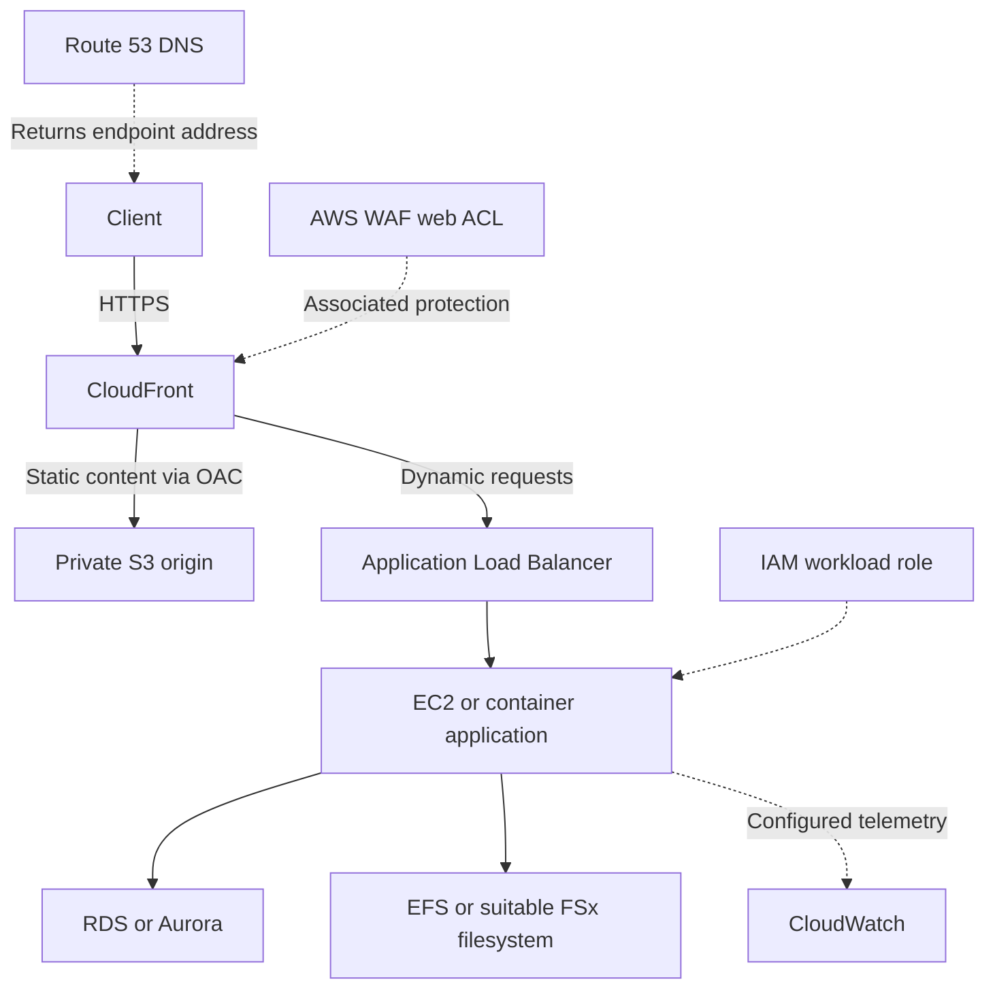
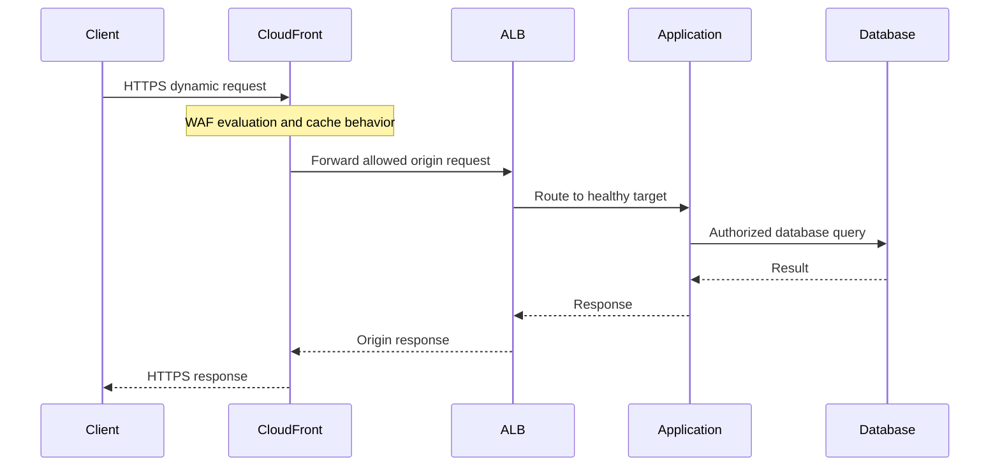
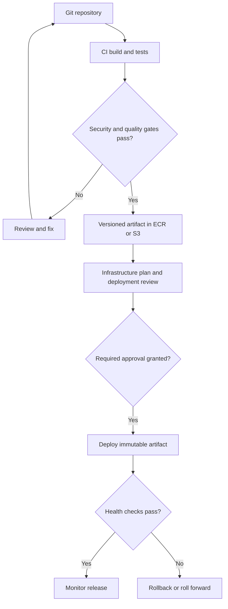
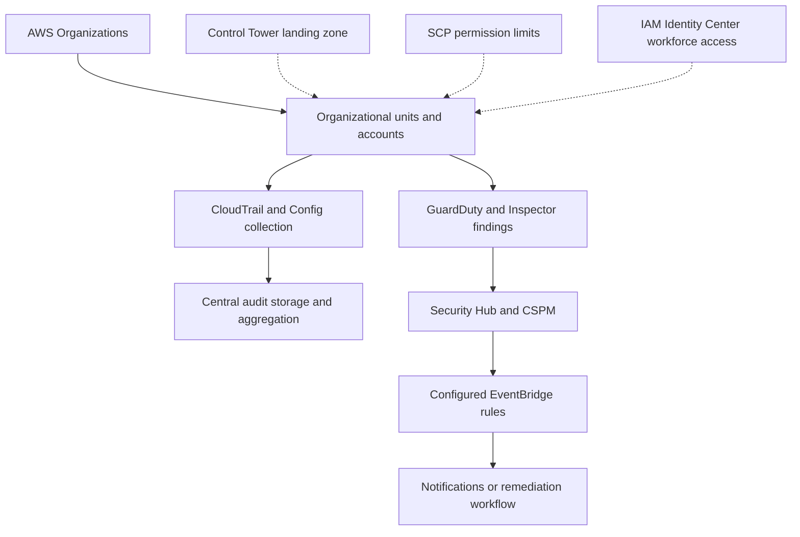

# AWS Services — Exam & Interview Ready Guide

**Reviewed: September 23, 2026.** Definitions, decision guidance, and selected limits were checked against AWS documentation. Availability, pricing, quotas, and engine support vary by Region, account, and configuration; consult the linked references before implementation. This is a curated learning guide, not an exhaustive AWS service catalog.

## Table of Contents

1. [Overview](#overview)
2. [AWS Services Architecture Diagram](#aws-services-architecture-diagram)
3. [Secure 3-Tier AWS Application Flow](#secure-3-tier-aws-application-flow)
4. [AWS DevOps Deployment Flow](#aws-devops-deployment-flow)
5. [AWS Security and Governance Flow](#aws-security-and-governance-flow)
6. [Compute Services](#1-compute-services)
7. [Storage Services](#2-storage-services)
8. [Database Services](#3-database-services)
9. [Networking and Content Delivery](#4-networking-and-content-delivery)
10. [Security, Identity, and Compliance](#5-security-identity-and-compliance)
11. [Monitoring, Management, and Governance](#6-monitoring-management-and-governance)
12. [DevOps and Developer Tools](#7-devops-and-developer-tools)
13. [Migration and Hybrid Cloud](#8-migration-and-hybrid-cloud)
14. [Analytics and Data Services](#9-analytics-and-data-services)
15. [AI, ML, and Generative AI](#10-ai-ml-and-generative-ai)
16. [Application Integration](#11-application-integration)
17. [Cost Management](#12-cost-management)
18. [Most Important AWS Services to Know First](#most-important-aws-services-to-know-first)
19. [Simple Interview Answer](#simple-interview-answer)
20. [Daily Learning Notes](#daily-learning-notes)
21. [Additional Essential Services and Features](#additional-essential-services-and-features)
22. [Important Interview Distinctions](#important-interview-distinctions)
23. [Review Notes and AWS References](#review-notes-and-aws-references)

---

## Overview

AWS provides cloud services used to design, deploy, secure, monitor, and scale modern applications. These services are grouped into categories such as compute, storage, database, networking, security, monitoring, DevOps, analytics, AI/ML, migration, and cost management.

A strong AWS engineer should understand what each service does, its defining characteristics, when to use it, and — critically for interviews — *why* it would be chosen over a similar service with respect to cost, scalability, efficiency, and security.

[⬆ Back to top](#top)

---

## AWS Services Architecture Diagram

Illustrative web application: solid arrows show requests/data access; dotted arrows show configuration or telemetry. Service choices must match the runtime; storage products are not interchangeable attachments.

```mermaid
flowchart TB
    User["Client"] -->|HTTPS| CF["CloudFront"]
    DNS["Route 53 DNS"] -.->|Returns endpoint address| User
    WAF["AWS WAF web ACL"] -.->|Associated protection| CF
    CF -->|Static content via OAC| S3["Private S3 origin"]
    CF -->|Dynamic requests| ALB["Application Load Balancer"]
    ALB --> App["EC2 or container application"]
    App --> DB["RDS or Aurora"]
    App --> Files["EFS or suitable FSx filesystem"]
    Role["IAM workload role"] -.-> App
    App -.->|Configured telemetry| CW["CloudWatch"]
```

CloudFront origin access control (OAC) applies to a supported S3 origin, not the S3 website endpoint. An ALB uses supported instance/IP/Lambda targets; ECS and EKS workloads require the appropriate target registration. Lambda cannot attach EBS volumes like EC2. DynamoDB and S3 are regional services rather than instances placed in your subnets.

## Secure 3-Tier AWS Application Flow

This example uses a presentation tier delivered by CloudFront/S3, an application tier behind an ALB, and an RDS/Aurora data tier. Route 53 resolves the hostname before the HTTPS exchange. WAF evaluates requests at the associated CloudFront distribution.

```mermaid
sequenceDiagram
    participant Client
    participant Edge as CloudFront
    participant ALB
    participant App as Application
    participant DB as Database
    Client->>Edge: HTTPS dynamic request
    Note over Edge: WAF evaluation and cache behavior
    Edge->>ALB: Forward allowed origin request
    ALB->>App: Route to healthy target
    App->>DB: Authorized database query
    DB-->>App: Result
    App-->>ALB: Response
    ALB-->>Edge: Origin response
    Edge-->>Client: HTTPS response
```

- Deploy the application across at least two AZs when the availability target requires it; select a suitable database HA configuration.
- Keep application and database resources private where practical. Restrict the application security group to the load balancer and the database security group to the application.
- Enforce TLS, protect origin access, and retrieve secrets through a workload role.
- CloudWatch handles configured metrics/logs; CloudTrail audits supported AWS activity. ALB metrics go to CloudWatch. Enable access logs separately: traditional delivery is to S3, and enhanced delivery supports CloudWatch Logs, Firehose, or S3. CloudTrail is not the application access-log destination. [S23](#s23)

## AWS DevOps Deployment Flow

```mermaid
flowchart TB
    Source["Git repository"] --> CI["CI build and tests"]
    CI --> Gate{"Security and quality gates pass?"}
    Gate -->|No| Fix["Review and fix"]
    Fix --> Source
    Gate -->|Yes| Artifact["Versioned artifact in ECR or S3"]
    Artifact --> Plan["Infrastructure plan and deployment review"]
    Plan --> Approval{"Required approval granted?"}
    Approval -->|Yes| Deploy["Deploy immutable artifact"]
    Deploy --> Health{"Health checks pass?"}
    Health -->|Yes| Observe["Monitor release"]
    Health -->|No| Rollback["Rollback or roll forward"]
```

For GitHub Actions or another compatible OIDC provider, exchange the pipeline identity for temporary AWS STS role credentials. Restrict the role trust policy by issuer, audience, and repository/branch/environment claims as appropriate. Keep build, deployment, and runtime permissions scoped separately. Use immutable image tags or digests, and configure rollback explicitly. [S27](#s27)

## AWS Security and Governance Flow

```mermaid
flowchart TB
    Org["AWS Organizations"] --> OU["Organizational units and accounts"]
    Tower["Control Tower landing zone"] -.-> OU
    SCP["SCP permission limits"] -.-> OU
    SSO["IAM Identity Center workforce access"] -.-> OU
    OU --> Audit["CloudTrail and Config collection"]
    OU --> Detect["GuardDuty and Inspector findings"]
    Audit --> Store["Central audit storage and aggregation"]
    Detect --> Hub["Security Hub and CSPM"]
    Hub --> Events["Configured EventBridge rules"]
    Events --> Actions["Notifications or remediation workflow"]
```

Arrows represent configured integrations, not automatic enrollment. Configure organization trails, recorders, delegated administrators, and aggregation explicitly. SCPs limit permissions but do not grant them; Control Tower controls can be preventive, detective, or proactive. Do not confuse an SCP with an IAM permissions-boundary policy. [S28](#s28)

[⬆ Back to top](#top)

---

## 1. Compute Services

| Service | Key Features & Characteristics | Use Cases | Selection Guidance and Caveats |
|---|---|---|---|
| **Amazon EC2** | Virtual machines with control over the guest OS, instance size, networking, and storage. Supports x86 and Arm instance families. On-Demand and Spot are purchasing options; Reserved Instances and Savings Plans offer discounts. Billing granularity varies by OS/product. | Web servers, custom applications, databases, GPU and legacy workloads. | Choose for OS access, specialized hardware, or software requirements. Compare utilization, licensing, operational labor, and commitment costs before declaring it cheaper than serverless. |
| **AWS Lambda** | Event-driven compute that manages execution infrastructure and scales within concurrency and scaling quotas. Standard function invocations run for at most 15 minutes; request/duration and optional capacity features affect billing. | APIs, event processing, scheduled automation. | Choose for bounded event-driven tasks. Standard on-demand execution has no idle execution charge, but Provisioned Concurrency and associated services can incur charges without requests. |
| **Amazon ECS** | Managed container orchestration using task definitions, tasks, services, and clusters. Can use EC2 or Fargate capacity; operational responsibility depends on the compute option. | AWS container services and workers. | Choose when AWS-native orchestration meets requirements and Kubernetes APIs are unnecessary. ECS orchestrates; Fargate supplies compute. |
| **Amazon EKS** | Managed Kubernetes with an AWS-operated control plane. Worker options include EC2 and supported Fargate workloads; management responsibility depends on node and compute mode. | Kubernetes applications, Helm, operators, GitOps. | Choose for Kubernetes APIs and ecosystem. Portable application manifests help, but AWS-specific storage, identity, and networking still require migration work. |
| **AWS Fargate** | Managed container compute for ECS tasks and supported EKS pods. AWS operates the hosts; you still select CPU/memory resources and manage images, permissions, and application behavior. | Containers without worker-host administration. | Choose to reduce host operations. Charges depend on requested resources and runtime, with additional options such as storage; cost superiority depends on workload utilization. |
| **Amazon Lightsail** | Simplified cloud platform with bundled virtual servers and related networking, storage, database, and container options. Bundles have usage allowances and possible overage charges. | Small business sites, simple applications, development environments. | Choose for easy setup and predictable bundles. It supports production use, but check scaling, integration, and resource limits against requirements. |
| **AWS Batch** | Managed job queues, scheduling, dependencies, and retries for batch computing using supported ECS, EKS, EC2, and Fargate configurations. | Batch ETL, rendering, scientific computing. | Choose for queued compute jobs and resource-aware scheduling. Spot can reduce costs for interruption-tolerant work; savings are not guaranteed. |

### Interview Keyword
Use **EC2** when you need control over servers, **Lambda** for event-driven serverless workloads, **Fargate** for serverless containers, and **EKS** when Kubernetes is required.

[⬆ Back to top](#top)

---

## 2. Storage Services

| Service | Key Features & Characteristics | Use Cases | Selection Guidance and Caveats |
|---|---|---|---|
| **Amazon S3** | Regional object storage accessed through APIs. Provides strong consistency for object writes, reads, deletes, and listings; versioning, lifecycle, encryption, and storage classes. S3 Standard is designed for 11-nines durability and 99.99% availability; availability and AZ resilience vary by class. | Data lakes, backups, logs, static assets. | Choose object storage when block or full POSIX filesystem semantics are unnecessary. Buckets can remain private; internet-public access is not required. Compare requests, retrieval, storage, and transfer costs. [S1](#s1) |
| **Amazon EBS** | Persistent block volumes in one AZ, normally attached to one EC2 instance. Supported io1/io2 Multi-Attach configurations allow multiple instances in that same AZ. Snapshots support recovery and copying. | Boot disks, database volumes, low-latency block storage. | Choose for block access. Multi-Attach requires application/filesystem coordination and is not a general shared NFS filesystem; it does not provide cross-AZ attachment. [S2](#s2) |
| **Amazon EFS** | Elastic managed NFS storage for concurrent Linux-compatible clients. Regional filesystems span AZs; One Zone filesystems store data in one AZ. Capacity grows and shrinks with data. | Shared files for EC2, containers, and Lambda. | Choose shared NFS without managing file servers. FSx and self-managed file servers are other shared-file options; compare protocol, performance, resilience, and cost. |
| **Amazon FSx** | Managed file-system family: FSx for Windows File Server (SMB/AD), Lustre (parallel HPC storage), NetApp ONTAP (enterprise multiprotocol storage), and OpenZFS (NFS/ZFS capabilities). Features and deployment options differ by product. | Windows shares, HPC/ML datasets, enterprise storage. | Choose based on protocol and workload. Latency is measured in time; throughput is measured in bytes/second. S3 integration, backups, and HA support are product/configuration dependent. |
| **AWS Backup** | Central backup plans, retention policies, monitoring, and recovery for supported resources. Cross-account/Region copies and vault protection features vary by resource and Region. | Coordinated backups and recovery governance. | Choose centralized backup administration. Confirm resource support and perform restore tests; a successful backup alone does not prove recovery objectives. |
| **Amazon S3 Glacier storage classes** | S3 Glacier Instant Retrieval offers millisecond access. Flexible Retrieval requires restoration, typically minutes to hours; Deep Archive typically takes about 12 hours for Standard or up to 48 hours for Bulk retrieval. | Rarely accessed archives and long-term retention. | Choose by access frequency and recovery deadline. Instant/Flexible have 90-day minimum storage durations; Deep Archive has 180 days. Include retrieval and early-deletion charges. [S1](#s1) |
| **AWS Storage Gateway** | Hybrid storage interfaces: S3 File Gateway for NFS/SMB files backed by S3 objects, Volume Gateway for iSCSI volumes with EBS snapshots, and Tape Gateway for virtual tape backups in AWS. | Hybrid file access and existing backup systems. | Choose when local applications need familiar storage protocols with local caching. Gateway types have different storage and recovery models; they are not interchangeable. |

### Interview Keyword
Use **S3** for object storage, **EBS** for EC2 block storage, **EFS** for shared Linux file storage, and **FSx** for managed high-performance file systems.

[⬆ Back to top](#top)

---

## 3. Database Services

| Service | Key Features & Characteristics | Use Cases | Selection Guidance and Caveats |
|---|---|---|---|
| **Amazon RDS** | Managed relational database service with engines including PostgreSQL, MySQL, MariaDB, Oracle, SQL Server, and Db2; Aurora is part of the RDS family. Automates supported backup, patching, and availability operations. | Relational applications and managed commercial databases. | Choose the required engine and deployment model. Classic Multi-AZ DB instance standby is for failover, not reads; Multi-AZ DB clusters can have readable instances. Read replica support differs by engine. |
| **Amazon Aurora** | MySQL- or PostgreSQL-compatible relational database in the RDS family, with distributed storage across three AZs and up to 15 Aurora Replicas. Supported engine versions allow storage up to 256 TiB; Serverless v2 scales compute. | Relational workloads requiring managed scale and resilience. | Choose after testing compatibility, throughput, and cost. Failover duration is workload/configuration dependent, not a guaranteed 30 seconds. Configure instances across AZs for compute resilience. [S3](#s3) |
| **Amazon DynamoDB** | Managed serverless key-value/document database with on-demand or provisioned throughput, secondary indexes, transactions, Streams, and global tables. Designed for single-digit-millisecond performance for suitable access patterns. | Session data, catalogs, gaming, event-driven applications. | Choose for key-based access and managed scale. Partition-key design, item/index limits, hot keys, consistency, and request size matter; neither limitless scale nor lower cost than relational databases is guaranteed. |
| **Amazon Redshift** | Managed columnar data warehouse for analytical SQL, available as provisioned clusters or Redshift Serverless. | BI, warehouse analytics, reporting. | Choose for integrated warehouse workloads and repeated complex analysis. Compare actual usage with Athena; Redshift does not always require continuously running provisioned capacity. |
| **Amazon ElastiCache** | Managed in-memory caching/data store supporting Valkey, Redis OSS, and Memcached, with serverless and node-based options. Data structures, replication, snapshots, and availability vary by engine/mode. | Caches, sessions, rate limiting. | Choose general-purpose low-latency caching; DAX specifically accelerates compatible DynamoDB reads. Do not treat all ElastiCache engines as equivalent durable systems of record. [S4](#s4) |
| **Amazon DocumentDB** | Managed document database implementing supported MongoDB APIs. It is not the MongoDB server engine and has documented feature and behavior differences. | JSON-like document workloads. | Choose only after testing application queries, drivers, indexes, transactions, and migration compatibility against the selected version. It is not a guaranteed drop-in replacement. [S5](#s5) |
| **Amazon Neptune** | A managed graph database purpose-built for storing and querying highly connected data (property graph + RDF); optimized for deep relationship traversal. | Fraud detection, social graphs, recommendation engines. | The core query pattern is relationship traversal (e.g., "friends of friends") that would require expensive recursive joins in a relational database. |
| **Amazon Timestream** | Time-series offerings include Timestream for LiveAnalytics (serverless SQL with memory/magnetic tiers) and Timestream for InfluxDB (managed InfluxDB). These are distinct products. | Metrics, telemetry, time-series analysis. | LiveAnalytics closed to new customers on June 20, 2025. Assess InfluxDB or other suitable stores for new workloads; compare query interfaces and operations. [S6](#s6) |

### Interview Keyword
Use **RDS/Aurora** for relational workloads, **DynamoDB** for NoSQL scale, **Redshift** for analytics, and **ElastiCache** for low-latency caching.

[⬆ Back to top](#top)

---

## 4. Networking and Content Delivery

| Service | Key Features & Characteristics | Use Cases | Selection Guidance and Caveats |
|---|---|---|---|
| **Amazon VPC** | A logically isolated regional virtual network with IP ranges, subnets, routing, gateways, and network security controls. | Private application networks and hybrid networking. | Use for resources that need customer-managed network boundaries. Some managed/serverless services can be used without placing them in your VPC. |
| **Subnets** | AZ-scoped VPC address ranges. A public subnet has a route to an internet gateway; a private subnet has no direct internet-gateway route. Isolated subnets have no external network route. | Separate public entry points, application tiers, and databases. | Subnet routing alone does not make an instance reachable: public IPv4/EIP or IPv6, security groups, NACLs, and application listeners also matter. |
| **Route Tables** | The set of rules controlling where a subnet's traffic is directed; most-specific route wins; defines whether a subnet behaves as public or private. | Route traffic to internet gateways, NAT gateways, or transit gateways. | Any VPC — this is how subnet-level traffic behavior is actually controlled, not an optional add-on. |
| **Internet Gateway** | VPC component providing an internet path for appropriately addressed and routed resources. The gateway itself has no hourly charge; data transfer and public IPv4 charges can apply. | Public load balancers and public internet access. | Use with route tables and security controls; an attached gateway alone does not expose every VPC resource. |
| **NAT Gateway** | Managed address translation allowing outbound connections without unsolicited inbound connections through the NAT path. Supports public/private connectivity types and zonal or regional availability modes. | Outbound access from private IPv4 workloads. | Choose public NAT for internet egress; private NAT is for private connectivity. Regional NAT supports multi-AZ expansion; zonal designs need an AZ-resilient routing plan. Interface endpoints also have charges. [S7](#s7) |
| **Elastic Load Balancing** (ALB / NLB / GWLB) | AWS's managed load-balancing family, distributing traffic across multiple targets for availability and scale — ALB = L7, content-based routing, WebSocket support; NLB = L4, extreme throughput, static IP; GWLB = L3, transparent appliance insertion. | High-availability applications, microservices routing, appliance insertion. | ALB when routing depends on path/host; NLB when raw throughput/static IP/non-HTTP protocols matter more than content routing; GWLB when transparently inserting third-party firewalls/IDS into the traffic path. |
| **Amazon Route 53** | Managed authoritative DNS, domain registration, health checks, routing policies, and Resolver capabilities. DNS returns endpoint addresses; it does not proxy application requests. | Name resolution, DNS-based routing, hybrid DNS. | Choose for AWS integrations and DNS capabilities. Alias query pricing depends on target type. Health checks and failover are not exclusive to AWS; DNS caching affects failover timing. |
| **Amazon CloudFront** | CDN that delivers HTTP(S) content through edge locations, caches eligible responses, and forwards dynamic requests to configured origins. Integrates with WAF and TLS certificates. | Global static and dynamic web delivery. | Choose for edge delivery and origin offload. Configure cache keys and authentication carefully; CloudFront also supports uncacheable dynamic traffic. |
| **AWS Transit Gateway** | A managed network transit hub connecting many VPCs and on-premises networks through one central point with transitive routing; centralized management; scales to thousands of attachments. | Connect multiple VPCs and on-premises networks. | Connecting more than a handful of VPCs — VPC Peering has no transitive routing and becomes an unmanageable mesh past a few connections; TGW adds hourly + per-GB cost but is far more operationally efficient at scale. |
| **AWS Direct Connect** | Private dedicated or partner-hosted connectivity from your network to AWS, avoiding the public internet for that connection. Encryption is not automatic; use supported MACsec, VPN, or application TLS as required. Design redundant connections for resilience. [S8](#s8) | Hybrid cloud connectivity requiring predictable performance. | You need predictable performance and high sustained throughput and can accept a longer provisioning lead time (weeks) and higher fixed cost — vs VPN's fast setup but internet-dependent variability. |
| **AWS VPN (Site-to-Site / Client)** | Site-to-Site VPN uses IPsec to connect networks; AWS Client VPN uses OpenVPN-based TLS connections for remote users. | Hybrid network tunnels and remote user access. | Choose the VPN type by network-to-network versus user-to-network needs. Redundant tunnels/routes and authorization rules remain design responsibilities. [S8](#s8) |

### Interview Keyword
A secure AWS network usually includes **VPC, public/private subnets, route tables, security groups, NACLs, NAT Gateway, ALB, and Route 53**.

[⬆ Back to top](#top)

---

## 5. Security, Identity, and Compliance

| Service | Key Features & Characteristics | Use Cases | Selection Guidance and Caveats |
|---|---|---|---|
| **AWS IAM** | Identity and access management using users, groups, roles, and policies. Requests require applicable permission grants; explicit denies can override allows. | Workload permissions and least-privilege access. | Use roles and temporary credentials where possible. Least privilege must be designed and maintained; it is not automatically achieved by creating an IAM identity. |
| **IAM Identity Center** | Central workforce access to AWS accounts and supported applications; supports identity federation with providers such as Microsoft Entra ID and Okta. | Workforce single sign-on and permission sets. | Use for employees/contractors across an AWS organization. Customer application sign-in is a different need, commonly addressed with Cognito or another customer identity platform. |
| **AWS Organizations** | Multi-account governance and consolidated billing, including organizational units and service control policies (SCPs). | Account isolation and organization-wide controls. | SCPs limit available permissions; they do not grant access. SCPs do not restrict the management account and have documented exceptions, including service-linked roles. |
| **AWS Control Tower** | An automated landing-zone service that sets up a best-practice multi-account AWS environment on top of Organizations — pre-built account factory, guardrails, compliance dashboards. | Secure multi-account setup. | You want an AWS-recommended best-practice account structure provisioned automatically rather than hand-rolling a multi-account setup. |
| **AWS KMS** | Creates and controls cryptographic keys used by integrated services and applications; supports encryption, signing, and MAC operations with appropriate key types. Includes AWS-managed and customer-managed keys. | Policy-controlled encryption and cryptographic operations. | Key policy and IAM permissions both matter. Rotation behavior depends on key type/origin and configuration; rotation does not automatically re-encrypt existing data. |
| **AWS Secrets Manager** | A service for securely storing, encrypting, and rotating supported secrets through configured managed rotation or Lambda rotation functions; fine-grained resource policies. | Database passwords, API keys, credentials. | The secret needs automatic rotation or tighter secret-specific access auditing — costs more per secret than Parameter Store but removes manual rotation risk. |
| **AWS Certificate Manager (ACM)** | Issues and manages TLS certificates for supported integrations. Non-exportable public certificates have no additional ACM certificate charge; exportable public certificates and AWS Private CA involve charges. | TLS for ALB, CloudFront, API Gateway, and supported external deployments. | Use managed renewal where eligible, but maintain domain validation and deployment. Imported certificates are not automatically renewed by ACM; exported renewals must be deployed to their destinations. [S9](#s9) |
| **Amazon GuardDuty** | A continuous, ML/threat-intelligence-driven threat detection service analyzing CloudTrail/VPC Flow Logs/DNS logs for likely malicious or unauthorized activity; AWS manages analysis infrastructure; optional runtime protection can require agents. | Detect suspicious AWS activity. | You need automated, continuously updated threat intelligence at low operational cost, vs manual log review that doesn't scale. |
| **AWS Security Hub / Security Hub CSPM** | Security Hub unifies and prioritizes security findings. Security Hub CSPM provides posture checks against standards and aggregates supported findings across accounts. | Security triage and posture management. | Choose to centralize findings and remediation workflows. Passing checks does not itself certify regulatory compliance. [S10](#s10) |
| **Amazon Inspector** | An automated, continuous vulnerability (CVE) scanning service for EC2, ECR images, and Lambda. | EC2, ECR, and Lambda vulnerability scanning. | You need continuous, automatic re-scanning as new CVEs are disclosed, not just a point-in-time scan at deploy. |
| **AWS WAF** | A Layer-7 web application firewall filtering HTTP requests (SQLi/XSS/rate-limiting rules) associated with supported resources such as ALB, CloudFront, and API Gateway REST API stages; web ACL, rule, request, and optional feature charges apply. | Protect applications from web attacks. | You need to block specific malicious request patterns, not just absorb DDoS volume — vs Shield, which handles the volumetric attack itself. |
| **AWS Shield (Standard / Advanced)** | Managed DDoS protection. Standard provides automatic baseline protection; Advanced adds eligible resource protections, visibility, and response/cost-protection capabilities. | Availability protection for supported internet-facing resources. | Choose Advanced based on business exposure and terms. Application-layer protections integrate with WAF; response support and cost protection have eligibility requirements. |
| **AWS Config** | Records selected supported resource configurations and history, with continuous or supported daily recording, and evaluates configured compliance rules. It can identify configuration changes and noncompliance. | Compliance and audit checks, drift detection. | You need to know a resource's actual configuration state over time, not just the API calls that changed it — complements CloudTrail rather than replacing it. |
| **AWS CloudTrail** | Records supported AWS API and account activity. Event history provides 90 days of management events per Region; trails provide ongoing delivery. Data events such as S3 object access require explicit selection. | Auditing and incident investigation. | Choose to investigate who performed supported actions. It does not automatically record every API/data event or application request. Configure event coverage and retention deliberately. [S11](#s11) |

### Interview Keyword
Security in AWS starts with **IAM least privilege, MFA, encryption with KMS, CloudTrail logging, Config compliance, GuardDuty, and Security Hub**.

[⬆ Back to top](#top)

---

## 6. Monitoring, Management, and Governance

| Service | Key Features & Characteristics | Use Cases | Selection Guidance and Caveats |
|---|---|---|---|
| **Amazon CloudWatch** | Observability service for metrics, logs, alarms, dashboards, and related analysis. Many AWS services emit default metrics, but log collection and additional telemetry often need configuration. | Operational monitoring and alerting. | Choose for AWS telemetry. EC2 guest memory/disk utilization and application logs usually require an agent or custom instrumentation; ingestion, retention, alarms, and custom metrics can incur costs. |
| **AWS CloudTrail** | Records supported AWS API and account activity. Event history provides 90 days of management events per Region; trails provide ongoing delivery. Data events such as S3 object access require explicit selection. | Auditing and incident investigation. | Choose to investigate who performed supported actions. It does not automatically record every API/data event or application request. Configure event coverage and retention deliberately. [S11](#s11) |
| **AWS Config** | A configuration-compliance service that tracks resource configuration history and evaluates it against compliance rules. | Compliance and drift detection. | You need the *state* of a resource's configuration over time, not the API call log itself. |
| **AWS Systems Manager** | Operational management capabilities including Session Manager, Run Command, Patch Manager, Automation, and Parameter Store for supported managed nodes and resources. | Fleet access, patching, automation, configuration. | Standard Session Manager sessions avoid inbound SSH/RDP ports. Managed nodes need appropriate agent setup, IAM permissions, and network access to service endpoints; configure audit logging where supported. |
| **AWS Trusted Advisor** | Recommendations and checks for areas including cost, performance, resilience, security, service quotas, and operational excellence. Available checks/API access depend on the support plan. | Operational reviews and optimization. | Use as advisory evidence, not a substitute for workload testing or compliance review. Check current support-plan entitlements. |
| **AWS Health Dashboard** | Shows public service-health events and, when signed in, account-specific events affecting resources. EventBridge can route supported account events. | AWS incidents, planned changes, maintenance notifications. | Choose to understand provider-side events and act on affected resources; combine with application monitoring. |
| **AWS Service Catalog** | A self-service provisioning tool that lets end users/teams deploy curated, pre-approved IaC templates without needing broad console/IaC access themselves. | Enterprise provisioning governance. | You want teams to self-serve infrastructure within guardrails (approved templates) rather than either blocking them entirely or granting unrestricted console/IaC access. |
| **AWS License Manager** | A service that tracks and enforces bring-your-own-license (BYOL) software usage across accounts against your licensing entitlements. | License compliance management. | You run licensed software (Windows Server, Oracle, SQL Server) and need to avoid license compliance violations or overage penalties. |
| **AWS Compute Optimizer** | An ML-based recommendation service that analyzes actual utilization data to suggest right-sized EC2/EBS/Lambda/ECS configurations. | Cost and performance optimization. | You want data-driven right-sizing recommendations instead of guessing at instance sizes or over-provisioning "just in case." |

### Interview Keyword
For cloud operations, combine **CloudWatch for monitoring, CloudTrail for auditing, Config for compliance, and Systems Manager for patching and automation**.

[⬆ Back to top](#top)

---

## 7. DevOps and Developer Tools

| Service | Key Features & Characteristics | Use Cases | Selection Guidance and Caveats |
|---|---|---|---|
| **AWS CodeCommit** | Managed Git repository hosting integrated with AWS IAM. New-customer access resumed in November 2025, reversing the 2024 onboarding restriction. | Private source repositories. | Choose based on source-control features and AWS integration requirements; the earlier claim that it is limited to legacy customers is outdated. [S12](#s12) |
| **AWS CodeBuild** | A managed, serverless build service that compiles, tests, and packages code in a temporary environment; pay per build minute; no build servers to maintain. | Compile, test, and package code. | You want to avoid managing build infrastructure/capacity — scales automatically with concurrent builds, vs self-hosted Jenkins agents needing their own patching/scaling. |
| **AWS CodeDeploy** | Automates deployment to EC2/on-premises instances, ECS, and Lambda. Deployment strategy and rollback support depend on platform and configuration. | Application rollouts and traffic shifting. | EC2/on-premises supports in-place deployments; EC2 also supports blue/green. ECS uses blue/green; Lambda/ECS can shift traffic with supported canary/linear settings. Configure health checks, alarms, and rollback. |
| **AWS CodePipeline** | A managed CI/CD orchestration service connecting source → build → test → deploy stages into one automated release process. | Automate release pipelines. | You want native AWS service integration (CodeBuild/CodeDeploy/manual approval gates) without managing pipeline infrastructure yourself. |
| **AWS CloudFormation** | Declarative stack-based infrastructure provisioning with AWS-managed state, change sets, and rollback capabilities. | Repeatable AWS infrastructure. | Choose native stack lifecycle management. Rollback is configurable and can fail; protect stateful resources with deletion/update policies and backups. Custom resources/extensions can reach beyond AWS. |
| **AWS CDK** | A framework for defining Infrastructure as Code using real programming languages (TypeScript, Python, Java) instead of YAML/JSON; synthesizes to CloudFormation. | Define infrastructure with Python, TypeScript, Java, etc. | You want loops/abstractions/type-checking and reusable constructs instead of verbose YAML/JSON — still inherits CloudFormation's deployment engine and rollback behavior. |
| **Amazon ECR** | Managed container image and OCI artifact registry with private repositories and ECR Public. Provides lifecycle policies and configurable basic/enhanced image scanning. | Container artifact storage and distribution. | Choose for IAM integration and AWS deployment workflows. Enhanced scanning uses Inspector; scan coverage/frequency varies by mode. Other registries also support private repositories. |
| **AWS X-Ray** | Distributed trace collection and analysis for instrumented applications and supported integrations. Sampling and instrumentation determine visibility. | Investigate service dependencies, errors, and latency. | Choose tracing to follow requests across components. X-Ray SDKs/daemon entered maintenance mode on February 25, 2026; AWS recommends OpenTelemetry instrumentation. The X-Ray service is distinct from these SDKs. [S13](#s13) |

### Interview Keyword
A common CI/CD pipeline uses **GitHub or CodeCommit → CodeBuild → ECR → ECS/EKS/Lambda deployment**, with security scanning and approval gates.

[⬆ Back to top](#top)

---

## 8. Migration and Hybrid Cloud

| Service | Key Features & Characteristics | Use Cases | Selection Guidance and Caveats |
|---|---|---|---|
| **AWS Migration Hub** | Migration tracking and coordination capabilities for existing customers. Closed to new customers on November 7, 2025. | Existing migration programs. | Do not assume availability for a new account; evaluate current AWS migration tooling and support options. [S14](#s14) |
| **AWS Application Migration Service** | An agent-based lift-and-shift service that continuously replicates entire servers into AWS for a minimal-downtime cutover. | Lift-and-shift migration to AWS. | You're migrating whole servers/applications, not just a database — vs DMS, which is database-only. |
| **AWS Database Migration Service (DMS)** | Database/data migration and supported ongoing change-data capture between compatible sources and targets. Heterogeneous migration can require DMS Schema Conversion or AWS SCT plus manual work. | Database migrations and replication. | Choose for supported data replication. It does not automatically migrate every schema object or application dependency; plan validation, permissions, and cutover. |
| **AWS DataSync** | A managed data transfer service for automated, accelerated movement of large datasets between on-prem and AWS storage; built-in scheduling, validation, bandwidth throttling. | Move data between on-premises and AWS. | Transfers are large and recurring and need scheduling/validation/throttling built in, vs manual `rsync`/`aws s3 cp`. |
| **AWS Transfer Family** | Managed file-transfer capabilities including SFTP, FTPS, FTP, AS2, and connectors. Storage and feature support vary: SFTP/FTPS/FTP servers can use S3 or EFS; AS2 uses S3. | Partner file exchange and managed transfers. | Choose when external systems require supported transfer protocols. Plain FTP is not encrypted; use an appropriate secure protocol and network design. |
| **AWS Snow Family / Snowball Edge** | Physical-device services for offline transfer and edge processing, with changed product availability. Snowball Edge closed to new customers on November 7, 2025. | Existing eligible offline-transfer and edge deployments. | Confirm current eligibility and device availability with AWS. Do not present historical Snowmobile/Snowball offerings as generally orderable; evaluate DataSync/network transfer for new projects. [S15](#s15) |
| **AWS Outposts** | AWS-operated infrastructure installed at customer locations to run a supported subset of AWS services, connected to a parent AWS Region. | Local processing and hybrid deployments. | Choose for latency/locality requirements after checking service availability, connectivity, facility needs, and control-plane/data-residency behavior. It is not an entire independent AWS Region. |
| **AWS Direct Connect** | A dedicated private network connection between your infrastructure and AWS (see [§4 Networking](#4-networking-and-content-delivery) for full detail). | Hybrid cloud connectivity. | You need predictable performance and high sustained throughput for hybrid connectivity at scale. |

### Interview Keyword
Use **DMS** for databases, **DataSync** for file/object data, **Application Migration Service** for servers, and **Direct Connect/VPN** for hybrid connectivity.

[⬆ Back to top](#top)

---

## 9. Analytics and Data Services

| Service | Key Features & Characteristics | Use Cases | Selection Guidance and Caveats |
|---|---|---|---|
| **Amazon Athena** | Serverless interactive SQL analytics over S3 and supported federated sources, commonly using Glue Data Catalog. Pricing includes data-scanned and capacity options. | Ad-hoc data lake queries and log analysis. | Choose for querying data without managing a warehouse. Partitioning, columnar formats, compression, and scan volume strongly affect cost. |
| **AWS Glue** | Managed data integration with ETL jobs, crawlers, and the Glue Data Catalog metadata repository. Glue Schema Registry is a separate capability for streaming schemas. | Data preparation and shared analytics metadata. | Choose managed integration and cataloging. EMR also has a serverless option; compare frameworks, customization, startup time, and price. |
| **Amazon EMR** | Managed big-data platform for frameworks such as Spark and Hadoop. Deployment options include EMR on EC2, EMR on EKS, and EMR Serverless, with different framework support and operational controls. | ETL, distributed analytics, Spark/Hadoop processing. | Choose the deployment mode by framework and control needs. EMR Serverless avoids cluster provisioning; not every EMR workload requires a customer-managed EC2 cluster. A separately maintained companion guide is named `EMR-Hadoop-Spark.md`; it is not included in this file. |
| **Amazon Kinesis Data Streams / Amazon Data Firehose** | Data Streams is a stream service supporting consumers, retention, and replay. Amazon Data Firehose (formerly Kinesis Data Firehose) buffers and delivers data to supported destinations, with optional transformation. | Streaming ingestion and managed delivery. | Choose Streams for consumer-controlled processing/replay; Firehose for managed delivery. Firehose buffering affects latency and some destinations use S3 staging; it is not always direct or instantaneous. |
| **Amazon OpenSearch Service** | Managed search/analytics using OpenSearch and supported legacy Elasticsearch versions, with provisioned and serverless options. OpenSearch Dashboards provides visualization. | Search, log analytics, vector search. | Choose for indexing and interactive search. Do not assume compatibility with every modern Elasticsearch API, client, or Kibana version. |
| **Amazon QuickSight** | Managed BI capabilities for datasets, visualizations, dashboards, and embedded analytics within the broader Amazon Quick offering. Pricing varies by role, edition, and capacity/session options. | Business dashboards and embedded BI. | Choose for AWS data integration and managed BI. It is not universally priced only per session; review the applicable author/reader and capacity model. [S16](#s16) |
| **AWS Lake Formation** | A centralized data lake governance service providing fine-grained (column/row-level) access control on top of a Glue Catalog/S3 data lake. | Secure data lake setup. | You need fine-grained, centrally managed access control across many datasets/consumers, vs hand-managing S3 bucket policies and IAM directly. |
| **Amazon MSK** | Managed Apache Kafka with provisioned and serverless choices. AWS handles infrastructure tasks; capacity, partitions, clients, and scaling responsibilities depend on mode. | Kafka-compatible streaming and existing Kafka applications. | Choose for Kafka APIs/ecosystem. Managed does not mean every scaling or application operation is automatic. |

### Interview Keyword
A common AWS data lake design uses **S3, Glue Data Catalog, Lake Formation, Athena, Redshift, and QuickSight**.

[⬆ Back to top](#top)

---

## 10. AI, ML, and Generative AI

| Service | Key Features & Characteristics | Use Cases | Selection Guidance and Caveats |
|---|---|---|---|
| **Amazon SageMaker AI** | Managed tooling for building, training, tuning, deploying, and operating ML models, including custom and foundation-model workflows. The original SageMaker ML service was renamed SageMaker AI in December 2024. | ML development, training, inference, MLOps. | Choose for model/infrastructure control. The broader Amazon SageMaker platform also unifies data/analytics; Bedrock likewise supports selected customization workflows, so this is not simply custom versus pretrained. [S17](#s17) |
| **Amazon Bedrock** | Managed foundation-model service with supported model inference, customization, knowledge bases/RAG, agents, and guardrails. Features depend on model, Region, and access. | Generative AI assistants and applications. | Choose managed model APIs and orchestration. Validate quality, permissions, latency, usage cost, and data handling; guardrails do not guarantee correct or safe output. |
| **Amazon Q** | AWS's family of generative-AI assistants — Q Developer for code generation/AWS console Q&A, Q Business for enterprise data Q&A. | Developer and enterprise productivity. | You want an AWS-integrated assistant for developer productivity or internal enterprise search without building a custom RAG pipeline yourself. |
| **Amazon Rekognition** | Managed image/video analysis for supported object, text, face, and moderation tasks; some features support custom training. | Media analysis and moderation assistance. | Choose when supported capabilities meet measured accuracy requirements. Evaluate privacy requirements and false positives; cost depends on processing volume. |
| **Amazon Comprehend** | A pre-trained natural language processing (NLP) API for sentiment analysis, entity extraction, key phrases, and PII detection. | Sentiment and text analysis. | The task matches Comprehend's built-in capabilities — pretrained features need no customer training; custom classifiers/entities require appropriate training and validation. |
| **Amazon Textract** | A document-processing service combining OCR with structured data extraction (forms, tables) rather than returning raw text alone. | OCR and forms processing. | You need structured extraction (form fields, table cells), not just raw text — validate extraction accuracy and route uncertain results for review. |
| **Amazon Lex** | Managed voice/text conversational interfaces with speech recognition, natural-language understanding, intents, slots, and dialogue management. | Voice bots, chatbots, contact-center interfaces. | Choose for structured conversational flows and supported integrations; use Lex V2 documentation for current implementations. |
| **Amazon Polly** | A text-to-speech service converting text into lifelike speech across many languages/voices, including neural voices. | Voice applications. | You need natural-sounding synthesized speech without managing a TTS model yourself. |
| **Amazon Transcribe** | An automatic speech-to-text service supporting real-time streaming and batch transcription, speaker diarization, and custom vocabulary. | Audio transcription. | You need automated transcription (call centers, media captioning) without a custom ASR model. |
| **Amazon Translate** | A neural machine translation API supporting translation across many language pairs. | Multilingual applications. | You need automated translation with quality validated for the language and domain without building/maintaining a custom translation model. |

### Interview Keyword
Use **Bedrock** for generative AI applications, **SageMaker AI** for custom ML model lifecycle, and **Lex/Polly/Transcribe** for conversational AI.

[⬆ Back to top](#top)

---

## 11. Application Integration

| Service | Key Features & Characteristics | Use Cases | Selection Guidance and Caveats |
|---|---|---|---|
| **Amazon SQS** | Managed message queues. Standard queues offer at-least-once delivery and best-effort ordering. FIFO preserves order within each message group and deduplicates sends within a five-minute window. | Durable work queues and asynchronous decoupling. | Choose a queue for competing workers. Visibility-timeout expiry can cause redelivery, including FIFO; make consumers idempotent, delete after success, and configure DLQs. FIFO is not exactly-once business execution. [S18](#s18) |
| **Amazon SNS** | Managed publish/subscribe topics delivering to supported subscribers such as SQS, Lambda, HTTP(S), email, and SMS; endpoint support differs for Standard and FIFO topics. Supports attribute/body filtering. | Fan-out, alerts, notifications. | Choose for publish/subscribe delivery. Use separate SQS queues behind subscriptions for independently buffered workers; delivery guarantees depend on topic, endpoint, and retry configuration. [S19](#s19) |
| **Amazon EventBridge** | Event buses with event-pattern routing, plus Pipes for supported point-to-point integrations and Scheduler for scheduled invocation. Supports AWS and partner/application events. | Event routing, integration, scheduled automation. | Choose for event-bus integrations and routing capabilities. SNS also filters messages. Design for retries, duplicates, target failures, and DLQs; event buses do not guarantee ordering. |
| **AWS Step Functions** | Managed state-machine workflow orchestration with retries, error handling, branching, parallelism, and service integrations. Standard workflows can run up to one year; Express up to five minutes. | Business workflows, data pipelines, orchestration. | Choose by duration, execution semantics, observability, and cost. Express lacks some Standard integration patterns, including callback/task-token workflows. [S20](#s20) |
| **Amazon API Gateway** | Managed REST, HTTP, and WebSocket APIs with routing, integrations, authorization, and throttling features that vary by API type. | API front doors and serverless APIs. | REST APIs support features such as usage plans/API keys, request validation, and caching; HTTP APIs do not provide all REST features. API keys are not a substitute for authentication. |
| **AWS AppSync** | Managed GraphQL APIs with resolvers and real-time subscriptions; AppSync Events additionally provides managed WebSocket pub/sub APIs. | Data-driven web/mobile applications and real-time updates. | Choose GraphQL for client-selected data and subscriptions, or Events for pub/sub. Enforce authorization and query/resource limits. |
| **Amazon MQ** | A managed message broker service running actual ActiveMQ or RabbitMQ engines rather than an AWS-proprietary protocol. | ActiveMQ and RabbitMQ migration. | You're migrating an existing app that already speaks JMS/AMQP and rewriting its messaging code for SQS/SNS isn't worth it. |

### Interview Keyword
Use **SQS** for queueing, **SNS** for notifications, **EventBridge** for event routing, and **Step Functions** for workflow orchestration.

[⬆ Back to top](#top)

---

## 12. Cost Management

| Service | Key Features & Characteristics | Use Cases | Selection Guidance and Caveats |
|---|---|---|---|
| **AWS Cost Explorer** | Cost and usage analysis with historical trends, filtering, grouping, and forecasting. | View and forecast AWS spend. | You're investigating *why* a bill changed — the natural first stop before Budgets (forward-looking) or CUR (most granular). |
| **AWS Budgets** | Budgets for cost/usage and commitment coverage/utilization, with actual or forecast alerts and optional actions. | Spend monitoring and budget notifications. | Choose threshold-based alerts/actions. Cost Explorer also supports forecasting; budgets are not a real-time hard spending cap. |
| **AWS Cost and Usage Report / Data Exports** | Detailed billing/usage data for custom analytics. AWS Data Exports offers CUR 2.0 exports, commonly delivered to S3 for downstream queries. | Chargeback, allocation, FinOps analysis. | Choose granular billing records beyond console summaries. Understand update cadence and cost allocation tags; billed data is not a real-time resource monitor. |
| **Savings Plans** | Discounts for an hourly spending commitment. Compute plans cover eligible EC2/Fargate/Lambda use broadly; EC2 Instance plans are family/Region-specific. SageMaker AI and Database Savings Plans are separate types. | Discount predictable eligible usage. | Choose the scope and term deliberately: Compute/EC2 plans offer one/three-year terms; Database Savings Plans launched with a one-year term. Savings Plans do not reserve capacity. [S21](#s21) |
| **Reserved Instances** | Service-specific billing discounts for eligible committed usage, typically one or three years. EC2 Regional RIs provide discounts without capacity reservation; Zonal RIs also reserve matching capacity in one AZ. | Predictable EC2/RDS and other supported service usage. | Distinguish pricing from capacity. Flexibility depends on service and RI class; RDS reservations do not provide the EC2 Zonal RI capacity guarantee. [S22](#s22) |
| **AWS Pricing Calculator** | Estimates AWS costs from user-provided architecture and usage assumptions. | Cost planning before deployment. | Use to compare scenarios, including storage, requests, transfer, and utilization; estimates are not guaranteed bills. |

### Interview Keyword
FinOps in AWS includes **tagging, budgets, cost allocation tags, Cost Explorer, CUR, Savings Plans, and right-sizing**.

[⬆ Back to top](#top)

---

## Most Important AWS Services to Know First

1. IAM
2. VPC
3. EC2
4. S3
5. EBS
6. EFS
7. RDS
8. DynamoDB
9. Lambda
10. CloudWatch
11. CloudTrail
12. Route 53
13. Elastic Load Balancing
14. Auto Scaling
15. KMS
16. Secrets Manager
17. ECS
18. EKS
19. CloudFormation
20. Systems Manager
21. AWS Organizations
22. AWS Control Tower

[⬆ Back to top](#top)

---

## Simple Interview Answer

AWS services are cloud-based building blocks used to design, deploy, secure, monitor, and scale applications. The major service categories include compute, storage, databases, networking, security, monitoring, DevOps, analytics, AI/ML, and cost management.

For example, **EC2** provides virtual servers, **S3** provides object storage, **RDS** provides managed relational databases, **VPC** provides network isolation, **IAM** manages access control, and **CloudWatch** provides monitoring and alarms.

A well-designed AWS solution combines these services to achieve scalability, high availability, security, automation, and cost optimization — and picking between similar-looking services almost always comes down to a specific trade-off: cost model (pay-per-use vs provisioned), scalability ceiling, operational efficiency (managed vs self-run), or a security/compliance requirement that only one option satisfies.

[⬆ Back to top](#top)

---

## Daily Learning Notes

### What to Practice

- Launch EC2 in a private subnet and connect through Systems Manager; separately practice public-subnet routing with restricted security groups.
- Create a private S3 bucket; verify default encryption, Block Public Access, versioning, and lifecycle settings.
- Practice IAM policies and roles; use IAM Identity Center for workforce access and temporary role credentials for workloads.
- Build a VPC with public and private subnets.
- Create a CloudWatch alarm for EC2 CPU utilization.
- Deploy a simple application using ECS or EKS.
- Create an RDS database in a private subnet.
- Use Systems Manager Session Manager instead of SSH.
- Enable CloudTrail and AWS Config for governance.
- Review costs using AWS Cost Explorer and Budgets.

### Key Architecture Principle

A strong AWS architecture should be:

- Secure
- Highly available
- Fault tolerant
- Scalable
- Automated
- Observable
- Cost optimized

[⬆ Back to top](#top)

---

## Additional Essential Services and Features

These additions fill practical gaps in the original guide. Some are capabilities within a service rather than separate billable services.

| Service or feature | Correct definition | Practical use or caveat |
|---|---|---|
| **EC2 Auto Scaling** | Maintains desired instance capacity, replaces unhealthy instances, and supports demand-based or scheduled scaling. | Use an Auto Scaling group across AZs for resilience; a group is not itself a load balancer. |
| **Application Auto Scaling** | Scales supported resources such as ECS service desired count and DynamoDB provisioned capacity. | Scaling policy and supported dimensions differ by service. |
| **EC2 Image Builder** | Automates building, testing, and distributing operating-system images and container images. | Use versioned golden images; an image pipeline does not patch already running instances automatically. |
| **Security groups** | Stateful allow-rule controls associated with network interfaces/resources. | Return traffic for allowed connections is automatically permitted; no explicit deny rules. [S24](#s24) |
| **Network ACLs** | Stateless subnet controls with numbered allow and deny rules. | First matching rule applies; permit return traffic and relevant ephemeral ports. [S24](#s24) |
| **VPC endpoints / AWS PrivateLink** | Private access to supported services. Interface endpoints use endpoint network interfaces and PrivateLink; gateway endpoints for S3/DynamoDB use route tables. | Gateway endpoints do not use PrivateLink. Endpoint policies complement IAM/resource policies; they do not independently grant access. [S25](#s25) |
| **VPC peering** | Private connection between two VPCs. | Routing is nontransitive; check overlapping CIDRs, DNS, and route-table requirements. |
| **AWS Global Accelerator** | Uses anycast static IP addresses and the AWS network to steer supported TCP/UDP traffic to healthy regional endpoints. | Improves network path/availability; does not cache content like CloudFront. |
| **AWS STS** | Issues temporary security credentials for roles and federated identities. | CI/CD OIDC commonly uses `AssumeRoleWithWebIdentity`; trust policy and role permissions solve different problems. [S27](#s27) |
| **Systems Manager Parameter Store** | Stores configuration values and secrets using String, StringList, or KMS-encrypted SecureString parameters. | Compare tiers and throughput charges. Secrets Manager is usually the better fit for supported automatic secret rotation. |
| **Amazon Cognito** | Customer identity capabilities: user pools authenticate application users; identity pools can issue temporary AWS credentials. | Distinguish customer sign-in from IAM Identity Center workforce access. |
| **Amazon Macie** | Discovers sensitive data and evaluates security/privacy risks in S3. | Complements GuardDuty threat detection and Inspector vulnerability scanning. |
| **Amazon Keyspaces** | Managed, serverless Apache Cassandra-compatible database service. | Validate CQL/API compatibility rather than assuming every Cassandra feature is supported. |
| **AWS Elastic Disaster Recovery** | Replicates supported servers for recovery into AWS, with recovery drills and launch workflows. | Use for disaster recovery; Application Migration Service is oriented to migration. Define and test RTO/RPO. |

[⬆ Back to top](#top)

## Important Interview Distinctions

| Question | Accurate answer |
|---|---|
| **Durability vs availability?** | Durability concerns retaining data; availability concerns being able to access it. Neither replaces backup or recovery testing. |
| **Multi-AZ vs multi-Region?** | Multi-AZ primarily addresses failures within a Region; multi-Region can address regional disruption but needs explicit replication, routing, and recovery planning. |
| **RDS Multi-AZ vs read replicas?** | Classic Multi-AZ DB instance standby is for failover and does not serve reads. Multi-AZ DB clusters have readable instances. Read replicas generally address read scaling and can lag. [S26](#s26) |
| **ECS task role vs execution role?** | The task role grants the application AWS access. The execution role lets the ECS agent/runtime perform supported startup tasks such as image pulls, log delivery, and secret retrieval. [S29](#s29) |
| **Trust policy vs permissions policy?** | Trust defines who can assume the role; permissions define what the resulting role session can do, subject to other policy limits and explicit denies. |
| **CloudWatch vs CloudTrail vs Config?** | Operational telemetry versus supported activity audit versus resource configuration history/compliance. Enable appropriate coverage for each. |
| **EBS vs EFS vs S3?** | Block devices versus shared NFS files versus API-addressed objects. Select by access semantics, not just price per GB. |
| **EFS vs FSx for Lustre?** | EFS supplies elastic NFS storage; Lustre supplies a parallel filesystem for performance-intensive workloads. Lustre can integrate with S3, but import/export settings are explicit. File-system backups are unsupported for S3-linked Lustre filesystems; design data protection accordingly. [S30](#s30) |
| **DynamoDB vs relational databases?** | Model DynamoDB around keys and access patterns; choose relational engines for joins and relational querying. DynamoDB also supports transactions—NoSQL does not mean no transactions. |
| **SQS FIFO exactly once?** | FIFO send deduplication and per-group ordering do not prevent all consumer retries or duplicated external side effects. Use idempotency and appropriate visibility timeouts. [S18](#s18) |
| **Reserved discount vs reserved capacity?** | Savings Plans and EC2 Regional RIs are billing mechanisms. EC2 Zonal RIs and separately configured capacity reservations address matching capacity availability. [S21](#s21), [S22](#s22) |
| **Serverless vs free when idle?** | Serverless describes infrastructure management. Minimum capacity, storage, Provisioned Concurrency, and supporting services may still cost money while no requests arrive. |
| **Managed service vs no customer responsibility?** | AWS handles defined infrastructure tasks; customers still own data, identity, configuration, application security, and recovery design under the shared-responsibility model. |
| **RTO vs RPO?** | RTO is the targeted restoration time; RPO is the targeted maximum data-loss window. Validate both through recovery exercises. |

For a service-selection interview answer, state the workload, required access pattern, availability/recovery goal, operational ownership, and cost drivers before naming a service.

[⬆ Back to top](#top)

## Review Notes and AWS References

**Main corrections:** removed unconditional cheaper/faster claims; qualified availability and runtime limits; corrected networking and log-flow diagrams; clarified storage sharing, message-delivery semantics, certificate pricing, and reservations; updated names and service availability. Original categories, learning notes, and interview format are retained.

**Availability updates:** CodeCommit reopened to new customers in November 2025. Timestream for LiveAnalytics, Migration Hub, and Snowball Edge have documented new-customer restrictions. X-Ray SDK/daemon maintenance status does not mean the X-Ray service has shut down. See the individual references below.

References were reviewed on September 23, 2026. They support key corrections; AWS service documentation should be consulted for the complete feature matrix. The AWS overview is a starting point, while product-specific availability notices take precedence over older overview text.

- **S1:** [S3 storage classes](https://docs.aws.amazon.com/AmazonS3/latest/userguide/storage-class-intro.html)
- **S1a:** [S3 archive retrieval options](https://docs.aws.amazon.com/AmazonS3/latest/userguide/restoring-objects-retrieval-options.html)
- **S2:** [EBS Multi-Attach](https://docs.aws.amazon.com/ebs/latest/userguide/ebs-volumes-multi.html)
- **S3:** [Aurora overview and storage limits](https://docs.aws.amazon.com/AmazonRDS/latest/AuroraUserGuide/CHAP_AuroraOverview.html)
- **S4:** [ElastiCache overview](https://docs.aws.amazon.com/AmazonElastiCache/latest/dg/WhatIs.html)
- **S5:** [DocumentDB functional differences from MongoDB](https://docs.aws.amazon.com/documentdb/latest/devguide/functional-differences.html)
- **S6:** [Timestream for LiveAnalytics availability](https://docs.aws.amazon.com/timestream/latest/developerguide/AmazonTimestreamForLiveAnalytics-availability-change.html)
- **S7:** [NAT gateway availability modes](https://docs.aws.amazon.com/AWSEC2/latest/APIReference/API_NatGateway.html)
- **S8:** [AWS VPN connection types](https://docs.aws.amazon.com/vpc/latest/userguide/vpn-connections.html)
- **S8a:** [Direct Connect encryption](https://docs.aws.amazon.com/directconnect/latest/UserGuide/encryption-in-transit.html)
- **S9:** [ACM pricing](https://aws.amazon.com/certificate-manager/pricing/)
- **S9a:** [ACM FAQs and renewal](https://aws.amazon.com/certificate-manager/faqs/)
- **S10:** [Security Hub and Security Hub CSPM](https://docs.aws.amazon.com/securityhub/latest/userguide/what-are-securityhub-services.html)
- **S11:** [CloudTrail overview and event history](https://docs.aws.amazon.com/awscloudtrail/latest/userguide/cloudtrail-user-guide.html)
- **S12:** [CodeCommit availability history](https://docs.aws.amazon.com/codecommit/latest/userguide/history.html)
- **S13:** [X-Ray SDK/daemon support timeline](https://docs.aws.amazon.com/xray/latest/devguide/xray-sdk-daemon-timeline.html)
- **S14:** [Migration Hub availability](https://docs.aws.amazon.com/mhj/latest/userguide/migrationhub-availability-change.html)
- **S15:** [Snowball Edge availability](https://docs.aws.amazon.com/snowball/latest/developer-guide/snowball-edge-availability-change.html)
- **S16:** [Amazon Quick overview](https://docs.aws.amazon.com/quicksuite/latest/userguide/what-is.html)
- **S17:** [SageMaker AI overview and rename](https://docs.aws.amazon.com/sagemaker/latest/dg/)
- **S18:** [SQS FIFO delivery behavior](https://docs.aws.amazon.com/AWSSimpleQueueService/latest/SQSDeveloperGuide/FIFO-queues-understanding-logic.html)
- **S18a:** [SQS FIFO deduplication](https://docs.aws.amazon.com/AWSSimpleQueueService/latest/SQSDeveloperGuide/FIFO-queues-exactly-once-processing.html)
- **S19:** [SNS message filtering](https://docs.aws.amazon.com/sns/latest/dg/sns-message-filtering.html)
- **S20:** [Step Functions workflow types](https://docs.aws.amazon.com/step-functions/latest/dg/choosing-workflow-type.html)
- **S21:** [Savings Plans overview](https://docs.aws.amazon.com/savingsplans/latest/userguide/what-is-savings-plans.html)
- **S21a:** [Database Savings Plans launch](https://aws.amazon.com/about-aws/whats-new/2025/12/database-savings-plans-savings/)
- **S22:** [Regional and Zonal EC2 Reserved Instances](https://docs.aws.amazon.com/AWSEC2/latest/UserGuide/reserved-instances-scope.html)
- **S23:** [ALB access logs and enhanced delivery](https://docs.aws.amazon.com/elasticloadbalancing/latest/application/load-balancer-access-logs.html)
- **S24:** [Security group and NACL differences](https://docs.aws.amazon.com/vpc/latest/userguide/nacl-examples.html)
- **S25:** [Gateway endpoints](https://docs.aws.amazon.com/vpc/latest/privatelink/gateway-endpoints.html)
- **S26:** [RDS Multi-AZ deployments](https://docs.aws.amazon.com/AmazonRDS/latest/UserGuide/Concepts.MultiAZ.html)
- **S27:** [OIDC federated principals and role assumption](https://docs.aws.amazon.com/IAM/latest/UserGuide/reference_policies_elements_principal.html)
- **S28:** [SCP behavior and limitations](https://docs.aws.amazon.com/organizations/latest/userguide/orgs_manage_policies_scps.html)
- **S29:** [ECS task execution role](https://docs.aws.amazon.com/AmazonECS/latest/developerguide/task_execution_IAM_role.html)
- **S29a:** [ECS task role](https://docs.aws.amazon.com/AmazonECS/latest/developerguide/task-iam-roles.html)
- **S30:** [FSx for Lustre data repositories](https://docs.aws.amazon.com/fsx/latest/LustreGuide/fsx-data-repositories.html)

Additional starting points: [AWS service categories](https://docs.aws.amazon.com/whitepapers/latest/aws-overview/amazon-web-services-cloud-platform.html), [compute overview](https://docs.aws.amazon.com/whitepapers/latest/aws-overview/compute-services.html), [database overview](https://docs.aws.amazon.com/whitepapers/latest/aws-overview/database.html), and [analytics overview](https://docs.aws.amazon.com/whitepapers/latest/aws-overview/analytics.html).

[⬆ Back to top](#top)
