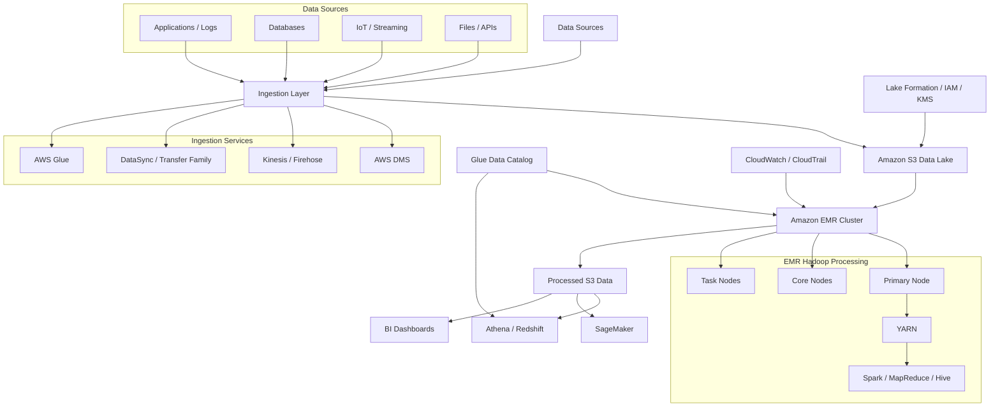

<a id="top"></a>

# ChatGPT Conversation — Big Data, Hadoop & Amazon S3 Architecture (Pulled Content)

Full content pulled from a separate shared ChatGPT conversation
(`chatgpt.com/share/6aa05333-40e0-83e9-9126-062f8561c1bd`, titled "Big
Data Architecture Design" — a different conversation thread from the
"AWS EMR Features" one behind
[ChatGPT-EMR-S3-IAM-Conversation.md](ChatGPT-EMR-S3-IAM-Conversation.md)
and [aws-hadoop-bigdata.md](aws-hadoop-bigdata.md)), reconstructed from
the page's embedded conversation data. One architecture-design
question/answer turn, produced by ChatGPT with live web search
grounding against AWS documentation — framed around a retail sales
use case, versus the log-analytics use case and more conceptual framing
in [aws-hadoop-bigdata.md](aws-hadoop-bigdata.md). Saved verbatim
(light formatting only) for reference — not yet cross-checked against
or merged into [EMR-Hadoop-Spark.md](../EMR-Hadoop-Spark.md) or
[AWS_Services.md](AWS_Services.md), which already cover overlapping
ground in this repo's own deep-dive style.

## Table of Contents

1. [Core components](#1-core-components)
2. [Amazon S3 data-lake structure](#2-amazon-s3-data-lake-structure)
   - [Data zones](#data-zones)
3. [Amazon EMR Hadoop cluster](#3-amazon-emr-hadoop-cluster)
   - [Primary node](#primary-node)
   - [Core nodes](#core-nodes)
   - [Task nodes](#task-nodes)
4. [Data-processing flow](#4-data-processing-flow)
   - [Step 1: Data ingestion](#step-1-data-ingestion)
   - [Step 2: Metadata discovery](#step-2-metadata-discovery)
   - [Step 3: Distributed processing](#step-3-distributed-processing)
   - [Step 4: Temporary processing](#step-4-temporary-processing)
   - [Step 5: Analytics consumption](#step-5-analytics-consumption)
5. [S3A and HDFS access](#5-s3a-and-hdfs-access)
6. [Example use case: Retail sales analytics](#6-example-use-case-retail-sales-analytics)
   - [Business requirements](#business-requirements)
   - [Implementation](#implementation)
7. [Security design](#7-security-design)
8. [High-availability and cost considerations](#8-high-availability-and-cost-considerations)
9. [When this architecture is appropriate](#9-when-this-architecture-is-appropriate)

---

# Big Data, Hadoop, and Amazon S3 Architecture

This architecture uses **Amazon S3 as the permanent data lake** and **Amazon EMR/Hadoop as the distributed processing platform**. It separates storage from compute, allowing EMR clusters to be scaled or terminated without losing the source and processed data.



[⬆ Back to top](#top)

## 1. Core components

| Component | Purpose |
|---|---|
| Amazon S3 | Durable storage for raw, processed and curated data |
| Amazon EMR | Managed platform for running Hadoop, Spark, Hive and related frameworks |
| Hadoop HDFS | Temporary distributed storage across EMR core nodes |
| Hadoop YARN | Allocates cluster resources and schedules processing jobs |
| Hadoop MapReduce | Processes large datasets in parallel |
| Apache Spark | Provides faster in-memory batch, SQL and machine-learning processing |
| Apache Hive | Enables SQL-style queries against large datasets |
| AWS Glue Data Catalog | Maintains table definitions, schemas and partition metadata |
| AWS Lake Formation | Provides centralized data-lake permissions and governance |
| AWS KMS | Encrypts S3 objects, EBS volumes and other supported resources |
| CloudWatch | Monitors clusters, applications, logs and job performance |
| CloudTrail | Records AWS API activity for auditing |

Amazon EMR is a managed cluster platform for Hadoop, Spark and other big-data frameworks.

[⬆ Back to top](#top)

## 2. Amazon S3 data-lake structure

A recommended bucket structure is:

```text
s3://company-data-lake/
├── raw/
│   ├── application-logs/
│   ├── transactions/
│   ├── customers/
│   └── iot-events/
├── processed/
│   ├── validated/
│   ├── standardized/
│   └── enriched/
├── curated/
│   ├── sales/
│   ├── finance/
│   └── customer-analytics/
├── rejected/
│   └── invalid-records/
├── scripts/
│   ├── spark/
│   └── hive/
└── logs/
    └── emr/
```

### Data zones

- **Raw zone:** Original data preserved without modification.
- **Processed zone:** Cleaned, validated and transformed data.
- **Curated zone:** Business-ready datasets optimized for reporting.
- **Rejected zone:** Invalid records requiring investigation or reprocessing.
- **Scripts zone:** Spark, Hive and MapReduce code.
- **Logs zone:** EMR step, application and operational logs.

S3 is well suited to this pattern because it decouples storage from compute and can act as the durable storage layer for multiple analytics services.

[⬆ Back to top](#top)

## 3. Amazon EMR Hadoop cluster

An EMR cluster on EC2 normally contains three node types:

| Node type | Function | Recommended capacity |
|---|---|---|
| Primary node | Coordinates the cluster, manages YARN and schedules jobs | On-Demand |
| Core nodes | Process data and maintain HDFS storage | On-Demand or stable capacity |
| Task nodes | Provide additional processing power without HDFS storage | Spot or On-Demand |

### Primary node

The primary node:

- Runs cluster-management services.
- Schedules Hadoop and Spark jobs.
- Manages YARN ResourceManager.
- Tracks the health of core and task nodes.
- Should normally use reliable On-Demand capacity.

### Core nodes

Core nodes:

- Run processing tasks.
- Host YARN NodeManager.
- Store temporary data in HDFS.
- Participate in HDFS replication.
- Must be scaled down carefully to avoid affecting temporary HDFS data.

### Task nodes

Task nodes:

- Provide compute capacity only.
- Do not store HDFS data.
- Can scale up and down according to workload.
- Are good candidates for Spot Instances.

EMR managed scaling can dynamically adjust core and task capacity within configured minimum and maximum limits.

[⬆ Back to top](#top)

## 4. Data-processing flow

### Step 1: Data ingestion

Data enters the platform through:

- **AWS DMS** for database replication.
- **Kinesis Data Streams or Firehose** for streaming events.
- **AWS DataSync** for large file transfers.
- **AWS Transfer Family** for SFTP-based transfers.
- **AWS Glue** for scheduled extraction and transformation.
- Application uploads and batch files.

The original data is written to the S3 raw zone.

### Step 2: Metadata discovery

AWS Glue crawlers can:

1. Scan the S3 data.
2. Detect file formats and schemas.
3. Identify partitions.
4. Register tables in the Glue Data Catalog.

Hive, Spark and Athena can then use the same catalog.

### Step 3: Distributed processing

An EMR job reads data from S3 using Hadoop-compatible file access.

For example:

```text
s3://company-data-lake/raw/transactions/
              ↓
        Spark or MapReduce
              ↓
s3://company-data-lake/processed/transactions/
```

The processing job might:

- Remove duplicate records.
- Handle missing values.
- Join transactions with customer data.
- Aggregate sales by region.
- Convert CSV or JSON into Parquet.
- Partition output by date, region or business unit.

### Step 4: Temporary processing

HDFS can hold:

- Shuffle data.
- Temporary job output.
- Intermediate MapReduce results.
- Frequently reused working datasets.

HDFS is tied to the lifecycle of the EMR cluster, so important business data should be written back to S3 before the cluster is terminated. AWS recommends S3 for input/output and HDFS primarily for temporary or random-I/O workloads.

### Step 5: Analytics consumption

Curated S3 data can be consumed by:

- **Amazon Athena** for serverless SQL queries.
- **Amazon Redshift** for data warehousing.
- **Amazon QuickSight** for dashboards.
- **Amazon SageMaker** for machine learning.
- **OpenSearch Service** for log analytics.
- Downstream applications and APIs.

[⬆ Back to top](#top)

## 5. S3A and HDFS access

On current Amazon EMR releases, Hadoop applications can access S3 through the **S3A file system**:

```text
s3://company-data-lake/raw/
```

Beginning with Amazon EMR 7.10.0, S3A is the default S3 connector for supported S3 URI schemes; earlier EMR releases commonly used EMRFS.

| S3/S3A | HDFS |
|---|---|
| Persistent object storage | Temporary cluster storage |
| Independent of EMR cluster lifecycle | Exists on EMR core nodes |
| Good for input, output and data-lake storage | Good for shuffle and intermediate results |
| Supports many AWS analytics services | Primarily accessible within the Hadoop cluster |
| Storage scales independently | Capacity depends on cluster disks |

[⬆ Back to top](#top)

## 6. Example use case: Retail sales analytics

A retail organization processes millions of daily transactions from stores, websites and mobile applications.

### Business requirements

- Preserve original transactions.
- Process terabytes of data every day.
- Generate regional and product-level reports.
- Detect abnormal purchasing behavior.
- Support machine-learning models.
- Retain data for compliance and historical analysis.

### Implementation

1. Store applications send transaction events through Kinesis.
2. Firehose delivers the events into `s3://data-lake/raw/transactions/`.
3. Glue crawlers register the transaction schema.
4. EventBridge or Step Functions starts an EMR processing job.
5. Spark reads raw transactions from S3.
6. Spark validates, deduplicates and enriches the records.
7. Temporary shuffle data is held in HDFS or local storage.
8. Results are written as compressed, partitioned Parquet files.
9. Athena and Redshift query the curated datasets.
10. QuickSight displays sales and inventory dashboards.
11. SageMaker consumes historical data for demand forecasting.

Example output structure:

```text
s3://company-data-lake/curated/sales/
└── year=2026/
    └── month=09/
        └── day=08/
            ├── region=us-east/
            └── region=us-west/
```

Partitioning allows query engines to scan only the data needed for a request.

[⬆ Back to top](#top)

## 7. Security design

- Place EMR instances in private subnets.
- Use an S3 gateway VPC endpoint for private S3 access.
- Block public access on every data-lake bucket.
- Encrypt S3 objects with SSE-KMS.
- Encrypt EBS volumes and Hadoop data in transit.
- Assign separate IAM roles to the EMR service and EC2 instances.
- Grant access only to required S3 prefixes and KMS keys.
- Use Lake Formation for database, table, column and row-level permissions.
- Store credentials in Secrets Manager rather than scripts.
- Enable CloudTrail, S3 data events and CloudWatch logging.
- Use S3 Versioning and Lifecycle rules for protection and cost management.

[⬆ Back to top](#top)

## 8. High-availability and cost considerations

- Store permanent data in S3 rather than relying on HDFS.
- Use multiple Availability Zones where supported by the chosen deployment model and workload.
- Use On-Demand Instances for primary and critical core capacity.
- Use Spot Instances primarily for replaceable task-node processing.
- Enable EMR managed scaling.
- Terminate transient clusters after jobs complete.
- Use Parquet or ORC rather than repeatedly scanning CSV or JSON.
- Compress data using Snappy or an appropriate codec.
- Partition data using frequently filtered columns.
- Move older data to lower-cost S3 storage classes through Lifecycle policies.
- Monitor small-file accumulation because excessive small files reduce Hadoop and Spark efficiency.

[⬆ Back to top](#top)

## 9. When this architecture is appropriate

Use this architecture for:

- Large-scale ETL pipelines.
- Centralized enterprise data lakes.
- Application and infrastructure log processing.
- Clickstream analytics.
- Financial transaction processing.
- IoT telemetry processing.
- Fraud detection.
- Customer behavior analytics.
- Machine-learning data preparation.
- Migration from an on-premises Hadoop cluster.

The key design principle is:

> **S3 provides durable, scalable storage; Hadoop and EMR provide temporary, elastic distributed compute; HDFS supports intermediate processing.**

[⬆ Back to top](#top)
