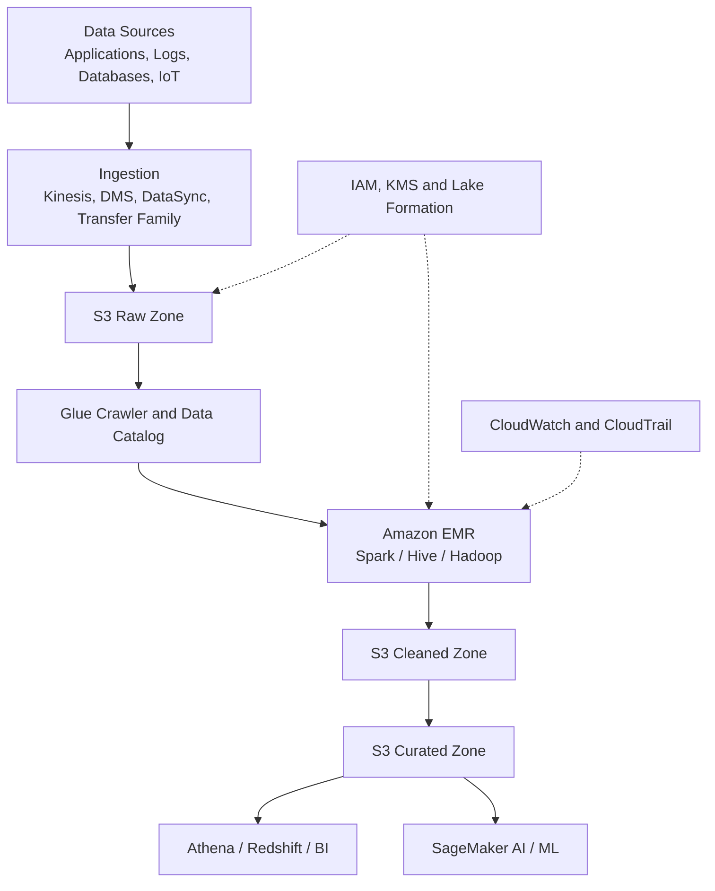
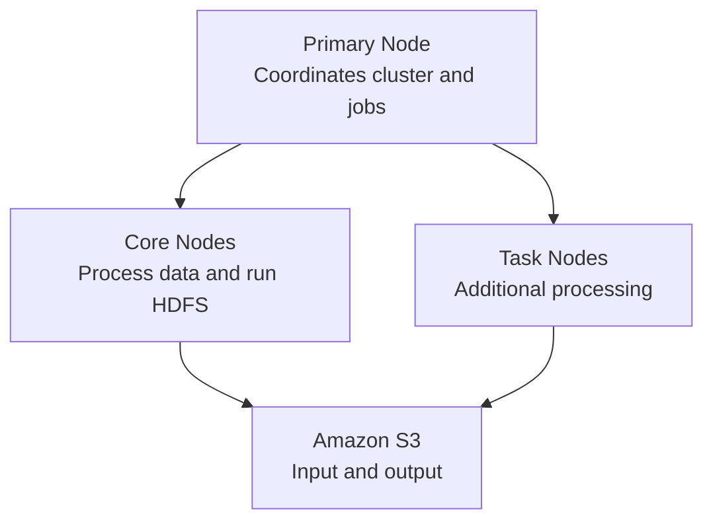
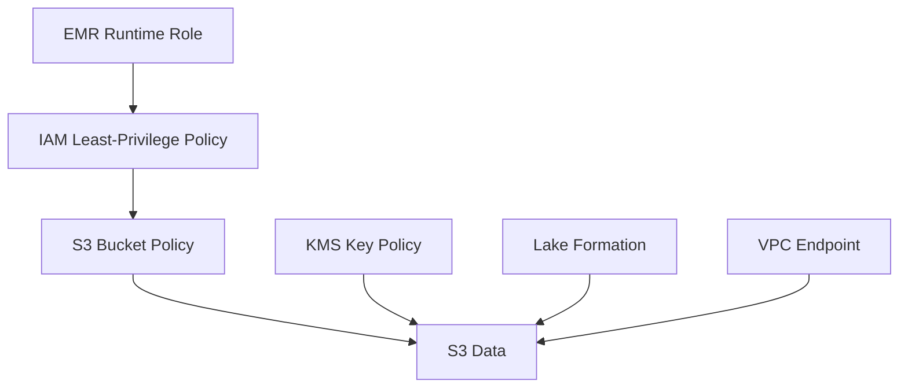
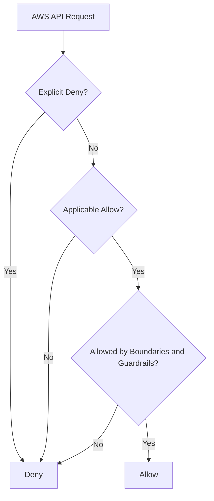
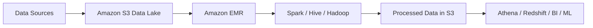

# ChatGPT Conversation — AWS EMR, S3 & IAM (Pulled Content)

Full content pulled from the shared ChatGPT conversation
(`chatgpt.com/share/6aa024ce-f254-83e9-bdec-e8c504766ae5`), reconstructed
from the page's embedded conversation data. Four question/answer turns,
each answer produced by ChatGPT with live web search grounding against
AWS documentation. Saved verbatim (light formatting only) for reference
— not yet cross-checked against or merged into
[EMR-Hadoop-Spark.md](../EMR-Hadoop-Spark.md) or
[AWS_Services.md](AWS_Services.md), which already cover overlapping
ground in this repo's own deep-dive style.

## Table of Contents

1. [Q1: AWS EMR and S3 architecture design and use case](#q1-aws-emr-and-s3-architecture-design-and-use-case)
   1. [Reference architecture](#reference-architecture)
   2. [Architecture components](#architecture-components)
   3. [S3 data-lake design](#s3-data-lake-design)
      - [Raw zone](#raw-zone)
      - [Cleaned zone](#cleaned-zone)
      - [Curated zone](#curated-zone)
      - [Quarantine zone](#quarantine-zone)
      - [Log bucket](#log-bucket)
   4. [Amazon EMR cluster design](#amazon-emr-cluster-design)
      - [Recommended purchasing model](#recommended-purchasing-model)
   5. [How EMR accesses S3](#how-emr-accesses-s3)
      - [S3 versus HDFS](#s3-versus-hdfs)
   6. [End-to-end processing flow](#end-to-end-processing-flow)
      - [Step 1: Data ingestion](#step-1-data-ingestion)
      - [Step 2: Raw storage](#step-2-raw-storage)
      - [Step 3: Data cataloging](#step-3-data-cataloging)
      - [Step 4: EMR processing](#step-4-emr-processing)
      - [Step 5: Analytics and consumption](#step-5-analytics-and-consumption)
      - [Step 6: Cluster termination](#step-6-cluster-termination)
   7. [Example use case: E-commerce sales analytics](#example-use-case-e-commerce-sales-analytics)
      - [Business requirement](#business-requirement)
      - [Solution flow](#solution-flow)
      - [Example output organization](#example-output-organization)
   8. [Security architecture](#security-architecture)
      - [1. Private networking](#1-private-networking)
      - [2. IAM roles](#2-iam-roles)
      - [3. Encryption](#3-encryption)
      - [4. Data governance](#4-data-governance)
      - [5. S3 protection](#5-s3-protection)
   9. [Reliability and disaster recovery](#reliability-and-disaster-recovery)
   10. [Performance optimization](#performance-optimization)
   11. [Cost optimization](#cost-optimization)
       - [EMR deployment selection](#emr-deployment-selection)
       - [Main architectural benefit](#main-architectural-benefit)
2. [Q2: Features and Characteristics of AWS S3](#q2-features-and-characteristics-of-aws-s3)
   1. [What is Amazon S3?](#what-is-amazon-s3)
   2. [Object storage architecture](#1-object-storage-architecture)
   3. [Buckets and objects](#2-buckets-and-objects)
   4. [High durability](#3-high-durability)
   5. [Massive scalability](#4-massive-scalability)
   6. [Strong consistency](#5-strong-consistency)
   7. [S3 storage classes](#6-s3-storage-classes)
   8. [S3 Intelligent-Tiering](#7-s3-intelligent-tiering)
   9. [S3 Lifecycle management](#8-s3-lifecycle-management)
   10. [S3 Versioning](#9-s3-versioning)
   11. [S3 replication](#10-s3-replication)
   12. [Encryption](#11-encryption)
   13. [Access control](#12-access-control)
   14. [S3 Block Public Access](#13-s3-block-public-access)
   15. [S3 Object Ownership](#14-s3-object-ownership)
   16. [S3 Object Lock](#15-s3-object-lock)
   17. [S3 Access Points](#16-s3-access-points)
   18. [Multi-Region Access Points](#17-multi-region-access-points)
   19. [S3 event notifications](#18-s3-event-notifications)
   20. [Data transfer capabilities](#19-data-transfer-capabilities)
   21. [Static website hosting](#20-static-website-hosting)
   22. [Monitoring, logging and analytics](#21-monitoring-logging-and-analytics)
   23. [S3 Batch Operations](#22-s3-batch-operations)
   24. [Pre-signed URLs](#23-pre-signed-urls)
   25. [Cost characteristics](#24-cost-characteristics)
   26. [Key characteristics summary](#key-characteristics-summary)
   27. [Common use cases](#common-use-cases)
3. [Q3: Features and Characteristics of AWS IAM](#q3-features-and-characteristics-of-aws-iam)
   1. [What is AWS IAM?](#what-is-aws-iam)
   2. [Core IAM components](#core-iam-components)
   3. [Authentication](#1-authentication)
   4. [Authorization](#2-authorization)
   5. [Fine-grained permissions](#3-fine-grained-permissions)
   6. [IAM users](#4-iam-users)
   7. [IAM groups](#5-iam-groups)
   8. [IAM roles](#6-iam-roles)
   9. [Temporary credentials](#7-temporary-credentials)
   10. [IAM policies](#8-iam-policies)
   11. [Types of policies](#9-types-of-policies)
   12. [Managed and inline policies](#10-managed-and-inline-policies)
   13. [IAM policy evaluation](#11-iam-policy-evaluation)
   14. [Role-based access control](#12-role-based-access-control)
   15. [Attribute-based access control](#13-attribute-based-access-control)
   16. [Multi-factor authentication](#14-multi-factor-authentication)
   17. [Identity federation](#15-identity-federation)
   18. [Cross-account access](#16-cross-account-access)
   19. [IAM Access Analyzer](#17-iam-access-analyzer)
   20. [IAM Policy Simulator](#18-iam-policy-simulator)
   21. [Auditing and monitoring](#19-auditing-and-monitoring)
   22. [IAM service characteristics](#20-iam-service-characteristics)
   23. [IAM security best practices](#iam-security-best-practices)
   24. [IAM versus IAM Identity Center](#iam-versus-iam-identity-center)
4. [Q4: Features and Characteristics of AWS EMR](#q4-features-and-characteristics-of-aws-emr)
   1. [What is Amazon EMR?](#what-is-amazon-emr)
   2. [Multiple deployment options](#1-multiple-deployment-options)
   3. [Support for open-source frameworks](#2-support-for-open-source-frameworks)
   4. [Managed cluster provisioning](#3-managed-cluster-provisioning)
   5. [Distributed cluster architecture](#4-distributed-cluster-architecture)
   6. [Elastic and scalable](#5-elastic-and-scalable)
   7. [Instance groups and instance fleets](#6-instance-groups-and-instance-fleets)
   8. [Cost optimization](#7-cost-optimization)
   9. [Amazon S3 integration](#8-amazon-s3-integration)
   10. [Flexible storage options](#9-flexible-storage-options)
   11. [AWS Glue Data Catalog integration](#10-aws-glue-data-catalog-integration)
   12. [Security](#11-security)
   13. [High availability and fault tolerance](#12-high-availability-and-fault-tolerance)
   14. [Monitoring and logging](#13-monitoring-and-logging)
   15. [EMR Studio and notebooks](#14-emr-studio-and-notebooks)
   16. [Customization](#15-customization)
   17. [Integration with AWS services](#16-integration-with-aws-services)
   18. [Transient and long-running clusters](#17-transient-and-long-running-clusters)
   19. [Key characteristics summary](#key-characteristics-summary-1)
   20. [Typical use cases](#typical-use-cases)
   21. [Simple data-processing flow](#simple-data-processing-flow)

---

## Q1: AWS EMR and S3 architecture design and use case

# AWS EMR and Amazon S3 Architecture Design

Amazon S3 and Amazon EMR are commonly combined to build a scalable **data lake and big-data processing platform**:

- **Amazon S3** provides durable, scalable storage.
- **Amazon EMR** supplies temporary or persistent compute using Spark, Hadoop, Hive, Trino and related frameworks.
- Storage and compute scale independently, improving flexibility and cost control.

## Reference architecture



## Architecture components

| Component | Responsibility |
|---|---|
| **Data sources** | Produce application, database, log, IoT or business data |
| **Ingestion services** | Transfer batch or streaming data into S3 |
| **Amazon S3** | Stores raw, processed and curated data |
| **AWS Glue Data Catalog** | Stores schemas, table definitions and partition metadata |
| **Amazon EMR** | Processes and transforms data using distributed frameworks |
| **AWS Lake Formation** | Provides centralized data-lake permissions and governance |
| **AWS KMS** | Encrypts S3 objects and EMR storage |
| **CloudWatch** | Monitors clusters, jobs and resource utilization |
| **CloudTrail** | Records AWS API and data-access activity |
| **Athena/Redshift** | Queries and analyzes processed data |
| **SageMaker AI** | Uses curated data for machine-learning workloads |

---

# S3 data-lake design

A production data lake should separate data by processing stage.

```text
s3://company-data-raw/
s3://company-data-cleaned/
s3://company-data-curated/
s3://company-emr-logs/
s3://company-data-quarantine/
```

Alternatively, one bucket can use controlled prefixes:

```text
s3://company-data-lake/raw/
s3://company-data-lake/cleaned/
s3://company-data-lake/curated/
s3://company-data-lake/quarantine/
```

Separate buckets provide stronger isolation, while prefixes reduce the number of resources to manage.

## Raw zone

Stores data in its original form.

Examples:

```text
raw/application-logs/year=2026/month=09/day=08/
raw/customer-transactions/year=2026/month=09/day=08/
raw/iot-devices/year=2026/month=09/day=08/
```

Characteristics:

- Immutable source data
- Restricted write permissions
- Retained for replay and auditing
- Versioning enabled
- Usually compressed
- Schema applied when processed

## Cleaned zone

Contains validated and standardized data:

- Invalid records removed or quarantined
- Duplicate records removed
- Data types standardized
- Sensitive fields masked
- Data converted to Parquet or ORC
- Records partitioned for efficient processing

## Curated zone

Contains business-ready datasets:

- Aggregated sales information
- Customer activity summaries
- Security insights
- Financial reports
- Machine-learning features
- Department-specific datasets

## Quarantine zone

Contains records that failed validation so they can be investigated or reprocessed.

## Log bucket

Stores:

- EMR application logs
- Spark event logs
- Bootstrap-action logs
- Cluster provisioning logs
- Step execution logs

The log bucket should have a different retention policy from business data.

---

# Amazon EMR cluster design

For an EMR on EC2 architecture, the cluster contains three node types.



| Node | Responsibility | Recommended capacity |
|---|---|---|
| **Primary** | Coordinates jobs, cluster health, YARN and Spark services | On-Demand |
| **Core** | Processes data and stores temporary HDFS data | Primarily On-Demand |
| **Task** | Adds processing capacity without storing HDFS data | Spot or mixed capacity |

The primary node manages the cluster; core nodes process and store HDFS data; task nodes provide processing capacity without contributing HDFS storage.

## Recommended purchasing model

- Use **On-Demand Instances** for primary nodes.
- Use On-Demand capacity for critical core nodes.
- Use **Spot Instances** for fault-tolerant task nodes.
- Use instance fleets with multiple instance types.
- Enable EMR Managed Scaling.
- Use Graviton instances where the workload supports ARM.
- Set maximum capacity to prevent unexpected scaling costs.

---

# How EMR accesses S3

EMR applications can directly read from and write to Amazon S3 using an S3 connector.

A Spark job might use:

```python
raw_data = spark.read.json(
    "s3://company-data-raw/application-logs/"
)

clean_data = raw_data.dropDuplicates().filter(
    raw_data.status.isNotNull()
)

clean_data.write.mode("overwrite").parquet(
    "s3://company-data-cleaned/application-logs/"
)
```

Historically, EMR used **EMRFS** for S3 access. Starting with Amazon EMR 7.10, S3A is the default S3 connector for supported S3 URI schemes.

## S3 versus HDFS

| Amazon S3 | HDFS |
|---|---|
| Durable object storage | Distributed cluster storage |
| Persists after EMR termination | Normally deleted with the cluster |
| Scales independently | Capacity depends on cluster nodes |
| Suitable for input and final output | Suitable for temporary and intermediate data |
| Shared by multiple analytics services | Primarily available to its cluster |
| Supports storage classes and lifecycle rules | Optimized for distributed local processing |

The recommended pattern is:

- Store source and final data in S3.
- Use HDFS or local disks for temporary shuffle and intermediate data.
- Terminate the EMR cluster after processing when persistent compute is unnecessary.

AWS describes S3 as the common location for input and output, while HDFS is useful for temporary processing and random-I/O workloads.

---

# End-to-end processing flow

## Step 1: Data ingestion

Data enters AWS from sources such as:

- Application servers
- Amazon RDS
- DynamoDB
- On-premises databases
- IoT devices
- Web applications
- Third-party APIs

Possible ingestion services include:

- Amazon Kinesis Data Firehose
- AWS Database Migration Service
- AWS DataSync
- AWS Transfer Family
- Amazon MSK
- Direct S3 uploads

## Step 2: Raw storage

Incoming data is stored in the S3 raw zone without changing its original format.

Example:

```text
s3://company-data-raw/orders/year=2026/month=09/day=08/
```

An S3 event can trigger:

- EventBridge
- Lambda
- Step Functions
- An EMR workflow
- Amazon MWAA

## Step 3: Data cataloging

An AWS Glue crawler scans the new data and creates or updates tables in the Glue Data Catalog.

The catalog records:

- Schema
- S3 location
- Column names
- Data types
- Partition information
- Table properties

Glue Data Catalog can serve as an external Hive metastore shared by EMR, Athena and Redshift Spectrum.

## Step 4: EMR processing

An EMR Spark job:

1. Reads raw data from S3.
2. Validates required fields.
3. Removes duplicate records.
4. Handles missing values.
5. Joins data from multiple sources.
6. Masks sensitive information.
7. Calculates business metrics.
8. Converts the data into Parquet.
9. Writes the results to cleaned and curated S3 zones.

## Step 5: Analytics and consumption

Processed data can be consumed by:

- Amazon Athena
- Amazon Redshift Spectrum
- Amazon Redshift
- Amazon OpenSearch Service
- BI dashboards
- SageMaker AI
- Downstream applications

## Step 6: Cluster termination

For batch workloads, the EMR cluster is terminated after the job succeeds. The data remains safely stored in S3.

---

# Example use case: E-commerce sales analytics

## Business requirement

An online retailer generates millions of daily records from:

- Customer orders
- Product views
- Website clickstreams
- Payment transactions
- Inventory databases
- Application logs

The business wants daily reports showing:

- Total sales by product
- Revenue by Region
- Abandoned shopping carts
- Most-viewed products
- Failed payments
- Customer buying patterns

## Solution flow


### Implementation

1. Kinesis Data Firehose delivers clickstream events to S3.
2. AWS DMS exports database changes from the order database to S3.
3. S3 stores the original data in the raw zone.
4. EventBridge starts a Step Functions workflow on a schedule.
5. Step Functions creates a transient EMR cluster.
6. Spark joins order, customer, product and clickstream datasets.
7. Spark removes duplicates and masks sensitive customer information.
8. Processed data is written to S3 in partitioned Parquet format.
9. Glue Data Catalog registers the new partitions.
10. Athena or Redshift queries the curated data.
11. A BI dashboard displays sales trends.
12. The EMR cluster terminates after successful processing.

## Example output organization

```text
s3://company-data-curated/sales/
    year=2026/
        month=09/
            day=08/
                part-00001.snappy.parquet
                part-00002.snappy.parquet
```

Partitioning allows queries to scan only the required dates instead of the entire dataset.

---

# Security architecture



## 1. Private networking

Deploy EMR nodes in private subnets with:

- No public IP addresses
- Restrictive security groups
- S3 gateway VPC endpoint
- Interface endpoints for required AWS services
- NAT Gateway only when external access is necessary
- Systems Manager for administrative access instead of public SSH

## 2. IAM roles

Use separate roles for:

- EMR service operations
- EC2 instance profiles
- Runtime jobs
- Data engineers
- Data analysts
- Orchestration services

Example access separation:

| Role | S3 access |
|---|---|
| **Ingestion role** | Write to raw zone |
| **EMR processing role** | Read raw; write cleaned and curated |
| **Analyst role** | Read curated data only |
| **Auditor role** | Read logs and configurations |
| **Administrator role** | Manage infrastructure without unrestricted data access |

## 3. Encryption

Use:

- SSE-KMS for S3 objects
- TLS for data in transit
- Encrypted EBS volumes
- Encrypted HDFS and local disks where required
- Separate KMS keys for data, logs and sensitive zones

EMR supports S3 encryption through its S3 file-system integration and can use customer-managed KMS keys.

## 4. Data governance

Use Lake Formation for:

- Database permissions
- Table permissions
- Column-level controls
- Row-level filtering
- Data-location permissions
- Cross-account data sharing

## 5. S3 protection

Enable:

- S3 Block Public Access
- Bucket owner enforced object ownership
- Versioning
- Lifecycle policies
- Object Lock for immutable regulated data
- Restricted bucket policies
- CloudTrail data events for sensitive buckets

---

# Reliability and disaster recovery

Recommended controls include:

- Keep persistent data in S3 rather than HDFS.
- Enable S3 Versioning.
- Use Cross-Region Replication where recovery requirements demand it.
- Store Spark and EMR logs in a separate S3 bucket.
- Use multiple primary nodes for critical long-running clusters.
- Diversify task-node instance types.
- Configure Spot capacity rebalancing.
- Make processing jobs idempotent and restartable.
- Maintain infrastructure and job definitions in version control.

---

# Performance optimization

- Store analytical data in Parquet or ORC.
- Compress data with Snappy or another appropriate codec.
- Partition by frequently filtered fields such as date or Region.
- Avoid very large numbers of tiny S3 objects.
- Compact small output files after streaming ingestion.
- Use appropriate Spark executor memory and cores.
- Right-size primary, core and task nodes.
- Use instance fleets to improve capacity availability.
- Enable managed scaling.
- Use S3 for persistent data and local storage for shuffle operations.
- Use predicate pushdown and column pruning.

Columnar formats such as Parquet can reduce storage, data scanned and query execution time compared with formats such as CSV and JSON.

---

# Cost optimization

- Use transient clusters for scheduled batch jobs.
- Use Spot Instances for task nodes.
- Configure EMR Managed Scaling.
- Shut down idle clusters automatically.
- Apply S3 Lifecycle policies.
- Archive old raw data to S3 Glacier.
- Use Parquet to reduce storage and query scanning.
- Monitor S3 and EMR costs with tags and Cost Explorer.
- Configure maximum cluster capacity.
- Use EMR Serverless for intermittent workloads that do not require cluster control.

## EMR deployment selection

| Requirement | Recommended option |
|---|---|
| Maximum cluster control | EMR on EC2 |
| Existing Kubernetes platform | EMR on EKS |
| Intermittent Spark or Hive jobs | EMR Serverless |
| Persistent interactive analytics | Long-running EMR cluster |
| Daily batch ETL | Transient EMR cluster |
| Low-cost fault-tolerant processing | EMR task nodes using Spot |

## Main architectural benefit

The main advantage is the **separation of compute and storage**:

- S3 stores data persistently.
- EMR compute is created, scaled and terminated independently.
- Multiple EMR clusters and other analytics services can process the same S3 data.
- Processing failures do not remove the source data.
- Storage and compute costs can be optimized separately.

This makes the combination suitable for scalable data lakes, ETL pipelines, log analytics, machine learning and enterprise reporting.

---

## Q2: Features and Characteristics of AWS S3

# Amazon S3: Features and Characteristics

## What is Amazon S3?

**Amazon Simple Storage Service (Amazon S3)** is a managed **object storage service** designed to store and retrieve virtually any amount of data from anywhere.

S3 is commonly used for:

- Backup and recovery
- Data lakes and analytics
- Static website content
- Application files
- Log storage
- Media files
- Software artifacts
- Disaster recovery
- Archiving
- AI and machine-learning datasets

Amazon S3 provides high scalability, durability, availability, security, and performance.

---

## 1. Object storage architecture

S3 stores data as **objects**, rather than blocks or traditional files.

Each object consists of:

- The actual data
- An object key or name
- System metadata
- User-defined metadata
- Optional object tags
- Optional version ID

Objects are stored inside **buckets**.

```text
s3://company-data/production/reports/report.csv
      └─ Bucket ─┘└──────── Object key ────────┘
```

Although prefixes such as `production/reports/` look like folders, S3 uses a flat object-key structure rather than a traditional directory hierarchy.

---

## 2. Buckets and objects

### Bucket characteristics

An S3 bucket:

- Is created in a specific AWS Region.
- Contains objects.
- Has access, security, lifecycle and logging configurations.
- Can store any number of objects.
- Uses a name unique within its applicable AWS partition.
- Can have versioning enabled.
- Can host event-notification configurations.
- Can be accessed through the console, CLI, SDK or REST API.

### Object characteristics

An S3 object:

- Is identified by a unique key within a bucket.
- Can contain metadata and tags.
- Can be encrypted.
- Can have multiple versions.
- Can be copied between buckets.
- Can belong to a specific storage class.

---

## 3. High durability

Amazon S3 Standard is designed for:

- **99.999999999% durability**, commonly called eleven nines.
- **99.99% availability** over a given year.

Most regional S3 storage classes redundantly store objects across multiple devices in at least three Availability Zones.

Durability means the likelihood that your stored objects will remain intact. Availability measures how frequently the objects can be accessed.

---

## 4. Massive scalability

S3 automatically scales without requiring administrators to provision storage servers or calculate storage capacity.

Characteristics include:

- Virtually unlimited total storage
- Automatic scaling
- Support for very large numbers of objects
- Parallel uploads and downloads
- High request throughput
- No storage infrastructure to manage

S3 performance scales by prefix and supports parallel requests for high-throughput applications.

---

## 5. Strong consistency

Amazon S3 provides strong read-after-write consistency.

After a successful:

- `PUT`
- `COPY`
- Overwrite
- `DELETE`
- Tag or metadata update

subsequent read and list requests immediately reflect the completed operation.

Updates to an individual object key are atomic. A reader receives either the old object or the new object—never a partial object.

---

## 6. S3 storage classes

S3 provides storage classes for different access, availability and cost requirements.

| Storage class | Characteristics | Common use |
|---|---|---|
| **S3 Standard** | Multi-AZ, low latency and frequent access | Applications, websites and data lakes |
| **S3 Intelligent-Tiering** | Automatically moves objects among access tiers | Unknown or changing access patterns |
| **S3 Standard-IA** | Multi-AZ and lower storage cost with retrieval charges | Infrequently accessed backups |
| **S3 One Zone-IA** | Stores data in one AZ | Re-creatable, infrequently accessed data |
| **S3 Express One Zone** | Single-AZ, very low latency and high request performance | Performance-sensitive analytics and applications |
| **S3 Glacier Instant Retrieval** | Archive storage with millisecond retrieval | Rarely accessed data needing immediate retrieval |
| **S3 Glacier Flexible Retrieval** | Low-cost archive with asynchronous retrieval | Backup and disaster recovery archives |
| **S3 Glacier Deep Archive** | Lowest-cost long-term archive | Compliance and long-term retention |

S3 Express One Zone uses **directory buckets** and is intended for latency-sensitive workloads requiring very high request rates.

---

## 7. S3 Intelligent-Tiering

S3 Intelligent-Tiering monitors access patterns and automatically moves objects between access tiers.

Benefits include:

- No manual lifecycle analysis
- Automatic storage-cost optimization
- No retrieval charge for the frequent and infrequent access tiers
- Suitable for unpredictable access patterns
- Optional archive tiers for rarely accessed data

A small monitoring and automation charge applies per eligible object.

---

## 8. S3 Lifecycle management

Lifecycle rules automate how objects are managed over time.

A lifecycle policy can:

- Move objects from S3 Standard to Standard-IA.
- Transition objects into Glacier storage.
- Delete expired objects.
- Remove older object versions.
- Delete incomplete multipart uploads.
- Expire delete markers.

For example:

```text
Day 0       → S3 Standard
Day 30      → S3 Standard-IA
Day 90      → S3 Glacier Flexible Retrieval
After 7 yrs → Delete
```

Lifecycle rules help reduce costs and enforce data-retention policies.

---

## 9. S3 Versioning

S3 Versioning preserves multiple versions of an object.

It helps protect against:

- Accidental deletion
- Unintended overwrites
- Application errors
- Ransomware-related changes
- Incorrect deployments

When versioning is enabled:

- Each object version receives a version ID.
- Overwriting creates a new version.
- A simple deletion normally creates a delete marker.
- Previous versions can be restored.
- Every retained version incurs storage charges.

Versioning cannot return to an unversioned state after it has been enabled, but it can be suspended.

---

## 10. S3 replication

S3 Replication automatically copies eligible objects between buckets.

### Replication types

| Type | Description |
|---|---|
| **Same-Region Replication** | Replicates objects between buckets in the same Region |
| **Cross-Region Replication** | Replicates objects to a bucket in another Region |
| **Two-way replication** | Replicates changes in both directions when appropriately configured |
| **Batch Replication** | Replicates existing objects using S3 Batch Operations |

Use cases include:

- Disaster recovery
- Compliance
- Data sovereignty
- Reduced access latency
- Log aggregation
- Data isolation
- Replication between AWS accounts

Replication can copy object metadata and tags and can use a different storage class at the destination.

---

## 11. Encryption

Amazon S3 supports encryption at rest and in transit.

### Encryption at rest

| Method | Key management |
|---|---|
| **SSE-S3** | Keys managed entirely by Amazon S3 |
| **SSE-KMS** | Keys managed through AWS KMS |
| **DSSE-KMS** | Two independent layers of server-side KMS encryption |
| **SSE-C** | Customer supplies the encryption key with each request |
| **Client-side encryption** | Data is encrypted before being uploaded |

S3 automatically applies server-side encryption to new object uploads.

### Encryption in transit

S3 supports HTTPS/TLS. A bucket policy can deny requests that do not use secure transport:

```json
{
  "Effect": "Deny",
  "Principal": "*",
  "Action": "s3:*",
  "Resource": [
    "arn:aws:s3:::company-data",
    "arn:aws:s3:::company-data/*"
  ],
  "Condition": {
    "Bool": {
      "aws:SecureTransport": "false"
    }
  }
}
```

---

## 12. Access control

S3 integrates with AWS IAM to provide fine-grained authorization.

Access can be controlled through:

- IAM identity policies
- Bucket policies
- S3 Access Points
- Access Point policies
- Service Control Policies
- Resource Control Policies
- VPC endpoint policies
- AWS KMS key policies
- Access Control Lists
- Pre-signed URLs

Policies can restrict access based on:

- Principal
- API action
- Bucket or object ARN
- Source IP address
- VPC endpoint
- AWS Organization
- Encryption method
- Object tags
- Requested prefix
- TLS usage

AWS generally recommends IAM and bucket policies instead of ACLs for access management.

---

## 13. S3 Block Public Access

S3 Block Public Access prevents accidental exposure through public policies or ACLs.

It can be configured at:

- Organization level
- Account level
- Bucket level
- Access Point level

Its four principal settings can:

- Block new public ACLs
- Ignore existing public ACLs
- Block public bucket policies
- Restrict public and cross-account bucket policies

AWS recommends enabling all four settings when public access is not explicitly required.

---

## 14. S3 Object Ownership

S3 Object Ownership determines who owns uploaded objects.

The recommended **Bucket owner enforced** setting:

- Gives the bucket owner control over objects.
- Disables ACLs.
- Simplifies access management.
- Uses policies for access control.

This is particularly useful when different AWS accounts upload objects to the same bucket.

---

## 15. S3 Object Lock

S3 Object Lock provides **write once, read many**, or WORM, protection.

It supports:

### Retention periods

Protect an object until a specific date.

### Legal holds

Protect an object indefinitely until the legal hold is removed.

### Retention modes

| Mode | Characteristic |
|---|---|
| **Governance mode** | Authorized users can bypass retention with special permission |
| **Compliance mode** | Protected versions cannot be deleted or overwritten, including by the root user |

Object Lock is commonly used for:

- Regulatory compliance
- Financial records
- Security logs
- Legal evidence
- Ransomware protection
- Backup immutability

---

## 16. S3 Access Points

S3 Access Points simplify access management for shared datasets.

Each access point can have:

- A unique hostname
- Its own access policy
- A specific network origin
- Restrictions to a VPC
- Permissions for a particular application or team

Instead of maintaining one extremely large bucket policy, an organization can create separate access points for developers, analytics systems and backup applications.

---

## 17. Multi-Region Access Points

S3 Multi-Region Access Points provide a global endpoint for data stored across multiple AWS Regions.

Characteristics include:

- Global access endpoint
- Routing to an appropriate regional bucket
- Active-active application support
- Cross-Region replication integration
- Failover controls
- Improved global access performance
- Support for multi-Region disaster recovery

---

## 18. S3 event notifications

S3 can generate events when objects are:

- Created
- Deleted
- Restored from archive
- Replicated
- Transitioned between storage classes
- Modified through lifecycle operations

Events can be sent to:

- Amazon EventBridge
- Amazon SNS
- Amazon SQS
- AWS Lambda

Example:


Applications should generally handle duplicate or out-of-order event delivery safely.

---

## 19. Data transfer capabilities

S3 supports several data-transfer options:

- Multipart upload
- S3 Transfer Acceleration
- AWS DataSync
- AWS Transfer Family
- AWS Snow Family
- Direct Connect
- Site-to-Site VPN
- Pre-signed URLs
- Copy operations
- S3 Batch Operations

### Multipart upload

Large files are divided into independently uploaded parts.

Benefits include:

- Parallel uploads
- Retry only failed parts
- Improved throughput
- Pause and resume capabilities
- Better performance across unreliable networks

### Transfer Acceleration

Transfer Acceleration uses AWS edge locations and the AWS global network to accelerate long-distance uploads and downloads.

---

## 20. Static website hosting

A general-purpose S3 bucket can host static content such as:

- HTML
- CSS
- JavaScript
- Images
- Client-side applications

S3 static website endpoints do not directly provide HTTPS. A common secure architecture places **Amazon CloudFront** in front of a private S3 bucket and uses Origin Access Control.

S3 does not execute server-side application code such as PHP, Java or Node.js.

---

## 21. Monitoring, logging and analytics

S3 integrates with:

- AWS CloudTrail
- Amazon CloudWatch
- AWS Config
- IAM Access Analyzer
- Amazon Macie
- AWS Security Hub
- GuardDuty Malware Protection
- S3 Storage Lens
- S3 Inventory
- Server access logging

### S3 Storage Lens

Provides organization-wide visibility into:

- Storage usage
- Object counts
- Cost optimization
- Data protection
- Access management
- Activity trends

### S3 Inventory

Produces scheduled reports listing objects and properties such as:

- Size
- Storage class
- Encryption status
- Replication status
- Version ID
- Object Lock status

---

## 22. S3 Batch Operations

S3 Batch Operations performs an operation across thousands, millions or billions of objects.

Examples include:

- Copying objects
- Replacing tags
- Applying Object Lock retention
- Restoring archived objects
- Invoking Lambda functions
- Replicating existing objects

It uses an S3 Inventory report or another CSV manifest to identify target objects.

---

## 23. Pre-signed URLs

A pre-signed URL provides temporary access to a private object without making the bucket public.

It can authorize:

- Downloads
- Uploads
- Time-limited access
- Specific HTTP operations

The URL operates using the permissions of the principal that generated it and expires after the configured period.

---

## 24. Cost characteristics

S3 uses a pay-as-you-go pricing model.

Charges may include:

- Storage consumed
- API requests
- Data retrieval
- Internet or cross-Region data transfer
- Lifecycle transitions
- Replication
- Intelligent-Tiering monitoring
- Data-management and analytics features
- Early-deletion charges for applicable storage classes

Cost-optimization techniques include:

- Selecting the correct storage class
- Using lifecycle rules
- Deleting incomplete multipart uploads
- Expiring obsolete versions
- Using Intelligent-Tiering
- Monitoring with Storage Lens
- Compressing appropriate data
- Avoiding unnecessary cross-Region transfers

---

## Key characteristics summary

| Characteristic | Description |
|---|---|
| **Storage type** | Object storage |
| **Managed service** | AWS manages infrastructure, maintenance and scaling |
| **Regional resource** | Buckets and stored objects reside in a selected Region |
| **Highly durable** | Designed for eleven-nines durability |
| **Highly available** | Multi-AZ storage options are available |
| **Virtually unlimited** | Automatically scales as data grows |
| **Strongly consistent** | Reads and listings reflect successful writes and deletes |
| **Secure** | Supports IAM, policies, encryption and public-access blocking |
| **Version controlled** | Preserves and restores previous object versions |
| **Cost optimized** | Offers multiple storage classes and lifecycle automation |
| **Event driven** | Integrates with Lambda, EventBridge, SNS and SQS |
| **Auditable** | Integrates with CloudTrail, Config and S3 Inventory |
| **API accessible** | Accessible through REST, SDKs, CLI and console |
| **Not traditional file storage** | Uses buckets, keys and objects instead of mounted block storage |

## Common use cases

- Data lake storage
- Backup and restoration
- Long-term archival
- Static website hosting
- Application asset storage
- Log and audit storage
- CI/CD artifacts
- Database exports
- Media distribution
- Machine-learning datasets
- Disaster recovery
- Compliance record retention
- Software package storage
- Big-data analytics

In summary, **Amazon S3 is a scalable, durable and secure object-storage platform that supports operational applications, backups, archives, data lakes, analytics and disaster-recovery workloads.**

---

## Q3: Features and Characteristics of AWS IAM

# AWS Identity and Access Management (IAM)

## What is AWS IAM?

**AWS Identity and Access Management (IAM)** is a global AWS service that controls **who is authenticated and what they are authorized to do** in an AWS environment.

IAM helps answer four access-control questions:

- **Principal:** Who is requesting access?
- **Action:** What operation do they want to perform?
- **Resource:** Which AWS resource are they trying to access?
- **Condition:** Under what circumstances should access be allowed?

IAM provides centralized, fine-grained access control across AWS services.

## Core IAM components

| Component | Purpose |
|---|---|
| **IAM user** | Long-term identity representing a person or application |
| **IAM group** | Collection of IAM users that share permissions |
| **IAM role** | Assumable identity that provides temporary permissions |
| **IAM policy** | JSON document defining allowed or denied actions |
| **Credentials** | Passwords, access keys, certificates or temporary security tokens |
| **Identity provider** | External authentication system connected through federation |
| **Permissions boundary** | Defines the maximum permissions a user or role may receive |

## 1. Authentication

Authentication verifies the identity of the principal making a request.

IAM supports:

- Console username and password
- Access key ID and secret access key
- Temporary AWS STS credentials
- Multi-factor authentication
- SAML 2.0 federation
- OpenID Connect
- Corporate identity providers
- IAM Identity Center
- Workload identities

AWS recommends federated access and temporary credentials for human users instead of creating long-term IAM users wherever possible.

## 2. Authorization

Authorization determines whether an authenticated principal can perform a requested action.

For example, IAM can determine whether a developer can:

- Start an EC2 instance
- Read objects from a specific S3 bucket
- Update a Lambda function
- Create an RDS database
- Assume a cross-account role
- Decrypt data using a KMS key

Authorization is controlled primarily through policies.

## 3. Fine-grained permissions

IAM permissions can restrict access according to:

- AWS service
- API action
- Specific resource
- Resource ARN
- AWS Region
- Source IP address
- VPC or VPC endpoint
- Date and time
- MFA status
- Resource tags
- Principal tags
- Organization ID
- Requested resource tags

For example, a policy could allow developers to start EC2 instances only when:

- The instance has the tag `Environment=Development`.
- The request originates from a corporate IP address.
- The user authenticated with MFA.

## 4. IAM users

An IAM user represents an identity within one AWS account.

An IAM user can have:

- Console password
- Access keys
- MFA device
- Directly attached policies
- Inline policies
- Group membership

IAM users may be appropriate for limited use cases requiring long-term credentials. For regular workforce access, AWS recommends federation through IAM Identity Center.

## 5. IAM groups

An IAM group is a collection of IAM users.

Examples include:

- Developers
- DatabaseAdministrators
- SecurityAuditors
- NetworkEngineers
- ReadOnlyUsers

Permissions assigned to a group are inherited by its users.

Important characteristics:

- Groups contain users, not roles.
- Groups cannot be nested.
- A user can belong to multiple groups.
- Groups simplify permission administration.
- Groups cannot directly authenticate or make AWS requests.

## 6. IAM roles

An IAM role is an identity that can be assumed by trusted principals. Unlike IAM users, roles do not normally have long-term passwords or access keys.

Roles issue temporary credentials through **AWS Security Token Service (STS)**.

Common role use cases include:

- EC2 accessing an S3 bucket
- Lambda reading a DynamoDB table
- GitHub Actions deploying AWS infrastructure through OIDC
- Cross-account administration
- Federated workforce access
- EKS pods accessing AWS services
- One AWS service accessing another service
- Temporary elevated access

AWS identifies roles as the preferred mechanism for workload access and temporary delegation.

### Two parts of a role

| Role component | Purpose |
|---|---|
| **Trust policy** | Defines who or what may assume the role |
| **Permissions policy** | Defines what the assumed role may do |

## 7. Temporary credentials

Temporary credentials contain:

- Access key ID
- Secret access key
- Session token
- Expiration time

Benefits include:

- Automatically expire
- Reduce exposure of long-term secrets
- Can be limited by session policies
- Support role assumption
- Support identity federation
- Work well with automated workloads

Examples of STS operations include:

- `AssumeRole`
- `AssumeRoleWithWebIdentity`
- `AssumeRoleWithSAML`
- `GetSessionToken`

## 8. IAM policies

IAM policies are JSON documents that define permissions.

A policy statement commonly contains:

| Element | Function |
|---|---|
| `Version` | Policy-language version |
| `Statement` | Contains one or more permission rules |
| `Effect` | Specifies `Allow` or `Deny` |
| `Action` | AWS API operations |
| `Resource` | Resources affected by the policy |
| `Principal` | Identity receiving access, primarily in resource policies |
| `Condition` | Optional restrictions on when the statement applies |
| `Sid` | Optional statement identifier |

### Example policy

This policy allows reading objects from one S3 bucket:

```json
{
  "Version": "2012-10-17",
  "Statement": [
    {
      "Sid": "ReadApplicationFiles",
      "Effect": "Allow",
      "Action": [
        "s3:GetObject"
      ],
      "Resource": "arn:aws:s3:::application-data/*"
    }
  ]
}
```

## 9. Types of policies

### Identity-based policies

Attached to:

- IAM users
- IAM groups
- IAM roles

They define what the identity can do.

### Resource-based policies

Attached directly to supported resources, such as:

- S3 buckets
- KMS keys
- SNS topics
- SQS queues
- Secrets Manager secrets
- Lambda functions
- IAM role trust relationships

They specify which principals can access the resource.

### Permissions boundaries

Set the maximum permissions that an IAM user or role can receive. A permissions boundary does not grant access by itself.

### Session policies

Restrict permissions for an individual temporary session created through AWS STS.

### Service Control Policies

AWS Organizations SCPs define permission guardrails for member accounts and organizational units. They do not grant permissions.

### Resource Control Policies

Organizations RCPs centrally define maximum available permissions for resources in member accounts.

### Access Control Lists

Some AWS services use ACLs to grant access to resources, although ACLs are not JSON IAM policies.

## 10. Managed and inline policies

| Policy type | Description |
|---|---|
| **AWS managed policy** | Created and maintained by AWS |
| **Customer managed policy** | Created by the customer and reusable across identities |
| **Inline policy** | Embedded directly into one user, group or role |

Customer-managed policies usually provide better control and reuse than inline policies.

## 11. IAM policy evaluation

IAM uses the following fundamental rules:

1. Requests are implicitly denied by default.
2. An applicable explicit `Allow` is required.
3. Guardrails such as permissions boundaries and SCPs may limit the permission.
4. Any applicable explicit `Deny` overrides every `Allow`.



When identity-based and resource-based policies are evaluated together, permissions can be combined, but an explicit deny still overrides an allow. Permissions boundaries, SCPs, RCPs and session policies can further restrict the effective permission.

## 12. Role-based access control

**RBAC** grants permissions based on job function or role.

Examples:

- Developers can manage development resources.
- Security engineers can view security findings.
- Database administrators can manage RDS databases.
- Auditors receive read-only access.

RBAC is relatively simple but may require many roles as an organization grows.

## 13. Attribute-based access control

**ABAC** grants access by comparing attributes represented by tags.

Example:

- Principal tag: `Project=Phoenix`
- Resource tag: `Project=Phoenix`

The policy permits a principal to manage resources only when the principal and resource project tags match.

Benefits include:

- Scalable permissions
- Fewer individual policies
- Dynamic project access
- Reduced manual permission updates
- Easier management of rapidly changing environments

## 14. Multi-factor authentication

IAM supports MFA to add another verification factor beyond a password.

MFA can protect:

- Root-user access
- IAM user console access
- Sensitive API operations
- Role assumption
- Privileged administrative tasks

Policies can use conditions such as `aws:MultiFactorAuthPresent` to require MFA before sensitive operations.

## 15. Identity federation

Federation allows users to access AWS using an external identity provider rather than separate IAM-user credentials.

Supported approaches include:

- IAM Identity Center
- SAML 2.0
- OpenID Connect
- Active Directory
- Microsoft Entra ID
- Okta and other identity providers
- Web identity federation

Federated users typically assume IAM roles and receive temporary credentials.

## 16. Cross-account access

IAM roles allow a principal in one AWS account to access resources in another.

For successful cross-account access:

- The destination role's trust policy must trust the external principal.
- The source principal needs permission to call `sts:AssumeRole`.
- The assumed role needs permissions for the destination resources.
- Applicable SCPs, resource policies and other guardrails must allow the request.

## 17. IAM Access Analyzer

IAM Access Analyzer helps identify and validate access configurations.

It can:

- Detect resources shared externally
- Identify unintended public access
- Identify cross-account access
- Validate IAM policy syntax
- Report security warnings
- Generate policies based on CloudTrail activity
- Help refine permissions toward least privilege

AWS recommends Access Analyzer for policy validation and reviewing public or cross-account access.

## 18. IAM Policy Simulator

The policy simulator tests whether policies allow or deny selected actions.

It can help troubleshoot:

- Access-denied errors
- Identity-based policies
- Permissions boundaries
- Resource-specific access
- Policy conditions

A successful simulation does not always guarantee actual access because live requests may also be affected by resource policies, SCPs, KMS key policies or service-specific authorization rules.

## 19. Auditing and monitoring

IAM integrates with:

- **AWS CloudTrail:** Records IAM and AWS API activity.
- **AWS Config:** Evaluates resource configurations.
- **Amazon CloudWatch:** Monitors logs, events and alarms.
- **Security Hub:** Aggregates security findings.
- **EventBridge:** Responds to IAM-related events.
- **IAM credential reports:** Reports account-level credential status.
- **Access Advisor:** Shows service access and last-accessed information.

## 20. IAM service characteristics

| Characteristic | Description |
|---|---|
| **Global service** | IAM resources are generally not tied to one AWS Region |
| **No additional charge** | IAM itself is available without a separate service charge |
| **Centralized** | Controls access across AWS services and resources |
| **Fine-grained** | Permissions can be restricted by action, resource and condition |
| **Secure by default** | Requests are implicitly denied unless allowed |
| **Policy-driven** | Access is controlled through JSON policies |
| **Highly integrated** | Nearly all AWS services integrate with IAM |
| **Supports federation** | Works with corporate and web identity providers |
| **Temporary access** | Roles and STS reduce reliance on long-term credentials |
| **Scalable** | Supports RBAC, ABAC, groups and organizational guardrails |
| **Auditable** | Integrates with CloudTrail and Access Analyzer |
| **Eventually consistent** | IAM updates may take time to propagate across AWS systems |

## IAM security best practices

- Do not use the root user for daily activities.
- Protect the root user with MFA.
- Use IAM Identity Center for workforce access.
- Use roles and temporary credentials for workloads.
- Avoid embedding access keys in application code.
- Store unavoidable secrets securely and rotate them.
- Apply least-privilege permissions.
- Avoid unrestricted `"Action": "*"` and `"Resource": "*"`.
- Use conditions to limit access.
- Use SCPs and permissions boundaries as guardrails.
- Review unused users, roles, policies and credentials.
- Use Access Analyzer to validate policies.
- Log API activity with CloudTrail.
- Require MFA for privileged operations.
- Use separate roles for administration, deployment and read-only access.

AWS specifically recommends federation for human users, roles for workloads, MFA, least privilege, regular permission reviews and permissions guardrails.

## IAM versus IAM Identity Center

| AWS IAM | IAM Identity Center |
|---|---|
| Controls permissions within AWS | Centrally manages workforce access |
| Creates users, groups, roles and policies | Assigns users and groups to multiple accounts |
| Supports service and workload identities | Provides single sign-on |
| Exists inside an AWS account | Manages multi-account access through permission sets |
| Best for roles, policies and workload permissions | Best for employee access across an AWS Organization |

In summary, **AWS IAM is the foundation of AWS security**. It provides centralized identity management, authentication, fine-grained authorization, temporary credentials, federation, cross-account access and policy-based security controls.

---

## Q4: Features and Characteristics of AWS EMR

# Amazon EMR: Features and Characteristics

## What is Amazon EMR?

**Amazon EMR (Elastic MapReduce)** is an AWS-managed big-data analytics platform used to process, transform, and analyze large volumes of structured and unstructured data. It simplifies deploying frameworks such as Apache Spark and Apache Hadoop without manually building and maintaining the underlying distributed-computing environment.

Common workloads include:

- Big-data processing
- ETL and data transformation
- Log analysis
- Machine learning and feature engineering
- Interactive SQL analytics
- Real-time and batch data processing
- Petabyte-scale data-lake analytics

## 1. Multiple deployment options

Amazon EMR offers three primary deployment models:

| Deployment option | Description | Best use case |
|---|---|---|
| **EMR on EC2** | Creates and manages a cluster of EC2 instances | Maximum infrastructure control and long-running clusters |
| **EMR on EKS** | Runs EMR analytics jobs as containers on Amazon EKS | Organizations already using Kubernetes |
| **EMR Serverless** | Runs Spark and Hive workloads without managing servers or clusters | Variable, intermittent, or unpredictable workloads |

EMR on EKS separates analytics applications from the underlying infrastructure and can run isolated jobs using EC2 or AWS Fargate resources.

## 2. Support for open-source frameworks

Amazon EMR supports popular distributed-processing and analytics applications, including:

- Apache Spark
- Apache Hadoop
- Apache Hive
- Apache HBase
- Apache Flink
- Trino
- Presto
- Apache Hudi
- Apache Iceberg
- Delta Lake
- Jupyter-based notebooks

AWS provides performance-optimized runtimes for technologies such as Spark, Hive, Trino, and Flink.

## 3. Managed cluster provisioning

EMR automates much of the work required to create a big-data cluster, including:

- Provisioning EC2 instances
- Installing selected analytics frameworks
- Configuring cluster components
- Connecting cluster nodes
- Replacing unhealthy instances
- Submitting and tracking processing jobs
- Terminating temporary clusters after job completion

Clusters can be created through:

- AWS Management Console
- AWS CLI
- AWS SDK
- CloudFormation
- Terraform
- EMR API

## 4. Distributed cluster architecture

A traditional EMR on EC2 cluster can contain three node types:

| Node type | Function |
|---|---|
| **Primary node** | Coordinates the cluster, manages jobs, and runs services such as YARN ResourceManager |
| **Core node** | Processes data and stores data in the Hadoop Distributed File System |
| **Task node** | Provides additional processing capacity but does not store HDFS data |

Task nodes are good candidates for EC2 Spot Instances because losing one does not remove data stored in HDFS.

## 5. Elastic and scalable

EMR can scale resources according to workload demand.

Scaling options include:

- **Managed Scaling:** EMR automatically determines when to add or remove capacity.
- **Automatic scaling:** Uses CloudWatch metrics and user-defined rules.
- **Manual resizing:** Administrators add or remove instances directly.
- **EMR Serverless scaling:** Automatically allocates and releases workers based on job requirements.

Managed Scaling can improve cluster utilization while reducing unnecessary compute costs.

## 6. Instance groups and instance fleets

EMR provides two ways to configure cluster capacity:

### Instance groups

- Each group uses a single EC2 instance type.
- A group uses either On-Demand or Spot purchasing.
- Easier to configure.
- Suitable for predictable workloads.

### Instance fleets

- Support multiple EC2 instance types.
- Can combine On-Demand and Spot capacity.
- Use allocation strategies to select available capacity.
- Improve flexibility, availability, and cost optimization.

Instance fleets support a flexible resource-provisioning strategy for each cluster node type.

## 7. Cost optimization

Amazon EMR supports several cost-saving approaches:

- EC2 Spot Instances
- On-Demand Instances
- Reserved Instances and Savings Plans for eligible EC2 usage
- Automatic and managed scaling
- Temporary, job-specific clusters
- Separation of storage and compute using Amazon S3
- Graviton-based instances
- EMR Serverless for intermittent workloads

EMR pricing is generally based on:

```
Total cost = EMR charge + EC2 or serverless compute + storage + data transfer
```

## 8. Amazon S3 integration

EMR integrates with Amazon S3 through **EMRFS**, allowing applications to treat S3 as a file system.

Important characteristics include:

- Input and output data can remain in S3.
- Data persists after an EMR cluster terminates.
- Multiple clusters can process the same S3 dataset.
- Compute and storage can scale independently.
- EMRFS supports encrypted S3 objects.
- Short-lived clusters can be created only when jobs need to run.

A cluster can use both Amazon S3 through EMRFS and local HDFS storage.

## 9. Flexible storage options

EMR can process data from several storage systems:

- Amazon S3
- Hadoop Distributed File System
- Amazon EBS
- Amazon DynamoDB
- Amazon RDS
- Amazon Redshift
- AWS Glue Data Catalog
- External JDBC-compatible databases

Important distinction:

- **S3 data persists independently of the cluster.**
- **HDFS, instance-store and cluster-attached EBS data are generally tied to the cluster or instance lifecycle.**

Therefore, S3 is usually preferred for durable data-lake storage.

## 10. AWS Glue Data Catalog integration

EMR can use AWS Glue Data Catalog as a centralized metastore for Spark, Hive, and other compatible services.

Benefits include:

- Persistent table definitions
- Schema discovery and version history
- Shared metadata across multiple EMR clusters
- Integration with Athena and other AWS analytics services
- Decoupling metadata from temporary clusters

## 11. Security

Amazon EMR supports multiple security controls:

- IAM roles and least-privilege permissions
- VPC and private-subnet deployment
- Security groups
- Encryption at rest
- TLS encryption in transit
- AWS KMS integration
- Kerberos authentication
- Apache Ranger authorization
- IAM Identity Center integration
- Fine-grained data-access policies
- EC2 instance profiles
- EMR security configurations

An EMR security configuration can define encryption, Kerberos authentication, IAM roles for EMRFS access, and instance metadata settings.

### Common IAM roles

An EMR on EC2 implementation normally uses:

- **EMR service role:** Allows the EMR service to create and manage AWS resources.
- **EC2 instance profile:** Allows applications running on cluster nodes to access S3, CloudWatch, Glue and other services.
- **Autoscaling role:** Permits automatic scaling activities when required.
- **Runtime role:** Provides job-specific permissions, especially for EMR on EKS.

## 12. High availability and fault tolerance

EMR provides resilience through:

- Multi-primary-node configurations
- Automatic failover for supported applications
- Replacement of failed EC2 instances
- Multi-AZ execution with EMR on EKS
- Job retry capabilities
- Durable data storage in Amazon S3
- Diversified instance fleets
- A mixture of On-Demand and Spot capacity

High availability should be combined with durable S3 storage so that a failed or terminated cluster does not cause permanent data loss.

## 13. Monitoring and logging

EMR integrates with AWS observability services such as:

- Amazon CloudWatch metrics
- CloudWatch Logs
- AWS CloudTrail
- Amazon EventBridge
- Amazon SNS
- Spark History Server
- YARN ResourceManager UI
- Ganglia
- EMR Studio debugging interfaces

Administrators can monitor:

- Cluster status
- Running and failed steps
- YARN resource utilization
- HDFS capacity
- Spark executor performance
- CPU and memory consumption
- Scaling activity
- Application and bootstrap logs

## 14. EMR Studio and notebooks

EMR Studio provides an integrated development environment for data engineers and data scientists.

It supports:

- Python
- R
- Scala
- PySpark
- SQL
- Managed Jupyter notebooks
- Spark UI
- YARN Timeline Service
- Interactive job development
- Collaborative analytics
- Querying cataloged data

## 15. Customization

EMR clusters can be customized using:

- Bootstrap actions
- Custom AMIs
- Configuration classifications
- Custom JAR files
- Additional Python libraries
- Shell scripts
- Custom Spark and Hadoop properties
- Reconfiguration of running instance fleets

Bootstrap actions execute scripts during cluster creation to install software or apply custom configurations.

## 16. Integration with AWS services

Amazon EMR integrates with:

- Amazon S3 for data-lake storage
- AWS Glue for metadata
- Amazon CloudWatch for monitoring
- AWS CloudTrail for API auditing
- IAM for authorization
- AWS KMS for encryption
- Amazon VPC for network isolation
- AWS Lake Formation for data governance
- Step Functions for workflow orchestration
- Amazon MWAA for Airflow orchestration
- EventBridge, SNS and Lambda for event-driven operations
- SageMaker for machine-learning workflows

## 17. Transient and long-running clusters

EMR supports two common operating patterns:

### Transient cluster

1. Create the cluster.
2. Run one or more processing steps.
3. Write results to S3.
4. Terminate the cluster.

This is cost-effective for scheduled batch processing.

### Long-running cluster

- Remains available for repeated jobs.
- Supports interactive analysis.
- Reduces repeated startup time.
- Requires continuous monitoring, patching and cost management.

## Key characteristics summary

| Characteristic | Description |
|---|---|
| **Managed** | AWS provisions and configures the distributed environment |
| **Elastic** | Resources can expand or contract according to workload |
| **Distributed** | Processing is divided across multiple worker nodes |
| **Flexible** | Supports EC2 clusters, EKS, and serverless execution |
| **Open-source based** | Runs Spark, Hadoop, Hive, Flink, Trino and related tools |
| **Cost-optimized** | Supports Spot, Graviton, scaling and temporary clusters |
| **Secure** | Integrates with IAM, KMS, VPC, Kerberos and Apache Ranger |
| **Highly integrated** | Works with S3, Glue, CloudWatch, Lake Formation and other AWS services |
| **Storage-independent** | Uses S3 to separate durable storage from temporary compute |
| **Automation-friendly** | Supports APIs, CLI, SDKs, CloudFormation and Terraform |

## Typical use cases

- Processing large application and infrastructure logs
- Transforming raw S3 data into analytics-ready formats
- Running Apache Spark ETL pipelines
- Building data lakes
- Processing clickstream data
- Performing genomic or scientific analysis
- Preparing machine-learning datasets
- Running large-scale SQL queries
- Processing IoT data
- Migrating Hadoop workloads to AWS

## Simple data-processing flow



In short, **Amazon EMR is best suited for large-scale, distributed analytics workloads where organizations want the power of Spark, Hadoop and related frameworks without managing the entire big-data platform manually.**
