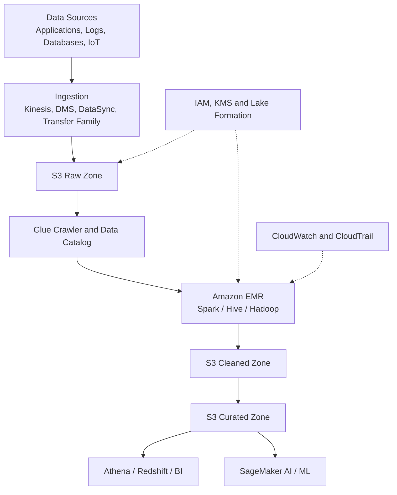
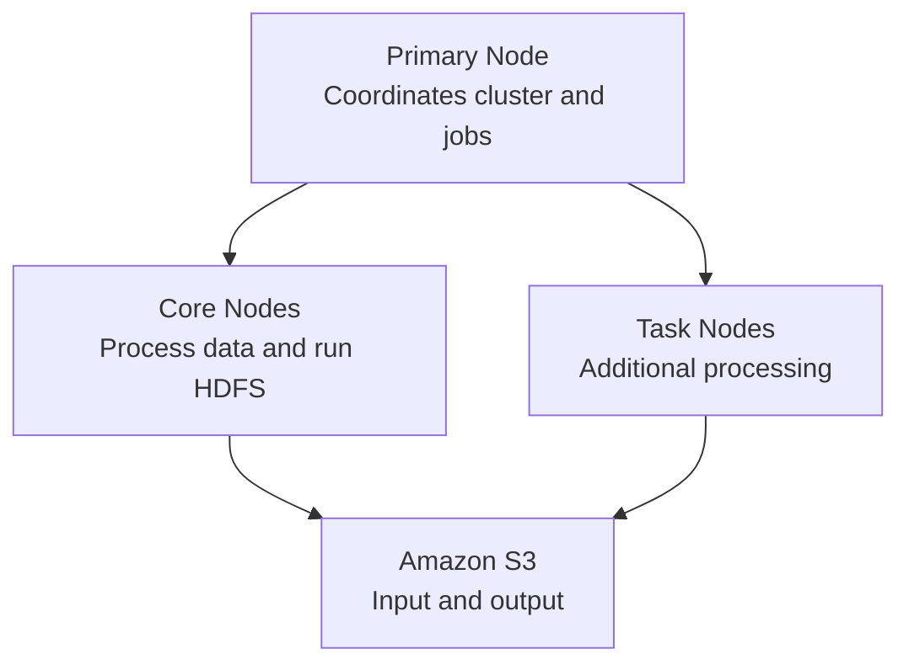
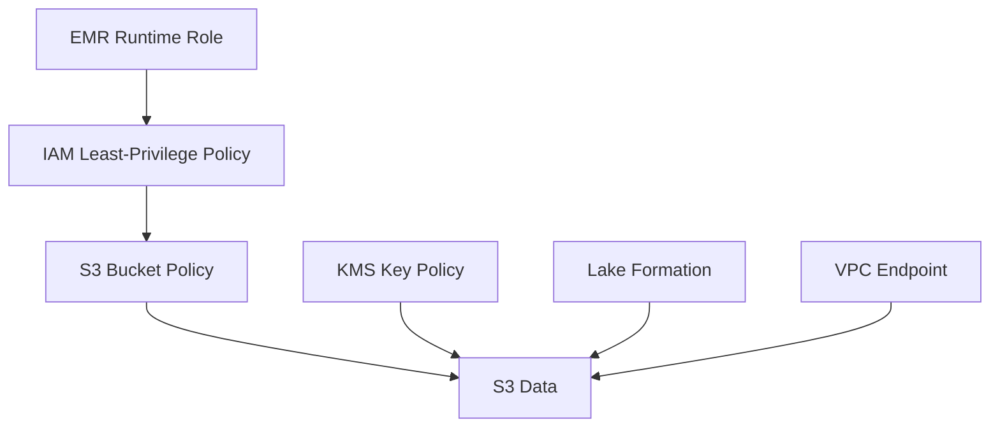
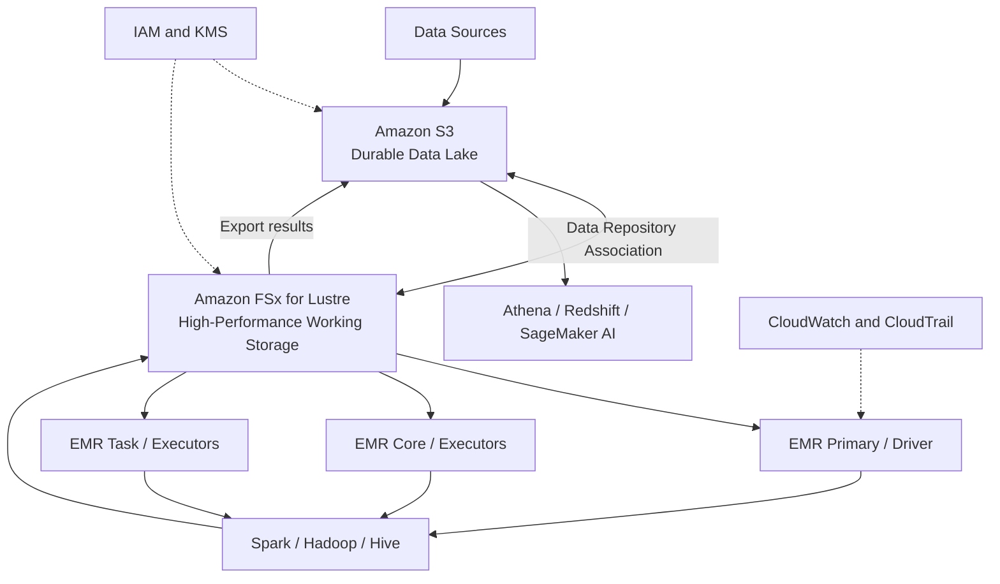
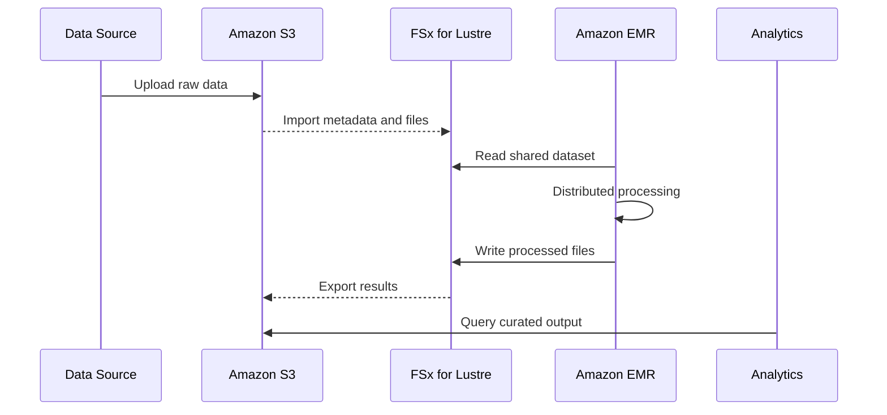
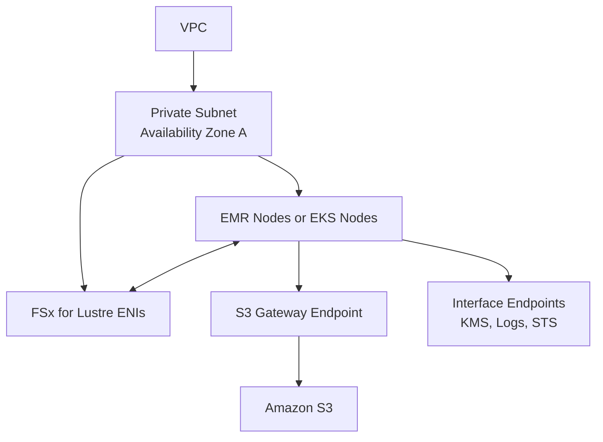
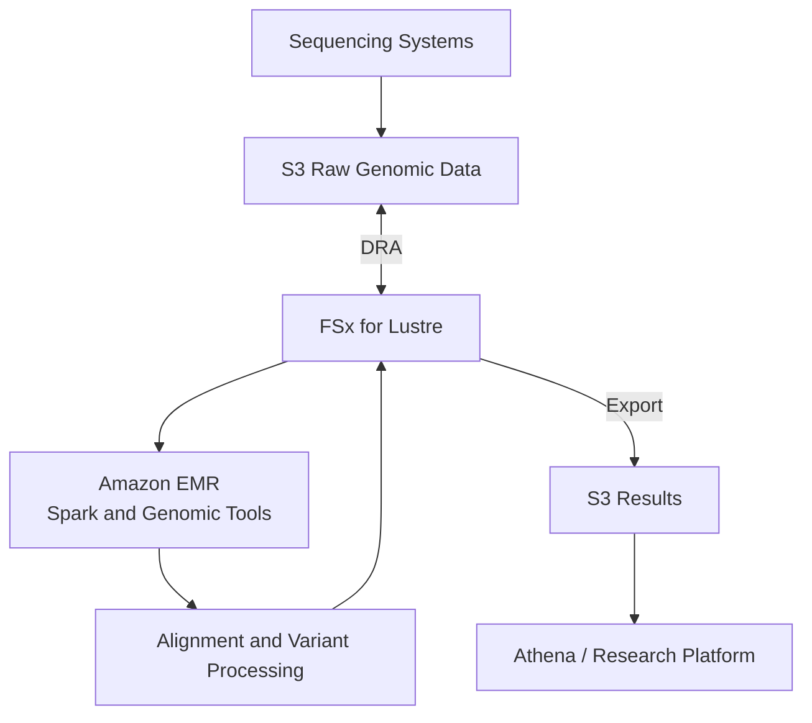

<a id="top"></a>

# ChatGPT Conversation — AWS EMR Architecture with S3 & FSx for Lustre (Pulled Content)

Full content pulled from the shared ChatGPT conversation
(`chatgpt.com/share/6aa024ce-f254-83e9-bdec-e8c504766ae5`, later
continued at `chatgpt.com/share/6aa02ded-01a4-83e9-b021-ebbd3b9b28f0`),
reconstructed from the page's embedded conversation data. Two
architecture-design question/answer turns, each answer produced by
ChatGPT with live web search grounding against AWS documentation. The
"features and characteristics" turns from the same conversation are
split out into per-service files: [aws-s3.md](aws-s3.md),
[aws-iam.md](aws-iam.md), and [aws-emr.md](aws-emr.md).
Saved verbatim (light formatting only) for reference — not yet
cross-checked against or merged into
[EMR-Hadoop-Spark.md](../EMR-Hadoop-Spark.md) or
[AWS_Services.md](AWS_Services.md), which already cover overlapping
ground in this repo's own deep-dive style.

## Table of Contents

1. [Q1: AWS EMR and S3 architecture design and use case](#q1-aws-emr-and-s3-architecture-design-and-use-case)
   1. [Reference architecture](#reference-architecture)
   2. [Architecture components](#architecture-components)
   3. [S3 data-lake design](#s3-data-lake-design)
      - [Raw zone](#raw-zone)
      - [Cleaned zone](#cleaned-zone)
      - [Curated zone](#curated-zone)
      - [Quarantine zone](#quarantine-zone)
      - [Log bucket](#log-bucket)
   4. [Amazon EMR cluster design](#amazon-emr-cluster-design)
      - [Recommended purchasing model](#recommended-purchasing-model)
   5. [How EMR accesses S3](#how-emr-accesses-s3)
      - [S3 versus HDFS](#s3-versus-hdfs)
   6. [End-to-end processing flow](#end-to-end-processing-flow)
      - [Step 1: Data ingestion](#step-1-data-ingestion)
      - [Step 2: Raw storage](#step-2-raw-storage)
      - [Step 3: Data cataloging](#step-3-data-cataloging)
      - [Step 4: EMR processing](#step-4-emr-processing)
      - [Step 5: Analytics and consumption](#step-5-analytics-and-consumption)
      - [Step 6: Cluster termination](#step-6-cluster-termination)
   7. [Example use case: E-commerce sales analytics](#example-use-case-e-commerce-sales-analytics)
      - [Business requirement](#business-requirement)
      - [Solution flow](#solution-flow)
      - [Example output organization](#example-output-organization)
   8. [Security architecture](#security-architecture)
      - [1. Private networking](#1-private-networking)
      - [2. IAM roles](#2-iam-roles)
      - [3. Encryption](#3-encryption)
      - [4. Data governance](#4-data-governance)
      - [5. S3 protection](#5-s3-protection)
   9. [Reliability and disaster recovery](#reliability-and-disaster-recovery)
   10. [Performance optimization](#performance-optimization)
   11. [Cost optimization](#cost-optimization)
       - [EMR deployment selection](#emr-deployment-selection)
       - [Main architectural benefit](#main-architectural-benefit)
2. [Q2: AWS EMR with FSx for Lustre architecture design and use case](#q2-aws-emr-with-fsx-for-lustre-architecture-design-and-use-case)
   1. [Recommended architecture](#recommended-architecture)
   2. [Component responsibilities](#component-responsibilities)
   3. [Deployment options](#deployment-options)
      - [Option 1: EMR on EC2 with FSx for Lustre](#option-1-emr-on-ec2-with-fsx-for-lustre)
      - [Option 2: EMR on EKS with FSx for Lustre](#option-2-emr-on-eks-with-fsx-for-lustre)
   4. [Data layout](#data-layout)
      - [Recommended storage responsibilities](#recommended-storage-responsibilities)
   5. [S3 and FSx for Lustre integration](#s3-and-fsx-for-lustre-integration)
      - [Data Repository Association](#data-repository-association)
      - [Import process](#import-process)
      - [Export process](#export-process)
   6. [End-to-end processing flow (FSx)](#end-to-end-processing-flow-1)
   7. [Network design](#network-design)
      - [Recommended network controls](#recommended-network-controls)
   8. [Security design](#security-design)
      - [IAM roles (FSx)](#iam-roles)
      - [Encryption](#encryption)
      - [S3 protection (FSx)](#s3-protection)
   9. [Use case: Genomic sequencing analysis](#use-case-genomic-sequencing-analysis)
      - [Business requirement (genomics)](#business-requirement-1)
      - [Why S3 alone may not be ideal](#why-s3-alone-may-not-be-ideal)
      - [Genomics architecture](#genomics-architecture)
      - [Processing steps](#processing-steps)
   10. [Other suitable use cases](#other-suitable-use-cases)
   11. [FSx deployment choices](#fsx-deployment-choices)
   12. [Performance best practices](#performance-best-practices)
   13. [Monitoring and alerting](#monitoring-and-alerting)
   14. [When to use this architecture](#when-to-use-this-architecture)
       - [Key architectural principle](#key-architectural-principle)

---

## Q1: AWS EMR and S3 architecture design and use case

# AWS EMR and Amazon S3 Architecture Design

Amazon S3 and Amazon EMR are commonly combined to build a scalable **data lake and big-data processing platform**:

- **Amazon S3** provides durable, scalable storage.
- **Amazon EMR** supplies temporary or persistent compute using Spark, Hadoop, Hive, Trino and related frameworks.
- Storage and compute scale independently, improving flexibility and cost control.

## Reference architecture



## Architecture components

| Component | Responsibility |
|---|---|
| **Data sources** | Produce application, database, log, IoT or business data |
| **Ingestion services** | Transfer batch or streaming data into S3 |
| **Amazon S3** | Stores raw, processed and curated data |
| **AWS Glue Data Catalog** | Stores schemas, table definitions and partition metadata |
| **Amazon EMR** | Processes and transforms data using distributed frameworks |
| **AWS Lake Formation** | Provides centralized data-lake permissions and governance |
| **AWS KMS** | Encrypts S3 objects and EMR storage |
| **CloudWatch** | Monitors clusters, jobs and resource utilization |
| **CloudTrail** | Records AWS API and data-access activity |
| **Athena/Redshift** | Queries and analyzes processed data |
| **SageMaker AI** | Uses curated data for machine-learning workloads |

---

# S3 data-lake design

A production data lake should separate data by processing stage.

```text
s3://company-data-raw/
s3://company-data-cleaned/
s3://company-data-curated/
s3://company-emr-logs/
s3://company-data-quarantine/
```

Alternatively, one bucket can use controlled prefixes:

```text
s3://company-data-lake/raw/
s3://company-data-lake/cleaned/
s3://company-data-lake/curated/
s3://company-data-lake/quarantine/
```

Separate buckets provide stronger isolation, while prefixes reduce the number of resources to manage.

## Raw zone

Stores data in its original form.

Examples:

```text
raw/application-logs/year=2026/month=09/day=08/
raw/customer-transactions/year=2026/month=09/day=08/
raw/iot-devices/year=2026/month=09/day=08/
```

Characteristics:

- Immutable source data
- Restricted write permissions
- Retained for replay and auditing
- Versioning enabled
- Usually compressed
- Schema applied when processed

## Cleaned zone

Contains validated and standardized data:

- Invalid records removed or quarantined
- Duplicate records removed
- Data types standardized
- Sensitive fields masked
- Data converted to Parquet or ORC
- Records partitioned for efficient processing

## Curated zone

Contains business-ready datasets:

- Aggregated sales information
- Customer activity summaries
- Security insights
- Financial reports
- Machine-learning features
- Department-specific datasets

## Quarantine zone

Contains records that failed validation so they can be investigated or reprocessed.

## Log bucket

Stores:

- EMR application logs
- Spark event logs
- Bootstrap-action logs
- Cluster provisioning logs
- Step execution logs

The log bucket should have a different retention policy from business data.

---

# Amazon EMR cluster design

For an EMR on EC2 architecture, the cluster contains three node types.



| Node | Responsibility | Recommended capacity |
|---|---|---|
| **Primary** | Coordinates jobs, cluster health, YARN and Spark services | On-Demand |
| **Core** | Processes data and stores temporary HDFS data | Primarily On-Demand |
| **Task** | Adds processing capacity without storing HDFS data | Spot or mixed capacity |

The primary node manages the cluster; core nodes process and store HDFS data; task nodes provide processing capacity without contributing HDFS storage.

## Recommended purchasing model

- Use **On-Demand Instances** for primary nodes.
- Use On-Demand capacity for critical core nodes.
- Use **Spot Instances** for fault-tolerant task nodes.
- Use instance fleets with multiple instance types.
- Enable EMR Managed Scaling.
- Use Graviton instances where the workload supports ARM.
- Set maximum capacity to prevent unexpected scaling costs.

---

# How EMR accesses S3

EMR applications can directly read from and write to Amazon S3 using an S3 connector.

A Spark job might use:

```python
raw_data = spark.read.json(
    "s3://company-data-raw/application-logs/"
)

clean_data = raw_data.dropDuplicates().filter(
    raw_data.status.isNotNull()
)

clean_data.write.mode("overwrite").parquet(
    "s3://company-data-cleaned/application-logs/"
)
```

Historically, EMR used **EMRFS** for S3 access. Starting with Amazon EMR 7.10, S3A is the default S3 connector for supported S3 URI schemes.

## S3 versus HDFS

| Amazon S3 | HDFS |
|---|---|
| Durable object storage | Distributed cluster storage |
| Persists after EMR termination | Normally deleted with the cluster |
| Scales independently | Capacity depends on cluster nodes |
| Suitable for input and final output | Suitable for temporary and intermediate data |
| Shared by multiple analytics services | Primarily available to its cluster |
| Supports storage classes and lifecycle rules | Optimized for distributed local processing |

The recommended pattern is:

- Store source and final data in S3.
- Use HDFS or local disks for temporary shuffle and intermediate data.
- Terminate the EMR cluster after processing when persistent compute is unnecessary.

AWS describes S3 as the common location for input and output, while HDFS is useful for temporary processing and random-I/O workloads.

---

# End-to-end processing flow

## Step 1: Data ingestion

Data enters AWS from sources such as:

- Application servers
- Amazon RDS
- DynamoDB
- On-premises databases
- IoT devices
- Web applications
- Third-party APIs

Possible ingestion services include:

- Amazon Kinesis Data Firehose
- AWS Database Migration Service
- AWS DataSync
- AWS Transfer Family
- Amazon MSK
- Direct S3 uploads

## Step 2: Raw storage

Incoming data is stored in the S3 raw zone without changing its original format.

Example:

```text
s3://company-data-raw/orders/year=2026/month=09/day=08/
```

An S3 event can trigger:

- EventBridge
- Lambda
- Step Functions
- An EMR workflow
- Amazon MWAA

## Step 3: Data cataloging

An AWS Glue crawler scans the new data and creates or updates tables in the Glue Data Catalog.

The catalog records:

- Schema
- S3 location
- Column names
- Data types
- Partition information
- Table properties

Glue Data Catalog can serve as an external Hive metastore shared by EMR, Athena and Redshift Spectrum.

## Step 4: EMR processing

An EMR Spark job:

1. Reads raw data from S3.
2. Validates required fields.
3. Removes duplicate records.
4. Handles missing values.
5. Joins data from multiple sources.
6. Masks sensitive information.
7. Calculates business metrics.
8. Converts the data into Parquet.
9. Writes the results to cleaned and curated S3 zones.

## Step 5: Analytics and consumption

Processed data can be consumed by:

- Amazon Athena
- Amazon Redshift Spectrum
- Amazon Redshift
- Amazon OpenSearch Service
- BI dashboards
- SageMaker AI
- Downstream applications

## Step 6: Cluster termination

For batch workloads, the EMR cluster is terminated after the job succeeds. The data remains safely stored in S3.

---

# Example use case: E-commerce sales analytics

## Business requirement

An online retailer generates millions of daily records from:

- Customer orders
- Product views
- Website clickstreams
- Payment transactions
- Inventory databases
- Application logs

The business wants daily reports showing:

- Total sales by product
- Revenue by Region
- Abandoned shopping carts
- Most-viewed products
- Failed payments
- Customer buying patterns

## Solution flow


### Implementation

1. Kinesis Data Firehose delivers clickstream events to S3.
2. AWS DMS exports database changes from the order database to S3.
3. S3 stores the original data in the raw zone.
4. EventBridge starts a Step Functions workflow on a schedule.
5. Step Functions creates a transient EMR cluster.
6. Spark joins order, customer, product and clickstream datasets.
7. Spark removes duplicates and masks sensitive customer information.
8. Processed data is written to S3 in partitioned Parquet format.
9. Glue Data Catalog registers the new partitions.
10. Athena or Redshift queries the curated data.
11. A BI dashboard displays sales trends.
12. The EMR cluster terminates after successful processing.

## Example output organization

```text
s3://company-data-curated/sales/
    year=2026/
        month=09/
            day=08/
                part-00001.snappy.parquet
                part-00002.snappy.parquet
```

Partitioning allows queries to scan only the required dates instead of the entire dataset.

---

# Security architecture



## 1. Private networking

Deploy EMR nodes in private subnets with:

- No public IP addresses
- Restrictive security groups
- S3 gateway VPC endpoint
- Interface endpoints for required AWS services
- NAT Gateway only when external access is necessary
- Systems Manager for administrative access instead of public SSH

## 2. IAM roles

Use separate roles for:

- EMR service operations
- EC2 instance profiles
- Runtime jobs
- Data engineers
- Data analysts
- Orchestration services

Example access separation:

| Role | S3 access |
|---|---|
| **Ingestion role** | Write to raw zone |
| **EMR processing role** | Read raw; write cleaned and curated |
| **Analyst role** | Read curated data only |
| **Auditor role** | Read logs and configurations |
| **Administrator role** | Manage infrastructure without unrestricted data access |

## 3. Encryption

Use:

- SSE-KMS for S3 objects
- TLS for data in transit
- Encrypted EBS volumes
- Encrypted HDFS and local disks where required
- Separate KMS keys for data, logs and sensitive zones

EMR supports S3 encryption through its S3 file-system integration and can use customer-managed KMS keys.

## 4. Data governance

Use Lake Formation for:

- Database permissions
- Table permissions
- Column-level controls
- Row-level filtering
- Data-location permissions
- Cross-account data sharing

## 5. S3 protection

Enable:

- S3 Block Public Access
- Bucket owner enforced object ownership
- Versioning
- Lifecycle policies
- Object Lock for immutable regulated data
- Restricted bucket policies
- CloudTrail data events for sensitive buckets

---

# Reliability and disaster recovery

Recommended controls include:

- Keep persistent data in S3 rather than HDFS.
- Enable S3 Versioning.
- Use Cross-Region Replication where recovery requirements demand it.
- Store Spark and EMR logs in a separate S3 bucket.
- Use multiple primary nodes for critical long-running clusters.
- Diversify task-node instance types.
- Configure Spot capacity rebalancing.
- Make processing jobs idempotent and restartable.
- Maintain infrastructure and job definitions in version control.

---

# Performance optimization

- Store analytical data in Parquet or ORC.
- Compress data with Snappy or another appropriate codec.
- Partition by frequently filtered fields such as date or Region.
- Avoid very large numbers of tiny S3 objects.
- Compact small output files after streaming ingestion.
- Use appropriate Spark executor memory and cores.
- Right-size primary, core and task nodes.
- Use instance fleets to improve capacity availability.
- Enable managed scaling.
- Use S3 for persistent data and local storage for shuffle operations.
- Use predicate pushdown and column pruning.

Columnar formats such as Parquet can reduce storage, data scanned and query execution time compared with formats such as CSV and JSON.

---

# Cost optimization

- Use transient clusters for scheduled batch jobs.
- Use Spot Instances for task nodes.
- Configure EMR Managed Scaling.
- Shut down idle clusters automatically.
- Apply S3 Lifecycle policies.
- Archive old raw data to S3 Glacier.
- Use Parquet to reduce storage and query scanning.
- Monitor S3 and EMR costs with tags and Cost Explorer.
- Configure maximum cluster capacity.
- Use EMR Serverless for intermittent workloads that do not require cluster control.

## EMR deployment selection

| Requirement | Recommended option |
|---|---|
| Maximum cluster control | EMR on EC2 |
| Existing Kubernetes platform | EMR on EKS |
| Intermittent Spark or Hive jobs | EMR Serverless |
| Persistent interactive analytics | Long-running EMR cluster |
| Daily batch ETL | Transient EMR cluster |
| Low-cost fault-tolerant processing | EMR task nodes using Spot |

## Main architectural benefit

The main advantage is the **separation of compute and storage**:

- S3 stores data persistently.
- EMR compute is created, scaled and terminated independently.
- Multiple EMR clusters and other analytics services can process the same S3 data.
- Processing failures do not remove the source data.
- Storage and compute costs can be optimized separately.

This makes the combination suitable for scalable data lakes, ETL pipelines, log analytics, machine learning and enterprise reporting.

[⬆ Back to top](#top)

---

## Q2: AWS EMR with FSx for Lustre architecture design and use case

# AWS EMR with Amazon FSx for Lustre Architecture

This architecture combines:

- **Amazon S3** for durable, low-cost data-lake storage.
- **Amazon FSx for Lustre** for high-throughput, low-latency, POSIX-compatible shared file storage.
- **Amazon EMR** for distributed processing using Spark, Hadoop, Hive or Trino.

It is most valuable when EMR jobs repeatedly access large datasets, require shared file-system semantics, process many files in parallel, or cannot perform efficiently directly against S3.

FSx for Lustre can link to an S3 bucket and present S3 objects as files to applications mounting the file system.

## Recommended architecture



## Component responsibilities

| Component | Responsibility |
|---|---|
| **Amazon S3** | Persistent storage for raw input, final results, logs and archives |
| **Data Repository Association** | Links an S3 prefix to an FSx for Lustre directory |
| **FSx for Lustre** | High-performance shared working dataset accessible as files |
| **EMR primary node** | Coordinates cluster activity and jobs |
| **EMR core nodes** | Run processing tasks and optionally provide HDFS storage |
| **EMR task nodes** | Add processing capacity without storing HDFS data |
| **Spark/Hadoop/Hive** | Perform distributed transformations and analytics |
| **AWS Glue Data Catalog** | Stores table schemas and data-location metadata |
| **IAM and KMS** | Control access and encryption |
| **CloudWatch and CloudTrail** | Provide monitoring, alerting and audit records |

---

# Deployment options

## Option 1: EMR on EC2 with FSx for Lustre

The Lustre client is installed and the file system mounted on every EMR node through:

- A custom Amazon Machine Image
- An EMR bootstrap action
- AWS Systems Manager automation

Example mount point:

```text
/fsx
```

Every node must mount the same FSx file system at the same path.

### Recommended for

- Existing EMR on EC2 environments
- Hadoop and Spark workloads requiring host-level filesystem access
- Long-running clusters
- Applications expecting POSIX file paths
- Workloads requiring direct control over EC2 and Lustre configuration

## Option 2: EMR on EKS with FSx for Lustre

FSx for Lustre is exposed to Spark driver and executor pods using:

- Amazon FSx for Lustre CSI driver
- Kubernetes PersistentVolume
- PersistentVolumeClaim
- Static or dynamic provisioning

AWS documents mounting FSx for Lustre on both EMR on EKS Spark driver and executor pods.

### Recommended for

- Kubernetes-based data platforms
- Multiple isolated Spark workloads
- Shared EKS infrastructure
- Containerized analytics
- Dynamic storage provisioning
- Teams already operating EKS

---

# Data layout

A practical data organization is:

```text
Amazon S3
├── raw/
│   ├── genomics/
│   ├── transactions/
│   └── application-logs/
├── cleaned/
├── curated/
├── results/
└── emr-logs/

FSx for Lustre
├── input/
├── reference/
├── workspace/
├── checkpoints/
├── output/
└── temporary/
```

### Recommended storage responsibilities

| Data type | Storage location |
|---|---|
| Original source data | S3 raw zone |
| Long-term reference data | S3, exposed through FSx |
| Frequently accessed working data | FSx for Lustre |
| Shared POSIX application files | FSx for Lustre |
| Spark local shuffle | EC2 instance store or EBS in most cases |
| Temporary HDFS data | EMR core-node storage |
| Final output | S3 curated or results zone |
| EMR and Spark logs | Dedicated S3 log bucket |

FSx for Lustre should not automatically replace Spark's local shuffle storage. Local NVMe or EBS generally remains preferable for ordinary Spark shuffle, while Lustre is used for shared input, output, checkpoints and applications requiring parallel filesystem access.

---

# S3 and FSx for Lustre integration

## Data Repository Association

A **Data Repository Association**, or DRA, creates a link between:

- An FSx for Lustre directory
- An S3 bucket or prefix

For example:

```text
S3:
s3://research-data/genomics/

FSx:
/fsx/genomics/
```

Applications on EMR see S3 objects as normal files:

```text
/fsx/genomics/sample-001.fastq
/fsx/genomics/sample-002.fastq
```

FSx for Lustre is natively integrated with S3, allowing mounted applications to access linked S3 datasets and export processed results back to S3.

## Import process

When the DRA is created:

1. FSx imports file and directory metadata from S3.
2. The files appear in the Lustre namespace.
3. File contents can be loaded when first accessed.
4. Frequently used data remains available through the high-performance file system.
5. New or modified S3 objects can be automatically or manually imported.

FSx can automatically import new, changed or deleted S3 objects depending on the configured import policy.

## Export process

After EMR processes the data:

1. Spark writes results to `/fsx/output`.
2. FSx records the updated files.
3. Automatic export or a data repository task transfers changes to S3.
4. Downstream systems consume the durable S3 output.

An export data repository task creates new S3 objects and replaces corresponding objects for modified files.

Because export is asynchronous, the workflow must confirm successful export before deleting the file system or starting dependent jobs.

---

# End-to-end processing flow



1. Data arrives in an S3 raw-data bucket.
2. The DRA makes the S3 dataset visible in FSx for Lustre.
3. Data is loaded into Lustre on demand or preloaded before the job.
4. EMR nodes mount the same Lustre file system.
5. Spark executors read different partitions concurrently.
6. Processed results are written to the Lustre output directory.
7. FSx exports new or changed results to S3.
8. Athena, Redshift, SageMaker AI or another EMR job consumes the results.
9. Temporary EMR and FSx resources can be deleted after results are safely stored in S3.

---

# Network design



## Recommended network controls

- Deploy EMR and FSx for Lustre in the same VPC.
- Prefer placing clients in the same Availability Zone as FSx.
- Use private subnets.
- Do not assign public IP addresses to EMR worker nodes.
- Use an S3 gateway VPC endpoint.
- Use interface endpoints for KMS, CloudWatch Logs, STS and other required services.
- Restrict security groups to the required Lustre traffic.
- Use Systems Manager instead of public SSH access.
- Use Route 53 DNS resolution within the VPC.

FSx for Lustre uses VPC security groups to control communication between Lustre clients and the file system.

---

# Security design

## IAM roles

Use separate IAM roles for distinct responsibilities.

| Role | Permissions |
|---|---|
| **EMR service role** | Creates and manages EMR resources |
| **EMR EC2 instance profile** | Mount-related operations, logs and controlled S3 access |
| **EMR runtime role** | Job-specific access to approved data |
| **FSx service role** | Imports from and exports to the linked S3 repository |
| **Orchestration role** | Starts jobs and checks their status |
| **Analyst role** | Reads only curated results |
| **Operations role** | Monitors infrastructure without unrestricted data access |

Apply least privilege to specific bucket prefixes:

```text
EMR processing role:
  Read  → s3://company-data/raw/*
  Read  → s3://company-data/reference/*
  Write → s3://company-data/results/*
  Write → s3://company-emr-logs/*
```

## Encryption

Use:

- SSE-KMS for S3 buckets
- Customer-managed KMS keys for sensitive datasets
- FSx for Lustre encryption at rest
- TLS for data in transit
- Encrypted EBS volumes on EMR nodes
- Separate KMS keys for data and logs where separation is required

The relevant principals must have both IAM and KMS-key-policy permissions.

## S3 protection

Enable:

- S3 Block Public Access
- Bucket owner enforced object ownership
- Versioning
- Lifecycle policies
- Restricted bucket policies
- CloudTrail data events
- Object Lock for immutable datasets or audit logs

---

# Use case: Genomic sequencing analysis

## Business requirement

A healthcare research organization needs to analyze thousands of genomic sequencing files. Each file may be very large, and multiple compute nodes must repeatedly read reference genomes and sequencing datasets.

Requirements include:

- High-throughput parallel reads
- POSIX file paths required by scientific applications
- Shared storage across processing nodes
- Durable retention of raw and processed data
- Temporary scaling to hundreds of compute workers
- Encryption and restricted access to sensitive datasets

## Why S3 alone may not be ideal

S3 is highly durable and scalable, but it is object storage. Some genomic tools expect:

- Traditional file paths
- File seeking
- File locking
- Shared directory structures
- High-frequency metadata operations
- Repeated access to the same reference files

FSx for Lustre provides the required shared POSIX filesystem and parallel I/O behavior, while S3 remains the system of record.

## Genomics architecture



## Processing steps

1. Sequencing systems upload FASTQ files to S3.
2. Reference genomes are stored under a separate S3 prefix.
3. FSx for Lustre is linked to both datasets through appropriate DRAs.
4. Frequently used reference files are preloaded into Lustre.
5. EMR nodes mount FSx at `/fsx`.
6. Spark distributes samples across executors.
7. Each executor runs alignment or variant-processing software against its assigned samples.
8. Shared reference data is read concurrently from Lustre.
9. Results are written to `/fsx/output`.
10. FSx exports the results to an encrypted S3 bucket.
11. Athena, EMR or machine-learning services analyze the curated output.
12. After validating the S3 export, the temporary cluster and scratch file system can be removed.

---

# Other suitable use cases

- Financial risk simulations
- Electronic design automation
- Seismic and geospatial processing
- Media rendering and transcoding
- Machine-learning feature preparation
- Large-scale log processing with many small files
- Apache Iceberg metadata caching
- Scientific modeling
- Image-processing pipelines
- Fraud-detection model preparation

---

# FSx deployment choices

| File-system type | Characteristics | Recommended use |
|---|---|---|
| **Scratch** | Temporary processing, no backups, optimized for short-term workloads | Re-creatable batch jobs |
| **Persistent** | Designed for longer-term workloads with higher durability options | Long-running production analytics |
| **Intelligent-Tiering** | Elastic capacity and cost optimization for variable datasets | Dynamic AI, analytics and HPC workloads |

Use a temporary design when S3 holds the authoritative data and all Lustre contents can be re-created. Choose a persistent option when the working dataset must remain continuously available.

---

# Performance best practices

- Place EMR clients and FSx in the same Availability Zone.
- Select FSx throughput based on aggregate worker demand.
- Use multiple EMR workers to exploit parallel I/O.
- Preload critical datasets before time-sensitive processing.
- Stripe large files across multiple Lustre object storage targets.
- Avoid using FSx as the default destination for data that belongs permanently in S3.
- Use local NVMe or EBS for Spark shuffle unless shared storage is specifically required.
- Monitor metadata and storage throughput separately.
- Use sufficiently large and well-partitioned files.
- Verify that the EMR operating-system kernel supports the selected Lustre client version.

AWS recommends verifying compatibility between the Lustre version and client Linux kernel.

---

# Monitoring and alerting

Monitor the following:

| Service | Monitoring focus |
|---|---|
| **EMR** | Failed steps, pending jobs, cluster state and scaling |
| **Spark** | Executor failures, skew, memory, task duration and shuffle |
| **FSx** | Storage capacity, throughput, IOPS and metadata operations |
| **DRA** | Import/export status, age and failed tasks |
| **S3** | Requests, replication, object count and storage growth |
| **KMS** | Throttling and access-denied errors |
| **CloudTrail** | Administrative and data-access activity |

A practical alerting flow is:

```text
CloudWatch Alarm → SNS → Lambda/EventBridge → Incident Platform
```

Important FSx alarms include:

- Storage utilization at 70% and 85%
- Import or export task failure
- Misconfigured DRA
- Throughput saturation
- Metadata performance constraints
- File-system state changes
- KMS or S3 access failures

---

# When to use this architecture

Use EMR with FSx for Lustre when:

- The application needs a POSIX-compatible filesystem.
- Data is accessed repeatedly by many workers.
- S3 request latency affects performance.
- The workload performs intensive parallel reads and writes.
- Tools cannot directly use S3 object APIs.
- Shared checkpoints or working files are required.
- Large datasets must be processed temporarily at high speed.

Use EMR directly with S3 when:

- Jobs perform sequential scans of Parquet or ORC files.
- Applications natively support S3.
- The workload is standard Spark ETL.
- Data is read once and written once.
- Cost is more important than filesystem latency.
- Shared POSIX semantics are unnecessary.

## Key architectural principle

**S3 should remain the durable system of record; FSx for Lustre should act as the high-performance working layer; EMR should provide elastic processing capacity.**

This separation allows the organization to keep data safely and economically in S3 while provisioning EMR and Lustre performance only when the workload requires it.

[⬆ Back to top](#top)
