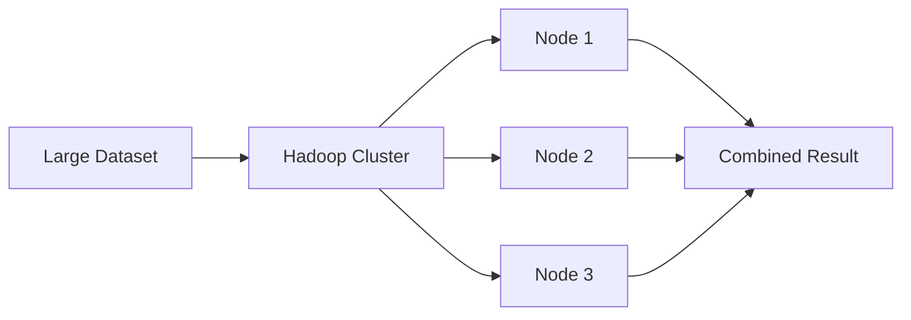
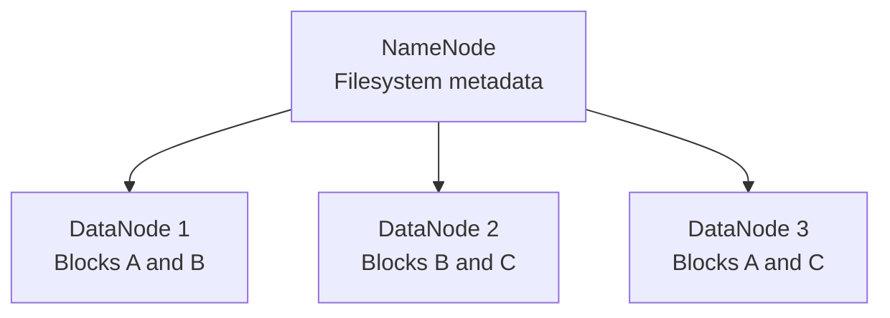
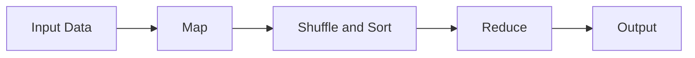
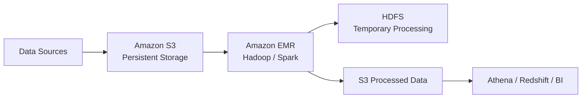
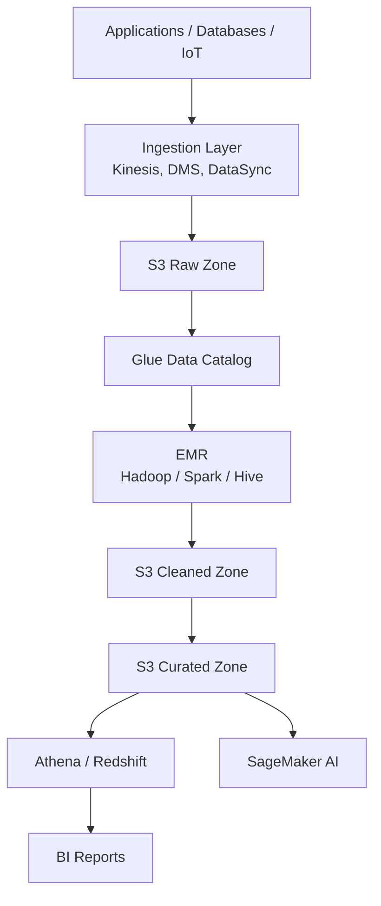

<a id="top"></a>

# Big Data, Apache Hadoop & Amazon S3 — Fundamentals

Pulled from a shared ChatGPT conversation
(`chatgpt.com/share/6aa0534a-64cc-83ea-ba16-9bc208caf3c3`, a
continuation of the same "AWS EMR Features" conversation as
[ChatGPT-EMR-S3-IAM-Conversation.md](ChatGPT-EMR-S3-IAM-Conversation.md)
and [aws-s3.md](aws-s3.md) / [aws-iam.md](aws-iam.md) /
[aws-emr.md](aws-emr.md)), produced by ChatGPT with live web search
grounding against AWS documentation. Covers Big Data and Hadoop
fundamentals (HDFS, YARN, MapReduce) alongside how they integrate with
Amazon S3 and Amazon EMR, plus a log-analytics use case. Saved verbatim
(light formatting only) for reference — not yet cross-checked against
or merged into [EMR-Hadoop-Spark.md](../EMR-Hadoop-Spark.md) or
[AWS_Services.md](AWS_Services.md), which already cover overlapping
ground in this repo's own deep-dive style. For a separate,
architecture-focused answer to a similar question (from a different
conversation), see
[ChatGPT-BigData-Hadoop-S3-Architecture.md](ChatGPT-BigData-Hadoop-S3-Architecture.md).

## Table of Contents

1. [What is Big Data?](#1-what-is-big-data)
   - [Big Data sources](#big-data-sources)
2. [What is Apache Hadoop?](#2-what-is-apache-hadoop)
   - [Core Hadoop components](#core-hadoop-components)
3. [Hadoop Distributed File System](#3-hadoop-distributed-file-system)
   - [HDFS components](#hdfs-components)
     - [NameNode](#namenode)
     - [DataNodes](#datanodes)
     - [HDFS characteristics](#hdfs-characteristics)
4. [YARN](#4-yarn)
5. [MapReduce](#5-mapreduce)
   - [Map phase](#map-phase)
   - [Shuffle and sort](#shuffle-and-sort)
   - [Reduce phase](#reduce-phase)
6. [What is Amazon S3?](#6-what-is-amazon-s3)
7. [How Hadoop and S3 work together](#7-how-hadoop-and-s3-work-together)
8. [Amazon EMR](#8-amazon-emr)
   - [EMR node types](#emr-node-types)
9. [S3A and EMRFS](#9-s3a-and-emrfs)
   - [S3A](#s3a)
   - [EMRFS](#emrfs)
10. [HDFS versus Amazon S3](#10-hdfs-versus-amazon-s3)
    - [Main architectural difference](#main-architectural-difference)
11. [Big Data architecture using Hadoop and S3](#11-big-data-architecture-using-hadoop-and-s3)
    - [Data-lake zones](#data-lake-zones)
      - [Raw zone](#raw-zone)
      - [Cleaned zone](#cleaned-zone)
      - [Curated zone](#curated-zone)
      - [Quarantine zone](#quarantine-zone)
      - [Archive zone](#archive-zone)
12. [Example use case: Log analytics](#12-example-use-case-log-analytics)
    - [Processing flow](#processing-flow)
    - [Example Spark processing](#example-spark-processing)
13. [Data formats](#13-data-formats)
14. [Security controls](#14-security-controls)
15. [Advantages](#15-advantages)
    - [Hadoop advantages](#hadoop-advantages)
    - [S3 advantages](#s3-advantages)
    - [Combined advantages](#combined-advantages)
16. [Limitations and considerations](#16-limitations-and-considerations)
    - [Hadoop considerations](#hadoop-considerations)
    - [S3 considerations](#s3-considerations)
    - [Recommended design](#recommended-design)

---

# 1. What is Big Data?

**Big Data** refers to datasets that are too large, fast-moving, or complex for traditional data-processing tools to handle efficiently.

Big Data is commonly described using the **five Vs**:

| Characteristic | Meaning | Example |
|---|---|---|
| **Volume** | Massive quantities of data | Petabytes of application logs |
| **Velocity** | Speed at which data is generated | Streaming IoT events |
| **Variety** | Different data formats | JSON, CSV, video, images and database records |
| **Veracity** | Accuracy and quality of data | Duplicate or incomplete records |
| **Value** | Useful insights extracted from data | Fraud detection or customer trends |

[⬆ Back to top](#top)

## Big Data sources

- Application and web-server logs
- Social-media activity
- Financial transactions
- IoT devices and sensors
- Healthcare records
- Videos and images
- Clickstream events
- Database change records
- Infrastructure and security logs

[⬆ Back to top](#top)

---

# 2. What is Apache Hadoop?

**Apache Hadoop** is an open-source framework for storing and processing large datasets across a cluster of computers.

Instead of using one powerful server, Hadoop divides data and computation among multiple nodes.



[⬆ Back to top](#top)

## Core Hadoop components

| Component | Full name | Function |
|---|---|---|
| **HDFS** | Hadoop Distributed File System | Distributed data storage |
| **YARN** | Yet Another Resource Negotiator | Cluster resource management and job scheduling |
| **MapReduce** | MapReduce programming model | Parallel batch-data processing |
| **Hadoop Common** | Hadoop shared libraries | Utilities required by Hadoop components |

Apache describes MapReduce as a YARN-based system for processing large datasets in parallel.

[⬆ Back to top](#top)

---

# 3. Hadoop Distributed File System

HDFS divides large files into blocks and distributes them across multiple DataNodes.



[⬆ Back to top](#top)

## HDFS components

### NameNode

The NameNode manages:

- File and directory names
- Block locations
- File permissions
- DataNode status
- Filesystem metadata

The NameNode normally does not store the application's actual file blocks.

### DataNodes

DataNodes:

- Store file blocks
- Read and write data
- Report their status to the NameNode
- Replicate blocks to other DataNodes
- Process data close to where it is stored

### HDFS characteristics

- Distributed storage
- Fault tolerance through replication
- High-throughput sequential access
- Designed for large files
- Optimized for write-once, read-many workloads
- Storage and compute commonly reside on the same nodes
- Not optimized for low-latency transactional workloads

[⬆ Back to top](#top)

---

# 4. YARN

YARN manages the Hadoop cluster's compute resources.

Its main components are:

| Component | Responsibility |
|---|---|
| **ResourceManager** | Controls cluster-wide resource allocation |
| **NodeManager** | Manages resources on an individual worker node |
| **ApplicationMaster** | Coordinates one application or processing job |
| **Container** | CPU and memory allocated to a task |

YARN allows multiple processing frameworks—such as MapReduce and Spark—to share a Hadoop cluster.

[⬆ Back to top](#top)

---

# 5. MapReduce

MapReduce divides a large processing job into stages.



[⬆ Back to top](#top)

## Map phase

Each mapper processes a portion of the input and produces key-value pairs.

Example input:

```text
AWS Hadoop AWS S3
```

Mapper output:

```text
AWS,1
Hadoop,1
AWS,1
S3,1
```

[⬆ Back to top](#top)

## Shuffle and sort

Hadoop groups values using their keys:

```text
AWS    → [1,1]
Hadoop → [1]
S3     → [1]
```

[⬆ Back to top](#top)

## Reduce phase

Reducers aggregate the values:

```text
AWS    → 2
Hadoop → 1
S3     → 1
```

MapReduce is reliable for large batch workloads but is generally slower than Spark for iterative and interactive processing because MapReduce frequently writes intermediate results to disk.

[⬆ Back to top](#top)

---

# 6. What is Amazon S3?

**Amazon Simple Storage Service** is a managed object-storage service used to store and retrieve virtually any amount of data.

S3 provides:

- Virtually unlimited capacity
- High durability
- Strong consistency
- Multiple storage classes
- Encryption
- Versioning
- Lifecycle management
- Replication
- Fine-grained access control
- Integration with AWS analytics services

Amazon S3 is frequently used as the primary storage layer for an AWS data lake.

[⬆ Back to top](#top)

---

# 7. How Hadoop and S3 work together

Traditional Hadoop uses HDFS for both input and output data. In AWS, Hadoop applications running on Amazon EMR can read and write data directly to Amazon S3.



The recommended pattern is:

- Store raw input in S3.
- Run Hadoop or Spark on Amazon EMR.
- Use HDFS or local disks for temporary processing.
- Write final results back to S3.
- Terminate the cluster when processing finishes.

AWS documents HDFS as fast but ephemeral on EMR, while S3 provides persistent storage independently of the cluster.

[⬆ Back to top](#top)

---

# 8. Amazon EMR

**Amazon EMR** is an AWS-managed platform for running:

- Hadoop
- Spark
- Hive
- Trino
- Flink
- HBase
- Hudi
- Iceberg
- Other big-data frameworks

EMR handles:

- EC2 provisioning
- Hadoop installation
- Cluster configuration
- Software integration
- Node replacement
- Scaling
- Job submission
- Monitoring

Amazon EMR simplifies running Hadoop and Spark to process large datasets on AWS.

[⬆ Back to top](#top)

## EMR node types

| Node type | Function |
|---|---|
| **Primary node** | Coordinates the cluster and tracks jobs |
| **Core node** | Processes data and stores HDFS blocks |
| **Task node** | Provides additional processing without storing HDFS data |

[⬆ Back to top](#top)

---

# 9. S3A and EMRFS

Hadoop requires a connector to interact with S3.

[⬆ Back to top](#top)

## S3A

S3A is the open-source Hadoop connector that allows Hadoop applications to access S3 using familiar filesystem-style paths:

```text
s3a://company-data/raw/orders/
```

Starting with Amazon EMR 7.10, S3A is the default S3 connector for EMR across supported S3 URI schemes.

[⬆ Back to top](#top)

## EMRFS

EMRFS is an Amazon EMR integration that enables Hadoop applications to read and write S3 objects.

Example:

```text
s3://company-data/raw/orders/
```

It historically provided Amazon EMR-specific S3 integration features, including encryption and IAM-role mappings.

[⬆ Back to top](#top)

---

# 10. HDFS versus Amazon S3

| HDFS | Amazon S3 |
|---|---|
| Distributed file system | Object storage |
| Storage is tied to cluster nodes | Storage is independent of compute |
| Data usually disappears when a transient EMR cluster terminates | Data persists after cluster termination |
| Provides filesystem semantics | Uses buckets, keys and objects |
| Optimized for high-throughput cluster-local processing | Optimized for durable, scalable storage |
| Capacity scales by adding nodes or disks | Capacity scales automatically |
| Requires NameNode and DataNodes | Fully managed by AWS |
| Replicates data within the cluster | Regional storage redundantly protects objects |
| Useful for temporary or intermediate data | Best for source data and final output |
| More suitable for some random-I/O workloads | Best suited for object-oriented access patterns |

[⬆ Back to top](#top)

## Main architectural difference

### Traditional Hadoop

```text
Compute + Storage = Same cluster
```

### Hadoop on AWS with S3

```text
Compute = Amazon EMR
Storage = Amazon S3
```

Separating storage from compute allows each layer to scale independently and enables multiple analytics services to use the same data.

[⬆ Back to top](#top)

---

# 11. Big Data architecture using Hadoop and S3



[⬆ Back to top](#top)

## Data-lake zones

```text
s3://company-data-lake/
├── raw/
├── cleaned/
├── curated/
├── quarantine/
└── archive/
```

### Raw zone

Stores original data without modification.

### Cleaned zone

Contains validated, deduplicated and standardized data.

### Curated zone

Contains business-ready datasets used for analytics.

### Quarantine zone

Contains records that fail quality or security validation.

### Archive zone

Contains historical data moved to lower-cost storage classes.

[⬆ Back to top](#top)

---

# 12. Example use case: Log analytics

A company receives terabytes of daily logs from:

- Web servers
- Application servers
- Firewalls
- Load balancers
- CloudTrail
- Container platforms

[⬆ Back to top](#top)

## Processing flow

1. Applications send logs to Amazon Kinesis Data Firehose.
2. Firehose stores the logs in the S3 raw zone.
3. A scheduled workflow creates an EMR cluster.
4. Hadoop or Spark reads the raw log files from S3.
5. The cluster removes duplicates and invalid records.
6. It extracts IP addresses, status codes and response times.
7. It aggregates results by application, date and Region.
8. Processed data is written to S3 as Parquet files.
9. AWS Glue catalogs the output.
10. Athena or Redshift queries the curated data.
11. Dashboards display errors, traffic and performance trends.
12. The transient EMR cluster terminates.

[⬆ Back to top](#top)

## Example Spark processing

```python
from pyspark.sql import SparkSession
from pyspark.sql.functions import col

spark = SparkSession.builder.appName("LogAnalysis").getOrCreate()

logs = spark.read.json(
    "s3://company-data-lake/raw/application-logs/"
)

errors = logs.filter(col("status_code") >= 500)

errors.write \
    .mode("overwrite") \
    .partitionBy("year", "month", "day") \
    .parquet("s3://company-data-lake/curated/server-errors/")
```

[⬆ Back to top](#top)

---

# 13. Data formats

Hadoop and S3 can process many formats:

- CSV
- JSON
- XML
- Plain text
- Apache Parquet
- Apache ORC
- Apache Avro
- Images
- Videos
- Binary files

For analytics, **Parquet** and **ORC** are generally preferable because they support:

- Columnar storage
- Compression
- Column pruning
- Predicate pushdown
- Reduced storage
- Reduced data scanned
- Faster analytical queries

[⬆ Back to top](#top)

---

# 14. Security controls

A secure Hadoop and S3 architecture should include:

- IAM roles rather than embedded access keys
- Least-privilege S3 access
- S3 Block Public Access
- SSE-KMS encryption
- TLS encryption in transit
- Private EMR subnets
- S3 gateway VPC endpoint
- Restricted security groups
- CloudTrail logging
- S3 Versioning
- Lake Formation governance
- Kerberos where Hadoop-level authentication is required
- Separate access for raw and curated data

Example permission separation:

| Role | Permissions |
|---|---|
| **Ingestion role** | Write to the raw zone |
| **EMR processing role** | Read raw; write cleaned and curated data |
| **Data analyst** | Read curated data only |
| **Auditor** | Read logs and configurations |
| **Administrator** | Manage the platform without unrestricted business-data access |

[⬆ Back to top](#top)

---

# 15. Advantages

[⬆ Back to top](#top)

## Hadoop advantages

- Distributed processing
- Horizontal scalability
- Fault tolerance
- Supports large datasets
- Open-source ecosystem
- Runs on commodity infrastructure

[⬆ Back to top](#top)

## S3 advantages

- Durable and scalable storage
- No storage servers to manage
- Multiple storage classes
- Lifecycle automation
- Independent of processing clusters
- Integrates with many AWS analytics services

[⬆ Back to top](#top)

## Combined advantages

- Storage and compute scale independently.
- Data remains after an EMR cluster terminates.
- Multiple clusters can process the same datasets.
- S3 becomes the central source of truth.
- Transient compute reduces costs.
- Analytics services can share one data lake.

[⬆ Back to top](#top)

---

# 16. Limitations and considerations

[⬆ Back to top](#top)

## Hadoop considerations

- Complex to manage manually
- Requires capacity planning
- MapReduce can be slow for iterative processing
- Small files can create metadata and performance problems
- HDFS storage is tied to cluster lifecycle on transient EMR clusters

[⬆ Back to top](#top)

## S3 considerations

- It is not a traditional POSIX filesystem.
- Object rename operations generally involve copying and deleting.
- Large numbers of small objects can reduce processing efficiency.
- Request, retrieval and data-transfer charges may apply.
- Applications should use S3-compatible commit protocols.

[⬆ Back to top](#top)

## Recommended design

Use:

- **S3** for durable raw and curated data.
- **EMR** for managed Hadoop or Spark compute.
- **HDFS, EBS or instance storage** for temporary processing.
- **Glue Data Catalog** for schemas and metadata.
- **Lake Formation and IAM** for governance.
- **Parquet or ORC** for analytical datasets.

In short, **Big Data describes the data challenge, Hadoop provides distributed storage and processing technologies, and Amazon S3 supplies the durable cloud storage layer commonly used with Hadoop on Amazon EMR.**

[⬆ Back to top](#top)
