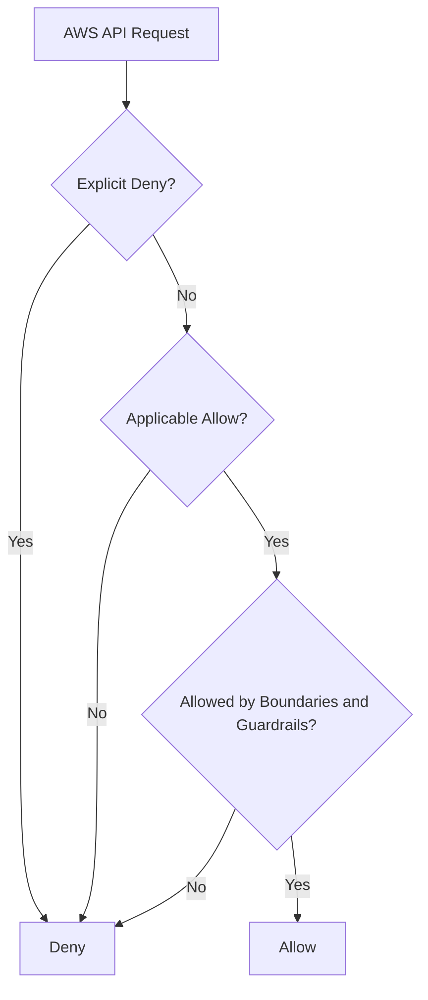

<a id="top"></a>

# AWS IAM — Features and Characteristics

Pulled from a shared ChatGPT conversation
(`chatgpt.com/share/6aa024ce-f254-83e9-bdec-e8c504766ae5`), produced by
ChatGPT with live web search grounding against AWS documentation.
Saved verbatim (light formatting only) for reference — not yet
cross-checked against or merged into
[AWS_Services.md](AWS_Services.md), which already covers IAM in this
repo's own deep-dive style. Companion files:
[aws-s3.md](aws-s3.md), [aws-emr.md](aws-emr.md).

## Table of Contents

1. [What is AWS IAM?](#what-is-aws-iam)
2. [Core IAM components](#core-iam-components)
3. [Authentication](#1-authentication)
4. [Authorization](#2-authorization)
5. [Fine-grained permissions](#3-fine-grained-permissions)
6. [IAM users](#4-iam-users)
7. [IAM groups](#5-iam-groups)
8. [IAM roles](#6-iam-roles)
9. [Temporary credentials](#7-temporary-credentials)
10. [IAM policies](#8-iam-policies)
11. [Types of policies](#9-types-of-policies)
12. [Managed and inline policies](#10-managed-and-inline-policies)
13. [IAM policy evaluation](#11-iam-policy-evaluation)
14. [Role-based access control](#12-role-based-access-control)
15. [Attribute-based access control](#13-attribute-based-access-control)
16. [Multi-factor authentication](#14-multi-factor-authentication)
17. [Identity federation](#15-identity-federation)
18. [Cross-account access](#16-cross-account-access)
19. [IAM Access Analyzer](#17-iam-access-analyzer)
20. [IAM Policy Simulator](#18-iam-policy-simulator)
21. [Auditing and monitoring](#19-auditing-and-monitoring)
22. [IAM service characteristics](#20-iam-service-characteristics)
23. [IAM security best practices](#iam-security-best-practices)
24. [IAM versus IAM Identity Center](#iam-versus-iam-identity-center)

---

## What is AWS IAM?

**AWS Identity and Access Management (IAM)** is a global AWS service that controls **who is authenticated and what they are authorized to do** in an AWS environment.

IAM helps answer four access-control questions:

- **Principal:** Who is requesting access?
- **Action:** What operation do they want to perform?
- **Resource:** Which AWS resource are they trying to access?
- **Condition:** Under what circumstances should access be allowed?

IAM provides centralized, fine-grained access control across AWS services.

[⬆ Back to top](#top)

## Core IAM components

| Component | Purpose |
|---|---|
| **IAM user** | Long-term identity representing a person or application |
| **IAM group** | Collection of IAM users that share permissions |
| **IAM role** | Assumable identity that provides temporary permissions |
| **IAM policy** | JSON document defining allowed or denied actions |
| **Credentials** | Passwords, access keys, certificates or temporary security tokens |
| **Identity provider** | External authentication system connected through federation |
| **Permissions boundary** | Defines the maximum permissions a user or role may receive |

[⬆ Back to top](#top)

## 1. Authentication

Authentication verifies the identity of the principal making a request.

IAM supports:

- Console username and password
- Access key ID and secret access key
- Temporary AWS STS credentials
- Multi-factor authentication
- SAML 2.0 federation
- OpenID Connect
- Corporate identity providers
- IAM Identity Center
- Workload identities

AWS recommends federated access and temporary credentials for human users instead of creating long-term IAM users wherever possible.

[⬆ Back to top](#top)

## 2. Authorization

Authorization determines whether an authenticated principal can perform a requested action.

For example, IAM can determine whether a developer can:

- Start an EC2 instance
- Read objects from a specific S3 bucket
- Update a Lambda function
- Create an RDS database
- Assume a cross-account role
- Decrypt data using a KMS key

Authorization is controlled primarily through policies.

[⬆ Back to top](#top)

## 3. Fine-grained permissions

IAM permissions can restrict access according to:

- AWS service
- API action
- Specific resource
- Resource ARN
- AWS Region
- Source IP address
- VPC or VPC endpoint
- Date and time
- MFA status
- Resource tags
- Principal tags
- Organization ID
- Requested resource tags

For example, a policy could allow developers to start EC2 instances only when:

- The instance has the tag `Environment=Development`.
- The request originates from a corporate IP address.
- The user authenticated with MFA.

[⬆ Back to top](#top)

## 4. IAM users

An IAM user represents an identity within one AWS account.

An IAM user can have:

- Console password
- Access keys
- MFA device
- Directly attached policies
- Inline policies
- Group membership

IAM users may be appropriate for limited use cases requiring long-term credentials. For regular workforce access, AWS recommends federation through IAM Identity Center.

[⬆ Back to top](#top)

## 5. IAM groups

An IAM group is a collection of IAM users.

Examples include:

- Developers
- DatabaseAdministrators
- SecurityAuditors
- NetworkEngineers
- ReadOnlyUsers

Permissions assigned to a group are inherited by its users.

Important characteristics:

- Groups contain users, not roles.
- Groups cannot be nested.
- A user can belong to multiple groups.
- Groups simplify permission administration.
- Groups cannot directly authenticate or make AWS requests.

[⬆ Back to top](#top)

## 6. IAM roles

An IAM role is an identity that can be assumed by trusted principals. Unlike IAM users, roles do not normally have long-term passwords or access keys.

Roles issue temporary credentials through **AWS Security Token Service (STS)**.

Common role use cases include:

- EC2 accessing an S3 bucket
- Lambda reading a DynamoDB table
- GitHub Actions deploying AWS infrastructure through OIDC
- Cross-account administration
- Federated workforce access
- EKS pods accessing AWS services
- One AWS service accessing another service
- Temporary elevated access

AWS identifies roles as the preferred mechanism for workload access and temporary delegation.

### Two parts of a role

| Role component | Purpose |
|---|---|
| **Trust policy** | Defines who or what may assume the role |
| **Permissions policy** | Defines what the assumed role may do |

[⬆ Back to top](#top)

## 7. Temporary credentials

Temporary credentials contain:

- Access key ID
- Secret access key
- Session token
- Expiration time

Benefits include:

- Automatically expire
- Reduce exposure of long-term secrets
- Can be limited by session policies
- Support role assumption
- Support identity federation
- Work well with automated workloads

Examples of STS operations include:

- `AssumeRole`
- `AssumeRoleWithWebIdentity`
- `AssumeRoleWithSAML`
- `GetSessionToken`

[⬆ Back to top](#top)

## 8. IAM policies

IAM policies are JSON documents that define permissions.

A policy statement commonly contains:

| Element | Function |
|---|---|
| `Version` | Policy-language version |
| `Statement` | Contains one or more permission rules |
| `Effect` | Specifies `Allow` or `Deny` |
| `Action` | AWS API operations |
| `Resource` | Resources affected by the policy |
| `Principal` | Identity receiving access, primarily in resource policies |
| `Condition` | Optional restrictions on when the statement applies |
| `Sid` | Optional statement identifier |

### Example policy

This policy allows reading objects from one S3 bucket:

```json
{
  "Version": "2012-10-17",
  "Statement": [
    {
      "Sid": "ReadApplicationFiles",
      "Effect": "Allow",
      "Action": [
        "s3:GetObject"
      ],
      "Resource": "arn:aws:s3:::application-data/*"
    }
  ]
}
```

[⬆ Back to top](#top)

## 9. Types of policies

### Identity-based policies

Attached to:

- IAM users
- IAM groups
- IAM roles

They define what the identity can do.

### Resource-based policies

Attached directly to supported resources, such as:

- S3 buckets
- KMS keys
- SNS topics
- SQS queues
- Secrets Manager secrets
- Lambda functions
- IAM role trust relationships

They specify which principals can access the resource.

### Permissions boundaries

Set the maximum permissions that an IAM user or role can receive. A permissions boundary does not grant access by itself.

### Session policies

Restrict permissions for an individual temporary session created through AWS STS.

### Service Control Policies

AWS Organizations SCPs define permission guardrails for member accounts and organizational units. They do not grant permissions.

### Resource Control Policies

Organizations RCPs centrally define maximum available permissions for resources in member accounts.

### Access Control Lists

Some AWS services use ACLs to grant access to resources, although ACLs are not JSON IAM policies.

[⬆ Back to top](#top)

## 10. Managed and inline policies

| Policy type | Description |
|---|---|
| **AWS managed policy** | Created and maintained by AWS |
| **Customer managed policy** | Created by the customer and reusable across identities |
| **Inline policy** | Embedded directly into one user, group or role |

Customer-managed policies usually provide better control and reuse than inline policies.

[⬆ Back to top](#top)

## 11. IAM policy evaluation

IAM uses the following fundamental rules:

1. Requests are implicitly denied by default.
2. An applicable explicit `Allow` is required.
3. Guardrails such as permissions boundaries and SCPs may limit the permission.
4. Any applicable explicit `Deny` overrides every `Allow`.



When identity-based and resource-based policies are evaluated together, permissions can be combined, but an explicit deny still overrides an allow. Permissions boundaries, SCPs, RCPs and session policies can further restrict the effective permission.

[⬆ Back to top](#top)

## 12. Role-based access control

**RBAC** grants permissions based on job function or role.

Examples:

- Developers can manage development resources.
- Security engineers can view security findings.
- Database administrators can manage RDS databases.
- Auditors receive read-only access.

RBAC is relatively simple but may require many roles as an organization grows.

[⬆ Back to top](#top)

## 13. Attribute-based access control

**ABAC** grants access by comparing attributes represented by tags.

Example:

- Principal tag: `Project=Phoenix`
- Resource tag: `Project=Phoenix`

The policy permits a principal to manage resources only when the principal and resource project tags match.

Benefits include:

- Scalable permissions
- Fewer individual policies
- Dynamic project access
- Reduced manual permission updates
- Easier management of rapidly changing environments

[⬆ Back to top](#top)

## 14. Multi-factor authentication

IAM supports MFA to add another verification factor beyond a password.

MFA can protect:

- Root-user access
- IAM user console access
- Sensitive API operations
- Role assumption
- Privileged administrative tasks

Policies can use conditions such as `aws:MultiFactorAuthPresent` to require MFA before sensitive operations.

[⬆ Back to top](#top)

## 15. Identity federation

Federation allows users to access AWS using an external identity provider rather than separate IAM-user credentials.

Supported approaches include:

- IAM Identity Center
- SAML 2.0
- OpenID Connect
- Active Directory
- Microsoft Entra ID
- Okta and other identity providers
- Web identity federation

Federated users typically assume IAM roles and receive temporary credentials.

[⬆ Back to top](#top)

## 16. Cross-account access

IAM roles allow a principal in one AWS account to access resources in another.

For successful cross-account access:

- The destination role's trust policy must trust the external principal.
- The source principal needs permission to call `sts:AssumeRole`.
- The assumed role needs permissions for the destination resources.
- Applicable SCPs, resource policies and other guardrails must allow the request.

[⬆ Back to top](#top)

## 17. IAM Access Analyzer

IAM Access Analyzer helps identify and validate access configurations.

It can:

- Detect resources shared externally
- Identify unintended public access
- Identify cross-account access
- Validate IAM policy syntax
- Report security warnings
- Generate policies based on CloudTrail activity
- Help refine permissions toward least privilege

AWS recommends Access Analyzer for policy validation and reviewing public or cross-account access.

[⬆ Back to top](#top)

## 18. IAM Policy Simulator

The policy simulator tests whether policies allow or deny selected actions.

It can help troubleshoot:

- Access-denied errors
- Identity-based policies
- Permissions boundaries
- Resource-specific access
- Policy conditions

A successful simulation does not always guarantee actual access because live requests may also be affected by resource policies, SCPs, KMS key policies or service-specific authorization rules.

[⬆ Back to top](#top)

## 19. Auditing and monitoring

IAM integrates with:

- **AWS CloudTrail:** Records IAM and AWS API activity.
- **AWS Config:** Evaluates resource configurations.
- **Amazon CloudWatch:** Monitors logs, events and alarms.
- **Security Hub:** Aggregates security findings.
- **EventBridge:** Responds to IAM-related events.
- **IAM credential reports:** Reports account-level credential status.
- **Access Advisor:** Shows service access and last-accessed information.

[⬆ Back to top](#top)

## 20. IAM service characteristics

| Characteristic | Description |
|---|---|
| **Global service** | IAM resources are generally not tied to one AWS Region |
| **No additional charge** | IAM itself is available without a separate service charge |
| **Centralized** | Controls access across AWS services and resources |
| **Fine-grained** | Permissions can be restricted by action, resource and condition |
| **Secure by default** | Requests are implicitly denied unless allowed |
| **Policy-driven** | Access is controlled through JSON policies |
| **Highly integrated** | Nearly all AWS services integrate with IAM |
| **Supports federation** | Works with corporate and web identity providers |
| **Temporary access** | Roles and STS reduce reliance on long-term credentials |
| **Scalable** | Supports RBAC, ABAC, groups and organizational guardrails |
| **Auditable** | Integrates with CloudTrail and Access Analyzer |
| **Eventually consistent** | IAM updates may take time to propagate across AWS systems |

[⬆ Back to top](#top)

## IAM security best practices

- Do not use the root user for daily activities.
- Protect the root user with MFA.
- Use IAM Identity Center for workforce access.
- Use roles and temporary credentials for workloads.
- Avoid embedding access keys in application code.
- Store unavoidable secrets securely and rotate them.
- Apply least-privilege permissions.
- Avoid unrestricted `"Action": "*"` and `"Resource": "*"`.
- Use conditions to limit access.
- Use SCPs and permissions boundaries as guardrails.
- Review unused users, roles, policies and credentials.
- Use Access Analyzer to validate policies.
- Log API activity with CloudTrail.
- Require MFA for privileged operations.
- Use separate roles for administration, deployment and read-only access.

AWS specifically recommends federation for human users, roles for workloads, MFA, least privilege, regular permission reviews and permissions guardrails.

[⬆ Back to top](#top)

## IAM versus IAM Identity Center

| AWS IAM | IAM Identity Center |
|---|---|
| Controls permissions within AWS | Centrally manages workforce access |
| Creates users, groups, roles and policies | Assigns users and groups to multiple accounts |
| Supports service and workload identities | Provides single sign-on |
| Exists inside an AWS account | Manages multi-account access through permission sets |
| Best for roles, policies and workload permissions | Best for employee access across an AWS Organization |

In summary, **AWS IAM is the foundation of AWS security**. It provides centralized identity management, authentication, fine-grained authorization, temporary credentials, federation, cross-account access and policy-based security controls.

[⬆ Back to top](#top)
