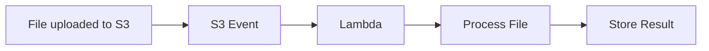

<a id="top"></a>

# AWS S3 — Features and Characteristics

Pulled from a shared ChatGPT conversation
(`chatgpt.com/share/6aa024ce-f254-83e9-bdec-e8c504766ae5`), produced by
ChatGPT with live web search grounding against AWS documentation.
Saved verbatim (light formatting only) for reference — not yet
cross-checked against or merged into
[AWS_Services.md](AWS_Services.md), which already covers S3 in this
repo's own deep-dive style. Companion files:
[aws-iam.md](aws-iam.md), [aws-emr.md](aws-emr.md).

## Table of Contents

1. [What is Amazon S3?](#what-is-amazon-s3)
2. [Object storage architecture](#1-object-storage-architecture)
3. [Buckets and objects](#2-buckets-and-objects)
4. [High durability](#3-high-durability)
5. [Massive scalability](#4-massive-scalability)
6. [Strong consistency](#5-strong-consistency)
7. [S3 storage classes](#6-s3-storage-classes)
8. [S3 Intelligent-Tiering](#7-s3-intelligent-tiering)
9. [S3 Lifecycle management](#8-s3-lifecycle-management)
10. [S3 Versioning](#9-s3-versioning)
11. [S3 replication](#10-s3-replication)
12. [Encryption](#11-encryption)
13. [Access control](#12-access-control)
14. [S3 Block Public Access](#13-s3-block-public-access)
15. [S3 Object Ownership](#14-s3-object-ownership)
16. [S3 Object Lock](#15-s3-object-lock)
17. [S3 Access Points](#16-s3-access-points)
18. [Multi-Region Access Points](#17-multi-region-access-points)
19. [S3 event notifications](#18-s3-event-notifications)
20. [Data transfer capabilities](#19-data-transfer-capabilities)
21. [Static website hosting](#20-static-website-hosting)
22. [Monitoring, logging and analytics](#21-monitoring-logging-and-analytics)
23. [S3 Batch Operations](#22-s3-batch-operations)
24. [Pre-signed URLs](#23-pre-signed-urls)
25. [Cost characteristics](#24-cost-characteristics)
26. [Key characteristics summary](#key-characteristics-summary)
27. [Common use cases](#common-use-cases)

---

## What is Amazon S3?

**Amazon Simple Storage Service (Amazon S3)** is a managed **object storage service** designed to store and retrieve virtually any amount of data from anywhere.

S3 is commonly used for:

- Backup and recovery
- Data lakes and analytics
- Static website content
- Application files
- Log storage
- Media files
- Software artifacts
- Disaster recovery
- Archiving
- AI and machine-learning datasets

Amazon S3 provides high scalability, durability, availability, security, and performance.

[⬆ Back to top](#top)

---

## 1. Object storage architecture

S3 stores data as **objects**, rather than blocks or traditional files.

Each object consists of:

- The actual data
- An object key or name
- System metadata
- User-defined metadata
- Optional object tags
- Optional version ID

Objects are stored inside **buckets**.

```text
s3://company-data/production/reports/report.csv
      └─ Bucket ─┘└──────── Object key ────────┘
```

Although prefixes such as `production/reports/` look like folders, S3 uses a flat object-key structure rather than a traditional directory hierarchy.

[⬆ Back to top](#top)

---

## 2. Buckets and objects

### Bucket characteristics

An S3 bucket:

- Is created in a specific AWS Region.
- Contains objects.
- Has access, security, lifecycle and logging configurations.
- Can store any number of objects.
- Uses a name unique within its applicable AWS partition.
- Can have versioning enabled.
- Can host event-notification configurations.
- Can be accessed through the console, CLI, SDK or REST API.

### Object characteristics

An S3 object:

- Is identified by a unique key within a bucket.
- Can contain metadata and tags.
- Can be encrypted.
- Can have multiple versions.
- Can be copied between buckets.
- Can belong to a specific storage class.

[⬆ Back to top](#top)

---

## 3. High durability

Amazon S3 Standard is designed for:

- **99.999999999% durability**, commonly called eleven nines.
- **99.99% availability** over a given year.

Most regional S3 storage classes redundantly store objects across multiple devices in at least three Availability Zones.

Durability means the likelihood that your stored objects will remain intact. Availability measures how frequently the objects can be accessed.

[⬆ Back to top](#top)

---

## 4. Massive scalability

S3 automatically scales without requiring administrators to provision storage servers or calculate storage capacity.

Characteristics include:

- Virtually unlimited total storage
- Automatic scaling
- Support for very large numbers of objects
- Parallel uploads and downloads
- High request throughput
- No storage infrastructure to manage

S3 performance scales by prefix and supports parallel requests for high-throughput applications.

[⬆ Back to top](#top)

---

## 5. Strong consistency

Amazon S3 provides strong read-after-write consistency.

After a successful:

- `PUT`
- `COPY`
- Overwrite
- `DELETE`
- Tag or metadata update

subsequent read and list requests immediately reflect the completed operation.

Updates to an individual object key are atomic. A reader receives either the old object or the new object—never a partial object.

[⬆ Back to top](#top)

---

## 6. S3 storage classes

S3 provides storage classes for different access, availability and cost requirements.

| Storage class | Characteristics | Common use |
|---|---|---|
| **S3 Standard** | Multi-AZ, low latency and frequent access | Applications, websites and data lakes |
| **S3 Intelligent-Tiering** | Automatically moves objects among access tiers | Unknown or changing access patterns |
| **S3 Standard-IA** | Multi-AZ and lower storage cost with retrieval charges | Infrequently accessed backups |
| **S3 One Zone-IA** | Stores data in one AZ | Re-creatable, infrequently accessed data |
| **S3 Express One Zone** | Single-AZ, very low latency and high request performance | Performance-sensitive analytics and applications |
| **S3 Glacier Instant Retrieval** | Archive storage with millisecond retrieval | Rarely accessed data needing immediate retrieval |
| **S3 Glacier Flexible Retrieval** | Low-cost archive with asynchronous retrieval | Backup and disaster recovery archives |
| **S3 Glacier Deep Archive** | Lowest-cost long-term archive | Compliance and long-term retention |

S3 Express One Zone uses **directory buckets** and is intended for latency-sensitive workloads requiring very high request rates.

[⬆ Back to top](#top)

---

## 7. S3 Intelligent-Tiering

S3 Intelligent-Tiering monitors access patterns and automatically moves objects between access tiers.

Benefits include:

- No manual lifecycle analysis
- Automatic storage-cost optimization
- No retrieval charge for the frequent and infrequent access tiers
- Suitable for unpredictable access patterns
- Optional archive tiers for rarely accessed data

A small monitoring and automation charge applies per eligible object.

[⬆ Back to top](#top)

---

## 8. S3 Lifecycle management

Lifecycle rules automate how objects are managed over time.

A lifecycle policy can:

- Move objects from S3 Standard to Standard-IA.
- Transition objects into Glacier storage.
- Delete expired objects.
- Remove older object versions.
- Delete incomplete multipart uploads.
- Expire delete markers.

For example:

```text
Day 0       → S3 Standard
Day 30      → S3 Standard-IA
Day 90      → S3 Glacier Flexible Retrieval
After 7 yrs → Delete
```

Lifecycle rules help reduce costs and enforce data-retention policies.

[⬆ Back to top](#top)

---

## 9. S3 Versioning

S3 Versioning preserves multiple versions of an object.

It helps protect against:

- Accidental deletion
- Unintended overwrites
- Application errors
- Ransomware-related changes
- Incorrect deployments

When versioning is enabled:

- Each object version receives a version ID.
- Overwriting creates a new version.
- A simple deletion normally creates a delete marker.
- Previous versions can be restored.
- Every retained version incurs storage charges.

Versioning cannot return to an unversioned state after it has been enabled, but it can be suspended.

[⬆ Back to top](#top)

---

## 10. S3 replication

S3 Replication automatically copies eligible objects between buckets.

### Replication types

| Type | Description |
|---|---|
| **Same-Region Replication** | Replicates objects between buckets in the same Region |
| **Cross-Region Replication** | Replicates objects to a bucket in another Region |
| **Two-way replication** | Replicates changes in both directions when appropriately configured |
| **Batch Replication** | Replicates existing objects using S3 Batch Operations |

Use cases include:

- Disaster recovery
- Compliance
- Data sovereignty
- Reduced access latency
- Log aggregation
- Data isolation
- Replication between AWS accounts

Replication can copy object metadata and tags and can use a different storage class at the destination.

[⬆ Back to top](#top)

---

## 11. Encryption

Amazon S3 supports encryption at rest and in transit.

### Encryption at rest

| Method | Key management |
|---|---|
| **SSE-S3** | Keys managed entirely by Amazon S3 |
| **SSE-KMS** | Keys managed through AWS KMS |
| **DSSE-KMS** | Two independent layers of server-side KMS encryption |
| **SSE-C** | Customer supplies the encryption key with each request |
| **Client-side encryption** | Data is encrypted before being uploaded |

S3 automatically applies server-side encryption to new object uploads.

### Encryption in transit

S3 supports HTTPS/TLS. A bucket policy can deny requests that do not use secure transport:

```json
{
  "Effect": "Deny",
  "Principal": "*",
  "Action": "s3:*",
  "Resource": [
    "arn:aws:s3:::company-data",
    "arn:aws:s3:::company-data/*"
  ],
  "Condition": {
    "Bool": {
      "aws:SecureTransport": "false"
    }
  }
}
```

[⬆ Back to top](#top)

---

## 12. Access control

S3 integrates with AWS IAM to provide fine-grained authorization.

Access can be controlled through:

- IAM identity policies
- Bucket policies
- S3 Access Points
- Access Point policies
- Service Control Policies
- Resource Control Policies
- VPC endpoint policies
- AWS KMS key policies
- Access Control Lists
- Pre-signed URLs

Policies can restrict access based on:

- Principal
- API action
- Bucket or object ARN
- Source IP address
- VPC endpoint
- AWS Organization
- Encryption method
- Object tags
- Requested prefix
- TLS usage

AWS generally recommends IAM and bucket policies instead of ACLs for access management.

[⬆ Back to top](#top)

---

## 13. S3 Block Public Access

S3 Block Public Access prevents accidental exposure through public policies or ACLs.

It can be configured at:

- Organization level
- Account level
- Bucket level
- Access Point level

Its four principal settings can:

- Block new public ACLs
- Ignore existing public ACLs
- Block public bucket policies
- Restrict public and cross-account bucket policies

AWS recommends enabling all four settings when public access is not explicitly required.

[⬆ Back to top](#top)

---

## 14. S3 Object Ownership

S3 Object Ownership determines who owns uploaded objects.

The recommended **Bucket owner enforced** setting:

- Gives the bucket owner control over objects.
- Disables ACLs.
- Simplifies access management.
- Uses policies for access control.

This is particularly useful when different AWS accounts upload objects to the same bucket.

[⬆ Back to top](#top)

---

## 15. S3 Object Lock

S3 Object Lock provides **write once, read many**, or WORM, protection.

It supports:

### Retention periods

Protect an object until a specific date.

### Legal holds

Protect an object indefinitely until the legal hold is removed.

### Retention modes

| Mode | Characteristic |
|---|---|
| **Governance mode** | Authorized users can bypass retention with special permission |
| **Compliance mode** | Protected versions cannot be deleted or overwritten, including by the root user |

Object Lock is commonly used for:

- Regulatory compliance
- Financial records
- Security logs
- Legal evidence
- Ransomware protection
- Backup immutability

[⬆ Back to top](#top)

---

## 16. S3 Access Points

S3 Access Points simplify access management for shared datasets.

Each access point can have:

- A unique hostname
- Its own access policy
- A specific network origin
- Restrictions to a VPC
- Permissions for a particular application or team

Instead of maintaining one extremely large bucket policy, an organization can create separate access points for developers, analytics systems and backup applications.

[⬆ Back to top](#top)

---

## 17. Multi-Region Access Points

S3 Multi-Region Access Points provide a global endpoint for data stored across multiple AWS Regions.

Characteristics include:

- Global access endpoint
- Routing to an appropriate regional bucket
- Active-active application support
- Cross-Region replication integration
- Failover controls
- Improved global access performance
- Support for multi-Region disaster recovery

[⬆ Back to top](#top)

---

## 18. S3 event notifications

S3 can generate events when objects are:

- Created
- Deleted
- Restored from archive
- Replicated
- Transitioned between storage classes
- Modified through lifecycle operations

Events can be sent to:

- Amazon EventBridge
- Amazon SNS
- Amazon SQS
- AWS Lambda

Example:



Applications should generally handle duplicate or out-of-order event delivery safely.

[⬆ Back to top](#top)

---

## 19. Data transfer capabilities

S3 supports several data-transfer options:

- Multipart upload
- S3 Transfer Acceleration
- AWS DataSync
- AWS Transfer Family
- AWS Snow Family
- Direct Connect
- Site-to-Site VPN
- Pre-signed URLs
- Copy operations
- S3 Batch Operations

### Multipart upload

Large files are divided into independently uploaded parts.

Benefits include:

- Parallel uploads
- Retry only failed parts
- Improved throughput
- Pause and resume capabilities
- Better performance across unreliable networks

### Transfer Acceleration

Transfer Acceleration uses AWS edge locations and the AWS global network to accelerate long-distance uploads and downloads.

[⬆ Back to top](#top)

---

## 20. Static website hosting

A general-purpose S3 bucket can host static content such as:

- HTML
- CSS
- JavaScript
- Images
- Client-side applications

S3 static website endpoints do not directly provide HTTPS. A common secure architecture places **Amazon CloudFront** in front of a private S3 bucket and uses Origin Access Control.

S3 does not execute server-side application code such as PHP, Java or Node.js.

[⬆ Back to top](#top)

---

## 21. Monitoring, logging and analytics

S3 integrates with:

- AWS CloudTrail
- Amazon CloudWatch
- AWS Config
- IAM Access Analyzer
- Amazon Macie
- AWS Security Hub
- GuardDuty Malware Protection
- S3 Storage Lens
- S3 Inventory
- Server access logging

### S3 Storage Lens

Provides organization-wide visibility into:

- Storage usage
- Object counts
- Cost optimization
- Data protection
- Access management
- Activity trends

### S3 Inventory

Produces scheduled reports listing objects and properties such as:

- Size
- Storage class
- Encryption status
- Replication status
- Version ID
- Object Lock status

[⬆ Back to top](#top)

---

## 22. S3 Batch Operations

S3 Batch Operations performs an operation across thousands, millions or billions of objects.

Examples include:

- Copying objects
- Replacing tags
- Applying Object Lock retention
- Restoring archived objects
- Invoking Lambda functions
- Replicating existing objects

It uses an S3 Inventory report or another CSV manifest to identify target objects.

[⬆ Back to top](#top)

---

## 23. Pre-signed URLs

A pre-signed URL provides temporary access to a private object without making the bucket public.

It can authorize:

- Downloads
- Uploads
- Time-limited access
- Specific HTTP operations

The URL operates using the permissions of the principal that generated it and expires after the configured period.

[⬆ Back to top](#top)

---

## 24. Cost characteristics

S3 uses a pay-as-you-go pricing model.

Charges may include:

- Storage consumed
- API requests
- Data retrieval
- Internet or cross-Region data transfer
- Lifecycle transitions
- Replication
- Intelligent-Tiering monitoring
- Data-management and analytics features
- Early-deletion charges for applicable storage classes

Cost-optimization techniques include:

- Selecting the correct storage class
- Using lifecycle rules
- Deleting incomplete multipart uploads
- Expiring obsolete versions
- Using Intelligent-Tiering
- Monitoring with Storage Lens
- Compressing appropriate data
- Avoiding unnecessary cross-Region transfers

[⬆ Back to top](#top)

---

## Key characteristics summary

| Characteristic | Description |
|---|---|
| **Storage type** | Object storage |
| **Managed service** | AWS manages infrastructure, maintenance and scaling |
| **Regional resource** | Buckets and stored objects reside in a selected Region |
| **Highly durable** | Designed for eleven-nines durability |
| **Highly available** | Multi-AZ storage options are available |
| **Virtually unlimited** | Automatically scales as data grows |
| **Strongly consistent** | Reads and listings reflect successful writes and deletes |
| **Secure** | Supports IAM, policies, encryption and public-access blocking |
| **Version controlled** | Preserves and restores previous object versions |
| **Cost optimized** | Offers multiple storage classes and lifecycle automation |
| **Event driven** | Integrates with Lambda, EventBridge, SNS and SQS |
| **Auditable** | Integrates with CloudTrail, Config and S3 Inventory |
| **API accessible** | Accessible through REST, SDKs, CLI and console |
| **Not traditional file storage** | Uses buckets, keys and objects instead of mounted block storage |

[⬆ Back to top](#top)

## Common use cases

- Data lake storage
- Backup and restoration
- Long-term archival
- Static website hosting
- Application asset storage
- Log and audit storage
- CI/CD artifacts
- Database exports
- Media distribution
- Machine-learning datasets
- Disaster recovery
- Compliance record retention
- Software package storage
- Big-data analytics

In summary, **Amazon S3 is a scalable, durable and secure object-storage platform that supports operational applications, backups, archives, data lakes, analytics and disaster-recovery workloads.**

[⬆ Back to top](#top)
