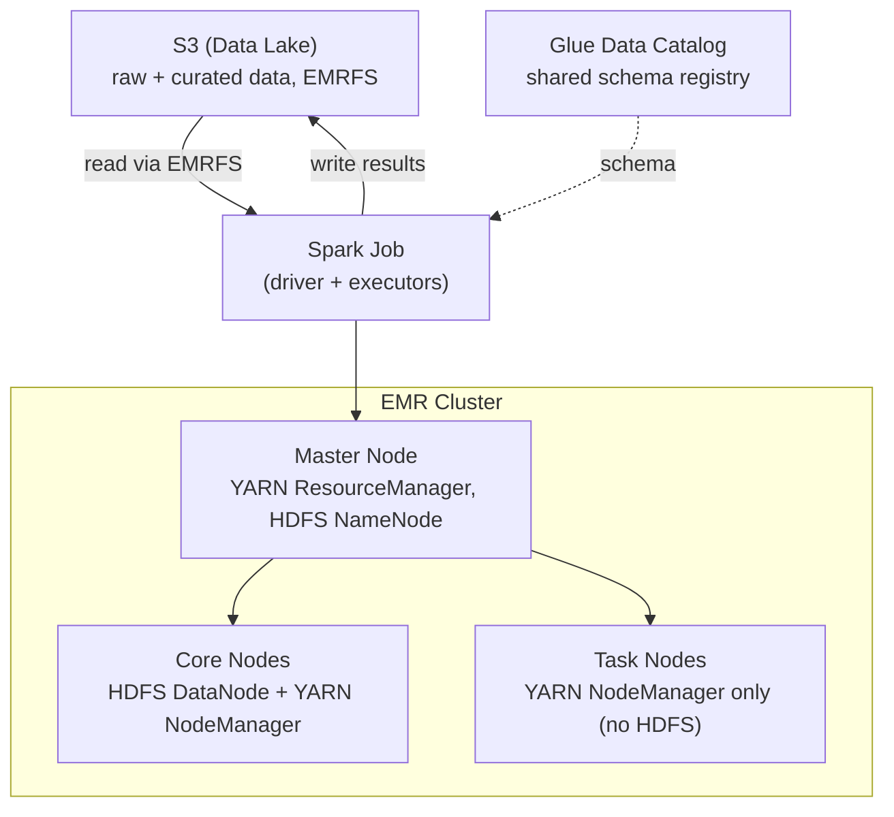

<a id="top"></a>

# Hadoop & Apache Spark on Amazon EMR — Deep Dive

Big data and ETL workloads on AWS: what Hadoop and Spark actually are,
how Amazon EMR runs them, and how to scale, monitor, tune, and
troubleshoot them in production. Companion to
[AWS_Services.md](AWS_Services/AWS_Services.md) (EMR's one-line
overview) and
[ClifyX/Interview-Questions.md § 6](../Resume/ClifyX/Interview-Questions.md#6-big-data--hadoop)
in this repo.

## Table of Contents

1. [Definitions](#1-definitions)
2. [Architecture & Key Concepts](#2-architecture--key-concepts)
3. [Features & Characteristics](#3-features--characteristics)
4. [Big Data & ETL Workload Patterns](#4-big-data--etl-workload-patterns)
5. [S3 Bucket Access Permissions](#5-s3-bucket-access-permissions)
6. [Scaling](#6-scaling)
7. [Monitoring](#7-monitoring)
8. [Performance Tuning](#8-performance-tuning)
9. [Troubleshooting](#9-troubleshooting)
10. [Support](#10-support)
11. [Interview Questions](#11-interview-questions)

---

## 1. Definitions

**Apache Hadoop** — official tagline: *"The Apache Hadoop project
develops open-source software for reliable, scalable, distributed
computing."* Four core modules:

| Module | Official Description |
|---|---|
| **Hadoop Common** | "The common utilities that support the other Hadoop modules." |
| **HDFS** (Hadoop Distributed File System) | "A distributed file system that provides high-throughput access to application data." |
| **Hadoop YARN** | "A framework for job scheduling and cluster resource management." |
| **Hadoop MapReduce** | "A YARN-based system for parallel processing of large data sets." |

**Apache Spark** — official tagline: *"Apache Spark is a multi-language
engine for executing data engineering, data science, and machine
learning on single-node machines or clusters,"* built around four core
qualities Apache itself calls out: **Simple, Fast, Scalable, Unified**.
Key components: Spark SQL/DataFrames (distributed ANSI SQL), Spark
Streaming/Structured Streaming (unified batch + real-time processing),
MLlib (distributed machine learning), and Spark Connect.

**Amazon EMR** — official tagline: *"Easily run and scale Apache Spark,
Trino, and other big data workloads."* AWS describes it as *"a big data
processing service that accelerates analytics workloads with unmatched
flexibility and scale,"* running performance-optimized builds of
Spark, Trino, Flink, and Hive, with open table format support
(Iceberg, Hudi, Delta).

### Current Engine Versions (EMR Release 7.13.0, April 2026)

| Component | Version |
|---|---|
| **Apache Spark** | 3.5.6-amzn-2 |
| Hadoop | 3.4.2-amzn-0 |
| Hive | 3.1.3-amzn-22 |
| Python | 3.9, **3.11** (3.11 is now the default for PySpark/Spark workloads as of 7.13.0; 3.9 remains default elsewhere) |
| Scala | 2.12.18 |
| Java | Amazon Corretto 17 (default, JDK 17) |

The `-amzn-N` suffix means AWS has patched/backported fixes onto that
open-source version — not a fork, AWS-applied patches on top of
community Spark 3.5.6. Each EMR release label (`emr-7.13.0`,
`emr-6.15.0`, etc.) pins one specific combination of these versions —
picking a release is effectively picking a Spark version, not a
separate decision.

**How they relate**: Hadoop is the original distributed storage
(HDFS) + resource management (YARN) + processing (MapReduce) stack;
Spark is a faster, more general processing engine that can run *on
top of* YARN (using Hadoop's cluster resource management) while mostly
replacing MapReduce as the actual processing model — most modern
"Hadoop" clusters run Spark as the primary engine, with HDFS/YARN
still underneath. **EMR is AWS's managed service for running both** —
it provisions and operates the cluster (or the serverless equivalent)
so you don't manage the underlying Hadoop/Spark installation by hand.

[⬆ Back to top](#top)

---

## 2. Architecture & Key Concepts

### EMR Cluster Node Types

| Node Type | Role |
|---|---|
| **Master node** | Runs cluster coordination — YARN ResourceManager, HDFS NameNode, and (if used) the Spark driver for cluster/client-mode jobs. One per cluster. |
| **Core nodes** | Run HDFS DataNodes (store data) and YARN NodeManagers (run tasks). Scaling core nodes changes both storage *and* compute capacity — they're coupled. |
| **Task nodes** | Run YARN NodeManagers only — compute capacity with no HDFS storage. The node type to scale up/down for pure processing bursts without touching stored data. |

### Execution Model: MapReduce vs. Spark

| | MapReduce | Spark |
|---|---|---|
| **Processing model** | Disk-based, two-phase (Map → Reduce), writes intermediate results to disk between stages | In-memory (where possible) DAG execution — chains multiple transformations without writing to disk between every step |
| **Speed** | Slower for iterative/multi-stage jobs due to disk I/O between stages | Materially faster for iterative workloads (ML training, multi-stage ETL) since intermediate data can stay in memory |
| **API** | Low-level Java API, verbose | Higher-level APIs (DataFrames, SQL, RDDs) in Python/Scala/Java/R/SQL |
| **Current role** | Still present as a YARN application type; rarely the primary engine for new workloads | The default processing engine for most new Hadoop-ecosystem work, including on EMR |

### Diagram: EMR Cluster on S3-Backed Data Lake



**Interview Keyword**: know that **EMRFS** (EMR File System) is what
lets Spark/Hadoop read and write S3 directly as if it were HDFS — this
is *the* mechanism that decouples storage from compute on EMR, and is
the reason EMR clusters are commonly ephemeral (spun up for a job,
torn down after) rather than long-running, unlike a traditional
on-prem Hadoop cluster where HDFS data dies with the cluster.

[⬆ Back to top](#top)

---

## 3. Features & Characteristics

| Feature | Definition | Preferred Over the Alternative When |
|---|---|---|
| **EMR Serverless** | Fully managed, no cluster to provision or size — submit a Spark/Hive job, EMR handles capacity automatically. | Workload is bursty/unpredictable, or you don't want to own cluster sizing at all. |
| **EMR on EC2** | Traditional cluster (master/core/task nodes) with fine-grained control over instance types, bootstrap actions, and cluster configuration. | You need custom AMIs, specific instance types, fine-grained tuning, or a long-running cluster. |
| **EMR on EKS** | Runs Spark jobs as Kubernetes pods on an existing EKS cluster instead of dedicated EMR nodes. | You already run EKS and want big-data jobs sharing the same Kubernetes-managed infrastructure/tooling as everything else. |
| **Instance Fleets** | Define a target capacity and a list of eligible instance types/purchase options; EMR provisions whatever mix satisfies it. | You want EMR to automatically diversify across instance types/AZs for better Spot availability. |
| **Instance Groups** | Explicitly define each node type's exact instance type and count. | You need precise, predictable control over exactly what's provisioned. |
| **Managed Scaling** | EMR automatically adds/removes core and task nodes based on workload, within a configured min/max. | You want AWS to handle scaling decisions rather than configuring your own scaling rules. |
| **Open table formats (Iceberg/Hudi/Delta)** | Table formats adding ACID transactions, schema evolution, and time travel on top of files sitting in S3. | You need reliable upserts/deletes or point-in-time queries against a data lake — plain Parquet/ORC files don't support that natively. |

**Performance claim from AWS**: EMR's optimized Spark runtime is
marketed as up to 5.4x faster than open-source Apache Spark on
equivalent workloads, with Iceberg reads up to 4.5x faster and writes
over 2x faster — a real product differentiator worth knowing, though
treat any vendor benchmark as workload-dependent rather than a
universal multiplier.

[⬆ Back to top](#top)

---

## 4. Big Data & ETL Workload Patterns

**S3 as the data lake, not HDFS**: on EMR, S3 (via EMRFS) is almost
always the primary data store, with HDFS used only for transient
intermediate data during a job. This is the key architectural shift
from on-prem Hadoop: storage (S3) and compute (the EMR cluster) scale
and are billed independently, and the cluster itself can be
**ephemeral** — spun up, run the job, write results back to S3, and
terminate — since no persistent data lives only on the cluster.

**Typical ETL pipeline shape**:
```text
S3 (raw/landing zone)
  -> Spark job (EMR) reads raw data, applies transformations
     (cleaning, joins, aggregation, schema enforcement)
  -> writes curated output back to S3 in a columnar format (Parquet/ORC)
  -> Glue Data Catalog registers/updates the schema
  -> downstream consumers (Athena, Redshift Spectrum, another Spark job)
     query the curated data directly from S3
```

**Glue Data Catalog integration**: EMR can use the Glue Data Catalog
as its Hive Metastore, so table definitions created by a Spark job on
EMR are immediately queryable from Athena or Redshift Spectrum without
re-registering the schema — one shared catalog across every
S3-querying service.

**File format choice matters**: Parquet/ORC (columnar, compressed,
splittable) over CSV/JSON (row-based, larger, often not splittable)
for anything read repeatedly — columnar formats let Spark skip
reading columns a query doesn't need, and compression cuts both S3
storage cost and I/O time.

[⬆ Back to top](#top)

---

## 5. S3 Bucket Access Permissions

EMR clusters don't get S3 access by magic — every read/write through
EMRFS is authorized the same way any AWS API call is: through IAM.
Three separate permission layers matter, and a gap in any one of them
produces an `AccessDenied` error that looks identical from the Spark
job's point of view.

### The Three Layers

| Layer | What It Controls | Where It's Configured |
|---|---|---|
| **EC2 Instance Profile (EMR role)** | The IAM role actually attached to every node in the cluster — this is the identity Spark/Hadoop processes use to call S3, whether or not a human is involved. | Specified at cluster creation (`EMR_EC2_DefaultRole` or a custom role) |
| **IAM policy on that role** | Which specific S3 actions (`s3:GetObject`, `s3:PutObject`, `s3:ListBucket`, etc.) and which bucket/prefix ARNs are allowed. | An IAM policy attached to the instance profile role |
| **S3 bucket policy (if cross-account or extra restriction)** | An additional, resource-side check — even a fully-permitted IAM principal can still be denied if the bucket policy doesn't also allow it. | Set directly on the S3 bucket |

**A request only succeeds if all applicable layers agree** — the
IAM policy on the role and the bucket policy (if one exists) are
evaluated together, and an explicit `Deny` in *either* wins regardless
of what the other allows.

### Minimal IAM Policy Shape for EMR-to-S3 Access

```json
{
  "Version": "2012-10-17",
  "Statement": [
    {
      "Effect": "Allow",
      "Action": [
        "s3:GetObject",
        "s3:PutObject",
        "s3:DeleteObject"
      ],
      "Resource": "arn:aws:s3:::my-data-lake-bucket/*"
    },
    {
      "Effect": "Allow",
      "Action": "s3:ListBucket",
      "Resource": "arn:aws:s3:::my-data-lake-bucket"
    }
  ]
}
```

Two details that trip people up: **`s3:ListBucket` is a
bucket-level permission** (its `Resource` is the bucket ARN itself,
no trailing `/*`), while `GetObject`/`PutObject`/`DeleteObject` are
**object-level permissions** (`Resource` needs the trailing `/*`) —
mixing these up is one of the most common causes of a job that can
list a bucket's contents but fails to actually read the objects in it,
or vice versa.

### Cross-Account S3 Access

When the EMR cluster's account is different from the S3 bucket's
owning account, IAM alone isn't enough — the **bucket policy** in the
owning account must also explicitly grant the EMR cluster's role
(or account) access, since a resource in another account doesn't
implicitly trust your IAM policies. This is the same
"both sides must agree" model as cross-account IAM role assumption
generally, just expressed as a bucket policy instead of a role trust
policy.

### Least-Privilege Scoping

- **Scope by prefix, not just bucket** — if a cluster only ever needs
  `s3://data-lake/raw/` and `s3://data-lake/curated/`, scope the
  policy's `Resource` to those prefixes specifically rather than the
  whole bucket, so a misconfigured job can't accidentally read or
  overwrite unrelated data in the same bucket.
- **Separate read-only and read-write roles** where the workload
  allows it — a job that only reads raw data and writes to a distinct
  curated-output prefix doesn't need delete permission on the raw
  zone at all.
- **KMS permissions are separate from S3 permissions** — if the bucket
  uses SSE-KMS encryption, the role also needs `kms:Decrypt` (and
  `kms:GenerateDataKey` for writes) on the specific key, independent
  of the S3 permissions above; an otherwise-correct S3 policy still
  fails with `AccessDenied` if the KMS key policy doesn't also permit
  that role.

### Interview Keyword
If asked "why is my EMR job getting `AccessDenied` on S3," walk
through the layers in order: **is the instance profile role correct
for this cluster → does that role's IAM policy actually cover this
bucket/prefix and this specific action → is there a bucket policy
(especially cross-account) that also needs to allow it → if the
bucket uses SSE-KMS, does the role have `kms:Decrypt`/
`kms:GenerateDataKey` on that specific key**. Assuming it's always
the IAM policy on the role, when it's actually a missing KMS
permission or an unset bucket policy, is a very common wrong turn.

[⬆ Back to top](#top)

---

## 6. Scaling

| Scaling Lever | What It Does | When to Use |
|---|---|---|
| **Managed Scaling** | EMR automatically adds/removes core and task nodes based on YARN memory/pending-container metrics, within a configured min/max. | Default choice for most workloads — removes the need to hand-tune scaling rules. |
| **Task node autoscaling (classic)** | Custom CloudWatch-alarm-driven scaling rules on task node count. | You need scaling logic Managed Scaling doesn't cover, or are on an older EMR release without Managed Scaling support. |
| **Instance Fleets + Spot** | Diversify across instance types/AZs, mixing On-Demand and Spot for cost savings. | Cost-sensitive, fault-tolerant batch workloads — Spark's task-retry model tolerates Spot interruption reasonably well. |
| **Scale core vs. task nodes** | Core nodes add storage *and* compute (HDFS + YARN); task nodes add compute only. | Scale **task** nodes for a pure processing burst; scale **core** nodes only if you actually need more HDFS capacity. |
| **EMR Serverless auto-scaling** | No node-level decision at all — EMR scales workers per-job automatically. | Bursty/unpredictable workloads where you don't want to own capacity planning. |

**Spark-level scaling (within a fixed cluster size)**: separate from
cluster scaling — **dynamic allocation** (`spark.dynamicAllocation.enabled=true`)
lets Spark itself request/release executors within a job based on the
actual task backlog, so a job doesn't hold executors idle during a
light stage and starve a heavy one.

[⬆ Back to top](#top)

---

## 7. Monitoring

| Tool | What It Shows | When to Use |
|---|---|---|
| **EMR Console / CloudWatch metrics** | Cluster-level health — YARN memory/core utilization, HDFS capacity, running/pending applications. | First stop for "is the cluster healthy overall," and for setting alarms on sustained resource pressure. |
| **YARN ResourceManager UI** | Live view of running/queued applications, per-application resource allocation, and container-level failures. | Diagnosing why a job is queued/pending, or which application is consuming cluster capacity. |
| **Spark History Server / Spark UI** | Per-job DAG visualization, stage/task timing, shuffle read/write volume, executor-level metrics. | The primary tool for performance tuning — shows exactly which stage/task is slow and why (skew, spill, GC time). |
| **Ganglia (optional, older EMR)** | Cluster-wide resource graphs (CPU, memory, network, disk) over time. | Historical trend analysis across a long-running cluster; largely superseded by CloudWatch on modern EMR. |
| **EMR step logs (S3)** | Full stdout/stderr and controller logs for each submitted step, persisted to S3 even after cluster termination. | Post-mortem debugging on an ephemeral cluster that's already been terminated — the logs outlive the cluster. |

**Interview Keyword**: know the distinction between the **YARN UI**
(cluster/application-level: is my job running, how much of the
cluster is it using) and the **Spark UI** (job-internal: which stage
is slow, is there data skew, how much time is spent in GC) — they
answer different diagnostic questions, and reaching for the wrong one
wastes time mid-incident.

[⬆ Back to top](#top)

---

## 8. Performance Tuning

| Area | What to Tune | How to Check | How to Improve |
|---|---|---|---|
| **Partitioning** | Number/size of Spark partitions | Spark UI — look for many tiny tasks (over-partitioned) or a few very long-running tasks (under-partitioned/skewed) | Repartition to roughly match available executor cores; use `coalesce` to reduce partition count without a full shuffle when only shrinking |
| **Executor sizing** | `spark.executor.memory`, `spark.executor.cores` | Spark UI executor tab — look for high GC time or frequent spill-to-disk | Right-size per workload: too few large executors under-parallelizes; too many tiny executors wastes memory on per-executor overhead. A common starting point is 4-5 cores per executor, tuned from there |
| **Data skew** | Uneven partition sizes causing a few tasks to dominate total job time | Spark UI stage view — one or two tasks taking far longer than the rest in the same stage | Salting the skewed key before a join/aggregation, or broadcasting the smaller side of a skewed join instead of a full shuffle join |
| **Join strategy** | Shuffle (sort-merge) join vs. broadcast join | Spark UI — large shuffle read/write volume on a join stage | Broadcast the smaller table (`spark.sql.autoBroadcastJoinThreshold` or explicit `broadcast()` hint) when one side of the join fits in executor memory — avoids shuffling the large side entirely |
| **File format & compression** | Parquet/ORC vs. CSV/JSON; compression codec | Job read time relative to data volume; number of files being opened | Columnar formats (Parquet/ORC) with Snappy/Zstd compression for anything read more than once — splittable, and lets Spark skip unread columns |
| **Small file problem** | Many small files in S3 instead of fewer, appropriately-sized ones | High task count relative to data volume; job dominated by S3 request overhead rather than actual processing | Coalesce/repartition before writing to control output file count and target file size (roughly 128MB-1GB per file is a common target) |
| **EMRFS S3 throughput** | S3 request rate and consistency | S3 throttling errors (503 Slow Down) in job logs | Increase S3 request parallelism gradually, use EMRFS consistent view features where needed, and partition S3 key prefixes to spread request load |
| **Dynamic allocation** | Whether executors scale with workload within a job | Spark UI — executors sitting idle during light stages | Enable `spark.dynamicAllocation.enabled` so Spark releases/re-requests executors as task backlog changes, instead of holding a fixed executor count for the whole job |

[⬆ Back to top](#top)

---

## 9. Troubleshooting

| Symptom | Likely Cause | Fix |
|---|---|---|
| **Executor lost / OutOfMemoryError** | Executor memory too small for partition size, or a skewed partition far larger than the rest | Increase `spark.executor.memory`, reduce partition size (more partitions), or address the underlying skew (salting/broadcast) rather than just adding memory |
| **Job stuck with tasks "pending" in YARN** | Cluster doesn't have enough free YARN capacity for the requested executors | Check YARN ResourceManager UI for what else is running/queued; scale task nodes, or reduce the job's requested executor count |
| **Very slow job with no obvious error** | Data skew, small-file problem, or a shuffle-heavy join with no broadcast | Check Spark UI stage view for skewed task duration and shuffle read/write volume before assuming it's a capacity problem |
| **S3 `503 Slow Down` / throttling errors** | Too many requests against the same S3 prefix in a short window | Spread requests across more S3 key prefixes, or gradually ramp request rate — S3 auto-scales its request rate capacity, but not instantly against a sudden burst |
| **Spot instance interruption killing a job** | Task nodes on Spot reclaimed by AWS with 2-minute warning | Run Spark's task-level retry (default behavior) so lost tasks are rescheduled elsewhere; keep core nodes (holding HDFS data) on On-Demand and put only task nodes on Spot |
| **Step fails immediately with no useful console output** | The actual error is in the step's driver/executor logs, not the EMR step summary | Pull the full logs from the S3 log location (`s3://.../cluster-id/steps/step-id/`) — the step summary in the console is not the full picture |
| **Inconsistent results reading recently-written S3 data** | Rare with modern S3 (strongly consistent since Dec 2020), but older EMRFS consistency settings or eventual-consistency assumptions in legacy code can still cause issues | Confirm EMRFS consistent view isn't needed (mostly a legacy concern now), and check for stale cached DataFrames/temp views referencing pre-write state |
| **Cluster terminates unexpectedly** | Idle timeout configured, a step failed with the cluster's "terminate on failure" setting, or a master-node failure | Check cluster termination reason in the EMR console first — distinguishes "designed to happen" (idle timeout, terminate-after-step) from an actual failure |

[⬆ Back to top](#top)

---

## 10. Support

- **AWS Support plans** — EMR issues (cluster provisioning failures,
  service-level bugs) are covered under standard AWS Support tiers
  (Basic/Developer/Business/Enterprise); response-time SLAs scale with
  plan tier, relevant for production-severity EMR incidents.
- **EMR release notes** — each EMR release version bundles specific,
  tested versions of Spark/Hadoop/Hive/etc.; checking release notes
  before upgrading matters because a newer EMR release can bump the
  bundled Spark version in ways that change behavior (config defaults,
  deprecated APIs).
- **Apache community support** — for Hadoop/Spark-level (not
  AWS-service-level) questions, the Apache Spark and Hadoop mailing
  lists/JIRA are the upstream source — useful when a problem is in
  open-source Spark behavior itself rather than anything EMR-specific.
- **AWS re:Post and documentation** — AWS's own Q&A community and the
  EMR documentation are usually faster for EMR-specific configuration
  questions than a general support ticket for non-urgent issues.

[⬆ Back to top](#top)

---

## 11. Interview Questions

**"What's the difference between Hadoop and Spark, and why do people still use both terms together?"**
Hadoop is the original distributed storage (HDFS) + resource management (YARN) + processing (MapReduce) stack; Spark is a faster, more general in-memory processing engine that typically runs *on top of* YARN, replacing MapReduce as the processing model while still relying on Hadoop's cluster resource management. Most "Hadoop clusters" today are really running Spark as the primary engine.

**"Why does EMR use S3 instead of HDFS as the primary data store?"**
Decouples storage from compute — S3 persists independently of cluster lifetime, letting EMR clusters be ephemeral (spun up per job, torn down after) rather than long-running, and storage/compute scale and are billed independently. EMRFS is the mechanism that makes S3 accessible to Spark/Hadoop as if it were HDFS.

**"How do you diagnose a slow Spark job on EMR?"**
Start with the Spark UI's stage view, not the cluster-level metrics — look for data skew (one task taking far longer than its peers in the same stage), excessive shuffle read/write volume (a join that should be broadcast but isn't), or high GC time (executor memory pressure) before assuming it's a capacity/scaling problem.

**"When would you scale core nodes versus task nodes?"**
Task nodes for a pure compute burst — they add YARN processing capacity with no HDFS storage. Core nodes only when you actually need more HDFS storage capacity, since they couple storage and compute — scaling core nodes for a compute-only need adds unnecessary storage capacity along with it.

**"How do you handle Spot instance interruptions in an EMR cluster without losing work?"**
Keep core nodes (holding HDFS data) on On-Demand, and put only task nodes (compute-only, no persistent data) on Spot — Spark's built-in task-retry rescheduling handles a reclaimed task node without losing the job's progress, since only in-flight tasks on that node need to be redone.

**"What's the small-file problem, and how do you avoid it?"**
Many small files in S3 (instead of fewer, well-sized ones) drive up task count and S3 request overhead relative to actual data processed — each file typically becomes its own read task regardless of how little data it holds. Fix by coalescing/repartitioning before writing to control output file count and target a reasonable per-file size (roughly 128MB-1GB).

[⬆ Back to top](#top)
