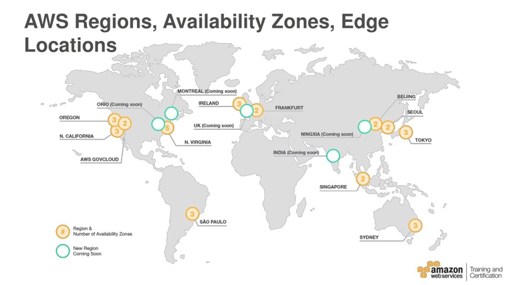
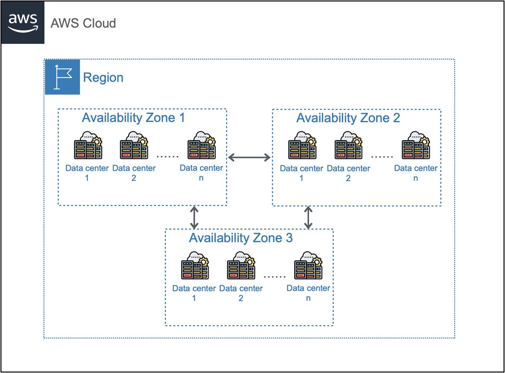
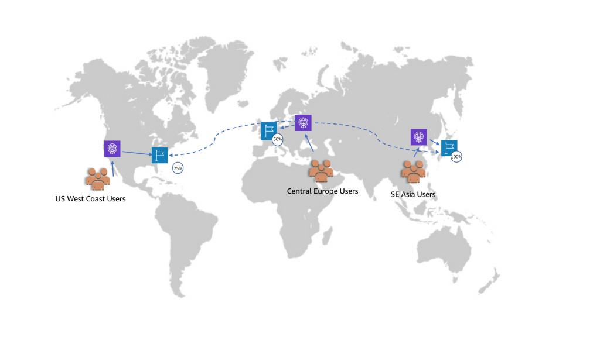

# AWS Global Infrastructure – Features and Characteristics

## What is AWS Global Infrastructure?





AWS Global Infrastructure is the worldwide network of AWS data centers, networking services, and edge locations that deliver AWS cloud services with high availability, low latency, scalability, and resilience.


It consists of:

* AWS Regions
* Availability Zones
* Edge Locations
* Regional Edge Caches
* AWS Global Network

---

## Key Components

## 1. AWS Regions

An AWS Region is a separate geographic area where AWS hosts multiple Availability Zones.

### Characteristics

* Physically isolated from other Regions
* Supports data residency and sovereignty requirements
* Each Region has independent power, cooling, and networking
* Enables disaster recovery across Regions
* Allows customers to deploy workloads closer to users

### Examples

* US East (N. Virginia)
* US East (Ohio)
* Europe (Ireland)
* Asia Pacific (Singapore)

### Best For

* Disaster recovery
* Regulatory compliance
* Latency optimization
* Global application deployment

---

## 2. Availability Zones

An Availability Zone is one or more physically separate data centers within an AWS Region.

### Characteristics

* Independent power
* Independent cooling
* Independent networking
* Connected using low-latency, high-bandwidth fiber links
* Designed to isolate failures from other AZs

Most AWS Regions have three or more Availability Zones.

### Best Practice

Deploy applications across at least two Availability Zones for high availability.

Example:

* Application Load Balancer across two AZs
* EC2 Auto Scaling group across two AZs
* Multi-AZ database deployment

---

## 3. Edge Locations

Edge Locations are AWS global sites that cache content closer to end users.

They are used by:

* Amazon CloudFront
* Amazon Route 53
* AWS Shield
* AWS Web Application Firewall

### Benefits

* Lower latency
* Faster content delivery
* Improved user experience
* DDoS protection
* Global DNS resolution

---

## 4. Regional Edge Caches

Regional Edge Caches sit between AWS Regions and Edge Locations.

### Benefits

* Larger cache capacity
* Reduced requests to the origin server
* Improved content delivery performance
* Better performance for frequently accessed content

---

## 5. AWS Global Network

AWS operates a global private network that connects AWS Regions, Availability Zones, and Edge Locations.

### Characteristics

* High bandwidth
* Low latency
* Redundant connectivity
* Secure AWS backbone
* Connects global AWS infrastructure

Unlike normal public internet traffic, AWS can route traffic across its private backbone to improve security, reliability, and performance.

---

# Key Features of AWS Global Infrastructure

## High Availability

AWS allows applications to be deployed across multiple Availability Zones.

Example architecture:

* Application Load Balancer in two AZs
* EC2 Auto Scaling across two AZs
* Multi-AZ RDS database

If one Availability Zone fails, the application can continue running in another Availability Zone.

---

## Fault Tolerance

AWS Global Infrastructure supports failure isolation at different levels:

* Server failure
* Rack failure
* Data center failure
* Availability Zone failure
* Region failure, if a multi-region design is used

---

## Low Latency

AWS helps reduce latency by allowing customers to:

* Choose Regions close to users
* Use CloudFront Edge Locations
* Use Route 53 latency-based routing
* Use AWS Global Accelerator

---

## Scalability

AWS infrastructure supports elastic scaling using services such as:

* Amazon EC2 Auto Scaling
* AWS Lambda
* Amazon Elastic Kubernetes Service
* Elastic Load Balancing
* Amazon CloudFront

---

## Disaster Recovery

AWS supports different disaster recovery strategies, including:

* Backup and Restore
* Pilot Light
* Warm Standby
* Multi-site Active/Active

Applications can replicate data between Regions to improve resilience and business continuity.

---

## Security

AWS Global Infrastructure is protected through:

* Physical data center security
* Network isolation
* Encryption at rest and in transit
* Identity and access management
* Compliance certifications
* DDoS protection
* Monitoring and logging services

---

## Global Load Balancing

Global traffic can be routed using:

* Amazon Route 53
* AWS Global Accelerator
* Amazon CloudFront

These services help route users to healthy, nearby, or optimized application endpoints.

---

# Characteristics Summary

| Characteristic     | Description                                                |
| ------------------ | ---------------------------------------------------------- |
| Global Presence    | AWS has multiple Regions around the world                  |
| Multiple AZs       | Each Region contains multiple isolated Availability Zones  |
| Fault Isolation    | Failure in one AZ generally does not affect others         |
| High-Speed Network | AWS private backbone connects global infrastructure        |
| Scalability        | Supports elastic cloud resource scaling                    |
| Low Latency        | Edge Locations reduce response time                        |
| High Availability  | Multi-AZ deployment improves uptime                        |
| Disaster Recovery  | Multi-Region replication supports business continuity      |
| Security           | Physical and logical security controls protect workloads   |
| Compliance         | Supports global regulatory and data residency requirements |

---

# Typical Enterprise Architecture

```text
                  Internet Users
                        |
                        v
             Amazon CloudFront
              Edge Locations
                        |
                        v
              AWS Global Network
              Private Backbone
                        |
      -------------------------------------
      |                                   |
      v                                   v
 Region A                            Region B
 Primary Region                      DR Region
 us-east-1                           us-west-2
      |                                   |
  -----------                         -----------
  |         |                         |         |
  v         v                         v         v
 AZ-1      AZ-2                      AZ-1      AZ-2
 EC2       EC2                       Standby   Replicas
 ALB       RDS                       EC2       Database
```

---

# Interview Questions and Sample Answers

## Q1: What is the difference between a Region and an Availability Zone?

A Region is a geographically isolated location that contains multiple Availability Zones. An Availability Zone is one or more physically separate data centers within a Region, each with independent power, cooling, and networking.

Regions provide geographic isolation and support disaster recovery. Availability Zones provide high availability within a Region.

---

## Q2: Why should applications be deployed across multiple Availability Zones?

Applications should be deployed across multiple Availability Zones to improve high availability and fault tolerance. If one Availability Zone fails, traffic can be routed to healthy resources in another Availability Zone with minimal disruption.

---

## Q3: What is the purpose of Edge Locations?

Edge Locations cache content closer to users to reduce latency and improve performance. They are used by services such as CloudFront, Route 53, AWS WAF, and AWS Shield.

---

## Q4: When should you use multiple AWS Regions?

Multiple AWS Regions should be used when an application requires disaster recovery, global availability, regulatory compliance, or low-latency access for users in different geographic locations.

---

## Q5: What AWS services help with global traffic routing?

AWS services used for global traffic routing include Amazon Route 53, AWS Global Accelerator, and Amazon CloudFront.

---

# Solution Architect Tips

For AWS Solutions Architect Associate and Professional exams, remember:

* Use multiple Availability Zones for high availability.
* Use multiple Regions for disaster recovery and global applications.
* Use CloudFront and Edge Locations to reduce latency.
* Use Route 53 or AWS Global Accelerator to route users to healthy endpoints.
* Keep data close to users while meeting compliance and data residency requirements.
* Design for fault isolation at the AZ and Region level.
* Use Multi-AZ databases for production workloads.
* Use Multi-Region replication for critical disaster recovery requirements.

---

# Key Takeaways

* AWS Global Infrastructure is built for availability, scalability, performance, and resilience.
* Regions provide geographic isolation.
* Availability Zones provide high availability within a Region.
* Edge Locations improve global performance.
* The AWS Global Network connects AWS infrastructure using a private backbone.
* Multi-AZ design is used for high availability.
* Multi-Region design is used for disaster recovery and global resilience.


