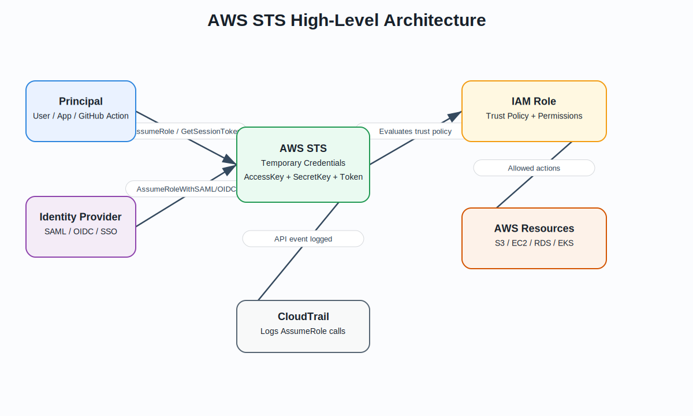
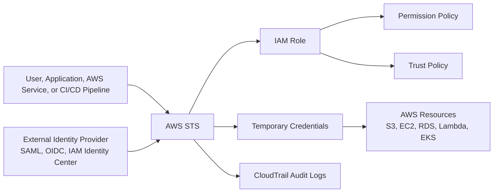
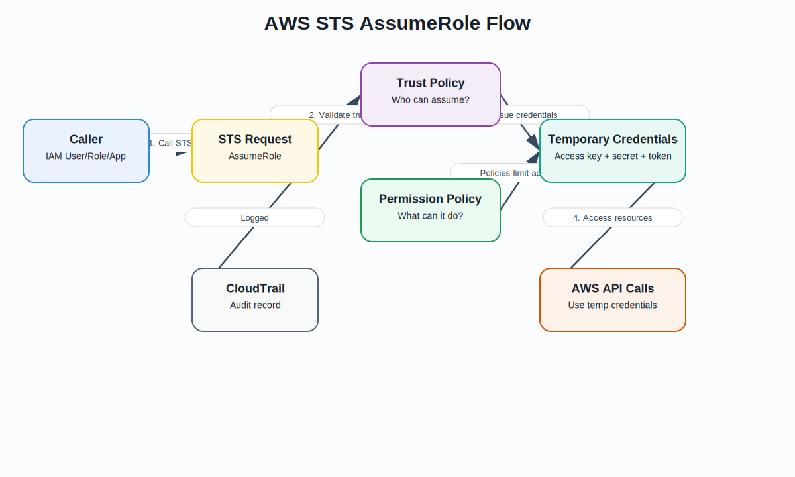
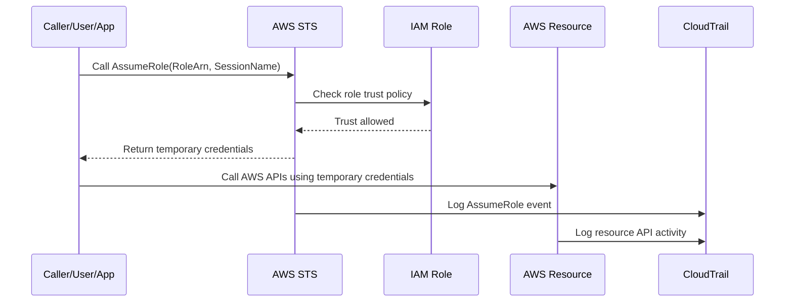
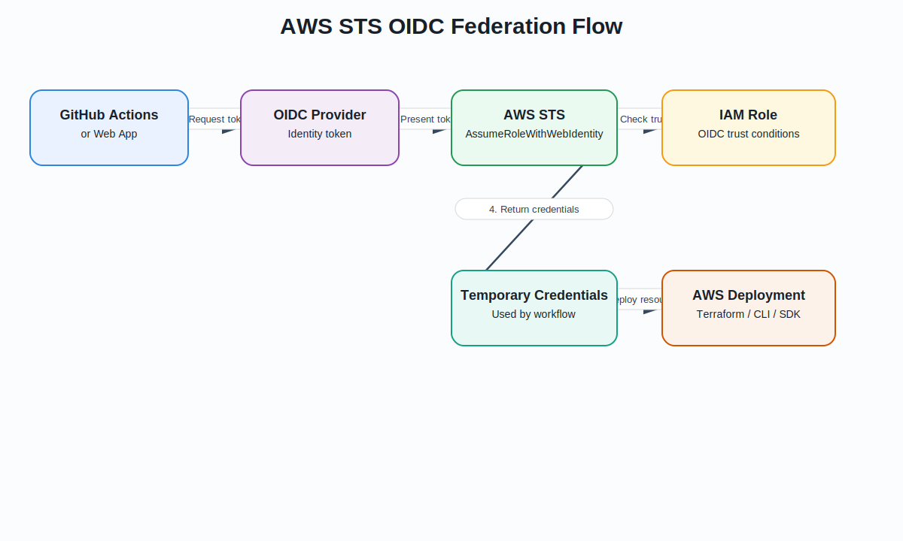
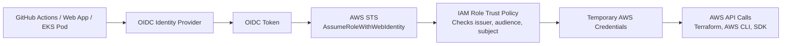
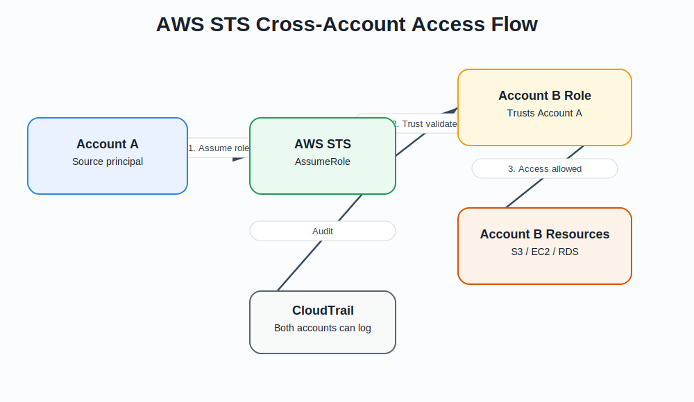
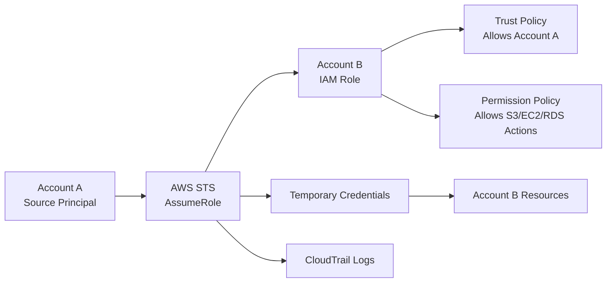
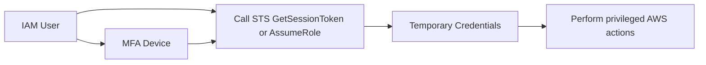

# AWS STS – Features and Characteristics

## What is AWS STS?

**AWS Security Token Service (AWS STS)** is the AWS service used to request **temporary security credentials** for trusted users, applications, services, and federated identities. These temporary credentials can be used to access AWS resources based on the permissions assigned to an IAM role or session. AWS describes STS as the service used to create and provide trusted users with temporary security credentials that can control access to AWS resources.  
Source: https://docs.aws.amazon.com/IAM/latest/UserGuide/id_credentials_temp.html

Temporary credentials normally include:

- **Access key ID**
- **Secret access key**
- **Session token**
- **Expiration time**

Unlike long-term IAM user access keys, STS credentials are **temporary**, automatically expire, and are commonly used for secure automation, cross-account access, federation, CI/CD pipelines, and AWS service roles.

---

## AWS STS Architecture Diagram





---

## Key Features of AWS STS

| Feature | Description |
|---|---|
| **Temporary credentials** | Provides short-lived credentials instead of permanent access keys. |
| **Role assumption** | Allows users, applications, AWS services, or external identities to assume IAM roles. |
| **Cross-account access** | Allows a principal in one AWS account to access resources in another AWS account through a trusted IAM role. |
| **Federation support** | Supports SAML and OIDC federation for enterprise identity providers and web identity providers. |
| **MFA support** | Can require MFA before temporary credentials are issued. |
| **Least privilege access** | Temporary credentials inherit only the permissions allowed by the role and optional session policy. |
| **Auditable access** | STS calls such as `AssumeRole` are recorded in AWS CloudTrail. |
| **Session tagging** | Tags can be passed into role sessions and used for ABAC authorization. |
| **No long-term secrets required** | Useful for GitHub Actions OIDC, applications, containers, Lambda, and EC2 instance roles. |
| **Regional endpoints** | STS can use regional endpoints to improve resiliency and reduce dependency on a global endpoint. |

---

## Characteristics of AWS STS

| Characteristic | Explanation |
|---|---|
| **Secure by design** | Credentials expire automatically, reducing the risk of leaked long-term keys. |
| **Identity broker** | STS acts as the broker that exchanges trusted identity proof for temporary AWS credentials. |
| **Policy-controlled** | Access is controlled by IAM trust policies, permission policies, session policies, SCPs, and permission boundaries. |
| **Common in automation** | Used heavily in CI/CD, Terraform pipelines, AWS CLI, SDKs, Lambda, ECS, EKS, and cross-account deployments. |
| **Supports federation** | Works with SAML, OIDC, and web identity providers. |
| **CloudTrail visible** | Helps security teams audit who assumed which role and when. |
| **Short-lived access** | Credentials expire after a defined duration instead of remaining valid permanently. |
| **Role-session based** | The resulting identity is an assumed-role session, not a permanent IAM user. |

---

## Common AWS STS API Operations

| STS Operation | Purpose | Common Use Case |
|---|---|---|
| **AssumeRole** | Returns temporary credentials for an IAM role. | Cross-account access, AWS automation, delegated access. |
| **AssumeRoleWithSAML** | Returns temporary credentials for users authenticated with SAML. | Enterprise SSO from Active Directory, Okta, Azure AD/Entra ID. |
| **AssumeRoleWithWebIdentity** | Returns temporary credentials for users authenticated with OIDC/web identity providers. | GitHub Actions OIDC, EKS IRSA, Cognito, Google, Facebook. |
| **GetSessionToken** | Returns temporary credentials for an IAM user, often with MFA. | Temporary CLI/API access with MFA. |
| **GetFederationToken** | Returns temporary credentials for a federated user. | Custom identity broker scenarios. |
| **GetCallerIdentity** | Returns details about the IAM identity making the request. | Troubleshooting AWS CLI identity and role assumption. |

`AssumeRole` returns temporary credentials that include an access key ID, secret access key, and session token.  
Source: https://docs.aws.amazon.com/STS/latest/APIReference/API_AssumeRole.html

---

## AWS STS AssumeRole Flow





### Explanation

1. A principal calls `AssumeRole`.
2. AWS STS checks whether the IAM role trust policy allows that principal.
3. If allowed, AWS STS issues temporary credentials.
4. The principal uses those credentials to call AWS services.
5. CloudTrail records the STS and resource-level API activity.

---

## AWS STS OIDC Federation Flow





### GitHub Actions OIDC Example

In GitHub Actions OIDC, the workflow receives an OIDC token from GitHub. AWS STS validates the token against the IAM role trust policy and issues temporary credentials. This avoids storing long-term AWS access keys in GitHub secrets.

Example use case:

```text
GitHub Actions → OIDC token → AWS STS → IAM Role → Temporary credentials → Terraform deploys AWS resources
```

---

## AWS STS Cross-Account Access Flow





### Cross-Account Example

A DevOps role in a tooling account can assume a deployment role in a workload account.

```text
Tooling Account Role → AssumeRole → Dev Account Deployment Role → Deploy resources in Dev Account
```

This is common in multi-account AWS environments using AWS Organizations, Control Tower, and centralized CI/CD tooling.

---

## Trust Policy vs Permission Policy

AWS STS depends heavily on IAM roles. A role usually has two important policy types:

| Policy Type | Purpose |
|---|---|
| **Trust policy** | Defines **who can assume the role**. |
| **Permission policy** | Defines **what the role can do** after it is assumed. |

AWS IAM documentation explains that a role trust policy specifies which trusted principals can assume the role, while permissions policies grant the needed permissions to perform actions on resources.  
Source: https://docs.aws.amazon.com/IAM/latest/UserGuide/id_roles.html

### Simple Example

```text
Trust policy: GitHub Actions can assume this role.
Permission policy: This role can deploy EC2, S3, IAM, and Lambda resources.
```

---

## Example Trust Policy for Cross-Account Access

```json
{
  "Version": "2012-10-17",
  "Statement": [
    {
      "Effect": "Allow",
      "Principal": {
        "AWS": "arn:aws:iam::111122223333:role/tooling-github-actions-role"
      },
      "Action": "sts:AssumeRole"
    }
  ]
}
```

Meaning:

```text
Allow the tooling account role to assume this role.
```

---

## Example Trust Policy for GitHub OIDC

```json
{
  "Version": "2012-10-17",
  "Statement": [
    {
      "Effect": "Allow",
      "Principal": {
        "Federated": "arn:aws:iam::123456789012:oidc-provider/token.actions.githubusercontent.com"
      },
      "Action": "sts:AssumeRoleWithWebIdentity",
      "Condition": {
        "StringEquals": {
          "token.actions.githubusercontent.com:aud": "sts.amazonaws.com"
        },
        "StringLike": {
          "token.actions.githubusercontent.com:sub": "repo:ORG_NAME/REPO_NAME:ref:refs/heads/main"
        }
      }
    }
  ]
}
```

Meaning:

```text
Only workflows from the allowed GitHub organization/repository/branch can assume the AWS role.
```

---

## AWS STS with MFA

AWS STS can be used with MFA to strengthen temporary access.

Example flow:



Common use cases:

- Requiring MFA before assuming an admin role.
- Requiring MFA before accessing production resources.
- Requiring MFA for sensitive IAM, KMS, or billing operations.

---

## AWS STS in Real-World Architectures

| Architecture | How STS Helps |
|---|---|
| **GitHub Actions to AWS** | Uses OIDC and `AssumeRoleWithWebIdentity` to deploy without long-term AWS keys. |
| **Terraform multi-account deployment** | Tooling account assumes deployment roles in dev, test, and prod accounts. |
| **EC2 instance role** | EC2 receives temporary credentials through the instance metadata service. |
| **EKS IRSA** | Kubernetes service accounts assume IAM roles using OIDC. |
| **Enterprise SSO** | SAML-authenticated users assume AWS roles. |
| **AWS Lambda execution role** | Lambda uses temporary credentials from its execution role to call AWS services. |
| **Cross-account security audit** | Security account assumes read-only audit roles in workload accounts. |

---

## STS and AWS CLI Example

```bash
aws sts assume-role \
  --role-arn arn:aws:iam::123456789012:role/demo-deployment-role \
  --role-session-name demo-session
```

The output includes temporary credentials:

```json
{
  "Credentials": {
    "AccessKeyId": "ASIA...",
    "SecretAccessKey": "...",
    "SessionToken": "...",
    "Expiration": "2026-06-30T18:00:00Z"
  }
}
```

To verify the current identity:

```bash
aws sts get-caller-identity
```

---

## Benefits of AWS STS

| Benefit | Explanation |
|---|---|
| **Reduces long-term credential risk** | Temporary credentials expire automatically. |
| **Improves security posture** | Reduces need for static IAM access keys. |
| **Supports least privilege** | Permissions are controlled through role policies and session policies. |
| **Enables secure automation** | CI/CD tools can assume roles securely. |
| **Supports multi-account AWS** | Tooling, security, and shared-services accounts can assume roles into workload accounts. |
| **Improves auditability** | CloudTrail records role assumption and API activity. |
| **Works with federation** | Supports SAML, OIDC, and web identity authentication. |

---

## Limitations and Considerations

| Area | Consideration |
|---|---|
| **Credential expiration** | Applications must refresh credentials before they expire. |
| **Trust policy risk** | A weak trust policy can allow unintended principals to assume a role. |
| **Over-permissioned roles** | STS is only as secure as the IAM role permissions it grants. |
| **Session duration** | Must be configured based on security and operational needs. |
| **CloudTrail review required** | Security teams should monitor unusual role assumptions. |
| **OIDC conditions matter** | For GitHub/OIDC, restrict trust by repository, branch, audience, and subject. |
| **SCPs still apply** | In AWS Organizations, service control policies can restrict what assumed roles can do. |

---

## Best Practices for AWS STS

1. Use IAM roles and STS instead of long-term IAM user access keys.
2. Use least privilege permission policies.
3. Restrict trust policies to specific principals.
4. For GitHub Actions OIDC, restrict by organization, repository, branch, and audience.
5. Use MFA for privileged role assumption.
6. Use short session durations for sensitive access.
7. Use CloudTrail to monitor `AssumeRole` activity.
8. Use `aws sts get-caller-identity` to troubleshoot identity issues.
9. Use regional STS endpoints where possible.
10. Combine STS with permission boundaries, SCPs, and IAM Access Analyzer.

---

## STS vs IAM User Access Keys

| Area | IAM User Access Keys | AWS STS Temporary Credentials |
|---|---|---|
| Credential type | Long-term | Short-term |
| Expiration | Does not expire automatically | Expires automatically |
| Security risk | Higher if leaked | Lower because credentials expire |
| Best use | Legacy or limited cases | Modern AWS access patterns |
| CI/CD use | Not recommended when OIDC is available | Recommended with OIDC/AssumeRole |
| Rotation | Must be manually rotated | Automatically refreshed by role/session flow |
| Auditability | User-based | Session-based with role/session name |

---

## Simple Interview Answer

**AWS STS, or Security Token Service, provides temporary security credentials that allow trusted users, applications, AWS services, or federated identities to access AWS resources. STS is commonly used with IAM roles for cross-account access, federation, CI/CD pipelines, EC2 instance roles, Lambda execution roles, and GitHub Actions OIDC. The main benefit is that it avoids long-term access keys by issuing short-lived credentials that automatically expire. Access is controlled by the role trust policy, permission policy, session policy, SCPs, and other IAM controls. STS activity is auditable through CloudTrail.**

---

## Simple Summary

| Concept | Meaning |
|---|---|
| **AWS STS** | Service that issues temporary AWS credentials. |
| **AssumeRole** | Used to assume an IAM role and receive temporary credentials. |
| **Trust policy** | Defines who can assume the role. |
| **Permission policy** | Defines what the assumed role can do. |
| **Session token** | Required part of temporary credentials. |
| **OIDC federation** | Lets external identities, such as GitHub Actions, access AWS without static keys. |
| **Cross-account access** | Lets one AWS account assume a role in another AWS account. |
| **CloudTrail** | Records STS API calls for auditing. |

---

## Repository Asset Paths

```text
assets/aws_sts/aws_sts_architecture.svg
assets/aws_sts/sts_assume_role_flow.svg
assets/aws_sts/sts_oidc_federation_flow.svg
assets/aws_sts/sts_cross_account_flow.svg
```
