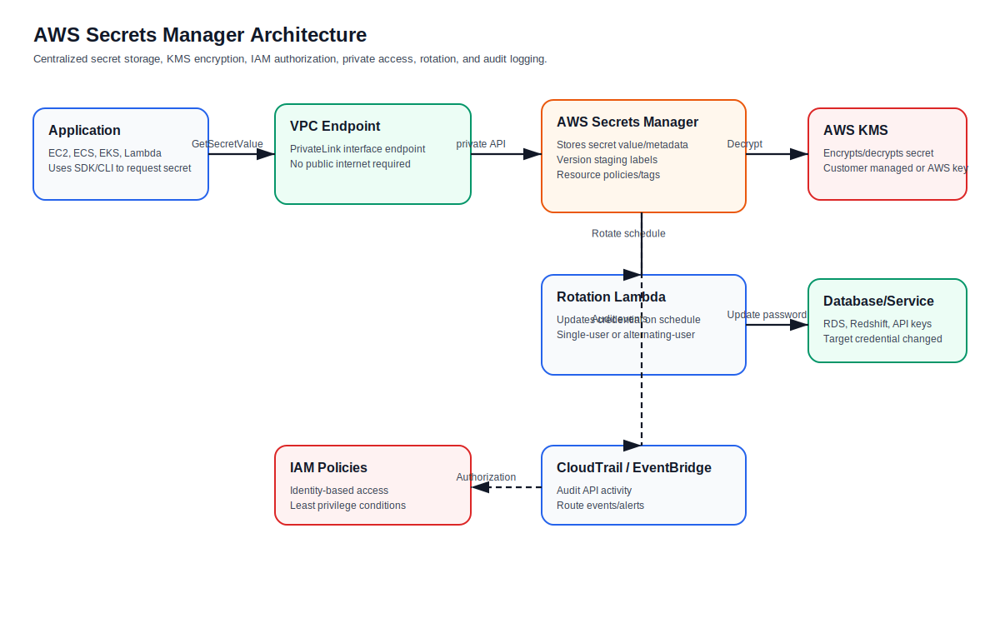
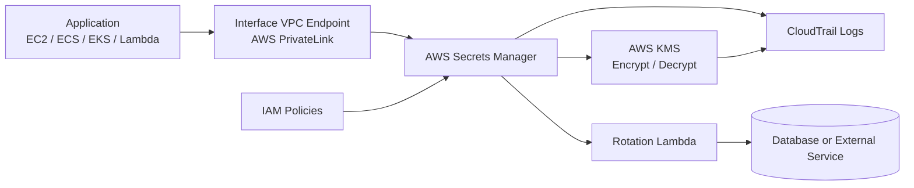
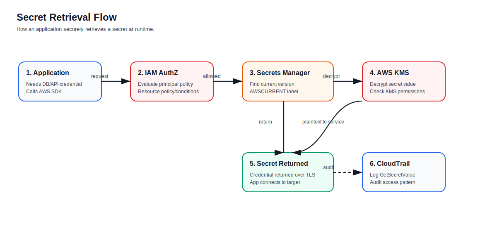
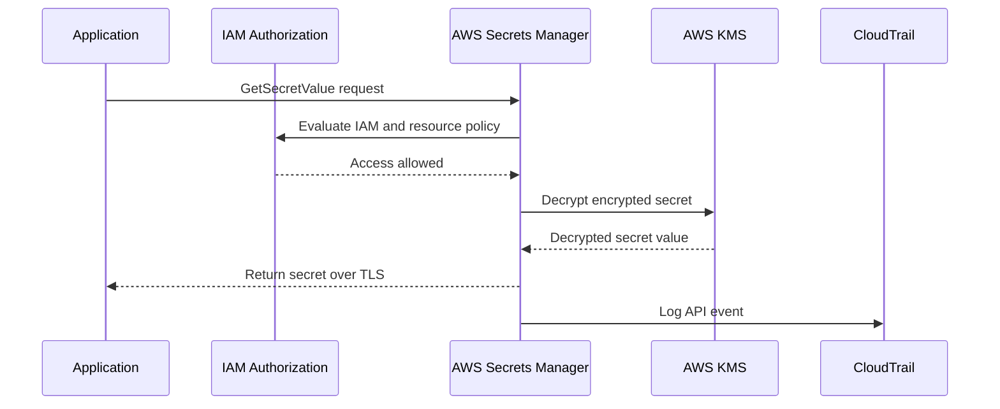
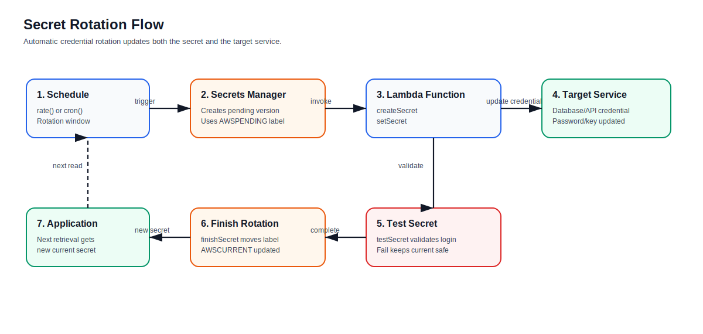
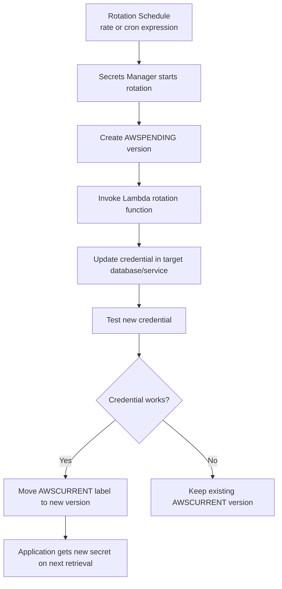
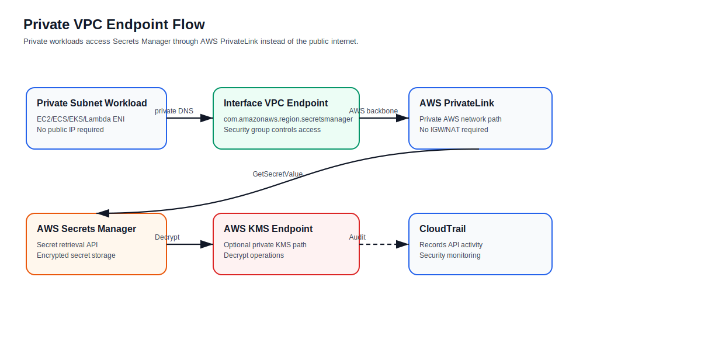
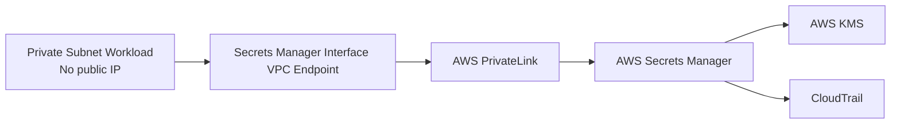
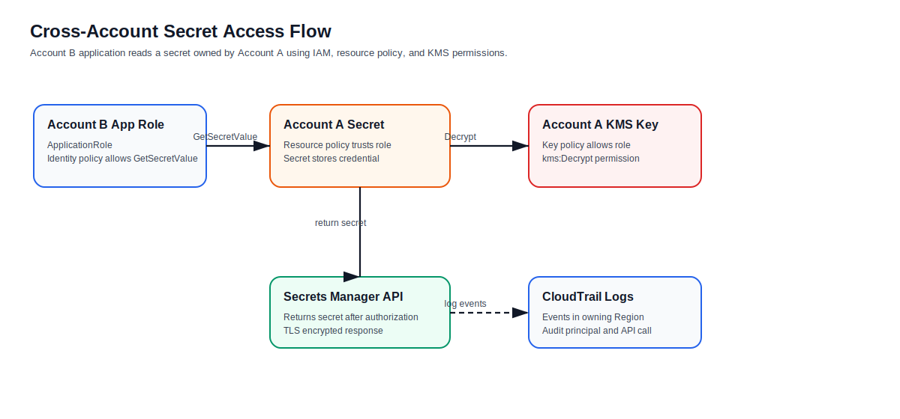
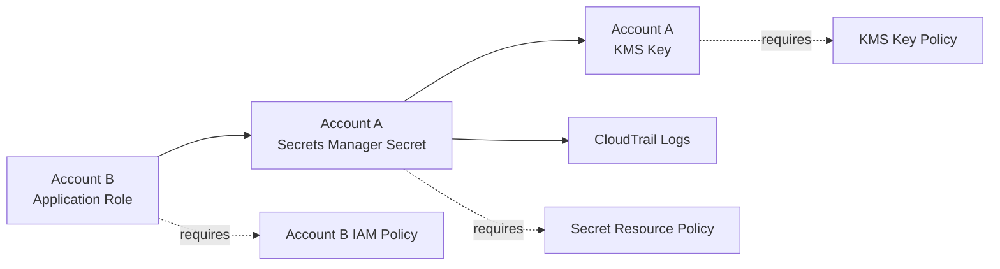

# AWS Secrets Manager — Features and Characteristics

## What is AWS Secrets Manager?

**AWS Secrets Manager** is a managed AWS security service used to store, retrieve, rotate, and manage secrets such as database passwords, API keys, OAuth tokens, application credentials, and third-party service credentials.

Instead of hardcoding secrets inside application code, configuration files, GitHub repositories, AMIs, container images, or CI/CD variables, applications retrieve secrets securely at runtime from Secrets Manager.

AWS Secrets Manager helps you:

- Protect sensitive credentials
- Rotate secrets automatically
- Encrypt secrets with AWS KMS
- Control access using IAM and resource policies
- Audit secret access using AWS CloudTrail
- Replicate secrets across Regions for multi-Region workloads
- Access secrets privately using VPC interface endpoints

---

## Why AWS Secrets Manager is Important

Hardcoded secrets are a major security risk. If credentials are stored in source code, Terraform files, Docker images, application config files, or shared documents, they can be leaked or reused by unauthorized users.

Secrets Manager solves this by separating secrets from the application and enforcing access through IAM, encryption, logging, and rotation.

---

## Core Features

| Feature | Description |
|---|---|
| **Centralized secret storage** | Stores database credentials, API keys, tokens, and application secrets in one managed service. |
| **Encryption with AWS KMS** | Secrets are encrypted using AWS managed keys or customer managed KMS keys. |
| **Automatic rotation** | Can rotate credentials on a schedule using managed rotation or Lambda rotation functions. |
| **Fine-grained access control** | Access is controlled using IAM identity policies, resource-based policies, KMS key policies, and condition keys. |
| **Version management** | Maintains multiple versions of a secret using staging labels such as `AWSCURRENT`, `AWSPREVIOUS`, and `AWSPENDING`. |
| **CloudTrail auditing** | Records Secrets Manager API activity for security investigation and compliance. |
| **Multi-Region replication** | Replicates secrets to other AWS Regions for regional applications and disaster recovery designs. |
| **Private VPC access** | Supports interface VPC endpoints using AWS PrivateLink so private workloads can access secrets without public internet. |
| **Cross-account access** | Supports resource policies that allow access from roles in other AWS accounts when KMS permissions are also configured. |
| **Integration with AWS services** | Commonly used with Lambda, ECS, EKS, EC2, RDS, Redshift, CodeBuild, and CI/CD pipelines. |

---

## Characteristics

| Characteristic | Explanation |
|---|---|
| **Managed service** | AWS manages the secret storage platform, availability, encryption integration, and API endpoints. |
| **Security-focused** | Designed to reduce credential exposure and support least-privilege access. |
| **Runtime retrieval** | Applications retrieve secrets when needed instead of storing them locally. |
| **Encrypted by default** | Secret values are encrypted using AWS KMS. |
| **Auditable** | Secret access and management events are logged in CloudTrail. |
| **Rotation-capable** | Supports automatic credential changes without redeploying application code. |
| **Regional service** | Secrets exist in a Region but can be replicated to other Regions. |
| **Policy-driven** | Access depends on IAM policies, resource policies, and KMS key permissions. |
| **API-based** | Applications retrieve secrets using AWS SDK, CLI, or API calls such as `GetSecretValue`. |
| **Production-ready** | Commonly used in enterprise, DevOps, cloud security, and regulated environments. |

---

## Architecture Diagram





---

## Secret Retrieval Flow





### Explanation

1. The application calls `GetSecretValue` using the AWS SDK or CLI.
2. AWS evaluates IAM identity policies, resource policies, conditions, and KMS permissions.
3. Secrets Manager retrieves the current secret version.
4. AWS KMS decrypts the secret value.
5. The application receives the secret securely over TLS.
6. CloudTrail records the API activity.

---

## Secret Rotation Flow





### Rotation Steps

Secrets Manager Lambda rotation commonly follows four steps:

| Step | Purpose |
|---|---|
| **createSecret** | Create a new pending secret value. |
| **setSecret** | Apply the new credential to the target database or service. |
| **testSecret** | Validate that the new credential works. |
| **finishSecret** | Mark the new version as `AWSCURRENT`. |

---

## Private VPC Endpoint Flow





### Why Use a VPC Endpoint?

Use a Secrets Manager VPC endpoint when private workloads need to retrieve secrets without using an internet gateway, NAT Gateway, VPN, or Direct Connect path.

Benefits:

- Keeps secret retrieval traffic private
- Reduces public internet exposure
- Supports private subnet workloads
- Allows endpoint security group controls
- Supports stronger enterprise network governance

---

## Cross-Account Secret Access Flow





### Cross-Account Requirements

To allow an application in **Account B** to read a secret in **Account A**, configure:

| Requirement | Where It Is Configured |
|---|---|
| IAM permission for `secretsmanager:GetSecretValue` | Account B application role policy |
| Secret resource policy | Account A secret |
| KMS decrypt permission | Account A KMS key policy or grant |
| Network access | Public AWS endpoint or VPC endpoint path |
| Auditing | CloudTrail in the relevant account/Region |

---

## Common Use Cases

| Use Case | Example |
|---|---|
| **Database credentials** | Store RDS PostgreSQL username and password. |
| **API keys** | Store third-party payment, messaging, or monitoring API keys. |
| **OAuth tokens** | Store application tokens used to call external APIs. |
| **CI/CD secrets** | Allow CodeBuild or GitHub OIDC-assumed roles to retrieve deployment secrets. |
| **Containerized apps** | ECS or EKS applications retrieve secrets at runtime. |
| **Serverless apps** | Lambda function retrieves database credentials before connecting to RDS. |
| **Multi-account apps** | Central security account stores secrets consumed by workload accounts. |
| **Multi-Region DR** | Replicate secrets to secondary Regions for disaster recovery. |

---

## Secrets Manager vs Systems Manager Parameter Store

| Area | Secrets Manager | SSM Parameter Store |
|---|---|---|
| Main purpose | Secret lifecycle management | Configuration and parameter storage |
| Secret rotation | Built-in rotation support | No native automatic rotation workflow like Secrets Manager |
| Cost | Usually higher | Standard parameters can be lower cost |
| Best for | Database passwords, API keys, credentials | App configs, environment variables, non-rotating parameters |
| Encryption | AWS KMS | AWS KMS for SecureString |
| Cross-account access | Resource policies supported | Possible but usually less feature-rich for secret lifecycle |
| Version labels | Uses staging labels | Uses parameter versions |

---

## Security Best Practices

1. **Do not hardcode secrets** in application code, Terraform files, Docker images, AMIs, or Git repositories.
2. **Use IAM roles** instead of long-term IAM user access keys.
3. **Grant least privilege** using only required actions such as `secretsmanager:GetSecretValue`.
4. **Restrict access by resource ARN** instead of using `Resource: "*"` when possible.
5. **Use customer managed KMS keys** when you need stronger control over encryption and key policies.
6. **Enable automatic rotation** for database and high-risk credentials.
7. **Use VPC endpoints** for private workloads that should not use public internet paths.
8. **Enable CloudTrail monitoring** for secret access and management events.
9. **Use resource policies carefully** for cross-account access.
10. **Use tagging standards** such as `Application`, `Environment`, `Owner`, `CostCenter`, and `DataClassification`.
11. **Prevent unauthorized secret deletion** using IAM controls, permission boundaries, SCPs, or change approval workflows.
12. **Avoid logging secret values** in application logs, Lambda logs, build output, or deployment logs.

---

## Example IAM Policy: Read One Secret

```json
{
  "Version": "2012-10-17",
  "Statement": [
    {
      "Effect": "Allow",
      "Action": [
        "secretsmanager:GetSecretValue",
        "secretsmanager:DescribeSecret"
      ],
      "Resource": "arn:aws:secretsmanager:us-east-1:123456789012:secret:prod/database/app-*"
    }
  ]
}
```

---

## Example IAM Policy: Tag-Based Secret Access

```json
{
  "Version": "2012-10-17",
  "Statement": [
    {
      "Effect": "Allow",
      "Action": [
        "secretsmanager:GetSecretValue",
        "secretsmanager:DescribeSecret"
      ],
      "Resource": "*",
      "Condition": {
        "StringEquals": {
          "aws:ResourceTag/Application": "payments",
          "aws:ResourceTag/Environment": "prod"
        }
      }
    }
  ]
}
```

---

## Example AWS CLI Commands

### Create a Secret

```bash
aws secretsmanager create-secret \
  --name prod/database/app \
  --description "Production app database credentials" \
  --secret-string '{"username":"appuser","password":"ChangeMe123!"}'
```

### Retrieve a Secret

```bash
aws secretsmanager get-secret-value \
  --secret-id prod/database/app \
  --query SecretString \
  --output text
```

### Enable Rotation

```bash
aws secretsmanager rotate-secret \
  --secret-id prod/database/app \
  --rotation-lambda-arn arn:aws:lambda:us-east-1:123456789012:function:rotate-db-secret \
  --rotation-rules AutomaticallyAfterDays=30
```

---

## Terraform Example

```hcl
resource "aws_kms_key" "secrets" {
  description             = "KMS key for application secrets"
  deletion_window_in_days = 30
  enable_key_rotation     = true
}

resource "aws_secretsmanager_secret" "db" {
  name        = "prod/database/app"
  description = "Production application database credentials"
  kms_key_id  = aws_kms_key.secrets.arn

  tags = {
    Application        = "payments"
    Environment        = "prod"
    DataClassification = "confidential"
  }
}

resource "aws_secretsmanager_secret_version" "db" {
  secret_id = aws_secretsmanager_secret.db.id
  secret_string = jsonencode({
    username = "appuser"
    password = "ChangeMe123!"
  })
}
```

---

## Interview Answer

**AWS Secrets Manager is a managed service for securely storing, retrieving, rotating, and auditing secrets such as database passwords, API keys, and OAuth tokens. It removes the need to hardcode credentials in applications or repositories. Secrets are encrypted with AWS KMS, access is controlled through IAM and resource policies, and API activity is logged in CloudTrail. Applications retrieve secrets at runtime using the AWS SDK or API. For production workloads, I would use least-privilege IAM roles, customer managed KMS keys where needed, automatic rotation, VPC endpoints for private access, CloudTrail monitoring, and tagging for governance.**

---

## Simple Summary

| Concept | Simple Meaning |
|---|---|
| **Secrets Manager** | Secure storage for passwords, keys, and tokens |
| **KMS** | Encrypts and decrypts secrets |
| **IAM** | Controls who can access secrets |
| **Rotation** | Automatically changes credentials on schedule |
| **CloudTrail** | Logs secret access and changes |
| **VPC Endpoint** | Allows private access from VPC workloads |
| **Replication** | Copies secrets to another AWS Region |
| **Best Practice** | Never hardcode secrets; retrieve them securely at runtime |

---

## References

- AWS Secrets Manager User Guide: What is AWS Secrets Manager?
- AWS Secrets Manager User Guide: Rotate secrets
- AWS Secrets Manager User Guide: Lambda rotation functions
- AWS Secrets Manager User Guide: Secret encryption and decryption
- AWS Secrets Manager User Guide: VPC endpoints
- AWS Secrets Manager User Guide: Cross-account access
- AWS Secrets Manager User Guide: CloudTrail logging
