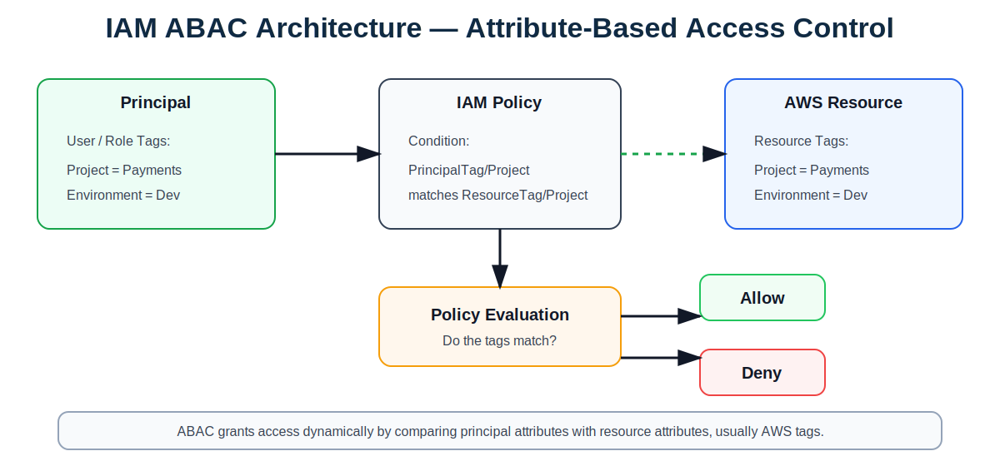
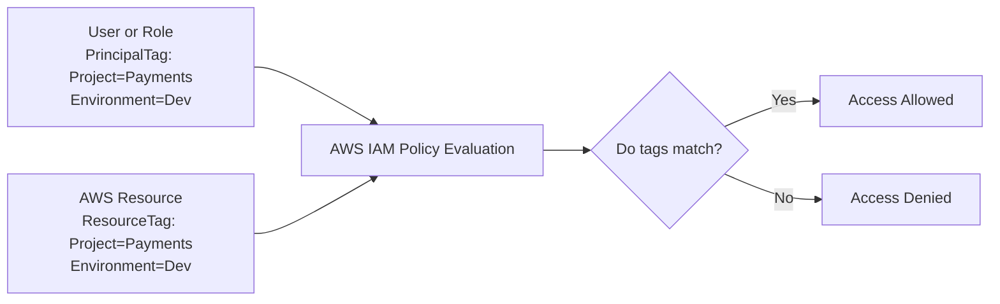
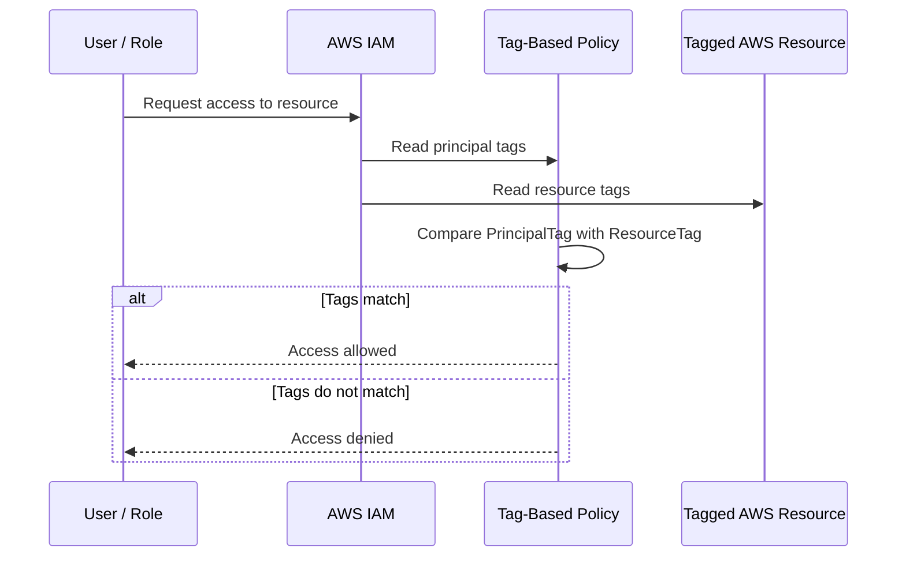

# IAM ABAC — Attribute-Based Access Control

## Overview

**ABAC (Attribute-Based Access Control)** grants access based on attributes. In AWS, these attributes are usually **tags** attached to IAM principals and AWS resources.

ABAC commonly compares:

- `aws:PrincipalTag` — tags on the user or role session
- `aws:ResourceTag` — tags on the AWS resource
- `aws:RequestTag` — tags passed during resource creation
- `aws:TagKeys` — tag keys allowed in a request

---

## ABAC Architecture Diagram





---

## ABAC Access Flow



---

## Key Features

| Feature | Description |
|---|---|
| **Attribute-based permissions** | Access is based on tags or identity attributes. |
| **Dynamic access** | Access changes when tags or attributes change. |
| **Highly scalable** | Reduces the need to create many project-specific roles. |
| **Fine-grained control** | Access can be controlled by project, environment, application, team, or cost center. |
| **Works well with IAM Identity Center** | Identity provider attributes can be passed into AWS sessions. |
| **Strong tagging required** | ABAC depends on consistent and protected tags. |

---

## Characteristics

| Characteristic | Explanation |
|---|---|
| **Tag-driven** | Access decisions depend on principal and resource tags. |
| **Dynamic** | Changing a tag can change access without editing the policy. |
| **Scalable for multi-account AWS** | Useful when many projects, teams, and accounts exist. |
| **More complex to design** | Requires clear tag standards and careful policy testing. |
| **Governance dependent** | Users must not be able to change sensitive access-control tags unless authorized. |

---

## Common ABAC Tags

| Tag Key | Example Value |
|---|---|
| **Project** | Payments |
| **Application** | CustomerPortal |
| **Environment** | Dev, Test, Prod |
| **Owner** | CloudOps |
| **CostCenter** | 1001 |
| **DataClassification** | Public, Internal, Confidential |

---

## Example ABAC Policy

This policy allows a principal to start and stop EC2 instances only when the principal's `Project` tag matches the EC2 instance's `Project` tag.

```json
{
  "Version": "2012-10-17",
  "Statement": [
    {
      "Effect": "Allow",
      "Action": [
        "ec2:StartInstances",
        "ec2:StopInstances"
      ],
      "Resource": "*",
      "Condition": {
        "StringEquals": {
          "aws:ResourceTag/Project": "${aws:PrincipalTag/Project}"
        }
      }
    }
  ]
}
```

---

## Example Decision

| Principal Tag | Resource Tag | Result |
|---|---|---|
| Project=Payments | Project=Payments | Access allowed |
| Project=Payments | Project=Claims | Access denied |
| Environment=Dev | Environment=Dev | Access allowed |
| Environment=Dev | Environment=Prod | Access denied |

---

## When to Use ABAC

Use ABAC when:

- You manage many AWS accounts.
- You have many projects or applications.
- You want to reduce role sprawl.
- Users move between teams or projects often.
- You need access based on environment, project, owner, or cost center.
- You use IAM Identity Center with identity provider attributes.

---

## Best Practices

1. Define mandatory tag keys before implementing ABAC.
2. Protect sensitive tags such as `Project`, `Environment`, and `DataClassification`.
3. Use `aws:RequestTag` and `aws:TagKeys` to control tagging during resource creation.
4. Use AWS Organizations tag policies for tagging consistency.
5. Combine ABAC with SCPs to prevent risky actions.
6. Test policies carefully in non-production accounts first.
7. Monitor access decisions using CloudTrail.
8. Use IAM Access Analyzer to validate policies.

---

## Interview Summary

**ABAC grants AWS access based on attributes, usually tags. For example, a user or role tagged `Project=Payments` can access resources tagged `Project=Payments`. ABAC is more scalable than RBAC in large multi-account environments because one policy can dynamically support many teams, projects, and environments. The main requirement is strong tag governance.**
