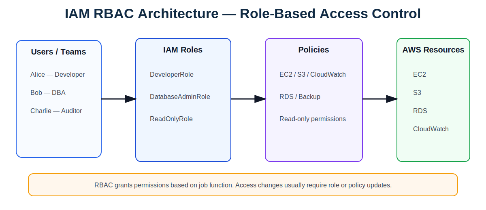
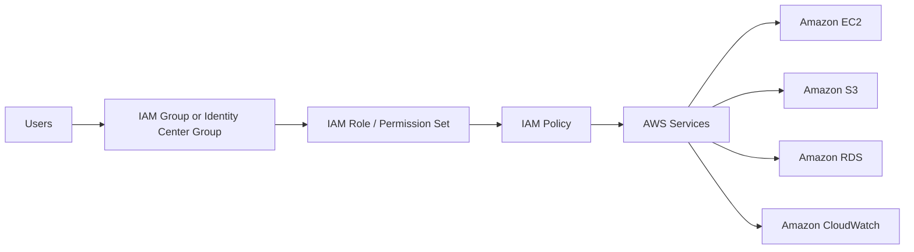
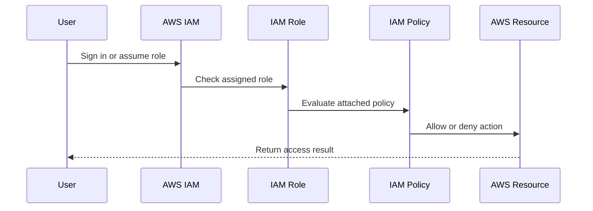

# IAM RBAC — Role-Based Access Control

## Overview

**RBAC (Role-Based Access Control)** grants access based on a user's job role, team, or responsibility. In AWS, RBAC is commonly implemented with IAM roles, IAM groups, IAM policies, and IAM Identity Center permission sets.

---

## RBAC Architecture Diagram





---

## RBAC Access Flow



---

## Key Features

| Feature | Description |
|---|---|
| **Role-based permissions** | Access is assigned according to job function. |
| **Simple to understand** | Permissions map directly to roles such as Developer, DBA, Auditor, or Admin. |
| **Uses IAM roles and policies** | Permissions are attached to roles, groups, or permission sets. |
| **Good for common access patterns** | Works well for admin, read-only, developer, security, and database roles. |
| **Supports least privilege** | Each role should only include permissions required for that job function. |
| **Easy to audit** | Security teams can review each role and its permissions. |

---

## Characteristics

| Characteristic | Explanation |
|---|---|
| **Static** | Access usually changes when the role or policy is updated. |
| **Job-function driven** | Access is based on responsibility, not resource attributes. |
| **Best for small and medium environments** | Easy to manage when the number of roles is limited. |
| **Can create role sprawl** | Large environments may require many roles for different projects and environments. |
| **Common enterprise model** | Often used with IAM Identity Center and AWS Organizations. |

---

## Example Roles

| Role | Typical Permissions |
|---|---|
| **DeveloperRole** | Access to development EC2, S3, CloudWatch, and deployment tools. |
| **DatabaseAdminRole** | Access to RDS, backups, snapshots, and database monitoring. |
| **SecurityAuditRole** | Read access to CloudTrail, Config, GuardDuty, Security Hub, and IAM Access Analyzer. |
| **ReadOnlyRole** | View resources without making changes. |
| **CloudAdminRole** | Administrative access for cloud platform teams. |

---

## Example IAM Policy

This policy allows a role to describe, start, and stop EC2 instances.

```json
{
  "Version": "2012-10-17",
  "Statement": [
    {
      "Effect": "Allow",
      "Action": [
        "ec2:DescribeInstances",
        "ec2:StartInstances",
        "ec2:StopInstances"
      ],
      "Resource": "*"
    }
  ]
}
```

---

## When to Use RBAC

Use RBAC when:

- Your users have clear job functions.
- Access requirements are stable.
- You need simple access reviews.
- You are building standard roles such as Admin, Developer, Auditor, or ReadOnly.
- Your environment does not require highly dynamic tag-based access.

---

## Best Practices

1. Use IAM roles instead of long-term IAM users.
2. Use IAM Identity Center for workforce access.
3. Apply least privilege to every role.
4. Avoid broad `AdministratorAccess` unless truly required.
5. Use permission boundaries for delegated administration.
6. Review unused roles and permissions regularly.
7. Use CloudTrail and IAM Access Analyzer for audit and review.
8. Combine RBAC with SCP guardrails in AWS Organizations.

---

## Interview Summary

**RBAC grants AWS access based on a user's role or job function. For example, developers assume a DeveloperRole, database engineers assume a DatabaseAdminRole, and auditors assume a ReadOnlyRole. RBAC is simple, easy to audit, and good for common enterprise roles, but it can become difficult to manage at scale if too many roles are created for every project and environment.**
