# AWS KMS — Features and Characteristics

## What is AWS KMS?

**AWS Key Management Service (AWS KMS)** is a managed AWS security service used to create, manage, protect, and control cryptographic keys for encrypting and signing data. KMS keys are protected by AWS-managed hardware security modules, and AWS states that KMS keys do not leave AWS KMS unencrypted. AWS KMS integrates with many AWS services such as Amazon S3, EBS, RDS, EFS, Lambda, CloudWatch Logs, and Secrets Manager.

AWS KMS is commonly used for:

- Encrypting data at rest
- Managing customer managed keys
- Enforcing encryption governance
- Supporting envelope encryption
- Protecting secrets and database credentials
- Auditing key usage through AWS CloudTrail
- Enabling cross-account and multi-Region encryption patterns

---

## 1. Core Features of AWS KMS

| Feature | Description |
|---|---|
| **Managed key service** | AWS manages the highly available key management infrastructure. |
| **KMS keys** | Logical key resources used for encryption, decryption, signing, verification, and generating data keys. |
| **Customer managed keys** | Keys created and controlled by the customer, including policies, aliases, rotation, tags, and deletion schedule. |
| **AWS managed keys** | Keys created, managed, and rotated by AWS services on behalf of customers. |
| **AWS owned keys** | Keys owned and managed by AWS for internal service encryption; customers do not manage them directly. |
| **Envelope encryption** | KMS protects data keys, while data keys encrypt the actual application data. |
| **Key policies** | Resource-based policies that control who can administer or use a KMS key. |
| **IAM policy integration** | IAM policies can allow access when the KMS key policy permits it. |
| **Grants** | Temporary or delegated permissions for AWS services or principals to use a KMS key. |
| **Aliases** | Friendly names such as `alias/app-prod-key` that point to KMS keys. |
| **Automatic rotation** | AWS KMS can rotate key material for eligible customer managed keys. |
| **CloudTrail auditing** | KMS API activity such as `Encrypt`, `Decrypt`, and `GenerateDataKey` can be logged. |
| **Multi-Region keys** | Related KMS keys with the same key ID and key material in different AWS Regions. |

---

## 2. AWS KMS Architecture Diagram

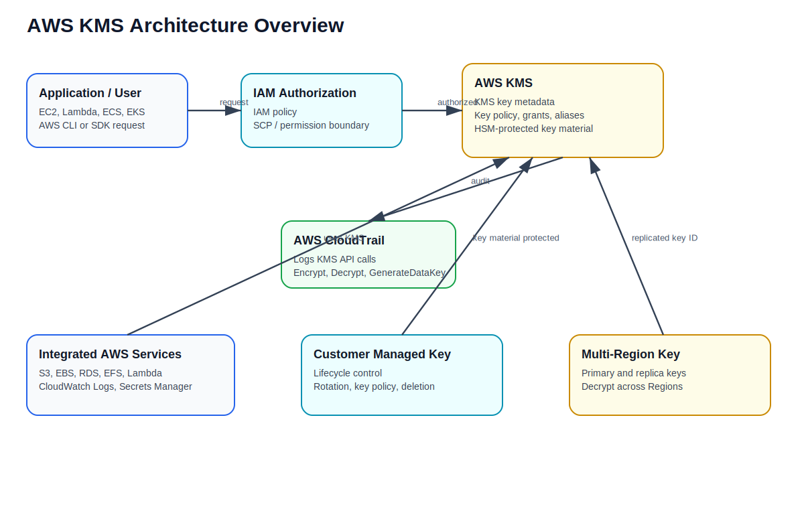

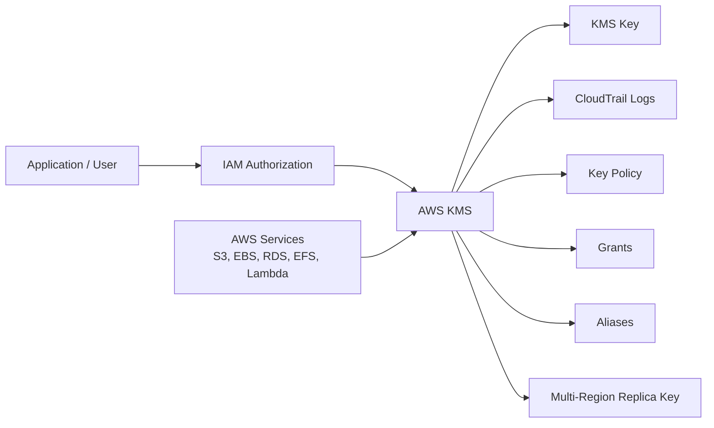

### Architecture Explanation

1. The application, AWS service, or user sends a request to AWS KMS.
2. IAM policies, key policies, grants, and optional conditions are evaluated.
3. AWS KMS performs cryptographic operations using protected key material.
4. AWS services use KMS to encrypt data at rest.
5. AWS CloudTrail records key usage and administrative activity.

---

## 3. Characteristics of AWS KMS

### 3.1 Secure Key Protection

AWS KMS keys are protected by hardware security modules. Applications do not directly retrieve the KMS key material. Instead, applications call KMS APIs such as `Encrypt`, `Decrypt`, or `GenerateDataKey`.

### 3.2 Centralized Key Management

KMS provides a central place to create, disable, rotate, tag, audit, and delete keys.

### 3.3 Integration with AWS Services

Many AWS services integrate with KMS for encryption at rest, including:

- Amazon S3
- Amazon EBS
- Amazon RDS and Aurora
- Amazon EFS
- Amazon DynamoDB
- Amazon Redshift
- AWS Lambda environment variables
- Amazon CloudWatch Logs
- AWS Secrets Manager
- Amazon SQS and SNS

### 3.4 Policy-Based Access Control

KMS authorization can include:

- Key policies
- IAM identity policies
- Grants
- Service control policies
- Permission boundaries
- Condition keys

### 3.5 Strong Auditing

CloudTrail can record KMS management and usage events, which helps with security investigations, compliance reviews, and detecting unusual decrypt activity.

### 3.6 Supports Encryption Context

An **encryption context** is additional authenticated data used with KMS cryptographic operations. It helps bind ciphertext to a specific purpose, such as an application name, database ID, or S3 object path. Do not place secrets or sensitive values in the encryption context because it can appear in CloudTrail logs.

### 3.7 Supports Cross-Account Access

A KMS key can be used by principals in another AWS account when both the key policy and the caller-side IAM policy allow the action.

### 3.8 Supports Multi-Region Keys

Multi-Region keys are useful when an application needs to encrypt data in one Region and decrypt it in another Region without a cross-Region KMS call.

---

## 4. AWS KMS Key Types

| Key Type | Managed By | Visibility | Common Use Case |
|---|---|---|---|
| **Customer managed key** | Customer | Visible and configurable | Production applications, compliance, custom access control |
| **AWS managed key** | AWS service | Visible in customer account | Simple service-level encryption, such as default service encryption |
| **AWS owned key** | AWS | Not managed by customer | AWS internal encryption |
| **Multi-Region key** | Customer or AWS-supported pattern | Visible as primary and replica keys | Disaster recovery, global applications, multi-Region workloads |
| **Imported key material** | Customer supplies key material | Customer controls source material | Bring your own key material requirements |

---

## 5. Envelope Encryption Flow

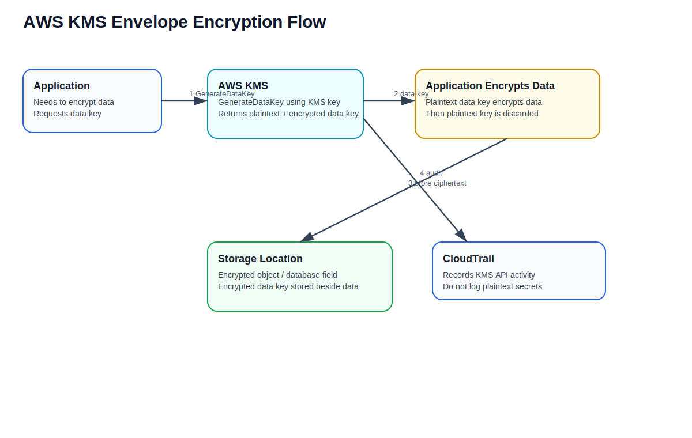

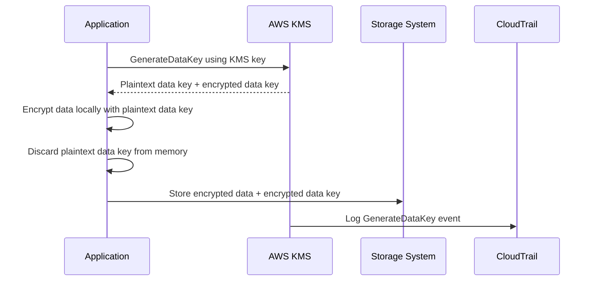

### Explanation

Envelope encryption uses two layers of keys:

1. **KMS key** protects the data key.
2. **Data key** encrypts the actual application data.

This approach is efficient because KMS does not need to encrypt large data payloads directly. Instead, KMS generates and protects data keys.

---

## 6. Decryption Flow

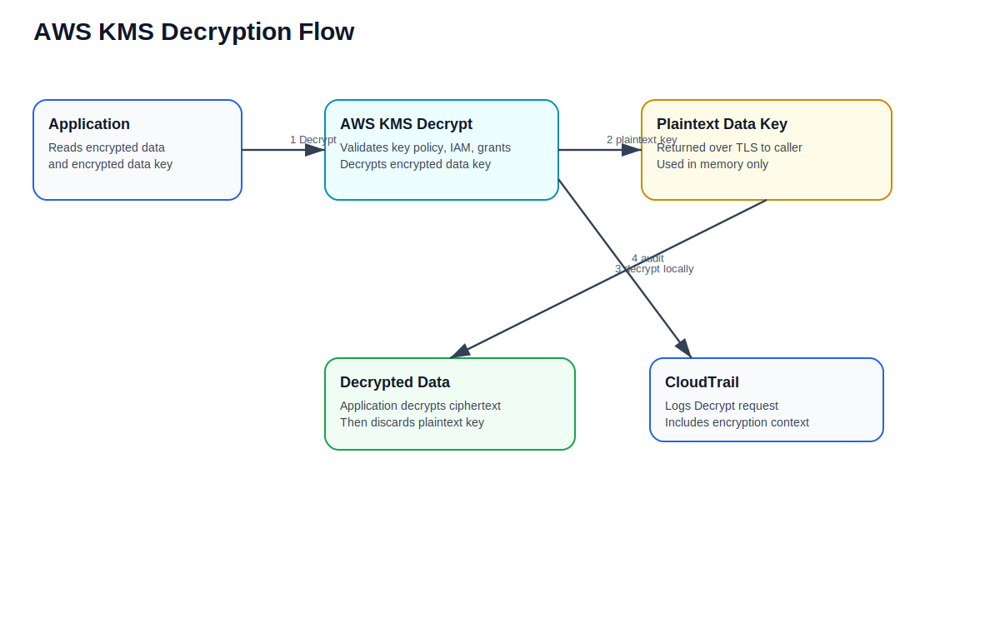

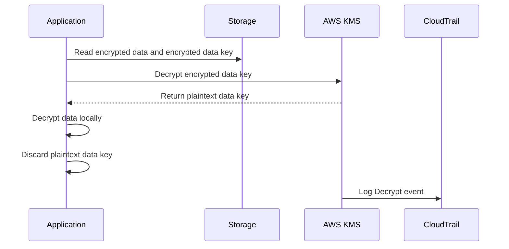

### Explanation

During decryption, the application sends the encrypted data key to KMS. If the caller is authorized, KMS returns the plaintext data key. The application then decrypts the data locally and discards the plaintext data key.

---

## 7. KMS Key Rotation Flow

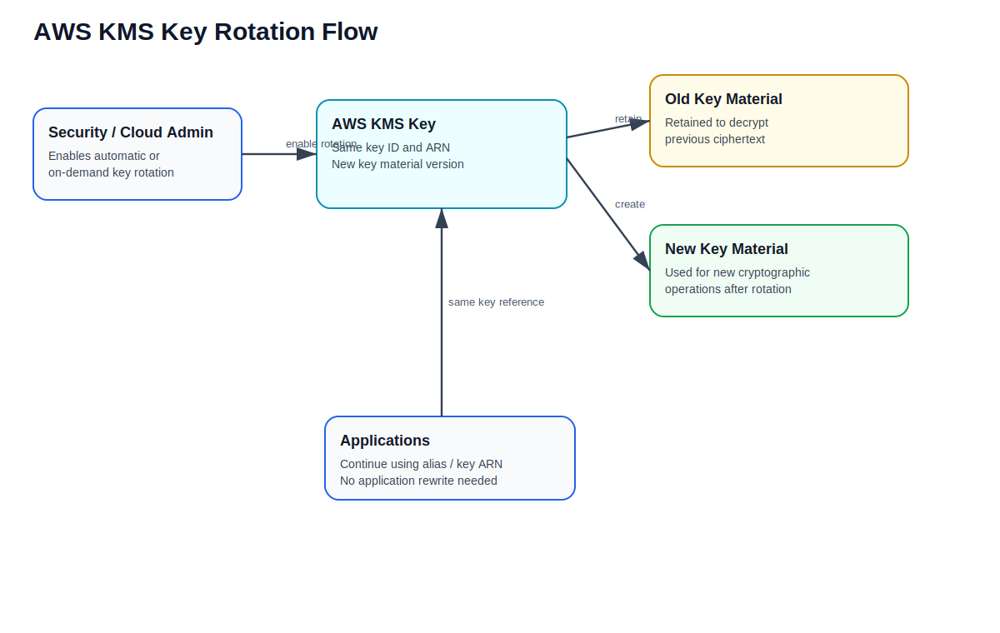

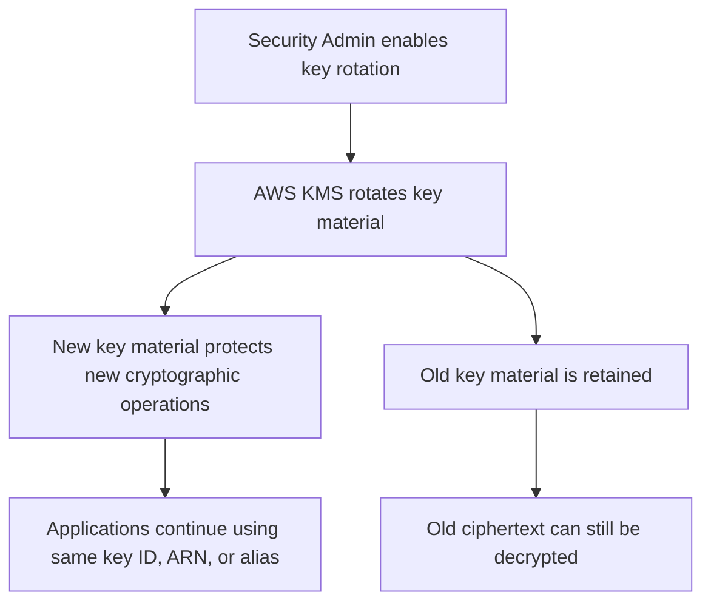

### Rotation Characteristics

- Automatic key rotation changes the key material, not the key ID or ARN.
- Old key material is retained so old ciphertext remains decryptable.
- Applications can continue using the same key alias or key ARN.
- Rotation is important for compliance and cryptographic hygiene.

---

## 8. Cross-Account KMS Access Flow

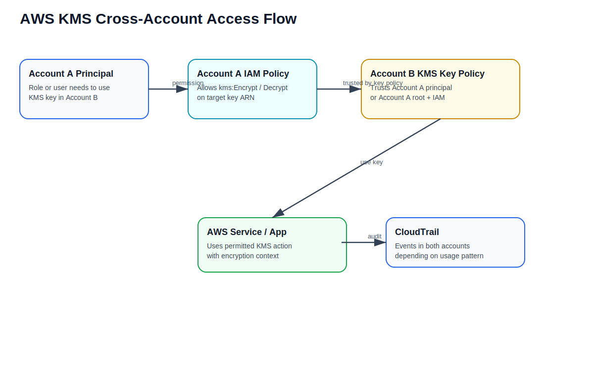

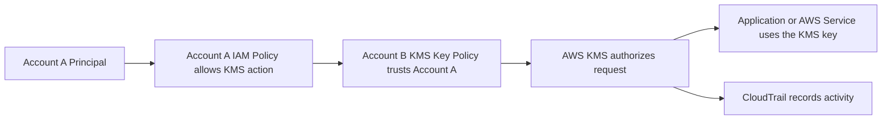

### Cross-Account Requirements

For cross-account KMS access, both sides must be configured correctly:

1. The KMS key policy in the key-owning account must trust the external principal or account.
2. The caller's IAM policy must allow the required KMS action on the target key ARN.
3. Optional conditions can restrict usage by service, encryption context, VPC endpoint, organization ID, or account ID.

---

## 9. Important KMS Concepts

### KMS Key

A KMS key is the primary resource in AWS KMS. It contains key metadata, key ID, key policy, key state, creation date, origin, usage, and other configuration details.

### Key Policy

A key policy is the primary access control mechanism for a KMS key. Every KMS key must have exactly one key policy.

### IAM Policy

IAM policies can allow users, roles, or services to use KMS keys, but only when the key policy allows IAM policies to grant access.

### Grants

A grant is a policy instrument that gives a principal permission to use a KMS key. Grants are commonly used by AWS services that need temporary or delegated access to a key.

### Alias

An alias is a friendly name for a KMS key, such as:

```text
alias/prod/app-key
alias/dev/database-key
alias/security/logging-key
```

Aliases make application configuration easier because an alias can be repointed to a different key without changing the application reference.

### Encryption Context

Encryption context is additional authenticated data passed to KMS operations. It is not encrypted and can be logged, so it should not contain sensitive values.

---

## 10. Common AWS KMS API Operations

| API Operation | Purpose |
|---|---|
| `CreateKey` | Creates a KMS key. |
| `Encrypt` | Encrypts small plaintext data directly with a KMS key. |
| `Decrypt` | Decrypts ciphertext or encrypted data keys. |
| `GenerateDataKey` | Generates a plaintext data key and encrypted copy of the data key. |
| `GenerateDataKeyWithoutPlaintext` | Generates only an encrypted data key. |
| `ReEncrypt` | Decrypts and re-encrypts data under another KMS key without exposing plaintext outside KMS. |
| `CreateAlias` | Creates a friendly name for a KMS key. |
| `EnableKeyRotation` | Enables automatic key rotation for eligible keys. |
| `CreateGrant` | Creates delegated permissions for a principal or AWS service. |
| `ScheduleKeyDeletion` | Schedules a KMS key for deletion after a waiting period. |

---

## 11. Example KMS Key Policy

This example allows the account root to administer the key and allows a specific application role to use the key for encryption and decryption.

```json
{
  "Version": "2012-10-17",
  "Statement": [
    {
      "Sid": "EnableAccountAdministration",
      "Effect": "Allow",
      "Principal": {
        "AWS": "arn:aws:iam::111122223333:root"
      },
      "Action": "kms:*",
      "Resource": "*"
    },
    {
      "Sid": "AllowApplicationRoleUseOfKey",
      "Effect": "Allow",
      "Principal": {
        "AWS": "arn:aws:iam::111122223333:role/app-prod-role"
      },
      "Action": [
        "kms:Encrypt",
        "kms:Decrypt",
        "kms:GenerateDataKey",
        "kms:DescribeKey"
      ],
      "Resource": "*"
    }
  ]
}
```

---

## 12. Example IAM Policy for KMS Usage

```json
{
  "Version": "2012-10-17",
  "Statement": [
    {
      "Effect": "Allow",
      "Action": [
        "kms:Encrypt",
        "kms:Decrypt",
        "kms:GenerateDataKey",
        "kms:DescribeKey"
      ],
      "Resource": "arn:aws:kms:us-east-1:111122223333:key/12345678-1234-1234-1234-123456789012"
    }
  ]
}
```

---

## 13. Example Least-Privilege Condition with `kms:ViaService`

Use `kms:ViaService` when you want a principal to use a KMS key only through a specific AWS service, such as S3 or RDS.

```json
{
  "Effect": "Allow",
  "Action": [
    "kms:Encrypt",
    "kms:Decrypt",
    "kms:GenerateDataKey"
  ],
  "Resource": "arn:aws:kms:us-east-1:111122223333:key/12345678-1234-1234-1234-123456789012",
  "Condition": {
    "StringEquals": {
      "kms:ViaService": "s3.us-east-1.amazonaws.com"
    }
  }
}
```

---

## 14. KMS Use Cases

| Use Case | Example |
|---|---|
| **S3 encryption** | Encrypt objects with SSE-KMS. |
| **EBS encryption** | Encrypt EC2 block volumes. |
| **RDS encryption** | Encrypt database storage, snapshots, and replicas. |
| **Secrets Manager encryption** | Encrypt secret values. |
| **Lambda environment variables** | Protect application configuration secrets. |
| **CloudWatch Logs encryption** | Encrypt log groups with customer managed keys. |
| **Cross-account sharing** | Allow a central security account key to be used by workload accounts. |
| **Multi-Region DR** | Use multi-Region keys for failover and replicated encrypted data. |
| **Client-side encryption** | Use AWS Encryption SDK with KMS-managed wrapping keys. |

---

## 15. Best Practices

1. Use customer managed keys when you need full control over policy, rotation, tags, and lifecycle.
2. Use least privilege in both key policies and IAM policies.
3. Separate key administrators from key users.
4. Enable automatic key rotation where supported and required.
5. Use aliases instead of hardcoding key IDs in application configuration.
6. Use `kms:ViaService` to restrict usage through approved AWS services.
7. Use encryption context for stronger authorization and audit traceability.
8. Do not put secrets in encryption context because it can be logged.
9. Monitor KMS API activity with CloudTrail.
10. Avoid scheduling key deletion unless you are certain the key is no longer required.
11. Use multi-Region keys only when there is a real multi-Region application or disaster recovery requirement.
12. Use separate keys for different environments such as dev, test, and production.
13. Tag KMS keys with `Application`, `Environment`, `Owner`, `CostCenter`, and `DataClassification`.

---

## 16. KMS vs Secrets Manager vs IAM

| Service | Primary Purpose |
|---|---|
| **AWS KMS** | Create and manage encryption keys. |
| **AWS Secrets Manager** | Store, retrieve, rotate, and manage secrets. |
| **AWS IAM** | Control who can access AWS resources. |

Simple relationship:

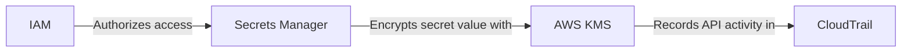

---

## 17. Common Interview Answer

**AWS KMS is a managed key management service used to create, control, rotate, and audit encryption keys for AWS workloads. It integrates with services like S3, EBS, RDS, Lambda, CloudWatch Logs, and Secrets Manager. KMS supports customer managed keys, AWS managed keys, aliases, key policies, IAM policies, grants, encryption context, envelope encryption, automatic rotation, CloudTrail auditing, cross-account usage, and multi-Region keys. In production, I would use customer managed keys with least-privilege key policies, aliases, automatic rotation where supported, CloudTrail monitoring, and conditions such as `kms:ViaService` to restrict how the key can be used.**

---

## 18. Simple Summary

| Concept | Simple Meaning |
|---|---|
| **KMS** | AWS service for managing encryption keys. |
| **KMS key** | Logical key resource used to protect data. |
| **Customer managed key** | Key controlled by the customer. |
| **AWS managed key** | Key managed by AWS service for customer data. |
| **Key policy** | Main policy that controls access to a KMS key. |
| **Grant** | Temporary/delegated permission to use a KMS key. |
| **Alias** | Friendly name for a KMS key. |
| **Envelope encryption** | Data key encrypts data; KMS key protects the data key. |
| **Encryption context** | Extra authenticated data for audit and authorization. |
| **Multi-Region key** | Related keys in different Regions with same key ID and key material. |

---

## References

- AWS KMS Developer Guide: https://docs.aws.amazon.com/kms/latest/developerguide/overview.html
- AWS KMS keys: https://docs.aws.amazon.com/kms/latest/developerguide/concepts.html
- Key policies in AWS KMS: https://docs.aws.amazon.com/kms/latest/developerguide/key-policies.html
- Grants in AWS KMS: https://docs.aws.amazon.com/kms/latest/developerguide/grants.html
- AWS KMS cryptography and envelope encryption: https://docs.aws.amazon.com/kms/latest/developerguide/kms-cryptography.html
- Multi-Region keys in AWS KMS: https://docs.aws.amazon.com/kms/latest/developerguide/multi-region-keys-overview.html
- AWS KMS key rotation: https://docs.aws.amazon.com/kms/latest/developerguide/rotate-keys.html
- AWS KMS encryption context: https://docs.aws.amazon.com/kms/latest/developerguide/encrypt_context.html
