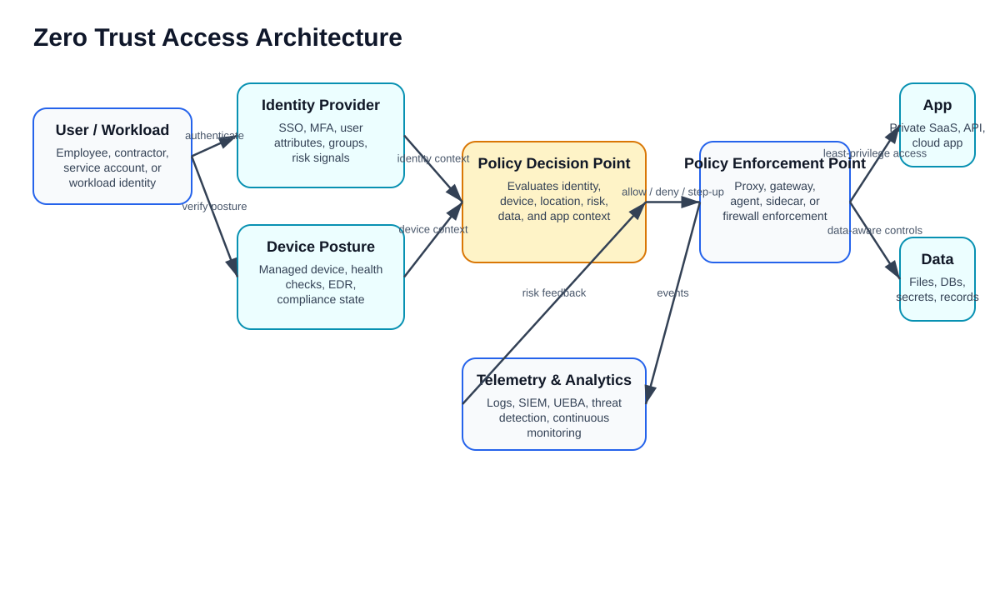
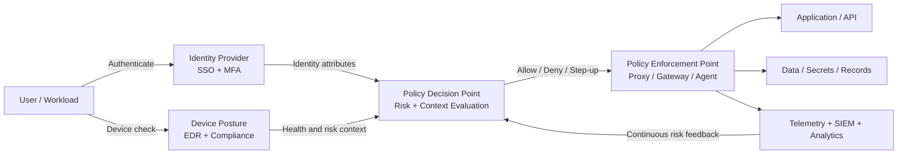
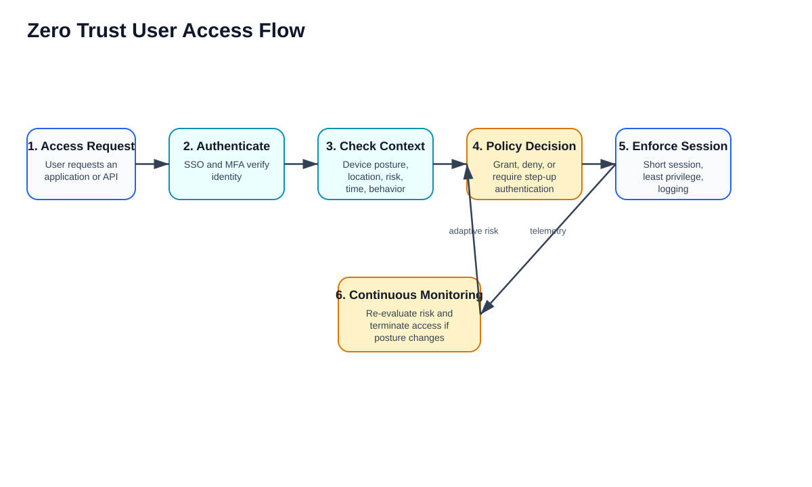
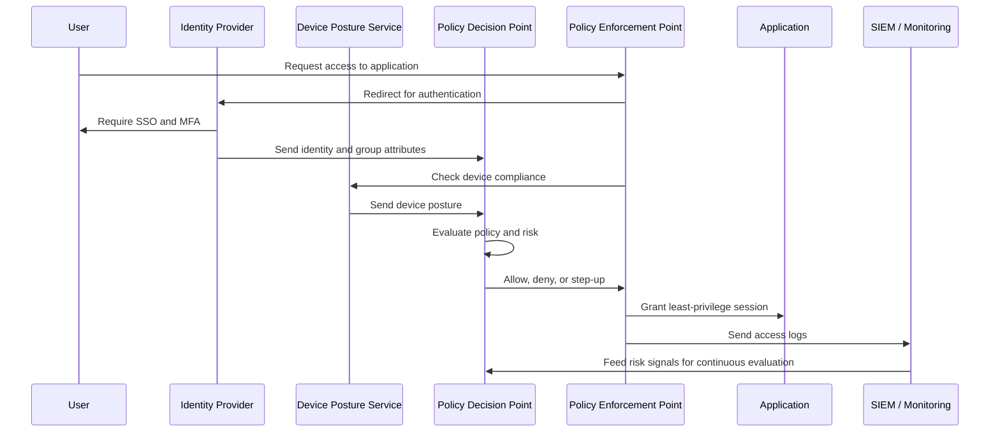
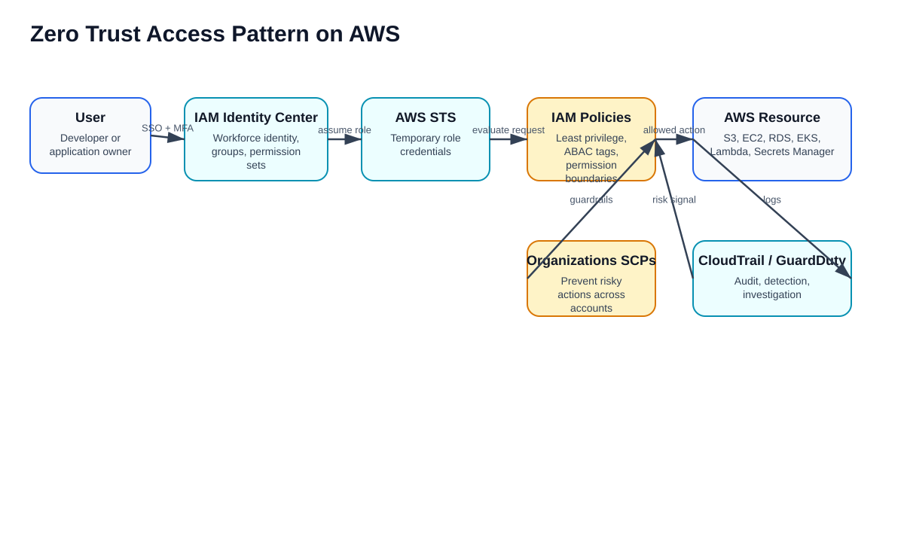
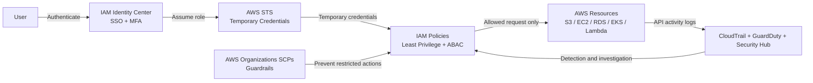
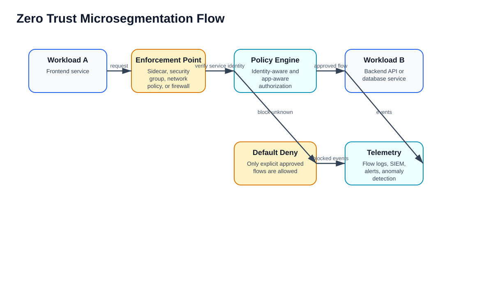
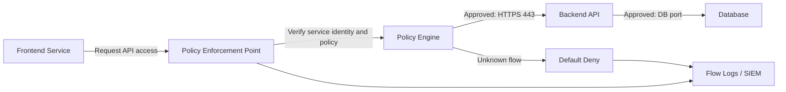

# Features and Characteristics of Zero Trust Access

## 1. What is Zero Trust Access?

**Zero Trust Access** is a security model based on the principle: **never trust by default, always verify, and continuously validate access**.

Traditional security assumes users and systems inside the corporate network are trusted. Zero Trust removes that assumption. Every access request is evaluated based on identity, device health, location, risk, application sensitivity, data classification, and policy.

NIST describes Zero Trust as a shift away from static network perimeter defenses toward protection focused on users, assets, and resources. A Zero Trust Architecture uses those principles to design enterprise infrastructure and workflows. CISA also describes Zero Trust as a collection of concepts designed to support accurate, least-privilege, per-request access decisions.

**Sources:**

- NIST SP 800-207 Zero Trust Architecture: https://csrc.nist.gov/pubs/sp/800/207/final
- NIST Zero Trust publication announcement: https://www.nist.gov/news-events/news/2020/08/zero-trust-architecture-nist-publishes-sp-800-207
- CISA Zero Trust: https://www.cisa.gov/topics/cybersecurity-best-practices/zero-trust
- CISA Zero Trust Maturity Model: https://www.cisa.gov/zero-trust-maturity-model

---

## 2. Core Idea

```text
Do not trust a user, device, workload, network, or application only because it is inside the network.
Verify every request before allowing access.
Grant only the minimum access required.
Continuously monitor and re-evaluate trust.
```

---

## 3. Zero Trust Access Architecture Image



---

## 4. Mermaid Architecture Diagram



---

# 5. Key Features of Zero Trust Access

## 5.1 Never Trust by Default

Zero Trust assumes that no user, device, workload, or network segment is automatically trusted.

Access must be verified even when the request comes from:

- Corporate network
- VPN
- Cloud VPC
- Internal subnet
- Managed device
- Previously authenticated user

**Interview keyword:** Trust is not based on network location.

---

## 5.2 Verify Explicitly

Every access request is evaluated using multiple signals.

Common verification signals include:

| Signal | Example |
|---|---|
| Identity | User, role, service account, workload identity |
| Authentication strength | Password, MFA, phishing-resistant MFA |
| Device posture | Managed device, encrypted disk, EDR installed |
| Location | Country, network, impossible travel detection |
| Application sensitivity | Public app, internal app, privileged app |
| Data classification | Public, internal, confidential, restricted |
| Risk score | Unusual login, malware alert, suspicious behavior |
| Time/context | Business hours, approved location, approved device |

---

## 5.3 Least Privilege Access

Zero Trust grants only the permissions required to complete a task.

Examples:

- Read-only instead of admin access
- Application-level access instead of full network access
- Just-in-time privileged access
- Short-lived session credentials
- Resource-specific access instead of broad access

---

## 5.4 Continuous Monitoring

Access is not only checked at login. It is continuously evaluated.

Examples:

- User logs in successfully, but the device becomes non-compliant later
- Session is terminated if malware is detected
- Step-up MFA is required if risk increases
- Access is blocked if the user changes location unexpectedly

---

## 5.5 Strong Identity-Centric Security

Zero Trust makes identity the new security perimeter.

Important controls include:

- SSO
- MFA
- Conditional access
- Role-based access control, RBAC
- Attribute-based access control, ABAC
- Privileged access management, PAM
- Workload identity
- Short-lived credentials

---

## 5.6 Device Trust and Posture Validation

Zero Trust checks whether the device is safe before access is granted.

Device checks may include:

- Is the device managed?
- Is disk encryption enabled?
- Is endpoint protection running?
- Is the operating system patched?
- Is the device jailbroken or rooted?
- Is the device marked as compromised?

---

## 5.7 Microsegmentation

Microsegmentation limits lateral movement by dividing the environment into smaller protected segments.

Instead of allowing broad internal network communication, Zero Trust allows only approved traffic flows.

Example:

```text
Frontend can call Backend API on port 443.
Backend API can call Database on port 5432.
Frontend cannot directly access Database.
Unknown service-to-service traffic is denied.
```

---

## 5.8 Policy-Based Access Control

Access is controlled by centrally managed policies.

Policies may consider:

- User role
- User group
- User attributes
- Device posture
- Resource tags
- Data classification
- Network location
- Risk score
- Time of access

---

## 5.9 Secure Remote Access Without Broad VPN Trust

Traditional VPN often gives users broad network-level access. Zero Trust Network Access, ZTNA, provides application-specific access.

Example:

```text
Traditional VPN:
User connects to network, then reaches many internal systems.

Zero Trust Access:
User is verified, then receives access only to the approved app.
```

---

## 5.10 Logging, Analytics, and Threat Detection

Zero Trust depends heavily on visibility.

Common telemetry sources include:

- Identity logs
- Device logs
- Network flow logs
- Application logs
- CloudTrail logs
- DNS logs
- EDR alerts
- SIEM alerts
- UEBA behavior analytics

---

# 6. Characteristics of Zero Trust Access

| Characteristic | Description |
|---|---|
| **Identity-centric** | Identity becomes a primary control point |
| **Policy-driven** | Access decisions are based on defined rules and risk signals |
| **Context-aware** | Uses device, location, behavior, app, and data context |
| **Least privilege** | Grants only the access required |
| **Continuous validation** | Access is re-evaluated during the session |
| **Default deny** | Access is denied unless explicitly allowed |
| **Microsegmented** | Reduces lateral movement between systems |
| **Telemetry-driven** | Uses logs and analytics to improve decisions |
| **Works across cloud and hybrid environments** | Supports SaaS, AWS, Azure, GCP, on-premises, and remote users |
| **Requires governance** | Needs strong identity, device, policy, and logging standards |

---

# 7. Zero Trust User Access Flow



## Mermaid Flow



---

# 8. Zero Trust Access Pattern on AWS

Zero Trust in AWS is usually implemented by combining IAM, IAM Identity Center, AWS STS, Organizations SCPs, network segmentation, encryption, logging, and threat detection.



## AWS Zero Trust Building Blocks

| AWS Service | Zero Trust Role |
|---|---|
| **IAM** | Least privilege roles and policies |
| **IAM Identity Center** | Workforce SSO and permission sets |
| **AWS STS** | Temporary credentials instead of long-term keys |
| **AWS Organizations SCPs** | Prevent risky actions across accounts |
| **AWS CloudTrail** | Audit API activity |
| **Amazon GuardDuty** | Threat detection |
| **AWS Security Hub** | Security posture management |
| **AWS Config** | Configuration compliance |
| **Amazon VPC** | Network isolation and segmentation |
| **Security Groups** | Instance or ENI-level access control |
| **AWS Network Firewall** | Centralized network inspection |
| **AWS WAF** | Application layer protection |
| **AWS KMS** | Encryption key management |
| **AWS Secrets Manager** | Secure secrets storage and rotation |
| **Amazon Verified Permissions** | Fine-grained application authorization |

---

# 9. AWS Zero Trust Mermaid Diagram



---

# 10. Microsegmentation Flow





---

# 11. Zero Trust Access vs Traditional Perimeter Security

| Area | Traditional Perimeter Security | Zero Trust Access |
|---|---|---|
| Trust model | Trust internal network | Trust nothing by default |
| Access scope | Often network-wide | Application/resource-specific |
| Authentication | Often checked mainly at login | Verified continuously |
| Device posture | Sometimes optional | Important access signal |
| Network design | Castle-and-moat | Microsegmented and identity-aware |
| Credentials | May use long-lived credentials | Prefers short-lived credentials |
| Monitoring | Logs after access | Logs and risk signals influence access |
| Lateral movement | Higher risk if attacker gets inside | Reduced by segmentation and least privilege |

---

# 12. Zero Trust Pillars

CISA organizes Zero Trust maturity around key pillars such as identity, devices, networks, applications and workloads, and data, with cross-cutting visibility, analytics, automation, orchestration, and governance.

| Pillar | Meaning | Example Controls |
|---|---|---|
| **Identity** | Verify who or what is requesting access | SSO, MFA, IAM, PAM, workload identity |
| **Devices** | Verify endpoint security posture | EDR, device compliance, certificates |
| **Networks** | Protect traffic and reduce lateral movement | Segmentation, firewalls, TLS, ZTNA |
| **Applications and workloads** | Secure applications and service-to-service access | API security, workload identity, service mesh |
| **Data** | Protect data based on sensitivity | Encryption, DLP, classification, access control |
| **Visibility and analytics** | Monitor behavior and detect risk | SIEM, UEBA, CloudTrail, GuardDuty |
| **Automation and orchestration** | Respond quickly and consistently | SOAR, auto-remediation, policy-as-code |
| **Governance** | Define standards and accountability | Policies, audits, compliance mapping |

---

# 13. Benefits of Zero Trust Access

| Benefit | Explanation |
|---|---|
| **Reduces breach impact** | Attackers cannot freely move across the network |
| **Improves remote access security** | Users access only approved applications |
| **Strengthens cloud security** | Works well for AWS, Azure, GCP, SaaS, and hybrid environments |
| **Supports compliance** | Provides strong access control, logging, and audit trails |
| **Limits insider risk** | Internal users are still verified and monitored |
| **Improves identity governance** | Access is based on identity, attributes, and least privilege |
| **Supports modern DevOps** | Works with short-lived credentials, service identity, and policy-as-code |

---

# 14. Challenges of Zero Trust Access

| Challenge | Explanation |
|---|---|
| **Complex implementation** | Requires identity, network, device, app, and data coordination |
| **Legacy applications** | Older apps may not support modern identity controls |
| **Policy design effort** | Policies must be clear, tested, and maintained |
| **User experience impact** | Too many prompts can frustrate users |
| **Tool integration** | Requires logs and signals from many systems |
| **Requires strong asset inventory** | You cannot protect what you cannot identify |

---

# 15. Best Practices

1. Start with strong identity and MFA.
2. Use SSO and centralized identity governance.
3. Replace long-term credentials with short-lived credentials where possible.
4. Apply least privilege for users, roles, applications, and workloads.
5. Use RBAC for job-based access and ABAC for dynamic attribute-based access.
6. Validate device posture before granting access.
7. Use microsegmentation to reduce lateral movement.
8. Encrypt data in transit and at rest.
9. Centralize logging and detection.
10. Continuously monitor sessions and revoke access when risk changes.
11. Use policy-as-code for consistent enforcement.
12. Apply Zero Trust in phases instead of attempting everything at once.

---

# 16. Example Zero Trust Access Policy Logic

```text
Allow access to the production payment dashboard only when:

User is authenticated with MFA
AND user is in the Payments-Operations group
AND device is compliant
AND location is approved
AND risk score is low
AND session is logged
AND access is limited to read-only unless privileged approval is granted
```

---

# 17. Interview Answer

**Zero Trust Access is a security model where no user, device, workload, or network is trusted by default. Every access request must be explicitly verified using identity, device posture, location, risk, application, and data context. Access is granted using least privilege and is continuously monitored. In AWS, Zero Trust can be implemented using IAM, IAM Identity Center, STS temporary credentials, Organizations SCPs, VPC segmentation, Security Groups, KMS encryption, Secrets Manager, CloudTrail, GuardDuty, Security Hub, and Config. The goal is to reduce lateral movement, protect sensitive resources, and enforce secure access across cloud, hybrid, and remote environments.**

---

# 18. Simple Summary

| Concept | Simple Meaning |
|---|---|
| **Zero Trust** | Never trust automatically |
| **Verify explicitly** | Check identity, device, and context |
| **Least privilege** | Give only required access |
| **Continuous validation** | Keep checking after login |
| **Microsegmentation** | Limit system-to-system movement |
| **Policy enforcement point** | Place where access is allowed or denied |
| **Policy decision point** | Brain that evaluates access rules |
| **Best AWS services** | IAM, IAM Identity Center, STS, SCPs, VPC, KMS, CloudTrail, GuardDuty |
