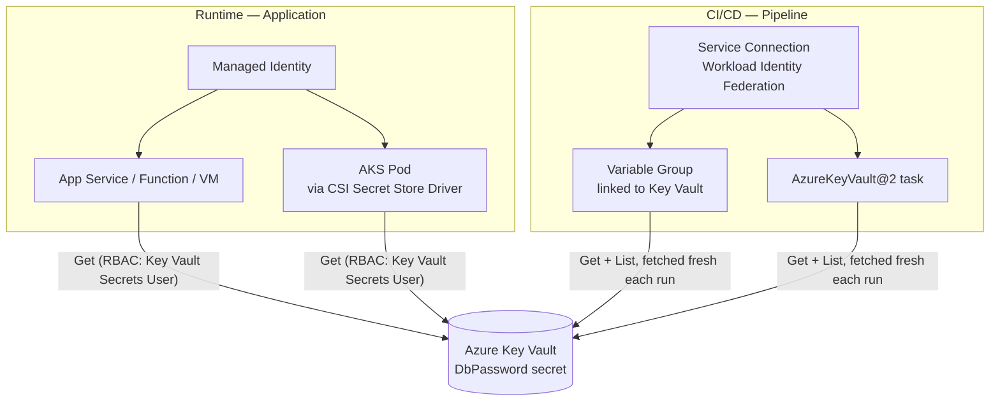

<a id="top"></a>

# Azure Key Vault Secrets — Runtime & Pipeline Access

How to get a secret (a database password, an API key) safely into two
different consumers — a **running application** and a **CI/CD
pipeline** — without ever hardcoding it, checking it into source
control, or storing its actual value somewhere new that then also needs
protecting.

## Table of Contents

1. [Overview](#overview)
2. [Architecture Diagram](#architecture-diagram)
3. [Runtime Secret Access — Application](#1-runtime-secret-access--application)
4. [Pipeline Secret Access — CI/CD](#2-pipeline-secret-access--cicd)
5. [All Methods Compared](#all-methods-compared)
6. [Security Best Practices & Gotchas](#security-best-practices--gotchas)
7. [Interview Questions](#interview-questions)
8. [Most Important Concepts to Know First](#most-important-concepts-to-know-first)
9. [Simple Interview Answer](#simple-interview-answer)

---

## Overview

**The core principle, stated once because it governs every method
below**: never hardcode a secret anywhere — not in source code, not in a
config file checked into git, not in an environment variable baked in
at build time. Store it in **Azure Key Vault** exactly once, and have
every consumer (the running app, the pipeline) fetch it **at the moment
it's actually needed**, authenticating to Key Vault with an identity
that itself requires no separately-stored credential.

That last clause is the part people miss: if fetching the secret
requires its *own* embedded credential, you haven't solved the problem,
you've just moved it. **Managed Identity** (for apps) and **workload
identity federation / OIDC** (for pipeline service connections) are what
actually close that loop.

Azure Key Vault official description: *"Safeguard cryptographic keys and
other secrets used by cloud apps and services."*

[⬆ Back to top](#top)

---

## Architecture Diagram



[⬆ Back to top](#top)

---

## 1. Runtime Secret Access — Application

The application itself needs the password continuously — every time it
opens a database connection, not just once at deploy time.

### Step 1 — Store the secret (once)

```bash
az keyvault secret set --vault-name my-keyvault --name "DbPassword" --value "<the-actual-password>"
```

### Step 2 — Give the app a Managed Identity

A system-assigned or user-assigned **Managed Identity** is an
Azure-managed identity tied to the resource itself (App Service,
Function, VM, AKS pod). Azure handles its credential lifecycle entirely
— your code never sees, stores, or rotates a credential to *get* this
identity.

```bash
az webapp identity assign --name my-app --resource-group my-rg
```

### Step 3 — Grant least-privilege access to just the secret

```bash
az role assignment create --role "Key Vault Secrets User" \
  --assignee <managed-identity-principal-id> \
  --scope /subscriptions/.../vaults/my-keyvault
```

`Key Vault Secrets User` (not Contributor, not Owner) grants read access
to secret *values* only — no ability to create, delete, or manage
policies on the vault itself.

### Step 4 — Fetch it at runtime, not build time

**Option A — App Service Key Vault reference** (no code required): set
the app setting's value to

```text
@Microsoft.KeyVault(SecretUri=https://my-keyvault.vault.azure.net/secrets/DbPassword/)
```

App Service resolves this automatically at startup using the app's
Managed Identity — your code just reads the setting like any other
environment variable, with zero Key Vault SDK code.

**Option B — SDK call in code** (needed outside App Service, or for
more control):

```csharp
var client = new SecretClient(
    new Uri("https://my-keyvault.vault.azure.net/"),
    new DefaultAzureCredential()); // uses the Managed Identity automatically

KeyVaultSecret secret = await client.GetSecretAsync("DbPassword");
var connectionString = $"Server=...;Password={secret.Value};";
```

`DefaultAzureCredential` is what makes this portable: locally it falls
back to your Azure CLI login; in Azure it automatically uses the
Managed Identity — the same code runs unchanged in both places, with no
credential-handling logic of your own.

**Option C — AKS: Secrets Store CSI Driver**. The **Azure Key Vault
Provider for Secrets Store CSI Driver** mounts the secret as a volume
(or syncs it into a native Kubernetes Secret) at pod startup, using the
pod's **workload identity** — so the password never lives in a
ConfigMap or a plain Kubernetes Secret that would need separate locking
down.

[⬆ Back to top](#top)

---

## 2. Pipeline Secret Access — CI/CD

The pipeline typically needs the password **transiently** — running a
DB migration, seeding test data during CI — not continuously like the
running app. This is a genuinely separate concern from §1, not a
replacement for it.

### Method A — Key-Vault-linked Variable Group

Pipelines → **Library** → **+ Variable group** → toggle **"Link secrets
from an Azure key vault as variables"** → pick the Azure service
connection and the Key Vault → select which secrets to expose (e.g.,
`DbPassword`).

Critically, this does **not** copy the secret's value into Azure
DevOps — only the secret's *name* is stored. The value is fetched fresh
from Key Vault on every pipeline run, so rotating the secret in Key
Vault takes effect on the next run automatically, with zero pipeline
changes.

```yaml
variables:
- group: my-keyvault-variable-group

steps:
- script: |
    ./run-db-migration.sh
  env:
    DB_PASSWORD: $(DbPassword)   # must be explicitly mapped via env:
```

Note the explicit `env:` mapping — Azure DevOps deliberately does
**not** auto-expand secret variables into scripts via inline macro
syntax; this forces you to be intentional about exactly where a secret
flows.

### Method B — `AzureKeyVault@2` task

A one-off/dynamic pull without maintaining a persistent Library entry:

```yaml
steps:
- task: AzureKeyVault@2
  inputs:
    azureSubscription: 'my-service-connection'
    KeyVaultName: 'my-keyvault'
    SecretsFilter: 'DbPassword'
    RunAsPreJob: true
```

### The service connection's own identity matters just as much

Whichever method, the service connection's underlying identity needs
**Get** and **List** on secrets only (Key Vault access policy, or the
`Key Vault Secrets User` RBAC role) — never broader subscription access.
Prefer **workload identity federation (OIDC)** for the service
connection over one backed by a stored client secret; otherwise you've
moved the "secret to get the secret" problem into the service
connection instead of eliminating it, the exact failure mode Managed
Identity solves on the runtime side in §1.

[⬆ Back to top](#top)

---

## All Methods Compared

| Method | Consumer | How It Works | Secret Value Stored in Azure DevOps? | Best For |
|---|---|---|---|---|
| **Managed Identity + SDK** (`DefaultAzureCredential`) | Running app (any compute type supporting Managed Identity) | App authenticates to Key Vault directly with its own identity, fetches the secret via SDK call | N/A — not a pipeline mechanism | Full control; portable code that works both locally and in Azure |
| **App Service Key Vault reference** | Running app (App Service / Functions only) | App setting value is a `@Microsoft.KeyVault(...)` URI; the platform resolves it automatically at startup | N/A | Zero code changes |
| **AKS Secrets Store CSI Driver** | Running app (AKS pods) | Secret mounted as a volume, or synced to a native K8s Secret, at pod startup via workload identity | N/A | Kubernetes-native workloads |
| **Key-Vault-linked Variable Group** | CI/CD pipeline | Variable group references the secret's *name*; the value is fetched fresh from Key Vault on every run | No — only the name is stored | Reusable across many pipelines; rotation-friendly with zero pipeline edits |
| **`AzureKeyVault@2` task** | CI/CD pipeline | Explicit task pulls named secrets into pipeline variables for just that job | No | One-off/dynamic secret retrieval without a persistent Library entry |

[⬆ Back to top](#top)

---

## Security Best Practices & Gotchas

- **Masking is best-effort, not a guarantee.** Azure DevOps masks the
  exact string it recognizes as secret in log output — but a script
  that transforms it (base64-encodes it, splits it character by
  character) can still leak it around the masking. Never
  `echo`/`Write-Host` a secret variable directly.
- **Gate who can trigger a pipeline with production secret access** —
  add an approval **check** directly on the Key-Vault-linked variable
  group (or the target Environment), not only on the pipeline
  definition itself.
- **Don't conflate pipeline-time and runtime access.** A pipeline
  pulling a secret to run a one-time migration, and a deployed app
  continuously authenticating to Key Vault at request time, are two
  separate, both-necessary flows — one doesn't substitute for the
  other. A common mistake is fetching the secret once in the pipeline
  and baking it into the deployed app's config, which reintroduces the
  exact hardcoding problem this whole pattern exists to avoid.
- **Least privilege everywhere identity touches Key Vault** — `Key
  Vault Secrets User`, scoped to the specific vault, for every
  identity involved (app Managed Identity, pipeline service
  connection) — never Contributor/Owner just to make an error go away.
- **Prefer OIDC/workload identity federation over stored
  credentials** for the pipeline's service connection itself — the
  same principle Managed Identity applies on the runtime side.
- **Network-restrict the vault** with a Private Endpoint where the
  consuming compute is already inside a VNet, so secret retrieval
  never traverses the public internet even authenticated.

[⬆ Back to top](#top)

---

## Interview Questions

**1. Why is a Managed Identity a stronger solution than "store the credential in an environment variable" for accessing Key Vault?**
An environment variable is itself a secret that needs protecting — you've just moved the problem, not solved it. A Managed Identity has no credential your code ever sees, stores, or could accidentally log/leak; Azure issues and rotates the underlying token transparently, and access is governed by RBAC role assignment rather than a value that could be copied out of a config file.

**2. What's the practical difference between a Key-Vault-linked Variable Group and the `AzureKeyVault@2` task?**
A Variable Group is a persistent, reusable Library object — define it once, reference it (`- group: name`) from any pipeline. The `AzureKeyVault@2` task is a one-off, in-pipeline pull scoped to a single job, with no separate object to maintain. Both fetch the value fresh at run time and store only the secret's name, not its value, in Azure DevOps either way.

**3. "A secret variable's value showed up in the pipeline log even though it came from a Key-Vault-linked variable group — how did that happen?"**
Answer shape: masking only catches the *exact* string Azure DevOps recognizes as secret; if the script transformed it first (encoded, concatenated with other text, split into parts) before printing, the masking never matches. The fix isn't better masking — it's never writing the raw or derived secret value to stdout/log output in the first place, treating masking as defense-in-depth, not the primary control.

**4. Why shouldn't a CI/CD pipeline fetch the DB password once and bake it into the deployed app's configuration?**
That reintroduces exactly the hardcoding problem Key Vault exists to prevent — the value now sits in a deployment artifact/app setting, doesn't rotate without a redeploy, and widens the blast radius of a leak to every place that artifact is stored. The deployed app should hold its own Managed Identity and fetch the secret itself at runtime; the pipeline's use of the secret (if any, e.g. for a migration step) should stay scoped to that one pipeline run.

[⬆ Back to top](#top)

---

## Most Important Concepts to Know First

1. Never hardcode a secret — store it once in Key Vault, fetch it at the point of use
2. Managed Identity (runtime) — no embedded credential to authenticate to Key Vault
3. Workload identity federation / OIDC (pipeline service connection) — the same principle, pipeline-side
4. `Key Vault Secrets User` RBAC role — least privilege, every consuming identity
5. App Service Key Vault reference vs. SDK call (`DefaultAzureCredential`)
6. AKS Secrets Store CSI Driver for Kubernetes workloads
7. Key-Vault-linked Variable Group — stores the secret's name, not its value; fetched fresh every run
8. `AzureKeyVault@2` task as the one-off alternative to a persistent Variable Group
9. Pipeline-time vs. runtime access are separate concerns — don't bake a pipeline-fetched secret into a deployed artifact

[⬆ Back to top](#top)

---

## Simple Interview Answer

A database password (or any secret) should exist in exactly one place — Azure Key Vault — and every consumer fetches it at the moment it's actually needed, authenticating with an identity that itself requires no stored credential. For a running application, that identity is a **Managed Identity**: App Service/Functions can resolve a Key Vault reference automatically with zero code, while other compute uses the SDK with `DefaultAzureCredential`, and AKS pods use the Secrets Store CSI Driver with workload identity. For a CI/CD pipeline, the equivalent is a **Key-Vault-linked Variable Group** (or the `AzureKeyVault@2` task for a one-off pull) — both fetch the value fresh on every run and store only the secret's *name* in Azure DevOps, never its value, so rotating the secret in Key Vault needs no pipeline change at all. The two flows are complementary, not interchangeable: the pipeline's transient access for a migration step is never a substitute for the deployed app fetching its own copy continuously at runtime.

[⬆ Back to top](#top)
