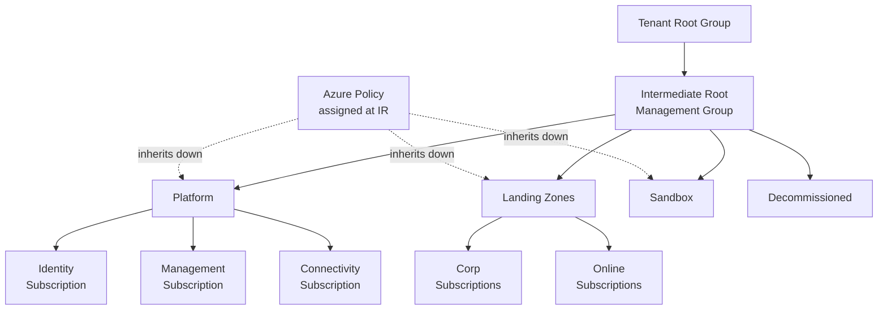
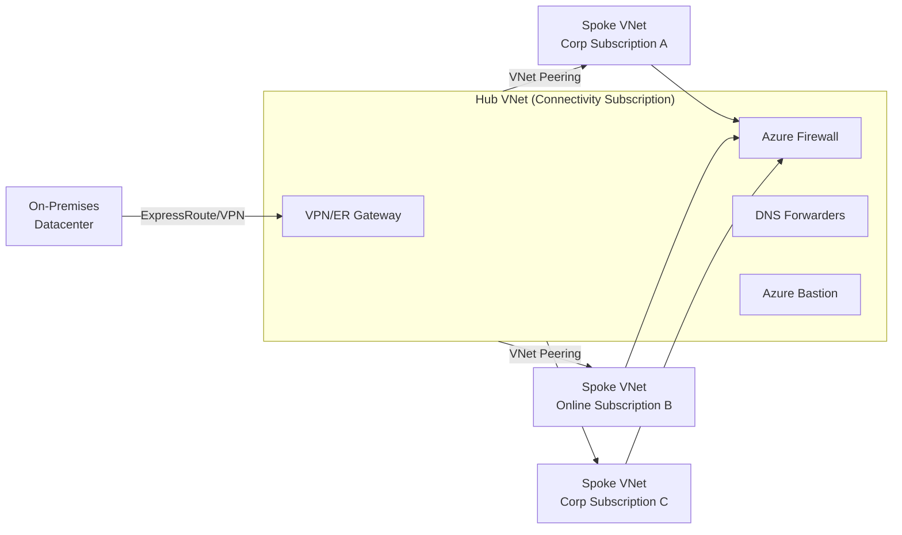

<a id="top"></a>

# Azure Landing Zone — Deep Dive

A focused deep-dive on **Azure Landing Zones**: what they are, the design
areas that make one up, reference architectures, how to configure one, and
the ways teams actually deploy one. For the broader Cloud Adoption
Framework phases a landing zone fits into (Strategy → Plan → **Ready** →
Adopt → Govern → Manage) and the AZ-305 exam framing, see
[azure-services.md § AZ-305: Solutions Architect Design Concepts](azure-services.md#az-305-solutions-architect-design-concepts)
first — this doc goes deeper, not wider.

## Table of Contents

1. [What Is an Azure Landing Zone](#1-what-is-an-azure-landing-zone)
2. [Design Principles (8 CAF Design Areas)](#2-design-principles-8-caf-design-areas)
3. [Key Features & Characteristics](#3-key-features--characteristics)
4. [Landing Zone Archetypes](#4-landing-zone-archetypes)
5. [Reference Architecture](#5-reference-architecture)
6. [Configuration](#6-configuration)
7. [Deployment Options](#7-deployment-options)
8. [Landing Zone vs Traditional Subscription Design](#8-landing-zone-vs-traditional-subscription-design)
9. [Interview Questions](#9-interview-questions)

---

# 1. What Is an Azure Landing Zone

An **Azure Landing Zone** is the pre-provisioned, policy-governed
environment a workload "lands into" — the Management Group hierarchy,
subscriptions, identity foundation, network topology, and guardrails
(Azure Policy, RBAC, monitoring, security baselines) that exist *before*
any application team deploys a single resource. It is the concrete output
of the Cloud Adoption Framework's **Ready** phase, not a product you buy —
it's an architecture pattern Microsoft publishes as the **Azure Landing
Zone (ALZ) accelerator**, implementable via portal, Bicep, or Terraform.

The core idea: instead of every team hand-rolling their own subscription's
governance (and inevitably doing it inconsistently), a platform team builds
the landing zone *once*, and every new subscription that lands under it
inherits consistent policy, RBAC, and network connectivity automatically —
with zero manual setup per team.

## Interview Keyword
A landing zone is **"the destination, not the journey"** — it's the
already-governed environment a workload arrives into, distinct from the
migration/adoption process (CAF's broader lifecycle) that gets workloads
there. If asked "what is a landing zone," lead with *Management Group
hierarchy + Azure Policy + hub network + identity foundation, provisioned
before any workload exists*, not with a specific tool name.

[⬆ Back to top](#top)

---

# 2. Design Principles (8 CAF Design Areas)

Every Azure Landing Zone is built by making a deliberate decision in each
of eight design areas — skipping one just means the decision gets made
implicitly (and usually inconsistently) later, per-subscription.

| Design Area | Key Decisions |
|---|---|
| **Azure Billing & Microsoft Entra Tenant** | How many tenants, EA/MCA enrollment structure, which tenant hosts the landing zone. |
| **Identity & Access Management** | Entra ID as the single identity source, RBAC model, Privileged Identity Management (PIM) for just-in-time elevation, break-glass accounts. |
| **Resource Organization** | Management Group hierarchy, naming/tagging conventions, subscription democratization model (how many subscriptions, who gets one). |
| **Network Topology & Connectivity** | Hub-and-spoke vs Virtual WAN, on-prem connectivity (VPN/ExpressRoute), DNS strategy, IP address planning. |
| **Security** | Centralized vs federated security operations, Microsoft Defender for Cloud coverage, Microsoft Sentinel, encryption/key management standards. |
| **Governance** | Azure Policy assignment strategy (which Management Group level), compliance reporting, cost guardrails (budgets, Azure Policy `deny` effects). |
| **Management** | Monitoring/Log Analytics workspace strategy (centralized vs per-subscription), backup, patching baseline. |
| **Platform Automation & DevOps** | How the landing zone itself is deployed and evolved — IaC repo structure, pipeline-driven subscription vending rather than manual portal changes. |

## Interview Keyword
If asked to "design a landing zone," structure the answer around these
**8 design areas** rather than jumping straight to a network diagram —
it signals you understand a landing zone is a governance decision
framework, not just a hub-and-spoke VNet.

[⬆ Back to top](#top)

---

# 3. Key Features & Characteristics

| Feature | Definition & Characteristics | Preferred Over the Alternative When |
|---|---|---|
| **Management Group hierarchy** | A scope layer above subscriptions that Azure Policy and RBAC assignments inherit downward through — assign once at a Management Group, every subscription under it inherits automatically. | You have (or will have) more than a handful of subscriptions — below that, the hierarchy's overhead may not pay for itself. |
| **Policy-driven guardrails** | Azure Policy assigned at Management Group scope enforces guardrails (`allowedLocations`, `deny` on public IP creation, required tags) *before* a resource is created, not audited after the fact. | You need prevention, not just detection — a `deny` effect policy stops a misconfiguration from ever landing, where a Defender for Cloud alert only flags it afterward. |
| **Subscription democratization** | Application teams get their own subscription (a natural scale/billing/blast-radius boundary) rather than sharing one subscription cluster-wide — governed centrally via Management Group policy, but operated with team-level autonomy underneath. | Teams need Owner-level autonomy within their own boundary without risking other teams' workloads — a single shared subscription can't offer that isolation. |
| **Centralized identity foundation** | One Microsoft Entra ID tenant is the authoritative identity source for every subscription in the landing zone — no per-subscription identity silos. | Always, in a single-organization landing zone — federated identity per subscription reintroduces exactly the inconsistency landing zones exist to remove. |
| **Hub-and-spoke (or Virtual WAN) connectivity** | Spoke VNets (one per subscription/workload) peer to a central hub that holds shared services (Azure Firewall, VPN/ExpressRoute Gateway, DNS forwarders) — spokes don't each need their own gateway or firewall. | You have multiple spokes that all need the same shared egress/firewall/on-prem connectivity — duplicating a gateway or firewall per spoke is both more expensive and harder to govern consistently. |
| **Landing zone archetypes** | Pre-defined subscription templates (Corp, Online, Platform, Sandbox — see §4) that come with a matching Azure Policy set and network pattern already attached, rather than a blank subscription. | Onboarding a new workload/team and you want it correctly governed from minute one, not governed retroactively once someone notices it's missing controls. |
| **Platform vs application landing zones** | *Platform* landing zones (Identity, Management, Connectivity) host shared services every workload depends on; *application* landing zones host the actual workloads and consume the platform's shared services rather than duplicating them. | Any landing zone with more than one workload team — without this split, every team re-provisions its own firewall/DNS/logging instead of consuming a shared one. |

[⬆ Back to top](#top)

---

# 4. Landing Zone Archetypes

The ALZ accelerator ships with a standard Management Group structure and a
set of subscription **archetypes**, each with a matching Azure Policy
initiative already attached:

```text
Tenant Root Group
└── Management Group: Contoso (Intermediate Root)
    ├── Platform
    │   ├── Identity        (Entra ID Domain Services, AD DS domain controllers)
    │   ├── Management       (Log Analytics, Automation, centralized monitoring)
    │   └── Connectivity     (hub VNet, Azure Firewall, VPN/ExpressRoute Gateway, DNS)
    ├── Landing Zones
    │   ├── Corp              (internal-facing workloads, no direct internet inbound)
    │   └── Online             (internet-facing workloads, public endpoints allowed)
    ├── Sandbox                (individual experimentation — isolated, no production data, spending capped)
    └── Decommissioned          (holding area for subscriptions being retired)
```

- **Platform / Identity** — hosts domain services and directory
  extensions; every other Management Group depends on it for auth, so it
  goes first.
- **Platform / Management** — the shared Log Analytics workspace,
  Azure Automation, and update management every subscription reports into.
- **Platform / Connectivity** — the hub VNet, Azure Firewall, and
  VPN/ExpressRoute Gateway every spoke subscription peers to.
- **Landing Zones / Corp** — application subscriptions that need
  connectivity to on-prem/hub resources but no direct internet inbound —
  typically peered to the hub via a spoke VNet.
- **Landing Zones / Online** — application subscriptions that are
  internet-facing (public web apps, APIs) — a lighter-weight, more
  permissive policy set than Corp, since these workloads are designed
  for public exposure.
- **Sandbox** — deliberately isolated from the hub and from production
  data, with tight spending limits, so individuals can experiment freely
  without risking anything else in the tenant.
- **Decommissioned** — subscriptions in the process of being retired sit
  here, still policy-governed, until they're formally deleted.

## Interview Keyword
Know the **Platform / Landing Zones / Sandbox / Decommissioned** split by
name, and specifically that Corp vs Online is the "internet-facing or
not" distinction — a very common AZ-305 scenario question is "which
archetype does workload X belong in."

[⬆ Back to top](#top)

---

# 5. Reference Architecture

## Management Group & Policy Inheritance



A policy assigned once at the **Intermediate Root** Management Group
reaches every subscription beneath it automatically — a new Corp
subscription created tomorrow inherits it with zero additional action.

## Hub-and-Spoke Network Topology



Every spoke routes egress traffic through the hub's **Azure Firewall**
(via a user-defined route forcing 0.0.0.0/0 to the firewall's private IP)
rather than each spoke provisioning its own — one firewall to patch,
monitor, and govern instead of one per subscription.

### Interview Keyword
If asked to sketch a landing zone network on a whiteboard, draw the hub
with Firewall/Gateway/DNS/Bastion, then multiple spokes peered to it, and
explicitly say spokes **route egress through the hub**, not directly to
the internet — that single detail is the crux of hub-and-spoke.

[⬆ Back to top](#top)

---

# 6. Configuration

## Management Groups & Policy Assignment

```bash
# Create the Management Group hierarchy
az account management-group create --name "Platform"
az account management-group create --name "LandingZones"
az account management-group create --name "Sandbox"

# Move a subscription under a Management Group
az account management-group subscription add \
  --name "LandingZones" \
  --subscription "<subscription-id>"

# Assign a policy initiative at Management Group scope — every current
# and future subscription under LandingZones inherits it
az policy assignment create \
  --name "alz-corp-baseline" \
  --scope "/providers/Microsoft.Management/managementGroups/LandingZones" \
  --policy-set-definition "<initiative-id>"
```

**Assign policy at the Management Group, not per-subscription** — the
entire point of the hierarchy is that a new subscription inherits
governance the moment it's moved under the right Management Group, with
no separate policy-assignment step per subscription.

## Identity Foundation

- A single Microsoft Entra ID tenant is authoritative across the whole
  landing zone — no per-subscription identity islands.
- **Privileged Identity Management (PIM)** for just-in-time elevation to
  privileged roles (Owner, User Access Administrator) at Management Group
  or subscription scope, rather than standing privileged access.
- A small number of **break-glass accounts** (excluded from Conditional
  Access, credentials stored offline) so a Conditional Access
  misconfiguration can never lock administrators out entirely.

## Network Topology Decisions

| Decision | Hub-and-Spoke | Virtual WAN |
|---|---|---|
| Best fit | A moderate number of spokes/regions, full manual control over routing | Large-scale, many regions/spokes, wanting Microsoft-managed any-to-any routing |
| Firewall/Gateway placement | Self-managed in the hub VNet | Managed inside the Virtual WAN hub automatically |
| Operational model | You own the hub's route tables and peerings | Azure manages the backbone; you attach VNets to virtual hubs |

## Subscription Vending

**Subscription vending** is the automated, self-service process of
provisioning a new, correctly-governed subscription (right Management
Group placement, right policy set, right spoke network peering, right
RBAC) on demand — typically via a pipeline rather than a portal click,
so every new subscription is identical in its governance from day one
regardless of who requests it.

[⬆ Back to top](#top)

---

# 7. Deployment Options

| Option | Definition & Characteristics | Preferred Over the Alternative When |
|---|---|---|
| **Portal-based ALZ accelerator** | A guided wizard (Azure portal "Azure Landing Zones" experience) that deploys the Management Group hierarchy, policies, and hub network through a UI, generating the underlying Bicep/ARM templates for you. | You're evaluating or bootstrapping a first landing zone quickly and want to see the resulting structure before committing to a specific IaC toolchain. |
| **Bicep (ALZ Bicep modules)** | Microsoft-maintained, modular Bicep templates (the `Azure/ALZ-Bicep` reference implementation) covering Management Groups, policy, hub networking, and logging — deployed via `az deployment` or a pipeline. | Your organization is already standardized on Bicep/ARM for other infrastructure and wants first-party Microsoft tooling with matching support lifecycle. |
| **Terraform (`Azure/caf-enterprise-scale` module)** | A community/Microsoft-supported Terraform module implementing the same Enterprise-Scale landing zone architecture — Management Groups, policy assignments, hub connectivity — as composable Terraform resources/modules. | Your organization is already standardized on Terraform (e.g., managing AWS + Azure from one toolchain) — avoids maintaining two separate IaC languages for the same governance pattern. See [Terraform.md](../Terraform/Terraform.md) for module/state patterns this builds on. |
| **Pipeline-driven subscription vending** | A CI/CD pipeline (Azure DevOps or GitHub Actions) that takes a request (team name, archetype, region) and runs the IaC to provision a new subscription under the right Management Group with the right policy/network attached — no manual portal or CLI step. | You're past the initial landing zone bootstrap and now need to onboard new teams/subscriptions repeatably and auditably — every vended subscription's config lives in git history instead of someone's memory of what they clicked. |

**General preference**: bootstrap the landing zone itself with whichever
IaC tool matches your organization's existing standard (Bicep if
Azure-only, Terraform if multi-cloud) — then treat all *subsequent*
subscription vending as pipeline-driven regardless of which tool built
the initial hierarchy, since manual per-subscription setup is precisely
the inconsistency a landing zone exists to eliminate.

## Interview Keyword
Know that the **ALZ Bicep modules** and the **`caf-enterprise-scale`
Terraform module** implement the *same* reference architecture in two
different IaC languages — being asked "how would you deploy a landing
zone" is really asking whether you know the Management Group/policy/hub
pattern, not testing a specific tool preference.

[⬆ Back to top](#top)

---

# 8. Landing Zone vs Traditional Subscription Design

| Aspect | Traditional (Ad Hoc) Subscription Design | Azure Landing Zone |
|---|---|---|
| Governance | Applied per-subscription, after the fact, inconsistently | Applied once at Management Group scope, inherited automatically |
| New subscription onboarding | Manual setup — networking, policy, RBAC each configured by hand | Vended via pipeline against a pre-defined archetype — minutes, not days |
| Network connectivity | Each subscription provisions its own gateway/firewall | Spokes peer to a shared hub — one firewall/gateway to manage |
| Drift over time | High — each subscription evolves independently | Low — policy `deny`/`deployIfNotExists` effects actively prevent drift |
| Audit story | "Ask whoever set it up" | Git history of the IaC that provisioned it |

**Preferred over ad hoc subscription design when**: there is more than
one team/subscription in play, or there will be soon — the entire
value of a landing zone is amortized governance cost across many
subscriptions; for a single permanent subscription with no plan to add
more, the hierarchy's overhead may exceed its benefit.

[⬆ Back to top](#top)

---

# 9. Interview Questions

**"What is an Azure Landing Zone, in one sentence?"**
The pre-provisioned, policy-governed environment (Management Groups,
identity, network, guardrails) a workload lands into — the concrete
output of the Cloud Adoption Framework's Ready phase.

**"How does policy inheritance work in a landing zone?"**
Azure Policy assigned at a Management Group scope applies to every
subscription nested beneath it, including subscriptions added later —
you assign once at the right level of the hierarchy, not per subscription.

**"What's the difference between a Corp and an Online landing zone archetype?"**
Corp is for internally-facing workloads with no direct internet inbound;
Online is for internet-facing workloads with public endpoints — each
archetype comes with a matching, appropriately-scoped policy set.

**"Why hub-and-spoke instead of letting every subscription manage its own networking?"**
Centralizes the firewall, VPN/ExpressRoute gateway, and DNS in one
place to patch/monitor/govern, instead of duplicating (and
inconsistently configuring) them per subscription — spokes route
egress through the hub rather than directly to the internet.

**"How would you onboard a new application team into an existing landing zone?"**
Vend a new subscription via the existing pipeline against the correct
archetype (Corp or Online), which places it under the right Management
Group (inheriting policy automatically), peers its spoke VNet to the hub,
and assigns baseline RBAC — no manual per-team setup.

**"When would a landing zone be overkill?"**
A single, permanent subscription with no plan to add more — the
Management Group hierarchy and policy-inheritance machinery pay for
themselves across many subscriptions, not one.

[⬆ Back to top](#top)
