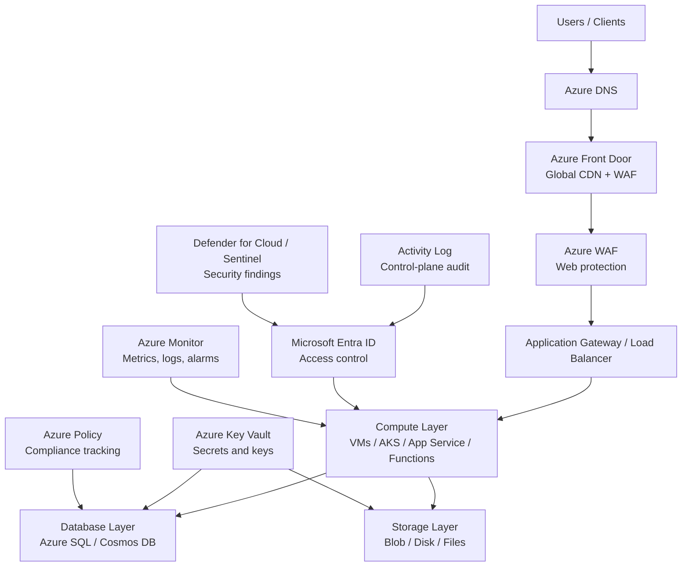
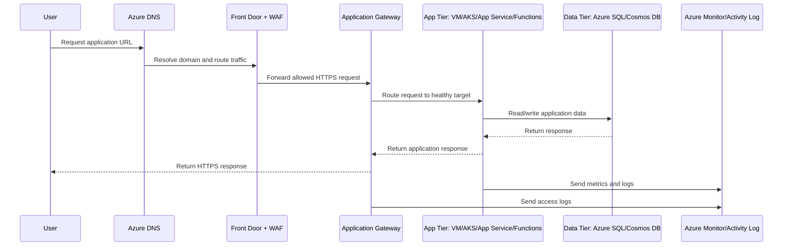
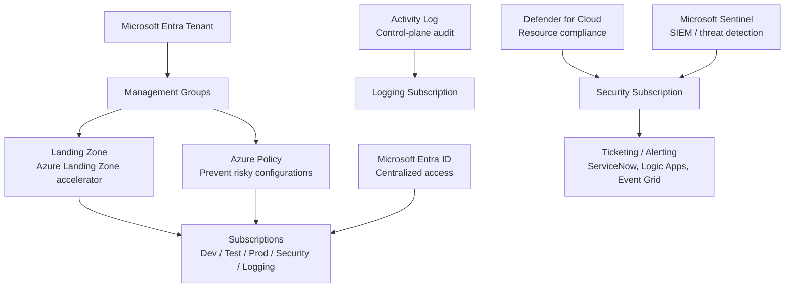

<a id="top"></a>

# Azure Services — Exam & Interview Ready Guide

## Table of Contents

1. [Overview](#overview)
2. [Azure Services Architecture Diagram](#azure-services-architecture-diagram)
3. [Secure 3-Tier Azure Application Flow](#secure-3-tier-azure-application-flow)
4. [Azure DevOps Deployment Flow](#azure-devops-deployment-flow)
5. [Azure Security and Governance Flow](#azure-security-and-governance-flow)
6. [Compute Services](#1-compute-services)
7. [Storage Services](#2-storage-services)
8. [Database Services](#3-database-services)
9. [Networking and Content Delivery](#4-networking-and-content-delivery)
10. [Security, Identity, and Compliance](#5-security-identity-and-compliance)
11. [Monitoring, Management, and Governance](#6-monitoring-management-and-governance)
12. [DevOps and Developer Tools](#7-devops-and-developer-tools)
13. [Migration and Hybrid Cloud](#8-migration-and-hybrid-cloud)
14. [Analytics and Data Services](#9-analytics-and-data-services)
15. [AI, ML, and Generative AI](#10-ai-ml-and-generative-ai)
16. [Application Integration](#11-application-integration)
17. [Cost Management](#12-cost-management)
18. [AZ-305: Solutions Architect Design Concepts](#az-305-solutions-architect-design-concepts)
19. [Azure Engineer Interview Questions](#azure-engineer-interview-questions)
20. [Azure DevOps Engineer Interview Questions](#azure-devops-engineer-interview-questions)
21. [Most Important Azure Services to Know First](#most-important-azure-services-to-know-first)
22. [Simple Interview Answer](#simple-interview-answer)
23. [Daily Learning Notes](#daily-learning-notes)

---

## Overview

Azure provides cloud services used to design, deploy, secure, monitor, and scale modern applications. These services are grouped into categories such as compute, storage, database, networking, security, monitoring, DevOps, analytics, AI/ML, migration, and cost management.

A strong Azure engineer should understand what each service does, its defining characteristics, when to use it, and — critically for interviews — *why* it would be chosen over a similar service with respect to cost, scalability, efficiency, and security.

**A note on definitions**: the flagship service in each section below leads
with Microsoft's own official product description, verified directly
against that service's page on azure.microsoft.com, quoted verbatim
rather than paraphrased — the same standard vendor taglines this repo
already applies to CNCF/Linux Foundation projects in
[Tools/tools.md](../Tools/tools.md). Citing the vendor's own framing (and
knowing when a service's marketing tagline differs from its practical,
interview-relevant characterization) is itself a useful interview signal.

[⬆ Back to top](#top)

---

## Azure Services Architecture Diagram



[⬆ Back to top](#top)

---

## Secure 3-Tier Azure Application Flow



[⬆ Back to top](#top)

---

## Azure DevOps Deployment Flow

```mermaid
flowchart LR
    Dev[Developer] --> Git[GitHub / Azure Repos]
    Git --> CI["CI Pipeline<br/>Azure Pipelines / GitHub Actions"]
    CI --> Scan["Security Checks<br/>SAST, IaC scan, dependency scan"]
    Scan --> Build["Build Artifact<br/>Container image or package"]
    Build --> ACR[Azure Container Registry / Artifacts Feed]
    ACR --> Deploy["Deploy<br/>AKS / App Service / Functions / VM"]
    Deploy --> Monitor["Azure Monitor + Application Insights<br/>Monitoring and tracing"]
    Monitor --> Feedback[Feedback to team]
```



[⬆ Back to top](#top)

---

## Azure Security and Governance Flow



[⬆ Back to top](#top)

---

## 1. Compute Services

| Service | Key Features & Characteristics | Use Cases | Preferred Over the Alternative When |
|---|---|---|---|
| **Azure Virtual Machines** | Official Microsoft description: *"Create Linux and Windows virtual machines (VMs) in seconds and reduce costs."* Resizable, on-demand virtual servers (IaaS) giving full OS-level control; wide VM series (B/D/E/F/N GPU, plus Ampere Altra Arm-based VMs for price/performance); Pay-As-You-Go/Reserved/Spot pricing; billed per second. | Hosting applications, legacy workloads, custom/licensed software. | You need OS-level access, GPU hardware, or specialized licensing — vs Functions/Container Apps, steady-state usage priced with a Reservation/Savings Plan is cheaper than per-execution billing at sustained scale. |
| **Azure Functions** | Official Microsoft description: *"Execute event-driven serverless code with an end-to-end development experience."* Runs code in response to triggers without provisioning servers; Consumption plan auto-scales with zero idle cost; Premium plan adds VNet integration and no cold start; billed per execution + GB-seconds (Consumption) or per instance (Premium). | Event processing, APIs, scheduled jobs, glue code. | Traffic is spiky/event-driven and you want zero idle-capacity cost — less cost-efficient than VMs for constant high-throughput workloads where per-execution pricing exceeds a flat reserved rate. |
| **Azure Container Instances (ACI)** | Azure Container Instances (ACI) allows you to quickly and easily run containers on Azure without managing servers or having to learn new tools. ACI offers per-second billing to minimize the cost of running containers on the cloud. | Burst compute, simple batch jobs, CI/CD build agents. | You need a one-off or simple container workload without orchestration overhead — much lower operational complexity than AKS, but no built-in scaling/self-healing across many containers. |
| **Azure Kubernetes Service (AKS)** | Official Microsoft description: *"Deploy and scale containers on managed Kubernetes."* Managed Kubernetes control plane; standard k8s API; portable across clouds; large ecosystem (Helm, operators, GitOps). | Kubernetes-based container workloads, multi-cloud strategies. | You need full Kubernetes API/ecosystem control, complex multi-service orchestration, or multi-cloud portability that outweighs the added operational complexity. |
| **Azure Container Apps** | Simplify the deployment and scaling of your containerized applications with Container App, a serverless solution offering auto-scaling, managed infrastructure, and robust security. | Microservices, event-driven apps needing container flexibility without managing Kubernetes. | You want Kubernetes-like scaling and traffic-splitting features without operating a cluster — simpler and often cheaper than AKS for teams that don't need raw k8s API access. |
| **Azure App Service** | PaaS for web apps/APIs; built-in deployment slots (blue/green), auto-scaling, managed OS/runtime patching. | Web applications, REST APIs, mobile backends. | You want a managed platform (no OS patching) for a standard web stack — faster time-to-deploy, at the cost of flexibility for unusual runtime requirements vs raw VMs. |
| **Azure Batch** | Managed batch job scheduling/queuing across VM pools (including Spot/Low-Priority VMs); automatic pool scaling; built-in retries. | Large-scale parallel processing, rendering, scientific workloads. | The job runs longer than Functions' limits or needs large/specialized compute across many parallel nodes — pairing with Spot/Low-Priority VMs makes it the most cost-efficient option for large batch workloads. |
| **Virtual Machine Scale Sets (VMSS)** | Auto-scaling group of identical VMs; integrates with Load Balancer/Application Gateway; supports a mixed Spot/on-demand pool. | Horizontally scalable VM-based workloads. | A VM-based workload needs automatic horizontal scaling based on metrics/schedule — the standard scaling mechanism for VM compute, analogous to an AWS Auto Scaling Group. |
| **Availability Sets vs Availability Zones** | Availability Sets spread VMs across fault domains (separate power/network) and update domains within **one datacenter** — protects against rack-level failure. Availability Zones spread resources across **physically separate datacenters** within a region — protects against a full datacenter failure, a stronger guarantee. | Availability Sets for a legacy region without Availability Zone support; Availability Zones wherever the region offers them. | Availability Zones whenever available — the modern default; fall back to Availability Sets only in regions that don't yet support zones. |
| **Azure Dedicated Host** | Physical server dedicated to a single customer, giving control over which VMs run on the same underlying hardware. | Compliance/licensing requirements mandating physical isolation, or per-core licensing that benefits from hardware affinity control. | Regulatory or licensing rules require guaranteed physical isolation that shared multi-tenant VM hosts can't provide. |
| **Azure Virtual Desktop (AVD)** | Managed desktop and app virtualization (multi-session Windows 10/11); pooled or personal host pools; integrates with Entra ID and FSLogix profile containers. | Remote/hybrid workforce virtual desktops, secure access to legacy line-of-business apps without local install. | You need centrally managed, multi-session Windows desktops delivered remotely — vs standalone VMs per user, multi-session pooling cuts compute cost per user significantly. |

### Interview Keyword
Use **Virtual Machines** when you need control over servers, **Functions** for event-driven serverless workloads, **Container Apps** for serverless containers, and **AKS** when Kubernetes is required.

[⬆ Back to top](#top)

---

## 2. Storage Services

| Service | Key Features & Characteristics | Use Cases | Preferred Over the Alternative When |
|---|---|---|---|
| **Storage Account** | The top-level resource container for Blob, Files, Queue, and Table storage — one account, one namespace, one set of redundancy/access settings shared by whichever services it holds. | The mandatory first step before creating any Blob container, File share, Queue, or Table. | Foundational — every other row in this table lives inside a Storage Account; not itself a choice between alternatives. |
| **Storage Redundancy (LRS/ZRS/GRS/RA-GRS/GZRS)** | The set of data-replication options configured on a Storage Account that determine durability and geographic failover. LRS = 3 copies in one datacenter; ZRS = synchronous copies across 3 availability zones in-region; GRS = LRS replicated async to a paired region; RA-GRS = GRS plus read access to the secondary; GZRS = ZRS + GRS combined (zone + region redundancy). | Choosing a durability/cost/RPO tradeoff for any Storage Account. | RA-GRS/GZRS when you need read availability during a regional outage; ZRS when only zone-level (not regional) failure protection is needed at lower cost than GRS. |
| **Azure Blob Storage** | Official Microsoft description: *"Massively scalable and secure object storage for cloud-native workloads, archives, data lakes, HPC, and machine learning."* Hot/Cool/Cold/Archive access tiers in one account; redundancy options (LRS/ZRS/GRS/RA-GRS); lifecycle management policies. | Backups, logs, data lakes, static websites. | You need internet-accessible, massively scalable object storage rather than a mountable filesystem — cheapest option for large, infrequently accessed data when paired with lifecycle tiering to Archive. |
| **Azure Disk Storage (Managed Disks)** | Block storage attached to a single VM; Standard HDD/SSD, Premium SSD, and Ultra Disk tiers; provisioned IOPS on Premium/Ultra. | OS disks, database data disks. | You need low-latency block-level access from exactly one VM — most cost-efficient/performant choice for that pattern, but it doesn't share across VMs. |
| **Azure Disk Encryption Set (DES)** | Lets you manage the encryption keys used for Server-Side Encryption (SSE) of Managed Disks — a resource that links disks, snapshots, and images to a customer-managed key (CMK) held in Azure Key Vault (or Managed HSM), authenticating to the vault via a system- or user-assigned managed identity; supports automatic key rotation and can layer with platform-managed keys for double encryption at rest. | Encrypting Managed Disks with a key you own and control, instead of Azure's default Microsoft-managed key, to satisfy a compliance/regulatory requirement. | You need to own, rotate, or be able to revoke the encryption key yourself — every Managed Disk is already encrypted at rest by default with a platform-managed key at no extra setup, so a DES is only needed when customer-managed keys specifically are required. |
| **Azure Files** | Managed SMB/NFS file shares; mountable from on-prem via Azure File Sync or directly from VMs/AKS; shared concurrently across many clients. | Shared Windows/Linux file storage, lift-and-shift of on-prem file servers. | Multiple VMs/users need concurrent read/write access to the same files — Managed Disks can't do this (single-attach in most cases). |
| **Azure Table Storage** | NoSQL key-value store (partition key + row key) inside a Storage Account; schemaless, massively scalable, lowest-cost NoSQL option in Azure. | Simple, high-volume key-value data (device state, session data) that doesn't need Cosmos DB's global distribution or multi-model APIs. | The access pattern is simple key-value lookups and cost matters more than Cosmos DB's low-latency SLA, multi-region writes, or richer query capability. |
| **Azure NetApp Files** | Enterprise-grade NAS (NFS/SMB) with NetApp ONTAP features — snapshots, cloning, cross-region replication, extreme low-latency performance tiers. | Enterprise NetApp migrations, SAP/Oracle, high-performance file workloads. | You need NetApp-specific enterprise NAS features or the highest available Azure file-storage performance tier that Azure Files doesn't offer. |
| **Azure Backup** | Centralized, policy-based backup across VMs, Azure Files, SQL/SAP HANA databases, and on-prem (via agent); cross-region restore support. | Backup VMs, Azure Files, and databases from one place. | You need one policy/schedule/audit trail across many resource types instead of managing backup schedules separately per service. |
| **Blob Storage Archive Tier** | Lowest-cost storage tier within Blob Storage (not a separate service); rehydration takes hours; priced far below Hot/Cool. | Long-term compliance retention, rarely accessed backups. | Data is rarely accessed and a multi-hour rehydration delay is acceptable — dramatically lower storage cost is the driver, at the expense of retrieval speed. |
| **Azure File Sync** | Caches Azure Files on-prem via Windows Server endpoints, tiering cold files to the cloud automatically while keeping hot files local. | Hybrid file server modernization without ripping out on-prem file servers. | On-prem systems must keep using local file-server interfaces while data is tiered to and protected in Azure. |
| **Shared Access Signature (SAS) vs Account Keys** | Account keys grant full, unrestricted access to the entire Storage Account and don't expire until manually rotated. A SAS is a signed URI granting scoped, time-limited access (specific container/blob, specific permissions, specific IP range/protocol). | Granting a client temporary, limited access to specific blobs/containers. | You need least-privilege, temporary access for an external client — never hand out the account key itself when a scoped SAS will do. |

### Interview Keyword
Use **Blob Storage** for object storage, **Managed Disks** for VM block storage, **Azure Files** for shared file storage, **Table Storage** for simple key-value NoSQL, and **Azure NetApp Files** for high-performance enterprise NAS.

[⬆ Back to top](#top)

---

## 3. Database Services

| Service | Key Features & Characteristics | Use Cases | Preferred Over the Alternative When |
|---|---|---|---|
| **Azure SQL Database** | Official Microsoft description: *"Build limitless, trusted, AI-ready apps on a fully managed SQL database."* PaaS relational database (SQL Server engine); automated patching/backup; serverless compute tier available; DTU or vCore pricing models. | Modern cloud-native relational applications. | You don't need full SQL Server instance-level feature parity (cross-database queries, SQL Agent, linked servers) — cheaper and less operational overhead than Managed Instance. |
| **Azure SQL Managed Instance** | Near-100% SQL Server engine compatibility as a managed PaaS instance; supports cross-database queries, SQL Agent, CLR. | Lift-and-shift of on-prem SQL Server workloads needing full instance-level features. | The application relies on instance-scoped SQL Server features that Azure SQL Database's single-database model doesn't support. |
| **Azure Database for PostgreSQL / MySQL (Flexible Server)** | Managed open-source relational engines; Flexible Server tier gives granular compute/HA/maintenance-window control. | OSS relational workloads already built on PostgreSQL/MySQL. | The application is already built on PostgreSQL/MySQL and rewriting to T-SQL isn't worth it. |
| **Azure Cosmos DB** | Globally distributed, multi-model NoSQL database (SQL/Core, MongoDB, Cassandra, Gremlin graph, Table APIs); single-digit-ms latency SLA; multi-region active-active writes. | High-scale globally distributed apps, IoT, gaming, catalogs, graph/relationship data. | The access pattern needs massive horizontal scale, multi-region active-active writes, or flexible schema — request-unit pricing and multi-model flexibility go further than any single-region relational option, at the cost of relational query/transaction guarantees. |
| **Azure Synapse Analytics** | Official Microsoft description: *"Accelerate time to insight across enterprise data warehouses and big data systems."* Unified analytics platform combining a provisioned/serverless SQL data warehouse, Spark pools, and pipeline orchestration. | Enterprise data warehousing, big data analytics, BI. | The workload is analytical (OLAP) at large scale rather than transactional (OLTP) — columnar storage and MPP architecture are built for that query shape, vs Cosmos DB/SQL DB. |
| **Azure Cache for Redis** | Managed Redis; Basic/Standard/Premium/Enterprise tiers add clustering, persistence, and geo-replication. | Session stores, leaderboards, reducing database read load. | You need a managed, highly available in-memory cache with Redis's full feature set (pub/sub, rich data structures, persistence). |
| **Azure Database for MariaDB** *(retired)* | Microsoft retired this service in September 2025 — existing workloads migrate to Azure Database for MySQL Flexible Server. | N/A — legacy name still appears in older documentation/exam material. | Never for new workloads — always choose MySQL Flexible Server instead. |

### Interview Keyword
Use **Azure SQL Database/Managed Instance** for relational workloads, **Cosmos DB** for NoSQL/global scale, **Synapse Analytics** for analytics, and **Azure Cache for Redis** for low-latency caching.

[⬆ Back to top](#top)

---

## 4. Networking and Content Delivery

| Service | Key Features & Characteristics | Use Cases | Preferred Over the Alternative When |
|---|---|---|---|
| **Azure Virtual Network (VNet)** | Official Microsoft description: *"Create your own private network infrastructure in the cloud."* Logically isolated — subnets, route tables, NSGs; private by default. | Network segmentation and workload isolation. | Foundational — every Azure network design starts here; no real alternative. |
| **Subnets (CIDR / IP range)** | Divide a VNet's CIDR address space (e.g., a `/24` subnet carved out of a `/16` VNet) into segments, each with its own NSG/route table association; can be delegated to specific services. | Separating tiers (web/app/data), service delegation (e.g., App Service VNet Integration), sizing the IP range to fit expected resource count. | Any VNet design — this is the baseline pattern for controlling exposure, routing, and available IP addresses per tier. |
| **Route Tables (User-Defined Routes)** | Override Azure's default system routes to force traffic through a specific next hop (firewall, NVA, VPN gateway). | Forcing all outbound traffic through a central firewall (hub-and-spoke). | Traffic must be inspected/controlled centrally rather than taking Azure's default routing path. |
| **Network Security Group (NSG)** | Stateful, rule-based traffic filtering (allow/deny by port/protocol/source) at the subnet or NIC level — the default segmentation building block inside a VNet. | Primary segmentation/firewalling control inside a VNet. | The first layer nearly every subnet/NIC gets — cheap, stateful east-west filtering at the resource level; pair with Azure Firewall for centralized north-south inspection. |
| **Application Security Group (ASG)** | Logical grouping of VM network interfaces (e.g., "WebServers," "DBServers") referenced *inside* NSG rules instead of hardcoded IP addresses. ASGs don't replace NSGs — they sit **on top of NSGs** as a labeling layer that makes rules reusable and readable as the environment scales. | Writing a rule like "allow WebServers → DBServers on 1433" instead of a rule tied to a hardcoded, constantly-changing list of IPs. | Managing NSG rules by raw IP address becomes unmanageable — ASG membership is tag-based, so rules don't need updating every time a VM is added or removed. |
| **Agent Pool** | A pool of compute (VMSS-backed) deployed inside a specific VNet subnet to run workloads or CI/CD jobs with private network access. AKS "agent pools" (node pools) run Kubernetes workloads per pool (system vs user, GPU vs CPU); self-hosted Azure Pipelines or ACR Tasks agent pools let a pipeline reach private resources with no public endpoint. | Running AKS workloads split across differently-purposed node pools; giving a CI/CD pipeline private access to VNet resources without exposing them publicly. | You need compute placed inside your own VNet for private connectivity or workload isolation — a Microsoft-hosted pipeline agent or the default AKS node pool either can't reach private resources or can't separate workloads by purpose. |
| **Azure Firewall** (Stateful, FQDN-based) | Managed, stateful network firewall; filters by FQDN (not just IP), applies threat-intelligence feeds, and centralizes logging across every spoke VNet from one hub — see full detail in [§5 Security](#5-security-identity-and-compliance). | Centralized, auditable egress/ingress policy across many VNets/subscriptions in a hub-and-spoke topology, handling every environment from one place. | You need one place to enforce and log policy across every environment — vs per-subnet NSGs, which are cheaper but don't centralize FQDN filtering or cross-VNet logging. |
| **DoS / DDoS Protection** | A managed service that mitigates Denial of Service attacks — DoS being a single attacker overwhelming a resource, DDoS being many coordinated sources doing the same. Basic tier is free and automatic at the network layer for every public IP; Standard adds adaptive tuning, attack analytics, and cost protection — see full detail in [§5 Security](#5-security-identity-and-compliance). | Protecting any internet-facing VNet resource (public IP, Load Balancer, Application Gateway) from volumetric attacks. | Standard over Basic: the business impact of a large-scale attack justifies adaptive protection and billing protection guarantees Basic doesn't include. |
| **Azure NAT Gateway** | Managed, zone-resilient, outbound-only internet access for a subnet; replaces the increasingly restricted default outbound access model. | Private subnet outbound internet access (patching, updates) without inbound exposure. | You need a dedicated, SNAT-port-scalable outbound path — Azure is deprecating implicit default outbound access, making NAT Gateway the recommended pattern. |
| **Azure Bastion** | Fully managed, browser-based (or native client) RDP/SSH access to VMs directly through the Azure portal, with no public IP required on the VM and no VPN client to install. | Secure administrative access to VMs in a VNet without exposing RDP/SSH to the internet. | You need to eliminate public RDP/SSH exposure entirely — vs a jump box you manage yourself, removes the patching burden and the open inbound port altogether. |
| **Azure Private Link / Private Endpoint** | Assigns a PaaS service (Storage, SQL, Key Vault, etc.) a private IP address *inside your VNet*, so traffic to it never traverses the public internet — even for Microsoft's own backbone-routed traffic. | Accessing PaaS services privately from a VNet, or exposing your own service privately to other VNets/tenants (Private Link Service). | You need traffic to a PaaS service to stay entirely off the public internet with a dedicated private IP — Service Endpoints (below) only keep traffic on Microsoft's backbone, they don't give the PaaS resource a private IP in your VNet. |
| **VNet Service Endpoints** | Extends VNet identity to a PaaS service's public endpoint, keeping traffic on Microsoft's backbone (not a private IP) and letting the service's firewall restrict access to specific subnets. | Locking down a PaaS resource (e.g., a Storage Account) to only specific VNets/subnets without deploying Private Link. | You want subnet-scoped access restriction without the added cost/complexity of provisioning a Private Endpoint per service — the service still keeps its public IP, just firewalled to approved subnets. |
| **Azure Load Balancer** | L4 (TCP/UDP) load balancer; regional; extreme throughput and low latency; supports a static/Standard public or internal IP. | High-throughput, non-HTTP, or internal-only load balancing. | Raw L4 performance, a static IP, or internal-only traffic distribution matters more than content-based routing. |
| **Azure Application Gateway** | L7 (HTTP/HTTPS) load balancer; regional; content-based routing by path/host; integrated Web Application Firewall (WAF) SKU. | Regional web application load balancing with routing rules and WAF. | Routing decisions depend on request content (path/host) and WAF protection is needed at the regional level, without requiring global scope. |
| **Azure Front Door** | L7 global load balancer and CDN; edge caching, WAF, global routing/failover across regions via Microsoft's edge network. | Global-scale web applications needing low-latency edge delivery and cross-region failover. | Traffic/users are global and you need edge caching plus automatic failover across regions — Application Gateway is regional-only and can't do this. |
| **Azure Traffic Manager** | DNS-based global traffic routing (not a data-plane proxy like Front Door) — returns the best endpoint's IP/hostname via DNS response based on routing method (priority, weighted, performance, geographic). | Global routing/failover for non-HTTP protocols, or any workload where Front Door's proxy layer isn't needed/wanted. | Traffic isn't HTTP(S) (Front Door/App Gateway only handle web traffic), or you want pure DNS-level routing without proxying traffic through Microsoft's edge. |
| **Azure Network Watcher** | Network diagnostics and monitoring toolset — IP flow verify, NSG diagnostics, connection troubleshoot, packet capture, topology view. | Diagnosing "why can't this VM reach that resource" connectivity problems. | You need to pinpoint exactly which NSG rule, route, or hop is blocking traffic — faster than manually testing each layer by hand. |
| **Domain Name System (Azure DNS)** | Managed authoritative DNS hosting; alias records to Azure resources; the platform for both zone types below. | Domain hosting and DNS routing for any Azure-hosted domain. | You need DNS hosted natively in Azure with alias records to Azure resources — avoids a separate third-party DNS provider for Azure-integrated records. |
| **DNS Zones (Private & Public)** | Public zones are internet-resolvable (standard domain hosting); private zones resolve only inside linked VNets, for internal-only name resolution that never touches the public internet. | Public zones for internet-facing domains; private zones for internal service discovery (e.g., resolving a private endpoint's name inside a VNet). | Public when the record must be reachable from the internet; private when the name should only ever resolve inside your VNet(s) — many designs need both simultaneously. |
| **Azure Virtual WAN** | Managed hub-and-spoke networking at global scale, connecting many VNets, branch/LAN sites, VPN, and ExpressRoute circuits through Microsoft's backbone with transitive routing. | Large-scale global network topology connecting many VNets and on-prem branch/LAN sites. | Connecting more than a handful of VNets/sites — VNet Peering has no transitive routing and doesn't scale past a small mesh. |
| **Hub-and-Spoke Topology** | An architectural pattern, not a single service — a central "hub" VNet hosts shared resources (Azure Firewall, VPN/ExpressRoute gateway, DNS), and "spoke" VNets (per app/team) peer to the hub, routing traffic through it via User-Defined Routes. | Centralizing security policy enforcement and shared connectivity instead of duplicating a firewall/gateway per application VNet. | You need centralized traffic inspection/policy enforcement across many application VNets — a flat mesh of directly peered VNets gives connectivity but no central inspection point. |
| **VNet Peering** | Direct, non-transitive connection between two VNets (can be cross-region as "Global Peering"). | Connecting a small number of VNets directly. | You're only connecting a couple of VNets and want to avoid Virtual WAN's added hub cost/complexity. |
| **Azure ExpressRoute** | Dedicated private connection to Microsoft's network, bypassing the public internet; consistent low latency/high throughput. | Hybrid connectivity requiring predictable performance at scale. | You need predictable performance and high sustained throughput and can accept a longer provisioning lead time and higher fixed cost. |
| **Azure VPN Gateway** (Site-to-Site / Point-to-Site) | Managed gateway service that establishes an encrypted IPsec tunnel over the public internet between a VNet and an on-prem site or remote client. | Site-to-site and remote-user VPN connectivity. | You need to connect quickly and cheaply and can tolerate variable, internet-dependent latency, vs ExpressRoute's predictability and cost. |

### Interview Keyword
A secure Azure network usually includes **VNet, subnets (CIDR-sized), NSGs + ASGs, route tables, Azure Firewall, NAT Gateway, Azure Bastion (instead of open RDP/SSH), Application Gateway/Load Balancer/Front Door, and Azure DNS (public + private zones)**.

[⬆ Back to top](#top)

---

## 5. Security, Identity, and Compliance

| Service | Key Features & Characteristics | Use Cases | Preferred Over the Alternative When |
|---|---|---|---|
| **Microsoft Entra ID** (formerly Azure AD) | Official Microsoft description: *"Prevent identity attacks and secure access to apps and resources."* Cloud identity provider — users, groups, app registrations, SSO, Conditional Access, MFA. | Workforce identity and access management, SSO across Microsoft 365/Azure/SaaS apps. | Foundational — the baseline identity service for essentially every other Azure security control. |
| **Conditional Access** | Policy engine in Entra ID that evaluates sign-in signals (user, location, device compliance, sign-in risk) and applies a decision — allow, block, require MFA, require a compliant device — per policy. | Requiring MFA only in risky contexts (unfamiliar location/device) instead of on every sign-in; blocking legacy authentication protocols. | You need context-aware access decisions, not a blanket "MFA for everyone always" rule — MFA itself is just one possible *action* a Conditional Access policy can trigger. |
| **Privileged Identity Management (PIM)** | Just-in-time, time-bound activation of privileged Entra ID/Azure roles instead of standing (always-on) admin access; requires approval/justification and auto-expires. | Eliminating permanent Global Admin/Owner assignments in favor of activate-when-needed access. | You want to minimize the standing blast radius of privileged accounts — a compromised credential with PIM-gated roles has no privilege until actively (and audibly) activated. |
| **Just-In-Time (JIT) VM Access** | Locks down a VM's management ports (RDP/SSH) by default via Defender for Cloud, opening them only for a requested time window from an approved source IP. | Reducing the attack surface of VM management ports without a full Bastion deployment. | You want to reduce open-port exposure time without deploying Bastion — a lighter-weight control, though Bastion removes the public port requirement entirely rather than just time-boxing it. |
| **Azure RBAC** | Role-based access control assigning built-in/custom roles at management group/subscription/resource group/resource scope. | Least-privilege access control to Azure resources. | You're controlling access to Azure *resources* specifically — Entra ID roles instead control access to Entra ID/M365 administrative functions, a commonly confused distinction. |
| **Azure Policy** | Enforces organizational rules on resource configuration (e.g., "no public storage accounts," "must have a `CostCenter` tag") with deny/audit/deploy-if-not-exists effects. | Governance and compliance guardrails across subscriptions. | You need automated, continuously enforced configuration compliance rather than periodic manual audits. |
| **Azure Landing Zones** (Azure Landing Zone accelerator) | Pre-packaged, repeatable environment setup — policies, role assignments, and resource templates bundled together. | Standardized, compliant subscription/environment provisioning at scale. | You want a repeatable, audited baseline instead of hand-rolling governance per subscription. |
| **Azure Key Vault** | Official Microsoft description: *"Safeguard cryptographic keys and other secrets used by cloud apps and services."* Centralized management of secrets, encryption keys, and TLS certificates in one service; supports HSM-backed keys (Managed HSM) and automatic certificate renewal. | Database credentials, API keys, encryption keys, TLS certificates. | You need centralized, auditable, access-controlled secret storage — Key Vault's single-service design covers secrets, keys, and certs together, unlike the equivalent split across multiple services in some other clouds. |
| **Managed Identities** | Automatically managed Entra ID identity for an Azure resource (VM, Function, App Service) to authenticate to other Azure services with no credentials stored anywhere. | Service-to-service authentication (e.g., a Function reading from Key Vault). | You want zero-credential-management authentication between Azure resources — eliminates an entire class of credential-leak risk vs storing a connection string/key. |
| **Microsoft Defender for Cloud** | Cloud security posture management (CSPM) plus workload protection (per-resource Defender plans — servers, storage, SQL, containers); provides a secure score and recommendations. | Continuous security posture assessment and threat protection across Azure and hybrid/multi-cloud (via Arc). | You need continuous, automated posture scoring and workload-specific threat detection in one place, rather than periodic manual reviews. |
| **Microsoft Sentinel** | Cloud-native SIEM/SOAR; ingests logs from Azure, Microsoft 365, on-prem, and third-party sources; built-in analytics rules, hunting queries, automated playbooks (via Logic Apps). | Centralized security monitoring, threat hunting, and automated incident response across the whole estate. | You need cross-source correlation (identity + endpoint + network + cloud) and SOAR-style automated response, not just Azure resource posture — vs Defender for Cloud alone. |
| **Azure DDoS Protection** | Managed service that mitigates Distributed Denial of Service attacks against public IP resources; Standard tier adds adaptive tuning, attack analytics, and cost protection on top of the free Basic tier's always-on network-layer protection. | Protecting internet-facing applications from volumetric DDoS. | The business impact of a large-scale attack justifies adaptive protection, attack analytics, and billing protection beyond the free Basic tier. |
| **Azure Web Application Firewall** | L7 filtering (OWASP Core Rule Set, custom rules, rate limiting) deployed on Application Gateway or Front Door. | Protecting web applications from common exploits (SQLi, XSS). | You need to block specific malicious request *patterns*, not just absorb volumetric attack traffic — vs DDoS Protection, which handles the volumetric attack itself. |
| **Azure Firewall** | Managed, stateful network firewall and threat-intelligence-based filtering for an entire VNet/hub; centralizes egress/ingress policy. | Centralized network security policy in a hub-and-spoke topology. | You need centralized, FQDN-aware filtering and threat intelligence across many spoke VNets rather than per-subnet NSG rules. |
| **Azure Monitor Activity Log** | Records every control-plane (management) operation on Azure resources — who did what, when. | Governance, auditing, and investigations. | You're investigating *who changed a resource's configuration*, not runtime performance — complements Azure Monitor Metrics/Logs rather than replacing them. |

### Interview Keyword
Security in Azure starts with **Entra ID least privilege, MFA/Conditional Access, encryption with Key Vault, Activity Log auditing, Azure Policy compliance, Defender for Cloud, and Sentinel**.

[⬆ Back to top](#top)

---

## 6. Monitoring, Management, and Governance

| Service | Key Features & Characteristics | Use Cases | Preferred Over the Alternative When |
|---|---|---|---|
| **Azure Monitor** | Official Microsoft description: *"Gain end-to-end observability for your applications, infrastructure, and network."* Umbrella service for metrics, Log Analytics (KQL queries), alerts, dashboards, and Application Insights (APM). | Monitoring VMs, AKS, App Service, and applications end-to-end. | The default operational monitoring tool for "how is it performing" — natively integrated with virtually every Azure service. |
| **Log Analytics Workspace** | The actual data store behind Azure Monitor's log queries — a Kusto (KQL)-queryable workspace that resources send logs/metrics to; one workspace can centralize data from many resources/subscriptions. | Centralizing logs from multiple resources/subscriptions into one queryable place; the backend Sentinel and Defender for Cloud also read from. | You need cross-resource, cross-subscription log correlation in one KQL-queryable place — the workspace *is* where Azure Monitor's log data actually lives, not a separate optional add-on. |
| **Azure Activity Log** | Control-plane audit trail (see [§5 Security](#5-security-identity-and-compliance)). | Audit and incident investigation. | You're investigating an access/change event, not runtime performance. |
| **Azure Policy** | Configuration compliance/guardrails (see [§5 Security](#5-security-identity-and-compliance)). | Compliance and drift prevention. | You need the *state* of a resource's configuration validated continuously, not just its API call log. |
| **Azure Automation / Update Manager** | Automation = runbooks, scheduled PowerShell/Python automation, Desired State Configuration; Update Manager = centralized OS patch management/scheduling across VMs and Arc-enabled servers. | Automating operational tasks, patch management at scale. | You need centralized, auditable, scheduled automation without logging into each machine to run a script or apply a patch. |
| **Azure Advisor** | Free, automated best-practice recommendations across cost, security, reliability, operational excellence, and performance. | Ongoing recommendations without manual review. | You want continuously updated, low-effort recommendations across every architecture pillar instead of periodic manual reviews. |
| **Azure Service Health** | Personalized dashboard of service issues, planned maintenance, and health advisories specifically affecting your subscriptions' resources (vs the public, account-agnostic Azure Status page). | Proactive alerts on incidents actually affecting your resources. | You need alerts scoped to your own resources, not general platform-wide status. |
| **Azure Managed Applications** | Publish a packaged, governed application definition that other teams/customers can deploy self-service. | Enterprise self-service provisioning within guardrails. | You want teams to self-serve pre-approved solutions rather than either blocking them or granting unrestricted provisioning rights. |
| **Azure Arc** | Extends Azure management (Policy, Monitor, RBAC, Defender for Cloud) to non-Azure resources — on-prem servers, other clouds' VMs, Kubernetes clusters anywhere. | Unified governance/monitoring across hybrid and multi-cloud estates. | You want one control plane applying consistent policy and monitoring regardless of where the resource actually runs. |

### Interview Keyword
For cloud operations, combine **Azure Monitor for monitoring, Activity Log for auditing, Azure Policy for compliance, and Automation/Update Manager for patching and automation**.

[⬆ Back to top](#top)

---

## 7. DevOps and Developer Tools

| Service | Key Features & Characteristics | Use Cases | Preferred Over the Alternative When |
|---|---|---|---|
| **Azure Repos** | Managed private Git repository hosting, part of Azure DevOps. | Source code hosting. | The org is standardized on the full Azure DevOps suite (Boards/Repos/Pipelines together) — GitHub (also Microsoft-owned) is increasingly the more common real-world choice, worth noting for interviews. |
| **Azure Pipelines** | CI/CD orchestration — build, test, multi-stage deployment pipelines; YAML-as-code or classic UI; Microsoft- or self-hosted agents. | Automate release pipelines across any language/platform. | The org is already invested in Azure DevOps Boards/Repos and wants pipelines integrated with that suite; otherwise GitHub Actions is often the simpler default for GitHub-hosted repos. |
| **Azure Boards** | Work item tracking (backlogs, sprints, Kanban boards) integrated with Repos/Pipelines. | Agile project management tied directly to code and releases. | You want work items linked natively to commits, PRs, and pipeline runs in one suite instead of a separate tool like Jira. |
| **ARM Templates / Bicep** | Declarative IaC; ARM templates are JSON, Bicep is a cleaner DSL that transpiles to ARM JSON; native Azure Resource Manager integration, no external state file to manage. | Provision Azure resources using templates. | You want zero additional tooling/state backend and native Azure Resource Manager rollback/deployment history — at the cost of being Azure-only, vs Terraform's multi-cloud reach; prefer Bicep over raw ARM JSON for cleaner syntax and modules. |
| **Azure Container Registry (ACR)** | Private, Entra-ID-integrated container registry; built-in vulnerability scanning (via Defender for Cloud); geo-replication. | Store Docker/OCI images. | You need private images tied to Entra ID auth, geo-replication close to AKS clusters, and native Azure security scanning, vs a public registry like Docker Hub. |
| **Application Insights** (part of Azure Monitor) | Application Performance Monitoring — distributed tracing, dependency maps, live metrics, exception tracking. | Troubleshoot microservices and APIs. | You need to pinpoint which specific service/hop in a distributed request is slow or failing — log-based debugging alone can't show the full request path. |

### Interview Keyword
A common CI/CD pipeline uses **GitHub or Azure Repos → Azure Pipelines → Azure Container Registry → AKS/App Service/Functions deployment**, with security scanning and approval gates.

[⬆ Back to top](#top)

---

## 8. Migration and Hybrid Cloud

| Service | Key Features & Characteristics | Use Cases | Preferred Over the Alternative When |
|---|---|---|---|
| **Azure Migrate** | Microsoft's current product tagline: *"Simplify and accelerate cloud transformation... built on the Azure Migrate platform"* (condensed from marketing copy referencing a Copilot migration agent). Central hub for discovery, assessment, and migration planning/execution across servers, databases, web apps, and VDI. | Central migration dashboard and assessment tool. | You need a structured discovery/assessment phase (right-sizing, dependency mapping) before committing to a migration wave. |
| **Azure Database Migration Service** | Migrates databases with minimal downtime via continuous replication; homogeneous or heterogeneous migrations. | Migrate SQL Server, MySQL, PostgreSQL, Oracle to Azure managed databases. | You need continuous replication during a live cutover window to minimize downtime, vs a manual export/import requiring an extended outage. |
| **Azure Data Box** | Physical data transfer appliances (Data Box, Data Box Disk, Data Box Heavy) for offline bulk transfer. | Large-scale data migration where network transfer is impractical. | The dataset is so large that transfer over your available bandwidth would take weeks/months, or no reliable link exists. |
| **Azure File Sync** | Hybrid file server tiering/caching (see [§2 Storage](#2-storage-services)). | Modernizing on-prem file servers without full migration. | On-prem systems must keep local file-server interfaces while data is tiered to and protected in Azure. |
| **Azure Site Recovery** | Replicates VMs (Azure-to-Azure, on-prem-to-Azure, VMware/Hyper-V) for disaster recovery, with orchestrated failover/failback and recovery plans. | DR strategy implementation (warm-standby-style replication). | You need a tested, orchestrated failover with a defined RTO rather than restoring from backup and rebuilding infrastructure by hand. |
| **Azure Arc** | Extends Azure management/governance to hybrid and multi-cloud resources (see [§6 Monitoring](#6-monitoring-management-and-governance)). | Unified governance across hybrid/multi-cloud estates during and after migration. | You want consistent policy and monitoring applied to resources that haven't (or won't) fully move to Azure. |
| **Azure Stack HCI / Azure Stack Edge** | Azure-consistent infrastructure running on-premises (HCI = hyperconverged cluster; Edge = ruggedized appliance with local compute/AI). | Workloads needing ultra-low-latency or strict data-residency requirements forcing on-site processing. | The workload must physically stay on-site (latency, disconnected operation, or a data-residency mandate) that rules out a public Azure region. |
| **Azure ExpressRoute** | Dedicated hybrid connectivity at scale (see [§4 Networking](#4-networking-and-content-delivery)). | Hybrid cloud connectivity requiring predictable performance. | Sustained high-throughput hybrid connectivity is needed for an ongoing migration or steady-state hybrid architecture. |

### Interview Keyword
Use **Database Migration Service** for databases, **Azure Migrate** for discovery/assessment, **Data Box** for large offline transfers, and **ExpressRoute/VPN Gateway** for hybrid connectivity.

[⬆ Back to top](#top)

---

## 9. Analytics and Data Services

| Service | Key Features & Characteristics | Use Cases | Preferred Over the Alternative When |
|---|---|---|---|
| **Azure Synapse Analytics** | Official Microsoft description: *"Accelerate time to insight across enterprise data warehouses and big data systems."* Unified platform combining a provisioned/serverless SQL data warehouse, Spark pools, and pipeline orchestration (see [§3 Database](#3-database-services)). | Enterprise data warehousing, big data analytics, BI. | The workload needs a single platform spanning warehousing, Spark processing, and orchestration together. |
| **Azure Data Factory** | Serverless data integration/ETL/ELT orchestration; 90+ built-in connectors; visual pipeline designer. | Prepare and move data for analytics across hybrid sources. | The primary need is orchestration/movement/transformation of data between many sources rather than heavy custom Spark code — vs Databricks. |
| **Azure Databricks** | Managed Apache Spark-based analytics platform (Microsoft/Databricks joint offering); notebooks, Delta Lake, MLflow integration. | Large-scale custom big-data processing and collaborative data science. | You need custom, code-heavy Spark transformations or a full data science/ML workbench, not just pipeline orchestration. |
| **Azure Stream Analytics** | Real-time stream processing using a SQL-like query language directly over Event Hubs/IoT Hub/Blob input. | Real-time analytics on streaming data (IoT telemetry, clickstreams). | The transformation logic fits a SQL-like windowed query and you want a managed, serverless option with no cluster to run. |
| **Azure Event Hubs** | High-throughput event/telemetry ingestion service (Kafka-compatible endpoint available); partitioned, replayable log. | Big-data event streaming ingestion at massive scale (millions of events/sec). | The pattern is high-throughput telemetry/event streaming with multiple independent consumers reading at their own pace, not transactional message queuing — vs Service Bus. |
| **Azure Data Explorer (Kusto/ADX)** | Purpose-built for fast, ad-hoc analytics over large volumes of log/telemetry/time-series data using KQL. | Log analytics, time-series analysis, IoT telemetry exploration at scale. | The workload is exploratory analytics over massive semi-structured/time-series data where KQL's speed and flexibility outperform traditional SQL for that query shape. |
| **Power BI** | Business intelligence and dashboarding, tightly integrated with Synapse/Azure SQL/Excel/M365; per-user or per-capacity licensing. | Dashboards and reporting. | You want a mature, widely adopted BI tool with native Microsoft ecosystem integration, especially for orgs already on Microsoft 365. |
| **Microsoft Purview** | Unified data governance — data catalog, classification/labeling of sensitive data, lineage tracking across Azure and hybrid sources. | Secure data lake/estate governance, PII discovery for compliance. | You need automated discovery, classification, and lineage across a large, growing data estate instead of manually tagging/tracking sources. |
| **Azure Data Lake Storage (Gen2)** | Blob Storage with a hierarchical namespace layered on top, purpose-built for big-data analytics workloads. | The storage layer underneath a data lake (Synapse/Databricks read directly from it). | Analytics engines need efficient directory-level operations and fine-grained POSIX-like ACLs that flat-namespace Blob Storage doesn't offer. |

### Interview Keyword
A common Azure data lake design uses **Data Lake Storage Gen2, Data Factory, Purview, Synapse Analytics, and Power BI**.

[⬆ Back to top](#top)

---

## 10. AI, ML, and Generative AI

| Service | Key Features & Characteristics | Use Cases | Preferred Over the Alternative When |
|---|---|---|---|
| **Azure Machine Learning** | Full ML lifecycle platform — managed notebooks, training compute clusters, AutoML, MLOps pipelines, model registry/deployment endpoints. | Custom machine learning model lifecycle management. | You need a model trained on your own data/architecture, not just calling a pre-trained foundation model — vs Azure OpenAI Service. |
| **Azure OpenAI Service** | Official Microsoft description: *"Access foundational and reasoning models, integrate powerful AI agents, customize via fine-tuning, and build securely with responsible AI at the core."* Managed API access to OpenAI's models (GPT, embeddings, DALL-E, Whisper) plus Azure-specific governance (private networking, content filtering, Entra ID auth, regional data residency). | Generative AI applications — chat, summarization, content generation, RAG. | You want to build generative AI features quickly via API calls with enterprise governance built in, rather than training/hosting your own model. |
| **Azure AI Foundry** (formerly Azure AI Studio) | Unified platform for building, evaluating, and deploying AI applications across Azure OpenAI and other foundation models, plus custom models; prompt flow, evaluation, and agent orchestration tooling. | Building and productionizing generative AI applications end-to-end. | You need built-in evaluation, prompt engineering tooling, and orchestration across multiple models/agents in one workspace, beyond calling Azure OpenAI directly. |
| **Azure AI Search** (formerly Cognitive Search) | Managed search service with vector, keyword, and hybrid search; built-in AI enrichment pipelines (OCR, entity extraction) over unstructured content. | The retrieval half of a RAG (Retrieval-Augmented Generation) architecture paired with Azure OpenAI; enterprise search over documents. | You're grounding an LLM in your own data (RAG) and need a managed vector/hybrid index — vs a self-hosted vector database, removes the index-hosting and scaling burden. |
| **Microsoft Copilot / Copilot Studio** | Copilot = AI assistant embedded across Microsoft 365/GitHub/Azure; Copilot Studio = low-code tool for building custom copilots/agents grounded in your own data. | Developer and enterprise productivity, custom internal AI assistants. | You want a managed, low-code way to ground an assistant in enterprise data (SharePoint, Dataverse, APIs) without building a custom RAG pipeline. |
| **Azure AI Vision** | Pre-trained image/video analysis API — object detection, OCR, spatial analysis, content moderation. | Image/video understanding without training a custom model. | The use case matches Vision's pre-built capabilities — far cheaper/faster than training and hosting a custom computer-vision model. |
| **Azure AI Language** | Pre-trained NLP API — sentiment analysis, entity recognition, key phrase extraction, PII detection, summarization. | Sentiment and text analysis. | The task matches Language's built-in capabilities — no training data or ML expertise required. |
| **Azure AI Document Intelligence** (formerly Form Recognizer) | OCR plus structured data extraction from documents (forms, invoices, receipts, tables). | Automated document/forms processing. | You need structured extraction (form fields, table cells, key-value pairs), not just raw text. |
| **Azure AI Bot Service / Copilot Studio** | Framework and hosting for building conversational bots, with Copilot Studio providing the low-code authoring layer. | Chatbots and voice bots. | You want managed intent recognition and multi-channel deployment (Teams, web, voice) without building NLU from scratch. |
| **Azure AI Speech** | Combined text-to-speech (neural voices, many languages) and speech-to-text (real-time and batch transcription, speaker diarization, custom vocabulary). | Voice applications, audio transcription. | You need natural-sounding synthesis or accurate transcription without building/training your own acoustic models. |
| **Azure AI Translator** | Neural machine translation API across many language pairs, plus document translation. | Multilingual applications. | You need fast, good-enough translation without building/maintaining a custom translation model. |

### Interview Keyword
Use **Azure OpenAI Service** for generative AI applications, **Azure AI Search** for the retrieval side of RAG, **Azure Machine Learning** for custom ML model lifecycle, and **AI Speech/AI Bot Service** for conversational AI.

[⬆ Back to top](#top)

---

## 11. Application Integration

| Service | Key Features & Characteristics | Use Cases | Preferred Over the Alternative When |
|---|---|---|---|
| **Azure Queue Storage** | Simple, low-cost message queue (part of a Storage account); at-least-once delivery, large capacity, simpler feature set than Service Bus. | Basic decoupling of application components. | You need a very cheap, simple queue and don't need topics/subscriptions, sessions, or dead-lettering with advanced routing. |
| **Azure Service Bus** | Enterprise messaging — queues and topics/subscriptions (pub/sub), FIFO sessions, dead-lettering, duplicate detection, transactions. | Decoupling and pub/sub in enterprise applications. | You need topic-based fan-out to multiple subscribers, guaranteed ordering (sessions), or enterprise messaging features Queue Storage doesn't offer. |
| **Azure Event Grid** | Fully managed event routing service with native Azure resource event sources (e.g., Blob created) and content-based filtering/routing to many handler types. | Event-driven architecture, reacting to Azure resource changes. | Routing depends on event content/type across many disparate sources and you want native Azure-resource event triggers, not a message queue between two known parties. |
| **Azure Logic Apps** | Official Microsoft description: *"A fully managed integration platform that enables businesses to automate workflows, integrate data, and orchestrate processes across cloud and on-premises environments."* Low-code, visual workflow orchestration with 1,400+ built-in connectors (Microsoft and third-party SaaS); built-in retries and error handling. | Multi-step business process automation, SaaS integration. | The workflow is mostly connecting existing systems/SaaS with minimal custom logic — the visual designer and connector library dramatically cut development time vs hand-coding each integration. |
| **Azure API Management** | Managed API gateway/front door — throttling, auth, request transformation, developer portal, versioning. | REST, HTTP, and WebSocket API management. | You need per-client throttling, a unified API catalog/developer portal, or a single front door across many backend services. |
| **Azure Functions (event triggers)** | Serverless compute triggered directly by Event Grid/Service Bus/Queue Storage/Event Hubs events (see [§1 Compute](#1-compute-services)). | The compute target most commonly invoked by the integration layer. | The integration event needs custom code execution rather than a no-code connector — pairs naturally with Event Grid/Logic Apps for the surrounding workflow. |

### Interview Keyword
Use **Queue Storage** for simple queueing, **Service Bus** for enterprise messaging/pub-sub, **Event Grid** for event routing, and **Logic Apps** for workflow orchestration.

[⬆ Back to top](#top)

---

## 12. Cost Management

| Service | Key Features & Characteristics | Use Cases | Preferred Over the Alternative When |
|---|---|---|---|
| **Microsoft Cost Management** | Official Microsoft description: *"Manage your cloud cost with confidence."* Visualizes and analyzes historical spend/usage trends across subscriptions/management groups; custom views and cost allocation via tags. | View and forecast Azure spend. | You're investigating why a bill changed — the natural first stop before Budgets (forward-looking) or exported usage data (most granular). |
| **Budgets** (within Cost Management) | Proactive alerts when spend/usage crosses a defined threshold, at subscription/resource group/management group scope. | Notify when spend exceeds limits. | You need forward-looking alerts, not just historical analysis — vs Cost Management views, which only look backward. |
| **Cost Management Exports** | Scheduled, detailed usage/cost data exported to a storage account for custom analysis (Power BI, Synapse). | FinOps reporting and chargeback analysis. | You need line-item detail for custom BI dashboards or chargeback models that the built-in Cost Management UI can't provide. |
| **Azure Reservations** | Discount (up to ~72%) for committing to specific VM/database/other resource usage for 1 or 3 years. | Lower VM, SQL Database, and other resource costs. | The workload is very stable/predictable (exact VM family/region won't change) and you want the marginally deeper discount reservations sometimes offer for that exact commitment. |
| **Azure Savings Plans for Compute** | Flexible $/hour compute commitment (1 or 3 year) applying automatically across VMs, Container Instances, and App Service regardless of family/region/OS. | Reduce compute cost with flexibility. | Workload composition (VM family, region) may change over the commitment period — Savings Plans flex with usage, unlike Reservations tied to specific resource attributes. |
| **Azure Hybrid Benefit** | Apply existing on-premises Windows Server and SQL Server licenses (with Software Assurance) toward Azure compute, cutting costs beyond Reservations/Savings Plans alone. | Migrating licensed Microsoft workloads to Azure. | The organization already owns eligible on-prem licenses — a uniquely Azure cost lever with no direct equivalent in most other clouds. |
| **Azure Pricing Calculator** | Free tool to estimate architecture cost before deployment. | Estimate architecture cost before deployment. | You want a Microsoft-maintained, service-accurate cost estimate during the design phase, before committing to an architecture. |

### Interview Keyword
FinOps in Azure includes **tagging, Budgets, Cost Management exports, Azure Advisor, Reservations/Savings Plans, and Azure Hybrid Benefit**.

[⬆ Back to top](#top)

---

## AZ-305: Solutions Architect Design Concepts

AZ-305 ("Designing Microsoft Azure Infrastructure Solutions") tests architectural
*decision-making*, not service trivia — given a scenario, can you pick the right
pattern and defend the trade-off. The four domains it covers (identity/governance/
monitoring, data storage, business continuity, infrastructure) map onto the
frameworks below, which real architecture interviews test just as often as the exam.

### Azure Well-Architected Framework

| Pillar | Core Question | Key Azure Tools |
|---|---|---|
| **Reliability** | Can the workload recover from failure and meet its availability target? | Availability Zones, Azure Site Recovery, Azure Backup, Traffic Manager/Front Door failover routing |
| **Security** | Is the workload protected, with confidentiality/integrity/availability maintained? | Entra ID, Conditional Access, Defender for Cloud, Key Vault, Azure Policy |
| **Cost Optimization** | Is spend aligned to the value delivered? | Cost Management, Advisor, Reservations/Savings Plans, Azure Hybrid Benefit |
| **Operational Excellence** | Can operations run, monitor, and improve the workload reliably? | Azure Monitor, Automation/Update Manager, Bicep/ARM/Terraform, Azure DevOps |
| **Performance Efficiency** | Does the workload use resources efficiently as demand changes? | Autoscale (VMSS/App Service), Azure Monitor insights, Front Door/CDN caching, Advisor right-sizing |

**Commonly confused with the Cloud Adoption Framework (CAF)**: the Well-Architected
Framework evaluates a single *workload's* design; CAF is the broader methodology for
*adopting* Azure across an organization (landing zones, governance, migration
waves). A workload can be perfectly well-architected while the surrounding
organization has no CAF-aligned landing zone at all — they operate at different
altitudes.

### High Availability, Disaster Recovery & Business Continuity

- **High Availability (HA)** — minimizing downtime during normal operation through
  redundancy (Availability Zones, load-balanced instances) — not itself a "disaster"
  response.
- **Disaster Recovery (DR)** — the plan for recovering after a major failure
  (region outage, data corruption) that HA alone doesn't cover.
- **RTO (Recovery Time Objective)** — how long the workload can be down before it's
  unacceptable.
- **RPO (Recovery Point Objective)** — how much data loss (in time) is acceptable.
- **SLA composition** — dependent services' SLAs multiply, not average: two 99.9%
  services in a request path compound to roughly 99.8% *combined* availability, so a
  workload's real SLA is only as strong as the weakest link in its dependency chain.
- **Azure region pairs** — most Azure regions are paired with another region in the
  same geography (e.g., East US ↔ West US); Microsoft sequences planned maintenance
  and prioritizes recovery so both regions in a pair are never updated
  simultaneously, and GRS/geo-replication defaults to the paired region. A
  distinctly Azure concept — AWS has no equivalent notion of paired regions.

| DR Strategy | RTO | RPO | Azure Implementation |
|---|---|---|---|
| **Backup & Restore** | Hours | Hours | Azure Backup to a secondary region, restore on disaster |
| **Pilot Light** | ~10s of minutes | Minutes | Core services (e.g., a replicated database) running minimally in the DR region, rest scaled up on failover |
| **Warm Standby** | Minutes | Seconds–minutes | Scaled-down but functional copy running in the DR region (e.g., Azure SQL geo-replica, low-instance-count App Service), scaled up on failover |
| **Multi-Region Active-Active** | Near zero | Near zero | Full capacity live in two+ regions simultaneously (Cosmos DB multi-region writes, Front Door/Traffic Manager active-active routing) |

Map a stated RTO/RPO to the *cheapest* strategy that satisfies it — proposing
active-active when the business can tolerate 30 minutes of downtime is a common
"over-engineered" wrong answer on both the exam and in interviews.

### Azure Cloud Adoption Framework (CAF) & Landing Zones

CAF is Microsoft's prescriptive methodology for adopting Azure at the
organizational level, structured in phases:

```text
Strategy  → Plan → Ready → Adopt (Migrate / Innovate) → Govern → Manage
```

- **Strategy/Plan** — business justification, digital estate assessment.
- **Ready** — build the **landing zone**: the Management Group hierarchy,
  subscription design, identity foundation (Entra ID), network topology
  (hub-and-spoke), and baseline Azure Policy guardrails a workload lands into.
- **Adopt** — migrate existing workloads or build new cloud-native ones.
- **Govern** — ongoing Azure Policy, cost management, and security baseline
  enforcement across every landing zone.
- **Manage** — day-two operations: monitoring, backup, platform updates.

A **landing zone** is the actual environment produced by the Ready phase — see
[Azure Landing Zones](#5-security-identity-and-compliance) in §5 for the
service that implements it.

### Migration Strategy Framework

| Strategy | Description |
|---|---|
| **Rehost** ("lift and shift") | Move as-is with minimal changes — fastest, least optimized (Azure Migrate, Application Migration Service equivalents) |
| **Refactor** | Small optimizations during the move (e.g., re-platform a VM's database onto Azure SQL Database) |
| **Rearchitect** | Redesign for cloud-native (e.g., monolith → microservices/AKS) — most effort, most long-term benefit |
| **Rebuild** | Discard and rebuild cloud-native from scratch |
| **Replace** | Move to a SaaS product instead of migrating the workload at all |
| **Retire** | Decommission — it's no longer needed |
| **Retain** | Keep on-prem for now (compliance, not yet ready) |

See [§8 Migration and Hybrid Cloud](#8-migration-and-hybrid-cloud) for the tooling
(Azure Migrate, DMS, Data Box, Site Recovery) that executes each strategy.

### AZ-305-Style Design Scenarios

**"Design a globally distributed e-commerce app with a 5-minute RTO and 1-minute RPO."**
Answer shape: Cosmos DB with multi-region writes (near-zero RPO by design), App
Service or AKS deployed across at least two regions behind Front Door for global
routing and automatic failover, Azure Monitor + availability tests driving the
failover decision — landing squarely in the "warm standby" to "active-active" band
of the DR table above given how tight the RTO/RPO is.

**"A regulated healthcare workload needs data to never leave a specific country, with full audit trail of every configuration change."**
Answer shape: Azure Policy with an `allowedLocations` constraint scoped to the
required region (data residency), Azure Policy + Activity Log for the audit trail
(not Activity Log alone — Policy shows *compliance state*, Activity Log shows *who
changed what*), Microsoft Defender for Cloud's regulatory compliance dashboard
mapped to the relevant standard (HIPAA, etc.), Private Link so PaaS traffic never
crosses a public/international path.

**"Design the landing zone for a new subscription so every team's workloads inherit consistent security and cost guardrails automatically."**
Answer shape: Management Group hierarchy (Platform / Landing Zones / Sandbox OUs),
Azure Policy assigned at the Management Group level (not per-subscription, so new
subscriptions inherit it automatically), a hub-and-spoke network with the new
subscription's VNet peered to a central hub Azure Firewall, budget alerts scoped to
the Management Group — this is the Cloud Adoption Framework's Ready phase in
practice, not a one-off manual setup per team.

[⬆ Back to top](#top)

---

## Azure Engineer Interview Questions

### Fundamentals & Identity

**1. What's the difference between Azure Resource Manager (ARM) and a resource provider?**
ARM is the deployment/management layer that receives every request (Portal, CLI, SDKs, Bicep/ARM templates) and routes it to the right resource provider (e.g., `Microsoft.Compute`, `Microsoft.Storage`), which actually implements that resource type's CRUD operations and validation. ARM itself supplies consistent RBAC, tagging, and deployment history across every resource, regardless of which provider handles it.

**2. What is a Resource Group, and how should resources be grouped within one?**
A Resource Group is a logical container for resources that share the same lifecycle (deployed and deleted together) — not necessarily the same purpose. Best practice groups resources by lifecycle/environment (e.g., all resources for "app-prod") rather than by resource type, since RBAC assignments, Azure Policy, and bulk deletion all apply at the Resource Group scope.

**3. Explain the Azure resource hierarchy from top to bottom.**
Management Group → Subscription → Resource Group → Resource. Management Groups apply policy/RBAC across many subscriptions (e.g., all "Production" subscriptions); Subscriptions are billing and scale boundaries; Resource Groups are lifecycle containers; Resources are the actual deployed services. Azure Policy and RBAC assignments inherit downward through this hierarchy.

**4. What's the difference between Microsoft Entra ID and Azure RBAC?**
Entra ID controls *who you are* and whether you're authenticated (identity, SSO, Conditional Access, MFA) at the tenant level; Azure RBAC controls *what an authenticated identity can do* to specific Azure resources, assigned at management group/subscription/resource group/resource scope. A user can authenticate successfully in Entra ID but still have zero RBAC permissions on any resource.

### Compute

**5. When would you choose App Service over a VM for hosting a web application?**
App Service when you want a managed platform with no OS patching, built-in deployment slots for blue/green releases, and auto-scaling — trading some low-level control for operational simplicity. VMs when the app needs OS-level customization, non-standard runtime/agents, or licensing that App Service's sandboxed environment doesn't support.

**6. What's the difference between Azure Container Instances, Azure Container Apps, and AKS?**
ACI runs single containers/container groups with no orchestration — fastest to spin up, no scaling logic. Container Apps is serverless container hosting built on Kubernetes/KEDA/Dapr under the hood but abstracts cluster management away, supporting scale-to-zero and revision/traffic-splitting. AKS gives full Kubernetes API access and control, at the cost of operating (or paying for) a cluster.

**7. How does VM Scale Set autoscaling work, and what triggers it?**
VMSS scales instance count up/down based on autoscale rules tied to metrics (CPU, memory, a custom Application Insights metric) or a schedule, similar to an AWS Auto Scaling Group. Rules define scale-out/scale-in thresholds plus a cooldown period to avoid flapping.

**8. What's the difference between Availability Sets and Availability Zones?**
Availability Sets distribute VMs across fault domains (separate power/network) and update domains within a single datacenter — protects against rack-level failure. Availability Zones distribute resources across physically separate datacenters within a region — protects against an entire datacenter failure, a stronger guarantee, and the modern default recommendation where the region supports it.

### Storage

**9. Explain the difference between LRS, ZRS, GRS, and RA-GRS.**
LRS (Locally Redundant) replicates 3 copies within one datacenter; ZRS (Zone-Redundant) replicates synchronously across 3 availability zones in the region; GRS (Geo-Redundant) replicates LRS data asynchronously to a secondary paired region; RA-GRS adds read access to that secondary region's copy. It's a durability/cost/RPO trade-off — RA-GRS gives the strongest protection and read availability during a regional outage, at the highest cost.

**10. When would you use Azure Files instead of Blob Storage?**
Azure Files when the application needs a traditional SMB/NFS mountable file share with directory semantics (e.g., lift-and-shift of an app expecting a network drive); Blob Storage when the access pattern is object-based (via API/SDK/HTTP) — images, backups, data lake files.

**11. What's the difference between a Shared Access Signature (SAS) and Storage Account keys?**
Storage Account keys grant full, unrestricted access to the entire account and don't expire until manually rotated — a single leaked key compromises everything. A SAS is a signed URI granting scoped, time-limited access (specific container/blob, specific permissions, specific IP range/protocol), making it the least-privilege way to grant temporary client access without sharing the account key itself.

### Networking

**12. What's the difference between a Network Security Group and Azure Firewall?**
NSGs are free, stateful, distributed rule sets applied per subnet/NIC — good for simple allow/deny east-west and basic perimeter rules. Azure Firewall is a centralized, managed, stateful firewall for an entire hub VNet, supporting FQDN filtering, threat intelligence feeds, and centralized logging — used when you need one place to enforce and audit egress/ingress policy across many spoke VNets rather than per-subnet NSG rules.

**13. How does a hub-and-spoke network topology work in Azure, and why use it?**
A central "hub" VNet holds shared services (Azure Firewall, VPN/ExpressRoute gateway, DNS), and "spoke" VNets (per application/team) peer to the hub, routing north-south and often east-west traffic through it via user-defined routes. This centralizes security policy enforcement and connectivity management instead of duplicating gateways/firewalls per application VNet.

**14. What happens to a VM's outbound internet connectivity if you remove its public IP and don't configure NAT Gateway or a Load Balancer outbound rule?**
It loses reliable outbound internet access. Azure previously provided implicit "default outbound access" for VMs with no explicit outbound configuration, but Microsoft is deprecating this behavior — deployments are now expected to explicitly configure an outbound path (NAT Gateway, Load Balancer outbound rules, or a public IP), so relying on default outbound access is considered an anti-pattern.

### Databases

**15. When would you choose Cosmos DB over Azure SQL Database?**
Cosmos DB when the access pattern needs massive horizontal scale, low-latency global distribution with multi-region writes, or a flexible/semi-structured schema — trading strict relational consistency and complex joins for elastic throughput (via Request Units) and a multi-region SLA. Azure SQL Database when the workload needs strong relational integrity, complex joins/transactions, and fits comfortably in a single region.

**16. What are Cosmos DB consistency levels, and why do they matter?**
Cosmos DB offers five tunable consistency levels — Strong, Bounded Staleness, Session, Consistent Prefix, and Eventual — trading latency/availability against how quickly a write is guaranteed visible to reads across regions. Session (the default) gives strong consistency for the writer's own session while remaining eventually consistent for others, fitting most applications without paying Strong consistency's latency/availability cost across regions.

**17. What's the difference between Azure SQL Database and Azure SQL Managed Instance?**
Azure SQL Database is a single-database PaaS offering without full instance-level SQL Server features (no cross-database queries, SQL Agent, or CLR); Managed Instance provides near-100% SQL Server engine compatibility, supporting those instance-scoped features, at a higher cost. The choice mainly comes down to whether the application depends on instance-level features.

### Security

**18. What is Conditional Access, and how does it differ from basic MFA?**
Conditional Access is a policy engine in Entra ID that evaluates signals (user, location, device compliance, sign-in risk) and applies a decision — allow, block, require MFA, require a compliant device — per policy. MFA is one possible *enforcement action* a Conditional Access policy can trigger, not a replacement for the policy engine itself, so you can require MFA only in risky contexts rather than on every sign-in.

**19. What's the difference between Azure Policy and Azure RBAC?**
RBAC controls *who* can perform *which actions* on resources (authorization); Azure Policy controls *what configurations are allowed to exist*, regardless of who created them — e.g., RBAC can allow a user to create storage accounts, while Policy independently denies that creation if it isn't encrypted or is publicly accessible. They're complementary controls, not overlapping ones.

**20. How would you securely allow a Function App to read a secret from Key Vault, without storing any credentials?**
Enable a system-assigned or user-assigned Managed Identity on the Function App, then grant that identity an access policy or RBAC role (Key Vault Secrets User) scoped to the specific Key Vault. The Function authenticates to Entra ID using the managed identity at runtime, with no stored credentials anywhere in code or configuration.

### Monitoring & Governance

**21. What's the difference between Azure Monitor Metrics and Log Analytics?**
Metrics are lightweight, numeric time-series data (CPU%, request count) optimized for near-real-time alerting and charting; Log Analytics ingests structured/unstructured log data queryable via KQL, better suited for deep investigation and correlation across resources, at higher latency and cost than metrics.

**22. How does Azure Policy's "deny" effect differ from "audit" and "deployIfNotExists"?**
"Deny" blocks a non-compliant resource from being created/updated at all; "audit" allows the operation but flags the resource as non-compliant in the compliance dashboard for later remediation; "deployIfNotExists" allows the operation and then automatically deploys a related, compliant resource (e.g., auto-enabling diagnostic settings) if it doesn't already exist. The choice depends on whether you need a hard blocker, visibility only, or automated remediation.

### Scenario-Based

**23. "A team says their App Service is randomly returning 502 errors under load — how do you troubleshoot?"**
Answer shape: check Application Insights for failed dependency calls/exceptions correlating with the 502 spikes; check the App Service Plan's tier/instance count for CPU/memory saturation (an undersized plan can't handle the load — scale up/out); check for a downstream dependency (database connection pool exhaustion, a slow API call) causing request queueing/timeouts, rather than assuming App Service itself is the bottleneck.

**24. "Design a highly available, secure 3-tier web app in Azure."**
Answer shape: Front Door or Application Gateway (with WAF) in front; App Service or AKS spread across multiple Availability Zones for the app tier; Azure SQL Database with zone-redundant configuration or a failover group for the data tier; Key Vault for secrets; Managed Identities for service-to-service auth; VNet integration/private endpoints so the database isn't publicly exposed; Azure Monitor + Application Insights for observability.

[⬆ Back to top](#top)

---

## Azure DevOps Engineer Interview Questions

### CI/CD & Pipelines

**1. What's the difference between a build (CI) pipeline and a release (CD) pipeline in Azure DevOps?**
CI (build) pipelines compile, test, and package code into an artifact on every commit/PR — the goal is fast feedback on whether the change is good. CD (release) pipelines take that artifact and deploy it through a sequence of stages (dev → test → prod) with approvals/gates between them. Modern Azure Pipelines YAML often combines both into one multi-stage pipeline rather than using the older, separate Classic Release pipelines.

**2. What are pipeline templates, and why use them?**
YAML templates let you define reusable pipeline logic (a stage, job, or set of steps) in one file and reference/parameterize it from multiple pipelines, avoiding copy-pasted YAML across dozens of repos. This is the Azure Pipelines equivalent of a shared Terraform module or a reusable GitHub Actions composite action, and it's how most orgs enforce a consistent, centrally maintained build/deploy pattern.

**3. What's the difference between a Microsoft-hosted agent and a self-hosted agent?**
Microsoft-hosted agents are ephemeral VMs provisioned fresh per job, require no maintenance, but have limited build minutes (especially on the free tier) and can't reach private/on-prem networks. Self-hosted agents run on infrastructure you manage — needed for private network access, custom tooling/licensing, or to avoid Microsoft-hosted minute limits at high build volume, at the cost of patching/scaling that infrastructure yourself.

**4. How do you securely handle secrets in an Azure Pipeline?**
Never hardcode secrets in YAML. Use a Variable Group linked to Azure Key Vault (the pipeline pulls secrets at runtime via a service connection with least-privilege access), or pipeline secret variables (masked in logs, encrypted at rest) for simpler cases. Secrets should be scoped to specific stages/environments rather than available pipeline-wide, with environment approvals gating access to production secrets.

**5. What is a Service Connection, and what's the least-privileged way to configure one for deploying to Azure?**
A Service Connection is how Azure Pipelines authenticates to an external system (Azure subscription, ACR, Kubernetes cluster) to perform deployment actions. For Azure, the least-privileged approach is workload identity federation (OIDC) scoped to a specific resource group with a custom role granting only the actions the pipeline actually needs — not Owner/Contributor on the whole subscription, and not a long-lived service principal secret if federated credentials are supported.

### Release Management & Deployment Strategies

**6. What's the difference between blue-green, canary, and rolling deployments, and which Azure services support each natively?**
Blue-green runs two full environments and switches traffic atomically (App Service deployment slots support this via slot-swap); canary gradually shifts a small percentage of traffic to the new version while monitoring for errors (Application Gateway/Front Door weighted routing, or AKS with a service mesh/Argo Rollouts); rolling updates replace instances incrementally without a second full environment (default AKS Deployment behavior, VMSS rolling upgrade policy). The choice trades cost (blue-green briefly needs 2x capacity), blast radius (canary limits it), and complexity.

**7. How do Environments and Approvals work in Azure Pipelines, and why are they important for production deployments?**
An Environment represents a deployment target (e.g., "production") that can have approval checks, branch control, and business-hour deployment windows attached to it, independent of the pipeline definition itself. This enforces a human gate (or automated check) before a stage deploys to that environment, and gives a centralized deployment history per environment across all pipelines targeting it — critical for auditability and preventing an unreviewed change from reaching production.

### Infrastructure as Code

**8. When would a DevOps engineer choose Bicep/ARM over Terraform for Azure IaC, and vice versa?**
Bicep/ARM when the org is Azure-only and wants zero external state backend to manage, native Azure Resource Manager deployment history/rollback, and day-one support for brand-new Azure resource types (Terraform's AzureRM provider sometimes lags). Terraform when the org is multi-cloud, wants one tool/workflow across providers, or already has Terraform expertise/tooling they don't want to duplicate specifically for Azure.

**9. How would you structure a pipeline that runs `terraform plan` on every PR and `terraform apply` only on merge to main?**
Answer shape: a PR-triggered stage runs `terraform init`/`validate`/`plan -out=tfplan`, publishes the plan as a pipeline artifact, and posts a summary as a PR comment for review; a separate stage gated by an Environment approval and triggered only on merge to main downloads that exact plan artifact and runs `terraform apply tfplan` — applying the precise reviewed plan rather than re-planning at apply time, avoiding a time-of-check/time-of-use gap if infrastructure changed between review and merge.

**10. What's the equivalent of Terraform remote state locking in an Azure Pipelines context, and why does it matter?**
Terraform's `azurerm` backend uses a blob lease on the state blob in a Storage Account as its locking mechanism (instead of AWS's DynamoDB table) — if two pipeline runs try to `apply` concurrently, the second fails to acquire the lease and errors instead of corrupting state. This matters especially in CI, where concurrent pipeline triggers (e.g., two PRs merged close together) are a realistic scenario a local-only workflow wouldn't hit as often.

### Containers & Kubernetes

**11. How do you deploy to AKS from Azure Pipelines securely, without a long-lived kubeconfig secret in the pipeline?**
Use a Kubernetes service connection backed by workload identity federation (or at minimum a scoped Entra ID service principal), rather than exporting and storing a static kubeconfig/service account token as a pipeline secret. Combine with AKS's Entra ID integration and Kubernetes RBAC so the pipeline's identity has only the namespace-scoped permissions needed to deploy, not cluster-admin.

**12. What's the role of Azure Container Registry (ACR) Tasks in a CI/CD pipeline, versus building images in the pipeline itself?**
ACR Tasks can build container images directly inside the registry (triggered by a git commit or a base-image update), offloading build compute from the pipeline agent and automatically rebuilding images when a base image gets a security patch. Building in the pipeline itself gives more control over the build environment and easier integration with pipeline-native testing/scanning steps — many teams use the pipeline to build/test/scan and push to ACR, reserving ACR Tasks specifically for automated base-image-patch rebuilds.

### Security in DevOps (DevSecOps)

**13. Where in an Azure Pipeline would you add security scanning, and what would you scan?**
Answer shape: SAST (via the Microsoft Security DevOps extension or a third-party tool like Checkmarx/Semgrep) and secret scanning on every PR; dependency/SCA scanning at build time; container image scanning (Defender for Containers, or Trivy) after the image is built and before it's pushed to ACR; IaC scanning (Checkov/tfsec, or Defender for Cloud's IaC scanning) on any Terraform/Bicep changes — failing the pipeline on high/critical findings, consistent with a shift-left approach.

**14. How does Microsoft Defender for DevOps fit into an Azure DevOps/GitHub pipeline?**
It centralizes security findings (secrets, IaC misconfigurations, code scanning results, exposed credentials) from connected Azure DevOps organizations and GitHub repos into Defender for Cloud's dashboard, giving a unified view of DevOps security posture alongside cloud resource posture — instead of security teams checking each pipeline's disparate scan outputs individually.

### Scenario-Based

**15. "A production deployment failed halfway through and left the environment in a broken state — how do you prevent this going forward?"**
Answer shape: use deployment slots (App Service) or blue-green/canary strategies elsewhere so a failed deploy never touches the currently-serving environment directly; add health-check-gated rollout steps that halt/roll back automatically on failed checks rather than proceeding blindly; ensure the deployment step is idempotent/re-runnable; require an Environment approval before production so a human reviews the change, and keep enough deployment history to know exactly what was last known-good to roll back to.

**16. "Multiple teams share one Azure DevOps organization and keep stepping on each other's pipeline resources (agent pools, service connections) — how would you fix the setup?"**
Answer shape: separate Azure DevOps Projects per team/product with project-scoped service connections and agent pool permissions rather than organization-wide access; apply least-privilege security groups so a team can only see/modify its own pipelines and connections; if agent capacity is the actual bottleneck, consider self-hosted scale-set agent pools sized per team, or move high-volume teams off shared Microsoft-hosted minutes.

[⬆ Back to top](#top)

---

## Most Important Azure Services to Know First

1. Microsoft Entra ID
2. Conditional Access
3. Azure Virtual Network (VNet)
4. Azure Virtual Machines
5. Availability Zones (vs Availability Sets)
6. Storage Account (redundancy: LRS/ZRS/GRS/RA-GRS)
7. Azure Blob Storage
8. Azure Disk Storage
9. Azure Files
10. Azure SQL Database
11. Azure Cosmos DB
12. Azure Functions
13. Azure Monitor / Log Analytics Workspace
14. Azure Activity Log
15. Azure DNS (public/private zones)
16. NSG / Application Security Group
17. Azure Private Link / Private Endpoint
18. Azure Firewall
19. Hub-and-Spoke Topology
20. Load Balancer / Application Gateway / Front Door
21. Azure Bastion
22. Virtual Machine Scale Sets
23. Azure Key Vault
24. Privileged Identity Management (PIM)
25. Azure RBAC
26. Azure Kubernetes Service (AKS)
27. Azure Container Apps
28. ARM Templates / Bicep
29. Azure Automation / Update Manager
30. Management Groups
31. Azure Landing Zones
32. Microsoft Defender for Cloud

[⬆ Back to top](#top)

---

## Simple Interview Answer

Azure services are cloud-based building blocks used to design, deploy, secure, monitor, and scale applications. The major service categories include compute, storage, databases, networking, security, monitoring, DevOps, analytics, AI/ML, and cost management.

For example, **Virtual Machines** provide compute, **Blob Storage** provides object storage, **Azure SQL Database** provides a managed relational database, **Virtual Network** provides network isolation, **Microsoft Entra ID** manages access control, and **Azure Monitor** provides monitoring and alerts.

A well-designed Azure solution combines these services to achieve scalability, high availability, security, automation, and cost optimization — and picking between similar-looking services almost always comes down to a specific trade-off: cost model (pay-per-use vs provisioned), scalability ceiling, operational efficiency (managed vs self-run), or a security/compliance requirement that only one option satisfies.

[⬆ Back to top](#top)

---

## Daily Learning Notes

### What to Practice

- Create a Virtual Machine in a public subnet.
- Create a Blob Storage account with encryption enabled.
- Create Entra ID users, groups, and role assignments.
- Build a VNet with public and private subnets.
- Create an Azure Monitor alert for VM CPU utilization.
- Deploy a simple application using AKS or Container Apps.
- Create an Azure SQL Database in a private subnet.
- Use Azure Bastion or Just-In-Time VM access instead of open RDP/SSH.
- Enable Activity Log export and Azure Policy for governance.
- Review costs using Microsoft Cost Management and Budgets.

### Key Architecture Principle

A strong Azure architecture should be:

- Secure
- Highly available
- Fault tolerant
- Scalable
- Automated
- Observable
- Cost optimized

[⬆ Back to top](#top)
