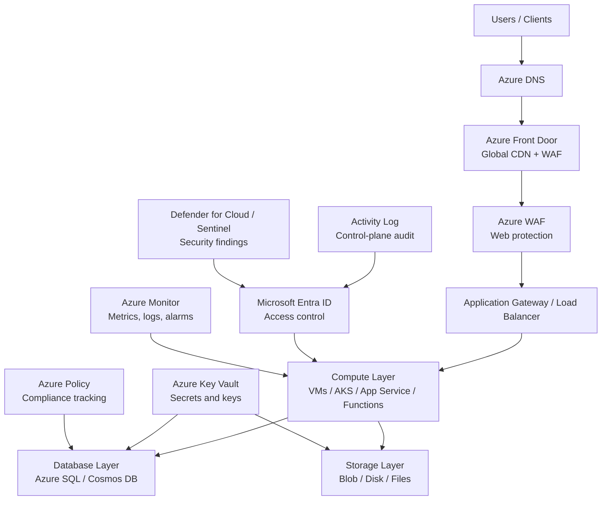
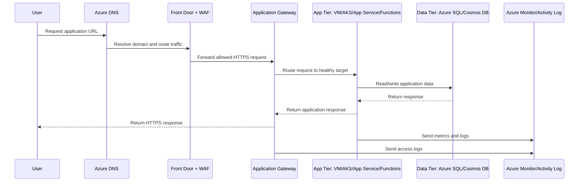
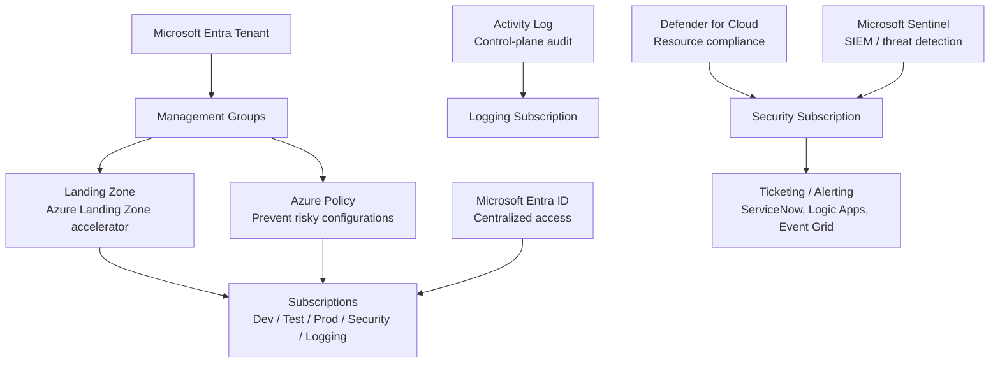

# Azure Services — Exam & Interview Ready Guide

## Table of Contents

1. [Overview](#overview)
2. [Azure Services Architecture Diagram](#azure-services-architecture-diagram)
3. [Secure 3-Tier Azure Application Flow](#secure-3-tier-azure-application-flow)
4. [Azure DevOps Deployment Flow](#azure-devops-deployment-flow)
5. [Azure Security and Governance Flow](#azure-security-and-governance-flow)
6. [Compute Services](#1-compute-services)
7. [Storage Services](#2-storage-services)
8. [Database Services](#3-database-services)
9. [Networking and Content Delivery](#4-networking-and-content-delivery)
10. [Security, Identity, and Compliance](#5-security-identity-and-compliance)
11. [Monitoring, Management, and Governance](#6-monitoring-management-and-governance)
12. [DevOps and Developer Tools](#7-devops-and-developer-tools)
13. [Migration and Hybrid Cloud](#8-migration-and-hybrid-cloud)
14. [Analytics and Data Services](#9-analytics-and-data-services)
15. [AI, ML, and Generative AI](#10-ai-ml-and-generative-ai)
16. [Application Integration](#11-application-integration)
17. [Cost Management](#12-cost-management)
18. [Most Important Azure Services to Know First](#most-important-azure-services-to-know-first)
19. [Simple Interview Answer](#simple-interview-answer)
20. [Daily Learning Notes](#daily-learning-notes)

---

## Overview

Azure provides cloud services used to design, deploy, secure, monitor, and scale modern applications. These services are grouped into categories such as compute, storage, database, networking, security, monitoring, DevOps, analytics, AI/ML, migration, and cost management.

A strong Azure engineer should understand what each service does, its defining characteristics, when to use it, and — critically for interviews — *why* it would be chosen over a similar service with respect to cost, scalability, efficiency, and security.

[⬆ Back to top](#top)

---

## Azure Services Architecture Diagram

[⬆ Back to top](#top)

---

## Secure 3-Tier Azure Application Flow

[⬆ Back to top](#top)

---

## Azure DevOps Deployment Flow

```mermaid
flowchart LR
    Dev[Developer] --> Git[GitHub / Azure Repos]
    Git --> CI["CI Pipeline<br/>Azure Pipelines / GitHub Actions"]
    CI --> Scan["Security Checks<br/>SAST, IaC scan, dependency scan"]
    Scan --> Build["Build Artifact<br/>Container image or package"]
    Build --> ACR[Azure Container Registry / Artifacts Feed]
    ACR --> Deploy["Deploy<br/>AKS / App Service / Functions / VM"]
    Deploy --> Monitor["Azure Monitor + Application Insights<br/>Monitoring and tracing"]
    Monitor --> Feedback[Feedback to team]
```

[⬆ Back to top](#top)

---

## Azure Security and Governance Flow

[⬆ Back to top](#top)

---

## 1. Compute Services

| Service | Key Features & Characteristics | Use Cases | Preferred Over the Alternative When |
|---|---|---|---|
| **Azure Virtual Machines** | Full OS-level control; wide VM series (B/D/E/F/N GPU, plus Ampere Altra Arm-based VMs for price/performance); Pay-As-You-Go/Reserved/Spot pricing; billed per second. | Hosting applications, legacy workloads, custom/licensed software. | You need OS-level access, GPU hardware, or specialized licensing — vs Functions/Container Apps, steady-state usage priced with a Reservation/Savings Plan is cheaper than per-execution billing at sustained scale. |
| **Azure Functions** | Serverless, event-driven; Consumption plan auto-scales with zero idle cost; Premium plan adds VNet integration and no cold start; billed per execution + GB-seconds (Consumption) or per instance (Premium). | Event processing, APIs, scheduled jobs, glue code. | Traffic is spiky/event-driven and you want zero idle-capacity cost — less cost-efficient than VMs for constant high-throughput workloads where per-execution pricing exceeds a flat reserved rate. |
| **Azure Container Instances (ACI)** | Serverless single containers/container groups; no orchestration layer; per-second billing; fastest way to run a container without a cluster. | Burst compute, simple batch jobs, CI/CD build agents. | You need a one-off or simple container workload without orchestration overhead — much lower operational complexity than AKS, but no built-in scaling/self-healing across many containers. |
| **Azure Kubernetes Service (AKS)** | Managed Kubernetes control plane; standard k8s API; portable across clouds; large ecosystem (Helm, operators, GitOps). | Kubernetes-based container workloads, multi-cloud strategies. | You need full Kubernetes API/ecosystem control, complex multi-service orchestration, or multi-cloud portability that outweighs the added operational complexity. |
| **Azure Container Apps** | Serverless container hosting built on Kubernetes/KEDA/Dapr under the hood, without exposing cluster management; scales to zero; built-in traffic-splitting/revisions. | Microservices, event-driven apps needing container flexibility without managing Kubernetes. | You want Kubernetes-like scaling and traffic-splitting features without operating a cluster — simpler and often cheaper than AKS for teams that don't need raw k8s API access. |
| **Azure App Service** | PaaS for web apps/APIs; built-in deployment slots (blue/green), auto-scaling, managed OS/runtime patching. | Web applications, REST APIs, mobile backends. | You want a managed platform (no OS patching) for a standard web stack — faster time-to-deploy, at the cost of flexibility for unusual runtime requirements vs raw VMs. |
| **Azure Batch** | Managed batch job scheduling/queuing across VM pools (including Spot/Low-Priority VMs); automatic pool scaling; built-in retries. | Large-scale parallel processing, rendering, scientific workloads. | The job runs longer than Functions' limits or needs large/specialized compute across many parallel nodes — pairing with Spot/Low-Priority VMs makes it the most cost-efficient option for large batch workloads. |
| **Virtual Machine Scale Sets (VMSS)** | Auto-scaling group of identical VMs; integrates with Load Balancer/Application Gateway; supports a mixed Spot/on-demand pool. | Horizontally scalable VM-based workloads. | A VM-based workload needs automatic horizontal scaling based on metrics/schedule — the standard scaling mechanism for VM compute, analogous to an AWS Auto Scaling Group. |

### Interview Keyword
Use **Virtual Machines** when you need control over servers, **Functions** for event-driven serverless workloads, **Container Apps** for serverless containers, and **AKS** when Kubernetes is required.

[⬆ Back to top](#top)

---

## 2. Storage Services

| Service | Key Features & Characteristics | Use Cases | Preferred Over the Alternative When |
|---|---|---|---|
| **Azure Blob Storage** | Object storage; Hot/Cool/Cold/Archive access tiers in one account; redundancy options (LRS/ZRS/GRS/RA-GRS); lifecycle management policies. | Backups, logs, data lakes, static websites. | You need internet-accessible, massively scalable object storage rather than a mountable filesystem — cheapest option for large, infrequently accessed data when paired with lifecycle tiering to Archive. |
| **Azure Disk Storage (Managed Disks)** | Block storage attached to a single VM; Standard HDD/SSD, Premium SSD, and Ultra Disk tiers; provisioned IOPS on Premium/Ultra. | OS disks, database data disks. | You need low-latency block-level access from exactly one VM — most cost-efficient/performant choice for that pattern, but it doesn't share across VMs. |
| **Azure Files** | Managed SMB/NFS file shares; mountable from on-prem via Azure File Sync or directly from VMs/AKS; shared concurrently across many clients. | Shared Windows/Linux file storage, lift-and-shift of on-prem file servers. | Multiple VMs/users need concurrent read/write access to the same files — Managed Disks can't do this (single-attach in most cases). |
| **Azure NetApp Files** | Enterprise-grade NAS (NFS/SMB) with NetApp ONTAP features — snapshots, cloning, cross-region replication, extreme low-latency performance tiers. | Enterprise NetApp migrations, SAP/Oracle, high-performance file workloads. | You need NetApp-specific enterprise NAS features or the highest available Azure file-storage performance tier that Azure Files doesn't offer. |
| **Azure Backup** | Centralized, policy-based backup across VMs, Azure Files, SQL/SAP HANA databases, and on-prem (via agent); cross-region restore support. | Backup VMs, Azure Files, and databases from one place. | You need one policy/schedule/audit trail across many resource types instead of managing backup schedules separately per service. |
| **Blob Storage Archive Tier** | Lowest-cost storage tier within Blob Storage (not a separate service); rehydration takes hours; priced far below Hot/Cool. | Long-term compliance retention, rarely accessed backups. | Data is rarely accessed and a multi-hour rehydration delay is acceptable — dramatically lower storage cost is the driver, at the expense of retrieval speed. |
| **Azure File Sync** | Caches Azure Files on-prem via Windows Server endpoints, tiering cold files to the cloud automatically while keeping hot files local. | Hybrid file server modernization without ripping out on-prem file servers. | On-prem systems must keep using local file-server interfaces while data is tiered to and protected in Azure. |

### Interview Keyword
Use **Blob Storage** for object storage, **Managed Disks** for VM block storage, **Azure Files** for shared file storage, and **Azure NetApp Files** for high-performance enterprise NAS.

[⬆ Back to top](#top)

---

## 3. Database Services

| Service | Key Features & Characteristics | Use Cases | Preferred Over the Alternative When |
|---|---|---|---|
| **Azure SQL Database** | Fully managed PaaS relational database (SQL Server engine); automated patching/backup; serverless compute tier available; DTU or vCore pricing models. | Modern cloud-native relational applications. | You don't need full SQL Server instance-level feature parity (cross-database queries, SQL Agent, linked servers) — cheaper and less operational overhead than Managed Instance. |
| **Azure SQL Managed Instance** | Near-100% SQL Server engine compatibility as a managed PaaS instance; supports cross-database queries, SQL Agent, CLR. | Lift-and-shift of on-prem SQL Server workloads needing full instance-level features. | The application relies on instance-scoped SQL Server features that Azure SQL Database's single-database model doesn't support. |
| **Azure Database for PostgreSQL / MySQL (Flexible Server)** | Managed open-source relational engines; Flexible Server tier gives granular compute/HA/maintenance-window control. | OSS relational workloads already built on PostgreSQL/MySQL. | The application is already built on PostgreSQL/MySQL and rewriting to T-SQL isn't worth it. |
| **Azure Cosmos DB** | Globally distributed, multi-model NoSQL database (SQL/Core, MongoDB, Cassandra, Gremlin graph, Table APIs); single-digit-ms latency SLA; multi-region active-active writes. | High-scale globally distributed apps, IoT, gaming, catalogs, graph/relationship data. | The access pattern needs massive horizontal scale, multi-region active-active writes, or flexible schema — request-unit pricing and multi-model flexibility go further than any single-region relational option, at the cost of relational query/transaction guarantees. |
| **Azure Synapse Analytics** | Unified analytics platform combining a provisioned/serverless SQL data warehouse, Spark pools, and pipeline orchestration. | Enterprise data warehousing, big data analytics, BI. | The workload is analytical (OLAP) at large scale rather than transactional (OLTP) — columnar storage and MPP architecture are built for that query shape, vs Cosmos DB/SQL DB. |
| **Azure Cache for Redis** | Managed Redis; Basic/Standard/Premium/Enterprise tiers add clustering, persistence, and geo-replication. | Session stores, leaderboards, reducing database read load. | You need a managed, highly available in-memory cache with Redis's full feature set (pub/sub, rich data structures, persistence). |
| **Azure Database for MariaDB** *(retired)* | Microsoft retired this service in September 2025 — existing workloads migrate to Azure Database for MySQL Flexible Server. | N/A — legacy name still appears in older documentation/exam material. | Never for new workloads — always choose MySQL Flexible Server instead. |

### Interview Keyword
Use **Azure SQL Database/Managed Instance** for relational workloads, **Cosmos DB** for NoSQL/global scale, **Synapse Analytics** for analytics, and **Azure Cache for Redis** for low-latency caching.

[⬆ Back to top](#top)

---

## 4. Networking and Content Delivery

| Service | Key Features & Characteristics | Use Cases | Preferred Over the Alternative When |
|---|---|---|---|
| **Azure Virtual Network (VNet)** | Logically isolated private network — subnets, route tables, NSGs; private by default. | Network segmentation and workload isolation. | Foundational — every Azure network design starts here; no real alternative. |
| **Subnets** | Divide a VNet's address space into segments, each with its own NSG/route table association; can be delegated to specific services. | Separating tiers (web/app/data), service delegation (e.g., App Service VNet Integration). | Any VNet design — this is the baseline pattern for controlling exposure and routing per tier. |
| **Route Tables (User-Defined Routes)** | Override Azure's default system routes to force traffic through a specific next hop (firewall, NVA, VPN gateway). | Forcing all outbound traffic through a central firewall (hub-and-spoke). | Traffic must be inspected/controlled centrally rather than taking Azure's default routing path. |
| **NSGs / Application Security Groups** | Stateful, rule-based traffic filtering at the subnet or NIC level; ASGs group VMs logically for rule reuse instead of hardcoding IPs. | Primary segmentation/firewalling control inside a VNet. | You need cheap, stateful east-west filtering at the resource level — pair with Azure Firewall for centralized north-south inspection. |
| **Azure NAT Gateway** | Managed, zone-resilient, outbound-only internet access for a subnet; replaces the increasingly restricted default outbound access model. | Private subnet outbound internet access (patching, updates) without inbound exposure. | You need a dedicated, SNAT-port-scalable outbound path — Azure is deprecating implicit default outbound access, making NAT Gateway the recommended pattern. |
| **Azure Load Balancer / Application Gateway / Front Door** | Load Balancer = L4, regional, extreme throughput; Application Gateway = L7 regional, content-based routing + WAF; Front Door = L7 global, CDN + WAF + global failover. | High-availability applications at regional or global scale. | Load Balancer for raw L4 performance; Application Gateway when regional L7 routing/WAF is enough; Front Door when you need global routing, caching, and failover across regions. |
| **Azure DNS** | Managed authoritative DNS hosting; alias records to Azure resources; private DNS zones for VNet-internal resolution. | Domain hosting, DNS routing, private name resolution inside a VNet. | You need alias records to Azure resources and private zone integration with VNets that a third-party DNS provider won't give you. |
| **Azure CDN / Front Door** | Edge caching of static/dynamic content close to users; Front Door bundles CDN with global L7 load balancing and WAF. | Faster global content delivery, static asset offload. | Content is cacheable — cuts both latency and origin load/cost for repeat requests. |
| **Azure Virtual WAN** | Managed hub-and-spoke networking at global scale, connecting many VNets/branches/VPN/ExpressRoute circuits through Microsoft's backbone with transitive routing. | Large-scale global network topology connecting many VNets and on-prem sites. | Connecting more than a handful of VNets/sites — VNet Peering has no transitive routing and doesn't scale past a small mesh. |
| **VNet Peering** | Direct, non-transitive connection between two VNets (can be cross-region as "Global Peering"). | Connecting a small number of VNets directly. | You're only connecting a couple of VNets and want to avoid Virtual WAN's added hub cost/complexity. |
| **Azure ExpressRoute** | Dedicated private connection to Microsoft's network, bypassing the public internet; consistent low latency/high throughput. | Hybrid connectivity requiring predictable performance at scale. | You need predictable performance and high sustained throughput and can accept a longer provisioning lead time and higher fixed cost. |
| **Azure VPN Gateway** (Site-to-Site / Point-to-Site) | Encrypted IPsec tunnel over the public internet. | Site-to-site and remote-user VPN connectivity. | You need to connect quickly and cheaply and can tolerate variable, internet-dependent latency, vs ExpressRoute's predictability and cost. |

### Interview Keyword
A secure Azure network usually includes **VNet, subnets, NSGs, route tables, NAT Gateway, Application Gateway/Load Balancer, and Azure DNS**.

[⬆ Back to top](#top)

---

## 5. Security, Identity, and Compliance

| Service | Key Features & Characteristics | Use Cases | Preferred Over the Alternative When |
|---|---|---|---|
| **Microsoft Entra ID** (formerly Azure AD) | Cloud identity provider — users, groups, app registrations, SSO, Conditional Access, MFA. | Workforce identity and access management, SSO across Microsoft 365/Azure/SaaS apps. | Foundational — the baseline identity service for essentially every other Azure security control. |
| **Azure RBAC** | Role-based access control assigning built-in/custom roles at management group/subscription/resource group/resource scope. | Least-privilege access control to Azure resources. | You're controlling access to Azure *resources* specifically — Entra ID roles instead control access to Entra ID/M365 administrative functions, a commonly confused distinction. |
| **Azure Policy** | Enforces organizational rules on resource configuration (e.g., "no public storage accounts," "must have a `CostCenter` tag") with deny/audit/deploy-if-not-exists effects. | Governance and compliance guardrails across subscriptions. | You need automated, continuously enforced configuration compliance rather than periodic manual audits. |
| **Azure Landing Zones** (Azure Landing Zone accelerator) | Pre-packaged, repeatable environment setup — policies, role assignments, and resource templates bundled together. | Standardized, compliant subscription/environment provisioning at scale. | You want a repeatable, audited baseline instead of hand-rolling governance per subscription. |
| **Azure Key Vault** | Centralized management of secrets, encryption keys, and TLS certificates in one service; supports HSM-backed keys (Managed HSM) and automatic certificate renewal. | Database credentials, API keys, encryption keys, TLS certificates. | You need centralized, auditable, access-controlled secret storage — Key Vault's single-service design covers secrets, keys, and certs together, unlike the equivalent split across multiple services in some other clouds. |
| **Managed Identities** | Automatically managed Entra ID identity for an Azure resource (VM, Function, App Service) to authenticate to other Azure services with no credentials stored anywhere. | Service-to-service authentication (e.g., a Function reading from Key Vault). | You want zero-credential-management authentication between Azure resources — eliminates an entire class of credential-leak risk vs storing a connection string/key. |
| **Microsoft Defender for Cloud** | Cloud security posture management (CSPM) plus workload protection (per-resource Defender plans — servers, storage, SQL, containers); provides a secure score and recommendations. | Continuous security posture assessment and threat protection across Azure and hybrid/multi-cloud (via Arc). | You need continuous, automated posture scoring and workload-specific threat detection in one place, rather than periodic manual reviews. |
| **Microsoft Sentinel** | Cloud-native SIEM/SOAR; ingests logs from Azure, Microsoft 365, on-prem, and third-party sources; built-in analytics rules, hunting queries, automated playbooks (via Logic Apps). | Centralized security monitoring, threat hunting, and automated incident response across the whole estate. | You need cross-source correlation (identity + endpoint + network + cloud) and SOAR-style automated response, not just Azure resource posture — vs Defender for Cloud alone. |
| **Azure DDoS Protection** | Standard tier adds adaptive tuning, attack analytics, and cost protection on top of the free Basic tier's always-on network-layer protection. | Protecting internet-facing applications from volumetric DDoS. | The business impact of a large-scale attack justifies adaptive protection, attack analytics, and billing protection beyond the free Basic tier. |
| **Azure Web Application Firewall** | L7 filtering (OWASP Core Rule Set, custom rules, rate limiting) deployed on Application Gateway or Front Door. | Protecting web applications from common exploits (SQLi, XSS). | You need to block specific malicious request *patterns*, not just absorb volumetric attack traffic — vs DDoS Protection, which handles the volumetric attack itself. |
| **Azure Firewall** | Managed, stateful network firewall and threat-intelligence-based filtering for an entire VNet/hub; centralizes egress/ingress policy. | Centralized network security policy in a hub-and-spoke topology. | You need centralized, FQDN-aware filtering and threat intelligence across many spoke VNets rather than per-subnet NSG rules. |
| **Azure Monitor Activity Log** | Records every control-plane (management) operation on Azure resources — who did what, when. | Governance, auditing, and investigations. | You're investigating *who changed a resource's configuration*, not runtime performance — complements Azure Monitor Metrics/Logs rather than replacing them. |

### Interview Keyword
Security in Azure starts with **Entra ID least privilege, MFA/Conditional Access, encryption with Key Vault, Activity Log auditing, Azure Policy compliance, Defender for Cloud, and Sentinel**.

[⬆ Back to top](#top)

---

## 6. Monitoring, Management, and Governance

| Service | Key Features & Characteristics | Use Cases | Preferred Over the Alternative When |
|---|---|---|---|
| **Azure Monitor** | Umbrella service for metrics, Log Analytics (KQL queries), alerts, dashboards, and Application Insights (APM). | Monitoring VMs, AKS, App Service, and applications end-to-end. | The default operational monitoring tool for "how is it performing" — natively integrated with virtually every Azure service. |
| **Azure Activity Log** | Control-plane audit trail (see [§5 Security](#5-security-identity-and-compliance)). | Audit and incident investigation. | You're investigating an access/change event, not runtime performance. |
| **Azure Policy** | Configuration compliance/guardrails (see [§5 Security](#5-security-identity-and-compliance)). | Compliance and drift prevention. | You need the *state* of a resource's configuration validated continuously, not just its API call log. |
| **Azure Automation / Update Manager** | Automation = runbooks, scheduled PowerShell/Python automation, Desired State Configuration; Update Manager = centralized OS patch management/scheduling across VMs and Arc-enabled servers. | Automating operational tasks, patch management at scale. | You need centralized, auditable, scheduled automation without logging into each machine to run a script or apply a patch. |
| **Azure Advisor** | Free, automated best-practice recommendations across cost, security, reliability, operational excellence, and performance. | Ongoing recommendations without manual review. | You want continuously updated, low-effort recommendations across every architecture pillar instead of periodic manual reviews. |
| **Azure Service Health** | Personalized dashboard of service issues, planned maintenance, and health advisories specifically affecting your subscriptions' resources (vs the public, account-agnostic Azure Status page). | Proactive alerts on incidents actually affecting your resources. | You need alerts scoped to your own resources, not general platform-wide status. |
| **Azure Managed Applications** | Publish a packaged, governed application definition that other teams/customers can deploy self-service. | Enterprise self-service provisioning within guardrails. | You want teams to self-serve pre-approved solutions rather than either blocking them or granting unrestricted provisioning rights. |
| **Azure Arc** | Extends Azure management (Policy, Monitor, RBAC, Defender for Cloud) to non-Azure resources — on-prem servers, other clouds' VMs, Kubernetes clusters anywhere. | Unified governance/monitoring across hybrid and multi-cloud estates. | You want one control plane applying consistent policy and monitoring regardless of where the resource actually runs. |

### Interview Keyword
For cloud operations, combine **Azure Monitor for monitoring, Activity Log for auditing, Azure Policy for compliance, and Automation/Update Manager for patching and automation**.

[⬆ Back to top](#top)

---

## 7. DevOps and Developer Tools

| Service | Key Features & Characteristics | Use Cases | Preferred Over the Alternative When |
|---|---|---|---|
| **Azure Repos** | Managed private Git repository hosting, part of Azure DevOps. | Source code hosting. | The org is standardized on the full Azure DevOps suite (Boards/Repos/Pipelines together) — GitHub (also Microsoft-owned) is increasingly the more common real-world choice, worth noting for interviews. |
| **Azure Pipelines** | CI/CD orchestration — build, test, multi-stage deployment pipelines; YAML-as-code or classic UI; Microsoft- or self-hosted agents. | Automate release pipelines across any language/platform. | The org is already invested in Azure DevOps Boards/Repos and wants pipelines integrated with that suite; otherwise GitHub Actions is often the simpler default for GitHub-hosted repos. |
| **Azure Boards** | Work item tracking (backlogs, sprints, Kanban boards) integrated with Repos/Pipelines. | Agile project management tied directly to code and releases. | You want work items linked natively to commits, PRs, and pipeline runs in one suite instead of a separate tool like Jira. |
| **ARM Templates / Bicep** | Declarative IaC; ARM templates are JSON, Bicep is a cleaner DSL that transpiles to ARM JSON; native Azure Resource Manager integration, no external state file to manage. | Provision Azure resources using templates. | You want zero additional tooling/state backend and native Azure Resource Manager rollback/deployment history — at the cost of being Azure-only, vs Terraform's multi-cloud reach; prefer Bicep over raw ARM JSON for cleaner syntax and modules. |
| **Azure Container Registry (ACR)** | Private, Entra-ID-integrated container registry; built-in vulnerability scanning (via Defender for Cloud); geo-replication. | Store Docker/OCI images. | You need private images tied to Entra ID auth, geo-replication close to AKS clusters, and native Azure security scanning, vs a public registry like Docker Hub. |
| **Application Insights** (part of Azure Monitor) | Application Performance Monitoring — distributed tracing, dependency maps, live metrics, exception tracking. | Troubleshoot microservices and APIs. | You need to pinpoint which specific service/hop in a distributed request is slow or failing — log-based debugging alone can't show the full request path. |

### Interview Keyword
A common CI/CD pipeline uses **GitHub or Azure Repos → Azure Pipelines → Azure Container Registry → AKS/App Service/Functions deployment**, with security scanning and approval gates.

[⬆ Back to top](#top)

---

## 8. Migration and Hybrid Cloud

| Service | Key Features & Characteristics | Use Cases | Preferred Over the Alternative When |
|---|---|---|---|
| **Azure Migrate** | Central hub for discovery, assessment, and migration planning/execution across servers, databases, web apps, and VDI. | Central migration dashboard and assessment tool. | You need a structured discovery/assessment phase (right-sizing, dependency mapping) before committing to a migration wave. |
| **Azure Database Migration Service** | Migrates databases with minimal downtime via continuous replication; homogeneous or heterogeneous migrations. | Migrate SQL Server, MySQL, PostgreSQL, Oracle to Azure managed databases. | You need continuous replication during a live cutover window to minimize downtime, vs a manual export/import requiring an extended outage. |
| **Azure Data Box** | Physical data transfer appliances (Data Box, Data Box Disk, Data Box Heavy) for offline bulk transfer. | Large-scale data migration where network transfer is impractical. | The dataset is so large that transfer over your available bandwidth would take weeks/months, or no reliable link exists. |
| **Azure File Sync** | Hybrid file server tiering/caching (see [§2 Storage](#2-storage-services)). | Modernizing on-prem file servers without full migration. | On-prem systems must keep local file-server interfaces while data is tiered to and protected in Azure. |
| **Azure Site Recovery** | Replicates VMs (Azure-to-Azure, on-prem-to-Azure, VMware/Hyper-V) for disaster recovery, with orchestrated failover/failback and recovery plans. | DR strategy implementation (warm-standby-style replication). | You need a tested, orchestrated failover with a defined RTO rather than restoring from backup and rebuilding infrastructure by hand. |
| **Azure Arc** | Extends Azure management/governance to hybrid and multi-cloud resources (see [§6 Monitoring](#6-monitoring-management-and-governance)). | Unified governance across hybrid/multi-cloud estates during and after migration. | You want consistent policy and monitoring applied to resources that haven't (or won't) fully move to Azure. |
| **Azure Stack HCI / Azure Stack Edge** | Azure-consistent infrastructure running on-premises (HCI = hyperconverged cluster; Edge = ruggedized appliance with local compute/AI). | Workloads needing ultra-low-latency or strict data-residency requirements forcing on-site processing. | The workload must physically stay on-site (latency, disconnected operation, or a data-residency mandate) that rules out a public Azure region. |
| **Azure ExpressRoute** | Dedicated hybrid connectivity at scale (see [§4 Networking](#4-networking-and-content-delivery)). | Hybrid cloud connectivity requiring predictable performance. | Sustained high-throughput hybrid connectivity is needed for an ongoing migration or steady-state hybrid architecture. |

### Interview Keyword
Use **Database Migration Service** for databases, **Azure Migrate** for discovery/assessment, **Data Box** for large offline transfers, and **ExpressRoute/VPN Gateway** for hybrid connectivity.

[⬆ Back to top](#top)

---

## 9. Analytics and Data Services

| Service | Key Features & Characteristics | Use Cases | Preferred Over the Alternative When |
|---|---|---|---|
| **Azure Synapse Analytics** | Unified platform combining a provisioned/serverless SQL data warehouse, Spark pools, and pipeline orchestration (see [§3 Database](#3-database-services)). | Enterprise data warehousing, big data analytics, BI. | The workload needs a single platform spanning warehousing, Spark processing, and orchestration together. |
| **Azure Data Factory** | Serverless data integration/ETL/ELT orchestration; 90+ built-in connectors; visual pipeline designer. | Prepare and move data for analytics across hybrid sources. | The primary need is orchestration/movement/transformation of data between many sources rather than heavy custom Spark code — vs Databricks. |
| **Azure Databricks** | Managed Apache Spark-based analytics platform (Microsoft/Databricks joint offering); notebooks, Delta Lake, MLflow integration. | Large-scale custom big-data processing and collaborative data science. | You need custom, code-heavy Spark transformations or a full data science/ML workbench, not just pipeline orchestration. |
| **Azure Stream Analytics** | Real-time stream processing using a SQL-like query language directly over Event Hubs/IoT Hub/Blob input. | Real-time analytics on streaming data (IoT telemetry, clickstreams). | The transformation logic fits a SQL-like windowed query and you want a managed, serverless option with no cluster to run. |
| **Azure Event Hubs** | High-throughput event/telemetry ingestion service (Kafka-compatible endpoint available); partitioned, replayable log. | Big-data event streaming ingestion at massive scale (millions of events/sec). | The pattern is high-throughput telemetry/event streaming with multiple independent consumers reading at their own pace, not transactional message queuing — vs Service Bus. |
| **Azure Data Explorer (Kusto/ADX)** | Purpose-built for fast, ad-hoc analytics over large volumes of log/telemetry/time-series data using KQL. | Log analytics, time-series analysis, IoT telemetry exploration at scale. | The workload is exploratory analytics over massive semi-structured/time-series data where KQL's speed and flexibility outperform traditional SQL for that query shape. |
| **Power BI** | Business intelligence and dashboarding, tightly integrated with Synapse/Azure SQL/Excel/M365; per-user or per-capacity licensing. | Dashboards and reporting. | You want a mature, widely adopted BI tool with native Microsoft ecosystem integration, especially for orgs already on Microsoft 365. |
| **Microsoft Purview** | Unified data governance — data catalog, classification/labeling of sensitive data, lineage tracking across Azure and hybrid sources. | Secure data lake/estate governance, PII discovery for compliance. | You need automated discovery, classification, and lineage across a large, growing data estate instead of manually tagging/tracking sources. |
| **Azure Data Lake Storage (Gen2)** | Blob Storage with a hierarchical namespace layered on top, purpose-built for big-data analytics workloads. | The storage layer underneath a data lake (Synapse/Databricks read directly from it). | Analytics engines need efficient directory-level operations and fine-grained POSIX-like ACLs that flat-namespace Blob Storage doesn't offer. |

### Interview Keyword
A common Azure data lake design uses **Data Lake Storage Gen2, Data Factory, Purview, Synapse Analytics, and Power BI**.

[⬆ Back to top](#top)

---

## 10. AI, ML, and Generative AI

| Service | Key Features & Characteristics | Use Cases | Preferred Over the Alternative When |
|---|---|---|---|
| **Azure Machine Learning** | Full ML lifecycle platform — managed notebooks, training compute clusters, AutoML, MLOps pipelines, model registry/deployment endpoints. | Custom machine learning model lifecycle management. | You need a model trained on your own data/architecture, not just calling a pre-trained foundation model — vs Azure OpenAI Service. |
| **Azure OpenAI Service** | Managed API access to OpenAI's models (GPT, embeddings, DALL-E, Whisper) plus Azure-specific governance (private networking, content filtering, Entra ID auth, regional data residency). | Generative AI applications — chat, summarization, content generation, RAG. | You want to build generative AI features quickly via API calls with enterprise governance built in, rather than training/hosting your own model. |
| **Azure AI Foundry** (formerly Azure AI Studio) | Unified platform for building, evaluating, and deploying AI applications across Azure OpenAI and other foundation models, plus custom models; prompt flow, evaluation, and agent orchestration tooling. | Building and productionizing generative AI applications end-to-end. | You need built-in evaluation, prompt engineering tooling, and orchestration across multiple models/agents in one workspace, beyond calling Azure OpenAI directly. |
| **Microsoft Copilot / Copilot Studio** | Copilot = AI assistant embedded across Microsoft 365/GitHub/Azure; Copilot Studio = low-code tool for building custom copilots/agents grounded in your own data. | Developer and enterprise productivity, custom internal AI assistants. | You want a managed, low-code way to ground an assistant in enterprise data (SharePoint, Dataverse, APIs) without building a custom RAG pipeline. |
| **Azure AI Vision** | Pre-trained image/video analysis API — object detection, OCR, spatial analysis, content moderation. | Image/video understanding without training a custom model. | The use case matches Vision's pre-built capabilities — far cheaper/faster than training and hosting a custom computer-vision model. |
| **Azure AI Language** | Pre-trained NLP API — sentiment analysis, entity recognition, key phrase extraction, PII detection, summarization. | Sentiment and text analysis. | The task matches Language's built-in capabilities — no training data or ML expertise required. |
| **Azure AI Document Intelligence** (formerly Form Recognizer) | OCR plus structured data extraction from documents (forms, invoices, receipts, tables). | Automated document/forms processing. | You need structured extraction (form fields, table cells, key-value pairs), not just raw text. |
| **Azure AI Bot Service / Copilot Studio** | Framework and hosting for building conversational bots, with Copilot Studio providing the low-code authoring layer. | Chatbots and voice bots. | You want managed intent recognition and multi-channel deployment (Teams, web, voice) without building NLU from scratch. |
| **Azure AI Speech** | Combined text-to-speech (neural voices, many languages) and speech-to-text (real-time and batch transcription, speaker diarization, custom vocabulary). | Voice applications, audio transcription. | You need natural-sounding synthesis or accurate transcription without building/training your own acoustic models. |
| **Azure AI Translator** | Neural machine translation API across many language pairs, plus document translation. | Multilingual applications. | You need fast, good-enough translation without building/maintaining a custom translation model. |

### Interview Keyword
Use **Azure OpenAI Service** for generative AI applications, **Azure Machine Learning** for custom ML model lifecycle, and **AI Speech/AI Bot Service** for conversational AI.

[⬆ Back to top](#top)

---

## 11. Application Integration

| Service | Key Features & Characteristics | Use Cases | Preferred Over the Alternative When |
|---|---|---|---|
| **Azure Queue Storage** | Simple, low-cost message queue (part of a Storage account); at-least-once delivery, large capacity, simpler feature set than Service Bus. | Basic decoupling of application components. | You need a very cheap, simple queue and don't need topics/subscriptions, sessions, or dead-lettering with advanced routing. |
| **Azure Service Bus** | Enterprise messaging — queues and topics/subscriptions (pub/sub), FIFO sessions, dead-lettering, duplicate detection, transactions. | Decoupling and pub/sub in enterprise applications. | You need topic-based fan-out to multiple subscribers, guaranteed ordering (sessions), or enterprise messaging features Queue Storage doesn't offer. |
| **Azure Event Grid** | Fully managed event routing service with native Azure resource event sources (e.g., Blob created) and content-based filtering/routing to many handler types. | Event-driven architecture, reacting to Azure resource changes. | Routing depends on event content/type across many disparate sources and you want native Azure-resource event triggers, not a message queue between two known parties. |
| **Azure Logic Apps** | Low-code, visual workflow orchestration with 1,400+ built-in connectors (Microsoft and third-party SaaS); built-in retries and error handling. | Multi-step business process automation, SaaS integration. | The workflow is mostly connecting existing systems/SaaS with minimal custom logic — the visual designer and connector library dramatically cut development time vs hand-coding each integration. |
| **Azure API Management** | Managed API gateway/front door — throttling, auth, request transformation, developer portal, versioning. | REST, HTTP, and WebSocket API management. | You need per-client throttling, a unified API catalog/developer portal, or a single front door across many backend services. |
| **Azure Functions (event triggers)** | Serverless compute triggered directly by Event Grid/Service Bus/Queue Storage/Event Hubs events (see [§1 Compute](#1-compute-services)). | The compute target most commonly invoked by the integration layer. | The integration event needs custom code execution rather than a no-code connector — pairs naturally with Event Grid/Logic Apps for the surrounding workflow. |

### Interview Keyword
Use **Queue Storage** for simple queueing, **Service Bus** for enterprise messaging/pub-sub, **Event Grid** for event routing, and **Logic Apps** for workflow orchestration.

[⬆ Back to top](#top)

---

## 12. Cost Management

| Service | Key Features & Characteristics | Use Cases | Preferred Over the Alternative When |
|---|---|---|---|
| **Microsoft Cost Management** | Visualizes and analyzes historical spend/usage trends across subscriptions/management groups; custom views and cost allocation via tags. | View and forecast Azure spend. | You're investigating why a bill changed — the natural first stop before Budgets (forward-looking) or exported usage data (most granular). |
| **Budgets** (within Cost Management) | Proactive alerts when spend/usage crosses a defined threshold, at subscription/resource group/management group scope. | Notify when spend exceeds limits. | You need forward-looking alerts, not just historical analysis — vs Cost Management views, which only look backward. |
| **Cost Management Exports** | Scheduled, detailed usage/cost data exported to a storage account for custom analysis (Power BI, Synapse). | FinOps reporting and chargeback analysis. | You need line-item detail for custom BI dashboards or chargeback models that the built-in Cost Management UI can't provide. |
| **Azure Reservations** | Discount (up to ~72%) for committing to specific VM/database/other resource usage for 1 or 3 years. | Lower VM, SQL Database, and other resource costs. | The workload is very stable/predictable (exact VM family/region won't change) and you want the marginally deeper discount reservations sometimes offer for that exact commitment. |
| **Azure Savings Plans for Compute** | Flexible $/hour compute commitment (1 or 3 year) applying automatically across VMs, Container Instances, and App Service regardless of family/region/OS. | Reduce compute cost with flexibility. | Workload composition (VM family, region) may change over the commitment period — Savings Plans flex with usage, unlike Reservations tied to specific resource attributes. |
| **Azure Hybrid Benefit** | Apply existing on-premises Windows Server and SQL Server licenses (with Software Assurance) toward Azure compute, cutting costs beyond Reservations/Savings Plans alone. | Migrating licensed Microsoft workloads to Azure. | The organization already owns eligible on-prem licenses — a uniquely Azure cost lever with no direct equivalent in most other clouds. |
| **Azure Pricing Calculator** | Free tool to estimate architecture cost before deployment. | Estimate architecture cost before deployment. | You want a Microsoft-maintained, service-accurate cost estimate during the design phase, before committing to an architecture. |

### Interview Keyword
FinOps in Azure includes **tagging, Budgets, Cost Management exports, Azure Advisor, Reservations/Savings Plans, and Azure Hybrid Benefit**.

[⬆ Back to top](#top)

---

## Most Important Azure Services to Know First

1. Microsoft Entra ID
2. Azure Virtual Network (VNet)
3. Azure Virtual Machines
4. Azure Blob Storage
5. Azure Disk Storage
6. Azure Files
7. Azure SQL Database
8. Azure Cosmos DB
9. Azure Functions
10. Azure Monitor
11. Azure Activity Log
12. Azure DNS
13. Load Balancer / Application Gateway
14. Virtual Machine Scale Sets
15. Azure Key Vault
16. Azure RBAC
17. Azure Kubernetes Service (AKS)
18. Azure Container Apps
19. ARM Templates / Bicep
20. Azure Automation / Update Manager
21. Management Groups
22. Azure Landing Zones

[⬆ Back to top](#top)

---

## Simple Interview Answer

Azure services are cloud-based building blocks used to design, deploy, secure, monitor, and scale applications. The major service categories include compute, storage, databases, networking, security, monitoring, DevOps, analytics, AI/ML, and cost management.

For example, **Virtual Machines** provide compute, **Blob Storage** provides object storage, **Azure SQL Database** provides a managed relational database, **Virtual Network** provides network isolation, **Microsoft Entra ID** manages access control, and **Azure Monitor** provides monitoring and alerts.

A well-designed Azure solution combines these services to achieve scalability, high availability, security, automation, and cost optimization — and picking between similar-looking services almost always comes down to a specific trade-off: cost model (pay-per-use vs provisioned), scalability ceiling, operational efficiency (managed vs self-run), or a security/compliance requirement that only one option satisfies.

[⬆ Back to top](#top)

---

## Daily Learning Notes

### What to Practice

- Create a Virtual Machine in a public subnet.
- Create a Blob Storage account with encryption enabled.
- Create Entra ID users, groups, and role assignments.
- Build a VNet with public and private subnets.
- Create an Azure Monitor alert for VM CPU utilization.
- Deploy a simple application using AKS or Container Apps.
- Create an Azure SQL Database in a private subnet.
- Use Azure Bastion or Just-In-Time VM access instead of open RDP/SSH.
- Enable Activity Log export and Azure Policy for governance.
- Review costs using Microsoft Cost Management and Budgets.

### Key Architecture Principle

A strong Azure architecture should be:

- Secure
- Highly available
- Fault tolerant
- Scalable
- Automated
- Observable
- Cost optimized

[⬆ Back to top](#top)
