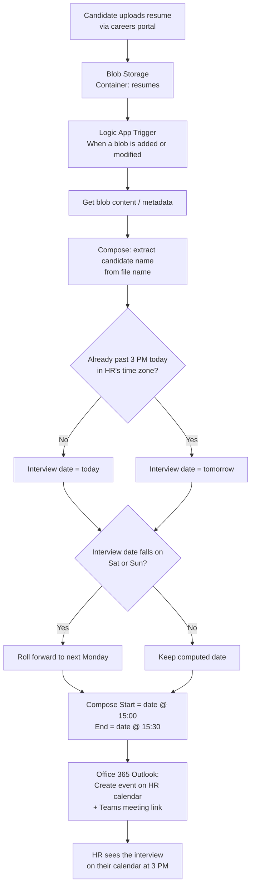
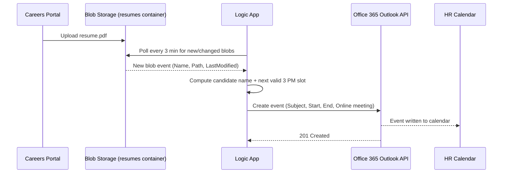

<a id="top"></a>

# Logic App: Auto-Schedule an Interview When a Resume Lands in Blob Storage

## Table of Contents

1. [Scenario](#scenario)
2. [Architecture Diagram](#architecture-diagram)
3. [Runtime Sequence](#runtime-sequence)
4. [Trigger](#trigger)
5. [Actions](#actions)
6. [Full Workflow Definition (JSON)](#full-workflow-definition-json)
7. [ARM Deployment Wrapper](#arm-deployment-wrapper)
8. [Build It in the Portal](#build-it-in-the-portal)
9. [Edge Cases Handled](#edge-cases-handled)
10. [Possible Enhancements](#possible-enhancements)
11. [Interview Keyword](#interview-keyword)

---

## Scenario

A company's careers portal lets candidates upload resumes, which land as blobs in an
Azure Storage Account. The HR person (in this design, the signed-in Office 365
account) wants a calendar meeting **automatically created at 3 PM** to interview the
candidate — no manual scheduling step.

Core building blocks: **Azure Blob Storage** (candidate resume lands here) →
**Azure Logic App (Consumption)** (event-driven orchestration, zero infrastructure
to manage) → **Office 365 Outlook connector** (creates the calendar event directly
on the HR person's calendar, with an optional Teams meeting link attached).

[⬆ Back to top](#top)

---

## Architecture Diagram



[⬆ Back to top](#top)

---

## Runtime Sequence



[⬆ Back to top](#top)

---

## Trigger

| Setting | Value |
|---|---|
| Connector | Azure Blob Storage |
| Trigger | **When a blob is added or modified (properties only)** |
| Container | `resumes` |
| Polling interval | Every 3 minutes |
| Why "properties only"? | Cheaper/faster than pulling full content on every poll — content is fetched separately, only for blobs that actually fired the trigger. |

[⬆ Back to top](#top)

---

## Actions

| # | Action | Purpose |
|---|---|---|
| 1 | **Get blob content using path** | Fetch the resume so it can be attached or linked in the invite body. |
| 2 | **Compose – CandidateName** | Strip the file extension from the blob's display name (e.g., `jane_doe_resume.pdf` → `jane_doe_resume`). |
| 3 | **Compose – LocalNow** | `convertTimeZone(utcNow(), 'UTC', 'Eastern Standard Time')` — never schedule off raw UTC, or "3 PM" drifts with the server's time zone. |
| 4 | **Condition – Past 3 PM already?** | If the resume arrives after 3 PM local time, push the interview to the next day rather than scheduling a meeting in the past. |
| 5 | **Switch – Weekend roll-forward** | If the computed date is a Saturday or Sunday, roll forward to the following Monday. |
| 6 | **Compose – Start / End** | `<date>T15:00:00` / `<date>T15:30:00` (30-minute interview slot). |
| 7 | **Create event (V4)** — Office 365 Outlook | Writes the meeting to the HR person's calendar, subject `Interview: <CandidateName>`, with `IsOnlineMeeting: true` so Teams generates a join link automatically. |

[⬆ Back to top](#top)

---

## Full Workflow Definition (JSON)

This is the Workflow Definition Language (WDL) body you'd see under **Logic App →
Development Tools → Code View**. Connector-internal fields the Designer
auto-generates (like the Blob trigger's `folderId`, or the exact Office 365
`Create event` schema) are shown as placeholders — build the two connector steps
once in the Designer and it will fill those in correctly.

```json
{
  "definition": {
    "$schema": "https://schema.management.azure.com/providers/Microsoft.Logic/schemas/2016-06-01/workflowdefinition.json#",
    "contentVersion": "1.0.0.0",
    "parameters": {
      "$connections": {
        "type": "Object",
        "defaultValue": {}
      },
      "interviewTimeZone": {
        "type": "String",
        "defaultValue": "Eastern Standard Time"
      }
    },
    "triggers": {
      "When_a_blob_is_added_or_modified": {
        "type": "ApiConnection",
        "recurrence": {
          "frequency": "Minute",
          "interval": 3
        },
        "inputs": {
          "host": {
            "connection": { "referenceName": "azureblob" }
          },
          "method": "get",
          "path": "/datasets/default/triggers/batch/onupdatedfile",
          "queries": {
            "folderId": "<base64-encoded-path-to-/resumes>",
            "maxFileCount": 10
          }
        },
        "splitOn": "@triggerBody()?['value']"
      }
    },
    "actions": {
      "Get_blob_content": {
        "type": "ApiConnection",
        "runAfter": {},
        "inputs": {
          "host": { "connection": { "referenceName": "azureblob" } },
          "method": "get",
          "path": "/datasets/default/files/@{encodeURIComponent(triggerBody()?['Path'])}/content",
          "queries": { "inferContentType": true }
        }
      },
      "Compose_CandidateName": {
        "type": "Compose",
        "runAfter": { "Get_blob_content": ["Succeeded"] },
        "inputs": "@first(split(triggerBody()?['DisplayName'], '.'))"
      },
      "Compose_LocalNow": {
        "type": "Compose",
        "runAfter": { "Compose_CandidateName": ["Succeeded"] },
        "inputs": "@convertTimeZone(utcNow(), 'UTC', parameters('interviewTimeZone'))"
      },
      "Initialize_InterviewDate": {
        "type": "InitializeVariable",
        "runAfter": { "Compose_LocalNow": ["Succeeded"] },
        "inputs": {
          "variables": [
            {
              "name": "InterviewDate",
              "type": "string",
              "value": "@formatDateTime(outputs('Compose_LocalNow'), 'yyyy-MM-dd')"
            }
          ]
        }
      },
      "Condition_Past_3PM_Already": {
        "type": "If",
        "runAfter": { "Initialize_InterviewDate": ["Succeeded"] },
        "expression": {
          "and": [
            {
              "greaterOrEquals": [
                "@formatDateTime(outputs('Compose_LocalNow'), 'HH:mm:ss')",
                "15:00:00"
              ]
            }
          ]
        },
        "actions": {
          "Set_InterviewDate_Tomorrow": {
            "type": "SetVariable",
            "inputs": {
              "name": "InterviewDate",
              "value": "@formatDateTime(addDays(outputs('Compose_LocalNow'), 1), 'yyyy-MM-dd')"
            }
          }
        },
        "else": { "actions": {} }
      },
      "Switch_Weekend_Roll_Forward": {
        "type": "Switch",
        "runAfter": { "Condition_Past_3PM_Already": ["Succeeded"] },
        "expression": "@dayOfWeek(variables('InterviewDate'))",
        "cases": {
          "Saturday": {
            "case": 6,
            "actions": {
              "Set_InterviewDate_Monday_From_Sat": {
                "type": "SetVariable",
                "inputs": {
                  "name": "InterviewDate",
                  "value": "@formatDateTime(addDays(variables('InterviewDate'), 2), 'yyyy-MM-dd')"
                }
              }
            }
          },
          "Sunday": {
            "case": 0,
            "actions": {
              "Set_InterviewDate_Monday_From_Sun": {
                "type": "SetVariable",
                "inputs": {
                  "name": "InterviewDate",
                  "value": "@formatDateTime(addDays(variables('InterviewDate'), 1), 'yyyy-MM-dd')"
                }
              }
            }
          }
        },
        "default": { "actions": {} }
      },
      "Compose_InterviewStart": {
        "type": "Compose",
        "runAfter": { "Switch_Weekend_Roll_Forward": ["Succeeded"] },
        "inputs": "@concat(variables('InterviewDate'), 'T15:00:00')"
      },
      "Compose_InterviewEnd": {
        "type": "Compose",
        "runAfter": { "Compose_InterviewStart": ["Succeeded"] },
        "inputs": "@concat(variables('InterviewDate'), 'T15:30:00')"
      },
      "Create_event_V4": {
        "type": "ApiConnection",
        "runAfter": { "Compose_InterviewEnd": ["Succeeded"] },
        "inputs": {
          "host": { "connection": { "referenceName": "office365" } },
          "method": "post",
          "path": "/datasets/calendars/v2/table/items",
          "body": {
            "Subject": "Interview: @{outputs('Compose_CandidateName')}",
            "Start": "@{outputs('Compose_InterviewStart')}",
            "End": "@{outputs('Compose_InterviewEnd')}",
            "TimeZone": "@{parameters('interviewTimeZone')}",
            "Location": "Microsoft Teams Meeting",
            "IsOnlineMeeting": true,
            "IsHtml": true,
            "Body": "Interview for candidate @{outputs('Compose_CandidateName')}. Resume: @{triggerBody()?['Path']}"
          }
        },
        "runtimeConfiguration": {
          "retryPolicy": { "type": "exponential", "count": 3, "interval": "PT10S" }
        }
      }
    },
    "outputs": {}
  }
}
```

[⬆ Back to top](#top)

---

## ARM Deployment Wrapper

Wraps the definition above into a deployable `Microsoft.Logic/workflows` resource
(consistent with the ARM Templates/Bicep pattern in
[azure-services.md §7](azure-services.md#7-devops-and-developer-tools)):

```json
{
  "$schema": "https://schema.management.azure.com/schemas/2019-04-01/deploymentTemplate.json#",
  "contentVersion": "1.0.0.0",
  "parameters": {
    "logicAppName": { "type": "string", "defaultValue": "la-resume-interview-scheduler" },
    "location": { "type": "string", "defaultValue": "[resourceGroup().location]" }
  },
  "resources": [
    {
      "type": "Microsoft.Logic/workflows",
      "apiVersion": "2019-05-01",
      "name": "[parameters('logicAppName')]",
      "location": "[parameters('location')]",
      "properties": {
        "state": "Enabled",
        "definition": "<paste the definition object from above here>",
        "parameters": {
          "$connections": {
            "value": {
              "azureblob": {
                "connectionId": "[resourceId('Microsoft.Web/connections', 'azureblob')]",
                "connectionName": "azureblob",
                "id": "[subscriptionResourceId('Microsoft.Web/locations/managedApis', parameters('location'), 'azureblob')]"
              },
              "office365": {
                "connectionId": "[resourceId('Microsoft.Web/connections', 'office365')]",
                "connectionName": "office365",
                "id": "[subscriptionResourceId('Microsoft.Web/locations/managedApis', parameters('location'), 'office365')]"
              }
            }
          }
        }
      }
    }
  ]
}
```

The `Microsoft.Web/connections` resources for `azureblob` and `office365` (and the
Office 365 OAuth consent) still need to be created/authorized separately — that
consent step can't be scripted headlessly, which is why the Portal walkthrough
below is the realistic first-deployment path.

[⬆ Back to top](#top)

---

## Build It in the Portal

1. **Storage Account** → create container `resumes` (this is where the portal's
   upload feature should write candidate files).
2. **Logic App (Consumption)** → create in the same region as the storage account.
3. Open **Logic App Designer** → add trigger **Azure Blob Storage – "When a blob is
   added or modified (properties only)"** → point it at the `resumes` container →
   set polling interval to 3 minutes.
4. Add action **Azure Blob Storage – "Get blob content using path"**, path = trigger's
   `Path` output.
5. Add a **Compose** action to strip the file extension from `DisplayName`.
6. Add **Compose** (`convertTimeZone`) + **Initialize/Set variable** + **Condition**
   + **Switch** actions as laid out above to compute the next valid weekday 3 PM slot.
7. Add action **Office 365 Outlook – "Create event (V4)"** → sign in with the HR
   account when prompted (this is the one-time OAuth consent step) → map Subject,
   Start, End, Time Zone from the previous actions → toggle **"Is online meeting?"**
   to Yes for an auto-generated Teams link.
8. **Save**, then upload a test PDF into the `resumes` container and confirm the
   event lands on the calendar within ~3 minutes.

[⬆ Back to top](#top)

---

## Edge Cases Handled

| Case | Handling |
|---|---|
| Resume uploaded after 3 PM local time | Interview rolls to the next day instead of being scheduled in the past. |
| Resume uploaded Friday evening / over the weekend | Rolls forward to the following Monday, not Saturday/Sunday. |
| Server clock vs. business time zone | All "is it past 3 PM" logic runs against `convertTimeZone` output, never raw `utcNow()`. |
| Transient Office 365 API failure | `retryPolicy` on `Create_event_V4` (3 attempts, exponential backoff) before the run is marked failed. |

[⬆ Back to top](#top)

---

## Possible Enhancements

- **Azure AI Document Intelligence** to actually parse the candidate's name/email/
  phone out of the resume PDF instead of relying on the file name — see
  [azure-services.md §10](azure-services.md#10-ai-ml-and-generative-ai) — then add
  the candidate as a real `Attendees` entry so they get the invite too.
- **Approvals connector** if a hiring manager should approve the slot before it's
  booked, rather than auto-booking unconditionally.
- Swap the polling Blob trigger for an **Event Grid**-triggered Logic App
  (`Microsoft.Storage.BlobCreated`) for near-instant reaction instead of a 3-minute
  poll — see [azure-services.md §11](azure-services.md#11-application-integration).

[⬆ Back to top](#top)

---

## Interview Keyword

A resume-to-interview Logic App is a textbook **event-driven orchestration**
pattern: **Blob Storage trigger → conditional business-time-zone logic → Office
365 Outlook connector** — no custom compute, no servers, fully declarative. The
same shape (storage event → business-rule branching → SaaS connector action)
generalizes to almost any "when X lands, do Y in a SaaS system" automation, which
is exactly the class of problem Logic Apps is built for over hand-rolling it with
Functions.

[⬆ Back to top](#top)
