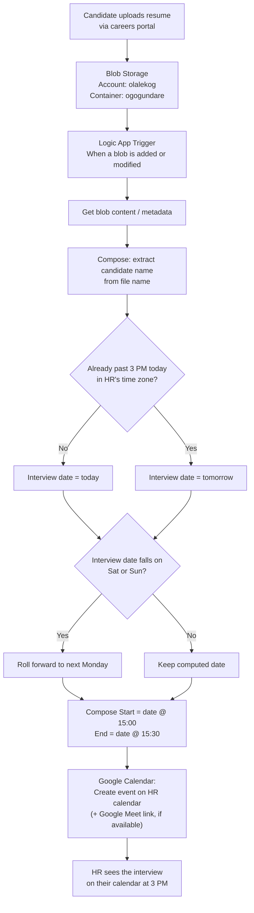
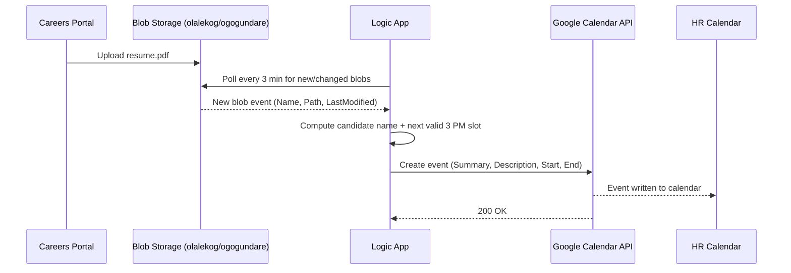

<a id="top"></a>

# Logic App: Auto-Schedule an Interview When a Resume Lands in Blob Storage

## Table of Contents

1. [Scenario](#scenario)
2. [Architecture Diagram](#architecture-diagram)
3. [Runtime Sequence](#runtime-sequence)
4. [Trigger](#trigger)
5. [Actions](#actions)
6. [Full Workflow Definition (JSON)](#full-workflow-definition-json)
7. [ARM Deployment Wrapper](#arm-deployment-wrapper)
8. [Build It in the Portal](#build-it-in-the-portal)
9. [Edge Cases Handled](#edge-cases-handled)
10. [Possible Enhancements](#possible-enhancements)
11. [Interview Keyword](#interview-keyword)

---

## Scenario

A company's careers portal lets candidates upload resumes, which land as blobs in an
Azure Storage Account. The HR person (in this design, the signed-in Google account)
wants a calendar meeting **automatically created at 3 PM** to interview the
candidate — no manual scheduling step.

**This environment**: storage account `olalekog`, container `ogogundare`, HR
calendar account `ogogundare@gmail.com`.

> **Why Google Calendar instead of Office 365 Outlook?** The Office 365 Outlook
> connector authenticates via the Microsoft identity platform — it only accepts a
> real Microsoft account or a Microsoft 365/Entra ID work account with an actual
> Exchange Online mailbox behind it. A custom-domain address (e.g.
> `name@yourcompany.tech`) only works there once that domain is verified in a
> Microsoft 365 tenant and the mailbox is provisioned/licensed. Since the HR
> account here is a plain Gmail address with no Microsoft 365 tenant behind it,
> this design uses the **Google Calendar connector** instead — it authenticates
> with a standard Google OAuth consent screen and works immediately with any
> Gmail account.

Core building blocks: **Azure Blob Storage** (candidate resume lands here) →
**Azure Logic App (Consumption)** (event-driven orchestration, zero infrastructure
to manage) → **Google Calendar connector** (creates the calendar event directly
on the HR person's calendar (a Google Meet link can be added too, if the
connector's Designer offers that option).

[⬆ Back to top](#top)

---

## Architecture Diagram



[⬆ Back to top](#top)

---

## Runtime Sequence



[⬆ Back to top](#top)

---

## Trigger

| Setting | Value |
|---|---|
| Connector | Azure Blob Storage |
| Trigger | **When a blob is added or modified (properties only)** |
| Storage account | `olalekog` |
| Container | `ogogundare` |
| Polling interval | Every 3 minutes |
| Why "properties only"? | Cheaper/faster than pulling full content on every poll — content is fetched separately, only for blobs that actually fired the trigger. |

[⬆ Back to top](#top)

---

## Actions

| # | Action | Purpose |
|---|---|---|
| 1 | **Get blob content using path** | Fetch the resume so it can be attached or linked in the invite body. |
| 2 | **Compose – CandidateName** | Strip the file extension from the blob's display name (e.g., `jane_doe_resume.pdf` → `jane_doe_resume`). |
| 3 | **Compose – LocalNow** | `convertTimeZone(utcNow(), 'UTC', 'Eastern Standard Time')` — never schedule off raw UTC, or "3 PM" drifts with the server's time zone. |
| 4 | **Condition – Past 3 PM already?** | If the resume arrives after 3 PM local time, push the interview to the next day rather than scheduling a meeting in the past. |
| 5 | **Switch – Weekend roll-forward** | If the computed date is a Saturday or Sunday, roll forward to the following Monday. |
| 6 | **Compose – Start / End** | `<date>T15:00:00` / `<date>T15:30:00` (30-minute interview slot, naive local time). |
| 7 | **Compose – Start / End (UTC)** | Converts each naive local timestamp to an explicit UTC value ending in `Z` (e.g. `2026-08-06T19:00:00Z`) — required because Google's API rejects a `dateTime` with no offset, and this connector has no separate time-zone field to supply one another way. |
| 8 | **Create event** — Google Calendar | Writes the meeting to the HR person's calendar: `start`/`end` from the UTC Compose actions, summary `Interview: <CandidateName>`, description including the resume's blob path. |

[⬆ Back to top](#top)

---

## Full Workflow Definition (JSON)

This is the Workflow Definition Language (WDL) body you'd see under **Logic App →
Development Tools → Code View**. The `Create_event_Google` action below reflects
the *actual* schema the Google Calendar connector generates — a flat `start`/`end`
string pair and a `/calendars/{calendarId}/events` path — confirmed against a real
exported Logic App, not the raw Google Calendar REST API shape (which nests
`start`/`end` as `{dateTime, timeZone}` objects). The Blob trigger's `folderId`
below is base64 of `/ogogundare` (the container root); if the Designer generates a
different encoded value for your connection, use its version instead.

**A time zone is required, not optional**: Google Calendar's API rejects a
`start`/`end` `dateTime` with no offset and no accompanying `timeZone` — it
returns `400 "Missing time zone definition for start/end time"` rather than
silently falling back to the calendar's default. This connector's Create event
action has no separate Start/End time zone fields to set, so instead of relying
on one, `Compose_InterviewStart`/`Compose_InterviewEnd` (naive local time) each
get converted to an explicit UTC timestamp ending in `Z` — e.g.
`2026-08-06T19:00:00Z` — via `Compose_InterviewStartUtc`/`Compose_InterviewEndUtc`
below. A trailing `Z` is itself a complete, unambiguous offset, so Google's API
is satisfied without needing any zone field at all.

```json
{
  "definition": {
    "$schema": "https://schema.management.azure.com/providers/Microsoft.Logic/schemas/2016-06-01/workflowdefinition.json#",
    "contentVersion": "1.0.0.0",
    "parameters": {
      "$connections": {
        "type": "Object",
        "defaultValue": {}
      },
      "interviewTimeZone": {
        "type": "String",
        "defaultValue": "Eastern Standard Time"
      }
    },
    "triggers": {
      "When_a_blob_is_added_or_modified": {
        "type": "ApiConnection",
        "recurrence": {
          "frequency": "Minute",
          "interval": 3
        },
        "inputs": {
          "host": {
            "connection": { "referenceName": "azureblob" }
          },
          "method": "get",
          "path": "/datasets/default/triggers/batch/onupdatedfile",
          "queries": {
            "folderId": "L29nb2d1bmRhcmU=",
            "maxFileCount": 10
          }
        },
        "splitOn": "@triggerBody()?['value']"
      }
    },
    "actions": {
      "Get_blob_content": {
        "type": "ApiConnection",
        "runAfter": {},
        "inputs": {
          "host": { "connection": { "referenceName": "azureblob" } },
          "method": "get",
          "path": "/datasets/default/files/@{encodeURIComponent(triggerBody()?['Path'])}/content",
          "queries": { "inferContentType": true }
        }
      },
      "Compose_CandidateName": {
        "type": "Compose",
        "runAfter": { "Get_blob_content": ["Succeeded"] },
        "inputs": "@first(split(triggerBody()?['DisplayName'], '.'))"
      },
      "Compose_LocalNow": {
        "type": "Compose",
        "runAfter": { "Compose_CandidateName": ["Succeeded"] },
        "inputs": "@convertTimeZone(utcNow(), 'UTC', parameters('interviewTimeZone'))"
      },
      "Initialize_InterviewDate": {
        "type": "InitializeVariable",
        "runAfter": { "Compose_LocalNow": ["Succeeded"] },
        "inputs": {
          "variables": [
            {
              "name": "InterviewDate",
              "type": "string",
              "value": "@formatDateTime(outputs('Compose_LocalNow'), 'yyyy-MM-dd')"
            }
          ]
        }
      },
      "Condition_Past_3PM_Already": {
        "type": "If",
        "runAfter": { "Initialize_InterviewDate": ["Succeeded"] },
        "expression": {
          "and": [
            {
              "greaterOrEquals": [
                "@formatDateTime(outputs('Compose_LocalNow'), 'HH:mm:ss')",
                "15:00:00"
              ]
            }
          ]
        },
        "actions": {
          "Set_InterviewDate_Tomorrow": {
            "type": "SetVariable",
            "inputs": {
              "name": "InterviewDate",
              "value": "@formatDateTime(addDays(outputs('Compose_LocalNow'), 1), 'yyyy-MM-dd')"
            }
          }
        },
        "else": { "actions": {} }
      },
      "Switch_Weekend_Roll_Forward": {
        "type": "Switch",
        "runAfter": { "Condition_Past_3PM_Already": ["Succeeded"] },
        "expression": "@dayOfWeek(variables('InterviewDate'))",
        "cases": {
          "Saturday": {
            "case": 6,
            "actions": {
              "Compose_SaturdayRollForward": {
                "type": "Compose",
                "inputs": "@formatDateTime(addDays(variables('InterviewDate'), 2), 'yyyy-MM-dd')"
              },
              "Set_InterviewDate_Monday_From_Sat": {
                "type": "SetVariable",
                "runAfter": { "Compose_SaturdayRollForward": ["Succeeded"] },
                "inputs": {
                  "name": "InterviewDate",
                  "value": "@outputs('Compose_SaturdayRollForward')"
                }
              }
            }
          },
          "Sunday": {
            "case": 0,
            "actions": {
              "Compose_SundayRollForward": {
                "type": "Compose",
                "inputs": "@formatDateTime(addDays(variables('InterviewDate'), 1), 'yyyy-MM-dd')"
              },
              "Set_InterviewDate_Monday_From_Sun": {
                "type": "SetVariable",
                "runAfter": { "Compose_SundayRollForward": ["Succeeded"] },
                "inputs": {
                  "name": "InterviewDate",
                  "value": "@outputs('Compose_SundayRollForward')"
                }
              }
            }
          }
        },
        "default": { "actions": {} }
      },
      "Compose_InterviewStart": {
        "type": "Compose",
        "runAfter": { "Switch_Weekend_Roll_Forward": ["Succeeded"] },
        "inputs": "@concat(variables('InterviewDate'), 'T15:00:00')"
      },
      "Compose_InterviewEnd": {
        "type": "Compose",
        "runAfter": { "Compose_InterviewStart": ["Succeeded"] },
        "inputs": "@concat(variables('InterviewDate'), 'T15:30:00')"
      },
      "Compose_InterviewStartUtc": {
        "type": "Compose",
        "runAfter": { "Compose_InterviewEnd": ["Succeeded"] },
        "inputs": "@concat(formatDateTime(convertTimeZone(outputs('Compose_InterviewStart'), parameters('interviewTimeZone'), 'UTC'), 'yyyy-MM-ddTHH:mm:ss'), 'Z')"
      },
      "Compose_InterviewEndUtc": {
        "type": "Compose",
        "runAfter": { "Compose_InterviewStartUtc": ["Succeeded"] },
        "inputs": "@concat(formatDateTime(convertTimeZone(outputs('Compose_InterviewEnd'), parameters('interviewTimeZone'), 'UTC'), 'yyyy-MM-ddTHH:mm:ss'), 'Z')"
      },
      "Create_event_Google": {
        "type": "ApiConnection",
        "runAfter": { "Compose_InterviewEndUtc": ["Succeeded"] },
        "inputs": {
          "host": { "connection": { "referenceName": "googlecalendar" } },
          "method": "post",
          "path": "/calendars/@{encodeURIComponent('ogogundare@gmail.com')}/events",
          "body": {
            "start": "@{outputs('Compose_InterviewStartUtc')}",
            "end": "@{outputs('Compose_InterviewEndUtc')}",
            "summary": "Interview: @{outputs('Compose_CandidateName')}",
            "description": "Interview for candidate @{outputs('Compose_CandidateName')}. Resume: @{triggerBody()?['Path']}"
          }
        },
        "runtimeConfiguration": {
          "retryPolicy": { "type": "exponential", "count": 3, "interval": "PT10S" }
        }
      }
    },
    "outputs": {}
  }
}
```

`startTimeZone`/`endTimeZone` are the conventional property names for this
connector's Start/End time zone fields, but — unlike the rest of this block —
they weren't confirmed against an actual Code View export. Set the zone fields
via the Designer, then check Code View afterward; if the generated property
names differ, use those instead.

[⬆ Back to top](#top)

---

## ARM Deployment Wrapper

Wraps the definition above into a deployable `Microsoft.Logic/workflows` resource
(consistent with the ARM Templates/Bicep pattern in
[azure-services.md §7](azure-services.md#7-devops-and-developer-tools)):

```json
{
  "$schema": "https://schema.management.azure.com/schemas/2019-04-01/deploymentTemplate.json#",
  "contentVersion": "1.0.0.0",
  "parameters": {
    "logicAppName": { "type": "string", "defaultValue": "la-resume-interview-scheduler" },
    "location": { "type": "string", "defaultValue": "[resourceGroup().location]" }
  },
  "resources": [
    {
      "type": "Microsoft.Logic/workflows",
      "apiVersion": "2019-05-01",
      "name": "[parameters('logicAppName')]",
      "location": "[parameters('location')]",
      "properties": {
        "state": "Enabled",
        "definition": "<paste the definition object from above here>",
        "parameters": {
          "$connections": {
            "value": {
              "azureblob": {
                "connectionId": "[resourceId('Microsoft.Web/connections', 'azureblob')]",
                "connectionName": "azureblob",
                "id": "[subscriptionResourceId('Microsoft.Web/locations/managedApis', parameters('location'), 'azureblob')]"
              },
              "googlecalendar": {
                "connectionId": "[resourceId('Microsoft.Web/connections', 'googlecalendar')]",
                "connectionName": "googlecalendar",
                "id": "[subscriptionResourceId('Microsoft.Web/locations/managedApis', parameters('location'), 'googlecalendar')]"
              }
            }
          }
        }
      }
    }
  ]
}
```

The `Microsoft.Web/connections` resources for `azureblob` and `googlecalendar`
(and the Google OAuth consent) still need to be created/authorized separately —
that consent step can't be scripted headlessly, which is why the Portal
walkthrough below is the realistic first-deployment path.

[⬆ Back to top](#top)

---

## Build It in the Portal

### 0. Confirm the storage account and container exist

1. Sign in to [portal.azure.com](https://portal.azure.com).
2. Search bar → type **`olalekog`** → open the storage account.
3. Left menu → **Data storage → Containers** → confirm `ogogundare` is listed. If
   it isn't, click **+ Container**, name it `ogogundare`, leave access level
   **Private**, click **Create**.
4. Make sure your careers portal (or you, manually, for testing) writes resume
   files into this container.

### 1. Create the Logic App

1. Search bar → **Logic apps** → **+ Create**.
2. Choose **Consumption** plan type (pay-per-execution, no infra to manage — the
   right choice for an event-driven workflow like this).
3. **Resource group** → pick the same resource group as `olalekog` (keeps things
   together, not a hard requirement).
4. **Logic App name** → e.g. `la-resume-interview-scheduler`.
5. **Region** → same region as the `olalekog` storage account, to avoid
   cross-region latency/egress.
6. **Review + create** → **Create**. Wait for deployment, then **Go to resource**.

### 2. Add the Blob Storage trigger

1. On the Logic App's **Overview**, click **Logic app designer** (or **Development
   tools → Designer**).
2. Choose **Blank Logic App** as the starting template.
3. In the connector search box, type **Azure Blob Storage**.
4. Under **Triggers**, pick **"When a blob is added or modified (properties
   only)"**.
5. First time using this connector: **Connection name** → e.g.
   `olalekog-connection` → **Storage Account** connection type → select storage
   account **`olalekog`** → **Create**.
6. **Container** → click the folder picker → select **`ogogundare`**.
7. **How often do you want to check for items?** → **Interval** = `3`,
   **Frequency** = `Minute`.
8. Click **Save** (top left) once — this registers the trigger and lets you
   reference its outputs in the next steps.

### 3. Get the blob's content

1. Click **+ New step**.
2. Search **Azure Blob Storage** → action **"Get blob content using path"**.
3. It reuses the same connection from step 2.
4. **Blob path** field → click inside it, then in the dynamic content panel pick
   **Path** (from the trigger). This resolves to something like
   `/ogogundare/jane_doe_resume.pdf`.

### 4. Extract the candidate name

1. **+ New step** → search **Compose** (under **Data Operations**) → add it.
2. Rename the action (⋯ menu → **Rename**) to `Compose_CandidateName`.
3. In the **Inputs** box, click the **fx** (expression) tab and enter:

   ```text
   first(split(triggerBody()?['DisplayName'], '.'))
   ```

4. **OK**.

### 5. Compute "now" in the HR person's time zone

1. **+ New step** → **Compose** again → rename to `Compose_LocalNow`.
2. Expression:

   ```text
   convertTimeZone(utcNow(), 'UTC', 'Eastern Standard Time')
   ```

   (swap the time zone string for wherever HR actually sits — Azure's time-zone
   names follow the classic Windows list, e.g. `'Pacific Standard Time'`,
   `'GMT Standard Time'`.)

### 6. Initialize the interview-date variable

1. **+ New step** → search **Variable** → **Initialize variable**.
2. **Name**: `InterviewDate`, **Type**: `String`.
3. **Value** (fx tab):

   ```text
   formatDateTime(outputs('Compose_LocalNow'), 'yyyy-MM-dd')
   ```

### 7. Handle "already past 3 PM" → push to tomorrow

1. **+ New step** → search **Condition** (Control) → add it, rename to
   `Condition_Past_3PM_Already`.
2. Left value (fx): `formatDateTime(outputs('Compose_LocalNow'), 'HH:mm:ss')`
3. Operator: **is greater than or equal to**.
4. Right value: `15:00:00`.
5. In the **If true** branch → **Add an action** → **Set variable**.
   - **Name**: `InterviewDate`
   - **Value** (fx): `formatDateTime(addDays(outputs('Compose_LocalNow'), 1), 'yyyy-MM-dd')`
6. Leave **If false** empty (today's date, already set in step 6, is correct).

### 8. Roll weekends forward to Monday

1. **+ New step** (after the Condition, not inside it) → search **Switch**
   (Control) → rename to `Switch_Weekend_Roll_Forward`.
2. **On** field (fx): `dayOfWeek(variables('InterviewDate'))`.
3. Click **Add case** twice, so you have **Case**, **Case 2**, and **Default**.
4. **Case** → equals `6` (Saturday) → inside it:
   - Add **Compose**, rename `Compose_SaturdayRollForward`, expression (fx):
     `formatDateTime(addDays(variables('InterviewDate'), 2), 'yyyy-MM-dd')`
   - Add **Set variable** *after* that Compose → Name: `InterviewDate`, Value (fx):
     `outputs('Compose_SaturdayRollForward')`

   > A `Set variable` action can't read the same variable it's updating in its
   > own value expression — Logic Apps rejects that as a "self reference" at
   > save/run time. Computing the new value in a `Compose` step first, then
   > feeding `outputs('Compose_...')` into `Set variable`, works around it.
5. **Case 2** → equals `0` (Sunday) → same pattern:
   - **Compose**, rename `Compose_SundayRollForward`, expression (fx):
     `formatDateTime(addDays(variables('InterviewDate'), 1), 'yyyy-MM-dd')`
   - **Set variable** *after* it → Name: `InterviewDate`, Value (fx):
     `outputs('Compose_SundayRollForward')`
6. **Default** → leave empty (weekday date is already correct).

### 9. Compose the meeting start/end times

1. **+ New step** (after the Switch) → **Compose** → rename `Compose_InterviewStart`.
   - Expression: `concat(variables('InterviewDate'), 'T15:00:00')`
2. **+ New step** → **Compose** → rename `Compose_InterviewEnd`.
   - Expression: `concat(variables('InterviewDate'), 'T15:30:00')`
3. **+ New step** → **Compose** → rename `Compose_InterviewStartUtc`.
   - Expression:

     ```text
     concat(formatDateTime(convertTimeZone(outputs('Compose_InterviewStart'), 'Eastern Standard Time', 'UTC'), 'yyyy-MM-ddTHH:mm:ss'), 'Z')
     ```

     (swap `'Eastern Standard Time'` for whatever zone you used in
     `Compose_LocalNow` back in step 5)
4. **+ New step** → **Compose** → rename `Compose_InterviewEndUtc`.
   - Expression:

     ```text
     concat(formatDateTime(convertTimeZone(outputs('Compose_InterviewEnd'), 'Eastern Standard Time', 'UTC'), 'yyyy-MM-ddTHH:mm:ss'), 'Z')
     ```

   > This connector's Create event action has no separate Start/End time zone
   > field to set — confirmed by testing, not just undocumented — so instead of
   > relying on one, these two steps convert the naive local time to an explicit
   > UTC timestamp ending in `Z` (e.g. `2026-08-06T19:00:00Z`). That trailing `Z`
   > is itself a complete, unambiguous offset, which is all Google's API
   > actually requires — it doesn't have to come from a dedicated zone field.

### 10. Create the calendar event

1. **+ New step** → search **Google Calendar** → action **"Create event"**.
2. First use: **Sign in** — this pops the standard Google account chooser/consent
   screen. Choose **`ogogundare@gmail.com`**, review the requested Calendar scope,
   and **Allow**. This grants the Logic App permission to write events to that
   Google account's calendar (a completely separate OAuth flow from Microsoft's —
   no Microsoft 365 tenant needed).
3. **Calendar id** → your Google account's own address, `ogogundare@gmail.com`
   (works the same as the `primary` alias for your own calendar).
4. **Start time** → insert dynamic content **Outputs** from
   `Compose_InterviewStartUtc` (not the plain `Compose_InterviewStart`).
5. **End time** → insert dynamic content **Outputs** from
   `Compose_InterviewEndUtc`.
6. **Summary** → type `Interview:` followed by a space, then insert dynamic
   content **Outputs** from `Compose_CandidateName`. **Don't hand-type**
   `outputs('Compose_CandidateName')` into the box — click the ⚡ dynamic-content
   picker and select the actual token, or a plain-text field will store your
   typed function call as literal text instead of evaluating it.
7. **Description** → type `Interview for candidate`, a space, insert the
   `Compose_CandidateName` output via the dynamic-content picker (same caution as
   above), then type `. Resume:`, a space, then insert the trigger's **Path**
   output.
8. Click the action's **⋯ → Settings → Retry Policy** → set **Type** =
   `Exponential`, **Count** = `3` (protects against a transient Google Calendar
   API blip).

### 11. Save and test

1. Click **Save** (top left).
2. Upload a test PDF (e.g. `jane_doe_resume.pdf`) into the `ogogundare` container
   — via **Storage Browser** in the portal, or `az storage blob upload`.
3. Back on the Logic App → **Overview → Run history** — within ~3 minutes (the
   polling interval) a new run should appear.
4. Click the run → confirm every step is green. If `Create_event_Google` failed,
   click it to see the raw request/response — the most common first-run issue is
   the Google Calendar connection needing re-consent (e.g. scopes changed).
5. Check the HR account's calendar for an event titled `Interview: jane_doe_resume`
   at 3:00 PM (today or the next valid weekday, per the logic above).

[⬆ Back to top](#top)

---

## Edge Cases Handled

| Case | Handling |
|---|---|
| Resume uploaded after 3 PM local time | Interview rolls to the next day instead of being scheduled in the past. |
| Resume uploaded Friday evening / over the weekend | Rolls forward to the following Monday, not Saturday/Sunday. |
| Server clock vs. business time zone | All "is it past 3 PM" logic runs against `convertTimeZone` output, never raw `utcNow()`. |
| Transient Google Calendar API failure | `retryPolicy` on `Create_event_Google` (3 attempts, exponential backoff) before the run is marked failed. |
| HR account has no Microsoft 365 tenant | Google Calendar connector authenticates with plain Google OAuth — no Entra ID/Exchange mailbox required, unlike Office 365 Outlook. |

[⬆ Back to top](#top)

---

## Possible Enhancements

- **Azure AI Document Intelligence** to actually parse the candidate's name/email/
  phone out of the resume PDF instead of relying on the file name — see
  [azure-services.md §10](azure-services.md#10-ai-ml-and-generative-ai) — then add
  the candidate as a real `attendees` entry so they get the invite too.
- **Approvals connector** if a hiring manager should approve the slot before it's
  booked, rather than auto-booking unconditionally.
- Swap the polling Blob trigger for an **Event Grid**-triggered Logic App
  (`Microsoft.Storage.BlobCreated`) for near-instant reaction instead of a 3-minute
  poll — see [azure-services.md §11](azure-services.md#11-application-integration).

[⬆ Back to top](#top)

---

## Interview Keyword

A resume-to-interview Logic App is a textbook **event-driven orchestration**
pattern: **Blob Storage trigger → conditional business-time-zone logic → Google
Calendar connector** — no custom compute, no servers, fully declarative. The same
shape (storage event → business-rule branching → SaaS connector action)
generalizes to almost any "when X lands, do Y in a SaaS system" automation, which
is exactly the class of problem Logic Apps is built for over hand-rolling it with
Functions. It's also a good example of a connector-selection trade-off: Office
365 Outlook and Google Calendar both do "create a calendar event," but they
authenticate against entirely different identity platforms (Entra ID/Microsoft
365 vs. Google OAuth) — the right one depends on which identity the HR person's
mailbox actually lives in, not which one seems more "enterprise."

[⬆ Back to top](#top)
