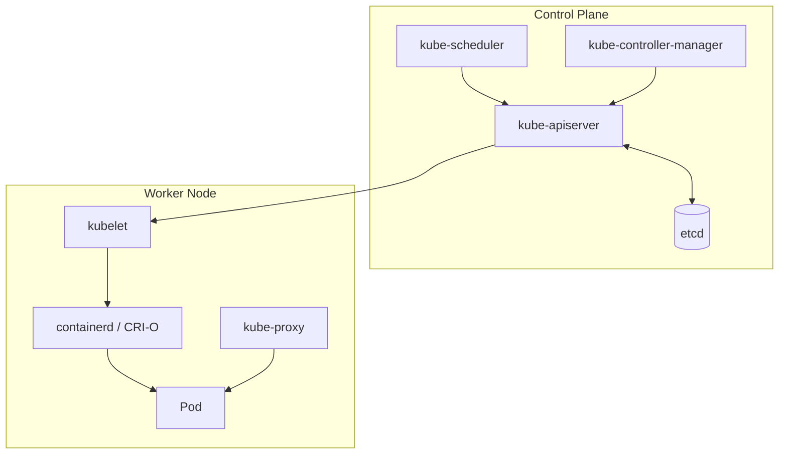

<a id="top"></a>

# Container & Kubernetes Study Notes — Basic to Advanced

A single reference covering containers and Kubernetes from first principles
through advanced, production-grade practice, with runnable configuration
examples and a troubleshooting guide organized by topic.

## Table of Contents

1. [Introduction to Containers](#1-introduction-to-containers)
2. [Container Runtimes and OCI/CRI Standards](#2-container-runtimes-and-ocicri-standards)
3. [Docker Fundamentals](#3-docker-fundamentals)
4. [Dockerfile Best Practices and Multi-Stage Builds](#4-dockerfile-best-practices-and-multi-stage-builds)
5. [Container Registries](#5-container-registries)
6. [Kubernetes Architecture](#6-kubernetes-architecture)
7. [Kubernetes Core Workload Objects](#7-kubernetes-core-workload-objects)
8. [Kubernetes Networking](#8-kubernetes-networking)
9. [Kubernetes Storage](#9-kubernetes-storage)
10. [Scheduling, Autoscaling, and Resource Management](#10-scheduling-autoscaling-and-resource-management)
11. [Configuration and Secrets Management](#11-configuration-and-secrets-management)
12. [Container and Kubernetes Security](#12-container-and-kubernetes-security)
13. [Helm and Kustomize](#13-helm-and-kustomize)
14. [GitOps and CI/CD for Containers](#14-gitops-and-cicd-for-containers)
15. [Service Mesh](#15-service-mesh)
16. [Observability for Containers](#16-observability-for-containers)
17. [Managed Kubernetes Comparison (EKS vs AKS vs GKE)](#17-managed-kubernetes-comparison-eks-vs-aks-vs-gke)
18. [Container Orchestrator Comparison](#18-container-orchestrator-comparison)
19. [Troubleshooting Guide by Topic](#19-troubleshooting-guide-by-topic)
20. [CLI Command Cheat Sheet](#20-cli-command-cheat-sheet)
21. [Container and Kubernetes Interview Questions](#21-container-and-kubernetes-interview-questions)
22. [Study Checklist](#22-study-checklist)

---

# 1. Introduction to Containers

A container packages an application with everything it needs to run
(code, runtime, libraries, config) into a single, portable unit — but
unlike a VM, it shares the host machine's kernel instead of virtualizing
its own. A container is really just a regular Linux process with
restricted visibility into the rest of the system.

## Containers vs Virtual Machines

| | Virtual Machine | Container |
|---|---|---|
| Isolation level | Hardware-virtualized, own kernel per VM | OS-level isolation, shares the host kernel |
| Startup time | Minutes | Seconds to milliseconds |
| Density per host | Fewer (each VM carries a full OS) | Many more (no duplicated OS) |
| Image size | Gigabytes (full OS image) | Megabytes to a few hundred MB |
| Best for | Full OS isolation, running different OS families | Fast, portable, consistent app packaging at scale |

## The Linux Primitives Behind Containers

- **Namespaces** (PID, Network, Mount, UTS, IPC, User) — isolate *what a
  process can see*: its own process tree, network stack, filesystem
  mounts, hostname, and user IDs.
- **cgroups** (control groups) — limit and account for *what a process
  can use*: CPU, memory, disk I/O, network bandwidth.
- **Union filesystem** (OverlayFS) — layers a container's read-only image
  layers with a thin, copy-on-write writable layer on top, so multiple
  containers can share the same base layers without duplicating storage.

**Interview point**: "A container is not a lightweight VM" is the single
most important framing — it's a process with namespaces/cgroups applied,
running directly on the host kernel, which is exactly why it starts in
milliseconds and why a kernel-level vulnerability can affect container
isolation in a way it never would with a hypervisor-isolated VM.

[⬆ Back to top](#top)

---

# 2. Container Runtimes and OCI/CRI Standards

## The Standards

- **OCI (Open Container Initiative)** — standardizes the container
  **image format** and the **runtime spec**, so any OCI-compliant tool
  can build/pull/run any OCI-compliant image, regardless of which
  vendor produced it.
- **CRI (Container Runtime Interface)** — the API Kubernetes' `kubelet`
  uses to talk to *any* compliant container runtime, decoupling
  Kubernetes itself from a specific runtime implementation.

## The Runtime Stack

```text
kubelet → CRI → containerd / CRI-O → runc → Linux namespaces/cgroups
```

| Layer | Role |
|---|---|
| **runc** | The low-level, reference OCI runtime that actually creates and runs a container (applies namespaces/cgroups) — most higher-level runtimes shell out to it. |
| **containerd** | A higher-level runtime daemon managing the full container lifecycle (image pull, storage, network setup, exec) and calling `runc` underneath; the default runtime for Kubernetes since dockershim's removal. |
| **CRI-O** | A lightweight runtime built specifically to implement the CRI for Kubernetes, with no full Docker daemon required; common in OpenShift. |
| **Docker Engine** | The original end-user container tool; internally built on containerd since Docker 1.11+; still the dominant local dev tool, though Kubernetes nodes no longer run it directly. |

## Why Kubernetes Removed Dockershim (v1.24+)

Dockershim was a translation shim converting CRI calls into Docker
Engine's own (non-CRI) API. Since Docker Engine itself is built on
containerd, and containerd already speaks CRI natively, maintaining an
extra translation layer just to route through the full Docker Engine
was redundant overhead — removing it simplified the node stack. Images
built with `docker build` are unaffected and still run everywhere, since
they're OCI-compliant regardless of which runtime executes them; only
the *node's* runtime changed, not build tooling.

### Interview Keyword
Know the chain **kubelet → CRI → containerd/CRI-O → runc**, and that
removing dockershim was about runtime architecture, not about Docker
images stopping to work.

[⬆ Back to top](#top)

---

# 3. Docker Fundamentals

## Images and Layers

Each Dockerfile instruction creates a new, read-only, cacheable layer;
a running container adds one thin writable layer on top
(copy-on-write). Layers are content-addressed and shared across images
that share a base.

## Basic Commands

```bash
docker build -t myapp:1.0 .
docker run -d -p 8080:80 --name web myapp:1.0
docker ps
docker logs -f web
docker exec -it web sh
docker stop web && docker rm web
docker images
docker rmi myapp:1.0
```

## Volumes, Bind Mounts, and tmpfs

| Type | Behavior |
|---|---|
| **Named volume** | Docker-managed storage location, portable across hosts, survives container removal — the default choice for persistent container data. |
| **Bind mount** | Maps a specific host path directly into the container — convenient for local development (live code reload), but ties the container to that host's filesystem layout. |
| **tmpfs mount** | In-memory only, never persisted to disk — for secrets or scratch data that must never touch disk. |

```bash
docker run -v mydata:/var/lib/data myapp        # named volume
docker run -v $(pwd)/src:/app/src myapp         # bind mount
docker run --tmpfs /app/cache myapp             # tmpfs
```

## Docker Networking Modes

| Mode | Behavior |
|---|---|
| **bridge** (default) | Private, NAT'd network per host; containers reach each other by container name on a user-defined bridge network. |
| **host** | Container shares the host's network namespace directly — no port mapping needed, but no network isolation either. |
| **none** | No networking at all. |
| **overlay** | Multi-host container networking, used by Docker Swarm. |

## Docker Compose

```yaml
# docker-compose.yml
services:
  web:
    build: .
    ports: ["8080:80"]
    depends_on: [db]
  db:
    image: postgres:16
    environment:
      POSTGRES_PASSWORD: secret
    volumes:
      - dbdata:/var/lib/postgresql/data
volumes:
  dbdata:
```

```bash
docker compose up -d
docker compose logs -f
docker compose down
```

[⬆ Back to top](#top)

---

# 4. Dockerfile Best Practices and Multi-Stage Builds

```dockerfile
# Before — root user, large attack surface, no pinned digest, single stage
FROM node:latest
COPY . /app
RUN npm install
CMD ["node", "server.js"]
```

```dockerfile
# After — pinned digest, minimal base, non-root user, multi-stage build
FROM node:20.11.1-alpine@sha256:abcdef... AS build
WORKDIR /app
COPY package*.json ./
RUN npm ci --omit=dev
COPY . .

FROM gcr.io/distroless/nodejs20-debian12
WORKDIR /app
COPY --from=build /app /app
USER nonroot:nonroot
EXPOSE 3000
CMD ["server.js"]
```

## Best Practices

- Pin base images by **digest**, not just tag (`node:20-alpine` can
  change underneath you; `node:20-alpine@sha256:...` cannot).
- Prefer minimal or **distroless** base images — fewer packages means
  fewer CVEs to track.
- Use **multi-stage builds** so build tools/dependencies never ship in
  the final runtime image.
- Order instructions from least- to most-frequently-changing (install
  dependencies before copying source) to maximize Docker's layer cache.
- Add a `.dockerignore` so build context (and the cache) isn't
  invalidated by irrelevant files.
- Never run as root — set `USER` explicitly.
- One logical process per container; use `HEALTHCHECK` so orchestrators
  can detect an unhealthy-but-still-running process.

```text
# .dockerignore
node_modules
.git
*.md
.env
```

[⬆ Back to top](#top)

---

# 5. Container Registries

| Registry | Key Features & Characteristics | Preferred Over the Alternative When |
|---|---|---|
| **Docker Hub** | Public/private image registry, largest public library of base images. | You need a widely-mirrored public base image or a simple free-tier private repo for a small project. |
| **Amazon ECR** | AWS-native, IAM-integrated, image scanning on push, deep integration with ECS/EKS. | Your workloads run on AWS and need IAM-based auth without managing separate registry credentials. |
| **Azure Container Registry (ACR)** | Azure-native, Entra ID-integrated, geo-replication, ACR Tasks for in-registry builds. | Your workloads run on AKS/Azure and need geo-replicated images close to clusters in multiple regions. |
| **Google Artifact Registry** | GCP-native, supports container images plus language packages (npm, Maven) in one registry. | You're on GKE/GCP and want one registry for both container images and application package artifacts. |
| **GitHub Container Registry (GHCR)** | Tightly integrated with GitHub repos/Actions, supports both public and private images, fine-grained token permissions. | Your CI/CD already lives in GitHub Actions and you want registry auth to reuse the same token/permission model. |
| **Harbor** | Open-source, self-hosted registry with built-in vulnerability scanning, image signing, and RBAC. | You need a self-hosted registry (air-gapped/on-prem requirement) with enterprise features without vendor lock-in. |

## Image Tagging and Immutability

- Avoid deploying `latest` in production — it's not a stable, reproducible
  reference; pin to a specific version tag or, better, an image digest.
- Enable tag immutability where the registry supports it, so a tag can't
  be silently overwritten after it's been scanned/approved.

## Example: Build, Scan, Push

```bash
docker build -t myregistry.io/myapp:1.4.0 .
trivy image --severity HIGH,CRITICAL --exit-code 1 myregistry.io/myapp:1.4.0
docker push myregistry.io/myapp:1.4.0
```

[⬆ Back to top](#top)

---

# 6. Kubernetes Architecture

## Control Plane Components

| Component | Role |
|---|---|
| **kube-apiserver** | The front door for every interaction (kubectl, controllers, kubelets); validates requests and persists cluster state to etcd. |
| **etcd** | Distributed, strongly consistent key-value store holding all cluster state — the single source of truth. |
| **kube-scheduler** | Decides which node a new Pod should run on, based on resource requests, affinity rules, and taints/tolerations. |
| **kube-controller-manager** | Runs the reconciliation control loops (Deployment, Node, Job controllers, etc.) that continuously drive actual state toward desired state. |
| **cloud-controller-manager** | Cloud-provider-specific integration — provisioning a `LoadBalancer` Service, managing node lifecycle with the underlying cloud API. |

## Node Components

| Component | Role |
|---|---|
| **kubelet** | The agent on every node; watches the API server and ensures the containers described in assigned PodSpecs are actually running, via the CRI. |
| **kube-proxy** | Implements Service networking rules on each node (iptables or IPVS mode), routing Service traffic to the right Pod. |
| **Container runtime** | containerd or CRI-O, actually creating/running the containers underneath. |

## Cluster Architecture



## The Reconciliation Loop

Kubernetes is fundamentally **declarative**: you describe desired state
(a Deployment wants 3 replicas), and every controller continuously
watches the API server, compares actual state against desired state, and
takes action to converge the two. This is why `kubectl apply` is
idempotent (re-applying the same manifest is a no-op once converged) and
why Kubernetes self-heals (a killed Pod is simply "actual state drifted
from desired state," and the ReplicaSet controller creates a
replacement without anyone intervening).

[⬆ Back to top](#top)

---

# 7. Kubernetes Core Workload Objects

| Object | Key Features & Characteristics | Use Cases | Preferred Over the Alternative When |
|---|---|---|---|
| **Pod** | The smallest deployable unit — one or more tightly coupled containers sharing network namespace and storage volumes; normally not created directly. | A single container, or a container + tightly coupled sidecar (log shipper, service mesh proxy). | Almost never created directly in production — a controller object (below) manages Pod lifecycle instead. |
| **ReplicaSet** | Ensures a specified number of identical Pod replicas are running at all times; replaces a failed Pod automatically. | Maintaining a fixed replica count. | Rarely created directly — a Deployment manages ReplicaSets for you and adds rollout/rollback on top. |
| **Deployment** | Manages ReplicaSets on your behalf, providing declarative rolling updates, rollback to a previous revision, and pause/resume of a rollout. | Stateless applications (web servers, APIs) needing rolling updates. | The workload is stateless and interchangeable — any replica can serve any request with no identity/ordering requirement. |
| **StatefulSet** | Like a Deployment, but each replica gets a stable, unique network identity (`pod-0`, `pod-1`...) and its own persistent volume that follows it across rescheduling. | Databases, message queues, or any workload needing stable identity/storage per replica. | Replicas are **not** interchangeable — each needs its own persistent identity/storage and predictable ordinal naming (e.g., a database cluster's replicas). |
| **DaemonSet** | Ensures exactly one Pod copy runs on every (or a selected subset of) node. | Node-level agents — log collectors, monitoring agents, CNI/CSI plugins. | The workload must run on every node exactly once, not a scalable count decided independently of node count. |
| **Job** | Runs a Pod to completion (not indefinitely) — optionally retrying on failure until a success count is reached. | One-off batch/data-processing tasks. | The task is finite ("run once, then stop"), unlike a Deployment which expects to run indefinitely. |
| **CronJob** | Creates Jobs on a cron schedule. | Scheduled batch tasks (nightly reports, cleanup jobs). | The task is finite *and* needs to recur on a schedule, rather than running once on demand. |

## Example Deployment + Service

```yaml
apiVersion: apps/v1
kind: Deployment
metadata:
  name: web
spec:
  replicas: 3
  selector:
    matchLabels: { app: web }
  template:
    metadata:
      labels: { app: web }
    spec:
      containers:
        - name: web
          image: myregistry.io/myapp:1.4.0
          resources:
            requests: { cpu: "250m", memory: "256Mi" }
            limits: { cpu: "500m", memory: "512Mi" }
---
apiVersion: v1
kind: Service
metadata:
  name: web
spec:
  selector: { app: web }
  ports:
    - port: 80
      targetPort: 8080
```

## Example StatefulSet (Stable Identity + Storage)

```yaml
apiVersion: apps/v1
kind: StatefulSet
metadata:
  name: postgres
spec:
  serviceName: postgres
  replicas: 3
  selector:
    matchLabels: { app: postgres }
  template:
    metadata:
      labels: { app: postgres }
    spec:
      containers:
        - name: postgres
          image: postgres:16
          volumeMounts:
            - name: data
              mountPath: /var/lib/postgresql/data
  volumeClaimTemplates:
    - metadata: { name: data }
      spec:
        accessModes: ["ReadWriteOnce"]
        resources: { requests: { storage: 10Gi } }
```

## Namespaces

A Namespace is a logical partition within a cluster for multi-tenancy
and soft isolation — scoping names, RBAC, `ResourceQuota`, and
`LimitRange`, but **not** providing network isolation by itself (that
needs a NetworkPolicy — see [§8](#8-kubernetes-networking)).

### Interview Keyword
Use **Deployment** for stateless apps, **StatefulSet** when replicas
need stable identity/storage, **DaemonSet** for one-per-node agents, and
**Job/CronJob** for finite/scheduled work.

[⬆ Back to top](#top)

---

# 8. Kubernetes Networking

## The Pod Networking Model

Every Pod gets its own cluster-wide IP address, and every Pod can reach
every other Pod's IP directly with no NAT in between — a flat network
model that every CNI plugin must implement, regardless of the
underlying mechanism (overlay, BGP routing, cloud-native VPC
integration).

## CNI (Container Network Interface)

A plugin standard, analogous to CRI for runtimes — Kubernetes doesn't
implement Pod networking itself, it delegates to whichever CNI plugin
is installed: Calico, Cilium, Flannel, AWS VPC CNI, Azure CNI, etc.

## Service Types

| Type | Key Features & Characteristics | Preferred Over the Alternative When |
|---|---|---|
| **ClusterIP** (default) | Internal-only virtual IP, reachable only from inside the cluster. | The consumer is another in-cluster workload — never needs external exposure. |
| **NodePort** | Opens a static port on every node's IP, forwarding to the Service. | Simple external access without a cloud load balancer (dev/test, on-prem without an LB integration). |
| **LoadBalancer** | Provisions an actual cloud load balancer (ELB/Azure LB/etc.) pointing at the Service. | Production external exposure on a cloud platform with native LB integration. |
| **ExternalName** | Maps a Service name to an external DNS name (CNAME), no proxying. | You want in-cluster code to reference an external dependency by a stable, in-cluster Service name. |

## Ingress vs Gateway API

- **Ingress** — the long-standing, simpler L7 HTTP routing resource
  (host/path-based rules to backend Services), implemented by an
  Ingress Controller (NGINX, Traefik, cloud-native controllers).
- **Gateway API** — the modern successor, a more expressive and
  portable API (separates infrastructure-owner and app-owner concerns,
  supports non-HTTP protocols) that most new clusters are migrating
  toward.

## Network Policies (Default-Deny)

```yaml
apiVersion: networking.k8s.io/v1
kind: NetworkPolicy
metadata:
  name: default-deny-all
  namespace: production
spec:
  podSelector: {}
  policyTypes: ["Ingress", "Egress"]
---
apiVersion: networking.k8s.io/v1
kind: NetworkPolicy
metadata:
  name: allow-app-to-db
  namespace: production
spec:
  podSelector:
    matchLabels: { app: backend }
  policyTypes: ["Egress"]
  egress:
    - to:
        - podSelector:
            matchLabels: { app: postgres }
      ports:
        - protocol: TCP
          port: 5432
```

By default, Kubernetes allows all Pod-to-Pod traffic — NetworkPolicies
are opt-in, and without a CNI plugin that enforces them (not all do),
NetworkPolicy objects are silently ignored.

## Cluster DNS

CoreDNS resolves Service names to ClusterIPs using the pattern
`<service>.<namespace>.svc.cluster.local` — a Pod in the same namespace
can reach a Service by its short name alone.

[⬆ Back to top](#top)

---

# 9. Kubernetes Storage

## CSI (Container Storage Interface)

A pluggable storage-driver standard, analogous to CNI for networking —
any CSI-compliant storage backend (EBS, Azure Disk, Ceph, Portworx) can
be provisioned through the same Kubernetes storage objects below.

## Core Objects

| Object | Definition |
|---|---|
| **PersistentVolume (PV)** | The actual storage resource in the cluster (cluster-scoped) — provisioned either statically by an admin or dynamically via a StorageClass. |
| **PersistentVolumeClaim (PVC)** | A namespace-scoped *request* for storage that binds to a matching PV — what application manifests actually reference. |
| **StorageClass** | A dynamic-provisioning template (backend type, parameters) so a PVC can trigger on-demand PV creation instead of requiring a pre-created PV. |

## Access Modes

| Mode | Meaning |
|---|---|
| **ReadWriteOnce (RWO)** | Mountable read-write by a single node at a time. |
| **ReadOnlyMany (ROX)** | Mountable read-only by many nodes simultaneously. |
| **ReadWriteMany (RWX)** | Mountable read-write by many nodes simultaneously (needs a storage backend that supports it, e.g., NFS/EFS/Azure Files). |
| **ReadWriteOncePod** | Like RWO, but restricts the mount to a single *Pod* rather than just a single node. |

## Ephemeral Storage Types

- **emptyDir** — scratch space created when the Pod starts, deleted when
  the Pod is removed; shared between containers in the same Pod.
- **hostPath** — mounts a path from the node's filesystem directly;
  avoid in production (ties a Pod to specific node data, a common
  security/portability anti-pattern).

[⬆ Back to top](#top)

---

# 10. Scheduling, Autoscaling, and Resource Management

## Requests vs Limits

- **Requests** — what the scheduler *guarantees* is reserved for the
  container; used to decide which node has room for a new Pod.
- **Limits** — the hard ceiling a container cannot exceed. Exceeding a
  memory limit gets the container **OOMKilled**; exceeding a CPU limit
  just gets it throttled (not killed).

## QoS Classes (Derived Automatically From Requests/Limits)

| Class | Condition | Eviction Priority |
|---|---|---|
| **Guaranteed** | Requests == Limits for every container. | Evicted last. |
| **Burstable** | Requests set, but Limits higher (or unset). | Evicted before Guaranteed. |
| **BestEffort** | No requests/limits set at all. | Evicted first under node pressure. |

## Autoscaling Comparison

| Type | Key Features & Characteristics | Preferred Over the Alternative When |
|---|---|---|
| **Horizontal Pod Autoscaler (HPA)** | Scales the *number of Pod replicas* based on observed CPU/memory or custom metrics. | The workload scales well horizontally (stateless, load-balanced) and demand is variable. |
| **Vertical Pod Autoscaler (VPA)** | Adjusts a Pod's CPU/memory *requests/limits* automatically based on historical usage. | The workload can't easily scale horizontally (a single stateful process) and instead needs right-sized resources over time. |
| **Cluster Autoscaler** | Adds/removes *nodes* based on whether Pods are unschedulable (pending) or nodes are underutilized. | Pods can't be scheduled due to insufficient cluster capacity — HPA/VPA scale within existing nodes, Cluster Autoscaler scales the nodes themselves. |

## Taints/Tolerations vs Affinity/Anti-Affinity

A frequently confused pair:

- **Taints and Tolerations** — a **node** repels Pods unless the Pod
  explicitly *tolerates* the taint (e.g., keeping general workloads off
  GPU nodes reserved for ML jobs).
- **Node/Pod Affinity and Anti-Affinity** — a **Pod** expresses a
  preference/requirement to be scheduled near (affinity) or away from
  (anti-affinity) certain nodes or other Pods (e.g., spreading
  replicas across zones for HA).

Taints protect a node from unwanted Pods; affinity/anti-affinity express
a Pod's own scheduling preference — they're complementary, not
alternatives.

## PodDisruptionBudget (PDB)

```yaml
apiVersion: policy/v1
kind: PodDisruptionBudget
metadata:
  name: web-pdb
spec:
  minAvailable: 2
  selector:
    matchLabels: { app: web }
```

Protects against **voluntary** disruption (node drains during upgrades,
cluster-autoscaler scale-down) by capping how many replicas can be
evicted at once — it does nothing for involuntary disruption (a node
crashing outright).

[⬆ Back to top](#top)

---

# 11. Configuration and Secrets Management

| Object | Key Features & Characteristics | Preferred Over the Alternative When |
|---|---|---|
| **ConfigMap** | Stores non-sensitive configuration data (key-value pairs, files) injected as env vars or mounted volumes. | The data is plain configuration — feature flags, non-sensitive URLs, config files. |
| **Secret** | Stores sensitive data, base64-encoded (not encrypted) by default; can be encrypted at rest in etcd if encryption-at-rest is enabled at the cluster level. | The data is sensitive — but understand base64 encoding is *not* encryption; anyone with API access to read the Secret object can trivially decode it. |

**Common misconception**: a Kubernetes `Secret` is not "secure by
default" — it's base64-encoded for transport convenience, readable by
anyone with RBAC permission to `get` it, and stored in etcd in plaintext
unless etcd encryption-at-rest is explicitly configured. For real
secret management, use:

- **External Secrets Operator** — syncs secrets from an external vault
  (AWS Secrets Manager, Azure Key Vault, HashiCorp Vault) into
  Kubernetes Secrets at runtime, so nothing sensitive is committed to
  git.
- **Sealed Secrets** — encrypts a Secret client-side so the encrypted
  form can be safely committed to git; only the cluster's controller can
  decrypt it.
- **Vault Agent Injector** — injects secrets directly into a Pod at
  runtime via a sidecar, without ever creating a Kubernetes Secret
  object at all.

[⬆ Back to top](#top)

---

# 12. Container and Kubernetes Security

## Pod Security Standards

Kubernetes replaced the deprecated PodSecurityPolicy with **Pod
Security Admission**, enforced via namespace labels at three levels —
Privileged, Baseline, Restricted:

```yaml
apiVersion: v1
kind: Namespace
metadata:
  name: production
  labels:
    pod-security.kubernetes.io/enforce: restricted
    pod-security.kubernetes.io/audit: restricted
    pod-security.kubernetes.io/warn: restricted
```

## SecurityContext

```yaml
securityContext:
  runAsNonRoot: true
  runAsUser: 1000
  readOnlyRootFilesystem: true
  allowPrivilegeEscalation: false
  capabilities:
    drop: ["ALL"]
```

## RBAC — Least Privilege

```yaml
apiVersion: rbac.authorization.k8s.io/v1
kind: Role
metadata:
  namespace: production
  name: app-role
rules:
  - apiGroups: [""]
    resources: ["configmaps", "secrets"]
    verbs: ["get", "list"]
---
apiVersion: rbac.authorization.k8s.io/v1
kind: RoleBinding
metadata:
  namespace: production
  name: app-binding
subjects:
  - kind: ServiceAccount
    name: app-sa
    namespace: production
roleRef:
  kind: Role
  name: app-role
  apiGroup: rbac.authorization.k8s.io
```

`Role`/`RoleBinding` are namespace-scoped; `ClusterRole`/
`ClusterRoleBinding` are cluster-wide — never bind `cluster-admin` to an
application's ServiceAccount.

## Admission Control — OPA/Gatekeeper vs Kyverno

| | OPA / Gatekeeper | Kyverno |
|---|---|---|
| Policy language | Rego (a purpose-built policy language, steeper learning curve) | Plain YAML (no new language to learn) |
| Best for | Complex, expressive policy logic; teams already using OPA elsewhere | Kubernetes-native teams wanting policies as ordinary YAML manifests |

```yaml
# Kyverno example — require non-root
apiVersion: kyverno.io/v1
kind: ClusterPolicy
metadata:
  name: require-non-root
spec:
  validationFailureAction: Enforce
  rules:
    - name: check-runAsNonRoot
      match:
        resources:
          kinds: ["Pod"]
      validate:
        message: "Containers must run as non-root"
        pattern:
          spec:
            securityContext:
              runAsNonRoot: true
```

## Image Scanning and Runtime Security

- **Trivy / Grype** — scan images for known CVEs at build time and on a
  schedule for already-deployed images.
- **Falco** — runtime threat detection, watching syscalls for anomalous
  in-container behavior (e.g., a shell spawned inside a container that
  should never spawn one).

### Interview Keyword
Security in Kubernetes layers **Pod Security Standards, SecurityContext,
RBAC, default-deny NetworkPolicies, admission control (OPA/Kyverno), and
image/runtime scanning** — no single control is sufficient alone.

[⬆ Back to top](#top)

---

# 13. Helm and Kustomize

| Tool | Key Features & Characteristics | Preferred Over the Alternative When |
|---|---|---|
| **Helm** | Package manager for Kubernetes — Charts bundle templated manifests + a `values.yaml`; tracks installed "Releases" with upgrade/rollback history. | You need templating (loops, conditionals, shared logic across environments) and versioned release/rollback history, or you're installing a third-party application distributed as a chart. |
| **Kustomize** | Template-free, overlay-based customization — a `base` manifest set plus per-environment `overlays` that patch it; built directly into `kubectl`. | You want to customize plain YAML per environment (dev/stage/prod) without introducing a templating language at all — simpler mental model for teams that find Helm's templating too "magic." |

## Helm Chart Structure

```text
mychart/
├── Chart.yaml
├── values.yaml
└── templates/
    ├── deployment.yaml
    └── service.yaml
```

```bash
helm install web ./mychart --values values-prod.yaml
helm upgrade web ./mychart --values values-prod.yaml
helm rollback web 1
helm uninstall web
```

## Kustomize Base/Overlay Example

```text
base/
├── deployment.yaml
└── kustomization.yaml

overlays/prod/
├── kustomization.yaml
└── replica-patch.yaml
```

```yaml
# overlays/prod/kustomization.yaml
resources:
  - ../../base
patches:
  - path: replica-patch.yaml
```

```bash
kubectl apply -k overlays/prod
```

[⬆ Back to top](#top)

---

# 14. GitOps and CI/CD for Containers

## The GitOps Principle

Git is the single source of truth for desired cluster state. Instead of
a CI pipeline imperatively pushing changes to the cluster (`kubectl
apply` from a pipeline runner), a controller running **inside** the
cluster continuously watches a git repo and reconciles live state to
match it — the same reconciliation-loop model Kubernetes itself uses
internally, applied to deployment.

| Tool | Key Features & Characteristics | Preferred Over the Alternative When |
|---|---|---|
| **Argo CD** | Kubernetes-native GitOps controller with a web UI, app-of-apps pattern, and built-in drift detection/visualization. | You want a visual UI showing sync status/drift per application, and a mature app-of-apps pattern for managing many apps' GitOps configs together. |
| **Flux** | Lightweight, CLI/CRD-driven GitOps controller, tightly integrated with Helm and Kustomize natively. | You want a leaner, more automation-first tool without a dedicated UI, or need native Helm/Kustomize reconciliation without extra glue. |

## Example Pipeline Flow

```text
git push → CI: build image → scan (Trivy) → push to registry
                                              → update image tag in a
                                                manifests repo (git commit)
                                              → Argo CD/Flux detects the
                                                change → reconciles the
                                                cluster to match
```

The key GitOps distinction from a traditional CI/CD push: the pipeline
never has direct cluster credentials — it only ever writes to git; the
in-cluster controller is what actually applies changes, which is a
meaningfully smaller attack surface than a CI runner holding a
cluster-admin kubeconfig.

[⬆ Back to top](#top)

---

# 15. Service Mesh

A service mesh transparently injects a sidecar proxy (typically Envoy)
alongside every Pod, intercepting all in/out traffic to provide mTLS,
traffic shaping (canary/blue-green, retries, circuit breaking), and
observability — all without changing application code.

| Tool | Key Features & Characteristics | Preferred Over the Alternative When |
|---|---|---|
| **Istio** | Full-featured mesh — mTLS, fine-grained traffic routing (VirtualService/DestinationRule), rich telemetry; steeper operational complexity. | You need advanced traffic management (canary rollouts, fault injection, fine-grained routing rules) and can absorb the added operational overhead. |
| **Linkerd** | Lightweight, simpler mesh focused on mTLS and reliability (retries, timeouts) with lower resource overhead and operational complexity. | You want mTLS and basic reliability features with minimal operational burden — vs Istio, trades some advanced routing flexibility for simplicity. |

[⬆ Back to top](#top)

---

# 16. Observability for Containers

| Layer | Tooling |
|---|---|
| **Metrics** | Prometheus (scrapes metrics), kube-state-metrics (exposes Kubernetes object state as metrics), metrics-server (lightweight resource metrics that power HPA specifically). |
| **Logs** | Container stdout/stderr, captured by the container runtime and shipped by Fluent Bit/Fluentd to a backend (Elasticsearch/OpenSearch, Loki). |
| **Traces** | OpenTelemetry instrumentation, exported to a tracing backend (Jaeger, Tempo). |
| **Dashboards** | Grafana, typically querying Prometheus for metrics and Loki for logs in one pane. |

**Interview point**: `metrics-server` is not the same as the full
Prometheus stack — HPA by default only reads from `metrics-server`
(basic CPU/memory), while custom-metric-based HPA scaling requires a
Prometheus adapter exposing custom metrics through the same metrics
API.

[⬆ Back to top](#top)

---

# 17. Managed Kubernetes Comparison (EKS vs AKS vs GKE)

| | Amazon EKS | Azure AKS | Google GKE |
|---|---|---|---|
| Control plane cost | Hourly fee per cluster | Free control plane (Standard tier adds an SLA fee) | Free (Standard) or paid (Autopilot mode charges per Pod resource) |
| Default networking | AWS VPC CNI (Pods get real VPC IPs) | Azure CNI (Pods get real VNet IPs) or kubenet (overlay) | Native VPC-native networking by default |
| Node management | Self-managed, managed node groups, or Fargate (serverless Pods) | VMSS-backed node pools, or serverless via Container Apps/ACI integration | Standard node pools, or fully serverless Autopilot mode |
| Notable strength | Deepest integration with the broader AWS service ecosystem (IAM, ALB ingress, EBS/EFS CSI) | Strong hybrid/on-prem story via Arc; deep Entra ID integration | Historically the most mature/managed Kubernetes experience (Kubernetes originated at Google); Autopilot removes node management almost entirely |

**Preferred over each other when**: EKS if the rest of the workload's
dependencies are AWS-native (IAM roles for service accounts, ALB
ingress); AKS if the organization is Microsoft-ecosystem-heavy (Entra
ID, hybrid via Arc); GKE if minimizing node-management operational
burden matters most (Autopilot) or the team wants the most
upstream-aligned Kubernetes experience.

[⬆ Back to top](#top)

---

# 18. Container Orchestrator Comparison

| | Kubernetes | Docker Swarm | HashiCorp Nomad | AWS ECS |
|---|---|---|---|---|
| Definition | De facto standard container orchestrator; large ecosystem, steep learning curve | Docker's built-in, simple orchestrator | Lightweight, single-binary orchestrator that also schedules non-container workloads (VMs, batch jobs) | AWS-proprietary orchestrator, simpler API than Kubernetes |
| Preferred over the alternative when | You need the largest ecosystem (Helm charts, operators, cloud-native tooling) or multi-cloud portability | You want the simplest possible orchestrator and are already all-in on Docker, with a small/simple cluster | You need to orchestrate mixed workloads (containers + non-containerized services) with minimal operational footprint | You're AWS-only and want simpler operations than Kubernetes without needing k8s's ecosystem or portability |

**Interview point**: "Why Kubernetes over Docker Swarm?" is one of the
most common orchestrator questions — the honest answer is ecosystem and
extensibility (CRDs, operators, the entire CNCF landscape), not that
Swarm is technically incapable for smaller/simpler deployments; Swarm
lost adoption momentum, not a head-to-head feature war.

[⬆ Back to top](#top)

---

# 19. Troubleshooting Guide by Topic

## Pod Stuck in `Pending`

- Run `kubectl describe pod <name>` and check the Events section first —
  it almost always states the exact reason (insufficient CPU/memory,
  no node matches a nodeSelector/affinity rule, an unbound PVC).
- If it's a resource shortage, check whether Cluster Autoscaler is
  configured and has room to add a node — a Pod can stay Pending
  indefinitely if there's no node group it can scale into.

## `CrashLoopBackOff`

- Check `kubectl logs <pod> --previous` (the *previous* crashed
  instance's logs, not the current restart's, which may not have
  reached the failure point yet).
- Common causes: missing environment variable/config the app expects at
  startup, a failing readiness/liveness probe misconfigured too
  aggressively, or the container's entrypoint command exiting
  immediately (e.g., a missing binary).

## `ImagePullBackOff`

- Verify the image name/tag is correct and actually exists in the
  registry (`docker pull` it locally to confirm).
- Check `imagePullSecrets` is configured if the registry is private —
  a common gap after rotating registry credentials.
- Confirm the node can actually reach the registry (network policy,
  firewall, or a private registry needing a VPC endpoint/Private Link).

## `OOMKilled`

- Check `kubectl describe pod` for `Last State: Terminated, Reason:
  OOMKilled` — the container exceeded its memory **limit**, not
  necessarily total node memory.
- Fix by either raising the memory limit (if genuinely needed) or
  finding/fixing a memory leak — don't just raise the limit blindly
  without checking whether usage should actually be that high.

## Pod Stuck in `Terminating`

- Check whether the container's process ignores `SIGTERM` — Kubernetes
  sends SIGTERM, waits `terminationGracePeriodSeconds` (default 30s),
  then SIGKILLs; a process not handling SIGTERM will always hit the full
  grace period.
- A stuck **finalizer** on the Pod/resource can also block deletion
  indefinitely — check `kubectl get pod <name> -o yaml` for a
  `finalizers` field that a controller never removed.

## Service Not Routing Traffic (Empty Endpoints)

- `kubectl get endpoints <service>` — if empty, the Service's
  `selector` doesn't match any Pod's labels; this is the single most
  common Service misconfiguration.
- Confirm the target Pods are actually `Ready` (a failing readiness
  probe removes a Pod from Endpoints even though it's still Running).

## DNS Resolution Failing Inside the Cluster

- Confirm CoreDNS Pods are running and healthy
  (`kubectl get pods -n kube-system -l k8s-app=kube-dns`).
- Test resolution directly from a debug Pod
  (`kubectl run -it --rm debug --image=busybox -- nslookup kubernetes.default`)
  to isolate whether it's a CoreDNS problem or an application-level
  problem.

## PVC Stuck `Pending`

- Check whether a StorageClass exists and is set as default
  (`kubectl get storageclass`) — a PVC with no matching StorageClass and
  no pre-existing PV to bind to will stay Pending indefinitely.
- For a specific access mode (e.g., ReadWriteMany), confirm the
  underlying storage backend actually supports it — many block-storage
  backends only support ReadWriteOnce.

[⬆ Back to top](#top)

---

# 20. CLI Command Cheat Sheet

```bash
# Docker
docker build -t app:1.0 .
docker run -d -p 8080:80 app:1.0
docker ps -a
docker logs -f <container>
docker exec -it <container> sh
docker system prune -a          # remove unused images/containers/networks

# kubectl — basics
kubectl get pods -n <namespace>
kubectl describe pod <name>
kubectl logs <pod> -f
kubectl logs <pod> --previous
kubectl exec -it <pod> -- sh
kubectl apply -f manifest.yaml
kubectl delete -f manifest.yaml
kubectl rollout status deployment/<name>
kubectl rollout undo deployment/<name>
kubectl scale deployment/<name> --replicas=5

# kubectl — debugging
kubectl get events --sort-by='.lastTimestamp'
kubectl top pod
kubectl top node
kubectl get endpoints <service>
kubectl port-forward svc/<service> 8080:80

# kubectl — contexts
kubectl config get-contexts
kubectl config use-context <context>

# Helm
helm repo add <name> <url>
helm install <release> <chart> --values values.yaml
helm upgrade <release> <chart>
helm rollback <release> <revision>
helm list

# Kustomize
kubectl apply -k overlays/prod
kustomize build overlays/prod
```

[⬆ Back to top](#top)

---

# 21. Container and Kubernetes Interview Questions

### Fundamentals

**1. What's the actual difference between a container and a VM?**
A VM virtualizes hardware — each VM runs its own full kernel under a
hypervisor. A container is a regular process on the host, isolated via
Linux namespaces (what it can see) and cgroups (what it can use),
sharing the host kernel with every other container. That's why
containers start in milliseconds and pack far denser per host, but also
why a host kernel vulnerability is a shared-fate risk across every
container on that host in a way it isn't across VMs.

**2. What is the OCI, and why does it matter?**
The Open Container Initiative standardizes the container image format
and runtime spec, so any OCI-compliant tool (Docker, Podman, containerd)
can build, distribute, and run any OCI-compliant image interchangeably
— no vendor lock-in to a specific tool's proprietary image format.

**3. What's the difference between containerd, CRI-O, and Docker Engine?**
containerd and CRI-O are both CRI-compliant runtimes Kubernetes can use
directly; containerd is the more general-purpose, widely adopted default,
while CRI-O was purpose-built for Kubernetes with a smaller footprint.
Docker Engine is the end-user-facing tool most people use locally — it's
actually built on containerd internally, but Kubernetes nodes don't run
the full Docker Engine anymore since dockershim's removal in 1.24.

### Kubernetes Architecture

**4. What happens, step by step, when you run `kubectl apply -f deployment.yaml`?**
kubectl sends the manifest to the kube-apiserver, which validates it and
writes the desired state to etcd. The Deployment controller (in
kube-controller-manager) notices the new/changed Deployment and creates
a ReplicaSet; the ReplicaSet controller creates the requested number of
Pod objects. kube-scheduler notices unscheduled Pods and assigns each to
a node based on resource requests/affinity/taints. Each target node's
kubelet notices a Pod assigned to it, and calls the container runtime
(via CRI) to actually pull the image and start the containers.

**5. What's the difference between a Pod restarting and Kubernetes rescheduling it?**
A restart happens in place, on the same node, when a container inside a
Pod fails (kubelet restarts just that container per the Pod's restart
policy) — the Pod object itself doesn't change. Rescheduling happens
when the entire Pod is deleted/lost (e.g., the node fails) and a
controller (ReplicaSet, etc.) creates a brand-new Pod object, which the
scheduler places on a (possibly different) node — a new Pod with a new
name/IP, not the same one restarted.

### Workloads

**6. When would you use a StatefulSet instead of a Deployment?**
When replicas are not interchangeable — each needs a stable, predictable
network identity and its own persistent storage that follows it across
rescheduling (a database cluster where replica-0 is the primary,
replica-1/2 are followers). A Deployment's replicas are anonymous and
interchangeable by design; a StatefulSet's are individually addressable.

**7. What's the difference between a Deployment's rolling update and a blue-green deployment?**
A rolling update incrementally replaces old Pods with new ones within
the same Deployment, briefly running a mix of both versions — simple,
built-in, but the two versions do coexist during rollout. Blue-green
runs two entirely separate environments and switches traffic atomically
between them (typically via a Service selector swap or an
Ingress/mesh routing change) — no mixed-version window, at the cost of
running double the capacity briefly.

### Networking

**8. Why doesn't a NetworkPolicy do anything on some clusters?**
NetworkPolicy objects are only enforced if the cluster's CNI plugin
actually implements them — not all CNI plugins do (Flannel historically
didn't, for example). Creating a NetworkPolicy on a cluster whose CNI
ignores them silently does nothing; always confirm the specific CNI's
NetworkPolicy support before relying on default-deny as an actual
security control.

**9. How does a Service actually route traffic to the correct Pods?**
A Service has a label `selector`; Kubernetes continuously computes the
set of Pods matching that selector and records them as `Endpoints`
(only including Pods that are currently `Ready`). kube-proxy on each
node programs iptables/IPVS rules so traffic to the Service's ClusterIP
gets load-balanced across the current Endpoints — it's DNS/IP-level
load balancing, not an application-aware proxy, unless a service mesh
sidecar is added on top.

### Storage

**10. What's the practical difference between a PV and a PVC?**
A PersistentVolume is the actual storage resource, cluster-scoped,
either pre-provisioned by an admin or dynamically created via a
StorageClass. A PersistentVolumeClaim is what an application manifest
actually references — a namespace-scoped *request* for storage meeting
certain criteria (size, access mode, StorageClass), which Kubernetes
binds to a matching PV. Applications should always reference a PVC,
never a PV directly.

### Security

**11. Why is a Kubernetes Secret not actually secure by default?**
Its values are base64-encoded, not encrypted — base64 is trivially
reversible, not a cryptographic transform. Anyone with RBAC permission
to `get` the Secret object can decode it instantly, and by default it's
stored in etcd in that same recoverable form unless the cluster has
etcd encryption-at-rest explicitly enabled. Real secret management needs
an external vault (Secrets Manager, Key Vault, HashiCorp Vault) synced
in via something like External Secrets Operator, or injected directly at
runtime without ever becoming a Kubernetes Secret object at all.

**12. What's the difference between a taint/toleration and node affinity?**
A taint is applied to a **node** and repels Pods unless they explicitly
tolerate it — it's the node expressing "don't schedule here unless you
say you're okay with this." Affinity is expressed on the **Pod** and
states a preference or requirement about which nodes/Pods it wants to
be near or away from — it's the Pod expressing its own placement
preference. They solve different problems and are commonly combined
(e.g., taint GPU nodes so only GPU-tolerating Pods land there, and also
give those Pods a node affinity rule targeting the GPU node pool
specifically).

### Scenario-Based

**13. "A Deployment's rollout is stuck halfway — half the Pods are on the new version, half on the old, and it won't progress." How do you debug it?**
Answer shape: `kubectl rollout status` and `kubectl describe deployment`
to see the exact blocking condition; check whether new Pods are passing
their readiness probe (`kubectl get pods` — a new Pod stuck
`Not Ready` blocks the rollout from progressing past `maxUnavailable`);
check `kubectl describe pod` on a new-version Pod for a crash/pull
failure. If the new image is simply broken, `kubectl rollout undo` rolls
back immediately rather than waiting for someone to hand-fix it.

**14. "Design a resilient multi-AZ Kubernetes deployment for a stateless API with zero-downtime deploys."**
Answer shape: Deployment with `replicas >= 3` and a `podAntiAffinity`
rule spreading replicas across availability zones; a `PodDisruptionBudget`
with `minAvailable` set high enough to survive a voluntary node drain
without dropping below capacity; `readinessProbe` gating traffic until
a Pod is actually ready, combined with a rolling update strategy
(`maxUnavailable: 0`, `maxSurge: 1`) so capacity never drops during a
deploy; a `HorizontalPodAutoscaler` for load-driven scaling; and a
`LoadBalancer`/Ingress in front, health-checking the Service's Endpoints.

[⬆ Back to top](#top)

---

# 22. Study Checklist

- [ ] Explain why a container is "just a process," not a lightweight VM.
- [ ] Trace the runtime chain: kubelet → CRI → containerd/CRI-O → runc.
- [ ] Write a multi-stage Dockerfile with a pinned digest and non-root user.
- [ ] Explain the Kubernetes reconciliation loop and why `kubectl apply`
      is idempotent.
- [ ] Explain Deployment vs StatefulSet vs DaemonSet vs Job/CronJob, with
      a concrete use case for each.
- [ ] Write a default-deny NetworkPolicy plus one explicit allow rule.
- [ ] Explain PV vs PVC vs StorageClass.
- [ ] Explain HPA vs VPA vs Cluster Autoscaler, and when each applies.
- [ ] Explain taints/tolerations vs affinity/anti-affinity without
      confusing the two.
- [ ] Explain why a Kubernetes Secret is not "secure by default."
- [ ] Set up a Helm chart or a Kustomize base/overlay for one app across
      dev/stage/prod.
- [ ] Explain the GitOps model and why the CI pipeline never holds
      direct cluster credentials.
- [ ] Debug a Pod stuck in `Pending`, `CrashLoopBackOff`, and
      `ImagePullBackOff` from `kubectl describe`/`logs` alone.
- [ ] Compare EKS vs AKS vs GKE and justify a choice for a stated
      constraint (cost, hybrid requirement, ops overhead).
- [ ] Answer "why Kubernetes over Docker Swarm/ECS/Nomad" with a
      substantive (not just "it's popular") justification.

[⬆ Back to top](#top)
