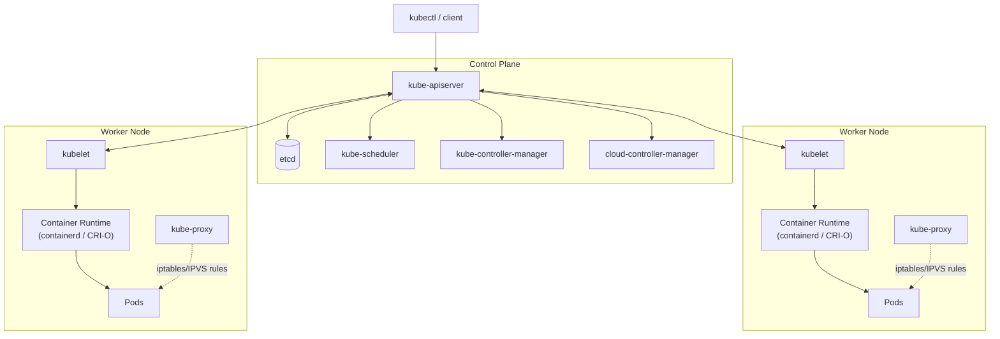

<a id="top"></a>

# Kubernetes Study Notes — Administration & CKA Deep Dive

A single reference covering Kubernetes cluster administration in depth —
bootstrapping, etcd, RBAC, scheduling internals, and troubleshooting by
failure domain — with runnable manifests and the kubectl imperative
patterns CKA actually tests. For container/Kubernetes *fundamentals*
(what a Pod is, Deployment vs StatefulSet, basic networking/storage
concepts), see [Container & Kubernetes Study Notes](../Container/container.md)
first — this doc goes deeper, not wider.

## Table of Contents

1. [Kubernetes Architecture Deep Dive](#1-kubernetes-architecture-deep-dive)
2. [Installing and Bootstrapping a Cluster](#2-installing-and-bootstrapping-a-cluster)
3. [etcd Backup and Restore](#3-etcd-backup-and-restore)
4. [Pods and Multi-Container Patterns](#4-pods-and-multi-container-patterns)
5. [Deployments, ReplicaSets, and Rolling Updates](#5-deployments-replicasets-and-rolling-updates)
6. [StatefulSets and DaemonSets](#6-statefulsets-and-daemonsets)
7. [Jobs and CronJobs](#7-jobs-and-cronjobs)
8. [Probes: Liveness, Readiness, and Startup](#8-probes-liveness-readiness-and-startup)
9. [ConfigMaps, Secrets, and the Downward API](#9-configmaps-secrets-and-the-downward-api)
10. [Services and Networking Deep Dive](#10-services-and-networking-deep-dive)
11. [Ingress and Gateway API](#11-ingress-and-gateway-api)
12. [Network Policies](#12-network-policies)
13. [Storage: Volumes, PV/PVC, StorageClass, CSI](#13-storage-volumes-pvpvc-storageclass-csi)
14. [Scheduling: Affinity, Taints/Tolerations, Priority](#14-scheduling-affinity-taintstolerations-priority)
15. [RBAC and AuthN/AuthZ Deep Dive](#15-rbac-and-authnauthz-deep-dive)
16. [Pod Security Admission and Security Contexts](#16-pod-security-admission-and-security-contexts)
17. [Kubernetes Cluster Security Hardening](#17-kubernetes-cluster-security-hardening)
18. [Cluster Maintenance: Draining, Upgrades, Certificates](#18-cluster-maintenance-draining-upgrades-certificates)
19. [Custom Resources and Operators](#19-custom-resources-and-operators)
20. [Helm Deep Dive](#20-helm-deep-dive)
21. [Troubleshooting Guide by Failure Domain](#21-troubleshooting-guide-by-failure-domain)
22. [kubectl CLI Cheat Sheet](#22-kubectl-cli-cheat-sheet)
23. [Interview Questions](#23-interview-questions)
24. [Study Checklist (CKA Domain-Mapped)](#24-study-checklist-cka-domain-mapped)
25. [Kubernetes Objects Reference (Glossary)](#25-kubernetes-objects-reference-glossary)

---

# 1. Kubernetes Architecture Deep Dive

## Architecture Diagram



Every arrow into the control plane terminates at **kube-apiserver** — it
is the single front door for the entire cluster; no other component
(scheduler, controller-manager, kubelet, kube-proxy) ever talks to etcd,
to each other, or to a Pod directly through anything other than the API
server's watch/write path.

## Control Plane Components

| Component | Definition & Purpose |
|---|---|
| **kube-apiserver** | The front door to the cluster — a stateless REST API server that authenticates, authorizes (RBAC), and admission-controls every request, then reads/writes cluster state to etcd. The only component that talks to etcd directly; horizontally scalable since it holds no state itself. |
| **etcd** | A distributed, Raft-consensus key-value store holding *all* cluster state (every object's spec and status). It is the cluster's single source of truth — losing etcd with no backup means losing the entire cluster configuration. See [§3](#3-etcd-backup-and-restore). |
| **kube-scheduler** | Watches for Pods with no `nodeName` assigned, filters nodes that satisfy the Pod's requirements (resources, affinity, taints), scores the remaining candidates, and writes the winning node back through the API server. Never talks to the kubelet directly. |
| **kube-controller-manager** | Runs dozens of independent reconciliation loops compiled into one binary (Node controller, Deployment controller, ReplicaSet controller, Job controller, ServiceAccount controller, and more) — each loop continuously compares desired vs actual state and drives the cluster toward desired state. |
| **cloud-controller-manager** | Splits out the cloud-provider-specific control loops (provisioning cloud load balancers for `type: LoadBalancer` Services, attaching cloud storage volumes, labeling nodes with cloud topology, removing Node objects when the underlying cloud instance is terminated) — keeps the core `kube-controller-manager` cloud-agnostic. Only present on cloud-managed clusters (EKS, AKS, GKE). |

## Worker Node Components

| Component | Definition & Purpose |
|---|---|
| **kubelet** | The primary node agent — watches the API server for Pods assigned to its own node, tells the container runtime to start/stop containers accordingly, and reports Pod/Node status back. The only control-plane-adjacent component that runs on every node, including control-plane nodes themselves. |
| **kube-proxy** | Implements the Service abstraction on each node by programming iptables (or IPVS) rules that load-balance traffic destined for a Service's virtual IP across the matching Pods' real IPs. See [§10](#10-services-and-networking-deep-dive). |
| **Container Runtime (containerd / CRI-O)** | The software that actually pulls images and runs containers, invoked by the kubelet through the Container Runtime Interface (CRI) — Kubernetes itself is runtime-agnostic as long as the runtime speaks CRI. |
| **CNI Plugin (Calico, Cilium, etc.)** | Provisions the Pod network — assigns each Pod an IP and wires up cross-node Pod-to-Pod routing — invoked by the kubelet through the Container Network Interface (CNI) at Pod creation time. Not a separate node process in the same sense as kubelet/kube-proxy, but a plugin binary the kubelet calls. |

## Control Plane, Request Flow

Every change to the cluster — `kubectl apply`, a controller reconciling,
a kubelet reporting status — goes through the same path:

```text
client (kubectl / controller / kubelet)
  → kube-apiserver
      → authentication (who are you?)
      → authorization — RBAC (are you allowed to do this?)
      → admission control — mutating, then validating webhooks/controllers
      → persisted to etcd
  → watchers (schedulers, controllers, kubelets) notified of the change
```

- **kube-apiserver** is the *only* component that talks to etcd directly.
  Every other component — scheduler, controller-manager, kubelet — reads
  and writes exclusively through the API server, never touching etcd.
- **etcd** is a distributed, Raft-consensus key-value store. Cluster state
  is *the entire cluster* — losing etcd with no backup means losing the
  cluster's entire configuration (though running workloads keep running
  until something needs to change).
- **kube-scheduler** watches for Pods with no `nodeName` set, runs
  filtering (which nodes *can* run this Pod) then scoring (which node
  *should*), and writes the chosen node back via the API server — the
  scheduler never talks to the kubelet directly.
- **kube-controller-manager** runs dozens of independent control loops
  (Node controller, Deployment controller, ReplicaSet controller, Job
  controller, ServiceAccount controller...) compiled into one binary for
  operational simplicity — each loop is logically independent.
- **kubelet** is the only control-plane-adjacent component that runs on
  every node (including control-plane nodes); it doesn't watch the API
  server for *all* objects, only Pods scheduled to its own node, Secrets/
  ConfigMaps those Pods reference, and Node/Lease objects for its own
  node.

## Static Pods (Control Plane Bootstrapping Mechanism)

The control plane components themselves (`kube-apiserver`,
`kube-scheduler`, `kube-controller-manager`, and often `etcd`) typically
run as **static Pods** — manifests placed directly on the control-plane
node's filesystem (default `/etc/kubernetes/manifests/`), which the
kubelet watches and runs *without* the API server being involved at all.
This solves the chicken-and-egg problem of "how does the API server start
if starting it requires the API server."

```bash
# On a control-plane node
ls /etc/kubernetes/manifests/
# etcd.yaml  kube-apiserver.yaml  kube-controller-manager.yaml  kube-scheduler.yaml

# Editing one of these files and saving it is enough to trigger the
# kubelet to restart that static Pod with the new config — no kubectl
# apply needed (and static Pods can't be deleted via kubectl anyway,
# only by removing/editing the manifest file itself)
```

### Interview Keyword
Know the request flow (**apiserver → etcd**, everything else talks only
to the apiserver) and that control-plane components bootstrap as
**static Pods** read directly off disk by the kubelet — a near-guaranteed
CKA topic (troubleshooting a broken control plane means SSHing to the
node and inspecting `/etc/kubernetes/manifests/`, not `kubectl`).

[⬆ Back to top](#top)

---

# 2. Installing and Bootstrapping a Cluster

## kubeadm Cluster Bootstrap

```bash
# On the first control-plane node
kubeadm init \
  --pod-network-cidr=192.168.0.0/16 \
  --apiserver-advertise-address=<control-plane-ip>

# Save the kubeadm join command it prints — needed on every other node

# Configure kubectl for the current user
mkdir -p $HOME/.kube
cp -i /etc/kubernetes/admin.conf $HOME/.kube/config
chown $(id -u):$(id -g) $HOME/.kube/config

# Install a CNI plugin — the cluster has NO Pod networking until this runs;
# nodes stay NotReady until a CNI is installed
kubectl apply -f https://raw.githubusercontent.com/projectcalico/calico/v3.28.0/manifests/calico.yaml

# On every worker node — the token/hash printed by kubeadm init
kubeadm join <control-plane-ip>:6443 \
  --token <token> \
  --discovery-token-ca-cert-hash sha256:<hash>

# Regenerate the join command if the original token has expired (24h default)
kubeadm token create --print-join-command
```

## Common First-Boot Failure

```text
Node stuck in "NotReady":
  1. kubectl get nodes                  — confirm which node(s)
  2. kubectl describe node <name>       — check Conditions section
  3. Most common cause: no CNI plugin installed yet — the kubelet
     reports NotReady until Pod networking exists.
  4. journalctl -u kubelet -f            — check kubelet logs on the
     node itself for the specific error if a CNI is installed but it's
     still NotReady.
```

[⬆ Back to top](#top)

---

# 3. etcd Backup and Restore

The single most operationally critical CKA topic — losing etcd with no
backup means losing the cluster's entire state.

## Backup

```bash
ETCDCTL_API=3 etcdctl snapshot save /opt/backups/etcd-snapshot.db \
  --endpoints=https://127.0.0.1:2379 \
  --cacert=/etc/kubernetes/pki/etcd/ca.crt \
  --cert=/etc/kubernetes/pki/etcd/server.crt \
  --key=/etc/kubernetes/pki/etcd/server.key

# Verify the snapshot
ETCDCTL_API=3 etcdctl snapshot status /opt/backups/etcd-snapshot.db --write-out=table
```

The three cert/key paths are found in the static Pod manifest itself
(`/etc/kubernetes/manifests/etcd.yaml`) if you don't already know them —
reading that file is a normal, expected step, not a shortcut.

## Restore

```bash
# Restore to a NEW data directory — never restore over the live one
ETCDCTL_API=3 etcdctl snapshot restore /opt/backups/etcd-snapshot.db \
  --data-dir=/var/lib/etcd-restored

# Update the etcd static Pod manifest's hostPath volume to point at the
# restored directory instead of the original
#   volumes:
#     - hostPath:
#         path: /var/lib/etcd-restored   # was /var/lib/etcd
#       name: etcd-data

# The kubelet detects the manifest change and restarts the etcd static
# Pod automatically against the restored data directory
```

### Interview Keyword
Restore to a **new** data directory, then repoint the static Pod manifest
— never restore in place over the live etcd data directory, since a
failed restore with no fallback is worse than the original problem.

[⬆ Back to top](#top)

---

# 4. Pods and Multi-Container Patterns

A **Pod** is the smallest deployable unit in Kubernetes — one or more
containers that share a network namespace (same IP address, and can reach
each other over `localhost`), an IPC namespace, and optionally storage
volumes. Pods are treated as disposable and ephemeral by design: you don't
patch a running Pod, you replace it. Multiple containers in one Pod exist
to co-locate genuinely tightly coupled processes (see the patterns below),
not as a general way to group unrelated workloads.

## Init Containers

Run to completion, in order, *before* any app container starts — used
for setup work the main container shouldn't have to handle itself.

```yaml
apiVersion: v1
kind: Pod
metadata:
  name: app-with-init
spec:
  initContainers:
    - name: wait-for-db
      image: busybox:1.36
      command: ["sh", "-c", "until nc -z db-service 5432; do sleep 2; done"]
  containers:
    - name: app
      image: myapp:1.0
```

## Multi-Container Pod Patterns

| Pattern | Purpose |
|---|---|
| **Sidecar** | A helper container running alongside the main one for its whole lifetime — e.g., a log-shipping agent tailing the app's log files. |
| **Ambassador** | A proxy container simplifying network access to an external service for the main container (e.g., a local proxy handling connection pooling to a remote DB). |
| **Adapter** | Normalizes the main container's output into a standard format for external tools (e.g., transforming app-specific logs into a common monitoring format). |

## Ephemeral Debug Containers

```bash
# Attach a debug container to an already-running Pod without restarting
# it — for a distroless/minimal image with no shell to exec into
kubectl debug -it <pod-name> --image=busybox:1.36 --target=<container-name>
```

[⬆ Back to top](#top)

---

# 5. Deployments, ReplicaSets, and Rolling Updates

A **ReplicaSet** guarantees a specified number of identical Pod replicas
are running at all times, replacing any that die. A **Deployment** sits
one level above it, managing ReplicaSets to provide declarative updates —
rolling updates, rollback to a prior revision, and scaling — for
stateless workloads. In practice you almost never create a ReplicaSet
directly; every update to a Deployment creates a *new* ReplicaSet rather
than mutating the existing one, which is exactly what makes rollback
possible (Kubernetes just switches back to a previous ReplicaSet).

## Rolling Update Strategy

```yaml
apiVersion: apps/v1
kind: Deployment
metadata:
  name: web
spec:
  replicas: 5
  strategy:
    type: RollingUpdate
    rollingUpdate:
      maxUnavailable: 1   # at most 1 replica down during the rollout
      maxSurge: 1         # at most 1 extra replica above desired count
  selector:
    matchLabels: { app: web }
  template:
    metadata:
      labels: { app: web }
    spec:
      containers:
        - name: web
          image: myapp:1.5
```

```bash
kubectl rollout status deployment/web
kubectl rollout history deployment/web
kubectl rollout undo deployment/web                 # roll back to previous revision
kubectl rollout undo deployment/web --to-revision=3  # roll back to a specific revision
kubectl rollout pause deployment/web                 # halt an in-progress rollout
kubectl rollout resume deployment/web
```

**`maxUnavailable: 0`** guarantees zero capacity loss during a rollout
(every old Pod stays until its replacement is Ready) at the cost of
briefly running more total Pods (`maxSurge` above desired count) — the
standard choice for a workload that can't tolerate any capacity dip.

[⬆ Back to top](#top)

---

# 6. StatefulSets and DaemonSets

A **StatefulSet** is like a Deployment but for stateful workloads that
need stable, unique network identities (`pod-0`, `pod-1`, ...) and stable
per-Pod storage that survives rescheduling — the fit for databases,
queues, and other clustered software where a client needs to talk to a
*specific* replica, not just "any healthy one." A **DaemonSet** solves a
different problem entirely: it ensures exactly one copy of a Pod runs on
every (or a selected subset of) node automatically, the standard pattern
for node-level agents like log collectors, CNI plugins, and monitoring
agents.

## StatefulSet Ordering Guarantees

- Pods are created **and** terminated in strict ordinal order (`web-0`
  before `web-1` before `web-2`) by default — each Pod must be Running
  and Ready before the next one starts.
- `podManagementPolicy: Parallel` removes this ordering constraint when
  the workload doesn't need it (faster scale-up, no per-Pod dependency).
- Each replica's PVC (from `volumeClaimTemplates`) is **not** deleted
  when the StatefulSet scales down — scaling `web` from 3 to 1 leaves
  `web-1-data` and `web-2-data` PVCs orphaned but intact, so scaling back
  up restores the same data.

## DaemonSet Node Targeting

```yaml
apiVersion: apps/v1
kind: DaemonSet
metadata:
  name: log-agent
spec:
  selector:
    matchLabels: { app: log-agent }
  template:
    metadata:
      labels: { app: log-agent }
    spec:
      tolerations:
        # DaemonSets must explicitly tolerate the control-plane taint to
        # also run there — otherwise they skip control-plane nodes
        - key: node-role.kubernetes.io/control-plane
          effect: NoSchedule
      containers:
        - name: log-agent
          image: fluent-bit:3.0
```

[⬆ Back to top](#top)

---

# 7. Jobs and CronJobs

A **Job** runs a Pod (or several) to completion for a finite, one-off
task rather than a long-running service — unlike a Deployment's Pods,
a Job's Pods are *expected* to exit, and the Job retries a failed Pod up
to `backoffLimit` before giving up. A **CronJob** creates Jobs on a
repeating schedule using standard cron syntax — the Kubernetes-native
equivalent of a crontab entry.

```yaml
apiVersion: batch/v1
kind: Job
metadata:
  name: data-migration
spec:
  completions: 5        # run the Pod 5 times total
  parallelism: 2         # up to 2 Pods running at once
  backoffLimit: 4         # retry a failed Pod up to 4 times before marking the Job failed
  activeDeadlineSeconds: 600  # kill the whole Job if it runs longer than this
  template:
    spec:
      restartPolicy: Never   # Jobs cannot use restartPolicy: Always
      containers:
        - name: migrate
          image: migrate-tool:1.0
```

```yaml
apiVersion: batch/v1
kind: CronJob
metadata:
  name: nightly-cleanup
spec:
  schedule: "0 2 * * *"
  concurrencyPolicy: Forbid   # skip a new run if the previous one is still going
  jobTemplate:
    spec:
      template:
        spec:
          restartPolicy: Never
          containers:
            - name: cleanup
              image: cleanup-tool:1.0
```

**`concurrencyPolicy`**: `Allow` (default, runs overlap), `Forbid` (skip
the new run if one is active), `Replace` (kill the running one, start the
new one) — `Forbid` is the usual choice for anything not safe to run
concurrently with itself.

[⬆ Back to top](#top)

---

# 8. Probes: Liveness, Readiness, and Startup

| Probe | If It Fails | Use For |
|---|---|---|
| **livenessProbe** | Container is killed and restarted per `restartPolicy` | Detecting a hung/deadlocked process that's still running but no longer working |
| **readinessProbe** | Pod removed from Service Endpoints (traffic stops routing to it), container is **not** restarted | Signaling "I'm running but not ready for traffic yet" (e.g., still loading a cache) |
| **startupProbe** | Container is killed and restarted; liveness/readiness probes are disabled until this succeeds | Slow-starting applications, so a generous startup allowance doesn't force a permanently loose liveness timeout |

```yaml
containers:
  - name: app
    image: myapp:1.0
    startupProbe:
      httpGet: { path: /healthz, port: 8080 }
      failureThreshold: 30
      periodSeconds: 10   # up to 300s to start before liveness probing begins
    livenessProbe:
      httpGet: { path: /healthz, port: 8080 }
      periodSeconds: 10
      failureThreshold: 3
    readinessProbe:
      httpGet: { path: /ready, port: 8080 }
      periodSeconds: 5
      failureThreshold: 2
```

**Common mistake**: pointing `livenessProbe` at the same endpoint as
`readinessProbe` with an aggressive threshold — a temporarily overloaded
(but not actually broken) app fails readiness (correct: stop sending it
traffic) but then also fails liveness and gets restarted (wrong: killing
an overloaded process makes the overload worse for everyone else).

[⬆ Back to top](#top)

---

# 9. ConfigMaps, Secrets, and the Downward API

A **ConfigMap** stores non-sensitive configuration data (key-value pairs,
whole files) that can be mounted into a Pod as environment variables or
volumes, decoupling configuration from the container image so the same
image runs unchanged across dev/staging/prod. A **Secret** is the same
mechanism for sensitive data (passwords, tokens, certs) — base64-encoded,
not encrypted, at rest by default. The **Downward API** exposes a Pod's
own metadata (its name, namespace, resource requests) to itself as
environment variables or files, without the Pod needing to call the API
server to find out.

## Mounting vs Environment Variables

```yaml
containers:
  - name: app
    envFrom:
      - configMapRef: { name: app-config }
      - secretRef: { name: app-secrets }
    volumeMounts:
      - name: config-volume
        mountPath: /etc/config
volumes:
  - name: config-volume
    configMap: { name: app-config }
```

**Env vars are snapshotted at container start** — updating a ConfigMap
doesn't change already-running env vars, requiring a Pod restart.
**Mounted volumes update automatically** (with a short propagation
delay) without restarting the Pod — a real, frequently-tested
distinction.

## Downward API (Exposing Pod Metadata to the Container)

```yaml
env:
  - name: POD_NAME
    valueFrom: { fieldRef: { fieldPath: metadata.name } }
  - name: POD_NAMESPACE
    valueFrom: { fieldRef: { fieldPath: metadata.namespace } }
  - name: CPU_REQUEST
    valueFrom: { resourceFieldRef: { containerName: app, resource: requests.cpu } }
```

[⬆ Back to top](#top)

---

# 10. Services and Networking Deep Dive

A **Service** is a stable virtual IP and DNS name that load-balances
traffic across a dynamic set of Pods matched by a label selector, so
clients never need to track individual (and constantly changing) Pod
IPs. The actual list of Pod IPs a Service currently routes to is tracked
in an **EndpointSlice** object, updated automatically as matching Pods
come and go.

## How kube-proxy Actually Routes Traffic

`kube-proxy` runs on every node and watches Services/Endpoints, then
programs the node's packet-forwarding rules (iptables or IPVS mode) so
traffic to a Service's ClusterIP gets DNAT'd to one of the Pod IPs behind
it — this happens at the kernel level, not via a running proxy process
handling every packet (in iptables mode; IPVS mode does use an in-kernel
virtual server, still not a userspace proxy for every packet).

## Endpoints vs EndpointSlices

`EndpointSlices` are the modern replacement for the original `Endpoints`
object — they shard a Service's backend Pod list across multiple
smaller objects instead of one potentially-huge object, which matters at
scale (an `Endpoints` object listing thousands of Pod IPs becomes a
performance problem for every watcher; EndpointSlices cap each slice's
size and shard automatically).

```bash
kubectl get endpointslices -l kubernetes.io/service-name=<service-name>
```

## headless Services (`clusterIP: None`)

```yaml
apiVersion: v1
kind: Service
metadata:
  name: postgres
spec:
  clusterIP: None
  selector: { app: postgres }
  ports: [{ port: 5432 }]
```

No load-balancing virtual IP at all — DNS for a headless Service
resolves directly to the individual backing Pod IPs, which is exactly
what a StatefulSet needs so each replica (`postgres-0`, `postgres-1`) is
individually addressable by DNS name.

[⬆ Back to top](#top)

---

# 11. Ingress and Gateway API

An **Ingress** declares HTTP/HTTPS routing rules (host/path → Service)
for traffic entering the cluster from outside — but the object is purely
declarative and does nothing on its own without an **Ingress Controller**
(NGINX, Traefik, a cloud-native one) actually running to watch and
implement it. **Gateway API** is the newer, more expressive successor,
splitting infrastructure-owner concerns (`GatewayClass`/`Gateway`) from
app-owner concerns (`HTTPRoute`).

```yaml
apiVersion: networking.k8s.io/v1
kind: Ingress
metadata:
  name: web-ingress
  annotations:
    nginx.ingress.kubernetes.io/rewrite-target: /
spec:
  ingressClassName: nginx
  rules:
    - host: app.example.com
      http:
        paths:
          - path: /api
            pathType: Prefix
            backend:
              service: { name: api-svc, port: { number: 80 } }
          - path: /
            pathType: Prefix
            backend:
              service: { name: web-svc, port: { number: 80 } }
```

An `Ingress` object is inert without an **Ingress Controller** (NGINX,
Traefik, cloud-native) actually running in the cluster to watch and
implement it — creating the object alone routes nothing.

**Gateway API** is the newer, more expressive successor — splits
`GatewayClass`/`Gateway` (infrastructure-owner concerns) from `HTTPRoute`
(app-owner concerns), and supports protocols beyond HTTP that Ingress
never standardized.

[⬆ Back to top](#top)

---

# 12. Network Policies

A **NetworkPolicy** is a firewall rule set for Pod-to-Pod traffic, scoped
by label selector — a genuinely important default to internalize: without
any NetworkPolicy, every Pod in a cluster can reach every other Pod, in
every namespace, by default. A NetworkPolicy only takes effect if the
CNI plugin actually enforces it; some CNI plugins silently accept the
object without enforcing it at all.

```yaml
# Default-deny all ingress in a namespace, then explicitly allow what's needed
apiVersion: networking.k8s.io/v1
kind: NetworkPolicy
metadata:
  name: default-deny-ingress
  namespace: production
spec:
  podSelector: {}
  policyTypes: ["Ingress"]
---
apiVersion: networking.k8s.io/v1
kind: NetworkPolicy
metadata:
  name: allow-frontend-to-backend
  namespace: production
spec:
  podSelector:
    matchLabels: { app: backend }
  policyTypes: ["Ingress"]
  ingress:
    - from:
        - podSelector: { matchLabels: { app: frontend } }
      ports:
        - protocol: TCP
          port: 8080
```

**Verify the CNI plugin actually enforces NetworkPolicy** before relying
on it — the object is valid Kubernetes API regardless of the CNI, but
some CNI plugins silently ignore it (a NetworkPolicy that does nothing,
with no error, is a real production incident waiting to happen).

[⬆ Back to top](#top)

---

# 13. Storage: Volumes, PV/PVC, StorageClass, CSI

A **PersistentVolume (PV)** is a piece of cluster storage — provisioned
either statically by an admin or dynamically on demand — that exists
independently of any Pod's lifecycle, which is what lets data survive a
Pod being rescheduled elsewhere. A **PersistentVolumeClaim (PVC)** is a
Pod's *request* for storage, matched against an available PV by size,
access mode, and StorageClass; Pods always reference the PVC, never the
PV directly. A **StorageClass** defines *how* to dynamically provision a
PV on demand (which CSI driver, what parameters, what reclaim policy),
removing the need to hand-create PVs for every claim.

## Static vs Dynamic Provisioning

```yaml
# Static: an admin pre-creates the PV
apiVersion: v1
kind: PersistentVolume
metadata: { name: pv-manual }
spec:
  capacity: { storage: 10Gi }
  accessModes: ["ReadWriteOnce"]
  hostPath: { path: /mnt/data }
---
# Dynamic: a StorageClass provisions a PV on-demand when a PVC requests it
apiVersion: storage.k8s.io/v1
kind: StorageClass
metadata: { name: fast-ssd }
provisioner: ebs.csi.aws.com
parameters: { type: gp3 }
volumeBindingMode: WaitForFirstConsumer
---
apiVersion: v1
kind: PersistentVolumeClaim
metadata: { name: data-claim }
spec:
  storageClassName: fast-ssd
  accessModes: ["ReadWriteOnce"]
  resources: { requests: { storage: 20Gi } }
```

**`volumeBindingMode: WaitForFirstConsumer`** delays actual volume
provisioning until a Pod using the PVC is scheduled — important for
topology-aware storage (e.g., an EBS volume must be created in the same
AZ as the node the Pod lands on; provisioning eagerly, before scheduling,
can create a volume in the wrong AZ).

## Reclaim Policy

`persistentVolumeReclaimPolicy: Retain` (keep the underlying storage
after the PVC is deleted, requiring manual cleanup) vs `Delete` (destroy
the underlying storage automatically) — `Retain` is the safer default
for anything holding data that would be expensive/impossible to
regenerate.

[⬆ Back to top](#top)

---

# 14. Scheduling: Affinity, Taints/Tolerations, Priority

**Affinity/anti-affinity** rules influence *where* a Pod can or should be
scheduled, relative to node properties (node affinity) or other Pods (pod
affinity/anti-affinity). **Taints** are applied to *nodes* to repel Pods
that don't explicitly tolerate them; a **toleration** on a Pod is what
allows it onto an otherwise-repelling node — taints and tolerations are
opt-in on the Pod side, the inverse of affinity, which is opt-in on
neither side by default. A **PriorityClass** assigns Pods a scheduling
priority so higher-priority Pods can preempt lower-priority ones under
resource pressure.

## Node Affinity vs Pod Affinity/Anti-Affinity

```yaml
affinity:
  nodeAffinity:
    requiredDuringSchedulingIgnoredDuringExecution:
      nodeSelectorTerms:
        - matchExpressions:
            - key: disktype
              operator: In
              values: ["ssd"]
  podAntiAffinity:
    requiredDuringSchedulingIgnoredDuringExecution:
      - labelSelector:
          matchLabels: { app: web }
        topologyKey: "kubernetes.io/hostname"   # never co-locate two web Pods on one node
```

- **Node affinity** — which *nodes* a Pod can go on (a property-based
  alternative to `nodeSelector`, with `required` vs `preferred` variants).
- **Pod affinity/anti-affinity** — placement *relative to other Pods*
  (spread replicas across nodes/zones, or co-locate a cache next to the
  app that uses it).
- **`IgnoredDuringExecution`** in both cases means the rule is only
  checked at scheduling time — a Pod already running is never evicted
  just because the rule would no longer be satisfied.

## Taints and Tolerations

```bash
kubectl taint nodes node1 gpu=true:NoSchedule
```

```yaml
tolerations:
  - key: "gpu"
    operator: "Equal"
    value: "true"
    effect: "NoSchedule"
```

| Effect | Behavior |
|---|---|
| `NoSchedule` | New Pods without a matching toleration won't be scheduled here; already-running Pods are unaffected. |
| `PreferNoSchedule` | Best-effort avoidance, not a hard rule. |
| `NoExecute` | New Pods won't schedule *and* already-running Pods without the toleration are evicted. |

## Priority Classes and Preemption

```yaml
apiVersion: scheduling.k8s.io/v1
kind: PriorityClass
metadata: { name: high-priority }
value: 1000000
globalDefault: false
```

A Pod with a higher `priorityClassName` can **preempt** (evict) lower-
priority Pods on a node if that's the only way to fit it — a real
production risk if applied carelessly, since it means a high-priority
Pod's arrival can kill an already-running lower-priority workload.

[⬆ Back to top](#top)

---

# 15. RBAC and AuthN/AuthZ Deep Dive

RBAC (Role-Based Access Control) is built from four objects working in
pairs: a **Role** (or cluster-scoped **ClusterRole**) defines *what*
permissions exist — verbs on resources — and a **RoleBinding** (or
**ClusterRoleBinding**) grants those permissions *to* a specific
User/Group/ServiceAccount. A Role/ClusterRole alone grants nothing; it
only takes effect once bound to an identity via a (Cluster)RoleBinding.

## The Three-Stage Pipeline (repeated from §1, RBAC-focused)

1. **Authentication** — establishes *who* (a user via client cert/OIDC
   token, or a Pod via its ServiceAccount token).
2. **Authorization** — RBAC (or ABAC/webhook, less common) decides if
   that identity can perform the requested verb on the requested
   resource.
3. **Admission control** — mutating webhooks run first (can modify the
   request), then validating webhooks (can only accept/reject).

## Role/RoleBinding vs ClusterRole/ClusterRoleBinding

```yaml
apiVersion: rbac.authorization.k8s.io/v1
kind: Role                          # namespace-scoped
metadata: { namespace: production, name: pod-reader }
rules:
  - apiGroups: [""]
    resources: ["pods"]
    verbs: ["get", "list", "watch"]
---
apiVersion: rbac.authorization.k8s.io/v1
kind: RoleBinding
metadata: { namespace: production, name: read-pods }
subjects:
  - kind: ServiceAccount
    name: monitoring-sa
    namespace: production
roleRef: { kind: Role, name: pod-reader, apiGroup: rbac.authorization.k8s.io }
```

A **ClusterRole** can be bound via a **RoleBinding** (not just a
ClusterRoleBinding) to grant those cluster-defined permissions scoped to
just one namespace — a commonly tested nuance: ClusterRole doesn't
automatically mean cluster-wide access, only that the *role definition*
isn't namespace-scoped; the *binding* still controls the actual scope.

## Checking Permissions

```bash
kubectl auth can-i create pods --namespace production
kubectl auth can-i create pods --as=system:serviceaccount:production:monitoring-sa
kubectl auth can-i --list --namespace production
```

[⬆ Back to top](#top)

---

# 16. Pod Security Admission and Security Contexts

```yaml
apiVersion: v1
kind: Namespace
metadata:
  name: production
  labels:
    pod-security.kubernetes.io/enforce: restricted
    pod-security.kubernetes.io/audit: restricted
    pod-security.kubernetes.io/warn: restricted
```

| Level | Behavior |
|---|---|
| **Privileged** | Unrestricted — the default if no label is set. |
| **Baseline** | Blocks known privilege escalations (host namespaces, privileged containers) while staying broadly compatible. |
| **Restricted** | Heavily hardened — enforces non-root, dropped capabilities, no privilege escalation; may break workloads not written with this in mind. |

```yaml
securityContext:
  runAsNonRoot: true
  runAsUser: 1000
  readOnlyRootFilesystem: true
  allowPrivilegeEscalation: false
  capabilities: { drop: ["ALL"] }
seccompProfile: { type: RuntimeDefault }
```

**Namespace-level** `pod-security.kubernetes.io/*` labels set the
*policy*; **Pod-level** `securityContext` is what a Pod must actually
declare to satisfy it — Restricted mode will reject a Pod at admission
time if its `securityContext` doesn't comply, with a clear error message
naming exactly which requirement failed.

[⬆ Back to top](#top)

---

# 17. Kubernetes Cluster Security Hardening

Securing a cluster is a **defense-in-depth** exercise — no single control
is sufficient alone. The standard mental model is the "4 C's of Cloud
Native Security," each layer only as strong as the ones inside it.

## The 4 C's of Cloud Native Security

```text
Cloud      → the underlying infrastructure (cloud provider IAM, network
             boundaries, managed control plane security)
Cluster    → the Kubernetes cluster itself (API server, etcd, kubelet,
             RBAC, admission control, network policy)
Container  → the container image and runtime (minimal base images,
             no root, read-only filesystem, seccomp/AppArmor)
Code       → the application itself (dependency scanning, secure coding,
             secrets never hardcoded)
```

Each outer layer's compromise widens the blast radius of every layer
inside it — a compromised Cloud layer (e.g., leaked cloud credentials)
can grant full Cluster access regardless of how well the Cluster layer
itself is hardened.

## API Server Hardening

```yaml
# Flags on the kube-apiserver static Pod manifest
# /etc/kubernetes/manifests/kube-apiserver.yaml
- --anonymous-auth=false                    # reject unauthenticated requests outright
- --insecure-port=0                          # disable the deprecated unencrypted port entirely
- --authorization-mode=Node,RBAC              # RBAC must be enabled explicitly
- --enable-admission-plugins=NodeRestriction,PodSecurity,...
- --audit-log-path=/var/log/kubernetes/audit.log
- --audit-policy-file=/etc/kubernetes/audit-policy.yaml
- --tls-cert-file=... --tls-private-key-file=...
- --client-ca-file=/etc/kubernetes/pki/ca.crt
```

**`NodeRestriction`** — a built-in admission plugin worth calling out
specifically: limits a kubelet's own credentials so it can only modify
its *own* Node and Pod objects, not any other node's — without this, a
compromised kubelet could tamper with the entire cluster's Node/Pod
state, not just its own.

## etcd Encryption at Rest — the Most Skipped Hardening Step

**Kubernetes Secrets are base64-encoded, not encrypted, by default** —
anyone with filesystem access to an etcd host (or a backup of etcd) can
read every Secret in the cluster in plaintext unless encryption at rest
is explicitly configured.

```yaml
# /etc/kubernetes/enc/encryption-config.yaml
apiVersion: apiserver.config.k8s.io/v1
kind: EncryptionConfiguration
resources:
  - resources: ["secrets"]
    providers:
      - aescbc:
          keys:
            - name: key1
              secret: <base64-encoded-32-byte-key>
      - identity: {}   # fallback for reading pre-existing unencrypted data
```

```bash
# Reference it from the API server
--encryption-provider-config=/etc/kubernetes/enc/encryption-config.yaml
```

Existing Secrets are **not** retroactively encrypted just by enabling
this — they're encrypted the next time they're written. Re-save every
existing Secret to bring them under encryption:

```bash
kubectl get secrets --all-namespaces -o json | kubectl replace -f -
```

## kubelet Hardening

```yaml
# /var/lib/kubelet/config.yaml
authentication:
  anonymous:
    enabled: false
  webhook:
    enabled: true
authorization:
  mode: Webhook
readOnlyPort: 0
```

An exposed kubelet API with anonymous access allows anyone on the
network to list every Pod's details or execute commands inside
containers on that node — the kubelet is a frequent, under-secured
attack surface precisely because it's easy to forget it has its own API
distinct from the API server's.

## Admission Controllers

Built-in admission plugins (a partial list, in the order they typically
matter for security):

| Plugin | Purpose |
|---|---|
| **NodeRestriction** | Limits kubelet credentials to modifying only their own Node/Pods. |
| **PodSecurity** | Enforces Pod Security Standards (see [§16](#16-pod-security-admission-and-security-contexts)). |
| **ResourceQuota** | Enforces namespace-level resource caps — a security control against resource-exhaustion attacks, not just a cost control. |
| **LimitRanger** | Enforces default/min/max resource requests/limits per Pod/container. |
| **AlwaysPullImages** | Forces an image pull (and re-auth check) on every Pod start, closing a gap where a Pod could reuse a cached image it shouldn't have access to anymore. |

For anything beyond what built-in plugins cover, use a **policy engine**
(see [Container & Kubernetes Study Notes §12](../Container/container.md#12-container-and-kubernetes-security)
for the OPA/Gatekeeper vs Kyverno comparison) — e.g., blocking Pods that
don't come from an approved registry, or requiring every image be
signed.

```yaml
# Kyverno — block any image not from the approved registry
apiVersion: kyverno.io/v1
kind: ClusterPolicy
metadata: { name: restrict-image-registries }
spec:
  validationFailureAction: Enforce
  rules:
    - name: approved-registries-only
      match: { resources: { kinds: ["Pod"] } }
      validate:
        message: "Images must come from registry.company.com"
        pattern:
          spec:
            containers:
              - image: "registry.company.com/*"
```

## Image Supply Chain Security

```bash
# Scan before it ever reaches the cluster
trivy image --severity HIGH,CRITICAL --exit-code 1 myregistry.io/myapp:1.4.0

# Sign at build time
cosign sign --yes myregistry.io/myapp:1.4.0
```

```yaml
# Enforce signature verification at admission time (Kyverno example)
apiVersion: kyverno.io/v1
kind: ClusterPolicy
metadata: { name: require-signed-images }
spec:
  validationFailureAction: Enforce
  rules:
    - name: verify-signature
      match: { resources: { kinds: ["Pod"] } }
      verifyImages:
        - imageReferences: ["registry.company.com/*"]
          attestors:
            - entries:
                - keys: { publicKeys: "<cosign public key>" }
```

See [DevSecOps.md §13](../DevSecOps/DevSecOps.md#13-supply-chain-security-sbom-signing-slsa)
for the full SBOM/signing/SLSA treatment — this is the admission-time
enforcement half of that same pipeline.

## Runtime Security

```yaml
# Seccomp — restrict which syscalls a container can make
securityContext:
  seccompProfile: { type: RuntimeDefault }
```

```yaml
# Falco rule — detect a shell spawned inside a container that should
# never spawn one (a classic post-exploitation signal)
- rule: Shell Spawned in Container
  desc: Detect shell execution inside a running container
  condition: spawned_process and container and proc.name in (bash, sh, zsh)
  output: Shell spawned in container (user=%user.name container=%container.name command=%proc.cmdline)
  priority: WARNING
```

Falco watches syscalls in real time — it catches what static scanning
and admission control can't, because it's looking at *actual runtime
behavior*, not the image or manifest.

## Network-Level Cluster Security

- **Restrict API server exposure** — the API server should never be
  reachable from the open internet without additional controls (a
  bastion, VPN, or cloud-native private-endpoint feature); exposing
  `:6443` publicly with only auth as the barrier is a common real-world
  breach vector.
- **NetworkPolicy default-deny** — see [§12](#12-network-policies); pair
  with confirming the CNI actually enforces it.
- **Service mesh mTLS** — for defense in depth beyond NetworkPolicy, a
  mesh (Istio/Linkerd, see
  [Container & Kubernetes Study Notes §15](../Container/container.md#15-service-mesh))
  encrypts and authenticates *every* Pod-to-Pod connection automatically,
  closing the gap where NetworkPolicy controls *whether* traffic is
  allowed but not whether it's *encrypted*.

## Audit Logging

```yaml
# /etc/kubernetes/audit-policy.yaml
apiVersion: audit.k8s.io/v1
kind: Policy
rules:
  - level: Metadata
    resources:
      - group: ""
        resources: ["secrets", "configmaps"]
  - level: RequestResponse
    resources:
      - group: "rbac.authorization.k8s.io"
        resources: ["*"]
  - level: None
    users: ["system:kube-proxy"]
    verbs: ["watch"]
```

Audit levels (least to most verbose): `None` → `Metadata` (who/what/when,
no request/response body) → `Request` (adds the request body) →
`RequestResponse` (adds the response body too) — scope the most verbose
levels narrowly (e.g., RBAC changes) since `RequestResponse` on
everything generates enormous log volume for little added value on
routine reads.

## CIS Benchmarks and kube-bench

```bash
# Run the CIS Kubernetes Benchmark against a live cluster
kube-bench run --targets master,node,etcd,policies
```

`kube-bench` checks the actual running configuration (API server flags,
file permissions on kubeconfig/cert files, etc.) against the CIS
Kubernetes Benchmark and reports PASS/FAIL/WARN per control — the
standard first step in any cluster security audit, since it turns "is
this cluster hardened" from a manual checklist into an automated report.

## Multi-Tenancy and Resource Isolation

```yaml
apiVersion: v1
kind: ResourceQuota
metadata: { name: team-quota, namespace: team-a }
spec:
  hard:
    requests.cpu: "20"
    requests.memory: 40Gi
    pods: "50"
---
apiVersion: v1
kind: LimitRange
metadata: { name: default-limits, namespace: team-a }
spec:
  limits:
    - default: { cpu: "500m", memory: "512Mi" }
      defaultRequest: { cpu: "250m", memory: "256Mi" }
      type: Container
```

Namespaces alone provide **no** resource isolation — without a
ResourceQuota, one tenant's runaway workload can starve every other
tenant sharing the cluster of CPU/memory. This is a security control as
much as a cost control: unbounded resource consumption is a denial-of-
service vector, whether malicious or accidental.

## Cluster Hardening Summary

| Layer | Control | Where |
|---|---|---|
| API Server | Disable anonymous auth/insecure port, enable RBAC + audit logging | This section |
| etcd | Encryption at rest for Secrets | This section |
| kubelet | Disable anonymous auth, disable read-only port | This section |
| RBAC | Least-privilege Roles, avoid ClusterRoleBindings where a RoleBinding suffices | [§15](#15-rbac-and-authnauthz-deep-dive) |
| Pod Security | `restricted` Pod Security Standard, explicit securityContext | [§16](#16-pod-security-admission-and-security-contexts) |
| Network | Default-deny NetworkPolicy, restrict API server exposure | [§12](#12-network-policies), this section |
| Supply Chain | Image scanning + signing, admission-time verification | This section, [DevSecOps.md §13](../DevSecOps/DevSecOps.md#13-supply-chain-security-sbom-signing-slsa) |
| Runtime | Falco, seccomp/AppArmor profiles | This section |
| Multi-Tenancy | ResourceQuota + LimitRange per namespace | This section |
| Auditing | Scoped audit policy, `kube-bench` against CIS Benchmark | This section |

### Interview Keyword
"How would you secure a Kubernetes cluster" should walk through the
**4 C's** (Cloud/Cluster/Container/Code), then name concrete controls at
each layer — API server flags, etcd encryption, RBAC least privilege,
Pod Security Standards, NetworkPolicy, image scanning/signing, and
`kube-bench` against the CIS Benchmark — rather than naming just one
control in isolation.

[⬆ Back to top](#top)

---

# 18. Cluster Maintenance: Draining, Upgrades, Certificates

## Draining a Node for Maintenance

```bash
kubectl cordon node1                              # mark unschedulable, don't evict yet
kubectl drain node1 --ignore-daemonsets --delete-emptydir-data
# ... perform maintenance ...
kubectl uncordon node1                              # mark schedulable again
```

`--ignore-daemonsets` is required because DaemonSet-managed Pods are
*designed* to run on every node and can't be "drained" the normal way;
`--delete-emptydir-data` is required if any Pod uses an `emptyDir`
volume, since draining would otherwise refuse to proceed and lose that
data silently is not an option Kubernetes takes by default.

## OS / Software Patching a Node

```bash
# Standard patch-in-place workflow — one node at a time, never in parallel
kubectl cordon node1
kubectl drain node1 --ignore-daemonsets --delete-emptydir-data

# On the node itself — OS package/kernel patching
apt-get update && apt-get upgrade -y
# or: yum update -y / dnf update -y

# Reboot only if the patch requires it (kernel, some libc updates)
reboot

# After the node rejoins and kubelet is healthy again
kubectl get nodes                # confirm Ready
kubectl uncordon node1
```

**Never patch/reboot multiple nodes in parallel** without first
confirming the cluster (and any StatefulSet/PDB-protected workloads) can
tolerate the simultaneous capacity loss — a `PodDisruptionBudget` blocks
`kubectl drain` from evicting past its `minAvailable` threshold, which is
the built-in guardrail against exactly this mistake (see
[§14](#14-scheduling-affinity-taintstolerations-priority) for
`PodDisruptionBudget`).

**Automating the cordon-drain-patch-reboot-uncordon cycle at scale**:
tools like **kured** (Kubernetes Reboot Daemon) watch for a
"reboot-required" marker file left by the OS package manager on each
node, then automatically cordon, drain, reboot, and uncordon — one node
at a time, cluster-wide — instead of a human running this manually node
by node.

## Node Replacement (Immutable Infrastructure Pattern)

Increasingly preferred over patch-in-place, especially on managed
Kubernetes (EKS/AKS/GKE): instead of patching an existing node, **replace
it outright** with a new node built from an updated, known-good image —
avoiding configuration drift and the "well it worked before the patch"
class of problem entirely.

```bash
# Manual replacement sequence
kubectl cordon old-node
kubectl drain old-node --ignore-daemonsets --delete-emptydir-data
kubectl delete node old-node          # remove the Node object from the cluster

# Terminate the underlying VM/instance (cloud console/CLI, or on-prem
# hypervisor) — a NEW instance built from an updated base image then
# runs kubeadm join (or is provisioned by the managed node group/pool)
# and registers as a brand-new Node object automatically
```

- **Managed node groups (EKS) / node pools (AKS, GKE)** — rolling replace
  automatically: launch new nodes on the updated AMI/image, cordon+drain
  the old ones, terminate them, one batch at a time, driven by the cloud
  provider rather than manual `kubectl` commands.
- **Karpenter** (AWS) — goes further, actively identifying and replacing
  *drifted* nodes (running an outdated node image relative to the
  current provisioner spec) as part of its normal consolidation loop,
  with no separate "patch cycle" concept at all.

**Preferred over patch-in-place when**: consistency matters more than
preserving node-specific state — replacement guarantees every node
matches the same known-good image, while patch-in-place accumulates
subtle drift across nodes patched at different times with different
package-manager states.

## kubeadm Cluster Upgrade (One Minor Version at a Time)

```bash
# Control plane node first
apt-get install -y kubeadm=1.31.x-*
kubeadm upgrade plan
kubeadm upgrade apply v1.31.x

apt-get install -y kubelet=1.31.x-* kubectl=1.31.x-*
systemctl restart kubelet

# Then each worker node, one at a time (drain first, upgrade, uncordon)
kubectl drain <node> --ignore-daemonsets
apt-get install -y kubeadm=1.31.x-* kubelet=1.31.x-* kubectl=1.31.x-*
kubeadm upgrade node
systemctl restart kubelet
kubectl uncordon <node>
```

Kubernetes only supports upgrading **one minor version at a time**
(1.29 → 1.30 → 1.31, never 1.29 → 1.31 directly) — skipping a version is
unsupported and can break the cluster.

## Certificate Rotation

```bash
kubeadm certs check-expiration
kubeadm certs renew all
systemctl restart kubelet
```

Control-plane certificates default to a **1-year** expiration —
letting them lapse unnoticed locks out `kubectl` and every control-plane
component simultaneously, a self-inflicted outage worth calendaring
ahead of.

[⬆ Back to top](#top)

---

# 19. Custom Resources and Operators

A **CustomResourceDefinition (CRD)** registers a brand-new object *kind*
with the API server, extending the Kubernetes API with domain-specific
types that `kubectl` and RBAC treat exactly like built-in objects. On its
own, a CRD is just a schema — an **Operator** is the pattern of pairing a
CRD with a custom controller that watches instances of it and drives
real-world state to match, encoding operational knowledge (backup,
failover, upgrade steps) that would otherwise live in a runbook into code
that runs continuously.

```yaml
apiVersion: apiextensions.k8s.io/v1
kind: CustomResourceDefinition
metadata: { name: databases.example.com }
spec:
  group: example.com
  names: { kind: Database, plural: databases, singular: database }
  scope: Namespaced
  versions:
    - name: v1
      served: true
      storage: true
      schema:
        openAPIV3Schema:
          type: object
          properties:
            spec:
              type: object
              properties:
                engine: { type: string }
                storageGB: { type: integer }
```

A **CRD** just extends the API's *vocabulary* — `kubectl apply -f
database.yaml` creating a `Database` object does nothing on its own. An
**Operator** (a custom controller watching that CRD, running the same
reconciliation-loop pattern as every built-in controller) is what
actually acts on it — provisioning a real database, wiring up
credentials, and reconciling drift, in response to the CR existing.

[⬆ Back to top](#top)

---

# 20. Helm Deep Dive

```bash
helm create mychart                 # scaffold a new chart
helm lint mychart/                  # validate chart structure/templates
helm template mychart/ | less       # render locally without installing — great for debugging
helm install web mychart/ --dry-run --debug   # simulate an install, print the rendered manifests

helm install web mychart/ -f values-prod.yaml
helm upgrade web mychart/ -f values-prod.yaml
helm rollback web 2                  # to a specific revision
helm history web
helm uninstall web
```

`helm template` and `--dry-run --debug` are the two fastest ways to
debug "why is my chart producing the wrong manifest" without touching
the live cluster at all — reach for these before `helm install` when a
chart isn't behaving as expected.

[⬆ Back to top](#top)

---

# 21. Troubleshooting Guide by Failure Domain

## Application-Level (Pod won't run correctly)

```text
kubectl get pods -o wide                      # which node, what status
kubectl describe pod <name>                    # Events section — usually names the exact cause
kubectl logs <pod> [-c <container>] [--previous]
kubectl exec -it <pod> -- sh
```

- **Pending** → `describe pod` Events almost always show the scheduling
  failure reason (insufficient resources, no matching node, unbound
  PVC).
- **CrashLoopBackOff** → check `--previous` logs (the crashed instance,
  not the fresh restart which may not have failed yet).
- **ImagePullBackOff** → wrong image/tag, or missing `imagePullSecrets`
  for a private registry.

## Control Plane Failure

```text
1. Is the API server reachable at all?
   curl -k https://localhost:6443/healthz     (from the control-plane node)
2. Check the static Pod manifests are present and syntactically valid:
   ls /etc/kubernetes/manifests/
   cat /etc/kubernetes/manifests/kube-apiserver.yaml
3. Check the kubelet is actually running the static Pods:
   crictl ps   (or docker ps, depending on runtime)
4. journalctl -u kubelet -f   — the kubelet's own logs often show
   exactly why a static Pod won't start (bad flag, missing cert file,
   port conflict).
```

## Worker Node Failure

```text
1. kubectl get nodes                         — NotReady?
2. kubectl describe node <name>              — check Conditions
   (MemoryPressure, DiskPressure, PIDPressure, Ready)
3. SSH to the node:
   systemctl status kubelet
   journalctl -u kubelet -f
4. Common causes: kubelet not running, container runtime not running
   (systemctl status containerd), disk full, or a clock skew breaking
   TLS handshakes with the API server.
```

## Node Lifecycle Troubleshooting (Patching, Replacement, Rejoin)

```text
Node shows "Unknown" status (not NotReady):
  - "Unknown" means the control plane hasn't heard from the node's
    kubelet AT ALL within node-monitor-grace-period (default 40s) —
    distinct from NotReady, which means the kubelet IS reporting but a
    Condition (Ready/DiskPressure/etc.) has gone bad.
  - Check node-to-control-plane network reachability first — Unknown
    almost always means the kubelet process is down, the node is
    powered off, or there's a network partition, not an
    application-level Condition failure.

Node stuck "Terminating" after `kubectl delete node`:
  - The Node object has a finalizer (commonly cloud-controller-manager's)
    blocking deletion until it confirms the underlying cloud instance is
    actually gone.
  - kubectl get node <name> -o yaml — check the finalizers field; if the
    VM was already terminated out-of-band, the cloud-controller-manager
    may never get that confirmation and the finalizer never clears.

Node won't rejoin after a patch/reboot:
  1. journalctl -u kubelet -f on the node — find the specific error
     rather than assuming the same cause every time.
  2. Common post-reboot causes: clock skew (NTP hadn't resynced before
     kubelet started, breaking TLS validity windows), the container
     runtime starting after kubelet due to a systemd ordering issue, or
     a client certificate that expired during an extended patch window.
  3. If the node reappears but stays NotReady, work the Worker Node
     Failure checklist above; if it never reappears, the kubelet isn't
     reaching the API server — check networking/firewall before
     assuming a config problem.

New replacement node fails to join the cluster:
  1. Join token expired — kubeadm tokens default to a 24h TTL:
     kubeadm token create --print-join-command   (generates a fresh one)
  2. Discovery CA cert hash mismatch — regenerate it if the cluster CA
     rotated since the original join command was issued.
  3. Firewall/security-group rules blocking port 6443 (API server) or
     10250 (kubelet) — a frequent cause specifically for replacement
     nodes launched in a different subnet/security-group than the
     originals.

Disk pressure eviction cascade after a node fills up:
  - kubelet eviction thresholds (default: imagefs.available<15%,
    nodefs.available<10%) evict Pods in priority order — BestEffort QoS
    first, then Burstable, Guaranteed last (see §14 for QoS classes).
  - A cascade (many Pods evicted in a short window) usually means
    something is filling disk faster than garbage collection reclaims
    it — check image sprawl (`crictl images`) and log rotation before
    assuming it's a one-off.
```

## Networking Failure

```text
1. Can Pods resolve DNS?
   kubectl run -it --rm debug --image=busybox:1.36 -- nslookup kubernetes.default
2. Is CoreDNS actually running?
   kubectl get pods -n kube-system -l k8s-app=kube-dns
3. Service routing: kubectl get endpoints <service>
   — empty means the Service's selector doesn't match any Ready Pod,
   the single most common Service misconfiguration.
4. Cross-node Pod-to-Pod connectivity failing but same-node working →
   almost always a CNI plugin problem, not an application problem —
   check the CNI's own Pods/logs (e.g., kubectl get pods -n kube-system
   -l k8s-app=calico-node).
```

## etcd / Cluster State Failure

```text
1. etcdctl endpoint health --cluster
2. etcdctl member list
3. If etcd itself won't start: check disk space (etcd refuses writes
   below a free-space threshold) and check the static Pod manifest's
   cert paths still match what's actually on disk.
```

[⬆ Back to top](#top)

---

# 22. kubectl CLI Cheat Sheet

```bash
# Fast object creation without writing YAML by hand (then edit if needed)
kubectl run nginx --image=nginx --dry-run=client -o yaml > pod.yaml
kubectl create deployment web --image=nginx --replicas=3 --dry-run=client -o yaml > deploy.yaml
kubectl expose deployment web --port=80 --target-port=8080 --type=ClusterIP
kubectl create configmap app-config --from-literal=KEY=value --from-file=config.properties
kubectl create secret generic app-secret --from-literal=password=s3cr3t

# Context and namespace
kubectl config get-contexts
kubectl config use-context <name>
kubectl config set-context --current --namespace=production

# Inspecting
kubectl get pods -o wide --show-labels
kubectl get all -n production
kubectl explain pod.spec.containers.resources   # inline API docs, faster than searching online
kubectl api-resources                             # every resource type the cluster knows about

# Editing live objects
kubectl edit deployment web
kubectl patch deployment web -p '{"spec":{"replicas":5}}'
kubectl label pod <name> tier=frontend
kubectl annotate pod <name> note="scheduled maintenance"

# Debugging
kubectl get events --sort-by='.lastTimestamp' -A
kubectl top pod
kubectl top node
kubectl port-forward svc/web 8080:80
kubectl cp <pod>:/path/to/file ./local-file

# RBAC
kubectl auth can-i create pods --as=system:serviceaccount:default:my-sa
kubectl create rolebinding view-pods --clusterrole=view --serviceaccount=default:my-sa -n default

# Rollouts
kubectl rollout status deployment/web
kubectl rollout undo deployment/web
kubectl scale deployment web --replicas=10
kubectl autoscale deployment web --min=3 --max=10 --cpu-percent=70

# etcd
etcdctl snapshot save /opt/backup.db --endpoints=https://127.0.0.1:2379 \
  --cacert=/etc/kubernetes/pki/etcd/ca.crt --cert=/etc/kubernetes/pki/etcd/server.crt \
  --key=/etc/kubernetes/pki/etcd/server.key
```

[⬆ Back to top](#top)

---

# 23. Interview Questions

### Architecture

**1. What's the difference between the scheduler assigning a node and the kubelet actually starting the Pod?**
The scheduler only *decides* which node a Pod should run on and writes
that decision back to the API server (setting `spec.nodeName`) — it
never talks to the kubelet or the node directly. The target node's
kubelet is independently watching the API server for Pods assigned to
its own node, and once it sees the new assignment, it's the kubelet
(via the CRI) that actually pulls the image and starts the containers.
The scheduler's job ends the moment it writes the decision.

**2. Why do static Pods exist, and how are they different from a Pod created via kubectl?**
Static Pods let the kubelet run a Pod from a manifest on local disk
without any API server involvement — solving the bootstrap problem of
starting the API server itself, which can't depend on an API server
that doesn't exist yet. They can't be deleted via `kubectl delete`
(only by removing the manifest file), and editing the manifest file
triggers an automatic restart — the kubelet reconciles against the file,
not against etcd, for these specific Pods.

### etcd

**3. Why must an etcd restore go to a new data directory, not overwrite the live one?**
If the restore itself fails partway or produces bad data, overwriting
the live directory destroys the only copy you had, with no fallback.
Restoring to a fresh directory and then repointing the static Pod
manifest's `hostPath` keeps the original (possibly-broken) data
directory intact as a fallback until the restored one is confirmed
working.

### Networking

**4. Why can a NetworkPolicy exist and be syntactically valid but do absolutely nothing?**
NetworkPolicy enforcement isn't built into core Kubernetes — it's
delegated entirely to whichever CNI plugin is installed, and not every
CNI plugin implements it. The API server will happily accept and store
a NetworkPolicy object regardless, so there's no error to catch this —
verifying the specific CNI's NetworkPolicy support is a prerequisite,
not an assumption.

**5. What's the difference between `Endpoints` and `EndpointSlices`?**
`Endpoints` stores every backing Pod IP for a Service in one object,
which becomes a scalability problem at high Pod counts (every watcher
gets the full list on every change). `EndpointSlices` shard that same
data across multiple capped-size objects, reducing the update/watch
overhead at scale — functionally equivalent, but built for larger
clusters.

### Scheduling

**6. When would you use pod anti-affinity instead of just spreading replicas across nodes another way?**
Pod anti-affinity expresses a *relationship* requirement ("never put two
of these on the same node/zone") that a raw replica count alone can't
guarantee — the scheduler could otherwise legally stack every replica on
one node if it happened to have the most free capacity. Anti-affinity
with `topologyKey: kubernetes.io/hostname` (or a zone label) forces
actual spread, which matters for real fault tolerance, not just nominal
replica count.

**7. What's the practical difference between `NoSchedule` and `NoExecute` taints?**
`NoSchedule` only blocks *new* Pods without a matching toleration from
landing on the node — Pods already running there are unaffected.
`NoExecute` does that *and* actively evicts already-running Pods lacking
the toleration — the difference matters a lot operationally: tainting a
node `NoExecute` for maintenance will forcibly kick workloads off it,
while `NoSchedule` just stops new ones from arriving.

### RBAC

**8. Does binding a ClusterRole always grant cluster-wide access?**
No — a ClusterRole can be bound via either a ClusterRoleBinding (grants
cluster-wide) or a plain RoleBinding (grants only within that one
namespace). The "Cluster" in ClusterRole just means the *rule
definition* isn't tied to a specific namespace (needed for
non-namespaced resources like Nodes, or to reuse the same rule set
across many namespaces) — the binding, not the role, ultimately
determines scope.

### Scenario-Based

**9. "A Deployment's rollout is stuck — new Pods are Pending and old ones are still running." How do you debug it?**
Answer shape: `kubectl describe pod` on a new-generation Pod first — the
Events section will typically show the scheduling failure directly
(insufficient CPU/memory across all nodes, an unsatisfiable affinity
rule, or an unbound PVC). Check `kubectl top nodes` for actual
utilization if it's a capacity issue, and confirm the rollout's
`maxSurge`/`maxUnavailable` settings aren't themselves the constraint
(e.g., `maxSurge: 0` on a cluster with no spare capacity anywhere makes
the rollout unable to ever create a new Pod before removing an old one).

**10. "One node in the cluster keeps flapping between Ready and NotReady." How do you approach it?**
Answer shape: `kubectl describe node` for the Conditions history and
recent Events; SSH to the node and check `journalctl -u kubelet` for
the actual error pattern around each flap. Common root causes: disk
pressure crossing a threshold repeatedly (log rotation not configured,
filling and clearing), a flaky network link causing intermittent
API-server heartbeat timeouts, or a resource-starved node where the
kubelet itself is being throttled and missing its lease renewal window.

[⬆ Back to top](#top)

---

# 24. Study Checklist (CKA Domain-Mapped)

## Cluster Architecture, Installation & Configuration

- [ ] Explain the API-server-only-talks-to-etcd request flow from memory.
- [ ] Bootstrap a cluster with `kubeadm init` + CNI install + `kubeadm join`.
- [ ] Explain static Pods and locate `/etc/kubernetes/manifests/`.
- [ ] Perform an etcd backup and a full restore to a new data directory.
- [ ] Upgrade a cluster one minor version with `kubeadm upgrade`.
- [ ] Check and renew control-plane certificates with `kubeadm certs`.

## Workloads & Scheduling

- [ ] Write a Deployment with an explicit `maxUnavailable`/`maxSurge` and
      perform/undo a rollout.
- [ ] Explain StatefulSet ordering and PVC retention on scale-down.
- [ ] Write a Job with `parallelism`/`completions`/`backoffLimit` and a
      CronJob with a `concurrencyPolicy`.
- [ ] Configure liveness, readiness, and startup probes correctly
      (and explain why conflating liveness/readiness is a common bug).
- [ ] Write a node affinity rule and a pod anti-affinity rule for
      cross-node spread.
- [ ] Apply a taint and a matching toleration; explain `NoSchedule` vs
      `NoExecute`.

## Services & Networking

- [ ] Explain kube-proxy's iptables/IPVS mechanism at a high level.
- [ ] Write an Ingress resource and explain it does nothing without an
      Ingress Controller.
- [ ] Write a default-deny NetworkPolicy plus a scoped allow rule.
- [ ] Debug a Service with empty Endpoints.
- [ ] Debug cluster DNS resolution from a throwaway debug Pod.

## Storage

- [ ] Explain PV vs PVC vs StorageClass and static vs dynamic provisioning.
- [ ] Explain `volumeBindingMode: WaitForFirstConsumer` and why it matters
      for topology-aware storage.
- [ ] Explain `Retain` vs `Delete` reclaim policy trade-offs.

## Security

- [ ] Write a Role + RoleBinding scoped to a ServiceAccount.
- [ ] Explain when a ClusterRole binding is namespace-scoped vs cluster-wide.
- [ ] Use `kubectl auth can-i` to verify effective permissions.
- [ ] Apply Pod Security Admission `restricted` to a namespace and fix a
      Pod that fails admission because of it.

## Troubleshooting

- [ ] Diagnose a Pod stuck `Pending`, `CrashLoopBackOff`, and
      `ImagePullBackOff` using only `describe`/`logs`.
- [ ] Diagnose a NotReady node via `describe node` + kubelet logs on the
      node itself.
- [ ] Diagnose a broken control plane via static Pod manifests and
      kubelet logs, without `kubectl` being available.
- [ ] Drain, maintain, and uncordon a node without disrupting DaemonSets
      or losing `emptyDir` data unexpectedly.

[⬆ Back to top](#top)

---

# 25. Kubernetes Objects Reference (Glossary)

A short definition and purpose for every Kubernetes object referenced in
this doc, grouped by function. Use this as a quick-lookup glossary — each
object links back to the section above that covers it in depth, where one
exists.

## Workload Objects

| Object | Definition & Explanation |
|---|---|
| **Pod** | The smallest deployable unit in Kubernetes — one or more containers that share a network namespace (same IP, `localhost` between containers), IPC namespace, and optionally storage volumes. Pods are treated as ephemeral and disposable by design; everything else in this category exists to manage Pods at scale (restarting, scaling, ordered rollout) rather than being created and run directly by a human. See [§4](#4-pods-and-multi-container-patterns). |
| **ReplicaSet** | Guarantees a specified number of identical Pod replicas are running at all times, creating or deleting Pods as needed to match the desired count. Almost never created directly in practice — a Deployment owns and manages ReplicaSets for you, which is *why* you rarely interact with this object on its own. See [§5](#5-deployments-replicasets-and-rolling-updates). |
| **Deployment** | Manages ReplicaSets to provide declarative updates for stateless Pods — rolling updates, rollback to a prior revision, and scaling, all as one object with a revision history. The default choice for stateless workloads; each update creates a *new* ReplicaSet rather than mutating the old one, which is what makes rollback ("switch back to the previous ReplicaSet") possible. See [§5](#5-deployments-replicasets-and-rolling-updates). |
| **StatefulSet** | Like a Deployment but for stateful workloads that need stable, unique network identities (`pod-0`, `pod-1`, ...) and stable per-Pod storage that survives rescheduling, with ordered (by default) rolling starts/stops. Used for databases, queues, and other clustered stateful software where "which specific replica am I talking to" matters. See [§6](#6-statefulsets-and-daemonsets). |
| **DaemonSet** | Ensures exactly one copy of a Pod runs on every (or a selected subset of) node automatically — as nodes are added to the cluster, the DaemonSet controller schedules a Pod onto them without anyone asking it to. The pattern for node-level agents: log collectors, CNI plugins, monitoring agents. See [§6](#6-statefulsets-and-daemonsets). |
| **Job** | Runs a Pod (or several, via `completions`/`parallelism`) to completion for a finite, one-off task rather than a long-running service, retrying on failure up to `backoffLimit` before being marked failed. Unlike a Deployment, a Job's Pods are expected to *exit*, not run forever. See [§7](#7-jobs-and-cronjobs). |
| **CronJob** | Creates Jobs on a repeating schedule using standard cron syntax — the Kubernetes-native equivalent of a crontab entry, with `concurrencyPolicy` controlling what happens if a previous run is still active when the next one is due. See [§7](#7-jobs-and-cronjobs). |

## Service Discovery & Networking Objects

| Object | Definition & Explanation |
|---|---|
| **Service** | A stable virtual IP and DNS name that load-balances traffic across a dynamic set of Pods matched by label selector, so clients never need to track individual (and constantly changing) Pod IPs. Implemented at the node level by kube-proxy programming iptables/IPVS rules. See [§10](#10-services-and-networking-deep-dive). |
| **Endpoints / EndpointSlice** | The actual list of Pod IP:port targets a Service currently routes to, kept in sync automatically as matching Pods come and go. EndpointSlice is the newer, more scalable successor to Endpoints — it shards a large backend list across multiple smaller objects instead of one, which matters once a Service has thousands of backing Pods. See [§10](#10-services-and-networking-deep-dive). |
| **Ingress** | Declares HTTP/HTTPS routing rules (host/path → Service) for traffic entering the cluster from outside — but the object is purely declarative and does nothing on its own without an Ingress Controller (NGINX, Traefik, cloud-native) actually running to watch and implement it. See [§11](#11-ingress-and-gateway-api). |
| **IngressClass** | Identifies which Ingress Controller implementation should handle a given Ingress object, needed once more than one controller is installed in the same cluster so it's unambiguous which one processes which Ingress. See [§11](#11-ingress-and-gateway-api). |
| **Gateway / HTTPRoute** | The newer Gateway API's split of Ingress into an infrastructure-owned `Gateway` (listener/ports/TLS, managed by platform teams) and an app-owned `HTTPRoute` (routing rules, managed by app teams) — more expressive than Ingress and supports protocols Ingress never standardized (gRPC, TCP/UDP). See [§11](#11-ingress-and-gateway-api). |
| **NetworkPolicy** | Firewall rules for Pod-to-Pod traffic, scoped by label selector — without one, every Pod in a cluster can reach every other Pod by default (fully open networking is the Kubernetes default, which surprises people coming from a traditionally segmented network). Only takes effect if the CNI plugin actually enforces NetworkPolicy — some don't. See [§12](#12-network-policies). |

## Configuration & Storage Objects

| Object | Definition & Explanation |
|---|---|
| **ConfigMap** | Stores non-sensitive configuration data (key-value pairs, whole files) that can be mounted as environment variables or volumes into a Pod, decoupling configuration from the container image so the same image can run in dev/staging/prod with different config. See [§9](#9-configmaps-secrets-and-the-downward-api). |
| **Secret** | Like a ConfigMap but for sensitive data (passwords, tokens, certs) — base64-encoded (not encrypted) at rest by default, and actually encrypted at rest only if `EncryptionConfiguration` is explicitly enabled on the API server, a step that's easy to skip and often forgotten. See [§9](#9-configmaps-secrets-and-the-downward-api) and [§17](#17-kubernetes-cluster-security-hardening). |
| **PersistentVolume (PV)** | A piece of cluster storage provisioned (statically by an admin, or dynamically by a StorageClass) and available for a Pod to claim — a PV exists independently of any Pod's lifecycle, which is what lets storage survive a Pod being rescheduled elsewhere. See [§13](#13-storage-volumes-pvpvc-storageclass-csi). |
| **PersistentVolumeClaim (PVC)** | A Pod's request for storage — a namespace-scoped claim against a PV, matched by size/access-mode/StorageClass. Pods always reference the PVC, never the PV directly, which is what keeps Pod manifests portable across environments with different underlying storage. See [§13](#13-storage-volumes-pvpvc-storageclass-csi). |
| **StorageClass** | Defines *how* to dynamically provision a PV on demand — which CSI driver to use, what parameters (e.g., disk type), what reclaim policy — the mechanism that removes the need for admins to pre-create PVs by hand for every claim. See [§13](#13-storage-volumes-pvpvc-storageclass-csi). |
| **VolumeAttachment** | An internal object the attach/detach controller and CSI driver use to track that a given volume is attached to a given node. Not something you create by hand, but worth knowing about specifically because a stuck `VolumeAttachment` object is a common root cause when a Pod using a PVC hangs in `ContainerCreating`. See [§13](#13-storage-volumes-pvpvc-storageclass-csi). |

## Cluster, Scaling & Policy Objects

| Object | Definition & Explanation |
|---|---|
| **Namespace** | A virtual cluster-within-a-cluster — scopes object names, RBAC, ResourceQuota, and NetworkPolicy so multiple teams/environments can share one physical cluster safely without name collisions or unbounded access to each other's resources. |
| **Node** | Represents a worker (or control-plane) machine in the cluster — its `status.conditions` (Ready/MemoryPressure/DiskPressure/PIDPressure) drive scheduling decisions and are the first thing to check in node troubleshooting. See [§21](#21-troubleshooting-guide-by-failure-domain). |
| **ResourceQuota** | Caps total resource consumption (CPU, memory, object counts) for an entire namespace — the multi-tenancy guardrail that stops one team's runaway workload from starving every other team sharing the cluster; without one, Namespaces alone provide no resource isolation. See [§17](#17-kubernetes-cluster-security-hardening). |
| **LimitRange** | Sets default/min/max resource requests and limits for individual Pods/containers within a namespace, so workloads that omit requests/limits entirely don't go unbounded and silently consume far more than intended. See [§17](#17-kubernetes-cluster-security-hardening). |
| **HorizontalPodAutoscaler (HPA)** | Automatically scales a Deployment/StatefulSet's *replica count* up or down based on observed CPU/memory or custom/external metrics — it adds or removes whole Pods, not resources within a Pod. Relies on the Metrics Server (or a custom metrics adapter) being installed to actually see utilization data. |
| **VerticalPodAutoscaler (VPA)** | Automatically adjusts a Pod's CPU/memory *requests and limits* based on observed usage, instead of changing replica count — the complementary axis to HPA (scale a Pod's size vs. scale the number of Pods). In its default `Auto`/`Recreate` update mode it evicts and recreates Pods to apply new resource values, so it isn't safe to run against the same metric HPA is scaling on without care — the two can fight each other if misconfigured together. |
| **PodDisruptionBudget (PDB)** | Limits how many Pods of a given set can be *voluntarily* disrupted at once (drains, rolling upgrades) — `kubectl drain` refuses to evict past the PDB's `minAvailable`/`maxUnavailable` threshold, the built-in guardrail against a maintenance action taking down more capacity than the workload can tolerate. See [§18](#18-cluster-maintenance-draining-upgrades-certificates). |
| **PriorityClass** | Assigns a scheduling priority value to Pods, so higher-priority Pods can preempt (evict) lower-priority ones when the cluster is under resource pressure and there's no other way to fit the higher-priority Pod — a real production risk if applied carelessly, since a high-priority Pod's arrival can kill an already-running lower-priority workload. See [§14](#14-scheduling-affinity-taintstolerations-priority). |
| **Event** | A short-lived record of something that happened to an object (scheduled, image pulled, probe failed) — the first thing `kubectl describe` surfaces and usually the fastest path to a root cause, precisely because Events capture the *sequence* of what the control plane actually did, not just the object's current end state. See [§21](#21-troubleshooting-guide-by-failure-domain). |

## RBAC & Identity Objects

| Object | Definition & Explanation |
|---|---|
| **ServiceAccount** | An identity Pods authenticate to the API server as, distinct from a human User (which Kubernetes has no native object for — Users are managed entirely externally, via client certs or an OIDC provider). Every Pod runs as some ServiceAccount, `default` in its namespace unless one is explicitly specified. See [§15](#15-rbac-and-authnauthz-deep-dive). |
| **Role** | A namespace-scoped set of permissions (verbs like `get`/`list`/`create` on resources like `pods`) — grants access only within the namespace it's defined in, never cluster-wide. See [§15](#15-rbac-and-authnauthz-deep-dive). |
| **RoleBinding** | Grants the permissions in a Role — or, scoped down, a ClusterRole — to a User/Group/ServiceAccount within one specific namespace. A RoleBinding referencing a ClusterRole is how you reuse a cluster-defined permission set without granting cluster-wide access. See [§15](#15-rbac-and-authnauthz-deep-dive). |
| **ClusterRole** | Like a Role but cluster-scoped — either because it grants access to genuinely cluster-scoped resources (Nodes, PersistentVolumes), or because it's meant as a reusable permission set that gets bound down to namespace scope via a RoleBinding. Defining a ClusterRole doesn't by itself mean cluster-wide access — the *binding* decides that. See [§15](#15-rbac-and-authnauthz-deep-dive). |
| **ClusterRoleBinding** | Grants a ClusterRole's permissions cluster-wide, across every namespace at once — the highest-blast-radius RBAC object in the cluster, so any least-privilege review should scrutinize existing ClusterRoleBindings first. See [§15](#15-rbac-and-authnauthz-deep-dive) and [§17](#17-kubernetes-cluster-security-hardening). |

## Extensibility Objects

| Object | Definition & Explanation |
|---|---|
| **CustomResourceDefinition (CRD)** | Registers a brand-new object *kind* with the API server, extending the Kubernetes API with domain-specific types (e.g., `Certificate`, `VirtualService`) that behave exactly like built-in objects to `kubectl` and RBAC — the foundation the Operator pattern is built on. See [§19](#19-custom-resources-and-operators). |
| **Operator** | The pattern of pairing a CRD with a custom controller that watches instances of that CRD and drives real-world state to match — encoding operational knowledge (backup, failover, upgrade procedures) that would otherwise live in a runbook into code that runs continuously. A CRD without a controller watching it is just inert data; the controller is what makes it an Operator. See [§19](#19-custom-resources-and-operators). |
| **MutatingWebhookConfiguration** | Registers a webhook the API server calls during admission to *modify* an object before it's persisted (e.g., injecting a sidecar container automatically) — mutating webhooks always run before validating ones, so a mutation can still be rejected by a validating webhook afterward. See [§17](#17-kubernetes-cluster-security-hardening). |
| **ValidatingWebhookConfiguration** | Registers a webhook the API server calls during admission to *accept or reject* an object based on custom policy (e.g., Kyverno/OPA Gatekeeper enforcing "images must come from an approved registry") — unlike a mutating webhook, it can only allow or deny, never change the object. See [§17](#17-kubernetes-cluster-security-hardening). |

[⬆ Back to top](#top)
