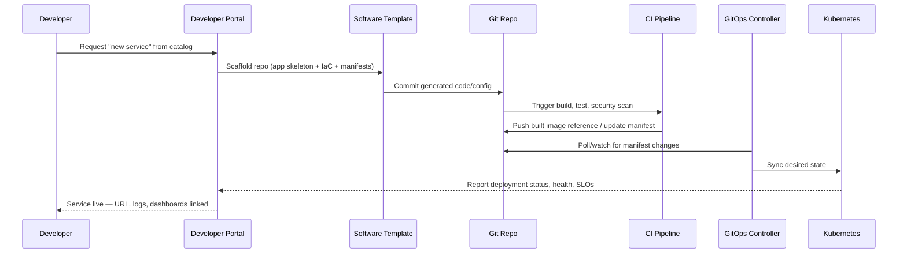
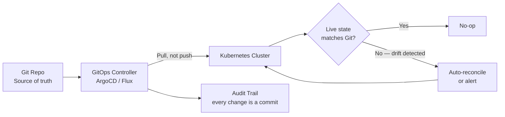

<a id="top"></a>

# Platform Engineering — Interview & Study Guide

## Table of Contents

1. [Overview](#overview)
2. [Internal Developer Platform (IDP) Reference Architecture](#internal-developer-platform-idp-reference-architecture)
3. [Golden Path Self-Service Flow](#golden-path-self-service-flow)
4. [GitOps Reconciliation Flow](#gitops-reconciliation-flow)
5. [Platform Engineering vs DevOps vs SRE vs Cloud Engineering](#platform-engineering-vs-devops-vs-sre-vs-cloud-engineering)
6. [Platform Engineering Fundamentals](#1-platform-engineering-fundamentals)
7. [Internal Developer Platform Components](#2-internal-developer-platform-components)
8. [Infrastructure as Code & Provisioning](#3-infrastructure-as-code--provisioning)
9. [Kubernetes Platform Patterns](#4-kubernetes-platform-patterns)
10. [GitOps & Continuous Delivery](#5-gitops--continuous-delivery)
11. [CI/CD & Developer Workflow](#6-cicd--developer-workflow)
12. [Observability & Reliability](#7-observability--reliability)
13. [Security, Compliance & Supply Chain](#8-security-compliance--supply-chain)
14. [Cost & FinOps for Platforms](#9-cost--finops-for-platforms)
15. [Multi-Cloud Platform Considerations](#10-multi-cloud-platform-considerations)
16. [Platform Engineer Interview Questions](#platform-engineer-interview-questions)
17. [Most Important Concepts to Know First](#most-important-concepts-to-know-first)
18. [Simple Interview Answer](#simple-interview-answer)
19. [Daily Learning Notes](#daily-learning-notes)

---

## Overview

Platform Engineering is the discipline of building and operating an **Internal Developer Platform (IDP)** — a self-service layer over cloud infrastructure, CI/CD, Kubernetes, and observability that lets application teams ship without needing deep expertise in any of those underlying systems. It grew out of a specific failure mode of early DevOps adoption: "you build it, you run it" pushed full infrastructure ownership onto every application team, and the resulting **cognitive load** (a core idea from *Team Topologies*) slowed everyone down. Platform engineering answers that by treating the platform itself as a product, with application developers as its customers.

The core mechanism is the **golden path**: a supported, paved-road way to provision a service, a database, a pipeline, or an environment — self-service, but opinionated, so teams get consistent security/observability/cost guardrails for free instead of reinventing them per team.

[⬆ Back to top](#top)

---

## Internal Developer Platform (IDP) Reference Architecture

```mermaid
flowchart TB
    DEV[Application Developers] --> PORTAL[Developer Portal
Backstage / Port / Cortex]
    PORTAL --> CATALOG[Service Catalog
ownership, docs, dependencies]
    PORTAL --> TEMPLATES[Software Templates
scaffolding, golden paths]
    TEMPLATES --> GIT[Git
app code + IaC + manifests]
    GIT --> CI[CI Pipeline
build, test, scan, SBOM]
    CI --> REG[Artifact/Container Registry]
    GIT --> IAC[IaC Engine
Terraform / Crossplane]
    IAC --> CLOUD[Cloud Provider(s)
AWS / Azure / GCP]
    GIT --> GITOPS[GitOps Controller
ArgoCD / Flux]
    GITOPS --> K8S[Kubernetes Cluster]
    REG --> K8S
    CLOUD --> K8S
    K8S --> OBS[Observability
Metrics, Logs, Traces, SLOs]
    OBS --> PORTAL
```

[⬆ Back to top](#top)

---

## Golden Path Self-Service Flow



[⬆ Back to top](#top)

---

## GitOps Reconciliation Flow



[⬆ Back to top](#top)

---

## Platform Engineering vs DevOps vs SRE vs Cloud Engineering

| Discipline | Primary Focus | Primary Artifact | Success Metric | Typical Tools |
|---|---|---|---|---|
| **DevOps** | Culture/practice bridging dev and ops; each team owns its own pipeline and infra | CI/CD pipeline per team | Deployment frequency, lead time | Jenkins, GitHub Actions, Terraform (per-team usage) |
| **Platform Engineering** | Building a self-service *product* that many teams consume | The Internal Developer Platform itself (portal, golden paths, APIs) | Developer self-service adoption, reduced cognitive load, time-to-first-deploy | Backstage, Crossplane, ArgoCD, Terraform modules |
| **SRE** | Reliability of production systems against an error-budget target | SLOs, runbooks, incident postmortems | Uptime/error budget, MTTR | Prometheus, PagerDuty, chaos engineering tools |
| **Cloud Engineering** | Designing and provisioning the underlying cloud infrastructure itself | Cloud architecture, IaC modules | Availability, cost efficiency, security posture | Terraform, CloudFormation/Bicep, cloud-native services |

These overlap heavily in practice (one engineer often wears all four hats, as in a "Multi-Cloud DevOps and Platform Engineer" title) — the distinction that actually matters in an interview is *who the customer is*: SRE's customer is the production system's reliability target, Cloud Engineering's customer is the workload's infrastructure needs, and Platform Engineering's customer is specifically **other engineers**, treated with product thinking (roadmap, adoption metrics, support).

[⬆ Back to top](#top)

---

## 1. Platform Engineering Fundamentals

| Concept | Key Features & Characteristics | Use Cases | Preferred Over the Alternative When |
|---|---|---|---|
| **Internal Developer Platform (IDP)** | A curated, self-service layer combining a portal, golden paths, and APIs over infrastructure/CI/CD/observability. | Giving application teams self-service access to infra without needing infra expertise. | An org has more than a handful of teams repeatedly solving the same infra/pipeline problems independently — below that scale, a shared platform is often premature. |
| **Platform as a Product** | Treating the platform team's output like a product: a roadmap, a customer (developers), adoption/satisfaction metrics, and support SLAs — not just a shared tooling repo. | Justifying platform team investment and prioritizing what to build next. | Adoption is optional/voluntary — a platform nobody chooses to use has failed regardless of how well-engineered it is; product thinking is what drives that adoption. |
| **Golden Path** | An opinionated, supported, self-service way to accomplish a common task (new service, new database, new pipeline) — paved, not paved *over* (escape hatches still exist). | Standardizing security/observability/cost defaults across every new service without mandating them via review gates alone. | You want consistency *by default* rather than by enforcement — teams follow the golden path because it's the easiest option, not because a policy blocks alternatives. |
| **Cognitive Load** (Team Topologies) | The total mental burden on a team from owning too many unrelated concerns (app logic + Kubernetes + cloud networking + security compliance, etc.). | Diagnosing why a "you build it, you run it" team is slow despite good engineers. | Explaining *why* platform engineering exists at all — reducing extraneous cognitive load (undifferentiated infra complexity) is the whole point, not eliminating team autonomy. |
| **Self-Service Infrastructure** | Developers provision what they need (a namespace, a database, a queue) through the platform's interface without filing a ticket to another team. | Removing infra-team-as-bottleneck from the software delivery path. | Provisioning requests are high-volume and low-risk enough to automate — high-risk/rare requests (e.g., a new production AWS account) may still warrant a review step. |
| **Developer Experience (DevEx)** | The measurable ease (or friction) of a developer's day-to-day workflow — time-to-first-commit, build times, local dev parity, docs quality. | Prioritizing platform investment based on where developers actually lose time. | Framing any platform decision — the test for "is this golden path good" is whether it measurably reduces developer friction, not whether it's architecturally elegant. |

[⬆ Back to top](#top)

---

## 2. Internal Developer Platform Components

| Component | Key Features & Characteristics | Use Cases | Preferred Over the Alternative When |
|---|---|---|---|
| **Developer Portal** (Backstage, Port, Cortex) | Single UI/API surface exposing the service catalog, templates, docs, and ownership metadata; Backstage is the CNCF-graduated open-source leader, built by Spotify. | The front door developers use to discover services and self-serve new ones. | You have enough services/teams that "who owns this and how do I find its docs" is a recurring problem — below that scale, a wiki may suffice. |
| **Service Catalog** | A structured, queryable inventory of every service, its owner, dependencies, and lifecycle stage. | Answering "what services exist, who owns them, what do they depend on" at a glance. | Incident response or dependency-impact analysis needs an authoritative source faster than tribal knowledge or scattered READMEs can provide. |
| **Software Templates / Scaffolding** | Parameterized generators that create a new repo (app skeleton, Dockerfile, CI pipeline, IaC, manifests) pre-wired to platform standards. | Spinning up a new microservice with security scanning, observability, and CI already configured on day one. | You want golden-path defaults applied automatically rather than relying on every new repo to be built by hand consistently. |
| **Ephemeral / Preview Environments** | Full, disposable environments spun up per pull request (or on-demand) and torn down automatically after use. | Letting a reviewer or QA click a live link to test a PR's actual behavior before merge. | Testing against a shared "staging" environment causes contention/queueing between teams, or a bug needs to be reproduced in isolation. |
| **Secrets Management** (Vault, External Secrets Operator, cloud KMS) | Centralized, access-controlled secret storage, injected into workloads at runtime rather than stored in Git or CI variables. | Any credential, API key, or certificate a service needs at runtime. | Secrets need audit logging, rotation, and least-privilege scoped access — plain CI secret variables don't provide any of those beyond basic masking. |
| **Platform APIs** | Machine-callable interfaces (not just the UI) for everything the portal can do — provisioning, catalog queries, template generation. | Letting CI pipelines or other automation self-serve platform actions without a human clicking through a UI. | Any golden path needs to be triggerable programmatically (e.g., "provision a preview environment automatically per PR") rather than only manually. |

[⬆ Back to top](#top)

---

## 3. Infrastructure as Code & Provisioning

| Tool | Key Features & Characteristics | Use Cases | Preferred Over the Alternative When |
|---|---|---|---|
| **Terraform** | Declarative, provider-agnostic IaC; the de facto standard for platform-team-authored, reusable infrastructure modules across clouds. | Standardized, reviewable provisioning of cloud resources (VPCs, clusters, databases) as versioned modules. | Multi-cloud or hybrid provisioning is needed, or the org already has deep Terraform tooling/expertise to build on. |
| **Terraform + PR-based workflow** (Atlantis, Terraform Cloud) | Runs `plan` on every PR (posted as a PR comment) and `apply` only after merge/approval, giving Git-native review of infra changes. | Making infrastructure changes go through the same review discipline as application code. | Infra changes currently happen via local `terraform apply` from someone's laptop — that's the exact failure mode this workflow eliminates (drift, no audit trail, no review). |
| **Crossplane** | Kubernetes-native infrastructure provisioning — cloud resources become Kubernetes Custom Resources (CRDs), reconciled by controllers the same way Deployments are. | Letting developers provision a database or storage bucket via `kubectl apply`, using the same GitOps flow as their app manifests. | The platform is already Kubernetes-centric and you want *one* reconciliation/GitOps model for both app workloads and the infra they depend on, instead of a separate Terraform pipeline. |
| **Pulumi** | IaC written in general-purpose languages (TypeScript, Python, Go) instead of a DSL, with the same declarative state model as Terraform. | Teams that want infra logic expressed with real programming constructs (loops, functions, type-checking) rather than HCL. | Developers are more comfortable writing infra in a language they already use daily than learning a dedicated IaC DSL. |
| **Cluster API (CAPI)** | Kubernetes-native API for declaratively creating, upgrading, and deleting Kubernetes clusters themselves (not just workloads inside one). | Managing the lifecycle of many Kubernetes clusters (per team, per environment) consistently. | The platform needs to provision *clusters* self-service, not just namespaces inside one shared cluster — common in a "cluster-per-team" multi-tenancy model. |
| **Environment-as-Code** | Full environment definitions (infra + config + secrets references) as a single versioned unit, instantiated per team/PR/stage. | Spinning up a consistent dev/staging/prod-parity environment on demand. | Environment drift (staging quietly diverging from prod) is causing "works on staging, breaks in prod" incidents. |

[⬆ Back to top](#top)

---

## 4. Kubernetes Platform Patterns

| Pattern | Key Features & Characteristics | Use Cases | Preferred Over the Alternative When |
|---|---|---|---|
| **Multi-Tenancy: Namespace-based** | Each team/app gets a namespace with RBAC, ResourceQuotas, and NetworkPolicies scoping their blast radius, sharing one cluster's control plane. | The common default — many teams on one cluster, isolated logically. | You want to minimize the number of clusters to operate/patch, and workloads don't have hard compliance/noisy-neighbor reasons to need full cluster isolation. |
| **Multi-Tenancy: Cluster-per-team** | Each team (or tier of sensitivity) gets a dedicated cluster. | Regulatory isolation requirements, or workloads with very different scaling/node-pool needs. | Namespace-level isolation isn't sufficient — e.g., a compliance boundary requires physically separate control planes, or noisy-neighbor CPU/network contention is a real problem. |
| **vCluster** (virtual clusters) | Lightweight virtual Kubernetes clusters running *inside* namespaces of a host cluster — each tenant gets a near-full cluster API without the cost of a real one. | Giving teams cluster-admin-like self-service (their own CRDs, their own control-plane-level config) without provisioning real clusters per team. | Teams need more isolation/control than a namespace gives but full separate clusters are too costly/slow to provision on demand. |
| **Admission Control / Policy as Code** (OPA Gatekeeper, Kyverno) | Validates or mutates resources at admission time — e.g., reject any Pod without resource limits, or without an approved base image. | Enforcing golden-path guardrails automatically instead of via manual PR review. | You want policy violations blocked *before* they run, not caught after the fact in a security scan or audit. |
| **Operators & CRDs** | Custom controllers extending the Kubernetes API to manage domain-specific resources (a database, a certificate, a cloud resource) declaratively. | Packaging complex operational knowledge (backup, failover, upgrades) into a `kubectl apply`-able resource. | Day-2 operations for a stateful/complex system are repetitive and scriptable enough to automate into a reconciliation loop instead of manual runbooks. |
| **Service Mesh** (Istio, Linkerd) | Sidecar-based (or increasingly sidecar-less/ambient) layer adding mTLS, traffic management, and observability between services, without app code changes. | Zero-trust service-to-service security, canary traffic splitting, uniform retry/timeout policy across all services. | You need consistent cross-cutting network behavior (mTLS, retries, tracing) across many services without every team implementing it independently in-app. |
| **Autoscaling** (HPA/VPA, Cluster Autoscaler, Karpenter) | HPA/VPA scale pods on metrics; Cluster Autoscaler/Karpenter scale *nodes* to fit pending pods, with Karpenter provisioning right-sized nodes just-in-time rather than from fixed node groups. | Matching compute capacity to actual demand automatically. | Karpenter over Cluster Autoscaler when you want faster, more cost-efficient node provisioning that isn't constrained to pre-defined node group shapes. |

[⬆ Back to top](#top)

---

## 5. GitOps & Continuous Delivery

| Concept | Key Features & Characteristics | Use Cases | Preferred Over the Alternative When |
|---|---|---|---|
| **GitOps Principle** | Git is the single source of truth for desired state; a controller *pulls* and reconciles the cluster to match it, rather than a pipeline *pushing* changes out. | Any Kubernetes deployment workflow wanting full audit trail (every change is a commit) and easy rollback (revert the commit). | You want drift detection and auto-healing (the controller keeps reconciling toward Git even if someone `kubectl edit`s manually) — a push-based pipeline can't self-correct after the fact. |
| **ArgoCD** | Kubernetes-native GitOps controller with a UI showing sync status/diff per application; App-of-Apps pattern for managing many services. | The most widely adopted GitOps CD tool for Kubernetes-centric platforms. | Teams want a visual UI for sync status/history alongside the GitOps model, and/or need ArgoCD's multi-cluster application management. |
| **Flux** | Kubernetes-native GitOps controller, more modular/composable (separate controllers for source, Helm, Kustomize, notifications), CNCF graduated alongside ArgoCD. | GitOps delivery for teams wanting a lighter-weight, more Unix-philosophy toolset without a bundled UI. | The team prefers composable, single-purpose controllers over an all-in-one tool, or is already invested in Flux's ecosystem (e.g., Flagger for progressive delivery). |
| **Progressive Delivery** (Argo Rollouts, Flagger) | Automates canary/blue-green rollouts with metric-based analysis, automatically pausing or rolling back on regression, beyond what a plain Kubernetes Deployment does. | Rolling out a risky change to a small percentage of traffic and auto-promoting or auto-rolling-back based on real error-rate/latency metrics. | A plain rolling update isn't safe enough for the blast radius of the change — you want automated, metric-gated promotion rather than an all-or-nothing rollout. |
| **Helm** | Package manager for Kubernetes — templated manifests bundled as versioned "charts" with configurable values. | Packaging and versioning an application's full set of Kubernetes manifests for reuse across environments. | You need templating (the same chart deployed with different values per environment) and a package/release versioning model. |
| **Kustomize** | Overlay-based Kubernetes config management — a base manifest set plus environment-specific patches, with no templating language. | Environment-specific overrides (replica count, resource limits) on top of a shared base, kept in plain YAML. | You want to avoid a templating language entirely and prefer plain, diffable YAML with structured overlays — often paired with Helm (`helm template | kustomize`) rather than as a strict either/or. |

[⬆ Back to top](#top)

---

## 6. CI/CD & Developer Workflow

| Concept | Key Features & Characteristics | Use Cases | Preferred Over the Alternative When |
|---|---|---|---|
| **Pipeline-as-Code** | CI/CD pipeline definitions versioned alongside the code they build (GitHub Actions YAML, Jenkinsfile, Azure Pipelines YAML). | Making pipeline changes reviewable and reproducible like any other code change. | The default now — the question in an interview is less "should this be code" and more which reusable-template mechanism to use. |
| **Reusable Pipeline Templates** | Shared, parameterized pipeline definitions (GitHub Actions reusable workflows, Azure Pipelines templates, Jenkins shared libraries) referenced by many repos. | Enforcing a consistent build/test/scan/deploy pattern centrally instead of copy-pasted YAML per repo. | More than a couple of repos need near-identical pipeline logic — the platform team owns and updates the template once, and every consuming repo gets the fix automatically. |
| **Trunk-Based Development** | Short-lived branches merged frequently into a single trunk, versus long-lived feature branches. | Enabling high deployment frequency (a core DORA metric) without complex merge conflicts. | The team is optimizing for fast, frequent, low-risk releases — paired with feature flags to decouple "merged" from "released to users." |
| **Feature Flags** | Runtime toggles that decouple code deployment from feature release, letting a change ship dark and be enabled gradually or per-cohort. | Releasing risky features to a small user segment first, or trunk-based development without half-finished code affecting all users. | You want to separate the *deploy* event from the *release* event — deploying continuously while controlling exposure independently. |
| **Software Bill of Materials (SBOM)** | A generated manifest of every dependency (direct and transitive) in a built artifact, used for vulnerability tracking and license compliance. | Answering "are we affected by this newly disclosed CVE" quickly across every service, and supply-chain security requirements (SLSA). | Regulatory or supply-chain security requirements demand traceability of exactly what's in a running artifact — increasingly a baseline expectation, not an edge case. |
| **Ephemeral Build Agents** | CI runners/agents provisioned fresh per job and destroyed after, versus long-lived static agents. | Avoiding state leakage between builds and reducing the attack surface of a compromised runner. | Build reproducibility and security isolation matter more than the (usually small) cold-start cost of provisioning a fresh agent per job. |

[⬆ Back to top](#top)

---

## 7. Observability & Reliability

| Concept | Key Features & Characteristics | Use Cases | Preferred Over the Alternative When |
|---|---|---|---|
| **SLIs / SLOs / Error Budgets** | SLI = a measured indicator (e.g., request latency); SLO = the target for that indicator (e.g., 99.9% of requests < 300ms); Error Budget = the allowed failure margin, which funds the pace of risky changes. | Deciding objectively when to prioritize reliability work over feature work — the error budget being exhausted is the trigger. | You want a data-driven, pre-agreed threshold for "should we slow down and fix reliability" instead of ad-hoc, political decisions after an incident. |
| **Golden Signals** (latency, traffic, errors, saturation) | The four metrics Google's SRE book identifies as the minimum needed to understand a service's health. | Building the first dashboard for any new service before adding anything more elaborate. | You're deciding what to instrument first for a new service — these four cover the majority of "is it broken" questions on their own. |
| **DORA Metrics** | Deployment frequency, lead time for changes, change failure rate, and time to restore service — the four metrics research-correlated with high-performing engineering orgs. | Measuring whether platform engineering investment is actually improving delivery performance, not just feeling more organized. | You need an evidence-based way to justify continued platform investment to leadership, beyond anecdotal developer satisfaction. |
| **Distributed Tracing** (OpenTelemetry) | Follows a single request across many services, showing where time was actually spent — the vendor-neutral instrumentation standard is OpenTelemetry. | Diagnosing "which specific hop in a microservices call chain is slow," which logs/metrics alone can't answer. | A request spans multiple services and you need to pinpoint the exact bottleneck hop, not just know "the overall request was slow." |
| **Centralized Logging & Metrics** (Prometheus, Grafana, ELK/OpenSearch) | Aggregates logs/metrics from every service into one queryable, dashboardable place rather than per-node/per-pod inspection. | The baseline observability stack most Kubernetes platforms standardize on. | Almost always — the alternative (SSH-ing into individual pods/nodes to read logs) doesn't scale past a handful of services. |
| **Self-Healing Automation** | Automated remediation (pod restarts, autoscaling, circuit breakers, runbook automation) triggered by observed failure conditions, without human intervention. | Reducing MTTR for well-understood, repetitive failure modes. | The failure mode is well-understood and its remediation is safe to automate — genuinely novel incidents still need a human in the loop. |

[⬆ Back to top](#top)

---

## 8. Security, Compliance & Supply Chain

| Concept | Key Features & Characteristics | Use Cases | Preferred Over the Alternative When |
|---|---|---|---|
| **Policy as Code** (OPA/Rego, Kyverno) | Security/compliance rules expressed as code, evaluated automatically at admission time or in CI, instead of manual checklist review. | Blocking non-compliant Kubernetes manifests or Terraform plans before they're applied. | You want guardrails enforced consistently and automatically across every team, rather than relying on every reviewer to remember every rule. |
| **Shift-Left Security Scanning** | SAST, dependency/SCA, secret, container image, and IaC scanning run in CI on every PR rather than only at/after deployment. | Catching a vulnerable dependency or an exposed secret before it ever merges, not after it's in production. | Fixing a vulnerability is dramatically cheaper the earlier it's caught — the entire premise of "shift left." |
| **Supply Chain Security** (SLSA, Sigstore/Cosign, SBOM) | SLSA defines maturity levels for build provenance integrity; Cosign signs and verifies container images/artifacts cryptographically. | Proving an artifact running in production was actually built by your legitimate CI pipeline from reviewed source, not tampered with. | The org needs to defend against supply-chain compromise (a malicious dependency or a compromised build step) — increasingly a baseline enterprise/regulated-industry expectation. |
| **Secrets Management at Platform Level** | Secrets injected into workloads at runtime from a central store (Vault, cloud KMS, External Secrets Operator) rather than baked into images or CI variables. | Any credential a service needs, with audit logging and rotation. | You need per-secret access auditing and rotation without redeploying every consumer — plain CI secret variables can't provide either. |
| **Least-Privilege Platform RBAC** | Every platform actor (developer, CI pipeline, GitOps controller) gets scoped permissions matching exactly what it needs — namespace-scoped, not cluster-admin; resource-group-scoped, not subscription Owner. | Limiting blast radius if any single credential (a CI token, a developer's kubeconfig) is compromised. | Always the target state — the interview-relevant nuance is *how* you get there (workload identity federation/OIDC over long-lived static credentials wherever supported). |
| **Compliance-as-Code / Guardrails** | Automated, continuously-enforced compliance controls (e.g., "no public S3 buckets," "all data encrypted at rest") baked into golden paths, versus periodic manual audits. | Regulated environments (SOC 2, HIPAA, PCI) needing continuous evidence of control enforcement. | Audits currently rely on point-in-time manual evidence gathering — continuous, automated enforcement is both stronger and less operationally painful. |

[⬆ Back to top](#top)

---

## 9. Cost & FinOps for Platforms

| Concept | Key Features & Characteristics | Use Cases | Preferred Over the Alternative When |
|---|---|---|---|
| **Showback / Chargeback** | Attributing cloud spend back to the team/service that generated it — showback reports it, chargeback actually bills it internally. | Making teams accountable for the cost impact of their own architecture/scaling decisions. | Cost is currently a shared, opaque pool with no team incentive to optimize — visibility (showback) is usually the first step before chargeback. |
| **Golden-Path Cost Defaults** | Right-sizing, autoscaling, and lifecycle policies baked into the platform's default templates, not left to each team to configure correctly. | Preventing "every new service starts over-provisioned" as a systemic pattern instead of a per-team habit. | You've identified a repeated cost inefficiency across many teams' services — fixing it once in the golden path beats asking every team individually to fix it. |
| **Spot/Preemptible Compute Integration** | Platform-managed use of AWS Spot, Azure Spot VMs, or GCP Preemptible/Spot VMs for fault-tolerant, interruption-safe workloads (often via Karpenter or cluster autoscaler spot pools). | Batch jobs, CI runners, and stateless services that can tolerate interruption. | The workload can handle being killed and rescheduled — the discount (often 60–90%) is worth building that tolerance in at the platform level once, for every team to benefit from. |
| **Scale-to-Zero** | Serverless-style platforms (Knative, KEDA-scaled workloads) that scale idle services down to zero pods/cost. | Low-traffic or spiky services that shouldn't pay for idle capacity. | A service has long idle periods and can tolerate cold-start latency — steady high-traffic services are usually cheaper kept warm. |
| **Multi-Cloud Cost Normalization** | Aggregating and comparing spend across AWS Cost Explorer, Azure Cost Management, and GCP Billing in one place (often via a FinOps tool like CloudHealth/Vantage, or custom exports). | Giving platform/FinOps teams one view of total spend instead of three disconnected consoles. | The org genuinely operates across multiple clouds — building this normalization is wasted effort for a single-cloud org. |

[⬆ Back to top](#top)

---

## 10. Multi-Cloud Platform Considerations

| Concept | Key Features & Characteristics | Use Cases | Preferred Over the Alternative When |
|---|---|---|---|
| **Kubernetes as the Common Substrate** | EKS, AKS, and GKE all expose the same Kubernetes API — the platform's GitOps/observability/policy layers can target any of them near-identically. | Building one golden path that deploys to whichever cloud a given workload/team happens to run on. | Workloads are already spread across multiple clouds (client requirement, M&A, avoiding vendor lock-in) — Kubernetes is what makes one platform layer viable across them. |
| **Abstraction Trade-off** | A platform can expose a lowest-common-denominator API across clouds (simpler, but loses cloud-specific features) or cloud-specific modules behind a common template pattern (more powerful, more to maintain). | Deciding how "multi-cloud" the platform's self-service templates should actually be. | Favor cloud-specific modules behind a shared template interface when teams need real cloud-native features (e.g., a specific managed service only one cloud offers) — pure abstraction usually costs more in lost capability than it saves in simplicity. |
| **Identity Federation Across Clouds** | Workload identity federation (OIDC) lets a CI pipeline or Kubernetes service account authenticate to AWS/Azure/GCP without long-lived static credentials per cloud. | A single GitOps controller or CI pipeline deploying to resources across multiple clouds securely. | Any cross-cloud automation exists — the alternative (long-lived cloud credentials stored per pipeline) is a direct, avoidable secret-sprawl and blast-radius risk. |
| **When Multi-Cloud Is (and Isn't) Justified** | Real reasons: regulatory data-residency requirements, M&A bringing in an existing cloud footprint, negotiating leverage, avoiding a single point of vendor failure. Weak reasons: "just in case," resume-driven architecture. | Deciding whether to actually build/maintain multi-cloud capability versus standardizing on one cloud. | A concrete, current business requirement demands it — multi-cloud adds real operational complexity (this whole section) that isn't worth paying for speculatively. |
| **Terraform Modules per Cloud, Shared Interface** | Provider-specific Terraform modules (`aws-vpc`, `azure-vnet`, `gcp-vpc`) exposing a consistent variable/output interface, so a golden path template can swap providers without changing how a developer calls it. | Keeping the developer-facing self-service experience identical regardless of which cloud a given template ultimately provisions into. | The platform commits to genuine multi-cloud self-service rather than each cloud being manually handled as a one-off case. |

[⬆ Back to top](#top)

---

## Platform Engineer Interview Questions

### Fundamentals & Strategy

**1. How is platform engineering different from DevOps, and why did it emerge as its own discipline?**
DevOps as a culture asked every team to own its full delivery pipeline and infrastructure; at scale, that meant every team repeatedly solving the same problems (CI setup, Kubernetes config, observability wiring) and carrying cognitive load unrelated to their actual product. Platform engineering centralizes that undifferentiated complexity into a self-service Internal Developer Platform maintained by a dedicated team, treating other engineers as its customers — DevOps didn't fail, but "every team builds its own platform" doesn't scale past a certain org size.

**2. How would you decide what to build into a golden path first?**
Answer shape: start from where developers are actually losing the most time or making the most repeated mistakes — survey teams or mine CI/incident data for the most common friction points (e.g., every new service takes two weeks to get observability wired up correctly). Prioritize by (adoption potential × friction removed), ship the smallest usable version, and measure actual usage — a beautifully engineered golden path nobody adopts hasn't succeeded.

**3. How do you measure whether a platform team is actually succeeding?**
Adoption metrics (% of new services created via golden path vs. bespoke), developer satisfaction surveys, time-to-first-deploy for a new service, and downstream DORA metrics (deployment frequency, change failure rate) trending better for platform users than non-users. Ticket/support volume trending down over time is also a strong signal the self-service layer is actually replacing manual requests.

### Infrastructure as Code & Provisioning

**4. How would you structure Terraform modules for a platform many teams self-serve from?**
Answer shape: a small number of well-tested, versioned, opinionated modules (e.g., `platform/microservice`, `platform/database`) exposing a narrow set of parameters covering 80% of real use cases, published to a private registry with semantic versioning — teams consume a pinned version rather than copy-pasting HCL, and the platform team can roll out a security fix across every consumer by bumping the module version.

**5. What's the difference between Terraform and Crossplane for a Kubernetes-centric platform, and when would you use Crossplane specifically?**
Terraform runs as a separate tool/pipeline outside the cluster with its own state file; Crossplane represents infrastructure as Kubernetes CRDs, reconciled continuously by in-cluster controllers the same way a Deployment is. Crossplane is the better fit when you want developers to provision infra via `kubectl apply`/GitOps using the exact same review and reconciliation flow as their application manifests, rather than a separate Terraform-specific workflow with different tooling and permissions.

**6. A team wants to provision a database themselves instead of filing a ticket to the infra team — how do you make that safe to self-serve?**
Wrap the provisioning in a golden-path Terraform module (or Crossplane composite resource) with guardrails baked in — encryption at rest enforced, network access restricted to private subnets by default, backup/retention policy fixed, sizing constrained to approved instance classes — so "self-service" doesn't mean "unconstrained." A PR-based workflow (Atlantis/Terraform Cloud) gives an automatic plan review and audit trail even without a human infra-team gatekeeper in the loop.

### Kubernetes & GitOps

**7. Explain GitOps and why "pull, not push" matters.**
In GitOps, Git holds the desired state and a controller inside the cluster (ArgoCD/Flux) continuously reconciles live state to match it, versus a CI pipeline pushing changes out with cluster credentials. Pull-based means the cluster never needs to expose deploy credentials to external CI systems, and the controller keeps self-correcting drift (someone `kubectl edit`-ing directly) automatically — a push pipeline has no way to detect or fix that after the fact.

**8. How would you design multi-tenancy for 30 application teams sharing Kubernetes infrastructure?**
Answer shape: default to namespace-per-team with RBAC, ResourceQuotas, and NetworkPolicies for isolation on a shared cluster — cheaper to operate and sufficient for most teams. Escalate specific teams to dedicated clusters (or vClusters as a middle ground) only where there's a concrete compliance boundary or genuine noisy-neighbor problem, rather than defaulting every team to its own cluster and multiplying operational overhead.

**9. How do you roll out a risky change to a Kubernetes service safely?**
Progressive delivery via Argo Rollouts or Flagger — shift a small percentage of traffic to the new version, automatically analyze golden-signal metrics (error rate, latency) against a threshold, and auto-promote or auto-rollback based on that analysis rather than a fixed rolling update with no automated safety net.

### CI/CD & Developer Workflow

**10. How do you give every new service consistent CI/CD without every team hand-rolling their own pipeline YAML?**
Reusable pipeline templates (GitHub Actions reusable workflows, Azure Pipelines templates, Jenkins shared libraries) owned by the platform team, referenced/parameterized by each service's pipeline file — a security-scanning fix or a new deploy stage gets rolled out to every consuming repo by bumping the shared template, not by editing dozens of repos individually.

**11. How would you implement ephemeral preview environments per pull request?**
Answer shape: on PR open, CI triggers a golden-path template that provisions a lightweight namespace (or vCluster) scoped to that PR, deploys the built image with a unique subdomain, and posts the URL back as a PR comment; on PR close/merge, an automated cleanup job tears the environment down. Ties together the IaC/Crossplane provisioning layer, the CI pipeline, and GitOps deployment into one self-service flow.

### Security & Supply Chain

**12. Where would you add security scanning across a platform's software delivery lifecycle?**
Secret and SAST scanning on every PR; dependency/SCA scanning at build time generating an SBOM; container image scanning after build and before registry push; IaC scanning (Checkov/tfsec, or OPA policies) on any Terraform/Kubernetes manifest change; and admission-time policy enforcement (Kyverno/Gatekeeper) as the last line of defense in-cluster — shifting left doesn't remove the need for a runtime backstop.

**13. How do you prevent an unsigned or tampered container image from ever running in production?**
Sign images at build time with Cosign/Sigstore as part of CI, then enforce signature verification at admission time via a Kubernetes admission controller (Kyverno or Gatekeeper policy) that rejects any image without a valid signature from the trusted CI identity — closing the gap between "we scan images" and "we can prove what's actually running was built by us."

### Scenario-Based

**14. "Developers keep bypassing the platform's golden path and provisioning infrastructure manually — how do you respond?"**
Answer shape: first investigate *why* — a bypassed golden path is almost always a symptom of it being slower, less flexible, or missing a capability teams actually need, not developer laziness. Talk to the teams bypassing it, fix the actual gap, and only add enforcement (policy-as-code blocking non-compliant resources) once the self-service path is genuinely good enough that using it is the easier choice — enforcement without a good alternative just breeds workarounds.

**15. "The platform team is a bottleneck — every infra request still goes through them despite calling it 'self-service.'"**
Answer shape: audit what's actually still manual versus templated — often "self-service" golden paths cover only the common 80% case and everything else still funnels through tickets. Expand template coverage for the next most common request types, add policy-as-code guardrails so more request types can be safely automated without a human review gate, and track ticket volume by request type to prioritize which manual step to automate next.

**16. "A GitOps-managed cluster has drifted from what's in Git — how did that happen and how do you prevent it?"**
Someone likely ran `kubectl edit`/`apply` directly against the cluster, bypassing Git. Prevention: restrict direct cluster write access (developers get GitOps + read-only kubectl, not broad write RBAC), enable ArgoCD/Flux's automatic drift-reconciliation (self-heal) so manual changes get reverted automatically, and alert on detected drift events so the team knows an out-of-band change happened even before it's reconciled away.

[⬆ Back to top](#top)

---

## Most Important Concepts to Know First

1. Internal Developer Platform (IDP) & Platform as a Product
2. Golden Path
3. Cognitive Load (Team Topologies)
4. GitOps (ArgoCD / Flux) — pull vs push
5. Terraform modules / PR-based IaC workflow
6. Crossplane (Kubernetes-native provisioning)
7. Kubernetes multi-tenancy (namespace vs cluster-per-team vs vCluster)
8. Policy as Code (OPA Gatekeeper / Kyverno)
9. Progressive Delivery (Argo Rollouts / Flagger)
10. SLIs / SLOs / Error Budgets
11. DORA Metrics
12. Developer Portal (Backstage) & Service Catalog
13. Software Templates / Scaffolding
14. Supply Chain Security (SBOM, Cosign/Sigstore, SLSA)
15. Karpenter / Cluster Autoscaler
16. Secrets Management (Vault / External Secrets Operator)
17. Showback/Chargeback (platform FinOps)
18. Workload Identity Federation (OIDC) over static credentials

[⬆ Back to top](#top)

---

## Simple Interview Answer

Platform engineering is the practice of building an Internal Developer Platform — a self-service layer over cloud infrastructure, CI/CD, Kubernetes, and observability — so application teams can ship without carrying the full cognitive load of owning every layer underneath them.

In practice that means: a **developer portal** (like Backstage) exposing a **service catalog** and **golden-path templates**; **Terraform/Crossplane** provisioning infrastructure behind those templates; **GitOps** (ArgoCD/Flux) deploying and continuously reconciling Kubernetes state from Git; and **policy-as-code** plus **observability** (SLOs, golden signals) baked in by default rather than left to each team to configure correctly.

The team treats the platform itself as a **product** — success is measured by adoption (are teams actually choosing the golden path) and by downstream **DORA metrics** improving, not by how architecturally elegant the platform is. And picking between similar-looking tools almost always comes down to the same trade-off as elsewhere in cloud engineering: how much operational complexity you're willing to own versus how much control/flexibility you need back in return.

[⬆ Back to top](#top)

---

## Daily Learning Notes

### What to Practice

- Stand up Backstage locally and register a service in the catalog.
- Write a software template that scaffolds a repo with app skeleton + Dockerfile + CI pipeline + Kubernetes manifests.
- Install ArgoCD on a local cluster (kind/minikube) and deploy an app via GitOps — then manually edit a resource and watch it self-heal.
- Write a Crossplane composition that provisions a cloud storage bucket via `kubectl apply`.
- Write an OPA Gatekeeper or Kyverno policy that rejects a Pod with no resource limits.
- Set up Argo Rollouts for a canary deployment with an automated analysis step.
- Define an SLO for a sample service and instrument its four golden signals with Prometheus/Grafana.
- Sign a container image with Cosign and enforce signature verification at admission time.
- Build a reusable GitHub Actions workflow and call it from two different repos.
- Set up an ephemeral preview environment that spins up on PR open and tears down on PR close.

### Key Platform Principle

A strong Internal Developer Platform should be:

- Self-service (no ticket needed for common requests)
- Opinionated by default, but not a dead end (escape hatches exist)
- Secure and compliant by default, not by review gate
- Observable out of the box
- Adopted voluntarily, not mandated
- Measured like a product (adoption, satisfaction, DORA impact)

[⬆ Back to top](#top)
