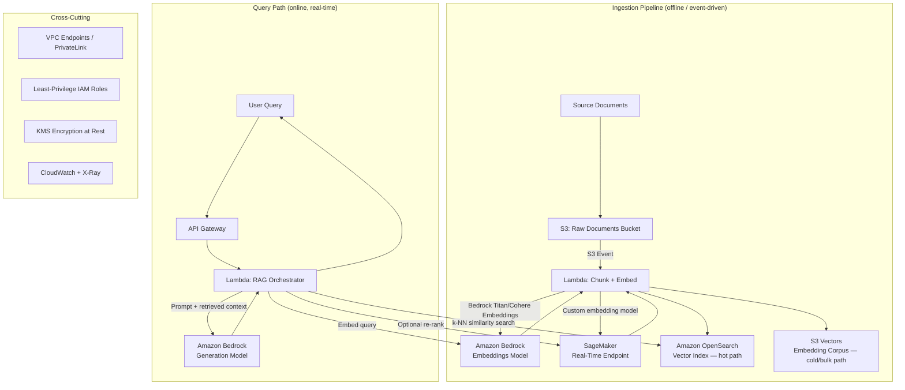
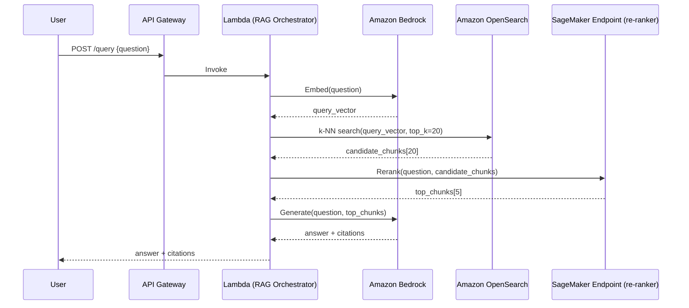
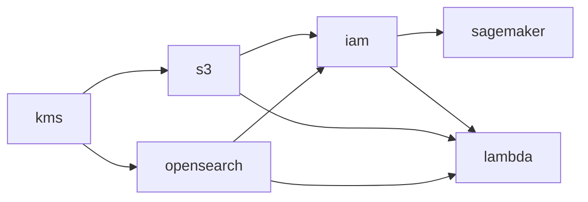

<a id="top"></a>

# RAG Architecture — Amazon Bedrock, OpenSearch, S3 Vectors & SageMaker

Architecture design and reference implementation for a retrieval-augmented
generation (RAG) platform on AWS, matching the design described in the
resume bullet:

> *"Designed retrieval-augmented generation (RAG) infrastructure integrating
> Amazon Bedrock for embeddings generation, Amazon OpenSearch for vector
> search and retrieval, and S3 Vectors for cost-efficient storage of
> large-scale embedding datasets; leveraged Amazon SageMaker for custom model
> training/hosting where a managed foundation model wasn't the right fit."*

## Table of Contents

1. [Overview](#1-overview)
2. [Architecture Diagram](#2-architecture-diagram)
3. [Component Breakdown](#3-component-breakdown)
4. [Data Flow — Ingestion Path](#4-data-flow--ingestion-path)
5. [Data Flow — Query/Retrieval Path](#5-data-flow--queryretrieval-path)
6. [Design Decisions and Trade-offs](#6-design-decisions-and-trade-offs)
7. [Security Architecture](#7-security-architecture)
8. [Cost Considerations](#8-cost-considerations)
9. [Infrastructure as Code](#9-infrastructure-as-code)
10. [Application Code](#10-application-code)
11. [Observability](#11-observability)
12. [Interview Talking Points](#12-interview-talking-points)

---

# 1. Overview

The platform ingests unstructured documents, converts them into searchable
vector embeddings, and serves low-latency, grounded answers to user queries
by combining retrieval (finding the right source passages) with generation
(an LLM writing the final answer from those passages). Two tiers of vector
storage are used deliberately, not redundantly:

- **Amazon OpenSearch** — the "hot" path: a always-queryable vector index
  serving real-time, sub-second similarity search for live user queries.
- **Amazon S3 Vectors** — the "cold/bulk" path: the durable, cost-efficient
  system of record for the *entire* embedding corpus, used for bulk
  reprocessing, re-indexing after a model change, and archival retrieval
  that doesn't need OpenSearch's latency.

**Amazon Bedrock** is the default embedding and generation engine (managed
foundation models, no infrastructure to run). **Amazon SageMaker** is the
escape hatch for the cases Bedrock doesn't cover — a domain-specific
fine-tuned embedding model, or a custom cross-encoder re-ranker — hosted on
a real-time inference endpoint alongside the Bedrock-based path.

[⬆ Back to top](#top)

---

# 2. Architecture Diagram



## Query-Time Sequence



[⬆ Back to top](#top)

---

# 3. Component Breakdown

| Component | Role in This Architecture |
|---|---|
| **Amazon S3 (raw bucket)** | Landing zone for source documents (PDF, HTML, DOCX); triggers ingestion on upload. |
| **Lambda — Ingestion** | Extracts text, chunks it (token-aware, with overlap), calls the embedding model, writes to both vector stores. |
| **Amazon Bedrock (embeddings)** | Default embedding model (e.g., Titan Text Embeddings V2 or Cohere Embed) — managed, no hosting required. |
| **Amazon Bedrock (generation)** | Default generation model (e.g., Anthropic Claude via Bedrock) — synthesizes the final answer from retrieved context. |
| **Amazon OpenSearch (vector engine)** | Hot-path k-NN vector index for real-time retrieval; backs every live user query. |
| **S3 Vectors** | Cost-efficient, durable storage for the complete embedding corpus; source of truth for bulk re-indexing and archival search. |
| **Amazon SageMaker (real-time endpoint)** | Hosts a custom-trained embedding model or cross-encoder re-ranker for cases a Bedrock foundation model doesn't fit. |
| **Lambda — RAG Orchestrator** | Query-time coordinator: embeds the query, searches OpenSearch, optionally reranks via SageMaker, calls Bedrock for generation. |
| **API Gateway** | Public-facing (or internal) HTTP front door for the query endpoint. |
| **VPC Endpoints (PrivateLink)** | Keep all Bedrock/OpenSearch/SageMaker/S3 traffic off the public internet. |
| **CloudWatch + X-Ray** | Metrics, logs, and distributed tracing across the ingestion and query paths. |

[⬆ Back to top](#top)

---

# 4. Data Flow — Ingestion Path

```text
1. A document lands in s3://rag-raw-docs/{source}/{doc_id}.pdf
2. S3 event notification triggers the ingestion Lambda
3. Lambda extracts text and splits it into overlapping chunks
   (~500 tokens each, ~50-token overlap, to preserve context across
   chunk boundaries)
4. For each chunk:
     a. Call Bedrock InvokeModel (embeddings) — or the SageMaker
        endpoint if the document belongs to a domain requiring the
        custom fine-tuned model
     b. Upsert {chunk_id, vector, text, metadata} into the OpenSearch
        vector index (hot path)
     c. Write the same record to S3 Vectors (cold/bulk system of
        record)
5. Ingestion metadata (doc_id, chunk_count, model_version, timestamp)
   is recorded for traceability and future re-indexing runs
```

**Why write to both stores instead of one**: OpenSearch is the query-serving
copy — sized and provisioned for low-latency reads. S3 Vectors is the
durable corpus — if the embedding model changes (e.g., upgrading to a
newer Titan version), the entire OpenSearch index can be rebuilt from S3
Vectors without re-calling the embedding model on every source document
again, which is the expensive and slow part of re-indexing.

[⬆ Back to top](#top)

---

# 5. Data Flow — Query/Retrieval Path

```text
1. User submits a question via API Gateway
2. RAG Orchestrator Lambda embeds the question using the same model
   family used at ingestion time (embedding spaces aren't
   interchangeable across model versions)
3. k-NN similarity search against the OpenSearch vector index returns
   the top-N candidate chunks (N ≈ 20)
4. (Optional) A SageMaker-hosted cross-encoder re-ranker scores each
   candidate against the actual question more precisely than raw
   vector similarity, narrowing to the top-K (K ≈ 5) most relevant
   chunks
5. The orchestrator assembles a prompt: system instructions + the
   top-K retrieved chunks + the user's question
6. Bedrock (generation model) produces the final answer, grounded in
   the retrieved context
7. The response is returned with citations back to the source chunks,
   so the answer is auditable, not just plausible-sounding
```

[⬆ Back to top](#top)

---

# 6. Design Decisions and Trade-offs

| Decision | Why |
|---|---|
| **OpenSearch for hot-path retrieval, not S3 Vectors alone** | OpenSearch is provisioned/always-on and optimized for sub-second k-NN queries under concurrent load — the right fit for live user-facing latency requirements. S3 Vectors is durable and cheap but not built to be the millisecond-latency query engine for every live request. |
| **S3 Vectors for the full corpus, not OpenSearch alone** | Keeping the entire embedding history in OpenSearch at scale gets expensive fast (it's a provisioned, always-running compute+storage cluster). S3 Vectors stores the same data at object-storage economics, and becomes the reference copy for rebuilding the OpenSearch index after a model upgrade or a schema change. |
| **Bedrock as the default, SageMaker as the exception** | Bedrock removes all hosting/scaling concerns for standard embedding/generation needs — the cheaper and faster default. SageMaker is reserved for the specific cases Bedrock's managed models don't serve well: a domain-tuned embedding model (e.g., trained on internal financial/medical terminology) or a custom re-ranker architecture Bedrock doesn't offer out of the box. |
| **Separate embedding model for ingestion vs re-ranking** | Embedding models optimize for fast approximate similarity across a huge corpus; re-rankers (cross-encoders) are slower but far more precise at judging relevance for a *small* candidate set. Using a cheap/fast embedding model for the first-pass k-NN search, then a more expensive re-ranker only on the narrowed candidate set, balances cost and answer quality. |
| **Chunking with overlap** | Fixed-size chunking without overlap risks splitting a relevant fact across a chunk boundary, making it retrievable by neither chunk. A small overlap (~10%) trades a modest storage/embedding-cost increase for meaningfully better recall. |

[⬆ Back to top](#top)

---

# 7. Security Architecture

- **Network isolation** — Bedrock, OpenSearch, SageMaker, and S3 are all
  reached via VPC endpoints (Interface endpoints for Bedrock/SageMaker,
  Gateway/Interface for S3), so no traffic leaves the VPC over the public
  internet.
- **Least-privilege IAM** — the ingestion Lambda's role can `bedrock:InvokeModel`
  (embeddings only) and write to OpenSearch/S3 Vectors; the query
  orchestrator's role can additionally invoke the generation model and the
  SageMaker endpoint, but neither role can modify infrastructure or access
  unrelated resources.
- **Encryption at rest** — S3 buckets (raw docs, S3 Vectors) and the
  OpenSearch domain are encrypted with customer-managed KMS keys; SageMaker
  model artifacts in S3 use the same key policy.
- **Bedrock Guardrails** — content filtering applied to both the user's
  input and the model's output, blocking prompt-injection-style attempts to
  override system instructions and filtering disallowed output categories.
- **PII handling** — source documents are scanned (e.g., via Amazon
  Comprehend or Macie) before ingestion where the corpus may contain
  sensitive data, with redaction applied prior to embedding generation.

[⬆ Back to top](#top)

---

# 8. Cost Considerations

| Lever | Approach |
|---|---|
| **Embedding cost** | Deduplicate/cache embeddings — re-embedding an unchanged document on every pipeline run wastes Bedrock invocation cost; track a content hash per chunk and skip re-embedding unchanged chunks. |
| **OpenSearch sizing** | Size the OpenSearch domain/collection to the *actively queried* working set, not the full historical corpus — let S3 Vectors carry the long tail. |
| **SageMaker endpoint cost** | Use a real-time endpoint only where request volume justifies an always-on instance; consider Serverless Inference or Asynchronous Inference for the re-ranker if query volume is spiky rather than constant. |
| **Bedrock model selection** | Match model size to task — a smaller/cheaper embedding model is usually sufficient for retrieval, reserving the largest generation model only for the final answer-synthesis step. |
| **S3 Vectors lifecycle** | Even within S3 Vectors, apply lifecycle policies to move long-unused embedding batches to colder storage tiers where the access pattern allows it. |

[⬆ Back to top](#top)

---

# 9. Infrastructure as Code

The stack has two layers: a shared `modules/` library of **six
single-service modules** (each owns exactly one AWS service's resources,
including its own IAM), and an `environments/` directory with one
self-contained root module per environment — **dev, uat, prod** — each
with its own state file, so a dev `apply` can never touch uat/prod
resources by accident.

```text
terraform/
├── modules/                    # shared library, never applied directly
│   ├── kms/           # the single customer-managed key everything else encrypts with
│   ├── s3/            # raw docs bucket + S3 Vectors bucket (encryption key injected)
│   ├── opensearch/    # OpenSearch Serverless collection, the hot-path vector index
│   ├── iam/           # every role/policy in the platform — lambda + sagemaker exec roles
│   ├── sagemaker/     # custom re-ranker/embedding model, real-time endpoint
│   └── lambda/        # chunk+embed ingestion function + S3 event trigger
└── environments/                # one applyable root module per environment
    ├── dev/
    │   ├── main.tf            # calls ../../modules/* with dev-sized inputs
    │   ├── variables.tf
    │   ├── terraform.tfvars    # reranker_image_uri, reranker_model_artifact_s3_uri
    │   ├── versions.tf         # provider requirements + dev's S3 backend key
    │   └── .terraform.lock.hcl
    ├── uat/    (same file set, uat-sized inputs, uat backend key)
    └── prod/   (same file set, prod-sized/HA inputs, prod backend key)
```

Each environment's `versions.tf` declares its own `backend "s3"` block
with a distinct state `key`
(`rag-architecture/{dev,uat,prod}/terraform.tfstate`) in the same bucket —
see the [Terraform notes](../Terraform/Terraform.md) §8 for the
S3+DynamoDB backend pattern this follows, and §20 "Environment Layout:
Directory-per-Environment" for the general pattern this structure is an
instance of.

## Module Dependency Chain (identical across all three environments)



`kms` has no dependencies — it's provisioned first. `s3` and `opensearch`
each take only the KMS key ARN. `iam` is the pivot: it takes the bucket
ARNs and the OpenSearch collection ARN to scope its policies precisely,
and exports two role ARNs. `sagemaker` and `lambda` each take *only* the
role ARN they need (not the whole `iam` module) plus whatever storage/search
endpoints they call at runtime — neither one creates or touches a role
itself. Every module's `env` variable has a `validation` block restricting
it to exactly `dev`, `uat`, or `prod`.

## What Actually Differs Per Environment

| Setting | dev | uat | prod |
|---|---|---|---|
| KMS `deletion_window_in_days` | 7 (fast teardown while iterating) | 14 | 30 |
| SageMaker `instance_type` | `ml.m5.large` (cheapest, no GPU needed for dev-scale testing) | `ml.g5.xlarge` (matches prod for representative testing) | `ml.g5.xlarge` |
| SageMaker `instance_count` | 1 | 1 (no HA requirement pre-release) | **2** (HA — a single instance has no failover) |
| Lambda `memory_size` / `timeout` | 512 MB / 60s (small dev document set) | 1024 MB / 120s | 1024 MB / 120s |

```hcl
# terraform/environments/dev/main.tf (uat/prod are structurally identical,
# only the sizing values and local.env differ — see the files themselves)

locals {
  env = "dev"
}

module "kms" {
  source                  = "../../modules/kms"
  env                     = local.env
  deletion_window_in_days = 7
}

module "s3" {
  source      = "../../modules/s3"
  env         = local.env
  kms_key_arn = module.kms.key_arn
}

module "opensearch" {
  source      = "../../modules/opensearch"
  env         = local.env
  kms_key_arn = module.kms.key_arn
}

module "iam" {
  source = "../../modules/iam"
  env    = local.env

  raw_docs_bucket_arn       = module.s3.raw_docs_bucket_arn
  vectors_bucket_arn        = module.s3.vectors_bucket_arn
  opensearch_collection_arn = module.opensearch.collection_arn
  bedrock_embed_model       = var.bedrock_embed_model
}

module "sagemaker" {
  source = "../../modules/sagemaker"
  env    = local.env

  execution_role_arn             = module.iam.sagemaker_execution_role_arn
  reranker_image_uri             = var.reranker_image_uri
  reranker_model_artifact_s3_uri = var.reranker_model_artifact_s3_uri

  instance_type  = "ml.m5.large"
  instance_count = 1
}

module "lambda" {
  source     = "../../modules/lambda"
  env        = local.env
  source_dir = "${path.module}/../../../src"

  execution_role_arn   = module.iam.lambda_execution_role_arn
  raw_docs_bucket_name = module.s3.raw_docs_bucket_name
  raw_docs_bucket_arn  = module.s3.raw_docs_bucket_arn
  vectors_bucket_name  = module.s3.vectors_bucket_name

  opensearch_collection_endpoint = module.opensearch.collection_endpoint
  bedrock_embed_model            = var.bedrock_embed_model

  memory_size = 512
  timeout     = 60
}
```

`local.env` (not a settable variable) pins each environment directory to
exactly one environment — there's no way to accidentally run the dev
directory's code against prod by passing the wrong variable value, since
the environment is fixed by *which directory you're standing in*, not by
an input that could be mistyped.

```bash
# Applying a specific environment — never ambiguous about which one
cd terraform/environments/uat
terraform init
terraform apply
```

**Verified**: for every environment (dev, uat, prod), `terraform init
-backend=false` succeeds, `terraform validate` returns **Success**, and
`terraform fmt -check` reports no formatting issues — confirming each
environment's module wiring resolves independently, not just the
originally-tested one.

## CI/CD Pipeline

`.github/workflows/rag-architecture.yml` — lives inside this folder
(`RAG-Architecture/.github/workflows/`), not the monorepo root, since
this reference architecture doesn't execute inside the larger learning
repo it's documented in; it's positioned so it works immediately if this
folder becomes (or is copied into) its own repository root.

```text
lint-and-security ─┐
python-checks      ─┴─▶ plan (dev, uat, prod in parallel)
                              │
                    (push to main only, PRs stop after plan)
                              ▼
                         apply-dev ──▶ apply-uat ──▶ apply-prod
                                                       ▲
                                          gated on a required reviewer
                                          via the "prod" GitHub Environment
```

- **`lint-and-security`** — `terraform fmt -check -recursive`, a Checkov
  IaC scan, and a Gitleaks secret scan; no AWS credentials needed.
- **`python-checks`** — Ruff lint + a compile check on the Lambda source.
- **`plan`** — matrix over all three environments, authenticates via AWS
  OIDC (no long-lived keys), runs `init`/`validate`/`plan`, posts the
  plan as a PR comment, and uploads it as an artifact.
- **`apply-dev` → `apply-uat` → `apply-prod`** — push-to-`main` only,
  strictly sequential, and each one downloads and applies the *exact*
  plan artifact the `plan` job produced rather than re-planning at apply
  time — closing the same time-of-check/time-of-use gap flagged in the
  [Terraform notes](../Terraform/Terraform.md) `plan`/`apply` section.
  `apply-prod` targets the `prod` GitHub Environment, which is configured
  with a required reviewer — the job pauses for human approval no matter
  what the earlier jobs did.

[⬆ Back to top](#top)

---

# 10. Application Code

## Ingestion — Chunk, Embed, Dual-Write

```python
# src/ingest_embeddings.py
import boto3
import hashlib
import json
import os

bedrock = boto3.client("bedrock-runtime")
s3 = boto3.client("s3")
opensearch = boto3.client("opensearchserverless")

EMBED_MODEL = os.environ["BEDROCK_EMBED_MODEL"]
VECTORS_BUCKET = os.environ["VECTORS_BUCKET"]
OPENSEARCH_ENDPOINT = os.environ["OPENSEARCH_ENDPOINT"]


def chunk_text(text: str, chunk_size: int = 500, overlap: int = 50) -> list[str]:
    """Token-approximate chunking with overlap to avoid splitting facts
    across chunk boundaries."""
    words = text.split()
    chunks = []
    step = chunk_size - overlap
    for i in range(0, len(words), step):
        chunks.append(" ".join(words[i : i + chunk_size]))
    return chunks


def embed(text: str) -> list[float]:
    response = bedrock.invoke_model(
        modelId=EMBED_MODEL,
        body=json.dumps({"inputText": text}),
    )
    return json.loads(response["body"].read())["embedding"]


def handler(event, context):
    for record in event["Records"]:
        bucket = record["s3"]["bucket"]["name"]
        key = record["s3"]["object"]["key"]

        doc_text = s3.get_object(Bucket=bucket, Key=key)["Body"].read().decode("utf-8")
        chunks = chunk_text(doc_text)

        for idx, chunk in enumerate(chunks):
            chunk_id = hashlib.sha256(f"{key}:{idx}".encode()).hexdigest()
            vector = embed(chunk)
            record_body = {
                "chunk_id": chunk_id,
                "source_key": key,
                "chunk_index": idx,
                "text": chunk,
                "embedding": vector,
                "model": EMBED_MODEL,
            }

            # Hot path — index into OpenSearch for real-time retrieval
            index_into_opensearch(record_body)

            # Cold/bulk path — durable system of record in S3 Vectors
            s3.put_object(
                Bucket=VECTORS_BUCKET,
                Key=f"{key}/chunks/{chunk_id}.json",
                Body=json.dumps(record_body),
            )

    return {"statusCode": 200, "chunksProcessed": len(chunks)}


def index_into_opensearch(record_body: dict) -> None:
    # Uses the OpenSearch document/index API against the vector-enabled
    # collection endpoint (client setup/auth omitted for brevity).
    ...
```

## Query-Time Retrieval and Generation

```python
# src/retrieve_and_generate.py
import boto3
import json
import os

bedrock = boto3.client("bedrock-runtime")
sagemaker_runtime = boto3.client("sagemaker-runtime")

EMBED_MODEL = os.environ["BEDROCK_EMBED_MODEL"]
GEN_MODEL = os.environ["BEDROCK_GEN_MODEL"]
RERANKER_ENDPOINT = os.environ["SAGEMAKER_RERANKER_ENDPOINT"]


def embed(text: str) -> list[float]:
    response = bedrock.invoke_model(
        modelId=EMBED_MODEL,
        body=json.dumps({"inputText": text}),
    )
    return json.loads(response["body"].read())["embedding"]


def search_opensearch(query_vector: list[float], top_k: int = 20) -> list[dict]:
    # k-NN similarity search against the vector index (client call
    # omitted for brevity) — returns candidate chunks with metadata.
    ...


def rerank(question: str, candidates: list[dict], top_k: int = 5) -> list[dict]:
    payload = {"question": question, "candidates": [c["text"] for c in candidates]}
    response = sagemaker_runtime.invoke_endpoint(
        EndpointName=RERANKER_ENDPOINT,
        ContentType="application/json",
        Body=json.dumps(payload),
    )
    scores = json.loads(response["Body"].read())["scores"]
    ranked = sorted(zip(candidates, scores), key=lambda x: x[1], reverse=True)
    return [c for c, _ in ranked[:top_k]]


def generate(question: str, context_chunks: list[dict]) -> str:
    context = "\n\n".join(c["text"] for c in context_chunks)
    prompt = (
        "Answer the question using only the context below. "
        "Cite the source_key for each fact you use.\n\n"
        f"Context:\n{context}\n\nQuestion: {question}"
    )
    response = bedrock.invoke_model(
        modelId=GEN_MODEL,
        body=json.dumps({"prompt": prompt, "max_tokens": 512}),
    )
    return json.loads(response["body"].read())["completion"]


def handler(event, context):
    question = json.loads(event["body"])["question"]

    query_vector = embed(question)
    candidates = search_opensearch(query_vector, top_k=20)
    top_chunks = rerank(question, candidates, top_k=5)
    answer = generate(question, top_chunks)

    return {
        "statusCode": 200,
        "body": json.dumps(
            {
                "answer": answer,
                "citations": [c["source_key"] for c in top_chunks],
            }
        ),
    }
```

[⬆ Back to top](#top)

---

# 11. Observability

This platform needs two distinct layers of observability, because they
answer two different questions. **Infrastructure observability** answers
"is the system running correctly" — is Lambda erroring, is Bedrock
throttling, is OpenSearch slow. **AI/ML observability** answers a
question infra metrics can't see at all — "is the *answer* actually
good" — was the retrieved context relevant, is the generated answer
grounded in it or hallucinated, has the query distribution drifted from
what the corpus actually covers. A pipeline can be 100% healthy on every
CloudWatch metric while quietly returning irrelevant or fabricated
answers — that gap is exactly what the AI/ML layer below exists to close.

## Infrastructure & System-Level Observability

- **CloudWatch Logs/Metrics** — Lambda duration and error rate for both the
  ingestion and query paths; Bedrock invocation throttling/errors; custom
  metrics for chunks-processed-per-document and cache-hit-rate on the
  embedding dedup check.
- **AWS X-Ray** — end-to-end trace across API Gateway → orchestrator Lambda
  → Bedrock/OpenSearch/SageMaker calls, to see exactly which hop (embed,
  search, rerank, generate) dominates query latency.
- **OpenSearch dashboards** — query latency percentiles, index size growth,
  and k-NN search error rates.
- **Alerting** — CloudWatch alarms on Bedrock throttling, SageMaker endpoint
  5xx rate, and OpenSearch cluster health, routed to the same
  ServiceNow-integrated alerting used elsewhere in the platform.

This layer covers the same "golden signals" (latency, traffic, errors,
saturation) as any other AWS service — necessary, but silent on whether
the RAG pipeline's *output* is actually correct.

## AI/ML & RAG Quality Observability — Where Arize Fits

**Arize AI** is a specialized ML/LLM observability platform that sits
*alongside* CloudWatch/X-Ray rather than replacing them — it's purpose-built
for exactly the RAG-specific failure modes infra monitoring is blind to:

| Concern | What Arize Adds | Why CloudWatch/X-Ray Can't See It |
|---|---|---|
| **Retrieval quality** | Continuously scores whether the chunks OpenSearch actually returned are relevant to the question (precision@k / NDCG-style metrics), in production, on real traffic — not just at offline eval time. | X-Ray shows the k-NN search call *succeeded* and how long it took — it has no concept of whether the returned chunks were the *right* chunks. |
| **Generation groundedness / hallucination detection** | Runs continuous evaluation (often an "LLM-as-judge" pattern) checking whether the final answer is actually supported by the retrieved context, flagging fabricated or unsupported claims. | CloudWatch confirms the Bedrock `InvokeModel` call returned 200 with some latency — it has no idea whether what came back is true. |
| **Embedding / query drift** | Tracks the production query embedding distribution against the ingested corpus's embedding distribution (PSI/KL-divergence-style drift metrics, plus UMAP visualization for the embedding space itself) — catching the case where users start asking about topics the corpus doesn't cover well, well before it shows up as a spike in vague user complaints. | Nothing in the infra stack looks at vector *content* at all — only at whether the OpenSearch API call itself succeeded. |
| **Full RAG pipeline tracing** | OpenTelemetry-based tracing (via the OpenInference spec Arize co-developed) across embed → search → rerank → generate, but with the *actual prompts, retrieved chunks, and generated text* captured as first-class trace data — not just generic AWS API call spans. | X-Ray traces the same hop sequence, but only sees "a Bedrock call happened and took 340ms" — it doesn't capture *what* was asked, retrieved, or generated, which is exactly what's needed to debug a bad answer after the fact. |
| **Cost/token tracking per call** | Per-request token usage and cost attribution for both the embedding and generation calls, at finer grain than CloudWatch's aggregate Bedrock invocation metrics. | CloudWatch can show invocation *counts*, but not token-level cost broken down per query or per user. |

**How it plugs into this architecture concretely**: both Lambdas
(ingestion and the RAG orchestrator) get instrumented with the
OpenInference/OpenTelemetry SDK alongside their existing `boto3` calls,
exporting spans to Arize (or **Arize Phoenix**, the open-source,
self-hostable companion library, as a lighter-weight starting point
before adopting the full commercial platform). This is additive, not a
replacement: CloudWatch/X-Ray stay as the system-health layer; Arize
becomes the answer-quality layer sitting on top of the same request
path, closing the gap the [Interview Talking Points](#12-interview-talking-points)
section's "how do you keep this from hallucinating" answer otherwise
only defends against with prompt instructions and Guardrails alone —
Arize is what actually *measures* whether that defense is working in
production, continuously, rather than assuming it from the design.

## Alternatives to Arize

Arize isn't the only option for this layer — worth knowing the
landscape, both as genuine alternatives and as an interview signal of
breadth beyond one named product.

| Category | Tools | Notes |
|---|---|---|
| **Direct Arize competitors** (LLM/GenAI eval + observability) | Galileo, Fiddler AI, WhyLabs + LangKit, TruEra/TruLens, HoneyHive | TruLens is open-source and known specifically for the "RAG triad" eval pattern (context relevance, groundedness, answer relevance) — directly applicable to this architecture. |
| **LLM tracing/dev-tool-first** | LangSmith, Langfuse, W&B Weave, Traceloop (OpenLLMetry), Helicone, Portkey, PromptLayer, Braintrust | Langfuse is the most common free/self-hostable alternative to LangSmith; most of these lean lighter-weight than Arize's full platform. |
| **Traditional ML monitoring** (pre-LLM, drift-focused) | Evidently AI (open-source), Aporia, Superwise, Seldon Alibi Detect | Built for structured-data model drift before the LLM wave; several have since bolted on LLM eval features. |
| **AWS-native alternatives** | Amazon SageMaker Model Monitor (drift/data-quality on the SageMaker re-ranker endpoint), SageMaker Clarify (bias/explainability), Amazon Bedrock Model Evaluation | Worth naming specifically for this stack — no new vendor/instrumentation to add if native AWS coverage is "good enough" for the requirement. |
| **APM vendors extending into AI** | Datadog LLM Observability, New Relic AI Monitoring, Dynatrace | Makes sense if the org is already standardized on one of these for infra observability and wants one vendor instead of a dedicated AI tool. |

All of these differentiate on the same three axes: how deep the
RAG-specific eval goes (retrieval quality, groundedness), open-source/
self-hostable vs. commercial-only, and LLM-only vs. also covering
traditional structured-data model drift.

[⬆ Back to top](#top)

---

# 12. Interview Talking Points

- **"Why two vector stores instead of one?"** — OpenSearch is the
  always-on, low-latency query engine for live traffic; S3 Vectors is the
  cheap, durable system of record for the full corpus, used to rebuild the
  OpenSearch index after a model upgrade without re-embedding every
  document from scratch.
- **"Why not just use SageMaker for everything?"** — Bedrock removes all
  hosting/scaling/patching burden for standard embedding and generation
  needs; SageMaker is reserved specifically for the cases a managed
  foundation model doesn't cover — a domain-tuned embedding model or a
  custom re-ranker architecture.
- **"How do you keep this from hallucinating?"** — Retrieval grounds the
  generation step in actual source content, the prompt explicitly
  instructs the model to answer only from the provided context and cite
  sources, and Bedrock Guardrails filter both the input and output.
- **"How would this scale?"** — OpenSearch Serverless scales the hot-path
  compute automatically with query volume; the ingestion Lambda scales
  horizontally per S3 event; SageMaker endpoints can move to
  Serverless/Asynchronous Inference if re-ranking volume becomes spiky
  rather than constant.

[⬆ Back to top](#top)
