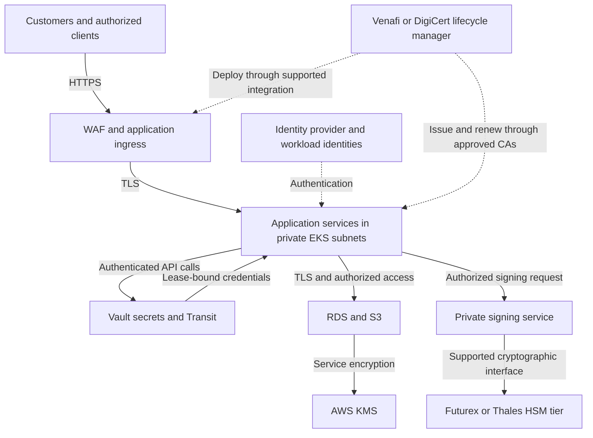
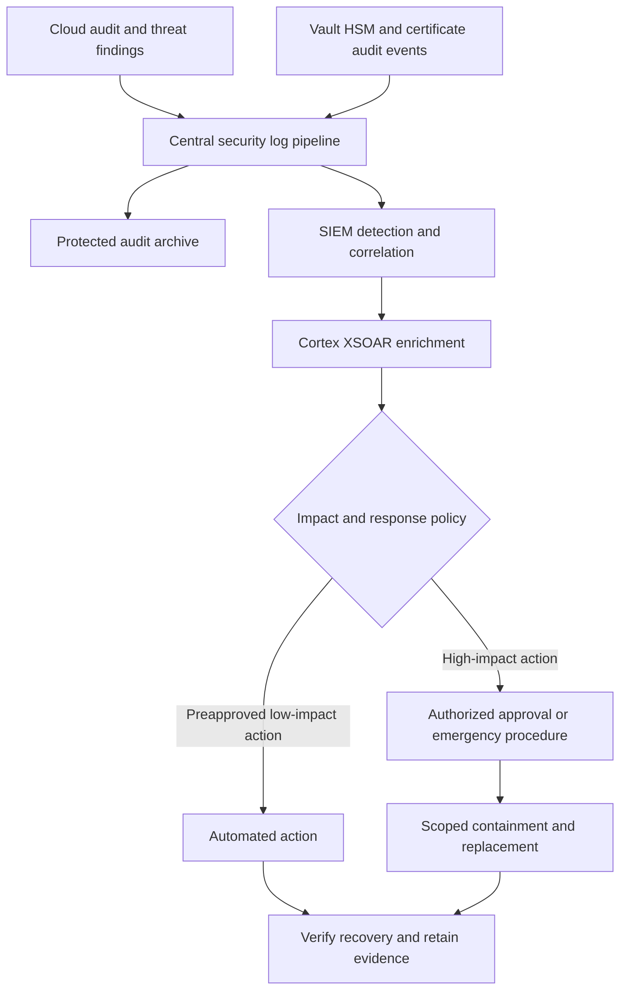

# Cloud Cryptography and Security Reference Architecture

Based on the attached Cloud Cryptography Engineer Interview Preparation guide.

## Purpose and assumptions

Protect confidential financial application data, preserve transaction integrity, automate certificate and secret lifecycles, and retain evidence for security operations and audits.

This is a proposed interview reference design, not a representation of Capital One's internal architecture. AWS is the primary deployment environment because the guide emphasizes AWS services. Azure can implement the same control objectives through provider-specific services. Product versions, licenses, connectors, capacity, data residency, and recovery objectives require validation before implementation.

Use separate production, nonproduction, security-services, and log-archive accounts. The diagrams show logical dependencies; they do not imply that every service belongs in a single VPC or account.

## Application and cryptography architecture

Solid arrows represent application traffic or service dependencies. Dashed arrows represent identity or certificate provisioning relationships. Certificate authorities and deployment agents are described below rather than expanded in this diagram.

## Component responsibilities

| Component | Design responsibility |
|---|---|
| Ingress | WAF filtering, TLS, request limits, application authentication integration, and controlled routing to private services. |
| EKS applications | Dedicated workload identities, service authorization, restricted namespaces, network policies, admission controls, and approved images. |
| AWS KMS | Provider-integrated encryption for supported storage services. Use scoped key policies and separate key administration from application use. |
| Vault | Dynamic database credentials where supported, narrowly scoped static-secret storage when necessary, and optional Transit encryption for selected fields. |
| Signing service | Authorizes callers and signing purposes, validates message schemas, applies rate limits, and records key version and operation metadata. It must not expose an unrestricted signing oracle. |
| HSM tier | Protects selected signing or CA private keys and executes supported cryptographic operations. Choose a validated Futurex or Thales product and deployment model. |
| Certificate manager | Discovers certificates, assigns owners, orchestrates approved CA issuance, deploys replacements, validates endpoints, and escalates failures. |
| Data services | Store application records and objects with transport encryption, provider-integrated encryption, access controls, backups, and retention policies. |

AWS CloudHSM is an alternative HSM implementation when its interfaces and operating model fit the requirement. It is not shown as an additional mandatory HSM layer. A CloudHSM HA cluster can span Availability Zones; Futurex and Thales designs require their own supported redundancy and recovery configurations. [2]

Vault auto-unseal using KMS protects access to Vault's storage encryption hierarchy. It does not by itself mean each Transit operation executes in a Futurex or Thales HSM. HSM-backed Vault operations require a separately validated configuration and applicable product support.

## How a protected transaction works

1. The client establishes HTTPS to the approved endpoint and authenticates. Application authorization validates access to the requested resource.
2. The application uses its workload identity to access Vault and other approved services. It retrieves a short-lived database credential where supported.
3. For data requiring field-level protection, the application sends only necessary fields to Vault Transit over TLS and receives ciphertext. Vault Transit does not persist the application payload; the application stores the ciphertext. [1]
4. The application stores records in RDS or objects in S3. Provider-integrated KMS encryption supplies an additional storage control.
5. If the transaction requires a digital signature, the signing service validates the business operation and requests a signature using the selected HSM-protected key. The result includes the signature and key identifier; the private key is not returned to the application.
6. The verifier checks the signature against a trusted public key and verifies transaction identity, freshness, and replay protections. A valid signature alone does not establish business authorization.
7. Access and operation metadata flow to security monitoring. Logs exclude secret values, private keys, and confidential transaction payloads.

Field encryption is selective because it affects searching, indexing, latency, and recovery. Transit does not replace TLS. For bulk encryption, evaluate an approved envelope-encryption pattern rather than routing every large object through Transit.

## Certificate lifecycle

Choose one primary lifecycle manager per certificate estate, such as Venafi or DigiCert, to avoid conflicting renewal ownership. Integrate with approved public or private CAs through supported connectors.

Discover certificates and endpoints; assign an accountable owner; validate SANs, usage, validity, and algorithm policy; generate keys at the approved endpoint or HSM; submit the CSR; issue and deploy; verify every active endpoint; renew before expiry; and revoke or replace when warranted.

DigiCert documents automation from request through installation and renewal. Actual endpoint support must be checked. [3] Public ingress may use ACM with its supported lifecycle; the enterprise certificate inventory must identify who owns issuance and renewal rather than assume every certificate can be controlled by an external manager.

A trusted root is normally held in the verifier's trust store; the server generally supplies the leaf and necessary intermediates. Endpoints must reload or otherwise activate replacement certificates. Issuance success does not prove deployment success.

## Monitoring and response architecture

Use CloudTrail for supported API events and CloudWatch for operational metrics and logs. Add relevant GuardDuty, Config, and Security Hub findings. Configure event coverage explicitly, including data events where needed; default logging should not be assumed to capture every operation.

| Scenario | Detection | Response |
|---|---|---|
| Certificate nearing expiry | Inventory thresholds or failed-renewal event | Resolve owner, renew through approved workflow, deploy, verify all endpoints, escalate failures. |
| Unusual secret retrieval | SIEM correlation of identity, source, path, volume, and time | Validate context, contain access under policy, revoke affected tokens where appropriate, replace exposed credentials, verify applications. |
| Suspected signing-key compromise | Unexpected signing activity or unauthorized administration | Preserve evidence, restrict signing, assess affected signatures/certificates, replace the key, update trust and revocation controls. |
| HSM member unavailable | Appliance health and application operation failures | Use tested failover, confirm key availability and capacity, restore service without exporting private keys as a workaround. |

High-impact changes use preauthorized incident procedures or documented approval paths. Revocation may be irreversible, so recovery may require replacement rather than rollback. Do not restore a compromised key merely to restore service.

## Governance and delivery controls

- Maintain key, certificate, secret, and application inventories with owners and dependencies.
- Define approved algorithms, key sizes, TLS versions, cryptoperiods, retention, and exception expiration dates.
- Require dual control and separation of duties for designated high-risk key operations.
- Use short-lived deployment identities; scan code, dependencies, images, secrets, and IaC.
- Use OPA or Sentinel policy gates and peer review to block known noncompliant changes. Passing a pipeline does not prove complete regulatory compliance.
- Protect Terraform state and plans. A sensitive flag does not prevent storage in state; use supported ephemeral or write-only mechanisms where appropriate.
- Retain access reviews, changes, policy exceptions, recovery tests, and incident records under the approved retention policy.

## Availability and disaster recovery

Deploy application replicas across Availability Zones and test zone loss. Design Vault quorum and storage placement so the selected node topology tolerates the intended failure; test unseal, backup, restore, and audit-device availability. Keep recovery access to the seal key independent of the failed application environment.

Distribute HSM capacity across supported failure domains and validate that surviving capacity meets demand. HA does not replace protected backups or key-deletion recovery planning.

Agree RTO and RPO by workload before selecting regional recovery. Recover application data together with the keys, certificate trust, Vault state, identity configuration, and network dependencies required to use it. Cross-region replication and vendor disaster-recovery features depend on service capabilities and licensing.

Never disable authentication, TLS validation, or encryption to bypass a security-service outage. Applications need bounded retries and clear failure behavior. Credential caching, if permitted, must honor validity and revocation requirements.

## Azure extension

| Control objective | AWS design | Azure counterpart to evaluate |
|---|---|---|
| Workload identity | IAM roles and supported EKS workload identity | Managed identities and supported AKS workload identity |
| Managed keys and secrets | KMS and approved secrets service | Key Vault; Managed HSM when appropriate |
| Workloads | EKS | AKS |
| Network isolation | Private subnets, security groups, VPC endpoints | VNets, NSGs, private endpoints |
| Monitoring | CloudTrail, CloudWatch, cloud security findings | Activity/resource logs, Azure Monitor, Defender for Cloud |
| Shared governance | Approved standards, SIEM, lifecycle ownership | Same control objectives with provider-specific implementation |

Use regional security services where latency and availability require them. Avoid making every AWS and Azure application depend on one cross-cloud Vault endpoint. Apply common policies while validating each provider's behavior.

## Implementation and validation

1. Confirm data classification, transaction requirements, regulatory scope, owners, and recovery targets.
2. Establish account boundaries, workload identities, network controls, and central logging.
3. Pilot Vault authentication, secrets, and field encryption with a nonproduction application.
4. Validate the chosen HSM product, supported application interface, key attributes, signing authorization, HA, and restore.
5. Integrate certificate discovery, issuance, renewal, deployment verification, and ownership escalation.
6. Add XSOAR playbooks and test approval paths and containment using synthetic incidents.
7. Perform application-level acceptance tests before production rollout.

Acceptance tests should show that unauthorized decrypt/sign requests fail; expired or invalid certificates are rejected; secret values stay out of logs; applications reload rotated credentials; HA survives the designed failures; restored data can be decrypted; and security incidents produce complete evidence.

Open design decisions: expected cryptographic operations per second, latency budget, approved CA and certificate manager, HSM model and firmware, Vault edition and topology, regional constraints, RTO/RPO, retention, and operating cost.

## Interview explanation

“I would separate application workloads from the services that protect keys, certificates, and secrets. Applications would use workload identities and least-privilege access, retrieve short-lived credentials from Vault, and protect data with managed encryption. Selected high-value signing operations would use an HSM through an authorized signing service. Certificate lifecycle automation would cover issuance through endpoint verification. Audit events would feed a SIEM and XSOAR for controlled response. I would validate availability and recovery across the application, data, and key dependencies, and keep ownership and audit evidence clear throughout the lifecycle.”

## Sources

- User-provided source: Cloud_Cryptography_Engineer_Interview_Preparation(1).docx.
- [1 — HashiCorp Vault Transit](https://developer.hashicorp.com/vault/docs/secrets/transit)
- [2 — AWS CloudHSM cluster architecture](https://docs.aws.amazon.com/cloudhsm/latest/userguide/cluster-architecture.html)
- [3 — DigiCert certificate automation](https://docs.digicert.com/en/trust-lifecycle-manager/automate-management-of-certificates.html)

This document proposes an architecture. It does not claim that infrastructure has been deployed or operational tests have been performed.

