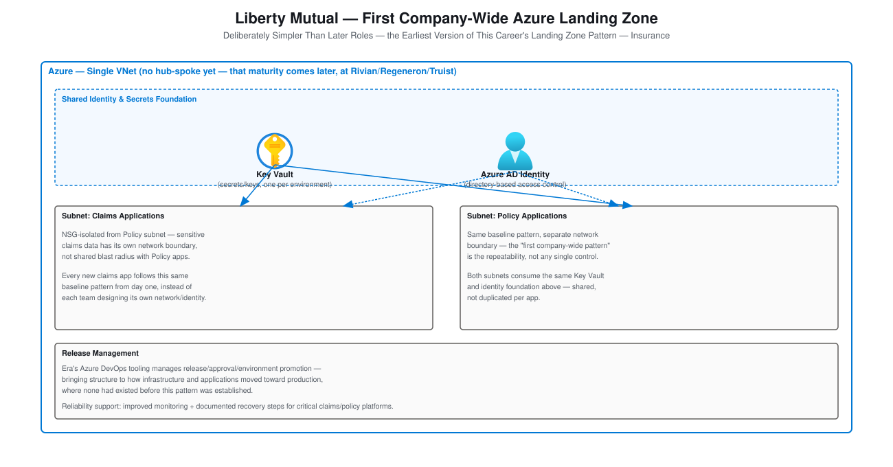

# Liberty Mutual — First Company-Wide Azure Landing Zone

A concrete architecture design for the Liberty Mutual resume bullets:
*"Helped establish the first company-wide Azure patterns (early Landing
Zone concepts and policy)... applied Azure security and governance
controls (identity, Key Vault, network isolation) to protect sensitive
insurance data."* This is deliberately the **simplest** architecture
doc in this folder — it's the earliest role, before the hub-spoke,
multi-cloud maturity seen at Rivian, Regeneron, and Truist Bank, and
showing that progression honestly is more credible than describing
every role at the same level of sophistication. Companion to
[Project-Deep-Dive-and-Interview-Prep.md § Liberty Mutual](Project-Deep-Dive-and-Interview-Prep.md)
and [STAR-Scenarios.md § Liberty Mutual](STAR-Scenarios.md#liberty-mutual)
in this folder.

## Table of Contents

1. [Requirements & Constraints](#1-requirements--constraints)
2. [Network Diagram (Single VNet, Pre-Hub-Spoke)](#2-network-diagram-single-vnet-pre-hub-spoke)
3. [Why This Is Simpler Than the Later Roles — On Purpose](#3-why-this-is-simpler-than-the-later-roles--on-purpose)
4. [Interview Questions](#4-interview-questions)

---

## 1. Requirements & Constraints

| Requirement | Why It Drives the Design |
|---|---|
| **Protect sensitive insurance data with no prior precedent** | This was among the earliest Azure workloads at the company — there was no existing pattern to extend, only one to establish. |
| **Don't block development velocity while establishing controls** | Security had to hold the line on real risk without making every early Azure adopter's job impossible — see the [tiered-baseline conflict resolution](Behavioral.md) this produced. |
| **Repeatability over cleverness** | The goal wasn't the most sophisticated possible design — it was a pattern simple enough that the *next* team could actually follow it without expert help. |

[⬆ Back to top](#top)

---

## 2. Network Diagram (Single VNet, Pre-Hub-Spoke)

Built with the real, official
[Azure Architecture Icons](https://learn.microsoft.com/en-us/azure/architecture/icons/).

**Reading the diagram**: no hub-and-spoke topology yet, no companion
AWS side — that maturity comes later in the career, at Rivian,
Regeneron, and Truist Bank. What *is* here, and what actually mattered:
a shared identity and Key Vault foundation that every application
subnet consumes rather than duplicating, and network isolation between
the Claims and Policy subnets so sensitive claims data doesn't share a
blast radius with policy data. The pattern's value wasn't its
sophistication — it was that a new claims or policy application could
follow the *same* structure instead of every team inventing its own.

[⬆ Back to top](#top)

---

## 3. Why This Is Simpler Than the Later Roles — On Purpose

It would be easy to describe this role using the same hub-spoke,
multi-cloud, unified-security-posture language as Truist Bank — but
that wouldn't be true, and a technical interviewer who asks a follow-up
question would find the gap immediately. The honest version is more
credible: this was the first attempt at a repeatable pattern, built
with the tools and maturity available at the time (a single VNet,
Key Vault, identity-based access, network isolation via NSGs), and it
established the habit — think in terms of a *reusable pattern*, not a
one-off configuration — that scaled up through every subsequent role.
The Rivian/Regeneron/Truist Bank architectures aren't a different
philosophy; they're the same philosophy applied with more mature tools
and, eventually, a second cloud.

[⬆ Back to top](#top)

---

## 4. Interview Questions

**"This looks a lot simpler than your later architecture work — was it?"**
Yes, genuinely — this was the earliest Azure landing zone work in the
career, before hub-spoke topology or multi-cloud was part of the
pattern. The value at the time wasn't sophistication, it was
repeatability: giving the next claims or policy application a baseline
to start from instead of a blank subscription.

**"How did you decide what belonged in the shared foundation versus per-application?"**
Identity and secrets management (Key Vault) were shared, since
duplicating those per application just means N places to misconfigure
access instead of one. Network isolation was per-subnet, specifically
because claims and policy data shouldn't share a blast radius even
though both consumed the same shared identity/secrets layer.

**"What would you have done differently if you were building this same pattern today, with what you know now?"**
Start with the Management Group hierarchy and hub-spoke topology from
day one rather than a single VNet — the later roles show that maturity
was worth reaching, but at the time, a single VNet with a real,
repeatable pattern was a genuine improvement over the ad hoc
alternative it replaced, and was the right scope for that
organization's Azure maturity at that moment.

[⬆ Back to top](#top)
