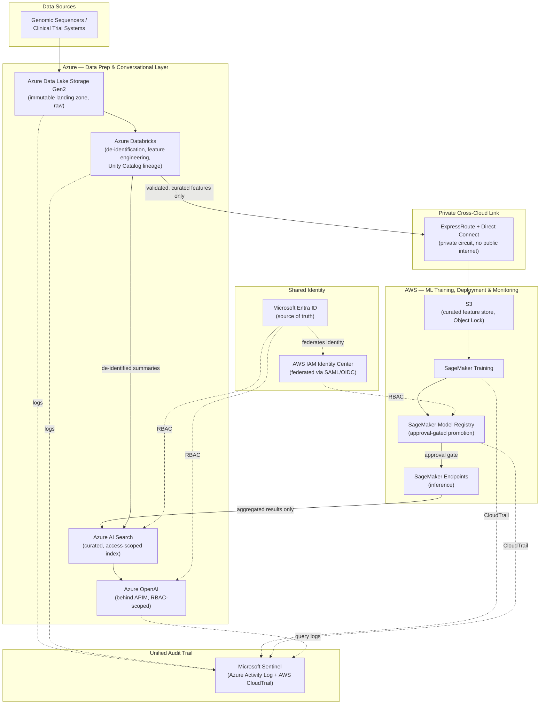
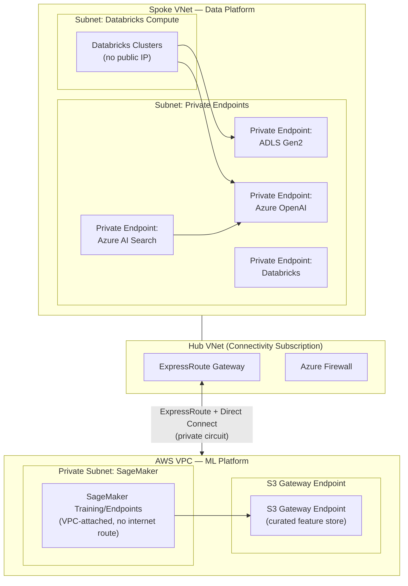

# Regeneron — AWS-Azure Research Platform Architecture

A concrete architecture design for the Regeneron resume bullet: *"Designed
how Regeneron's research platform would use AWS and Azure together —
shared identity, private networking, and consistent CI/CD — so clinical
and genomic data could move securely between clouds without breaking GxP
controls... paired SageMaker with Azure Databricks, and integrated Azure
OpenAI so scientists could explore results through conversational
interfaces under strict access controls."* Companion to
[Project-Deep-Dive-and-Interview-Prep.md § Regeneron](Project-Deep-Dive-and-Interview-Prep.md)
and [STAR-Scenarios.md § Regeneron](STAR-Scenarios.md#regeneron) in this
folder.

## Table of Contents

1. [Requirements & Constraints](#1-requirements--constraints)
2. [Architecture Diagram](#2-architecture-diagram)
3. [Identity & Network Foundation](#3-identity--network-foundation)
4. [Data Pipeline Walkthrough](#4-data-pipeline-walkthrough)
5. [Conversational Layer (Azure OpenAI)](#5-conversational-layer-azure-openai)
6. [GxP Controls Mapped to Design Decisions](#6-gxp-controls-mapped-to-design-decisions)
7. [CI/CD & Change Control](#7-cicd--change-control)
8. [Interview Questions](#8-interview-questions)

---

## 1. Requirements & Constraints

| Requirement | Why It Drives the Design |
|---|---|
| **GxP compliance** | Clinical/genomic data integrity, traceability, and validated environments — every change to the pipeline or infrastructure must be provable to an auditor, not just functional. |
| **Best-tool-per-stage** | SageMaker for production ML lifecycle (train/deploy/monitor); Databricks for large-scale data prep and feature engineering — neither cloud does both equally well. |
| **Conversational access, safely** | Scientists need natural-language access to research results without ever giving a language model direct access to raw regulated records. |
| **No public-internet data path** | Clinical/genomic data crossing clouds must stay on a private, auditable path — never routed over the public internet. |
| **Single identity, single audit trail** | One workforce, two clouds — access control and audit logging must be coherent across both, not two separate stories. |

**Design principle carried through every decision below**: raw regulated
data never leaves its cloud of origin in raw form, and nothing
downstream (a model, an index, a chatbot) ever touches raw PII/PHI
directly — only validated, de-identified, or aggregated outputs move
across the cloud boundary or reach an end user.

[⬆ Back to top](#top)

---

## 2. Architecture Diagram

**Reading the diagram**: raw data lands and stays in Azure Data Lake
Storage as the system of record; Databricks is the *only* thing that
touches it directly. Only validated, curated features cross the
private link to AWS for training. Only aggregated/de-identified
outputs feed the conversational layer. Identity and audit logging span
both clouds so there's one story to tell an auditor, not two.

[⬆ Back to top](#top)

---

## 3. Identity & Network Foundation

**Identity**: Microsoft Entra ID is the single source of truth, federated
into AWS via **IAM Identity Center** (SAML/OIDC) rather than maintaining
separate AWS IAM users. RBAC roles are defined once conceptually
(Data Engineer, ML Engineer, Researcher, Auditor) and mapped consistently
on both sides — a Researcher role grants Azure AI Search query access
and nothing in AWS; an ML Engineer role grants SageMaker training access
and Databricks workspace access, scoped to non-production by default.
Privileged Identity Management (PIM) governs just-in-time elevation for
anything touching raw data or production model promotion; a small set
of break-glass accounts (credentials offline, excluded from Conditional
Access) exist so a Conditional Access misconfiguration can't lock
administrators out entirely.

**Network**: Azure VNet and AWS VPC connect over a **private circuit**
(ExpressRoute paired with Direct Connect through a shared colocation
provider) — not a public-internet VPN — because GxP-regulated data
should never traverse a public routing path, even encrypted. Every
service that touches data has a private endpoint: Azure Private Link
for Databricks and Azure OpenAI, AWS PrivateLink/VPC endpoints for S3
and SageMaker, so no data plane traffic exits either cloud's private
network at any hop.

### Network Diagram (VNet + VPC, Subnet-Level)

**Reading the diagram**: nothing in either the Azure spoke or the AWS
VPC has a public IP or an internet route. Databricks compute reaches
storage and OpenAI only through private endpoints inside its own VNet;
SageMaker reaches its curated training data only through a VPC gateway
endpoint to S3. The only path between the two clouds at all is the
single ExpressRoute/Direct Connect circuit through the hub — there is
no other route by which data could leave either private network.

[⬆ Back to top](#top)

---

## 4. Data Pipeline Walkthrough

1. **Ingestion** — genomic sequencer output and clinical trial system
   exports land in **Azure Data Lake Storage Gen2**, configured with
   immutable blob storage (WORM) so the raw record can never be silently
   altered — the first GxP data-integrity control.
2. **De-identification & feature engineering** — **Azure Databricks**
   is the only component with direct access to raw data. It runs
   de-identification/PII-scrubbing jobs, then feature engineering,
   writing every transformation's lineage into **Unity Catalog** — so
   "where did this feature come from, and what was done to it" is
   answerable for any auditor, not just discoverable by asking someone.
3. **Curated handoff to AWS** — only the de-identified, validated
   feature set crosses the private link into **S3**, with **Object
   Lock** enabled so the curated training set is also immutable once
   written — a second, independent GxP integrity control at the AWS
   boundary.
4. **Training** — **SageMaker Training** jobs consume the curated
   features; every training run is logged with its exact input dataset
   version, satisfying "what data trained this model" traceability.
5. **Validated promotion** — trained models register in the
   **SageMaker Model Registry**, which requires an explicit approval
   step before a model can be promoted to a serving endpoint — this
   approval gate is the direct architectural analog of GxP's *computer
   system validation*: a model doesn't reach production because a job
   finished successfully, it reaches production because someone with
   the right role approved it.
6. **Inference** — **SageMaker Endpoints** serve predictions back into
   the research platform; only aggregated or summary-level outputs
   (never raw records) flow onward to the conversational layer.

[⬆ Back to top](#top)

---

## 5. Conversational Layer (Azure OpenAI)

This is where "under strict access controls" does the most architectural
work — a language model must never have a path to raw clinical/genomic
data, only to what's already been through governance:

- **Retrieval-Augmented Generation (RAG), not direct data access** —
  Azure OpenAI never queries S3, ADLS, or SageMaker directly. It queries
  **Azure AI Search**, an index built *only* from de-identified summaries
  and aggregated model outputs that Databricks and SageMaker have
  already produced and validated.
- **Row/document-level security in Azure AI Search** — the index itself
  is access-scoped, so a scientist's query only ever retrieves documents
  their role and project assignment permit — the same Entra ID identity
  used everywhere else in the platform, not a separate login.
- **APIM in front of Azure OpenAI** — every call is routed through Azure
  API Management, which enforces the RBAC scope, applies rate limiting,
  and is the single point where every prompt and response gets logged.
- **Full query audit trail** — every question asked and every answer
  returned is logged to the unified Sentinel workspace — "who asked
  what, when, and what was returned" is itself part of the GxP audit
  story, not an afterthought bolted onto the chat feature.

[⬆ Back to top](#top)

---

## 6. GxP Controls Mapped to Design Decisions

| GxP Requirement | Architectural Control |
|---|---|
| **Data integrity** | Immutable storage at two independent points (ADLS WORM for raw, S3 Object Lock for curated); Unity Catalog lineage tracks every transformation. |
| **Traceability** | Every training run logs its exact input dataset version; every AI Search query/response is logged; Sentinel unifies Azure Activity Log + AWS CloudTrail into one auditable trail. |
| **Validated environments** | Landing Zones/Azure Policy (Azure) + AWS Organizations guardrails (AWS) mean every new project subscription/account starts from an already-compliant baseline, not one audited into compliance after the fact. |
| **Change control / computer system validation** | SageMaker Model Registry's approval gate before production promotion; infrastructure changes flow through a single CI/CD pipeline with required approvals (see §7). |
| **Access control** | Entra ID as single identity source federated to AWS; PIM for just-in-time elevation; Azure AI Search row-level security scoping conversational access to what a role/project permits. |
| **No uncontrolled data movement** | Private ExpressRoute/Direct Connect circuit; only curated/de-identified data ever crosses the cloud boundary, never raw records. |

[⬆ Back to top](#top)

---

## 7. CI/CD & Change Control

A single pipeline (Azure DevOps or GitHub Actions) deploys infrastructure
on **both** clouds — Bicep/Terraform for Azure resources (Databricks
workspace config, AI Search index schema, APIM policies), Terraform or
CloudFormation for AWS resources (SageMaker pipelines, S3 bucket
policies, IAM roles) — so there's one change history, one approval
process, and one audit trail for "what changed, when, and who approved
it," regardless of which cloud the change actually touched. Required
approvals on any change touching production data access or model
promotion are what make this the GxP-equivalent of a controlled change
process, not just a deployment convenience.

[⬆ Back to top](#top)

---

## 8. Interview Questions

**"Why does raw data never leave Azure in this design?"**
Because the fewer systems that touch raw regulated data, the smaller
the surface area an auditor has to review and the fewer places a data
integrity failure could originate — Databricks is the single, audited
chokepoint for anything touching raw records, and everything downstream
only ever sees de-identified or curated output.

**"Why SageMaker Model Registry's approval gate, specifically?"**
It's the architectural stand-in for GxP's computer system validation
requirement — a model reaching production has to be a deliberate,
attributable human decision (who approved it, when), not just "the
training job finished and the pipeline auto-promoted it."

**"How does the RAG pattern prevent the chatbot from leaking raw data?"**
Azure OpenAI has no network or credential path to raw data stores at
all — it can only retrieve from Azure AI Search, whose index only ever
contains what Databricks/SageMaker have already de-identified and
validated. Even a successfully "jailbroken" prompt can't retrieve data
the index was never given.

**"Why ExpressRoute + Direct Connect instead of a site-to-site VPN?"**
A VPN, even encrypted, still routes over the public internet path;
GxP-regulated data should stay on a private, dedicated circuit end to
end — the requirement isn't just confidentiality, it's a documented,
controlled data path an auditor can point to.

[⬆ Back to top](#top)
