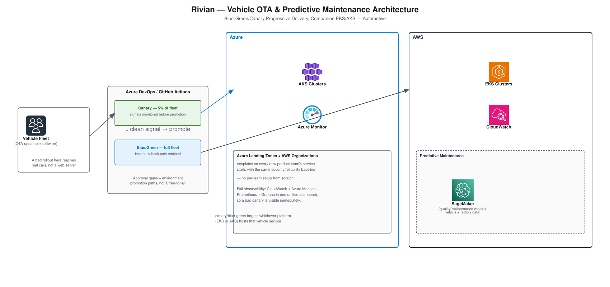

# Rivian — Vehicle OTA & Predictive Maintenance Architecture

A concrete architecture design for the Rivian resume bullets: *"Built
and managed Kubernetes clusters on AWS (EKS) and Azure (AKS)... used
Azure DevOps and GitHub Actions to manage progressive delivery
(blue-green and canary) for vehicle software services... used AWS
SageMaker to train, deploy, and monitor models that supported
predictive maintenance."* Companion to
[Project-Deep-Dive-and-Interview-Prep.md § Rivian](Project-Deep-Dive-and-Interview-Prep.md)
and [STAR-Scenarios.md § Rivian](STAR-Scenarios.md#rivian) in this
folder.

## Table of Contents

1. [Requirements & Constraints](#1-requirements--constraints)
2. [Network Diagram (OTA Delivery & Predictive Maintenance)](#2-network-diagram-ota-delivery--predictive-maintenance)
3. [Why Canary Before Blue-Green, Not Instead Of](#3-why-canary-before-blue-green-not-instead-of)
4. [Why Full Observability Matters Here Specifically](#4-why-full-observability-matters-here-specifically)
5. [Interview Questions](#5-interview-questions)

---

## 1. Requirements & Constraints

| Requirement | Why It Drives the Design |
|---|---|
| **A bad rollout must have a small, contained blast radius** | OTA updates reach real vehicles already on the road — this isn't a web server where a bad deploy just means a 500 error. |
| **Fast, reliable rollback** | If a canary signal turns bad, the fix has to be "stop and revert," not "scramble to patch forward." |
| **New services start compliant from day one** | New product teams shouldn't have to rebuild security/reliability baselines from scratch for every new vehicle service. |
| **One view of platform health across both clouds** | A canary is only useful if a bad signal is visible immediately — observability has to be unified, not split across two dashboards someone has to remember to check both. |

[⬆ Back to top](#top)

---

## 2. Network Diagram (OTA Delivery & Predictive Maintenance)

Built with the real, official
[Azure Architecture Icons](https://learn.microsoft.com/en-us/azure/architecture/icons/)
and [AWS Architecture Icons](https://aws.amazon.com/architecture/icons/).

**Reading the diagram**: every vehicle software release goes through
Azure DevOps/GitHub Actions as a canary first — a small slice of the
fleet (not the whole fleet) — with signals monitored before promotion.
Only once that signal is clean does it promote to blue-green across the
full fleet, with the previous version staying live as the instant
rollback target. The pipeline can target either EKS or AKS depending on
which platform hosts that specific vehicle service — the progressive
delivery discipline is the same regardless of platform. SageMaker
separately consumes vehicle and factory telemetry for predictive
maintenance, independent of the release pipeline.

[⬆ Back to top](#top)

---

## 3. Why Canary Before Blue-Green, Not Instead Of

These aren't two competing options — they're sequential stages of the
same rollout. Canary answers "does this release actually work under
real traffic" using a small, contained slice of the fleet; blue-green
answers "if it does, how do we cut over the rest of the fleet with an
instant, complete rollback path if something unexpected shows up at
scale." Skipping canary and going straight to blue-green would validate
the release against zero real vehicles before a full cutover; skipping
blue-green and just expanding the canary slice gradually would mean no
clean "previous version still fully live" fallback if a problem
surfaces after most of the fleet has already moved. *(The blast-radius
math behind choosing this over a simpler rolling update is worked
through in
[Behavioral.md § Rivian — Blue-Green/Canary vs. Faster Rolling Updates](Behavioral.md).)*

[⬆ Back to top](#top)

---

## 4. Why Full Observability Matters Here Specifically

CloudWatch, Azure Monitor, Prometheus, and Grafana feeding one unified
dashboard isn't just good practice in general — it's the specific
mechanism that makes canary *meaningful*. A canary strategy is only as
good as how fast a bad signal is actually noticed; if the EKS-hosted
services' metrics and the AKS-hosted services' metrics live in two
separate dashboards nobody's watching simultaneously, the whole point
of limiting the blast radius to 5% of the fleet is undermined by how
long it takes a human to notice something's wrong in that 5%.

[⬆ Back to top](#top)

---

## 5. Interview Questions

**"Why not just use a simple rolling update instead of both canary and blue-green?"**
A rolling update updates a web server without holding a fully-live
fallback version and without validating against a truly limited-blast-
radius slice first — for vehicle software reaching real cars, that's
not enough safety margin. See the quantified blast-radius argument in
[Behavioral.md](Behavioral.md).

**"How do you decide which platform — EKS or AKS — hosts a given vehicle service?"**
Workload fit, the same principle applied at Truist Bank and Southern
Company — existing ecosystem dependencies and team expertise for that
specific service, not a blanket platform mandate. The progressive
delivery pipeline works identically against either.

**"What's the actual failure mode canary is protecting against that blue-green alone wouldn't catch?"**
Blue-green protects against needing to roll back *after* a full
cutover; canary protects against ever reaching that full cutover with a
release that was broken from the start — it validates against real
production traffic on a small slice before the blast radius grows at
all.

**"How does SageMaker's predictive maintenance work relate to the release pipeline?"**
They're independent systems solving different problems — the release
pipeline governs how new software reaches vehicles safely; SageMaker
consumes vehicle and factory telemetry to predict hardware/quality
issues before they become failures. They share infrastructure (AWS)
but aren't coupled to each other.

[⬆ Back to top](#top)
