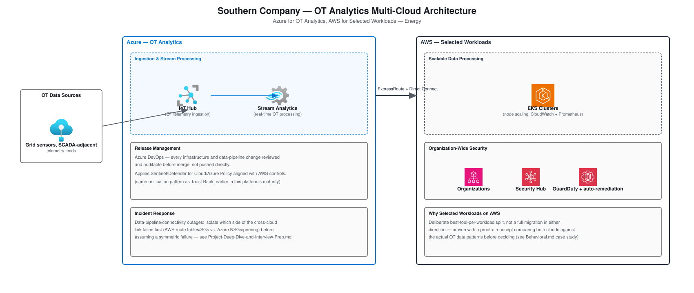

# Southern Company — OT Analytics Multi-Cloud Architecture

A concrete architecture design for the Southern Company resume bullet:
*"Created standard multi-cloud designs so Southern Company could run
OT-related analytics on Azure while keeping selected workloads on
AWS... built and managed Kubernetes clusters on AWS (EKS) for scalable
data processing... led incident response for several major
data-pipeline and connectivity outages."* Companion to
[Project-Deep-Dive-and-Interview-Prep.md § Southern Company](Project-Deep-Dive-and-Interview-Prep.md),
[STAR-Scenarios.md § Southern Company](STAR-Scenarios.md#southern-company),
and [Behavioral.md § Southern Company](Behavioral.md) in this folder.

## Table of Contents

1. [Requirements & Constraints](#1-requirements--constraints)
2. [Network Diagram (OT Analytics)](#2-network-diagram-ot-analytics)
3. [Why Azure for OT, AWS for Selected Workloads](#3-why-azure-for-ot-aws-for-selected-workloads)
4. [Troubleshooting Cross-Cloud Connectivity Outages](#4-troubleshooting-cross-cloud-connectivity-outages)
5. [Interview Questions](#5-interview-questions)

---

## 1. Requirements & Constraints

| Requirement | Why It Drives the Design |
|---|---|
| **Real-time OT telemetry ingestion** | Grid/utility sensor data arrives continuously and needs stream processing, not batch — a delayed signal has real operational consequences. |
| **Scalable downstream processing** | The processed OT data volume needs elastic compute (EKS) rather than fixed capacity sized for peak. |
| **Auditable pipeline changes** | Utility/energy environments carry real audit-trail and change-control weight — every infrastructure or data-pipeline change needs to be reviewable, not pushed directly. |
| **Workload placement by fit, not habit** | Some workloads genuinely fit AWS better than Azure (or vice versa) — the design has to support a deliberate split, proven rather than assumed. |

[⬆ Back to top](#top)

---

## 2. Network Diagram (OT Analytics)

Built with the real, official
[Azure Architecture Icons](https://learn.microsoft.com/en-us/azure/architecture/icons/)
and [AWS Architecture Icons](https://aws.amazon.com/architecture/icons/).

**Reading the diagram**: OT telemetry lands in Azure IoT Hub, gets
processed in near-real-time by Stream Analytics, and only the processed
output crosses the ExpressRoute/Direct Connect circuit to the AWS side,
where EKS handles the scalable downstream processing (node scaling,
upgrades, hardening, monitored via CloudWatch and Prometheus).
Organization-wide AWS security (Organizations, Security Hub, GuardDuty
with automated remediation) governs that side independently, aligned
with — not duplicated by — the Azure-side Sentinel/Defender for
Cloud/Azure Policy controls.

[⬆ Back to top](#top)

---

## 3. Why Azure for OT, AWS for Selected Workloads

This wasn't a cloud-preference decision — it was settled with a small
proof-of-concept comparing both clouds against the actual OT data
patterns (ingestion shape, latency needs, existing tooling fit) before
committing either way. *(Full case study: [Behavioral.md § Southern Company — Which Cloud Should Host OT Analytics?](Behavioral.md)*)
The result: OT-related analytics — ingestion and near-real-time
processing — fit Azure's IoT/stream-processing tooling well, while the
scalable downstream data processing fit EKS's node-scaling model better
for that specific workload's compute profile. Both sides stayed
governed by the same reusable multi-cloud pattern (networking,
identity, security, CI/CD) other teams could reuse, rather than a
one-off integration.

[⬆ Back to top](#top)

---

## 4. Troubleshooting Cross-Cloud Connectivity Outages

The recurring incident pattern here was data-pipeline and connectivity
outages between the two clouds. The approach that actually reduced
recovery time: **isolate which side of the cross-cloud link failed
first** — check the AWS side (route tables, security groups on the
ExpressRoute/Direct Connect path) and the Azure side (NSGs, VNet
peering) independently before assuming the failure is symmetric. In
practice, a one-sided route table or NSG change was a far more common
root cause than a genuine link-level outage on the circuit itself —
treating every connectivity incident as "check both sides
independently" rather than "the link is down" cut time-to-root-cause
significantly. Automated remediation on the AWS side, plus improved
alerts and documented runbooks, is what turned repeat incidents into
faster subsequent recoveries.

[⬆ Back to top](#top)

---

## 5. Interview Questions

**"Why put OT analytics on Azure specifically, rather than keeping everything on AWS where the team already had expertise?"**
It wasn't decided on expertise or preference — a proof-of-concept
compared both clouds against the actual OT ingestion/processing
patterns, and Azure's IoT Hub/Stream Analytics tooling fit that
specific workload's real-time characteristics better. Existing
expertise is a real cost to overcome, but it isn't a reason to pick the
wrong tool for the workload.

**"Walk me through how you'd troubleshoot a cross-cloud connectivity outage between Azure and AWS."**
Isolate which side failed first rather than assuming a symmetric link
failure — check AWS route tables and security groups on the
ExpressRoute/Direct Connect path independently from Azure NSGs and VNet
peering. In practice, a one-sided misconfiguration is a far more common
cause than the physical circuit actually being down.

**"Why EKS specifically for the downstream data processing, rather than a Azure-native equivalent?"**
The processing workload's node-scaling and compute profile fit EKS's
scaling model well for that specific data volume pattern — this is the
same best-tool-per-workload principle behind putting OT analytics on
Azure in the first place, applied to the next stage of the pipeline.

**"How do you keep organization-wide AWS security governance from duplicating what Azure Policy already does on the other side?"**
They're not duplicated — each cloud's controls (Organizations/Security
Hub/GuardDuty vs. Sentinel/Defender for Cloud/Azure Policy) close the
same class of gap (unauthorized or non-compliant configuration) on that
cloud's own terms, aligned into one coherent picture rather than each
side re-implementing the other's job.

[⬆ Back to top](#top)
