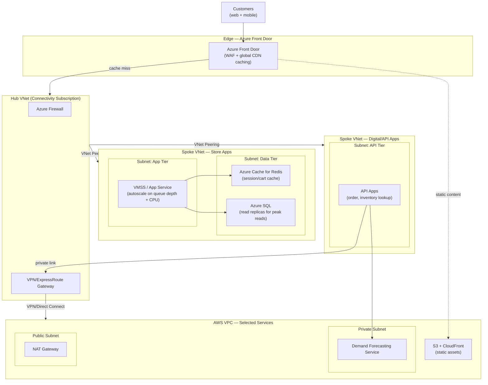

# TJ Maxx — Peak Holiday Traffic Architecture

A concrete architecture design for the TJ Maxx resume bullet: *"Created
early multi-cloud patterns so retail and e-commerce teams could use
Azure as the primary platform while leveraging selected AWS services...
enabling frequent, controlled releases that survived peak holiday
traffic."* Companion to
[Project-Deep-Dive-and-Interview-Prep.md § TJ Maxx](Project-Deep-Dive-and-Interview-Prep.md)
and [STAR-Scenarios.md § TJ Maxx](STAR-Scenarios.md#tj-maxx) in this
folder.

## Table of Contents

1. [Requirements & Constraints](#1-requirements--constraints)
2. [Network Diagram (VNet + VPC)](#2-network-diagram-vnet--vpc)
3. [Absorbing the Traffic Spike, Layer by Layer](#3-absorbing-the-traffic-spike-layer-by-layer)
4. [Release Management Around Peak Dates](#4-release-management-around-peak-dates)
5. [The Iterative Feedback Loop](#5-the-iterative-feedback-loop)
6. [Interview Questions](#6-interview-questions)

---

## 1. Requirements & Constraints

| Requirement | Why It Drives the Design |
|---|---|
| **Survive a predictable, narrow traffic spike** | Black Friday/Cyber Monday-style peaks are known in advance (unlike most outages) — the architecture should scale *ahead of* the spike, not react to it. |
| **Azure-primary, selected AWS services** | Reflects the era's existing Windows/on-prem estate migrating to Azure first — not every workload needed to move, so the network has to connect two clouds cleanly, not replace one with the other. |
| **Zero-disruption releases during peak** | Store and digital apps still need controlled releases in the lead-up to peak — the architecture can't force a code freeze so long it blocks legitimate fixes. |
| **Protect customer data under high load** | Peak traffic is also peak attack-surface exposure — governance (Security Center-era) has to hold up under load, not just at normal traffic. |

[⬆ Back to top](#top)

---

## 2. Network Diagram (VNet + VPC)

**Reading the diagram**: Azure Front Door is the first line of defense —
its CDN cache and WAF absorb and filter most of the traffic spike before
it ever reaches a spoke VNet. Store apps (VMSS/App Service) sit in one
spoke, scaling independently from the API tier in a second spoke, so a
surge on one doesn't starve the other. The one AWS-hosted service
(demand forecasting) sits behind a private VPN/Direct Connect link from
the hub — the API tier calls it, but nothing about the store app's own
scaling depends on AWS being reachable at all.

[⬆ Back to top](#top)

---

## 3. Absorbing the Traffic Spike, Layer by Layer

| Layer | Control | Purpose |
|---|---|---|
| **Edge** | Azure Front Door WAF + CDN caching | Deflects the majority of read-heavy traffic (product pages, static assets) before it ever reaches compute — the cheapest place to absorb a spike is before it becomes backend load. |
| **App tier** | VMSS/App Service autoscale, pre-warmed ahead of the predicted peak window | Scaling *reactively* on a Black Friday-scale spike is too slow — the pattern here is scaling out proactively based on the prior year's known traffic curve, then letting autoscale handle the delta. |
| **Data tier** | Azure Cache for Redis in front of Azure SQL; SQL read replicas for peak reads | Peak retail traffic is read-heavy (browsing, cart checks) far more than write-heavy (actual purchases) — caching reads is what keeps the database from becoming the bottleneck. |
| **Cross-cloud dependency** | AWS demand-forecasting service behind a private link, called by the API tier but not on the customer-facing critical path | A dependency that isn't strictly required for checkout to succeed shouldn't be allowed to take checkout down if it's slow or unavailable during peak. |

[⬆ Back to top](#top)

---

## 4. Release Management Around Peak Dates

Azure DevOps manages releases with a **freeze window** around the known
peak dates (the days immediately before and through Black
Friday/Cyber Monday) — no new feature releases during the window itself,
but the pipeline stays fully usable for validated hotfixes, deployed
through the same controlled approval gates used year-round rather than
an ad hoc "break glass" process. Everything shipped in the weeks leading
up to peak goes through the same release process at higher-than-normal
frequency, specifically so the code running during peak has already
been exercised under real production traffic before the freeze begins,
rather than shipping something untested right before the highest-stakes
weekend of the year.

[⬆ Back to top](#top)

---

## 5. The Iterative Feedback Loop

This is the mechanism behind the STAR scenario's Result ("each
subsequent peak event caused measurably less disruption than the one
before it"): every incident during a peak event gets a runbook or alert
improvement *before* the next peak event, not just a retrospective
document. Concretely:

- An alert that fired too late (or not at all) during one Black Friday
  gets a lower threshold or a new signal before the next one.
- A manual recovery step that took too long during an incident becomes
  an automated remediation script before the next peak window.
- Capacity that was under-provisioned gets baked into the next year's
  pre-scaling plan, based on the actual observed peak, not just the
  prior estimate.

The architecture doesn't "solve" peak traffic once — it's designed to
get measurably better at it every single year.

[⬆ Back to top](#top)

---

## 6. Interview Questions

**"Why Azure Front Door instead of just scaling the app tier harder?"**
Absorbing traffic at the edge (caching, WAF filtering) is cheaper and
faster than absorbing it at the app tier — every request Front Door
serves from cache or blocks at the WAF is a request the VMSS/App
Service autoscaler never has to handle at all.

**"Why put the AWS forecasting service behind the API tier instead of on the customer-facing critical path?"**
Because it's not required for a customer to complete checkout — if it's
slow or briefly unavailable during peak, that should degrade a
recommendation feature, not take down the store. Anything on the
customer-facing critical path during the highest-traffic weekend of the
year should have the fewest possible external dependencies.

**"Why proactive pre-scaling instead of relying on autoscale alone?"**
Autoscale reacts to load that's already arrived — for a Black
Friday-scale, sudden, deadline-known spike, waiting for autoscale to
catch up risks a window of degraded performance right as the spike
starts. Scaling ahead of the known peak, then letting autoscale handle
the remaining variance, avoids that lag entirely.

**"How do you keep shipping fixes during a release freeze without it becoming a free-for-all?"**
The freeze blocks *new feature* releases, not the pipeline itself —
validated hotfixes still go through the same approval-gated release
process used year-round, just held to a higher bar of urgency
justification, so there's still one controlled path to production, not
an emergency backdoor that bypasses governance right when it matters
most.

[⬆ Back to top](#top)
