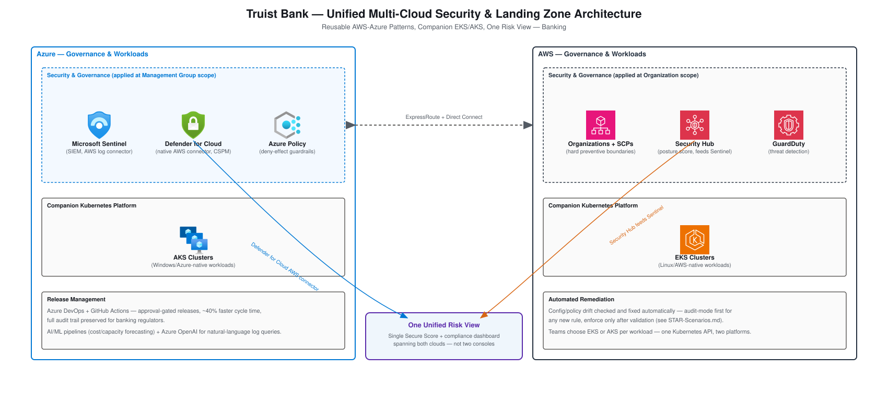

# Truist Bank — Unified Multi-Cloud Security & Landing Zone Architecture

A concrete architecture design for the Truist Bank resume bullets:
*"Created standard designs for how Truist should use AWS and Azure
together... defined reusable multi-cloud patterns that other teams
followed... Applied Azure security and governance together with AWS
controls to create a single view of risk... reduced release cycle time
by ~40%."* Companion to
[Project-Deep-Dive-and-Interview-Prep.md § Truist Bank](Project-Deep-Dive-and-Interview-Prep.md),
[STAR-Scenarios.md § Truist Bank](STAR-Scenarios.md#truist-bank) and
[§ Cross-Cutting](STAR-Scenarios.md#unified-security-posture) in this
folder.

## Table of Contents

1. [Requirements & Constraints](#1-requirements--constraints)
2. [Network Diagram (Unified Security Architecture)](#2-network-diagram-unified-security-architecture)
3. [Why Companion EKS/AKS Instead of One Platform](#3-why-companion-eksaks-instead-of-one-platform)
4. [Release Pipeline & the ~40% Number](#4-release-pipeline--the-40-number)
5. [Interview Questions](#5-interview-questions)

---

## 1. Requirements & Constraints

| Requirement | Why It Drives the Design |
|---|---|
| **One risk view, not two consoles** | A bank's security/compliance team can't be expected to reconcile findings across separate AWS and Azure consoles by hand — the design has to produce one picture. |
| **Reusable, not bespoke per team** | The pattern has to be adopted bank-wide by teams that didn't build it — templates and defaults, not a one-off design doc. |
| **Audit trail survives every change** | Banking regulators require a provable record of what changed, when, and who approved it — release velocity can't come at the cost of that record. |
| **Workload choice, not platform mandate** | Different teams' workloads genuinely fit EKS or AKS better depending on OS/ecosystem — the design has to support both without forcing a migration either team doesn't need. |

[⬆ Back to top](#top)

---

## 2. Network Diagram (Unified Security Architecture)

Built with the real, official
[AWS Architecture Icons](https://aws.amazon.com/architecture/icons/)
and [Azure Architecture Icons](https://learn.microsoft.com/en-us/azure/architecture/icons/).

**Reading the diagram**: each cloud keeps its own native security stack
— AWS Organizations/SCPs, Security Hub, and GuardDuty on one side;
Microsoft Sentinel, Defender for Cloud, and Azure Policy on the other —
rather than replacing either with a third tool. The unification happens
through native connectors: Defender for Cloud's own AWS connector pulls
AWS posture directly into the same Secure Score Azure resources already
show up in, and Security Hub findings feed into Sentinel's SIEM
workspace alongside Azure signals. Companion EKS and AKS clusters sit
in the same pattern — same governance wrapping both, teams pick the
platform per workload. *(Full mechanism and the options considered
before choosing native connectors over a third-party CNAPP: see
[STAR-Scenarios.md § Cross-Cutting](STAR-Scenarios.md#unified-security-posture).)*

[⬆ Back to top](#top)

---

## 3. Why Companion EKS/AKS Instead of One Platform

Standardizing on a single Kubernetes platform bank-wide would have been
simpler operationally — one set of upgrade/scaling/hardening runbooks
instead of two. It wasn't chosen, because workload fit varies by team:
services with Windows-container dependencies or existing Azure-native
integrations (Entra ID-integrated auth, Azure-native data services) fit
AKS meaningfully better; Linux-native, AWS-service-heavy workloads fit
EKS better. Forcing either group to migrate would have traded a real
platform-fit cost for a smaller operational-overhead saving. The
governance layer (Organizations/SCPs + Azure Policy, unified into one
risk view) is what makes running both sustainable — teams get workload
choice without security becoming two disconnected stories.

[⬆ Back to top](#top)

---

## 4. Release Pipeline & the ~40% Number

Azure DevOps and GitHub Actions manage releases, approvals, and
environments for both infrastructure and application code across both
clouds — the same reusable landing zone pattern that governs security
also governs how a change gets from commit to production. The ~40%
release-cycle-time reduction came from replacing team-by-team ad hoc
approval processes (different reviewers, different environments,
different manual sign-off steps depending on who owned the pipeline)
with one standardized, templated pipeline every team's changes flow
through — the speedup is from *consistency*, not from cutting steps a
regulator would care about. The audit trail (who approved what, when)
is preserved by construction, since every change goes through the same
approval-gated pipeline rather than a per-team process that may or may
not have logged it consistently.

[⬆ Back to top](#top)

---

## 5. Interview Questions

**"Why native cloud connectors instead of a single third-party security tool across both clouds?"**
Reuses tooling and expertise already in place on both sides rather than
standing up and governing an entirely new vendor relationship — the
tradeoff and the alternative considered (Wiz/Prisma Cloud) is detailed
in [STAR-Scenarios.md § Cross-Cutting](STAR-Scenarios.md#unified-security-posture).

**"How did standardizing the pipeline actually cut release time by 40%, without cutting corners a bank couldn't accept?"**
The speedup came from replacing inconsistent, team-specific approval
processes with one standardized pipeline every team uses — the audit
trail requirement didn't go away, it just now happens automatically as
a byproduct of every team using the same gated process, instead of each
team needing to remember to log it correctly on their own.

**"How do you decide whether a new team's workload goes on EKS or AKS?"**
Workload fit, not preference — existing OS/ecosystem dependencies
(Windows containers, Azure-native service integrations) point to AKS;
Linux-native, AWS-service-heavy workloads point to EKS. The governance
layer is what makes supporting both sustainable without doubling the
security burden.

**"What would you do if Defender for Cloud and Sentinel showed conflicting information about the same AWS resource?"**
Treat Security Hub as the AWS-side source of truth for posture findings
feeding into Sentinel, and Defender for Cloud as the source of truth for
the unified Secure Score — if they genuinely disagreed, that's a signal
to check whether both connectors are actually scoped to the same AWS
account/region, since a scope mismatch is a far more common cause of
apparent disagreement than the underlying finding actually being
different.

[⬆ Back to top](#top)
