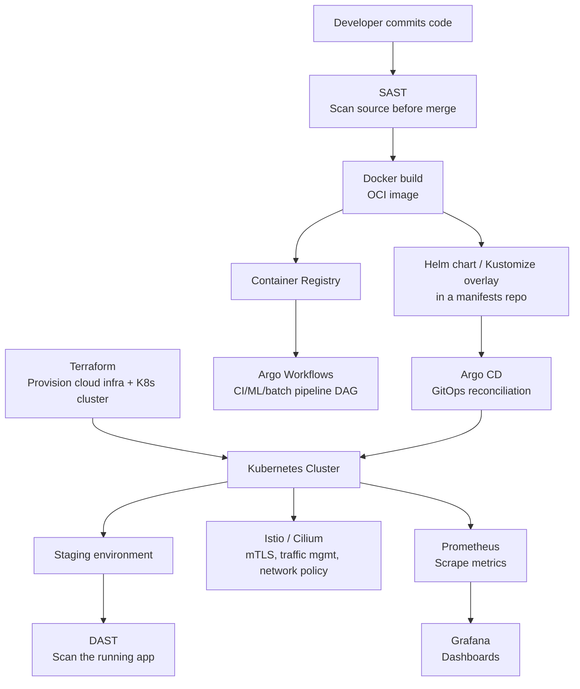

<a id="top"></a>

# DevOps & Cloud-Native Tools — Reference Guide

A cross-cutting reference for the tools spanning IaC, containers, GitOps,
security testing, service mesh, and observability. Several of these have
much deeper, hands-on treatments elsewhere in this repo — this doc gives
every tool a complete, interview-ready definition on its own, and links
out to the fuller deep dive where one already exists, rather than
duplicating it.

## Table of Contents

1. [Overview](#overview)
2. [Infrastructure as Code](#1-infrastructure-as-code)
3. [Containers & Orchestration](#2-containers--orchestration)
4. [Kubernetes Package & Config Management](#3-kubernetes-package--config-management)
5. [CI/CD](#4-cicd)
6. [GitOps & Workflow Orchestration](#5-gitops--workflow-orchestration)
7. [Application Security Testing](#6-application-security-testing)
8. [Service Mesh & eBPF Networking](#7-service-mesh--ebpf-networking)
9. [Observability](#8-observability)
10. [How These Tools Fit Together](#how-these-tools-fit-together)
11. [Interview Questions](#interview-questions)
12. [Most Important Concepts to Know First](#most-important-concepts-to-know-first)
13. [Simple Interview Answer](#simple-interview-answer)

---

## Overview

No single tool covers provisioning, packaging, deploying, securing, and
observing a modern platform — each category below solves one layer of
that problem, and a real platform stack composes several of them
together (see [§9](#how-these-tools-fit-together)). Knowing not just what
each tool does, but which *other* tool it's most often confused with or
paired against, is what separates a surface-level answer from a strong
one in an interview.

**A note on definitions**: where a tool is an official **CNCF** or
**Continuous Delivery Foundation (CDF)** project — both **Linux
Foundation** initiatives — this doc quotes that project's own official
tagline verbatim and states its graduation status, rather than a
paraphrase. Just as importantly, several widely-used tools here (Docker,
Terraform, Grafana, GitHub Actions, GitLab CI/CD) are explicitly **not**
Linux Foundation projects — knowing which is which, and why, is itself a
real interview-level distinction, not a footnote.

[⬆ Back to top](#top)

---

## 1. Infrastructure as Code

| Tool/Concept | Definition & Explanation | Use Case | Preferred Over the Alternative When |
|---|---|---|---|
| **Infrastructure as Code (IaC)** | The practice of managing and provisioning infrastructure through machine-readable definition files instead of manual console/CLI steps — enabling version control, peer review (PRs on infra changes), repeatability across environments, and drift detection. Splits into **declarative** (describe the desired end state; the tool figures out how to get there — Terraform, CloudFormation) and **imperative** (describe the steps to take — most Ansible playbooks, raw shell scripting) approaches. | The baseline discipline underlying every environment-provisioning workflow in this repo. | Declarative over imperative whenever the goal is "make it match this state" rather than "run these exact steps" — declarative tools handle idempotency and convergence for you; imperative tools require you to reason about it yourself. |
| **Terraform** | HashiCorp's open-source (now Business Source License, not fully open-source), provider-agnostic declarative IaC tool — you declare desired infrastructure state in HCL, and Terraform computes and executes the create/update/destroy operations needed to reach it, tracking what it manages in a state file. `terraform plan` shows the diff before anything changes; `terraform apply` executes it. **Not a Linux Foundation project** — owned by HashiCorp (now part of IBM). | Provisioning cloud infrastructure (AWS/Azure/GCP/Kubernetes/SaaS providers) as versioned, reviewable code — the dominant multi-cloud IaC choice, used throughout this repo's Terraform module examples. | You need one tool/workflow across multiple cloud providers, or the org already has Terraform expertise/tooling — vs a cloud-native alternative (CloudFormation/Bicep) that only covers one cloud but needs no external state backend. |
| **OpenTofu** | A drop-in-compatible, fully open-source **fork of Terraform**, created after HashiCorp changed Terraform's license from MPL-2.0 to the Business Source License in 2023 — hosted by the **Linux Foundation** as a neutrally governed project (no single company controls its roadmap or trademark), on a path toward CNCF. | The vendor-neutral, license-free alternative when Terraform's BSL terms are a concern — pipeline/module syntax is unchanged, so migration is close to a drop-in binary swap. | You specifically need a Linux Foundation–governed, unambiguously open-source IaC tool instead of a vendor-controlled one — otherwise functionally equivalent to Terraform for most day-to-day use. |

[⬆ Back to top](#top)

---

## 2. Containers & Orchestration

Full hands-on depth (Dockerfiles, multi-stage builds, Kubernetes
architecture, workload objects, networking, storage, security) lives in
[Container & Kubernetes Study Notes](../Container/container.md) and
[Kubernetes Study Notes — Administration & CKA Deep Dive](../Kubernetes/kubernetes.md).
This table is the quick-reference layer.

| Tool/Concept | Definition & Explanation | Use Case | Preferred Over the Alternative When |
|---|---|---|---|
| **Container** | An OS-level virtualization unit that packages an application with its dependencies into an isolated, portable process sharing the host machine's kernel — distinct from a VM, which virtualizes hardware and runs a full separate guest OS per instance. See [container.md §1](../Container/container.md#1-introduction-to-containers) for the Linux primitives (namespaces, cgroups) underneath. | Portable, consistent application packaging and deployment across dev/staging/prod without "works on my machine" drift. | You need fast startup and high density (many isolated processes per host) rather than full OS-level isolation — vs a VM, which is heavier but isolates at the hardware-virtualization level, not just the kernel. |
| **Docker** | The dominant container tooling and image-building workflow — builds OCI-compliant images from a `Dockerfile`, runs containers, and (historically) provided the container runtime itself. **Docker itself is not a Linux Foundation/CNCF project** (owned by Docker, Inc.) — but **containerd**, the container runtime Docker donated to the CNCF in 2017 (graduated 2019), *is*, and is what Kubernetes actually runs containers through today (via any CRI-compliant runtime — containerd, CRI-O — not Docker Engine directly). See [container.md §3-5](../Container/container.md#3-docker-fundamentals). | Building and locally running container images before they're deployed to Kubernetes/ECS/any orchestrator. | The near-universal default for building images — the real decision point is usually the *runtime* in production (containerd/CRI-O), not whether to use Docker for image builds. |
| **Kubernetes** | Official CNCF description: **"Kubernetes is an open-source system for automating deployment, scaling, and management of containerized applications."** CNCF's founding project (donated by Google in 2014) — the industry-standard way to run containers in production at scale. See [container.md §6-11](../Container/container.md#6-kubernetes-architecture) and the full [Kubernetes CKA deep dive](../Kubernetes/kubernetes.md) for architecture, workload objects, RBAC, and troubleshooting. | Running containerized workloads reliably at scale with declarative desired-state management instead of hand-managing individual containers/hosts. | You need multi-host orchestration, self-healing, and declarative scaling — for a single host or a handful of containers, Docker Compose is simpler and doesn't need a cluster. |

[⬆ Back to top](#top)

---

## 3. Kubernetes Package & Config Management

| Tool | Definition & Explanation | Use Case | Preferred Over the Alternative When |
|---|---|---|---|
| **Helm** | Official CNCF tagline: **"The Kubernetes Package Manager."** CNCF graduated project (graduated May 2020) — templated YAML manifests (Go templates) bundled into versioned, distributable "charts," parameterized via `values.yaml`; tracks installed **releases** natively (`helm history`/`rollback`) and has a real packaging ecosystem (Artifact Hub) for installing third-party software. | Installing/packaging reusable, distributable software — third-party charts (Prometheus, cert-manager) or packaging your own app for others to consume. | You need a real chart ecosystem, release/rollback tracking, or are consuming third-party software already distributed as a chart. |
| **Kustomize** | A **template-free** Kubernetes configuration customization tool built into `kubectl` (`kubectl apply -k`) — patches plain YAML you already own via a `base/` plus environment-specific `overlays/`, using strategic-merge or JSON patches and generators (`configMapGenerator`, `secretGenerator`), with no templating language at all. Not a separately CNCF-listed project — maintained as a Kubernetes SIG-CLI subproject, under the CNCF-graduated Kubernetes project's own governance. | Managing environment-specific variants of manifests you already own, without needing to package or distribute them. | You want to avoid a templating language entirely and prefer plain, diffable YAML with structured overlays. |

### Helm Chart vs. Kustomize — Full Comparison

| Aspect | Helm | Kustomize |
|---|---|---|
| **What it is** | Package manager — versioned, distributable charts | Configuration customization tool — patches over plain YAML |
| **Templating** | Go templates embedded directly in YAML (`{{ .Values.replicas }}`) | None — structured overlays/patches only, no template syntax |
| **Distribution/packaging** | Real chart ecosystem (Artifact Hub) — install third-party software as a chart, or package your own for others | No packaging concept — just your own `base/` + `overlays/` directories, nothing to "install" from a registry |
| **Release tracking** | Native — `helm history`, `helm rollback <release> <revision>` | None built-in — relies on your CI/CD or GitOps tool (Argo CD/Flux) for versioning and rollback |
| **Environment variation** | A `values.yaml` per environment, fed into the templates | An `overlays/dev`, `overlays/prod`, etc., each patching a shared `base/` |
| **Tooling** | Separate `helm` CLI | Built into `kubectl` (`kubectl apply -k`), plus a standalone `kustomize` CLI for more features |
| **Debuggability** | `helm template`/`--dry-run --debug` to render locally — but templating logic can still obscure what's actually produced | `kustomize build` output is generally easier to reason about since there's no templating language hiding the transformation |
| **Common criticism** | Go templates embedded in YAML are "stringly typed" — whitespace-sensitive, easy to produce invalid YAML from valid-looking template logic | No native templating makes conditional/loop logic awkward — leans on generators and patches instead |
| **Typical use** | Installing/packaging reusable, distributable software | Managing environment-specific variants of manifests you already own |

**Example directory layouts**, showing the structural difference directly:

```text
# Helm chart layout — one chart, values.yaml per environment
mychart/
├── Chart.yaml
├── values.yaml            # defaults
├── values-dev.yaml        # dev overrides
├── values-prod.yaml       # prod overrides
└── templates/
    ├── deployment.yaml     # {{ .Values.replicas }}, {{ .Values.image }}, etc.
    ├── service.yaml
    └── configmap.yaml

# Kustomize layout — one base, plain-YAML overlays per environment
base/
├── kustomization.yaml
├── deployment.yaml          # plain YAML, no template syntax at all
├── service.yaml
└── configmap.yaml
overlays/
├── dev/
│   ├── kustomization.yaml   # references ../../base, patches replica count down
│   └── patch-replicas.yaml
└── prod/
    ├── kustomization.yaml   # references ../../base, patches replica count up
    └── patch-replicas.yaml
```

```bash
# Kustomize commands, for comparison against the Helm commands below
kustomize build overlays/prod/ | less     # render locally — see the final YAML before applying
kubectl apply -k overlays/prod/           # apply directly via kubectl, no separate binary needed
kubectl diff -k overlays/prod/            # preview the diff against the live cluster
```

```bash
helm create mychart                           # scaffold a new chart
helm template mychart/ -f values-prod.yaml | less   # render locally — the Helm equivalent of `kustomize build`
helm install web mychart/ -f values-prod.yaml
helm upgrade web mychart/ -f values-prod.yaml
helm rollback web 2                            # to a specific revision — Kustomize has no equivalent of this
```

**The core distinction in one sentence**: Helm *templates* YAML from variables to produce many possible outputs from one chart, and tracks what it installed as a versioned release; Kustomize *patches* YAML you already wrote, layering environment-specific overrides on a shared base, with no templating and no built-in release history at all.

They're commonly combined rather than chosen exclusively: `helm template mychart/ | kustomize build -` renders a chart to plain manifests, then applies environment-specific Kustomize patches on top — Helm's packaging strength plus Kustomize's patch-based environment management in one pipeline.

See [kubernetes.md §20](../Kubernetes/kubernetes.md#20-helm-deep-dive) for the full Helm CLI cheat sheet (lint, dry-run, upgrade, rollback workflow).

[⬆ Back to top](#top)

---

## 4. CI/CD

Canonical definitions from the **Continuous Delivery Foundation (CDF)** —
a Linux Foundation project, and the standard-setting body for this
terminology:

- **Continuous Integration (CI)**: "A software development practice
  where members of a team integrate their work frequently... Each
  integration is verified by an automated build (including test) to
  detect integration errors as quickly as possible."
- **Continuous Delivery**: "The ability to get changes of all
  types — including new features, configuration changes, bug fixes and
  experiments — into production, or into the hands of users, safely and
  quickly in a sustainable way."
- **Continuous Deployment**: "A strategy for software releases wherein
  any code commit that passes the automated testing phase is
  automatically released into the production environment, making
  changes that are visible to the software's users."

The practical distinction between the last two: **Continuous Delivery**
means every change is automatically built, tested, and packaged into a
release-ready artifact, with a human still approving the actual
production release; **Continuous Deployment** removes that human gate
entirely — every change that passes the pipeline ships to production
automatically.

| Tool | Definition & Explanation | Use Case | Preferred Over the Alternative When |
|---|---|---|---|
| **Jenkins** | A long-standing, self-hosted, open-source automation server — pipelines defined as code (`Jenkinsfile`, Groovy-based) or configured through its UI; runs on infrastructure you provision and manage yourself, with a vast plugin ecosystem covering nearly any integration. **Is a Linux Foundation project** — Jenkins joined the Continuous Delivery Foundation (the same body whose CI/CD definitions opened this section) in 2019, giving it neutral, vendor-independent governance rather than being owned by a single company. | Highly customized, self-hosted CI/CD, especially in environments with legacy integration requirements a SaaS CI tool doesn't support out of the box. | You need infrastructure-level control over the build environment, on-prem/air-gapped execution, or a plugin covering a niche integration — at the cost of operating and patching Jenkins itself. |
| **GitHub Actions** | GitHub-native CI/CD — YAML workflows triggered by repo events (push, PR, schedule, manual dispatch), running on GitHub-hosted runners (or self-hosted ones) with a large marketplace of reusable Actions. **Not a Linux Foundation project** — proprietary to GitHub (Microsoft). | The default choice for any project already hosted on GitHub, needing no separate CI system to stand up or maintain. | The repo already lives on GitHub and you want CI/CD with zero separate infrastructure to run — vs Jenkins, no server to patch/scale yourself for the common case. |
| **GitLab CI/CD** | GitLab-native CI/CD — pipelines defined in `.gitlab-ci.yml`, tightly integrated with GitLab's own repo, container registry, and environments/deployment-tracking features in one platform. **Not a Linux Foundation project** — GitLab is open-core but company-owned (GitLab Inc.), not foundation-governed. | Projects hosted on GitLab wanting CI/CD integrated with the same platform as source control, issues, and the container registry, without third-party glue. | The org is standardized on GitLab specifically and wants one integrated platform (repo + CI + registry + deployment tracking) rather than stitching separate tools together. |

**Where CI/CD ends and GitOps begins**: a traditional CI/CD pipeline
often pushes the final deployment step itself (`kubectl apply` from the
pipeline runner, holding cluster credentials). **GitOps** (next section)
changes only that last step — the pipeline still builds, tests, and
packages the artifact exactly as above, but instead of pushing to the
cluster directly, it only ever writes the new image tag/manifest to Git;
an in-cluster controller (Argo CD/Flux) is what actually applies it. CI
is the same regardless of which deployment model follows it.

[⬆ Back to top](#top)

---

## 5. GitOps & Workflow Orchestration

Argo CD's GitOps principle and comparison against Flux is covered in
[container.md §14](../Container/container.md#14-gitops-and-cicd-for-containers).
**Argo Workflows** is a distinct project in the same "Argo" family, not
covered elsewhere in this repo yet.

| Tool | Definition & Explanation | Use Case | Preferred Over the Alternative When |
|---|---|---|---|
| **Argo CD** | Official CNCF tagline for the Argo project family: **"Kubernetes-native tools to run workflows, manage clusters, and do GitOps right."** CNCF graduated project (graduated December 2022). Argo CD specifically: a Kubernetes-native **GitOps continuous delivery** controller — watches a git repo holding the desired manifests and continuously reconciles the live cluster to match it (pull-based, not a pipeline pushing changes with cluster credentials); web UI showing sync status/drift per application, and an app-of-apps pattern for managing many apps together. | Continuously deploying and reconciling application manifests from Git to a cluster, with drift detection and self-healing if someone manually edits a resource. | You want a visual UI for sync status/history and a mature app-of-apps pattern — vs Flux, which is more composable/CLI-first with no bundled UI. |
| **Argo Workflows** | The same CNCF-graduated Argo project family as Argo CD — a Kubernetes-native **workflow engine** for orchestrating multi-step jobs as a DAG (Directed Acyclic Graph) of containers — each step runs as its own Pod, with dependencies, retries, parallelism, and conditional branching defined declaratively as a `Workflow` custom resource. Distinct from Argo CD: Argo CD deploys/reconciles *applications*; Argo Workflows *runs* multi-step *jobs* (think: a CI pipeline, an ML training pipeline, or a batch ETL job, not a long-running service). | CI pipelines, ML/data pipelines (train → evaluate → deploy steps), and complex batch/ETL jobs that need to run as a sequence or DAG of containerized steps natively on Kubernetes. | The job is a multi-step, potentially parallel/branching *pipeline* that should run natively on Kubernetes infrastructure — vs Argo CD, which is the wrong tool entirely for this (it deploys apps, it doesn't run job DAGs), and vs a general CI system (Jenkins/GitHub Actions) when the pipeline specifically needs Kubernetes-native scheduling/resource control per step. |

**Interview point**: don't confuse Argo CD and Argo Workflows just because they share the "Argo" name and both live in the same CNCF-graduated project family (alongside Argo Rollouts for progressive delivery and Argo Events for event-driven triggering) — they solve genuinely different problems.

[⬆ Back to top](#top)

---

## 6. Application Security Testing

Full depth (pipeline placement, example tools, remediation workflow)
lives in [DevSecOps.md §5 (SAST)](../DevSecOps/DevSecOps.md#5-static-application-security-testing-sast)
and [DevSecOps.md §10 (DAST)](../DevSecOps/DevSecOps.md#10-dynamic-application-security-testing-dast).

| Tool/Concept | Definition & Explanation | Use Case | Preferred Over the Alternative When |
|---|---|---|---|
| **SAST** (Static Application Security Testing) | Analyzes source code or binaries **without executing them**, scanning for known-vulnerable patterns (SQL injection–prone queries, hardcoded secrets, insecure crypto usage) — runs early in the SDLC (commit/PR time), the "shift-left" half of security testing. Tools: Semgrep, SonarQube, Checkmarx — note: neither SAST/DAST as terminology nor these specific tools are Linux Foundation projects; the standards body most relevant here is **OWASP** (Open Worldwide Application Security Project), a separate nonprofit, not the Linux Foundation. | Catching a vulnerable code pattern before it ever merges, as a fast, automated PR check. | You want feedback at the earliest possible point (before the code even runs) — but SAST can't catch runtime-only issues (misconfiguration, auth flow bugs) that only manifest in a running application. |
| **DAST** (Dynamic Application Security Testing) | Tests a **running** application from the outside (black-box) — simulating real attacks (injection attempts, auth bypass probes) against a live/staging instance to find runtime vulnerabilities SAST structurally can't see. Tools: **OWASP ZAP** (itself an OWASP flagship project), Burp Suite. | Finding runtime-only issues — broken auth flows, misconfigurations, business-logic flaws — that only exist once the app is actually deployed and running. | The vulnerability class only exists in the running system's behavior, not in the source code itself — SAST and DAST are complementary, not competing, and a mature pipeline runs both at different stages. |

[⬆ Back to top](#top)

---

## 7. Service Mesh & eBPF Networking

### What a Service Mesh Actually Is

A **service mesh** is a dedicated infrastructure layer that transparently
handles service-to-service traffic — mutual TLS encryption, traffic
shaping (canary/blue-green routing, retries, timeouts, circuit
breaking), and rich telemetry — **without any application code changes**.
The classic implementation injects a sidecar proxy (typically Envoy)
alongside every Pod, so every byte of in/out traffic passes through that
proxy rather than going straight app-to-app; the proxies are what
actually enforce mTLS and routing rules, coordinated by a central
control plane.

**Why one at all, instead of handling this in application code**: mTLS,
retries, circuit breaking, and traffic-shifting logic would otherwise
need to be built into every service, in every language, consistently —
a mesh centralizes that as infrastructure so no team re-implements it,
and a policy change (e.g., a new mTLS requirement) rolls out platform-wide
without touching a single application.

| Tool | Definition & Explanation | Use Case | Preferred Over the Alternative When |
|---|---|---|---|
| **Istio** | Official CNCF tagline: **"Simplify observability, traffic management, security, and policy with the Istio service mesh."** CNCF-incubating project (joined 2022, graduated July 2023) — a full-featured, traditionally sidecar-based service mesh, injecting an Envoy proxy alongside every Pod for mTLS, fine-grained traffic management (`VirtualService`/`DestinationRule` for canary/blue-green routing, fault injection, retries, circuit breaking), and rich telemetry. Newer "ambient mesh" mode removes the per-Pod sidecar in exchange for a shared per-node proxy layer. | Advanced traffic management (canary rollouts, fault injection, fine-grained routing rules) where the added operational complexity is worth it. | You need Istio's depth of traffic-management/telemetry features specifically and can absorb its operational overhead — the richest feature set of the three, at the highest complexity cost. |
| **Linkerd** | Official CNCF tagline: **"Ultra light, ultra simple, ultra powerful. Linkerd adds security, observability, and reliability to Kubernetes, without the complexity."** CNCF graduated project (graduated July 2021) — a lightweight, simpler service mesh focused on mTLS and reliability (automatic retries, timeouts) rather than Istio's full traffic-management surface; a much smaller, Rust-based "micro-proxy" per sidecar means meaningfully lower resource overhead and a smaller operational learning curve. | mTLS and basic reliability features with minimal operational burden, where Istio's full routing/fault-injection feature set isn't actually needed. | You want the core service-mesh value (mTLS + retries/timeouts) without Istio's configuration surface and resource cost — trades some advanced routing flexibility for simplicity. |
| **Cilium** | Official CNCF tagline: **"eBPF-based Networking, Security, and Observability."** CNCF graduated project (graduated October 2023) — a CNI (Container Network Interface) plugin built on **eBPF**, programming the Linux kernel directly for networking, NetworkPolicy enforcement, load balancing, and observability (via its **Hubble** component), avoiding the packet-processing overhead of traditional iptables-based CNIs. Its service-mesh mode adds L7 traffic control **without a sidecar proxy per Pod at all**, positioning it as a fundamentally different architecture from Istio/Linkerd, not just a lighter version of the same one. | The cluster's core CNI (Pod networking + NetworkPolicy enforcement) at high scale/performance, or as a sidecar-free alternative to a traditional mesh for teams that don't need Istio's full L7 feature set. | You need CNI-level performance at scale (eBPF avoids iptables' linear rule-matching overhead), deep network observability via Hubble, or service-mesh-adjacent capabilities without paying any sidecar's resource/complexity tax. |

**Sidecar vs. sidecar-free, the actual architectural split**:

```text
Istio / Linkerd (sidecar model)
  Pod
  ├── app container
  └── sidecar proxy container (Envoy / linkerd2-proxy)
        ↑ every packet in/out of the Pod passes through this proxy
        — one extra container, and extra CPU/memory, per Pod

Cilium (eBPF, sidecar-free)
  Pod
  └── app container only — no sidecar
        ↑ traffic is intercepted at the kernel level via eBPF programs
          attached to the node, shared across every Pod on that node
        — no per-Pod proxy container or its resource cost
```

**Interview point**: Istio/Cilium (and Linkerd/Cilium) aren't strictly
either/or — Cilium very commonly serves purely as the cluster's CNI
underneath a mesh that *also* runs Istio or Linkerd for L7 traffic
management, or it can replace much of what a sidecar mesh does on its
own via eBPF, depending on how much L7 control is actually needed. The
three-way decision in practice: Istio for maximum traffic-management
depth, Linkerd for mTLS/reliability with minimal overhead, Cilium when
CNI-level performance and sidecar-free architecture matter more than
Istio's routing feature depth.

See [container.md §15](../Container/container.md#15-service-mesh) for
the condensed Istio/Linkerd table alongside the rest of the container
networking material.

[⬆ Back to top](#top)

---

## 8. Observability

Condensed layer breakdown already in
[container.md §16](../Container/container.md#16-observability-for-containers) —
full definitions here.

| Tool | Definition & Explanation | Use Case | Preferred Over the Alternative When |
|---|---|---|---|
| **Prometheus** | Official CNCF tagline: **"The Prometheus monitoring system and time series database."** CNCF's second graduated project after Kubernetes (graduated August 2018) — an open-source, **pull-based** metrics collection and time-series database, scraping `/metrics` endpoints on a schedule, storing the resulting time-series data, and queried via PromQL; pairs with Alertmanager for alert routing. The de facto standard metrics backend in the Kubernetes ecosystem. | Collecting and storing infrastructure/application metrics (CPU, request rate, error rate, custom application metrics) for querying and alerting. | You want a portable, vendor-neutral, Kubernetes-native metrics stack — the standard choice absent a specific reason to use a commercial APM platform instead. |
| **Grafana** | A visualization and dashboarding tool that queries one or more data sources (Prometheus for metrics, Loki for logs, and many others — Elasticsearch, CloudWatch, PostgreSQL) to build unified dashboards in one pane, rather than storing data itself. **Not a Linux Foundation/CNCF project** — independently developed and commercially backed by Grafana Labs, worth knowing as a deliberate contrast to Prometheus's CNCF governance in the same "stack." | The dashboard layer sitting on top of Prometheus (and often Loki) — the standard pairing referred to as the "Prometheus + Grafana stack." | You want one dashboarding UI across multiple backends instead of each data source's own separate UI. |

[⬆ Back to top](#top)

---

## How These Tools Fit Together



Reading it left to right: **Terraform** provisions the cluster itself;
**SAST** gates code before it's even built into an image; **Docker**
builds the image; **Argo Workflows** can orchestrate the multi-step
build/test/train pipeline around that; **Helm/Kustomize** define what
gets deployed, and **Argo CD** is what actually reconciles the cluster to
match it; **DAST** tests the result once it's actually running;
**Istio/Cilium** govern how traffic moves and is secured inside the
cluster; **Prometheus/Grafana** observe all of it.

[⬆ Back to top](#top)

---

## Interview Questions

**1. What's the difference between Argo CD and Argo Workflows?**
Argo CD is a GitOps *continuous delivery* controller — it reconciles a cluster's live state to match manifests in Git, for deploying and managing long-running applications. Argo Workflows is a *workflow engine* — it runs a DAG of containerized steps to completion, for CI pipelines, ML pipelines, or batch jobs. They share the "Argo" name and CNCF project family but solve unrelated problems; using one instead of the other for the wrong job doesn't work at all, not just suboptimally.

**2. When would you choose Cilium over (or alongside) Istio?**
Cilium as the CNI gives eBPF-based network policy enforcement and Hubble observability at every cluster's networking layer regardless of mesh choice. If the traffic-management needs are limited to L3/L4 policy and basic L7 visibility, Cilium alone (without a sidecar mesh) can cover it more cheaply than deploying Istio. If deep L7 traffic management (canary routing, fault injection) is actually needed, Istio still adds real value on top — the two aren't mutually exclusive, since Cilium can serve as the CNI underneath an Istio-meshed cluster.

**3. Why run both SAST and DAST instead of just one?**
They catch different vulnerability classes at different points: SAST catches known-bad code patterns before the app ever runs, but can't see runtime-only issues (broken auth flows, environment misconfiguration); DAST catches exactly those runtime issues by attacking a live instance, but can't see a vulnerability buried in code paths that test traffic never exercises. A mature pipeline runs both, not one instead of the other.

**4. How does Helm relate to Argo CD — do you need both?**
They're complementary, not competing: Helm defines *what* a chart's rendered manifests look like (templating/packaging); Argo CD is *how* those manifests actually get applied to and kept in sync with a live cluster (GitOps reconciliation). A very common real-world pattern is an Argo CD Application pointing at a Helm chart (or a Kustomize overlay) as its source.

**5. Which of these tools are actually Linux Foundation/CNCF projects, and why does that distinction matter?**
Kubernetes, Helm, Argo (CD and Workflows), Prometheus, Istio, Linkerd, and Cilium are all CNCF projects (a Linux Foundation initiative); Jenkins is hosted by the Continuous Delivery Foundation, also Linux Foundation; OpenTofu is a direct Linux Foundation project. Docker, Terraform, Grafana, GitHub Actions, and GitLab CI/CD are **not** — each is owned or commercially backed by a single company. The distinction matters operationally, not just trivia: a Linux Foundation/CNCF project has neutral, vendor-independent governance (no single company can unilaterally change its license or roadmap), which is exactly the concern that drove OpenTofu's creation after Terraform's licensing change — knowing which category a given tool falls into is directly relevant to vendor-lock-in and governance-risk conversations, not just a naming exercise.

[⬆ Back to top](#top)

---

## Most Important Concepts to Know First

1. IaC (declarative vs. imperative) and Terraform's plan/apply workflow
2. Container vs. VM (kernel-sharing vs. hardware virtualization)
3. Kubernetes reconciliation-loop model
4. Helm vs. Kustomize (templating vs. template-free overlays)
5. GitOps principle (pull-based reconciliation, no cluster credentials in CI)
6. Argo CD vs. Argo Workflows (deploy apps vs. run job DAGs)
7. SAST vs. DAST (static/pre-runtime vs. dynamic/runtime testing)
8. Service mesh sidecar model (Istio) vs. eBPF/sidecar-free (Cilium)
9. Prometheus (pull-based metrics) vs. Grafana (visualization layer, not storage)

[⬆ Back to top](#top)

---

## Simple Interview Answer

A modern cloud-native platform is built from tools at distinct layers, not one all-in-one product. **Infrastructure as Code** (Terraform) provisions the underlying infrastructure and the Kubernetes cluster itself. **Containers** (Docker) package applications; **Kubernetes** orchestrates them at scale. **Helm and Kustomize** define what gets deployed — templated packages versus plain-YAML overlays. **GitOps** (Argo CD) is how those definitions actually reach the cluster, continuously reconciled from Git rather than pushed by a pipeline; **Argo Workflows** handles the separate problem of running multi-step job pipelines natively on Kubernetes. **SAST and DAST** secure the software at two different points — before it runs, and while it's running. **Service mesh/eBPF networking** (Istio, Cilium) governs how traffic moves and is secured inside the cluster. And **Prometheus/Grafana** observe all of it.

Picking between tools in the same layer almost always comes down to the same trade-off seen throughout this repo: operational simplicity versus feature depth — Kustomize over Helm for simplicity, Linkerd over Istio for simplicity, Flux over Argo CD for a leaner CLI-first tool — pick the simpler tool by default, and only reach for the more feature-rich one when a specific requirement actually needs it.

[⬆ Back to top](#top)
