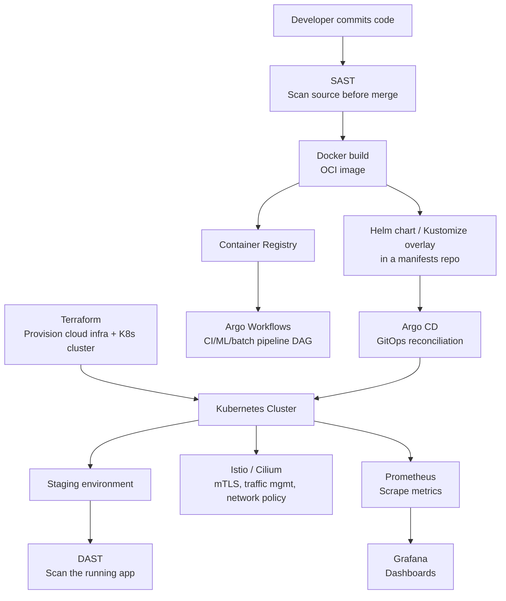

# DevOps & Cloud-Native Tools — Reference Guide

A cross-cutting reference for the tools spanning IaC, containers, GitOps,
security testing, service mesh, and observability. Several of these have
much deeper, hands-on treatments elsewhere in this repo — this doc gives
every tool a complete, interview-ready definition on its own, and links
out to the fuller deep dive where one already exists, rather than
duplicating it.

## Table of Contents

1. [Overview](#overview)
2. [Infrastructure as Code](#1-infrastructure-as-code)
3. [Containers & Orchestration](#2-containers--orchestration)
4. [Kubernetes Package & Config Management](#3-kubernetes-package--config-management)
5. [GitOps & Workflow Orchestration](#4-gitops--workflow-orchestration)
6. [Application Security Testing](#5-application-security-testing)
7. [Service Mesh & eBPF Networking](#6-service-mesh--ebpf-networking)
8. [Observability](#7-observability)
9. [How These Tools Fit Together](#how-these-tools-fit-together)
10. [Interview Questions](#interview-questions)
11. [Most Important Concepts to Know First](#most-important-concepts-to-know-first)
12. [Simple Interview Answer](#simple-interview-answer)

---

## Overview

No single tool covers provisioning, packaging, deploying, securing, and
observing a modern platform — each category below solves one layer of
that problem, and a real platform stack composes several of them
together (see [§9](#how-these-tools-fit-together)). Knowing not just what
each tool does, but which *other* tool it's most often confused with or
paired against, is what separates a surface-level answer from a strong
one in an interview.

[⬆ Back to top](#top)

---

## 1. Infrastructure as Code

| Tool/Concept | Definition & Explanation | Use Case | Preferred Over the Alternative When |
|---|---|---|
| **Infrastructure as Code (IaC)** | The practice of managing and provisioning infrastructure through machine-readable definition files instead of manual console/CLI steps — enabling version control, peer review (PRs on infra changes), repeatability across environments, and drift detection. Splits into **declarative** (describe the desired end state; the tool figures out how to get there — Terraform, CloudFormation) and **imperative** (describe the steps to take — most Ansible playbooks, raw shell scripting) approaches. | The baseline discipline underlying every environment-provisioning workflow in this repo. | Declarative over imperative whenever the goal is "make it match this state" rather than "run these exact steps" — declarative tools handle idempotency and convergence for you; imperative tools require you to reason about it yourself. |
| **Terraform** | HashiCorp's open-source, provider-agnostic declarative IaC tool — you declare desired infrastructure state in HCL, and Terraform computes and executes the create/update/destroy operations needed to reach it, tracking what it manages in a state file. `terraform plan` shows the diff before anything changes; `terraform apply` executes it. | Provisioning cloud infrastructure (AWS/Azure/GCP/Kubernetes/SaaS providers) as versioned, reviewable code — the dominant multi-cloud IaC choice, used throughout this repo's Terraform module examples. | You need one tool/workflow across multiple cloud providers, or the org already has Terraform expertise/tooling — vs a cloud-native alternative (CloudFormation/Bicep) that only covers one cloud but needs no external state backend. |

[⬆ Back to top](#top)

---

## 2. Containers & Orchestration

Full hands-on depth (Dockerfiles, multi-stage builds, Kubernetes
architecture, workload objects, networking, storage, security) lives in
[Container & Kubernetes Study Notes](../Container/container.md) and
[Kubernetes Study Notes — Administration & CKA Deep Dive](../Kubernetes/kubernetes.md).
This table is the quick-reference layer.

| Tool/Concept | Definition & Explanation | Use Case | Preferred Over the Alternative When |
|---|---|---|
| **Container** | An OS-level virtualization unit that packages an application with its dependencies into an isolated, portable process sharing the host machine's kernel — distinct from a VM, which virtualizes hardware and runs a full separate guest OS per instance. See [container.md §1](../Container/container.md#1-introduction-to-containers) for the Linux primitives (namespaces, cgroups) underneath. | Portable, consistent application packaging and deployment across dev/staging/prod without "works on my machine" drift. | You need fast startup and high density (many isolated processes per host) rather than full OS-level isolation — vs a VM, which is heavier but isolates at the hardware-virtualization level, not just the kernel. |
| **Docker** | The dominant container tooling and image-building workflow — builds OCI-compliant images from a `Dockerfile`, runs containers, and (historically) provided the container runtime itself, though Kubernetes now runs containers through any CRI-compliant runtime (containerd, CRI-O) rather than Docker Engine directly. See [container.md §3-5](../Container/container.md#3-docker-fundamentals). | Building and locally running container images before they're deployed to Kubernetes/ECS/any orchestrator. | The near-universal default for building images — the real decision point is usually the *runtime* in production (containerd/CRI-O), not whether to use Docker for image builds. |
| **Kubernetes** | An open-source container orchestration platform automating deployment, scaling, self-healing, and networking of containerized workloads across a cluster — the industry-standard way to run containers in production at scale. See [container.md §6-11](../Container/container.md#6-kubernetes-architecture) and the full [Kubernetes CKA deep dive](../Kubernetes/kubernetes.md) for architecture, workload objects, RBAC, and troubleshooting. | Running containerized workloads reliably at scale with declarative desired-state management instead of hand-managing individual containers/hosts. | You need multi-host orchestration, self-healing, and declarative scaling — for a single host or a handful of containers, Docker Compose is simpler and doesn't need a cluster. |

[⬆ Back to top](#top)

---

## 3. Kubernetes Package & Config Management

Full comparison table (templating, packaging/distribution, release
tracking, typical use cases) already lives in
[kubernetes.md §20](../Kubernetes/kubernetes.md#20-helm-deep-dive) — this
is the condensed version.

| Tool | Definition & Explanation | Use Case | Preferred Over the Alternative When |
|---|---|---|
| **Helm** | A package manager for Kubernetes — templated YAML manifests (Go templates) bundled into versioned, distributable "charts," parameterized via `values.yaml`; tracks installed **releases** natively (`helm history`/`rollback`) and has a real packaging ecosystem (Artifact Hub) for installing third-party software. | Installing/packaging reusable, distributable software — third-party charts (Prometheus, cert-manager) or packaging your own app for others to consume. | You need a real chart ecosystem, release/rollback tracking, or are consuming third-party software already distributed as a chart. |
| **Kustomize** | A template-free Kubernetes configuration customization tool built into `kubectl` (`kubectl apply -k`) — patches plain YAML you already own via a `base/` plus environment-specific `overlays/`, with no templating language at all. | Managing environment-specific variants of manifests you already own, without needing to package or distribute them. | You want to avoid a templating language entirely and prefer plain, diffable YAML with structured overlays — often combined with Helm (`helm template \| kustomize build`) rather than a strict either/or. |

[⬆ Back to top](#top)

---

## 4. GitOps & Workflow Orchestration

Argo CD's GitOps principle and comparison against Flux is covered in
[container.md §14](../Container/container.md#14-gitops-and-cicd-for-containers).
**Argo Workflows** is a distinct project in the same "Argo" family, not
covered elsewhere in this repo yet.

| Tool | Definition & Explanation | Use Case | Preferred Over the Alternative When |
|---|---|---|
| **Argo CD** | A Kubernetes-native **GitOps continuous delivery** controller — watches a git repo holding the desired manifests and continuously reconciles the live cluster to match it (pull-based, not a pipeline pushing changes with cluster credentials); web UI showing sync status/drift per application, and an app-of-apps pattern for managing many apps together. | Continuously deploying and reconciling application manifests from Git to a cluster, with drift detection and self-healing if someone manually edits a resource. | You want a visual UI for sync status/history and a mature app-of-apps pattern — vs Flux, which is more composable/CLI-first with no bundled UI. |
| **Argo Workflows** | A Kubernetes-native **workflow engine** for orchestrating multi-step jobs as a DAG (Directed Acyclic Graph) of containers — each step runs as its own Pod, with dependencies, retries, parallelism, and conditional branching defined declaratively as a `Workflow` custom resource. Distinct from Argo CD: Argo CD deploys/reconciles *applications*; Argo Workflows *runs* multi-step *jobs* (think: a CI pipeline, an ML training pipeline, or a batch ETL job, not a long-running service). | CI pipelines, ML/data pipelines (train → evaluate → deploy steps), and complex batch/ETL jobs that need to run as a sequence or DAG of containerized steps natively on Kubernetes. | The job is a multi-step, potentially parallel/branching *pipeline* that should run natively on Kubernetes infrastructure — vs Argo CD, which is the wrong tool entirely for this (it deploys apps, it doesn't run job DAGs), and vs a general CI system (Jenkins/GitHub Actions) when the pipeline specifically needs Kubernetes-native scheduling/resource control per step. |

**Interview point**: don't confuse Argo CD and Argo Workflows just because they share the "Argo" name and both live in the same CNCF project family (alongside Argo Rollouts for progressive delivery and Argo Events for event-driven triggering) — they solve genuinely different problems.

[⬆ Back to top](#top)

---

## 5. Application Security Testing

Full depth (pipeline placement, example tools, remediation workflow)
lives in [DevSecOps.md §5 (SAST)](../DevSecOps/DevSecOps.md#5-static-application-security-testing-sast)
and [DevSecOps.md §10 (DAST)](../DevSecOps/DevSecOps.md#10-dynamic-application-security-testing-dast).

| Tool/Concept | Definition & Explanation | Use Case | Preferred Over the Alternative When |
|---|---|---|
| **SAST** (Static Application Security Testing) | Analyzes source code or binaries **without executing them**, scanning for known-vulnerable patterns (SQL injection–prone queries, hardcoded secrets, insecure crypto usage) — runs early in the SDLC (commit/PR time), the "shift-left" half of security testing. Tools: Semgrep, SonarQube, Checkmarx. | Catching a vulnerable code pattern before it ever merges, as a fast, automated PR check. | You want feedback at the earliest possible point (before the code even runs) — but SAST can't catch runtime-only issues (misconfiguration, auth flow bugs) that only manifest in a running application. |
| **DAST** (Dynamic Application Security Testing) | Tests a **running** application from the outside (black-box) — simulating real attacks (injection attempts, auth bypass probes) against a live/staging instance to find runtime vulnerabilities SAST structurally can't see. Tools: OWASP ZAP, Burp Suite. | Finding runtime-only issues — broken auth flows, misconfigurations, business-logic flaws — that only exist once the app is actually deployed and running. | The vulnerability class only exists in the running system's behavior, not in the source code itself — SAST and DAST are complementary, not competing, and a mature pipeline runs both at different stages. |

[⬆ Back to top](#top)

---

## 6. Service Mesh & eBPF Networking

Istio vs. Linkerd is covered in
[container.md §15](../Container/container.md#15-service-mesh). **Cilium**
is a newer entrant not yet covered elsewhere, and increasingly discussed
alongside (or instead of) a traditional sidecar-based mesh.

| Tool | Definition & Explanation | Use Case | Preferred Over the Alternative When |
|---|---|---|
| **Istio** | A full-featured service mesh — injects an Envoy sidecar proxy alongside every Pod to transparently provide mTLS, fine-grained traffic management (canary/blue-green routing, retries, circuit breaking via `VirtualService`/`DestinationRule`), and rich telemetry, without changing application code. Traditionally sidecar-based, though newer "ambient mesh" mode removes the per-Pod sidecar. | Advanced traffic management (canary rollouts, fault injection, fine-grained routing rules) where the added operational complexity is worth it. | You need Istio's depth of traffic-management/telemetry features specifically and can absorb its operational overhead — vs Linkerd's simpler, lighter-weight mTLS+reliability focus. |
| **Cilium** | A CNI (Container Network Interface) plugin built on **eBPF** (extended Berkeley Packet Filter) — programs the Linux kernel directly for networking, network policy enforcement, load balancing, and observability (via its **Hubble** component), without the packet-processing overhead of traditional iptables-based CNIs. Increasingly used for L3/L4 (and via its service-mesh mode, L7) traffic control **without** requiring a sidecar proxy per Pod, positioning it as a lighter-weight alternative to a full sidecar-based mesh for many use cases. | The cluster's core CNI (Pod networking + NetworkPolicy enforcement) at high scale/performance, or as a sidecar-free alternative to Istio for teams that don't need Istio's full traffic-management feature set. | You need CNI-level performance at scale (eBPF avoids iptables' linear rule-matching overhead), deep network observability via Hubble, or want service-mesh-adjacent capabilities without paying Istio's sidecar resource/complexity tax. |

**Interview point**: Istio and Cilium aren't strictly either/or — Cilium can serve purely as the CNI underneath a cluster that *also* runs Istio for L7 traffic management, or it can replace much of what a sidecar mesh does on its own via eBPF, depending on how much L7 control is actually needed.

[⬆ Back to top](#top)

---

## 7. Observability

Condensed layer breakdown already in
[container.md §16](../Container/container.md#16-observability-for-containers) —
full definitions here.

| Tool | Definition & Explanation | Use Case | Preferred Over the Alternative When |
|---|---|---|
| **Prometheus** | An open-source, **pull-based** metrics collection and time-series database — scrapes `/metrics` endpoints on a schedule, stores the resulting time-series data, and is queried via PromQL; pairs with Alertmanager for alert routing. The de facto standard metrics backend in the Kubernetes ecosystem. | Collecting and storing infrastructure/application metrics (CPU, request rate, error rate, custom application metrics) for querying and alerting. | You want a portable, vendor-neutral, Kubernetes-native metrics stack — the standard choice absent a specific reason to use a commercial APM platform instead. |
| **Grafana** | A visualization and dashboarding tool that queries one or more data sources (Prometheus for metrics, Loki for logs, and many others — Elasticsearch, CloudWatch, PostgreSQL) to build unified dashboards in one pane, rather than storing data itself. | The dashboard layer sitting on top of Prometheus (and often Loki) — the standard pairing referred to as the "Prometheus + Grafana stack." | You want one dashboarding UI across multiple backends instead of each data source's own separate UI. |

[⬆ Back to top](#top)

---

## How These Tools Fit Together

Reading it left to right: **Terraform** provisions the cluster itself;
**SAST** gates code before it's even built into an image; **Docker**
builds the image; **Argo Workflows** can orchestrate the multi-step
build/test/train pipeline around that; **Helm/Kustomize** define what
gets deployed, and **Argo CD** is what actually reconciles the cluster to
match it; **DAST** tests the result once it's actually running;
**Istio/Cilium** govern how traffic moves and is secured inside the
cluster; **Prometheus/Grafana** observe all of it.

[⬆ Back to top](#top)

---

## Interview Questions

**1. What's the difference between Argo CD and Argo Workflows?**
Argo CD is a GitOps *continuous delivery* controller — it reconciles a cluster's live state to match manifests in Git, for deploying and managing long-running applications. Argo Workflows is a *workflow engine* — it runs a DAG of containerized steps to completion, for CI pipelines, ML pipelines, or batch jobs. They share the "Argo" name and CNCF project family but solve unrelated problems; using one instead of the other for the wrong job doesn't work at all, not just suboptimally.

**2. When would you choose Cilium over (or alongside) Istio?**
Cilium as the CNI gives eBPF-based network policy enforcement and Hubble observability at every cluster's networking layer regardless of mesh choice. If the traffic-management needs are limited to L3/L4 policy and basic L7 visibility, Cilium alone (without a sidecar mesh) can cover it more cheaply than deploying Istio. If deep L7 traffic management (canary routing, fault injection) is actually needed, Istio still adds real value on top — the two aren't mutually exclusive, since Cilium can serve as the CNI underneath an Istio-meshed cluster.

**3. Why run both SAST and DAST instead of just one?**
They catch different vulnerability classes at different points: SAST catches known-bad code patterns before the app ever runs, but can't see runtime-only issues (broken auth flows, environment misconfiguration); DAST catches exactly those runtime issues by attacking a live instance, but can't see a vulnerability buried in code paths that test traffic never exercises. A mature pipeline runs both, not one instead of the other.

**4. How does Helm relate to Argo CD — do you need both?**
They're complementary, not competing: Helm defines *what* a chart's rendered manifests look like (templating/packaging); Argo CD is *how* those manifests actually get applied to and kept in sync with a live cluster (GitOps reconciliation). A very common real-world pattern is an Argo CD Application pointing at a Helm chart (or a Kustomize overlay) as its source.

[⬆ Back to top](#top)

---

## Most Important Concepts to Know First

1. IaC (declarative vs. imperative) and Terraform's plan/apply workflow
2. Container vs. VM (kernel-sharing vs. hardware virtualization)
3. Kubernetes reconciliation-loop model
4. Helm vs. Kustomize (templating vs. template-free overlays)
5. GitOps principle (pull-based reconciliation, no cluster credentials in CI)
6. Argo CD vs. Argo Workflows (deploy apps vs. run job DAGs)
7. SAST vs. DAST (static/pre-runtime vs. dynamic/runtime testing)
8. Service mesh sidecar model (Istio) vs. eBPF/sidecar-free (Cilium)
9. Prometheus (pull-based metrics) vs. Grafana (visualization layer, not storage)

[⬆ Back to top](#top)

---

## Simple Interview Answer

A modern cloud-native platform is built from tools at distinct layers, not one all-in-one product. **Infrastructure as Code** (Terraform) provisions the underlying infrastructure and the Kubernetes cluster itself. **Containers** (Docker) package applications; **Kubernetes** orchestrates them at scale. **Helm and Kustomize** define what gets deployed — templated packages versus plain-YAML overlays. **GitOps** (Argo CD) is how those definitions actually reach the cluster, continuously reconciled from Git rather than pushed by a pipeline; **Argo Workflows** handles the separate problem of running multi-step job pipelines natively on Kubernetes. **SAST and DAST** secure the software at two different points — before it runs, and while it's running. **Service mesh/eBPF networking** (Istio, Cilium) governs how traffic moves and is secured inside the cluster. And **Prometheus/Grafana** observe all of it.

Picking between tools in the same layer almost always comes down to the same trade-off seen throughout this repo: operational simplicity versus feature depth — Kustomize over Helm for simplicity, Linkerd over Istio for simplicity, Flux over Argo CD for a leaner CLI-first tool — pick the simpler tool by default, and only reach for the more feature-rich one when a specific requirement actually needs it.

[⬆ Back to top](#top)
