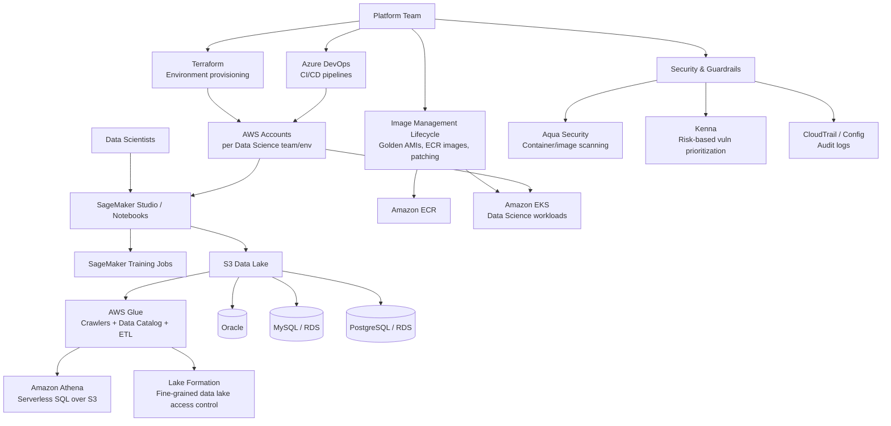

# Huntington Bank — Platform Engineer, Data Science Infrastructure

## Table of Contents

1. [Original Job Description](#original-job-description)
2. [Gap Analysis vs. Your Resume](#gap-analysis-vs-your-resume)
3. [Reference Architecture](#reference-architecture)
4. [AWS Data Lake & Analytics Services](#aws-data-lake--analytics-services)
5. [SageMaker & the Data Science Platform](#sagemaker--the-data-science-platform)
6. [Image Management Lifecycle](#image-management-lifecycle)
7. [Security Tooling for a Data Science Platform](#security-tooling-for-a-data-science-platform)
8. [Database Technologies: Athena vs. Oracle vs. MySQL vs. Postgres](#database-technologies-athena-vs-oracle-vs-mysql-vs-postgres)
9. [CI/CD with Azure DevOps for AWS Environments](#cicd-with-azure-devops-for-aws-environments)
10. [Tuning, Performance Scaling & Troubleshooting](#tuning-performance-scaling--troubleshooting)
11. [Interview Questions](#interview-questions)
12. [Most Important Concepts to Know First](#most-important-concepts-to-know-first)
13. [30-Second Pitch](#30-second-pitch)

---

## Original Job Description

**Summary**: We are seeking an experienced Platform Engineer who will be part of the Platform team managing the Data Science platform.

**Job Responsibilities**:
- Support ongoing Data Science Infrastructure operations.
- Develop and deploy AWS environments using CI/CD processes for a rapidly growing team of Data Scientists.
- Manage and support large-scale environments to meet the needs of current and future Data Science teams.
- Champion and mature the environment by implementing and overseeing the image management lifecycle process.
- Assist in setting up and managing AWS accounts specifically for the Data Science platform.
- Provide hands-on development using CI/CD tools such as Azure DevOps.
- Utilize Infrastructure as Code (IaC) tools such as Terraform for environment setup and management.
- Develop scripts and applications using programming languages such as Python.
- Manage database technologies including Athena, Oracle, MySQL, and Postgres.
- Leverage AWS services essential for Data Lake, Data Science, AI/ML teams.
- Handle and resolve requests from development and business users, addressing any roadblocks.
- Manage secured infrastructure, enforce security measures, and apply necessary guard rails.
- Resolve infrastructure vulnerabilities within SLAs and maintain audit logs.
- Perform system upgrades and patching, providing on-call support as needed.
- Conduct root cause analysis and knowledge transfer sessions with the internal team.
- Collaborate with Network, Database, Infrastructure, and Architecture teams to align on projects and strategies.

**Basic Qualifications**:
- 2+ years experience in Data Science Infrastructure.
- 2+ years extensive experience with Data Lake, Data Science, and AI/ML services hosted on AWS infrastructure.
- 2+ years working knowledge of: Kubernetes; AWS services such as SageMaker, Glue, Lambda, Athena; CI/CD tools like Azure DevOps; IaC tools like Terraform; Docker and ECR (Elastic Container Registry); Security tools like AQUA and Kenna.
- 2+ years experience in technical write-ups.

**Preferred Qualifications**:
- AWS and Terraform certified professionals. Kubernetes or CKA.
- Familiarity with technical service management and product life cycle maintenance.
- Knowledge of programming and scripting languages such as Python and shell scripting.
- In-depth knowledge of database technologies like Athena, Oracle, MySQL.
- Extensive experience with CI/CD and IaC tools such as Azure DevOps and Terraform.

[⬆ Back to top](#top)

---

## Gap Analysis vs. Your Resume

| JD Requirement | Your Standing | Prep Needed |
|---|---|---|
| **AWS + Terraform certified, CKA** (listed as "preferred") | **Exceeds it** — AWS Solutions Architect Professional, AWS Security Specialty, Terraform Associate, CKA, plus SA Associate/SysOps/Developer Associate/Cloud Practitioner | None — lead with this. Most candidates meeting the "preferred" bar have one cert; you clear it by a wide margin. |
| Kubernetes, 2+ years | **Strong** — EKS multi-tenant RBAC/namespace isolation on resume, CKA-certified | None. |
| Terraform / IaC | **Strong** — modules, remote state, policy gates all on resume | None. |
| Azure DevOps CI/CD | **Strong** — explicitly named on resume (Tech Consulting role) | None. |
| Python / shell scripting | **Strong** — Python (PySpark, pandas), Bash | None. |
| Docker | **Strong** — on resume throughout | None. |
| **Amazon ECR** | **Moderate** — container work (EKS/Docker) is extensive, but ECR isn't named explicitly anywhere on your resume | Be ready to speak to it directly: it's the private, IAM-integrated container registry your EKS/Docker workflows almost certainly pushed to/pulled from even if the resume doesn't say the name. |
| **AWS Glue** | **Gap** — not on resume at all, despite Big Data/Spark/EMR being there | Study this specifically — see [§4](#aws-data-lake--analytics-services). It's the natural "next service" alongside your existing EMR/Spark experience: Glue is AWS's serverless ETL + Data Catalog service. |
| **Amazon Athena** | **Gap** — not on resume | Study this specifically — see [§4](#aws-data-lake--analytics-services) and [§8](#database-technologies-athena-vs-oracle-vs-mysql-vs-postgres). Serverless SQL directly over S3/data lake data. |
| Amazon SageMaker | **Strong** — SageMaker on resume (MLOps bullet, AI/ML & HPC Infrastructure section) | Reframe toward *platform support* (provisioning, image management, access) rather than just model training — this JD is platform engineering *for* data scientists, not data science itself. |
| AWS Lambda | **Strong** — on resume | None. |
| **Oracle database** | **Gap** — not on resume at all | Study conceptually — see [§8](#database-technologies-athena-vs-oracle-vs-mysql-vs-postgres). Enterprise banks run Oracle heavily; know at least how it differs operationally from Postgres/MySQL/RDS. |
| **MySQL** | **Moderate** — RDS is on resume generically, MySQL isn't named specifically | Know MySQL specifically as an RDS engine option; be ready to discuss it distinctly from Postgres. |
| Amazon RDS (PostgreSQL) | **Strong** — explicitly on resume | None. |
| **AQUA (Aqua Security)** | **Gap** — not on resume; you have CrowdStrike/Qualys/Tanium instead | Same *category* (container/cloud workload security), different vendor. Study Aqua specifically — see [§7](#security-tooling-for-a-data-science-platform) — and be ready to map your CrowdStrike/Qualys experience onto it as transferable, not starting from zero. |
| **Kenna (Kenna Security)** | **Gap** — not on resume | Study this specifically — see [§7](#security-tooling-for-a-data-science-platform). It's a *risk-based vulnerability prioritization* layer, distinct from the scanners (Qualys) you already know — know the distinction cold. |
| Vulnerability SLAs, audit logging | **Strong** — CloudTrail, Config, IAM Access Analyzer, Qualys patch management all on resume | Reframe existing vulnerability-remediation work in explicit "SLA" language if asked. |
| **"Data Science Infrastructure" framing** | **Moderate** — you have the individual pieces (SageMaker, Bedrock RAG, EMR/Spark, MLOps bullet) but the resume doesn't frame any single role as *platform support for a data science team specifically* | This is a narrative gap, not a skills gap — prepare to explicitly connect your AI/ML & HPC Infrastructure and Big Data & Analytics experience into "I've supported the infrastructure data scientists actually build on," even though your bullets are written from an infra-owner's voice rather than a data-science-platform-support voice. |
| Image management lifecycle | **Moderate** — golden AMIs via EC2 Image Builder (CrowdStrike/Qualys/Tanium integration) already on resume | Reframe this exact resume bullet directly — it *is* an image management lifecycle process, just not labeled that way. See [§6](#image-management-lifecycle). |
| Technical write-ups, 2+ years | **Implicit, not stated on resume** | You have an extensive, real body of technical documentation (this very repo) — be ready to describe it concretely if asked, since the resume doesn't call this out as a distinct qualification. |

[⬆ Back to top](#top)

---

## Reference Architecture

[⬆ Back to top](#top)

---

## AWS Data Lake & Analytics Services

This is the section to study hardest — it's the most concentrated set of named gaps on the JD.

| Service | Definition & Explanation | Role in This JD |
|---|---|---|
| **AWS Glue** | A serverless data-integration service combining ETL job execution with a **Data Catalog** — a shared, centralized schema registry that S3, Athena, Redshift, and EMR/Spark can all read from. Glue Crawlers scan S3 data and automatically infer/register schema into the catalog, so you don't hand-maintain table definitions. | The service that turns a pile of raw files in S3 into queryable, cataloged tables — the piece your existing EMR/Spark experience is naturally adjacent to. |
| **Amazon Athena** | Serverless SQL query engine that runs directly against data sitting in S3 (via the Glue Data Catalog), with zero infrastructure to provision; billed per query/data scanned. | The primary way data scientists and analysts query the data lake ad hoc, without spinning up a cluster — likely how "Data Lake" access is actually delivered to end users in this role. |
| **AWS Lake Formation** | Centralized data lake governance sitting on top of the Glue Catalog/S3 — fine-grained (column/row-level) access control across many datasets and consumers, instead of hand-managing S3 bucket policies and IAM per dataset. | Directly relevant to "manage secured infrastructure, enforce security measures, and apply necessary guard rails" for a *shared* data lake serving a *growing* data science team — this is exactly the tool for that governance problem at scale. |
| **Amazon S3 (as the data lake foundation)** | Already strong on your resume — the point worth internalizing for this JD specifically is S3's role as the actual storage layer *underneath* Glue/Athena/Lake Formation, not just general object storage. | The literal "Data Lake" the JD repeatedly references. |
| **Amazon EMR** (you already know this) | Managed Hadoop/Spark clusters — your existing strength. | Positions you well for anything beyond Glue's serverless ETL ceiling — large, custom Spark processing the platform team might still need to support. |

**How to talk about the Glue/Athena gap honestly**: "I've built the data engineering side of this stack — Spark/EMR pipelines on Terraform, Python/PySpark ETL — and Glue/Athena are the serverless, catalog-driven layer that sits right next to that. I understand the *pattern* (crawl → catalog → query) even where I haven't used these two specific services yet."

[⬆ Back to top](#top)

---

## SageMaker & the Data Science Platform

The JD's SageMaker angle is different from a typical MLOps job — this role supports the *platform* data scientists use, not the models themselves.

| Concept | Definition & Explanation |
|---|---|
| **SageMaker Studio** | A managed, web-based IDE for data scientists — notebooks, experiment tracking, pipelines, all in one place, running on infrastructure the platform team provisions and governs (not something a data scientist self-hosts). |
| **SageMaker Domains & User Profiles** | The account/access model for Studio — a Domain is provisioned per team/environment, with User Profiles inside it mapping to individual data scientists' IAM permissions. Platform-team territory: provisioning a Domain via Terraform, scoping IAM so a data scientist can use Studio without broader account access. |
| **SageMaker Notebook Instances vs. Studio** | Notebook Instances are the older, single-EC2-instance-per-user model; Studio is the newer, more scalable multi-user IDE. A platform team supporting "a rapidly growing team of Data Scientists" is far more likely managing Studio Domains than individual Notebook Instances, for exactly the scaling reason implied by that JD phrase. |
| **SageMaker Training Jobs / Processing Jobs** | Ephemeral, on-demand compute for training/data processing — the platform team's job is making sure these can be requested/provisioned (via Terraform/CI-CD) with the right IAM roles, VPC placement, and image (see [§6](#image-management-lifecycle)), not necessarily running the training itself. |
| **Image Management for SageMaker** | Custom SageMaker container images (for training/inference) need to come from an approved, scanned, versioned source — this is where ECR and the image management lifecycle (below) directly connect to the SageMaker side of the platform. |

[⬆ Back to top](#top)

---

## Image Management Lifecycle

This maps almost directly onto your existing golden-AMI resume bullet — the framing is the main gap, not the substance.

| Stage | What It Means | Your Existing Adjacent Experience |
|---|---|---|
| **Base image build** | Starting from an approved OS/container base, layering in required agents, patches, and hardening. | Your resume: golden AMIs (RHEL, Amazon Linux 2023) via EC2 Image Builder. |
| **Scanning before publish** | Every new image version gets scanned (CVE scanning, secret scanning, malware) before it's made available for use. | Your resume: CrowdStrike Falcon, Qualys integrated into golden AMI builds — same concept, and directly maps to where Aqua would sit for *container* images specifically. |
| **Versioning & registry** | Images are versioned and stored in a registry (ECR for containers, an AMI catalog for EC2 images) so consumers pin to a known-good version rather than "latest." | Adjacent — you've done this for AMIs; ECR is the container-image equivalent. |
| **Patch/rebuild cadence** | A defined schedule (or trigger, e.g., a new CVE disclosure) for rebuilding images with updated patches. | Your resume: Qualys patch management (agents, asset groups, deployment jobs, post-patch compliance reporting). |
| **Deprecation** | Old image versions get formally retired/blocked from new deployments once superseded, so nothing keeps launching from a stale, unpatched image. | The one piece least explicit on your resume — be ready to describe how you'd enforce this (e.g., a Terraform variable pinned to an approved AMI/image ID list, updated centrally). |

[⬆ Back to top](#top)

---

## Security Tooling for a Data Science Platform

**Aqua Security** and **Kenna** are the two named tools on this JD not on your resume — know what each actually does, and how it maps to tools you already have hands-on experience with.

| Tool | What It Actually Does | Your Nearest Equivalent Experience |
|---|---|---|
| **Aqua Security** | A cloud-native security platform focused on containers and cloud workloads — scans container images for vulnerabilities/malware/embedded secrets (often as a CI/CD pipeline gate before push to a registry), enforces Kubernetes security posture, and provides runtime protection (detecting anomalous container behavior in production). | Your CrowdStrike Falcon (endpoint/workload protection) and container scanning work — same *category* of tool (shift-left image scanning + runtime protection), different vendor. Frame it exactly that way if asked directly. |
| **Kenna** (now Cisco Vulnerability Management) | A **risk-based vulnerability prioritization** platform — it doesn't scan anything itself; it *ingests* findings from scanners (Qualys, Tenable, etc.) and re-ranks them by real-world exploitability/threat intelligence, not raw CVSS score alone, so remediation effort goes to what's actually being exploited in the wild first. | Your Qualys patch management experience is the *scanning* half of this exact workflow — Kenna would sit downstream of Qualys, consuming its findings to prioritize what gets patched within SLA first. This is a precise, honest way to bridge the gap: "I've generated the findings Kenna would prioritize." |
| **Vulnerability SLAs** | Time-bound commitments to remediate findings by severity (e.g., critical in 7 days, high in 30) — the operational discipline both Kenna's prioritization and Qualys's scanning feed into. | Directly on your resume via Qualys patch management and compliance reporting — just connect the SLA vocabulary explicitly if asked. |

[⬆ Back to top](#top)

---

## Database Technologies: Athena vs. Oracle vs. MySQL vs. Postgres

The JD names all four explicitly — know the shape of each and when a platform team would be managing which.

| Database | Definition & Explanation | Your Standing |
|---|---|---|
| **Amazon Athena** | Serverless SQL over S3 (see [§4](#aws-data-lake--analytics-services)) — not a traditional database at all, no data actually stored *in* Athena. | Gap — study it as covered above. |
| **Oracle** | A traditional enterprise relational database (on-prem or via RDS/Oracle on EC2) — heavily used in large regulated enterprises (banking, insurance) for core transactional systems, often predating cloud adoption by decades. Operationally distinct from open-source engines: licensing cost/complexity (per-core licensing), Oracle-specific tooling (RMAN backups, Data Guard for HA/DR, ASM storage), and DBA specialization that Postgres/MySQL don't require to the same degree. | Gap — genuinely not on your resume. In a bank specifically, expect Oracle to still be running core/legacy systems even as newer workloads move to Postgres/MySQL/data lake patterns — a very plausible reason a bank's JD names it explicitly. |
| **MySQL** | Open-source relational database, available managed via RDS; simpler licensing/operational model than Oracle, common for web/application backends. | Moderate — RDS is on your resume generically; know MySQL as a specific RDS engine choice. |
| **PostgreSQL** | Open-source relational database, RDS-managed; increasingly the default open-source choice for new relational workloads over MySQL, due to richer feature set (JSON support, extensions like PostGIS). | Strong — explicitly on your resume. |

**Likely honest answer if asked directly about Oracle**: "I haven't administered Oracle specifically, but I've managed RDS PostgreSQL and understand the operational concerns (backup/DR, patching, access control, monitoring) that carry over — Oracle adds licensing and Oracle-specific HA tooling (Data Guard, RMAN) on top of that same foundation, which I'd expect to ramp up on quickly."

[⬆ Back to top](#top)

---

## CI/CD with Azure DevOps for AWS Environments

Already a strength on your resume — the JD-specific nuance worth having ready is *cross-cloud* CI/CD (Azure-hosted pipeline tooling deploying into AWS), which is genuinely common in enterprises that standardized on Azure DevOps for source control/pipelines while running workloads on AWS.

- **Service connections**: Azure DevOps authenticates to AWS via a service connection (AWS credentials or, better, an OIDC-based federated identity) scoped to least-privilege IAM permissions — the AWS-side equivalent of what you already know from Azure-native service connections.
- **Pipeline shape**: source → `terraform plan` (posted for review) → manual approval gate → `terraform apply`, identical in structure to any Terraform PR-based workflow you've already built, just running from Azure Pipelines YAML instead of GitHub Actions/Jenkins.
- **Environments & approvals**: Azure DevOps Environments gate promotion between dev/uat/prod AWS accounts — directly maps to your existing dev/uat/prod Terraform environment-per-directory pattern.

[⬆ Back to top](#top)

---

## Tuning, Performance Scaling & Troubleshooting

Per-service depth on the platform components this JD names — each with what to tune, how it actually scales, and how to diagnose it when it's slow or broken.

### AWS Glue

- **Tuning**: pick worker type/count deliberately — `G.1X`/`G.2X` (standard) vs. `G.025X` (smaller, cheaper for light jobs); enable **job bookmarks** so incremental runs only process new/changed data instead of the full dataset every time; partition source data so a job doesn't have to scan the entire lake for a narrow query; avoid the "small file problem" (thousands of tiny S3 objects) by compacting output, since Glue/Spark overhead per file dominates runtime at scale.
- **Performance scaling**: enable **Auto Scaling** (Glue 3.0+) so a job's DPU (Data Processing Unit) count flexes with actual Spark stage parallelism instead of a fixed worker count sized for worst-case load.
- **How to check for bottlenecks**: CloudWatch Glue job metrics (`glue.driver.aggregate.numCompletedTasks`, executor CPU/memory utilization) and the Spark UI (accessible via job run details) to see which stage is actually slow; job run history for repeated timeouts or `OutOfMemoryError`.
- **How to improve**: increase worker count/type if genuinely compute-bound; fix data skew (one partition far larger than others) if a small number of tasks run far longer than the rest; switch source format to Parquet/ORC if reading raw CSV/JSON is the bottleneck.

### Amazon Athena

- **Tuning**: partition data by a commonly filtered column (e.g., date) so queries can skip irrelevant partitions entirely; store data in a **columnar format** (Parquet/ORC) instead of CSV/JSON — often a 10x+ reduction in data scanned, which directly cuts both cost and latency since Athena bills and performs based on bytes scanned; compress files (Snappy/Gzip); avoid `SELECT *` when only a few columns are needed.
- **Performance scaling**: Athena itself is serverless and scales query execution automatically — there's no compute to size or scale yourself. Performance is almost entirely a function of **data layout**, not anything you provision.
- **How to check for bottlenecks**: the query's **"Data scanned"** figure in the console/API is the single most useful diagnostic — a query scanning far more data than its actual result size usually means missing partitioning or a non-columnar format; `EXPLAIN` a query to see its execution plan; check for **query queuing/throttling** if many concurrent queries are submitted (Athena has an account-level concurrent-query-execution limit, raisable via Service Quotas).
- **How to improve**: add/fix partitioning, convert to Parquet, use `CTAS` (`CREATE TABLE AS SELECT`) to pre-materialize an expensive, frequently-run query's result as its own optimized table.

### Amazon SageMaker (Training, Studio, Endpoints)

- **Tuning**: match instance type to the actual workload — CPU instances for classical ML/lightweight inference, GPU instances (`ml.g5`, `ml.p4`) for deep learning training; for training, consider **distributed training** (data-parallel or model-parallel) once a single instance's memory/time becomes the constraint; for inference, right-size between a always-on real-time endpoint, Serverless Inference, or Asynchronous Inference based on traffic shape (see the pattern already covered in the [RAG-Architecture scalability notes](../RAG-Architecture/README.md#9-scalability--performance-by-service)).
- **Performance scaling**: real-time endpoints scale via instance count + Application Auto Scaling (target-tracking on `InvocationsPerInstance`); training jobs scale by adding instances for distributed training, not by an autoscaler (each job's instance count is fixed at launch).
- **How to check for bottlenecks**: CloudWatch SageMaker metrics — `CPUUtilization`/`GPUUtilization` (low GPU utilization during training usually means a data-loading bottleneck, not a compute one), `ModelLatency` on endpoints, training job logs for `OutOfMemoryError` or slow epoch times.
- **How to improve**: if GPU utilization is low during training, the fix is almost always the data pipeline (prefetching, more parallel data loading workers), not a bigger instance; if an endpoint's `ModelLatency` is high under load, check `InvocationsPerInstance` against the configured auto-scaling target before assuming the model itself needs optimizing.

### Amazon EKS (Data Science Workloads)

- **Tuning**: set explicit CPU/memory **requests and limits** on every training/inference pod — omitted requests are the single most common cause of unpredictable scheduling and noisy-neighbor problems on a shared cluster; use node selectors/taints so GPU-hungry pods land only on GPU node pools, not general-purpose ones.
- **Performance scaling**: Karpenter or Cluster Autoscaler for node-level scaling (see the [Fargate vs. Cluster Autoscaler vs. Karpenter comparison](vanguard.md#eks-node-compute-fargate-vs-cluster-autoscaler-vs-karpenter) for the full breakdown), HPA for inference services that need to scale with request volume.
- **How to check for bottlenecks**: `kubectl describe pod` for a Pending pod almost always names the exact reason (insufficient GPU capacity, unsatisfied node selector); `kubectl top nodes/pods` for resource pressure; an `OOMKilled` status directly indicates the container exceeded its memory limit.
- **How to improve**: for chronically Pending GPU pods, the fix is capacity (more GPU nodes, or Karpenter provisioning them just-in-time) not a scheduling tweak; for `OOMKilled`, raise the memory limit only after confirming the workload's actual usage, not as a reflexive fix.

### Databases (Athena / Oracle / MySQL / Postgres)

- **Tuning**: proper indexing on frequently filtered/joined columns; avoid `SELECT *` and unnecessary large joins; connection pooling (RDS Proxy for RDS engines) so short-lived Lambda/application connections don't exhaust the database's max-connections limit.
- **Performance scaling**: **read replicas** for read-heavy workloads (offload reporting/analytics queries off the primary); vertical scaling (larger instance class) when the workload is genuinely CPU/memory-bound rather than a query-design problem; for MySQL/Postgres specifically, **Aurora** is the scale-up path if RDS's standard engine ceiling is reached.
- **How to check for bottlenecks**: **Performance Insights** (RDS) for top wait events and top SQL by load; slow query logs; CloudWatch `CPUUtilization`, `FreeableMemory`, `DatabaseConnections` trending toward the instance's limits; for Oracle specifically, AWR (Automatic Workload Repository) reports are the traditional DBA-side equivalent.
- **How to improve**: add a missing index if Performance Insights shows a query dominated by a full table scan; add a read replica if reads (not writes) are saturating the primary; investigate locking/blocking (long-running transactions holding locks) if `DatabaseConnections` climbs without a corresponding traffic increase — a classic symptom of connections piling up behind a stuck transaction rather than genuine load growth.

[⬆ Back to top](#top)

---

## Interview Questions

### Data Lake & AWS Services

**1. Walk me through how you'd stand up a new AWS environment for a growing data science team.**
Answer shape: Terraform modules for the account-level foundation (VPC, IAM roles/permission boundaries, S3 data lake buckets), a Glue Crawler + Data Catalog wired to those buckets, SageMaker Studio Domain provisioned per team/environment, Athena for ad hoc querying, all deployed via an Azure DevOps pipeline with plan/approve/apply stages — matching the same environment-per-directory, PR-reviewed pattern already on your resume, extended with the data-lake-specific pieces.

**2. What's the difference between Glue and Athena, and how do they work together?**
Glue is the ETL + cataloging layer — it crawls S3 data, infers schema, and registers it in the Data Catalog, and can run transformation jobs. Athena is the query layer — it runs SQL directly against S3 data *using* the Glue Data Catalog for schema, with no separate compute to provision. In practice: Glue prepares and catalogs the data, Athena is how people actually query it.

### Platform & Image Management

**3. Describe your approach to image management lifecycle for a shared platform.**
Answer shape (drawing directly on your golden-AMI experience): approved base images, automated scanning (CrowdStrike/Qualys-equivalent, or Aqua for containers specifically) before an image is published, versioned storage (AMI catalog / ECR), a defined patch/rebuild cadence tied to CVE disclosure or a schedule, and formal deprecation of old versions so nothing new launches from a stale image.

**4. How would you provision and govern separate AWS accounts for different data science teams/environments?**
Answer shape: Organizations/Control Tower-style account structure (you have this from your Luminous Logistic experience — multi-account landing zone, SCPs, Control Tower guardrails), Terraform modules per account with environment-specific sizing, and centralized IAM/permission boundaries so data scientists get self-service access scoped to only their own account/data.

### Security

**5. "How do you prioritize which vulnerabilities to fix first when you have hundreds of open findings?"**
Answer shape: risk-based prioritization — not just CVSS score, but actual exploitability/threat intelligence (this is exactly Kenna's function) combined with asset criticality (is this internet-facing, does it touch sensitive data) — remediate within defined SLAs by severity tier, with audit logging (CloudTrail/Config) proving the remediation actually happened, not just that a ticket was closed.

**6. How would you scan and secure container images before they're used in the data science platform (SageMaker, EKS)?**
Answer shape: scan at build time in the CI/CD pipeline (Aqua, or your existing Qualys/CrowdStrike-equivalent pattern) before push to ECR, block the pipeline on high/critical findings, enforce that only images from an approved registry/scan status can be pulled at runtime (admission control in EKS, or a SageMaker image allowlist), and re-scan on a schedule since new CVEs get disclosed against already-published images.

### Scenario-Based

**7. "A data scientist says their SageMaker Studio environment is inaccessible — how do you troubleshoot?"**
Answer shape: check the SageMaker Domain/User Profile status, the IAM role attached to that profile for the specific denied action, VPC/subnet/security group configuration if Studio is VPC-attached, and whether a recent Terraform change or SCP update at the account level might have tightened permissions — walk the same layered troubleshooting discipline you'd apply to any access issue, just naming SageMaker's specific access model.

**8. "The data science team is growing fast and requesting new environments faster than the platform team can manually provision them — how do you fix this?"**
Answer shape: this is a self-service golden-path problem — wrap the account/environment provisioning pattern (Terraform + Azure DevOps pipeline) into a reusable, parameterized template a data science team lead can trigger themselves within guardrails (approved instance types, mandatory tagging, security baseline), rather than the platform team hand-running Terraform per request — directly the kind of reusable-module thinking already on your resume, applied to self-service.

[⬆ Back to top](#top)

---

## Most Important Concepts to Know First

1. AWS Glue (Crawlers + Data Catalog + ETL jobs)
2. Amazon Athena (serverless SQL over S3)
3. AWS Lake Formation (fine-grained data lake access control)
4. SageMaker Studio Domains & User Profiles (the platform-support angle, not model training)
5. Amazon ECR
6. Image management lifecycle (build → scan → version → patch → deprecate)
7. Aqua Security (container/cloud workload scanning + runtime protection)
8. Kenna (risk-based vulnerability prioritization, distinct from scanning)
9. Oracle at a conceptual/operational level (licensing, Data Guard, RMAN)
10. MySQL as a distinct RDS engine choice from Postgres
11. Azure DevOps service connections to AWS (OIDC federation)
12. Your own Organizations/Control Tower multi-account experience (Luminous Logistic) — your strongest direct answer to the "AWS accounts for Data Science platform" requirement

[⬆ Back to top](#top)

---

## 30-Second Pitch

"I'm a cloud infrastructure engineer with 10+ years building and governing AWS platforms — Terraform-driven multi-account environments, EKS, and CI/CD, including direct experience with the exact pattern this role needs: multi-account landing zones with Organizations and Control Tower, golden-image lifecycle management with automated scanning and patching, and vulnerability remediation against SLAs. I've also built the AI/ML side of AWS platforms — SageMaker, Bedrock RAG pipelines, Spark/EMR big data processing — which maps directly onto supporting a growing data science team's infrastructure. Glue, Athena, and tools like Aqua and Kenna are net-new by name, but they sit in categories — data cataloging, container scanning, vulnerability prioritization — where I already have hands-on equivalents, so I'd expect to be productive with the platform's specifics quickly."

[⬆ Back to top](#top)
