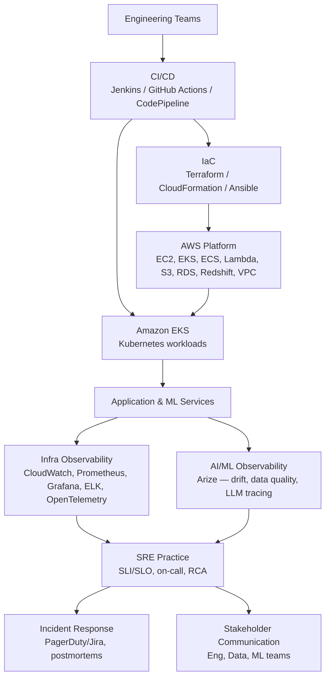

# Vanguard — SRE / AWS DevOps Engineer (Arize Observability)

## Table of Contents

1. [Original Job Description](#original-job-description)
2. [Gap Analysis vs. Your Resume](#gap-analysis-vs-your-resume)
3. [Reference Architecture](#reference-architecture)
4. [AWS Core Services for This Role](#aws-core-services-for-this-role)
5. [EKS Node Compute: Fargate vs. Cluster Autoscaler vs. Karpenter](#eks-node-compute-fargate-vs-cluster-autoscaler-vs-karpenter)
6. [SRE Fundamentals](#sre-fundamentals)
7. [Observability & Monitoring Stack](#observability--monitoring-stack)
8. [MLOps & AI Observability (Arize Deep Dive)](#mlops--ai-observability-arize-deep-dive)
9. [CI/CD & Infrastructure as Code](#cicd--infrastructure-as-code)
10. [Security & DevSecOps](#security--devsecops)
11. [Interview Questions](#interview-questions)
12. [Most Important Concepts to Know First](#most-important-concepts-to-know-first)
13. [30-Second Pitch](#30-second-pitch)

---

## Original Job Description

Must Have Technical/Functional Skills

For an SRE / AWS DevOps Engineer with Arize Observability, the candidate should have knowledge on AWS Cloud, DevOps, Reliability Engineering, Monitoring, MLOps, and AI Observability.

· AWS Cloud Services – EC2, EKS, ECS, Lambda, S3, RDS, Redshift, CloudWatch, IAM, VPC.

· Infrastructure as Code (IaC) – Terraform, AWS CloudFormation, Ansible.

· CI/CD Automation – Jenkins, GitHub Actions, GitLab CI/CD, AWS CodePipeline.

· Containerization & Orchestration – Docker, Kubernetes (EKS), Helm.

· Site Reliability Engineering (SRE) – SLI/SLO/SLA management, incident response, root cause analysis (RCA), reliability engineering.

· Monitoring & Observability – Arize AI, Prometheus, Grafana, Datadog, ELK Stack, OpenTelemetry, CloudWatch.

· MLOps & AI Observability – Arize platform, model monitoring, drift detection, model performance tracking, data quality monitoring, LLM observability.

· Programming & Scripting – Python, Bash, PowerShell, SQL.

· Security & DevSecOps – IAM, Secrets Manager, AWS Security Hub, vulnerability scanning, policy enforcement.

· Collaboration & Agile Delivery – Scrum, Jira, stakeholder communication, cross-functional incident management, technical documentation.

Roles & Responsibilities

SRE Lead with 8+ years of experience in building and managing scalable, secure, and highly available AWS cloud platforms leveraging DevOps, Kubernetes, and Infrastructure-as-Code practices.

· Experienced in implementing CI/CD pipelines, driving SRE best practices, and ensuring platform reliability through proactive monitoring, incident management, and performance optimization using CloudWatch, Prometheus, Grafana, and Arize.

· Strong collaborator with engineering, data, and ML teams, enabling MLOps, AI model observability, drift detection, and reliable deployment of production-grade AI/GenAI solutions.

[⬆ Back to top](#top)

---

## Gap Analysis vs. Your Resume

What you can already speak to confidently versus what needs fresh prep, based on your actual Citibank/Tech Consulting experience.

| JD Requirement | Your Standing | Prep Needed |
|---|---|---|
| EC2, VPC, S3, RDS, IAM, CloudWatch, EKS, Lambda | **Strong** — all directly on your resume (Citibank AVP role) | Just refresh specific numbers/examples for storytelling. |
| Terraform, CloudFormation, Ansible | **Strong** — Terraform modules, CloudFormation/Ansible workflows already on resume | None. |
| Jenkins, GitHub Actions, GitLab CI | **Strong** — all three named on resume | AWS CodePipeline specifically isn't on your resume — be ready to speak to it conceptually (it's Jenkins/GitHub Actions-equivalent, AWS-native, stage-based). |
| Docker, Kubernetes (EKS), Helm | **Strong** — EKS multi-tenant clusters, RBAC, namespace isolation on resume | None. |
| Prometheus, Grafana, ELK/OpenSearch, CloudWatch | **Strong** — full-stack observability bullet on resume | Datadog and OpenTelemetry aren't named on your resume — know them conceptually (Datadog ≈ commercial CloudWatch+APM competitor; OpenTelemetry ≈ vendor-neutral instrumentation standard your existing Prometheus/Grafana stack could emit into). |
| Security Hub, IAM, vulnerability scanning | **Strong** — Security Hub, GuardDuty, Inspector, Qualys all on resume | Secrets Manager isn't explicitly named (you have KMS/Key Vault) — know the distinction (Secrets Manager = credential storage/rotation; KMS = encryption key management). |
| Python, Bash | **Strong** — plus PySpark/pandas from recent Big Data addition | PowerShell and SQL aren't on your resume — be ready with at least a working-knowledge answer for both. |
| SageMaker, model CI/CD, retraining pipelines | **Strong** — MLOps bullet (SageMaker, Azure ML, Vertex AI, model registries) and Bedrock/RAG work already on resume | None conceptually, but reframe it toward *monitoring* deployed models rather than just training/deploying them — this JD is observability-of-ML, not MLOps pipeline-building. |
| **SLI/SLO/SLA formal framework, error budgets, RCA** | **Moderate** — your bullets describe outcomes ("reduced incident detection/recovery 35%") but don't use SRE's formal vocabulary | Learn to *re-narrate* your existing incident/reliability work using SLI/SLO/error-budget language — see [SRE Fundamentals](#sre-fundamentals) below. |
| **Arize AI, drift detection, LLM observability** | **Gap** — not on your resume at all | This is the single most important thing to study before this interview — see the [deep dive](#mlops--ai-observability-arize-deep-dive) below. It's fine to be honest that you haven't used Arize specifically if asked directly, while showing you understand the *category* deeply (you've done adjacent work: OpenSearch/Bedrock RAG, model monitoring). |
| ECS, Redshift | **Gap** — EKS is on your resume but not ECS; RDS/DynamoDB but not Redshift | Know both conceptually: ECS = simpler AWS-native container orchestration vs. EKS's full Kubernetes API; Redshift = columnar OLAP data warehouse vs. RDS's OLTP relational databases. |
| Scrum, Jira, stakeholder communication | **Gap** — not mentioned on resume | Prepare 1–2 STAR stories about cross-functional incident coordination or stakeholder communication from your Citibank/Tech Consulting work — you've almost certainly done this, it just isn't written down. |

[⬆ Back to top](#top)

---

## Reference Architecture

[⬆ Back to top](#top)

---

## AWS Core Services for This Role

| Service | Key Features & Characteristics | Role in This JD | Interview Angle |
|---|---|---|---|
| **EC2** | Resizable virtual machines; foundation compute layer. | Hosting workloads not yet containerized, or specialized instance types. | Know instance families at a high level and when you'd choose EC2 over EKS/ECS/Lambda (steady-state, needs OS-level control). |
| **EKS** | Managed Kubernetes control plane. | Primary orchestration layer for containerized services and ML inference workloads. | Already your strongest area — be ready to discuss multi-tenant RBAC, namespace isolation, and node/pod-level troubleshooting from an SRE lens (not just "how to deploy"). |
| **ECS** | AWS-native container orchestration; simpler than Kubernetes, no separate control plane to manage. | An alternative to EKS for teams that don't need full Kubernetes API surface. | Be ready to explain the trade-off: ECS is operationally simpler (less to patch/manage) but loses Kubernetes' portability and ecosystem (Helm, operators, CRDs). |
| **Lambda** | Serverless, event-driven compute. | Glue code, event processing, lightweight automation around the platform. | Know when *not* to use it — long-running/steady-high-throughput workloads are cheaper on EKS/EC2 at scale. |
| **S3** | Object storage; the default backing store for most AWS data patterns. | Artifact storage, data lake layer for ML pipelines, Terraform state (if not using Terraform Cloud). | Know versioning + lifecycle policies + encryption-at-rest as a baseline talking point. |
| **RDS** | Managed relational databases (OLTP). | Application transactional data. | Contrast with Redshift below — this is the question most likely to come up. |
| **Redshift** | Managed columnar data warehouse (OLAP), built for large-scale analytical queries over historical data. | Feeding BI/analytics and potentially ML training data pipelines. | **Study this specifically** — it's not on your resume. Core distinction: RDS = row-based, low-latency transactional queries; Redshift = column-based, optimized for scanning huge datasets for aggregate/analytical queries. |
| **CloudWatch** | Native AWS metrics, logs, alarms. | Baseline infra observability layer, feeding into the broader Prometheus/Grafana/Arize stack. | Already strong — be ready to discuss CloudWatch alongside Prometheus (CloudWatch = AWS-native/managed, Prometheus = open-source/portable, many shops run both). |
| **IAM** | Identity and access control across every AWS service. | Least-privilege access for pipelines, engineers, and ML services. | Know workload identity/OIDC federation as the modern alternative to long-lived access keys — a strong SRE-lead-level answer. |
| **VPC** | Network isolation — subnets, route tables, security groups. | Network boundary for EKS clusters and data services. | Know the basics of public/private subnet design for an EKS cluster (control plane endpoints, NAT gateway for private node egress). |

[⬆ Back to top](#top)

---

## EKS Node Compute: Fargate vs. Cluster Autoscaler vs. Karpenter

Three different answers to "how does this EKS cluster get compute capacity" — a common SRE Lead-level question, and directly relevant to the ECS-vs-EKS gap flagged above.

| Aspect | AWS Fargate | Cluster Autoscaler | Karpenter |
|---|---|---|---|
| What it manages | Removes nodes entirely — AWS provisions compute per pod, no EC2 instances you see or manage | Scales node *count* within pre-defined EC2 Auto Scaling Groups / node groups | Directly provisions right-sized EC2 nodes on demand — no pre-defined node groups needed |
| Instance type flexibility | N/A — abstracted away | Limited to instance types defined in each node group ahead of time | Chooses optimal instance type/size/AZ per pending pod's actual requirements, including Spot |
| Scale-up speed | No node-provisioning delay, but pod startup itself can be slower than scheduling onto an already-warm node | Slower — waits on ASG scaling activity, launch template, node bootstrap/join | Faster — provisions instances directly via EC2 Fleet/RunInstances, skipping ASG overhead |
| Bin-packing / consolidation | Not applicable | Basic — scales down under-utilized nodes, not aggressively optimized | Continuously consolidates workloads onto fewer/cheaper nodes |
| Cost model | Pay per vCPU/memory-second per pod — zero idle-node cost, but typically higher per-unit price than a well-utilized EC2 fleet | Pay for whatever EC2 nodes are running, including some bin-packing slack | Pay for EC2 nodes, generally more cost-efficient due to tighter packing and native Spot integration |
| Operational burden | Lowest — zero node ops | Moderate — maintain node groups, instance types, launch templates | Low — define constraints (a `NodePool`), Karpenter handles instance selection |

**Use cases:**

- **Fargate** — zero infrastructure management, bursty/unpredictable workloads, or workloads needing hard per-pod isolation rather than bin-packed multi-tenant nodes.
- **Cluster Autoscaler** — mature EKS environments already standardized on ASG-based managed node groups, or where Karpenter isn't yet adopted. The "default, well-understood" choice, but slower and less cost-optimal.
- **Karpenter** — cost-optimization-focused EKS platforms, heavy Spot usage, varied pod resource shapes, or teams wanting faster scale-up latency. The more modern "platform engineering golden path" answer today.

This is exactly the kind of nuance an "SRE Lead" interviewer would probe on — being able to name all three and articulate the trade-off (not just "we use EKS") signals depth beyond basic EKS familiarity.

[⬆ Back to top](#top)

---

## SRE Fundamentals

| Concept | Definition | Why It Matters Here | How to Frame Your Existing Experience |
|---|---|---|---|
| **SLI (Service Level Indicator)** | A measured metric — e.g., request latency, error rate, availability %. | The raw signal every reliability conversation starts from. | Your CloudWatch/Prometheus/Grafana dashboards already measure SLIs — you just haven't labeled them that way. |
| **SLO (Service Level Objective)** | The target for an SLI — e.g., "99.9% of requests under 300ms." | The agreed bar that defines "reliable enough" for a given service. | Reframe "reduced incident detection/recovery time 35%" as: you improved the org's ability to *stay within* its SLOs. |
| **SLA (Service Level Agreement)** | A contractual/external commitment (often to a client or business unit) built on top of internal SLOs, usually with a penalty for breach. | The business-facing version of an SLO — what leadership and clients actually care about. | If any Citibank platform work had uptime/availability commitments to internal stakeholders, that's your SLA story. |
| **Error Budget** | The allowed amount of unreliability (100% − SLO) that funds how much risk/change velocity a team can afford. | The mechanism SRE uses to balance "ship fast" against "stay reliable" objectively instead of politically. | Frame your CI/CD and deployment-safety work (rollback strategies, staged rollouts) as respecting an implicit error budget even if it wasn't formalized. |
| **Root Cause Analysis (RCA)** | Structured post-incident investigation to find the actual underlying cause, not just the proximate trigger — "5 whys," blameless postmortems. | Table stakes for an SRE Lead — you'll likely be asked to walk through one you've led. | Prepare one specific incident: what broke, how you found the root cause, what changed afterward (a monitoring gap you closed, a runbook you wrote, a guardrail you added). |
| **Toil Reduction** | Manual, repetitive, automatable operational work that SRE practice explicitly tries to eliminate over time. | A core SRE Lead responsibility — showing you don't just fight fires, you reduce how many happen. | Your Terraform/Ansible automation work ("cutting manual provisioning ~45%") is literally toil reduction — use that exact framing. |
| **On-Call & Incident Response** | Structured rotation, escalation paths, and communication protocols during an active incident. | Directly named in the JD ("cross-functional incident management"). | Prepare a story about coordinating across teams (eng, data, ML) during a live incident, not just technically fixing it. |

[⬆ Back to top](#top)

---

## Observability & Monitoring Stack

| Tool | Key Features & Characteristics | Preferred Over the Alternative When |
|---|---|---|
| **CloudWatch** | AWS-native metrics/logs/alarms, zero extra infrastructure to run. | You want tight native integration with every AWS service with no separate operational overhead. |
| **Prometheus** | Open-source, pull-based metrics collection; the de facto Kubernetes-native standard (via `kube-state-metrics`, exporters). | You need portable, vendor-neutral metrics collection that works identically on any Kubernetes cluster, cloud or on-prem. |
| **Grafana** | Visualization/dashboarding layer, typically paired with Prometheus (and can also query CloudWatch, Datadog, and other sources). | You want one dashboard pane querying multiple backends (Prometheus + CloudWatch + Arize) rather than separate UIs per tool. |
| **Datadog** | Commercial, unified metrics/logs/APM/security platform with broad out-of-box integrations. | The org wants a single managed vendor covering infra + APM + security rather than assembling/maintaining an open-source stack. |
| **ELK / OpenSearch Stack** | Centralized log aggregation, search, and dashboarding (Elasticsearch/OpenSearch + Logstash/Fluentd + Kibana/OpenSearch Dashboards). | Log volume and full-text search needs exceed what metrics-only tools (Prometheus/CloudWatch) are built for. |
| **OpenTelemetry** | Vendor-neutral instrumentation standard for traces, metrics, and logs — the emerging default so you're not locked into one backend's SDK. | You want to instrument once and be able to send data to Prometheus, Datadog, or Arize (for LLM tracing) without re-instrumenting per backend. |

[⬆ Back to top](#top)

---

## MLOps & AI Observability (Arize Deep Dive)

Arize AI is a specialized **ML and LLM observability platform** — distinct from infra observability (CloudWatch/Prometheus) in that it monitors *model behavior and data*, not CPU/memory/latency. This is the part of the JD least covered by prior general DevOps/SRE experience, so it deserves the deepest prep.

| Concept | What It Means | Why It Matters |
|---|---|---|
| **Data Drift** | The distribution of production input data diverging from the distribution the model was trained on (measured via metrics like PSI — Population Stability Index — or KL/JS divergence). | A model can silently degrade in accuracy even with zero code changes, purely because the real world shifted — drift detection catches this before it shows up as a business-metric problem. |
| **Concept Drift** | The relationship between inputs and the correct output changing over time (the same input that used to mean X now means Y). | Distinct from data drift — the *inputs* can look normal while the model's underlying assumptions have become stale. |
| **Model Performance Monitoring** | Tracking accuracy/precision/recall/AUC (or business KPIs) on production predictions over time, once ground-truth labels become available. | Training-time metrics don't guarantee production performance — this closes that gap. |
| **Data Quality Monitoring** | Detecting missing values, schema changes, cardinality shifts, or out-of-range values in the features flowing into a model. | Most production ML incidents trace back to a data quality problem upstream, not the model itself. |
| **Embeddings & Vector Visualization** | For unstructured data (text, images) or LLM inputs, Arize projects high-dimensional embeddings (via UMAP) into visualizable clusters to spot drift/anomalies that raw feature-level metrics would miss. | Essential for LLM/GenAI observability where "features" don't exist in the traditional tabular sense. |
| **LLM Observability / Tracing** | Capturing full prompt→response traces (including intermediate steps in a RAG pipeline: retrieval, ranking, generation), latency, and token cost per call — Arize co-developed the OpenInference spec (built on OpenTelemetry) for this. | Directly relevant to your existing Bedrock/OpenSearch RAG experience — you understand the pipeline (retrieval + generation); Arize is the observability layer *over* that pipeline. |
| **LLM Evaluation** | Automated scoring of LLM outputs — often "LLM-as-judge" patterns, hallucination detection, relevance/toxicity scoring — run continuously against production traffic samples, not just offline test sets. | The AI-specific equivalent of an SLI for a traditional service — it's how you'd define "is the LLM behaving acceptably" as a monitorable, alertable signal. |
| **Arize Phoenix** | Arize's open-source companion library for local/notebook-based LLM tracing and evaluation, often used before/alongside the full commercial platform. | Worth namedropping if asked "have you used Arize" — even hands-on time with Phoenix (free, OSS) is a legitimate, honest way to show initiative. |

**How to talk about this honestly if you haven't used Arize specifically**: connect it to what you *have* done — Bedrock/OpenSearch RAG pipeline work, SageMaker model deployment, and general observability stack design (CloudWatch/Prometheus/Grafana). The pitch: "I've built the infrastructure and RAG pipelines that Arize would sit on top of, and the observability principles are the same ones I've applied at the infra layer — drift/data-quality monitoring is the ML-specific analog of the SLI/SLO discipline I already practice for infrastructure reliability."

[⬆ Back to top](#top)

---

## CI/CD & Infrastructure as Code

| Tool | Role in This JD | Your Standing |
|---|---|---|
| **Terraform** | Primary IaC tool implied by "Infrastructure-as-Code practices" in the role summary. | Strong — modules, remote state, policy gates all on resume. |
| **AWS CloudFormation** | AWS-native alternative/complement to Terraform. | Strong — already used alongside Ansible on resume. |
| **Ansible** | Configuration management/automation. | Strong — already on resume. |
| **Jenkins** | Traditional CI/CD orchestration. | Strong — already on resume. |
| **GitHub Actions** | Modern, Git-native CI/CD. | Strong — already on resume, including a migration-from-Jenkins story you can tell. |
| **GitLab CI/CD** | Alternative CI/CD platform, Git-native like GitHub Actions. | Strong — already on resume. |
| **AWS CodePipeline** | AWS-native CI/CD orchestration, integrates tightly with CodeBuild/CodeDeploy and other AWS services. | Gap — not named on your resume. Know it conceptually: stage-based pipeline (source → build → test → deploy) similar in shape to Jenkins/GitHub Actions but with native IAM-based permissions instead of external service connections. |

[⬆ Back to top](#top)

---

## Security & DevSecOps

| Concept | Role in This JD | Your Standing |
|---|---|---|
| **IAM** | Access control foundation across the whole platform. | Strong. |
| **Secrets Manager** | Centralized, rotatable secret storage for credentials, API keys, DB passwords. | Gap by name — you have KMS/Key Vault experience (encryption keys), which is adjacent but distinct from Secrets Manager (credential storage + automatic rotation). Know the difference cold. |
| **AWS Security Hub** | Centralized security findings aggregation across GuardDuty, Inspector, Config, etc. | Strong — already on resume. |
| **Vulnerability Scanning** | Container/AMI/dependency scanning. | Strong — Qualys, CrowdStrike, Tanium all on resume. |
| **Policy Enforcement** | Guardrails preventing non-compliant infrastructure from being deployed. | Strong — OPA/Sentinel Terraform gates on resume. |

[⬆ Back to top](#top)

---

## Interview Questions

### AWS & Infrastructure

**1. Walk me through how you'd design a highly available EKS platform on AWS.**
Multi-AZ node groups (or Fargate for hands-off scaling), a well-designed VPC with private subnets for worker nodes and a NAT gateway for egress, cluster autoscaling (Karpenter or Cluster Autoscaler) matched to workload demand, and IAM Roles for Service Accounts (IRSA) for least-privilege pod-level AWS access instead of broad node-level IAM roles.

**2. When would you choose ECS over EKS, or Redshift over RDS?**
ECS when you want AWS-native container orchestration without operating a Kubernetes control plane — simpler, less to patch, but you lose Kubernetes portability and its ecosystem (Helm, CRDs, operators). Redshift when the workload is analytical (OLAP) — large aggregate queries over historical data for BI/ML feature pipelines — versus RDS for low-latency transactional (OLTP) application data; picking the wrong one either kills query performance (RDS for analytics) or wastes cost/complexity (Redshift for simple transactional CRUD).

### SRE & Reliability

**3. How do you define and use an SLO in practice, and what happens when the error budget is exhausted?**
An SLO sets a measurable reliability target (e.g., 99.9% success rate) tied to an SLI; the error budget is the allowed 0.1% failure margin. When it's exhausted, the team shifts priority from shipping new features to reliability work until the budget recovers — this is meant to be a pre-agreed, objective trigger rather than an ad-hoc political argument after an incident.

**4. Walk me through a production incident you led, from detection to postmortem.**
Answer shape: how it was detected (alert source), initial triage/mitigation to restore service, the RCA process to find the actual root cause (not just the trigger), and — most important to an SRE Lead interviewer — what changed afterward: a new alert, a runbook, an automated guardrail, or a chaos-test added to catch the same failure mode earlier next time.

**5. How do you reduce toil on an SRE team, and how do you measure success?**
Identify repetitive manual operational work (manual provisioning, manual scaling, manual credential rotation) and automate it via IaC/CI-CD/self-healing — measured by tracking time spent on toil vs. project work over time, and by metrics like reduced MTTR or reduced manual-provisioning time (a number you already have: ~45% reduction from your Terraform/Ansible automation work).

### Observability & MLOps

**6. How is monitoring a deployed ML model different from monitoring a traditional microservice?**
A microservice's health is mostly captured by golden signals (latency, traffic, errors, saturation) that don't change in nature over time. A model's *code* can be unchanged while its real-world accuracy silently degrades due to data or concept drift — so ML monitoring needs an additional layer (drift detection, data quality checks, ground-truth performance tracking) on top of standard infra observability.

**7. How would you set up observability for a RAG-based LLM application?**
Answer shape: trace the full pipeline (query → retrieval → ranking → generation) using OpenTelemetry-based tracing (what Arize's OpenInference spec targets), track retrieval relevance/quality separately from generation quality, monitor latency and token cost per stage, and run continuous automated evaluation (LLM-as-judge or rule-based) against a sample of production traffic to catch hallucination or relevance regressions — not just relying on offline eval sets.

**8. "A model's accuracy dropped in production but nothing in the code changed — how do you investigate?"**
Answer shape: check for data drift first (has the input distribution shifted from training data — PSI/KL divergence), then data quality (missing values, schema changes, upstream pipeline changes), then concept drift (has the real-world relationship between inputs and correct outputs changed). This is exactly the class of problem Arize-style ML observability tooling exists to make visible quickly instead of discovering it weeks later via a business-metric complaint.

### Behavioral / Leadership

**9. "Tell me about a time you had to communicate a major incident to non-technical stakeholders."**
Prepare a specific story: what happened, how you translated technical impact into business terms, how you managed expectations on ETA, and how you closed the loop afterward — this JD explicitly calls out "cross-functional incident management" and "stakeholder communication," so a vague answer here stands out badly against otherwise strong technical answers.

**10. "How do you mentor or lead less senior engineers on your team?"**
Given the "SRE Lead" title, expect this. Prepare a concrete example — pairing on an incident, reviewing a Terraform PR and explaining *why* not just *what*, or building a runbook/template that codified your judgment so others could apply it without you in the room.

[⬆ Back to top](#top)

---

## Most Important Concepts to Know First

1. SLI / SLO / SLA / Error Budget
2. Blameless RCA / postmortems
3. Data drift vs. concept drift (PSI/KL divergence at a high level)
4. LLM observability / tracing (OpenTelemetry / OpenInference concept)
5. EKS multi-AZ, IRSA, autoscaling
6. ECS vs. EKS trade-off
7. Redshift vs. RDS (OLAP vs. OLTP)
8. Toil reduction as an SRE Lead responsibility
9. CloudWatch vs. Prometheus vs. Datadog positioning
10. Secrets Manager vs. KMS distinction
11. AWS CodePipeline shape (source → build → test → deploy)
12. Your own incident/RCA story, rehearsed and ready

[⬆ Back to top](#top)

---

## 30-Second Pitch

"I'm a cloud infrastructure engineer with 10+ years building and operating large-scale AWS platforms — Terraform-driven infrastructure, EKS-based Kubernetes workloads, and full-stack observability with CloudWatch, Prometheus, and Grafana, including work reducing incident detection and recovery time by 35% at Citibank. I've also built the AI/ML side of that platform — SageMaker and Bedrock-based RAG pipelines with OpenSearch — which maps directly onto this role's need for AI observability: I understand both the infrastructure reliability discipline (SLIs/SLOs, RCA, toil reduction) and the ML pipelines that platforms like Arize are built to monitor, even where Arize itself is a new tool for me specifically."

[⬆ Back to top](#top)
